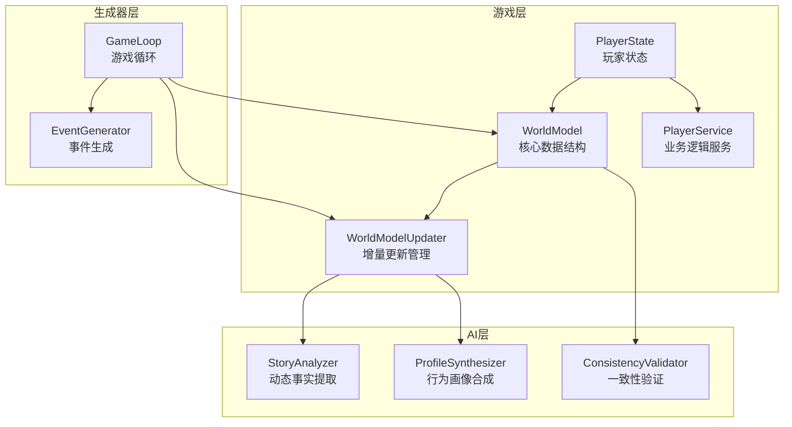
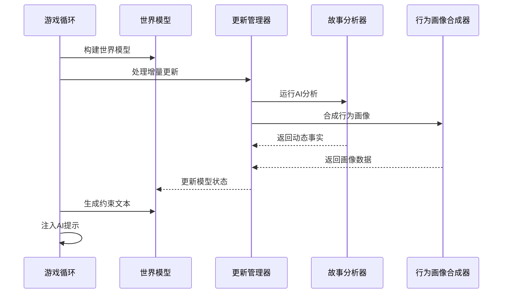
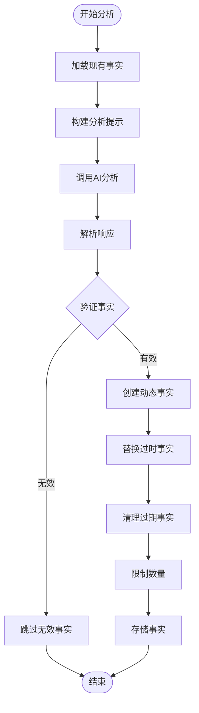
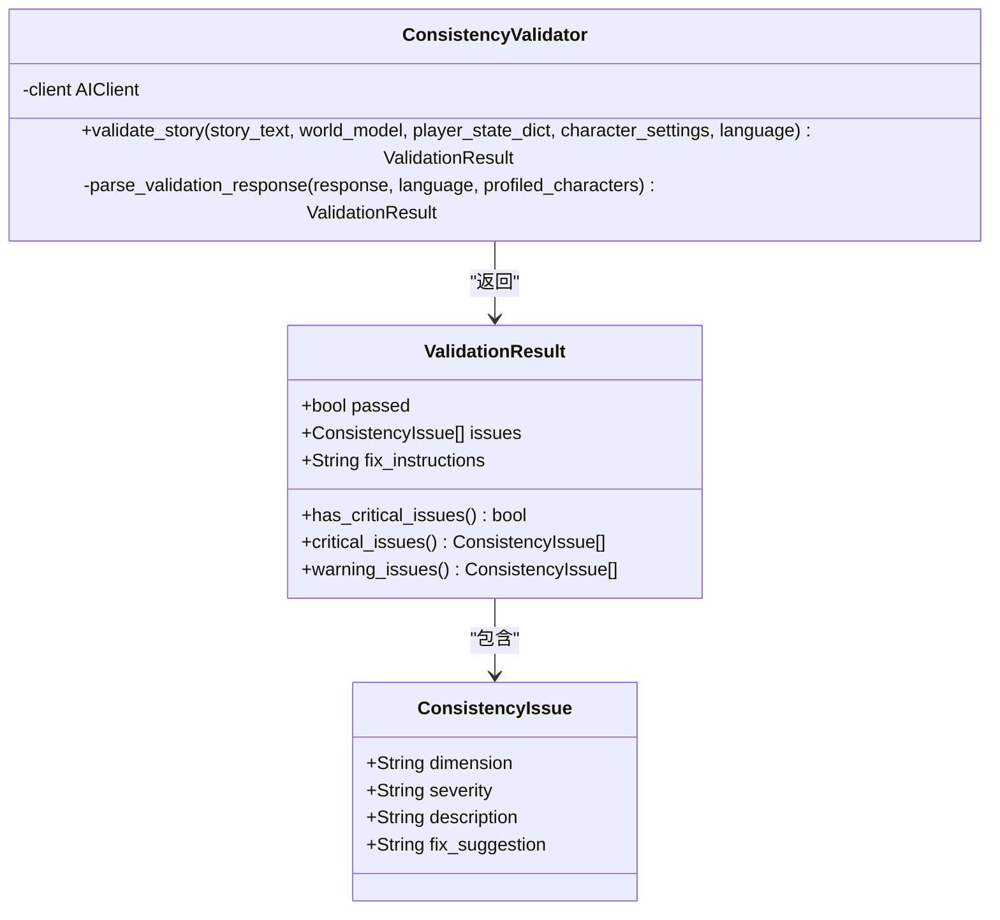
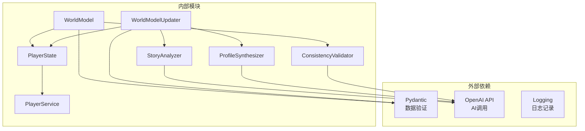

# 世界模型设计

<cite>
**本文档引用的文件**
- [world_model.py](file://src/game/world_model.py)
- [world_model_updater.py](file://src/game/world_model_updater.py)
- [state.py](file://src/game/state.py)
- [player_service.py](file://src/game/player_service.py)
- [story_analyzer.py](file://src/ai/story_analyzer.py)
- [profile_synthesizer.py](file://src/ai/profile_synthesizer.py)
- [consistency_validator.py](file://src/ai/consistency_validator.py)
- [game_loop.py](file://src/game/game_loop.py)
</cite>

## 目录
1. [引言](#引言)
2. [项目结构](#项目结构)
3. [核心组件](#核心组件)
4. [架构概览](#架构概览)
5. [详细组件分析](#详细组件分析)
6. [依赖关系分析](#依赖关系分析)
7. [性能考虑](#性能考虑)
8. [故障排除指南](#故障排除指南)
9. [结论](#结论)
10. [附录](#附录)

## 引言

世界模型是本项目的核心数据结构系统，负责维护和管理故事生成过程中所需的一致性约束信息。该系统通过结构化的数据模型，确保生成的故事在地理、职业、承诺、因果关系、身体状态等多个维度上保持逻辑一致性和叙事连贯性。

世界模型的设计目标是在保证故事质量的同时，提供灵活的扩展机制，允许开发者根据具体需求定制模型的行为和约束规则。系统采用增量更新策略，结合AI驱动的事实提取和行为画像合成，实现了智能化的世界状态管理。

## 项目结构

项目采用模块化架构，将世界模型相关的功能分布在多个专门的模块中：

**图表来源**
- [world_model.py](file://src/game/world_model.py#L185-L665)
- [world_model_updater.py](file://src/game/world_model_updater.py#L15-L528)
- [game_loop.py](file://src/game/game_loop.py#L24-L1231)

**章节来源**
- [world_model.py](file://src/game/world_model.py#L1-L665)
- [world_model_updater.py](file://src/game/world_model_updater.py#L1-L528)
- [state.py](file://src/game/state.py#L244-L709)

## 核心组件

### 数据结构体系

世界模型包含六个核心数据结构，每个都针对特定的叙事维度：

#### 地理位置信息 (LocationInfo)
维护角色的当前位置、区域信息和移动模式，支持居民、访问和旅行三种状态。

#### 职业记录 (CareerInfo)
跟踪角色的职业轨迹，包括当前职位、雇主、级别和历史变更记录。

#### 承诺事项 (Commitment)
记录角色之间的约定、承诺和义务，支持状态管理和截止日期控制。

#### 因果链条 (CausalChain)
维护行动与后果之间的因果关系，确保故事中的承诺得到适当的体现。

#### 身体状态 (PhysicalState)
记录角色的身体状况，如伤病、怀孕等，影响角色的行为能力和故事可能性。

#### 行为画像 (CharacterProfile)
基于AI合成的角色行为特征，包括性格特质、言语风格、决策模式等。

**章节来源**
- [world_model.py](file://src/game/world_model.py#L17-L162)

### 更新管理器

WorldModelUpdater负责处理各种类型的增量更新，包括位置变更、职业变动、承诺状态更新和因果关系管理。该组件采用静态方法设计，便于在不同上下文中调用。

**章节来源**
- [world_model_updater.py](file://src/game/world_model_updater.py#L15-L528)

## 架构概览

世界模型的架构设计体现了分层解耦的原则，通过清晰的职责分离实现了高度的模块化：

**图表来源**
- [game_loop.py](file://src/game/game_loop.py#L723-L748)
- [world_model.py](file://src/game/world_model.py#L381-L435)
- [world_model_updater.py](file://src/game/world_model_updater.py#L263-L354)

## 详细组件分析

### 世界模型核心类

WorldModel类是整个系统的核心，负责数据结构的组织、约束文本的生成和一致性检查：

#### 初始化与工厂方法
- 支持从PlayerState构建完整的世界模型
- 兼容传统established_facts格式和新的结构化数据格式
- 自动提取时代信息和当前周数

#### 约束文本生成
系统能够动态生成多维度的约束文本，包括：
- 地理位置约束：确保角色不会出现在不可能的地点
- 职业发展约束：限制不合理的职业跳跃和晋升速度
- 承诺履行约束：提醒故事中需要体现的未完成承诺
- 因果关系约束：确保行动后果得到适当体现
- 身体状态约束：反映角色的生理限制
- 动态事实约束：基于AI分析提取的关键信息
- 行为画像约束：维护角色的性格一致性

**章节来源**
- [world_model.py](file://src/game/world_model.py#L185-L665)

### 增量更新机制

WorldModelUpdater提供了完整的增量更新解决方案：

#### 位置更新处理
- 支持移动和确认两种操作模式
- 自动推导区域信息
- 记录移动原因和来源

#### 职业更新处理
- 管理职位变更的历史记录
- 验证级别有效性
- 维护晋升历史

#### 承诺更新处理
- 管理承诺的生命周期
- 支持完成、破坏、过期等状态
- 自动清理过期承诺

#### 因果链更新处理
- 跟踪行动与后果的关系
- 支持因果关系的解决
- 自动清理过期因果链

**章节来源**
- [world_model_updater.py](file://src/game/world_model_updater.py#L15-L528)

### AI驱动的功能增强

#### 动态事实提取
StoryAnalyzer通过AI分析生成的故事，自动提取关键事实和约束条件：

**图表来源**
- [story_analyzer.py](file://src/ai/story_analyzer.py#L111-L318)

#### 行为画像合成
ProfileSynthesizer从每周的故事证据中提取角色的行为特征：

- 收集行为证据（对话、选择、行为描述）
- 合成性格特质、言语风格、决策模式
- 生成行为边界和约束文本
- 维护证据计数和更新历史

**章节来源**
- [story_analyzer.py](file://src/ai/story_analyzer.py#L94-L318)
- [profile_synthesizer.py](file://src/ai/profile_synthesizer.py#L16-L85)

### 一致性验证系统

ConsistencyValidator提供AI驱动的一致性检查，确保生成的故事符合世界模型的约束：

**图表来源**
- [consistency_validator.py](file://src/ai/consistency_validator.py#L42-L231)

**章节来源**
- [consistency_validator.py](file://src/ai/consistency_validator.py#L1-L231)

## 依赖关系分析

世界模型系统的依赖关系体现了清晰的分层架构：

**图表来源**
- [world_model.py](file://src/game/world_model.py#L8-L12)
- [world_model_updater.py](file://src/game/world_model_updater.py#L8-L12)
- [story_analyzer.py](file://src/ai/story_analyzer.py#L17-L24)
- [profile_synthesizer.py](file://src/ai/profile_synthesizer.py#L6-L11)
- [consistency_validator.py](file://src/ai/consistency_validator.py#L2-L8)

**章节来源**
- [world_model.py](file://src/game/world_model.py#L1-L12)
- [world_model_updater.py](file://src/game/world_model_updater.py#L1-L12)

## 性能考虑

### 数据结构优化
- 使用dataclass减少内存开销和样板代码
- 字典查找优化常用查询操作
- 缓存机制避免重复计算

### AI调用优化
- 批量处理减少API调用次数
- 线程池并发执行多个AI任务
- 结果缓存避免重复分析

### 内存管理
- 动态事实的生命周期管理
- 行为画像的数量限制
- 自动清理过期数据

## 故障排除指南

### 常见问题诊断

#### 世界模型构建失败
- 检查PlayerState数据完整性
- 验证world_model_data格式正确性
- 确认字符设置数据可用性

#### AI分析错误
- 检查网络连接和API密钥
- 验证输入数据格式
- 查看日志获取详细错误信息

#### 更新冲突
- 检查并发更新竞争条件
- 验证数据一致性检查
- 确认更新顺序正确性

**章节来源**
- [world_model_updater.py](file://src/game/world_model_updater.py#L352-L354)
- [consistency_validator.py](file://src/ai/consistency_validator.py#L114-L117)

## 结论

世界模型设计通过结构化的数据模型、智能的AI增强功能和严格的约束验证机制，为复杂的故事生成系统提供了坚实的基础。系统的设计充分考虑了可扩展性和可维护性，为未来的功能扩展和技术演进预留了充足的空间。

该系统的核心价值在于：
- 提供多维度的一致性约束
- 支持智能化的事实提取和行为分析
- 实现灵活的增量更新机制
- 确保长期叙事的连贯性和可信度

## 附录

### 开发者指南

#### 添加新的约束类型
1. 在WorldModel中添加相应的数据结构
2. 实现相应的验证方法
3. 更新约束文本生成逻辑
4. 添加测试用例

#### 自定义AI分析规则
1. 修改StoryAnalyzer的提示模板
2. 更新DynamicFact的分类体系
3. 调整重要性评估逻辑
4. 测试新规则的有效性

#### 扩展行为画像功能
1. 在ProfileSynthesizer中添加新的特征维度
2. 更新角色画像的合成逻辑
3. 调整约束文本的生成规则
4. 测试画像的稳定性和准确性