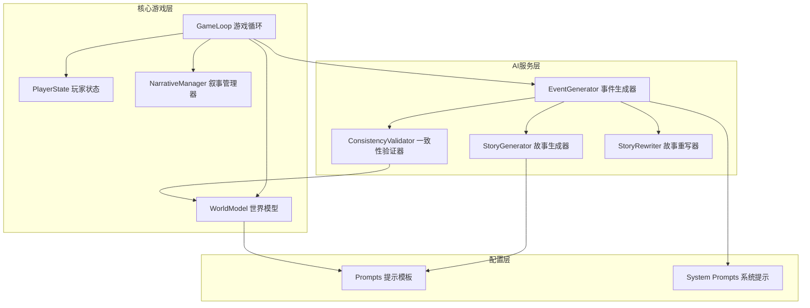
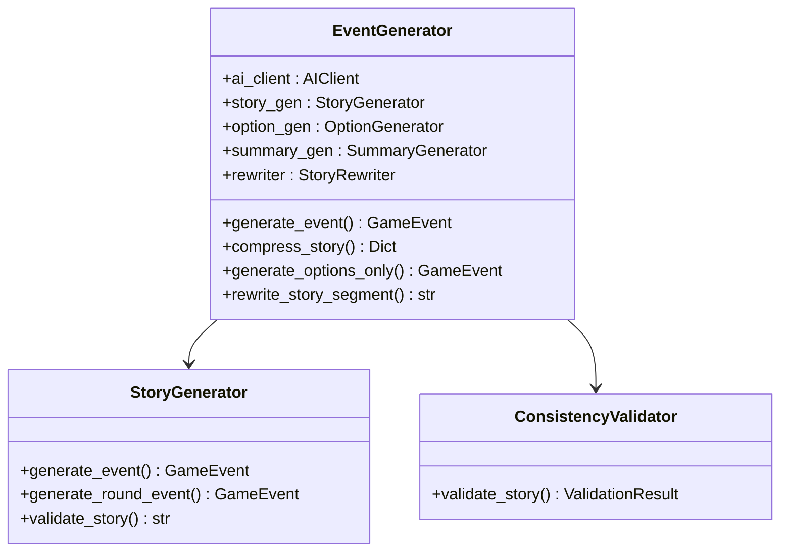
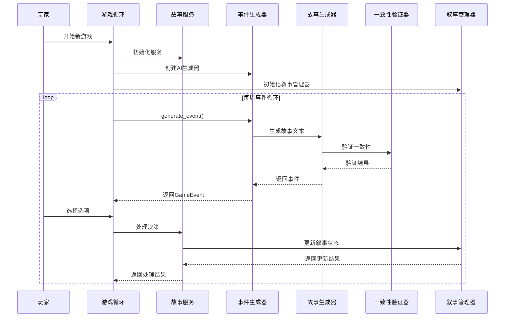
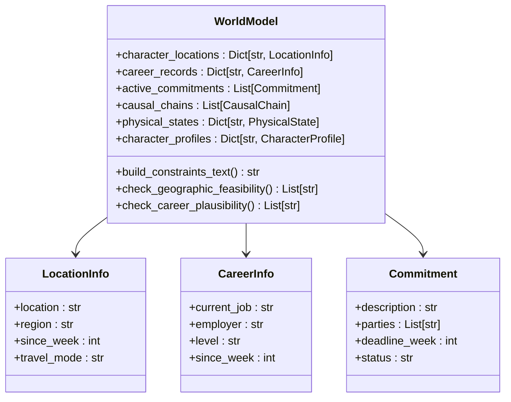
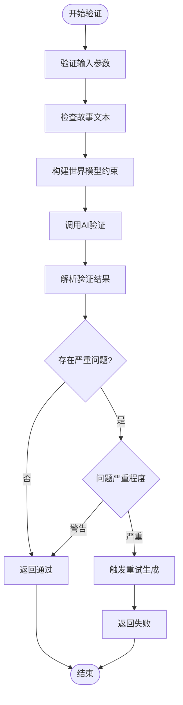
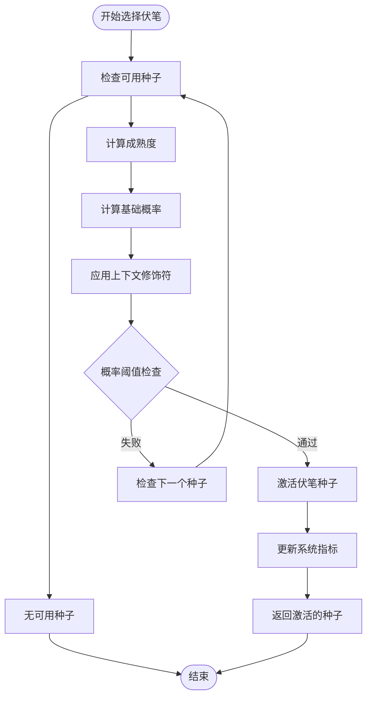
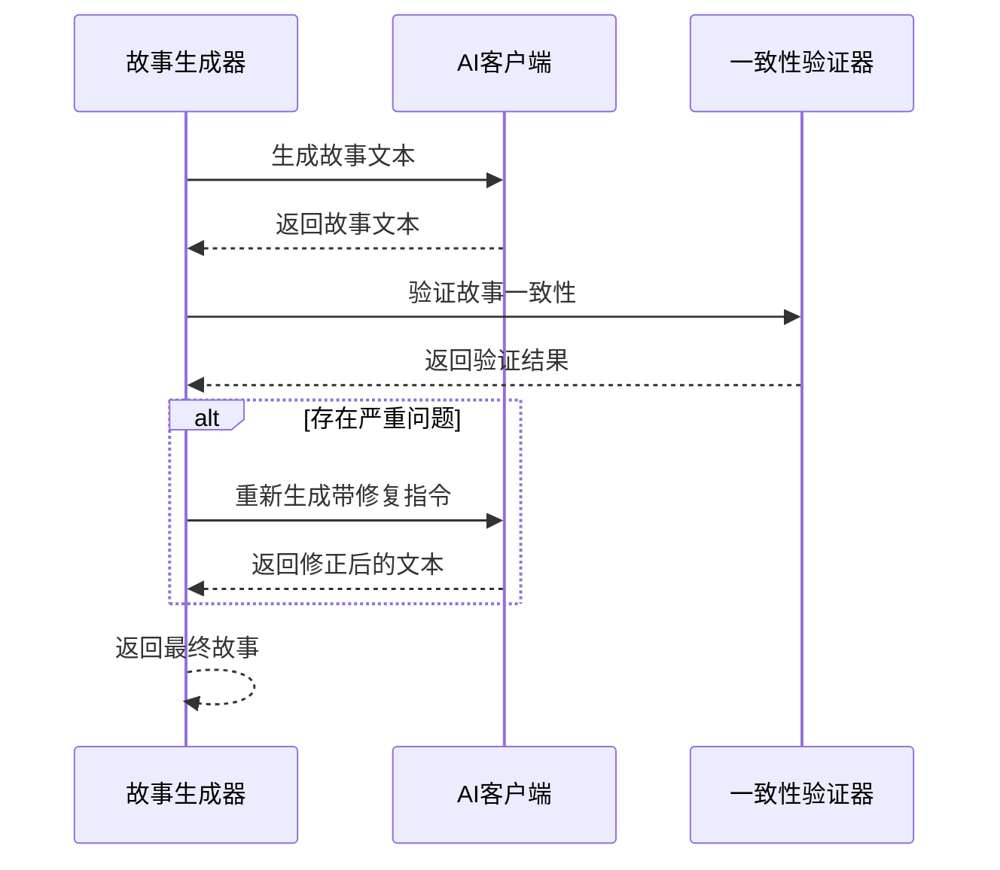
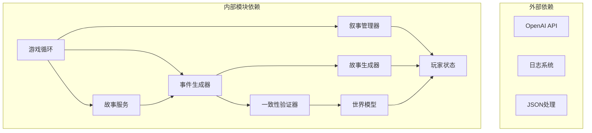

# 叙事管理系统

<cite>
**本文档引用的文件**
- [src/game/narrative_manager.py](file://src/game/narrative_manager.py)
- [src/game/story_service.py](file://src/game/story_service.py)
- [src/ai/story_generator.py](file://src/ai/story_generator.py)
- [src/ai/story_rewriter.py](file://src/ai/story_rewriter.py)
- [src/ai/consistency_validator.py](file://src/ai/consistency_validator.py)
- [src/ai/generator.py](file://src/ai/generator.py)
- [src/game/state.py](file://src/game/state.py)
- [config/prompts.py](file://config/prompts.py)
- [src/game/world_model.py](file://src/game/world_model.py)
- [src/game/game_loop.py](file://src/game/game_loop.py)
- [src/ai/system_prompts.py](file://src/ai/system_prompts.py)
</cite>

## 目录
1. [简介](#简介)
2. [项目结构](#项目结构)
3. [核心组件](#核心组件)
4. [架构概览](#架构概览)
5. [详细组件分析](#详细组件分析)
6. [依赖关系分析](#依赖关系分析)
7. [性能考虑](#性能考虑)
8. [故障排除指南](#故障排除指南)
9. [结论](#结论)
10. [附录](#附录)

## 简介

叙事管理系统是一个复杂的人工智能驱动的叙事引擎，专注于生成和管理动态的、连贯的故事情节。该系统通过多个相互协作的组件实现了高级的叙事功能，包括：

- **动态故事生成**：基于玩家状态和上下文生成沉浸式故事
- **叙事一致性维护**：确保故事的时间线连贯性和角色行为一致性
- **伏笔回响系统**：实现"草蛇灰线，伏脉千里"的叙事技巧
- **世界模型约束**：通过结构化的世界状态确保逻辑一致性
- **多维度叙事元素管理**：包括主题发展、情节转折、角色弧光等

该系统采用模块化设计，将复杂的叙事逻辑分解为可测试、可维护的独立组件。

## 项目结构



**图表来源**
- [src/game/game_loop.py](file://src/game/game_loop.py#L24-L61)
- [src/ai/generator.py](file://src/ai/generator.py#L30-L66)
- [src/game/narrative_manager.py](file://src/game/narrative_manager.py#L15-L16)

**章节来源**
- [src/game/game_loop.py](file://src/game/game_loop.py#L24-L61)
- [src/ai/generator.py](file://src/ai/generator.py#L30-L66)

## 核心组件

### NarrativeManager 叙事管理器

NarrativeManager 是叙事系统的核心控制器，负责管理故事线、世界事实、伏笔种子和角色习惯等叙事元素。

#### 主要功能模块

1. **故事线管理** (`process_storyline_updates`)
   - 处理新故事线的创建、解决和延续
   - 实现故事线的生命周期管理
   - 支持重要性等级和时效性控制

2. **世界事实管理** (`process_fact_updates`)
   - 维护世界一致性信息
   - 限制事实数量以优化性能
   - 支持事实的增删改操作

3. **伏笔回响系统** (`select_foreshadowing_seed`, `process_foreshadowing_seeds`)
   - 实现概率驱动的伏笔回响机制
   - 支持多种回收方式和隐蔽度控制
   - 维护伏笔系统的健康指标

4. **角色习惯追踪** (`process_habit_updates`)
   - 记录和管理角色的行为习惯
   - 支持习惯的强化、弱化和变更
   - 实现每角色习惯数量限制

**章节来源**
- [src/game/narrative_manager.py](file://src/game/narrative_manager.py#L15-L584)

### StoryService 故事服务

StoryService 提供故事相关的各种服务接口，包括故事续写、压缩、重写和总结等功能。

#### 核心服务接口

1. **故事续写生成** (`generate_story_continuation`)
   - 基于玩家选择生成详细的续写内容
   - 支持流式回调和错误回退机制
   - 集成AI生成和本地回退策略

2. **故事压缩** (`compress_story`)
   - 将完整故事压缩为100字符摘要
   - 评估故事线状态并提取更新信息
   - 支持并行友好的压缩接口

3. **自定义选择处理** (`generate_custom_choice_result`)
   - 处理玩家自定义输入的选择
   - 生成合理的故事结果和属性变化
   - 实现JSON解析和错误处理

**章节来源**
- [src/game/story_service.py](file://src/game/story_service.py#L11-L312)

### AI生成器体系

AI生成器体系提供了完整的AI驱动叙事功能，采用分层架构设计。

#### 事件生成器 (EventGenerator)

EventGenerator 作为门面模式的实现，协调各个专门的AI服务：



**图表来源**
- [src/ai/generator.py](file://src/ai/generator.py#L30-L66)
- [src/ai/story_generator.py](file://src/ai/story_generator.py#L24-L28)

**章节来源**
- [src/ai/generator.py](file://src/ai/generator.py#L30-L463)
- [src/ai/story_generator.py](file://src/ai/story_generator.py#L24-L387)

## 架构概览



**图表来源**
- [src/game/game_loop.py](file://src/game/game_loop.py#L154-L200)
- [src/ai/generator.py](file://src/ai/generator.py#L183-L238)
- [src/ai/story_generator.py](file://src/ai/story_generator.py#L32-L175)

## 详细组件分析

### 叙事一致性维护机制

系统通过多层次的验证机制确保叙事的一致性和逻辑合理性：

#### 世界模型约束系统

WorldModel 提供了结构化的世界状态管理：



**图表来源**
- [src/game/world_model.py](file://src/game/world_model.py#L185-L287)

#### 一致性验证流程

ConsistencyValidator 实现了多维度的验证机制：



**图表来源**
- [src/ai/consistency_validator.py](file://src/ai/consistency_validator.py#L60-L117)

**章节来源**
- [src/game/world_model.py](file://src/game/world_model.py#L185-L665)
- [src/ai/consistency_validator.py](file://src/ai/consistency_validator.py#L42-L231)

### 伏笔回响系统设计

系统实现了复杂的伏笔回响机制，支持多种隐蔽度和回收方式：

#### 伏笔回响概率计算



**图表来源**
- [src/game/narrative_manager.py](file://src/game/narrative_manager.py#L187-L285)

#### 伏笔回响类型和回收方式

系统支持六种类型的伏笔种子和五种回收方式：

| 伏笔类型 | 描述 | 隐蔽度示例 |
|---------|------|-----------|
| mystery | 神秘元素 | 低隐蔽度：明显线索<br>中隐蔽度：自然回响<br>高隐蔽度：极度隐晦 |
| relationship | 人际关系 | 根据关系密切程度调整 |
| warning | 警告预兆 | 随时间推移逐渐显现 |
| opportunity | 机会事件 | 通过巧合或重逢回收 |
| consequence | 后果事件 | 通过连锁反应显现 |
| character_return | 人物回归 | 通过再次出现回收 |

**章节来源**
- [src/game/narrative_manager.py](file://src/game/narrative_manager.py#L322-L345)
- [src/game/narrative_manager.py](file://src/game/narrative_manager.py#L382-L394)

### 故事生成流程

系统采用两阶段的生成流程确保故事质量：

#### 阶段一：故事文本生成



**图表来源**
- [src/ai/story_generator.py](file://src/ai/story_generator.py#L310-L373)

#### 阶段二：选项生成和验证

系统使用专门的选项生成器确保选项与故事情节紧密相关：

**章节来源**
- [src/ai/story_generator.py](file://src/ai/story_generator.py#L32-L175)
- [src/ai/system_prompts.py](file://src/ai/system_prompts.py#L34-L64)

### 角色习惯追踪系统

系统实现了精细的角色行为习惯追踪机制：

#### 习惯强度等级

| 强度等级 | 描述 | 对应数值 |
|---------|------|----------|
| emerging | 初现 | 0 |
| moderate | 明显 | 1 |
| strong | 根深蒂固 | 2 |

#### 习惯类别

| 类别 | 描述 | 示例 |
|------|------|------|
| behavioral | 行为习惯 | 准时、整洁、礼貌 |
| speech | 言语习惯 | 口音、口头禅、表达方式 |
| emotional | 情绪表达 | 内向、敏感、乐观 |
| social | 社交习惯 | 善于交际、独处偏好 |
| lifestyle | 生活习惯 | 运动、饮食、作息 |

**章节来源**
- [src/game/narrative_manager.py](file://src/game/narrative_manager.py#L431-L432)
- [src/game/narrative_manager.py](file://src/game/narrative_manager.py#L571-L576)

## 依赖关系分析



**图表来源**
- [src/game/game_loop.py](file://src/game/game_loop.py#L9-L18)
- [src/ai/generator.py](file://src/ai/generator.py#L17-L25)

**章节来源**
- [src/game/game_loop.py](file://src/game/game_loop.py#L9-L18)
- [src/ai/generator.py](file://src/ai/generator.py#L17-L25)

## 性能考虑

### 缓存策略

系统实现了多层次的缓存机制：

1. **事件缓存** (`EventCache`)：缓存生成的事件以避免重复计算
2. **提示模板缓存**：系统提示和模板的KV缓存前缀稳定
3. **世界模型缓存**：结构化数据的序列化和反序列化优化

### 内存管理

- **事实数量限制**：世界事实限制为50个，避免内存膨胀
- **活跃种子限制**：伏笔种子限制为20个，防止过多的回响干扰
- **习惯数量限制**：每角色限制10个习惯，确保追踪效率

### 并行处理

系统支持并发执行以提高性能：

```python
# 使用ThreadPoolExecutor进行并行处理
with ThreadPoolExecutor(max_workers=4) as executor:
    futures = []
    for round_num in range(3):
        future = executor.submit(self._generate_round_event, round_num)
        futures.append(future)
    
    for future in as_completed(futures):
        result = future.result()
        # 处理结果
```

## 故障排除指南

### 常见问题和解决方案

#### 1. 故事生成失败

**症状**：`ValueError: Failed to generate valid event after X attempts`

**解决方案**：
- 检查AI API密钥和配额
- 增加重试次数参数
- 简化提示模板
- 检查网络连接

#### 2. 一致性验证失败

**症状**：`CRITICAL`级别的验证问题

**解决方案**：
- 检查世界模型数据完整性
- 验证角色行为画像的合理性
- 确保故事内容符合约束条件
- 检查时间线和地理信息的准确性

#### 3. 伏笔回响不生效

**症状**：选择的伏笔种子没有被激活

**解决方案**：
- 检查种子的成熟度计算
- 验证隐蔽度设置是否合理
- 确认上下文匹配条件
- 检查概率计算逻辑

**章节来源**
- [src/ai/story_generator.py](file://src/ai/story_generator.py#L159-L173)
- [src/ai/consistency_validator.py](file://src/ai/consistency_validator.py#L347-L373)

## 结论

叙事管理系统通过精心设计的架构和算法实现了高质量的动态叙事体验。系统的主要优势包括：

1. **模块化设计**：清晰的职责分离使得系统易于维护和扩展
2. **一致性保障**：多层验证机制确保故事的逻辑合理性和连贯性
3. **灵活的叙事技巧**：伏笔回响系统支持复杂的叙事手法
4. **性能优化**：缓存策略和并行处理提高了系统效率
5. **可定制性**：丰富的配置选项允许开发者优化叙事质量

该系统为开发者提供了强大的工具来创建引人入胜的交互式叙事体验，同时保持了良好的性能和可维护性。

## 附录

### 配置选项

#### 系统配置参数

| 参数名称 | 默认值 | 描述 |
|---------|--------|------|
| CACHE_EVENTS | True | 是否启用事件缓存 |
| INITIAL_ENERGY | 70 | 初始精力值 |
| INITIAL_MOOD | 60 | 初始情绪值 |
| INITIAL_KNOWLEDGE | 50 | 初始学识值 |
| MIN_RESOURCE | 0 | 资源最小值 |
| MAX_RESOURCE | 100 | 资源最大值 |
| TOTAL_WEEKS | 48 | 游戏总周数 |

#### AI生成配置

| 参数名称 | 默认值 | 描述 |
|---------|--------|------|
| TEMPERATURE | 0.8-1.0 | 生成随机性控制 |
| MAX_TOKENS | 2000-4000 | 最大生成令牌数 |
| RETRY_COUNT | 1-3 | 重试次数 |
| STREAM_CALLBACK | None | 流式回调函数 |

### 开发最佳实践

1. **模块化开发**：遵循单一职责原则，每个模块专注于特定功能
2. **测试驱动**：为关键功能编写单元测试和集成测试
3. **性能监控**：定期监控AI调用成本和响应时间
4. **错误处理**：实现完善的异常处理和回退机制
5. **文档维护**：保持代码注释和API文档的及时更新