# 游戏引擎层设计

<cite>
**本文档引用的文件**
- [src/game/game_loop.py](file://src/game/game_loop.py)
- [src/game/state.py](file://src/game/state.py)
- [src/game/narrative_manager.py](file://src/game/narrative_manager.py)
- [src/game/world_model.py](file://src/game/world_model.py)
- [src/game/player_service.py](file://src/game/player_service.py)
- [src/game/decisions.py](file://src/game/decisions.py)
- [src/game/world_model_updater.py](file://src/game/world_model_updater.py)
- [src/game/historical_summary_selector.py](file://src/game/historical_summary_selector.py)
- [src/ai/generator.py](file://src/ai/generator.py)
- [config/settings.py](file://config/settings.py)
- [tests/test_game_loop.py](file://tests/test_game_loop.py)
- [tests/test_state.py](file://tests/test_state.py)
- [README.md](file://README.md)
</cite>

## 目录
1. [引言](#引言)
2. [项目结构](#项目结构)
3. [核心组件](#核心组件)
4. [架构概览](#架构概览)
5. [详细组件分析](#详细组件分析)
6. [依赖关系分析](#依赖关系分析)
7. [性能考虑](#性能考虑)
8. [故障排除指南](#故障排除指南)
9. [结论](#结论)

## 引言

本文档深入分析了"人生草稿本"游戏引擎层的设计与实现，重点围绕GameLoop核心层的架构实现进行详细说明。该系统是一个基于AI的文本化生活模拟游戏，通过智能事件生成、资源管理和决策制定来构建沉浸式的游戏体验。

系统采用模块化设计，将复杂的业务逻辑分解为多个专门的服务组件，实现了高内聚、低耦合的架构模式。核心设计目标包括：

- **事件调度与状态转换**：通过GameLoop统一管理游戏循环，实现事件生成、决策处理和状态推进
- **玩家状态管理**：提供完整的角色属性系统、关系网络和资源管理系统
- **叙事管理**：构建故事线、世界事实、伏笔系统和角色习惯追踪机制
- **世界模型**：维护地理、职业、承诺、因果链等结构化世界数据
- **AI集成**：通过事件生成器提供智能内容创作能力

## 项目结构

项目采用清晰的分层架构，主要目录结构如下：

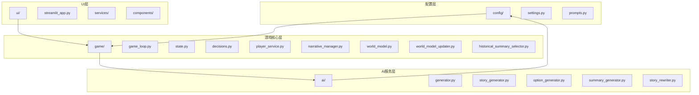

**图表来源**
- [src/game/game_loop.py](file://src/game/game_loop.py#L1-L1216)
- [src/ai/generator.py](file://src/ai/generator.py#L1-L431)

**章节来源**
- [README.md](file://README.md#L61-L73)

## 核心组件

### GameLoop - 游戏循环管理器

GameLoop是整个游戏引擎的核心协调者，负责管理游戏的完整生命周期。其主要职责包括：

- **事件生成管理**：控制每周事件的生成和调度
- **决策处理**：处理玩家的选择并更新游戏状态
- **状态推进**：管理周进度和游戏结束条件
- **AI集成**：协调各种AI服务进行内容生成
- **持久化管理**：处理游戏状态的保存和加载

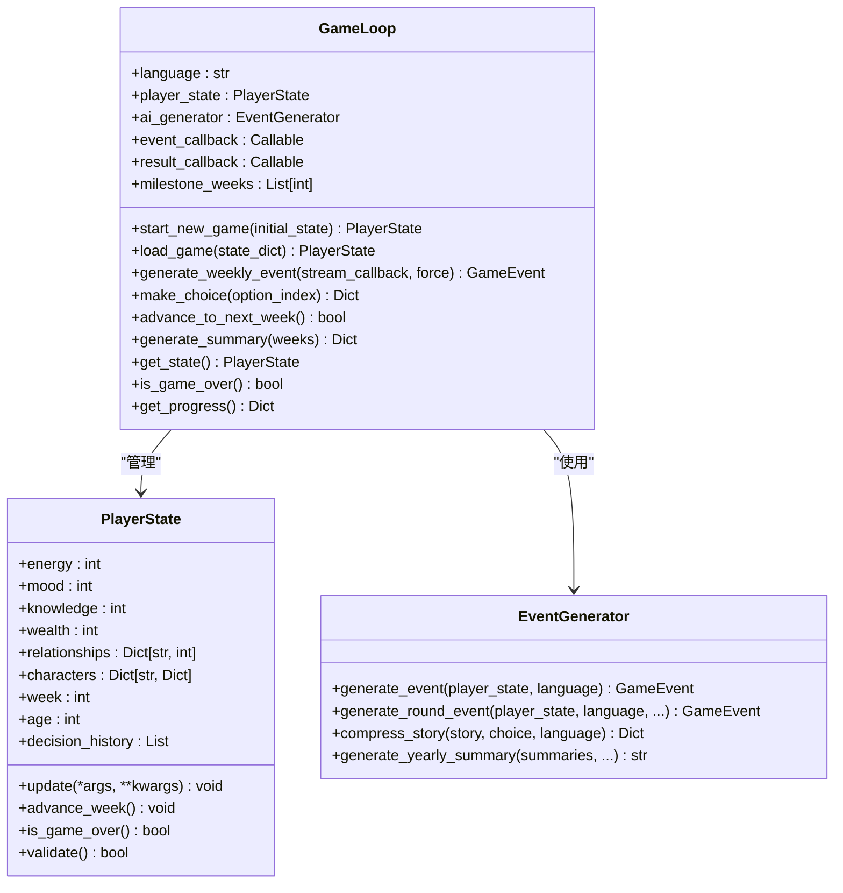

**图表来源**
- [src/game/game_loop.py](file://src/game/game_loop.py#L24-L571)
- [src/game/state.py](file://src/game/state.py#L244-L709)
- [src/ai/generator.py](file://src/ai/generator.py#L30-L431)

### PlayerState - 玩家状态管理

PlayerState是游戏的核心数据模型，采用Pydantic BaseModel实现强类型验证。它管理着玩家的所有状态信息：

- **基础属性**：能量、情绪、知识、财富等核心资源
- **关系系统**：与NPC的亲密度、信任度、尊重度等关系属性
- **角色管理**：NPC角色的状态和属性系统
- **时间追踪**：周数、年龄、生命阶段等时间相关信息
- **历史记录**：决策历史、故事历史、总结记录等

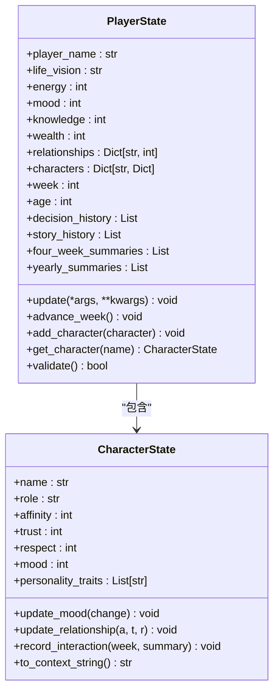

**图表来源**
- [src/game/state.py](file://src/game/state.py#L12-L709)

**章节来源**
- [src/game/state.py](file://src/game/state.py#L1-L709)

## 架构概览

系统采用分层架构设计，通过服务化的方式将复杂功能分解为可独立演进的模块：

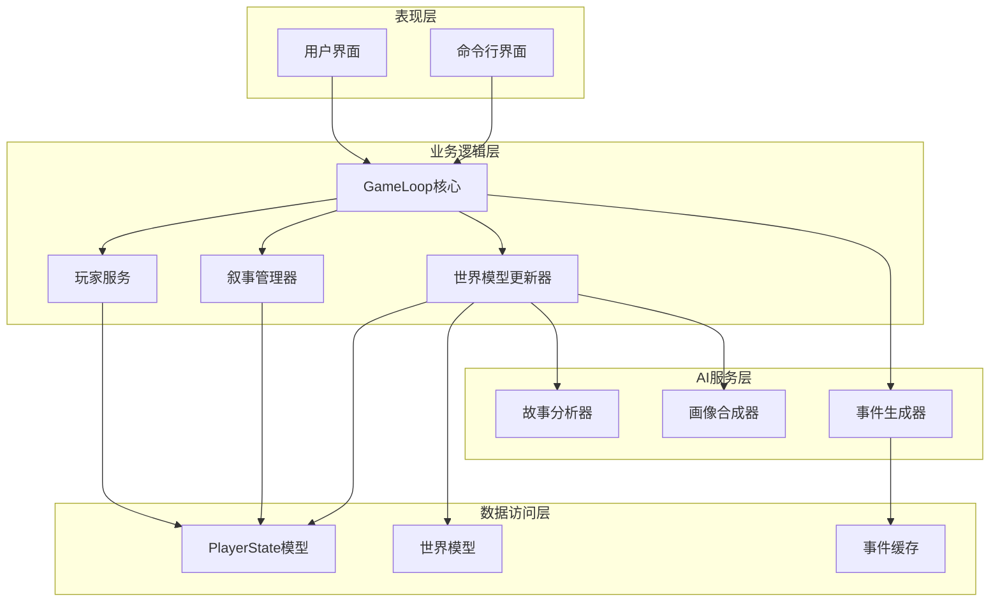

**图表来源**
- [src/game/game_loop.py](file://src/game/game_loop.py#L1-L1216)
- [src/game/player_service.py](file://src/game/player_service.py#L1-L176)
- [src/game/narrative_manager.py](file://src/game/narrative_manager.py#L1-L584)

### 事件调度机制

系统实现了智能的事件调度机制，确保游戏体验的连贯性和挑战性：

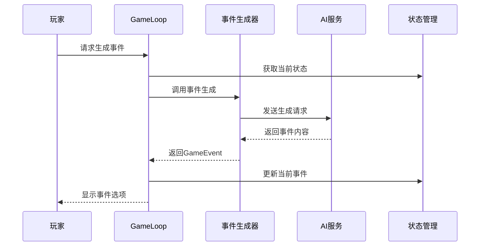

**图表来源**
- [src/game/game_loop.py](file://src/game/game_loop.py#L154-L257)
- [src/ai/generator.py](file://src/ai/generator.py#L183-L238)

### 决策处理流程

决策处理是游戏的核心交互机制，实现了复杂的因果关系和状态更新：

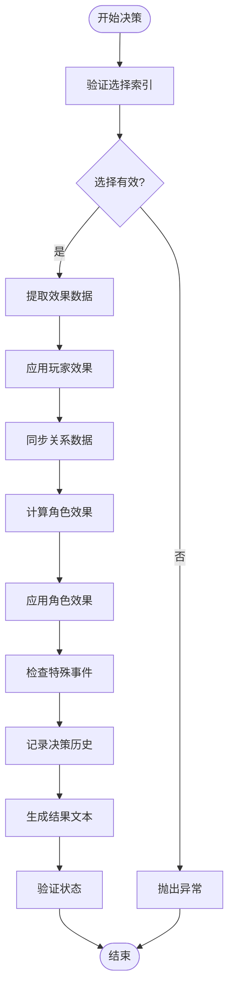

**图表来源**
- [src/game/decisions.py](file://src/game/decisions.py#L134-L239)

**章节来源**
- [src/game/decisions.py](file://src/game/decisions.py#L1-L270)

## 详细组件分析

### 叙事管理器 (NarrativeManager)

NarrativeManager负责管理游戏中的叙事元素，包括故事线、世界事实、伏笔系统和角色习惯追踪：

#### 故事线管理系统

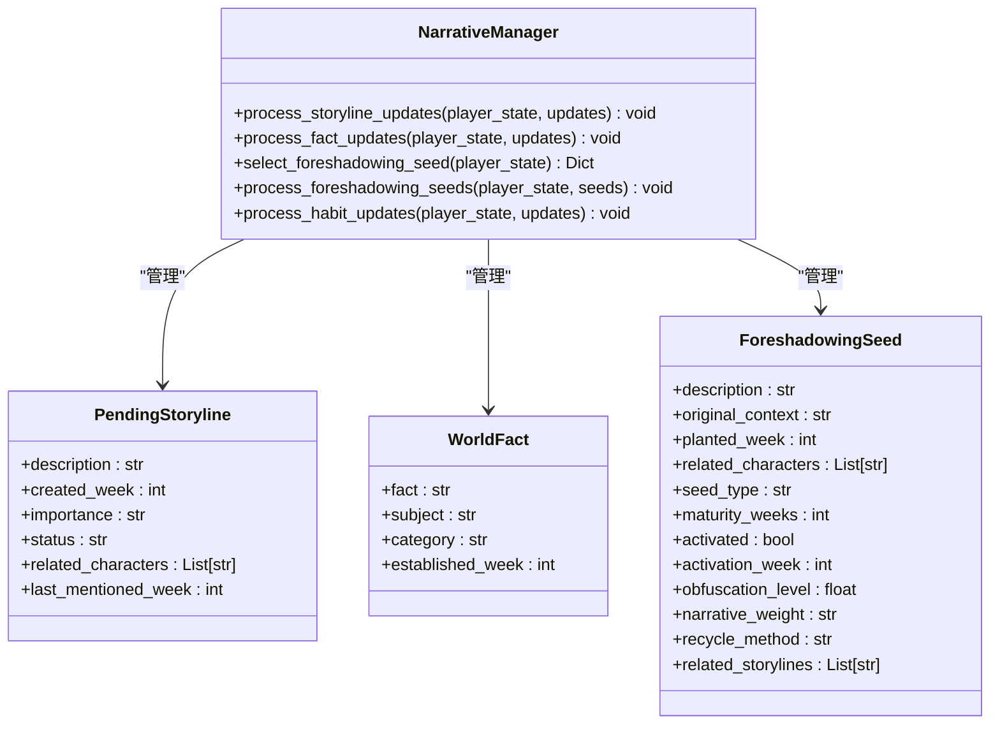

**图表来源**
- [src/game/narrative_manager.py](file://src/game/narrative_manager.py#L15-L584)

#### 伏笔系统设计

伏笔系统是叙事管理的核心创新，通过"草蛇灰线"机制增强故事的连贯性和深度：

- **成熟度计算**：基于时间延迟和隐蔽度计算激活概率
- **权重系统**：支持主要、支撑、次要三种叙事权重
- **回收机制**：提供揭示、确认、讽刺转折、升级、回响等多种回收方式
- **上下文匹配**：根据活跃故事线和角色关系调整激活概率

**章节来源**
- [src/game/narrative_manager.py](file://src/game/narrative_manager.py#L187-L285)

### 世界模型 (WorldModel)

WorldModel提供了结构化的世界数据管理，确保故事的一致性和可信度：

#### 数据结构设计

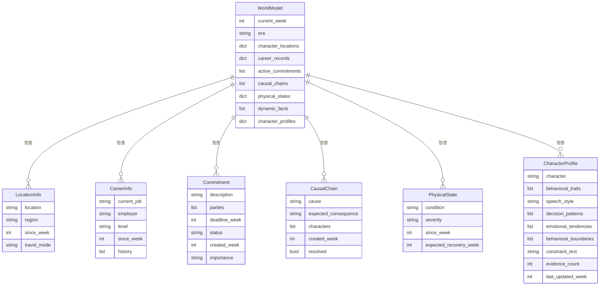

**图表来源**
- [src/game/world_model.py](file://src/game/world_model.py#L15-L665)

#### 一致性验证机制

WorldModel实现了多层次的一致性验证，确保故事内容的合理性：

- **地理可行性检查**：验证同一场景中角色的地理位置一致性
- **职业合理性检查**：确保职业晋升的合理性和时间连续性
- **承诺履行检查**：跟踪和验证承诺的履行情况
- **因果链完整性**：维护和追踪因果关系的发展

**章节来源**
- [src/game/world_model.py](file://src/game/world_model.py#L289-L435)

### 世界模型更新器 (WorldModelUpdater)

WorldModelUpdater负责增量更新世界模型，通过AI分析和手动输入相结合的方式维护世界数据的准确性：

#### 动态事实提取

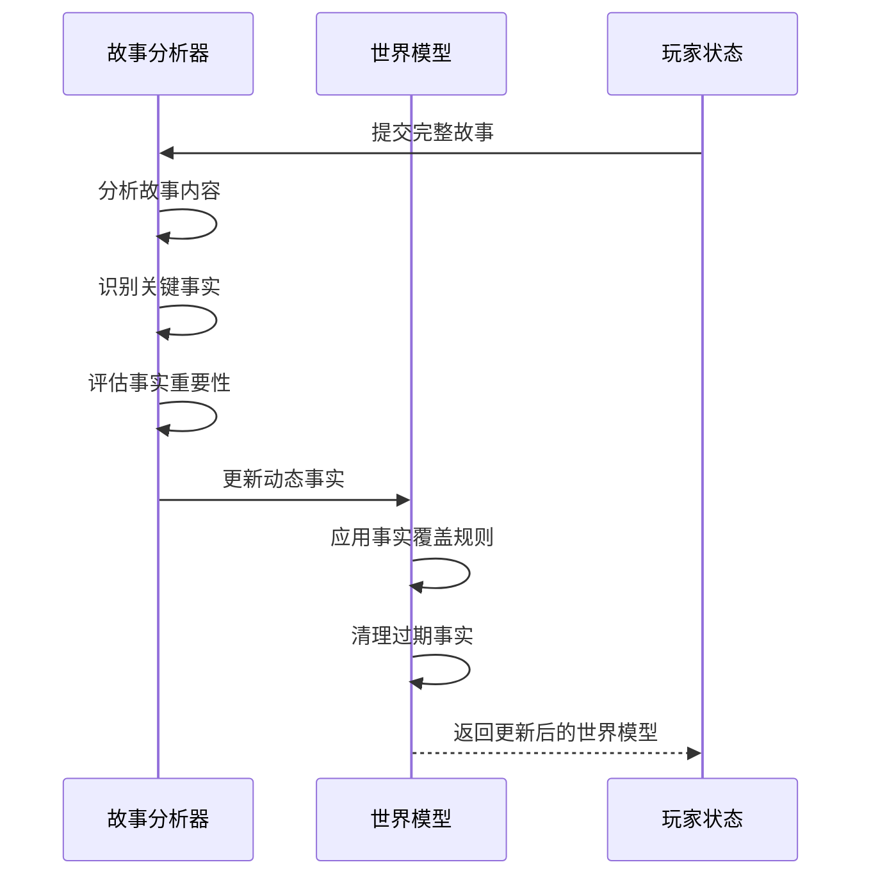

**图表来源**
- [src/game/world_model_updater.py](file://src/game/world_model_updater.py#L263-L354)

#### 角色画像合成

角色画像合成是AI驱动的个性化功能，通过分析角色行为模式构建详细的个性特征：

- **证据收集**：从多轮故事中提取角色行为证据
- **特征分析**：识别角色的性格特征、行为模式和情感倾向
- **画像生成**：构建包含行为特征、言语风格、决策模式的综合画像
- **持续更新**：随着故事发展不断更新和完善角色画像

**章节来源**
- [src/game/world_model_updater.py](file://src/game/world_model_updater.py#L359-L527)

### 历史摘要选择器 (HistoricalSummarySelector)

历史摘要选择器实现了智能的历史内容选择机制，提高AI生成内容的相关性和质量：

#### 相关性评分算法

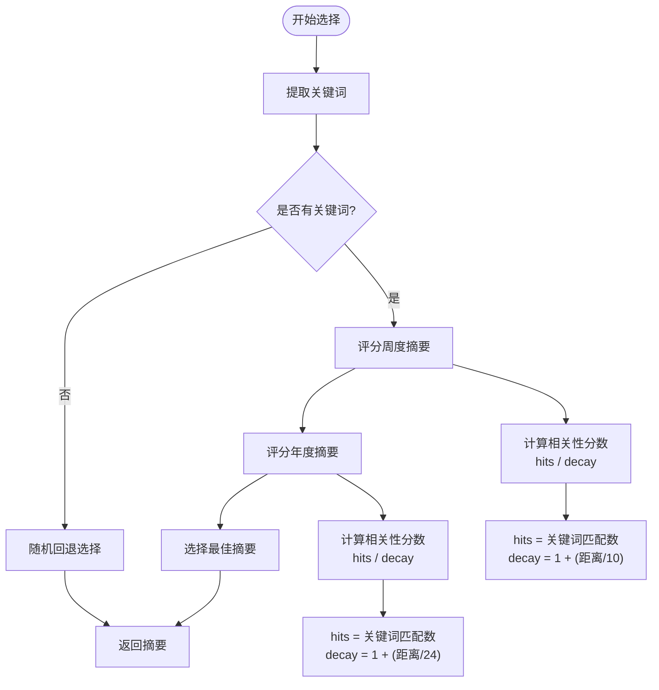

**图表来源**
- [src/game/historical_summary_selector.py](file://src/game/historical_summary_selector.py#L17-L153)

**章节来源**
- [src/game/historical_summary_selector.py](file://src/game/historical_summary_selector.py#L1-L206)

## 依赖关系分析

系统采用了清晰的依赖层次结构，通过接口抽象和依赖注入实现松耦合设计：

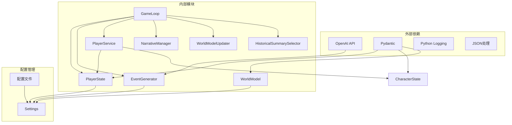

**图表来源**
- [src/game/game_loop.py](file://src/game/game_loop.py#L1-L21)
- [src/game/state.py](file://src/game/state.py#L1-L7)
- [src/ai/generator.py](file://src/ai/generator.py#L1-L27)
- [config/settings.py](file://config/settings.py#L1-L100)

### 设计模式应用

系统广泛采用了多种设计模式来提高代码质量和可维护性：

#### 外观模式 (Facade Pattern)
EventGenerator作为AI服务的外观类，简化了复杂的AI调用接口：

- **统一接口**：提供简化的公共方法
- **子系统协调**：协调多个AI子服务的工作
- **向后兼容**：保持原有API接口不变

#### 服务定位器模式 (Service Locator)
PlayerService将业务逻辑从数据模型中分离，提供服务化的操作接口：

- **关注点分离**：业务逻辑与数据模型解耦
- **可测试性**：便于单元测试和模拟
- **可扩展性**：支持功能的独立扩展

#### 工厂模式 (Factory Pattern)
GameLoop内部使用工厂模式创建各种服务实例：

- **对象创建**：集中管理对象的创建过程
- **配置灵活性**：支持运行时配置和服务替换
- **依赖注入**：支持测试和开发环境的配置

**章节来源**
- [src/ai/generator.py](file://src/ai/generator.py#L30-L66)
- [src/game/player_service.py](file://src/game/player_service.py#L9-L176)

## 性能考虑

系统在设计时充分考虑了性能优化，特别是在AI调用和数据处理方面：

### 缓存策略

- **事件缓存**：EventCache支持重复事件的快速检索
- **配置缓存**：预设事件和模板的内存缓存
- **AI响应缓存**：避免重复的AI调用

### 异步处理

- **并发执行**：使用ThreadPoolExecutor并行处理多个任务
- **流式输出**：支持AI生成的流式响应处理
- **异步回调**：事件生成和结果处理的异步通知机制

### 内存优化

- **数据结构优化**：使用高效的数据结构存储游戏状态
- **增量更新**：只更新发生变化的数据部分
- **对象池**：复用频繁创建的对象实例

## 故障排除指南

### 常见问题诊断

#### AI服务问题

**症状**：事件生成失败或响应超时
**解决方案**：
1. 检查OpenAI API密钥配置
2. 验证网络连接和API可用性
3. 查看日志中的错误信息
4. 调整重试参数和超时设置

#### 状态验证失败

**症状**：游戏状态验证抛出异常
**解决方案**：
1. 检查资源值是否超出范围
2. 验证关系数据的完整性
3. 确认时间戳的正确性
4. 检查序列化/反序列化过程

#### 内存泄漏问题

**症状**：长时间运行后内存使用持续增长
**解决方案**：
1. 检查事件缓存的清理机制
2. 验证对象引用的正确释放
3. 监控大对象的内存使用
4. 实施定期的垃圾回收

**章节来源**
- [tests/test_game_loop.py](file://tests/test_game_loop.py#L1-L76)
- [tests/test_state.py](file://tests/test_state.py#L1-L99)

## 结论

"人生草稿本"游戏引擎层展现了现代游戏开发的最佳实践，通过精心设计的架构实现了高度的模块化和可扩展性。系统的核心优势包括：

### 技术亮点

- **模块化设计**：清晰的职责分离和接口定义
- **AI集成**：智能内容生成与传统游戏机制的完美结合
- **数据一致性**：通过世界模型确保故事的连贯性和可信度
- **可扩展性**：支持功能的独立演进和新特性的快速添加

### 架构优势

- **高内聚低耦合**：每个模块都有明确的职责边界
- **可测试性**：良好的接口设计便于单元测试和集成测试
- **可维护性**：清晰的代码结构和文档支持长期维护
- **性能优化**：合理的缓存策略和异步处理机制

### 发展前景

系统为未来的功能扩展奠定了坚实的基础，包括：

- **多语言支持**：完整的国际化框架
- **社交功能**：支持多人协作和分享
- **数据分析**：提供玩家行为分析和个性化推荐
- **平台移植**：支持Web、移动端等多种平台

通过持续的优化和扩展，该系统有望成为AI驱动游戏开发的标杆案例，为玩家提供更加丰富和沉浸式的游戏体验。