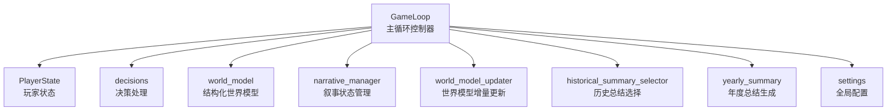
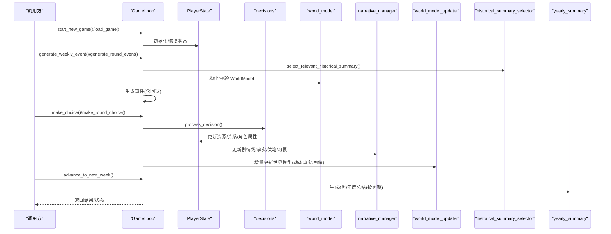
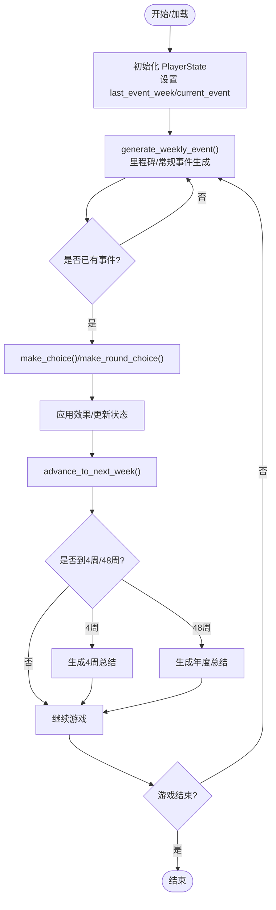
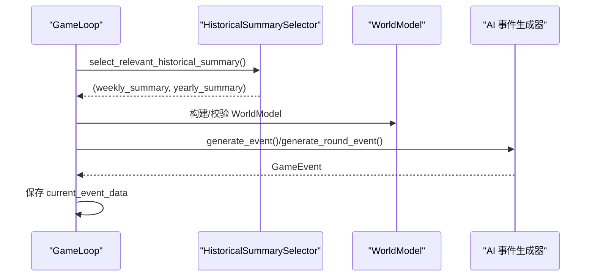
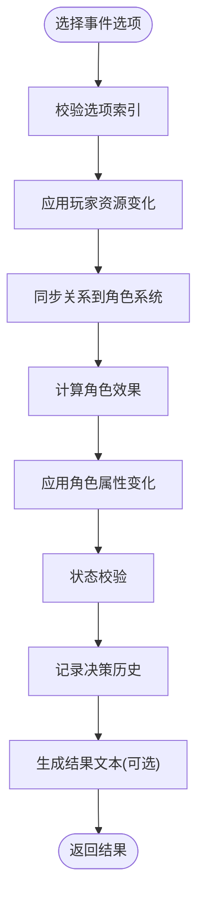
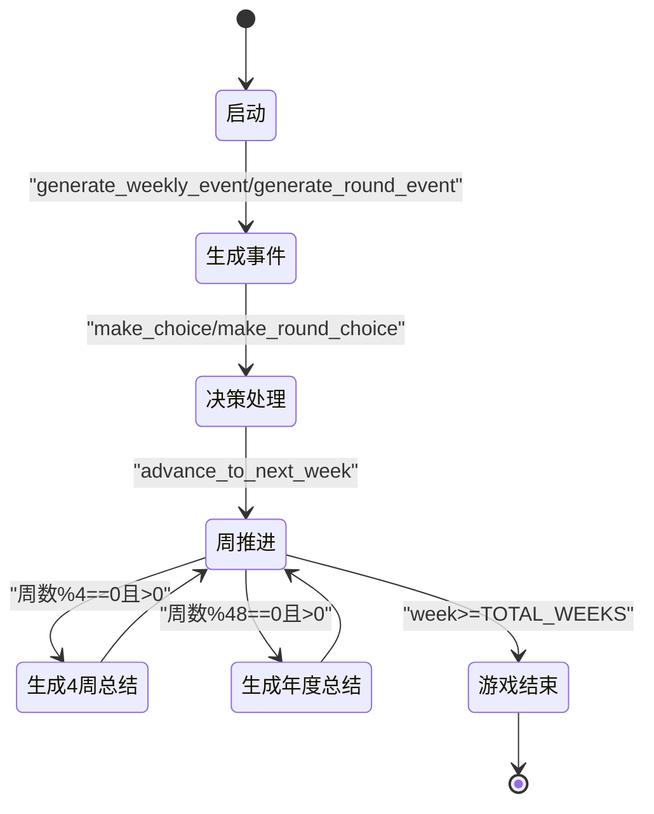
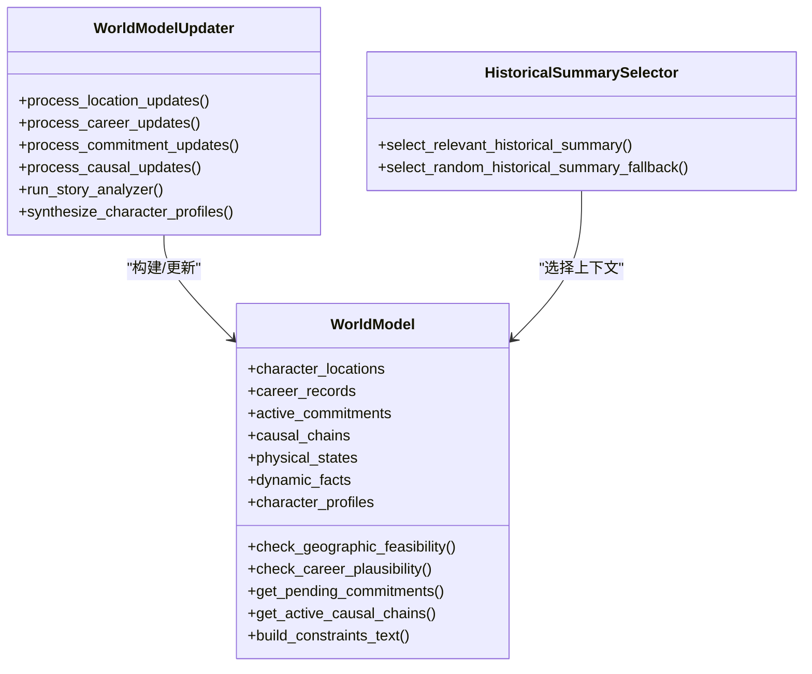
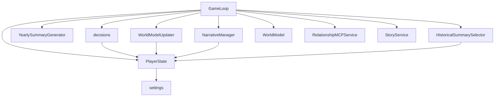

# 游戏循环管理

<cite>
**本文引用的文件**
- [src/game/game_loop.py](file://src/game/game_loop.py)
- [src/game/state.py](file://src/game/state.py)
- [src/game/decisions.py](file://src/game/decisions.py)
- [src/game/world_model.py](file://src/game/world_model.py)
- [src/game/narrative_manager.py](file://src/game/narrative_manager.py)
- [src/game/world_model_updater.py](file://src/game/world_model_updater.py)
- [src/game/historical_summary_selector.py](file://src/game/historical_summary_selector.py)
- [src/game/yearly_summary.py](file://src/game/yearly_summary.py)
- [config/settings.py](file://config/settings.py)
- [tests/test_game_loop.py](file://tests/test_game_loop.py)
- [tests/test_game_loop_deep.py](file://tests/test_game_loop_deep.py)
</cite>

## 目录
1. [简介](#简介)
2. [项目结构](#项目结构)
3. [核心组件](#核心组件)
4. [架构总览](#架构总览)
5. [详细组件分析](#详细组件分析)
6. [依赖关系分析](#依赖关系分析)
7. [性能考量](#性能考量)
8. [故障排查指南](#故障排查指南)
9. [结论](#结论)
10. [附录](#附录)

## 简介
本文件围绕游戏循环管理进行深入技术文档化，重点剖析 GameLoop 类的生命周期管理、事件调度机制、决策处理流程、状态转换逻辑与扩展方法。文档旨在帮助开发者快速理解并高效扩展游戏循环系统，涵盖从启动、加载、事件生成、决策处理到周推进、里程碑与年度总结的完整工作流。

## 项目结构
游戏循环管理位于 src/game 目录，核心文件如下：
- GameLoop：主循环控制器，负责启动、加载、事件生成、决策处理、周推进、里程碑与年度总结等
- PlayerState：玩家状态模型，承载资源、关系、角色、历史、总结、多轮系统等
- decisions：决策处理与结果生成，包含效果应用、角色属性变化、事件触发
- world_model：结构化世界模型，提供地点、职业、承诺、因果链、身体状态、动态事实与角色画像
- narrative_manager：叙事状态管理，负责剧情线、事实、伏笔种子、角色习惯的维护
- world_model_updater：世界模型增量更新器，负责位置、职业、承诺、因果链、动态事实与角色画像的合成
- historical_summary_selector：历史总结选择器，按相关性选择周/年总结注入上下文
- yearly_summary：年度总结生成器，基于年度变化与决策生成年度回顾
- settings：全局配置，包含语言、常量、衰减、数据库等

图表来源
- [src/game/game_loop.py](file://src/game/game_loop.py#L24-L1216)
- [src/game/state.py](file://src/game/state.py#L244-L709)
- [src/game/decisions.py](file://src/game/decisions.py#L1-L270)
- [src/game/world_model.py](file://src/game/world_model.py#L185-L665)
- [src/game/narrative_manager.py](file://src/game/narrative_manager.py#L15-L584)
- [src/game/world_model_updater.py](file://src/game/world_model_updater.py#L15-L528)
- [src/game/historical_summary_selector.py](file://src/game/historical_summary_selector.py#L14-L206)
- [src/game/yearly_summary.py](file://src/game/yearly_summary.py#L10-L170)
- [config/settings.py](file://config/settings.py#L30-L100)

章节来源
- [src/game/game_loop.py](file://src/game/game_loop.py#L24-L1216)
- [src/game/state.py](file://src/game/state.py#L244-L709)
- [config/settings.py](file://config/settings.py#L30-L100)

## 核心组件
- GameLoop：主循环控制器，封装启动、加载、事件生成、决策处理、周推进、里程碑与年度总结等
- PlayerState：状态模型，包含资源、关系、角色、历史、总结、多轮系统、世界模型数据、伏笔系统、习惯追踪等
- decisions：决策处理模块，负责效果应用、角色属性变化、事件触发与结果生成
- world_model：结构化世界模型，提供地点、职业、承诺、因果链、身体状态、动态事实与角色画像的数据结构与约束文本
- narrative_manager：叙事状态管理，负责剧情线、事实、伏笔种子、角色习惯的维护与清理
- world_model_updater：世界模型增量更新器，负责位置、职业、承诺、因果链、动态事实与角色画像的合成
- historical_summary_selector：历史总结选择器，按相关性选择周/年总结注入上下文
- yearly_summary：年度总结生成器，基于年度变化与决策生成年度回顾
- settings：全局配置，包含语言、常量、衰减、数据库等

章节来源
- [src/game/game_loop.py](file://src/game/game_loop.py#L24-L1216)
- [src/game/state.py](file://src/game/state.py#L244-L709)
- [src/game/decisions.py](file://src/game/decisions.py#L1-L270)
- [src/game/world_model.py](file://src/game/world_model.py#L185-L665)
- [src/game/narrative_manager.py](file://src/game/narrative_manager.py#L15-L584)
- [src/game/world_model_updater.py](file://src/game/world_model_updater.py#L15-L528)
- [src/game/historical_summary_selector.py](file://src/game/historical_summary_selector.py#L14-L206)
- [src/game/yearly_summary.py](file://src/game/yearly_summary.py#L10-L170)
- [config/settings.py](file://config/settings.py#L30-L100)

## 架构总览
GameLoop 作为主控制器，协调 PlayerState、decisions、world_model、narrative_manager、world_model_updater、historical_summary_selector、yearly_summary 等子系统，形成“事件生成—决策处理—状态更新—周推进—总结生成”的闭环。

图表来源
- [src/game/game_loop.py](file://src/game/game_loop.py#L62-L350)
- [src/game/decisions.py](file://src/game/decisions.py#L134-L239)
- [src/game/narrative_manager.py](file://src/game/narrative_manager.py#L22-L95)
- [src/game/world_model_updater.py](file://src/game/world_model_updater.py#L263-L354)
- [src/game/historical_summary_selector.py](file://src/game/historical_summary_selector.py#L18-L153)
- [src/game/yearly_summary.py](file://src/game/yearly_summary.py#L24-L82)

## 详细组件分析

### GameLoop 生命周期管理
- 启动与加载
  - start_new_game：初始化 PlayerState，支持从初始状态字典加载；若存在 character_settings，则从设置初始化角色；重置事件生成跟踪与当前事件
  - load_game：从保存状态恢复 PlayerState；若角色为空但存在 character_settings，尝试初始化；恢复 current_event（GameEvent）；根据 yearly_summaries 设置 last_year_start_week；根据决策历史与 current_event 设置 last_event_week
- 事件生成
  - generate_weekly_event：按周生成事件，支持强制生成；先检查里程碑事件（周数在 milestone_weeks），再调用 AI 生成常规事件；失败时回退到简单事件；保存 current_event_data 以便持久化
  - generate_round_event：多轮系统中按轮生成事件，结合历史总结、关系事件、世界模型进行约束与校验；失败时回退到轮次专用事件
- 决策处理
  - make_choice：验证选项索引，调用 process_decision 应用效果并生成结果文本；清空 current_event_data
  - make_round_choice：多轮决策处理，返回故事续写、压缩摘要、效果应用、周完成标志、周总结与额外效果
- 周推进与总结
  - advance_to_next_week：保存上一周故事至历史；应用每周衰减；推进周数；按周期生成4周/年度总结；检查游戏结束；清空 current_event
  - generate_summary：用户触发的 N 周总结，基于决策历史与状态变化生成
- 状态查询与进度
  - get_state/is_game_over/get_progress：提供状态访问与进度信息

图表来源
- [src/game/game_loop.py](file://src/game/game_loop.py#L62-L350)
- [src/game/game_loop.py](file://src/game/game_loop.py#L352-L436)

章节来源
- [src/game/game_loop.py](file://src/game/game_loop.py#L62-L350)
- [src/game/game_loop.py](file://src/game/game_loop.py#L352-L496)
- [tests/test_game_loop.py](file://tests/test_game_loop.py#L12-L75)
- [tests/test_game_loop_deep.py](file://tests/test_game_loop_deep.py#L36-L101)

### 事件调度机制
- 周事件与回合事件
  - 周事件：每轮周推进时生成一次，受 last_event_week 控制，避免重复生成；支持里程碑事件优先
  - 回合事件：多轮系统中，每轮（周一/周中/周末）生成一次，结合历史总结、关系事件、世界模型进行约束
- 里程碑事件
  - milestone_weeks=[20,40,60,80]，在这些周优先尝试生成里程碑事件；当前实现返回 None，可扩展为预设事件
- 历史总结注入
  - HistoricalSummarySelector：基于 pending_storylines、active_commitments、上一轮故事、伏笔种子提取关键词，计算相关性得分，选择最相关的周/年总结；无关键词时采用指数衰减随机回退
- 事件生成频率控制
  - last_event_week：记录上次生成周数，防止重复生成；force 参数可强制重新生成
  - 每周 EVENTS_PER_WEEK=1：限制每轮生成数量

图表来源
- [src/game/game_loop.py](file://src/game/game_loop.py#L154-L257)
- [src/game/game_loop.py](file://src/game/game_loop.py#L666-L779)
- [src/game/historical_summary_selector.py](file://src/game/historical_summary_selector.py#L18-L153)
- [src/game/world_model.py](file://src/game/world_model.py#L202-L287)

章节来源
- [src/game/game_loop.py](file://src/game/game_loop.py#L154-L257)
- [src/game/game_loop.py](file://src/game/game_loop.py#L666-L779)
- [src/game/historical_summary_selector.py](file://src/game/historical_summary_selector.py#L18-L153)
- [src/game/world_model.py](file://src/game/world_model.py#L202-L287)

### 决策处理流程
- 选项验证
  - make_choice/make_round_choice：校验选项索引合法性，避免越界
- 效果应用
  - process_decision：应用资源变化（能量、情绪、知识、财富）、关系变化；同步到角色系统；计算并应用角色属性变化（亲密度、信任、尊重、情绪）
- 状态更新与校验
  - 更新 PlayerState.decision_history；调用 PlayerState.validate() 进行边界校验；记录触发的角色特殊事件
- 结果生成
  - 可选 AI 生成结果文本；失败时回退到简单文本

图表来源
- [src/game/decisions.py](file://src/game/decisions.py#L134-L239)

章节来源
- [src/game/decisions.py](file://src/game/decisions.py#L134-L239)
- [tests/test_game_loop_deep.py](file://tests/test_game_loop_deep.py#L169-L191)

### 游戏状态转换逻辑
- 周结束检查
  - advance_to_next_week：保存上一周故事；应用每周衰减；推进周数；按周期生成4周/年度总结；清空 current_event
- 游戏结束条件
  - PlayerState.is_game_over：当 week >= settings.TOTAL_WEEKS（96周）时结束
- 进度跟踪
  - get_progress：返回周数、总周数、年龄与进度百分比

图表来源
- [src/game/game_loop.py](file://src/game/game_loop.py#L301-L350)
- [src/game/state.py](file://src/game/state.py#L562-L565)
- [config/settings.py](file://config/settings.py#L47-L48)

章节来源
- [src/game/game_loop.py](file://src/game/game_loop.py#L301-L350)
- [src/game/state.py](file://src/game/state.py#L562-L565)
- [config/settings.py](file://config/settings.py#L47-L48)

### 世界模型与一致性校验
- WorldModel：从 PlayerState 构建，包含地点、职业、承诺、因果链、身体状态、动态事实、角色画像等；提供地理可行性、职业合理性、承诺到期、因果链、身体状态一致性等校验
- WorldModelUpdater：增量更新地点、职业、承诺、因果链、动态事实与角色画像；支持并发合成角色画像；限制事实与画像数量
- 历史总结选择：HistoricalSummarySelector 基于关键词相关性选择周/年总结，提高上下文相关性

图表来源
- [src/game/world_model.py](file://src/game/world_model.py#L185-L665)
- [src/game/world_model_updater.py](file://src/game/world_model_updater.py#L15-L528)
- [src/game/historical_summary_selector.py](file://src/game/historical_summary_selector.py#L14-L206)

章节来源
- [src/game/world_model.py](file://src/game/world_model.py#L185-L665)
- [src/game/world_model_updater.py](file://src/game/world_model_updater.py#L15-L528)
- [src/game/historical_summary_selector.py](file://src/game/historical_summary_selector.py#L14-L206)

### 年度总结与进度回顾
- YearlySummaryGenerator：基于年度变化（资源、年龄）与决策生成年度总结；支持中英文；回退到简单总结
- 4周/年度总结：按周期自动生成，注入到 PlayerState.four_week_summaries/weekly_summaries

章节来源
- [src/game/yearly_summary.py](file://src/game/yearly_summary.py#L10-L170)
- [src/game/game_loop.py](file://src/game/game_loop.py#L352-L436)

## 依赖关系分析
- GameLoop 依赖 PlayerState、decisions、AI 事件生成器、YearlySummaryGenerator、NarrativeManager、WorldModelUpdater、HistoricalSummarySelector、RelationshipMCPService、StoryService、WorldModel
- PlayerState 依赖 settings；角色系统委托给 PlayerService（在 state.py 中通过导入调用）
- decisions 依赖 PlayerState 与 AI 生成器；角色效果计算与应用
- world_model/world_model_updater 提供结构化数据与约束文本；与 PlayerState 的 world_model_data 协作
- narrative_manager/historical_summary_selector 与 PlayerState 的 pending_storylines、established_facts、foreshadowing_seeds、character_habits 协作

图表来源
- [src/game/game_loop.py](file://src/game/game_loop.py#L24-L1216)
- [src/game/state.py](file://src/game/state.py#L244-L709)
- [src/game/decisions.py](file://src/game/decisions.py#L1-L270)
- [src/game/world_model_updater.py](file://src/game/world_model_updater.py#L15-L528)
- [src/game/narrative_manager.py](file://src/game/narrative_manager.py#L15-L584)
- [src/game/historical_summary_selector.py](file://src/game/historical_summary_selector.py#L14-L206)
- [src/game/yearly_summary.py](file://src/game/yearly_summary.py#L10-L170)
- [config/settings.py](file://config/settings.py#L30-L100)

章节来源
- [src/game/game_loop.py](file://src/game/game_loop.py#L24-L1216)
- [src/game/state.py](file://src/game/state.py#L244-L709)
- [src/game/decisions.py](file://src/game/decisions.py#L1-L270)
- [src/game/world_model_updater.py](file://src/game/world_model_updater.py#L15-L528)
- [src/game/narrative_manager.py](file://src/game/narrative_manager.py#L15-L584)
- [src/game/historical_summary_selector.py](file://src/game/historical_summary_selector.py#L14-L206)
- [src/game/yearly_summary.py](file://src/game/yearly_summary.py#L10-L170)
- [config/settings.py](file://config/settings.py#L30-L100)

## 性能考量
- 事件生成与回退：AI 失败时回退到简单事件，保证稳定性；可通过优化提示词与缓存减少失败率
- 历史总结选择：相关性评分与指数衰减随机回退，平衡上下文质量与计算成本
- 多轮系统：并发合成角色画像（ThreadPoolExecutor），限制并发数量与输出数量，控制 AI 调用成本
- 周期性总结：按 4 周/48 周生成，避免频繁 AI 调用
- 状态校验：每次决策后进行边界校验，防止状态异常导致后续错误

## 故障排查指南
- 未启动游戏仍调用方法
  - 现象：抛出“未启动”异常
  - 排查：确保先调用 start_new_game 或 load_game
- 重复生成事件
  - 现象：事件未生成或返回 None
  - 排查：检查 last_event_week 与 force 参数；确认周数推进逻辑
- 决策索引越界
  - 现象：抛出“无效选项索引”异常
  - 排查：确认事件选项数量与索引范围
- AI 生成失败
  - 现象：使用回退事件
  - 排查：检查网络与 API 密钥；查看日志中的异常信息
- 周末衰减
  - 现象：低能量/低情绪导致资源衰减
  - 排查：检查 settings.ENERGY_DECAY 与 settings.MOOD_DECAY；调整玩家行为策略

章节来源
- [tests/test_game_loop.py](file://tests/test_game_loop.py#L12-L75)
- [tests/test_game_loop_deep.py](file://tests/test_game_loop_deep.py#L109-L142)
- [src/game/game_loop.py](file://src/game/game_loop.py#L169-L179)
- [src/game/game_loop.py](file://src/game/game_loop.py#L268-L272)
- [src/game/game_loop.py](file://src/game/game_loop.py#L437-L449)

## 结论
GameLoop 通过清晰的生命周期管理、严谨的事件调度与决策处理、完善的周推进与总结机制，以及与世界模型、叙事状态、历史总结选择的协同，构建了一个可扩展、可维护的游戏循环系统。开发者可在现有基础上扩展里程碑事件、优化 AI 提示词、增强世界模型约束与角色画像合成，进一步提升叙事一致性与玩家沉浸感。

## 附录
- 使用模式建议
  - 启动：调用 start_new_game 或 load_game，随后 generate_weekly_event/generate_round_event
  - 决策：make_choice/make_round_choice，关注 effects 与触发事件
  - 周推进：advance_to_next_week，留意 4 周/48 周总结生成
  - 扩展：在 GameLoop 中新增里程碑事件、增强历史总结选择策略、优化世界模型约束文本