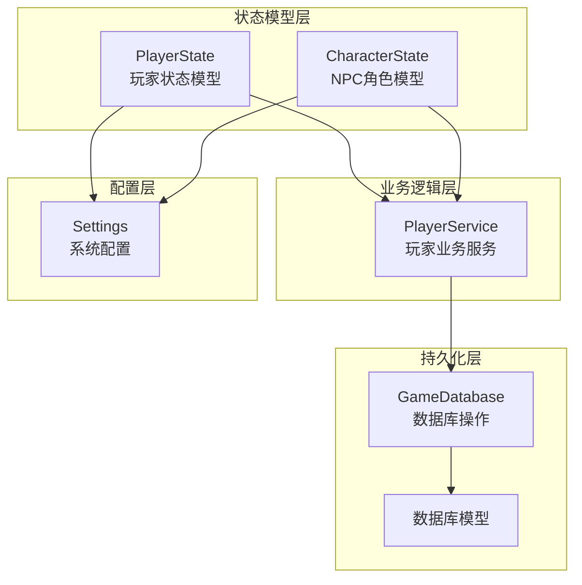
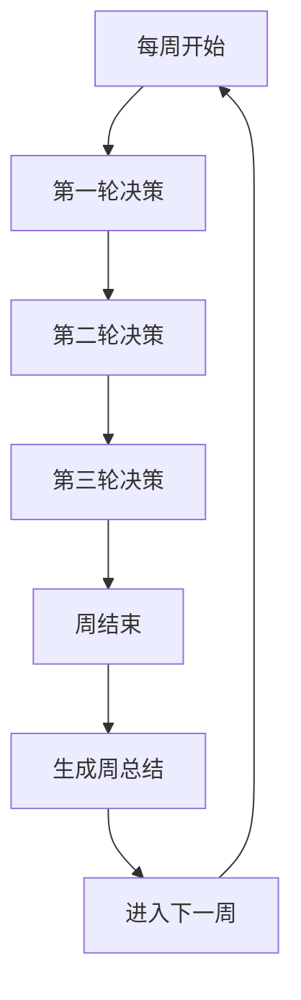
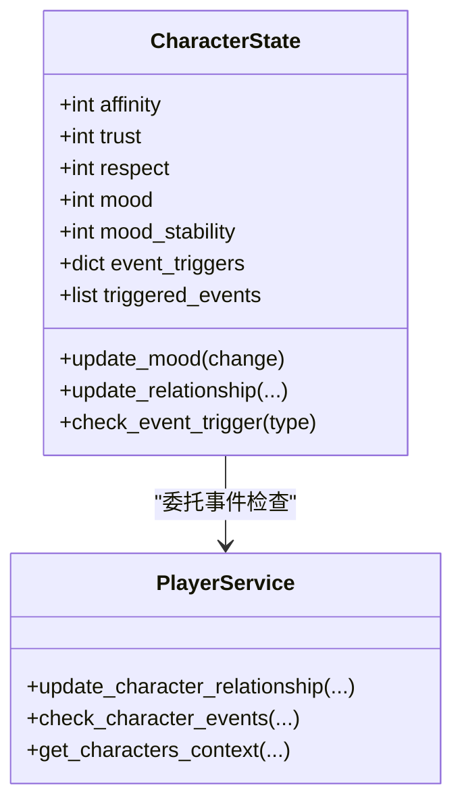
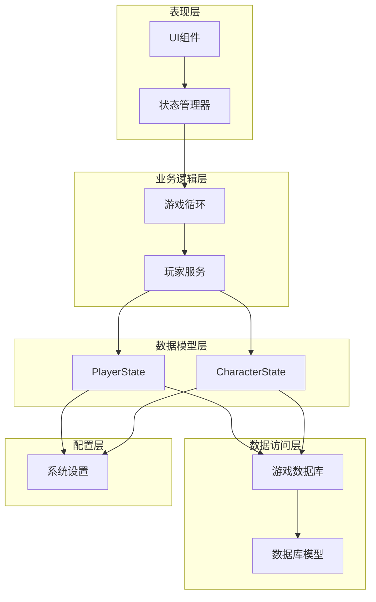
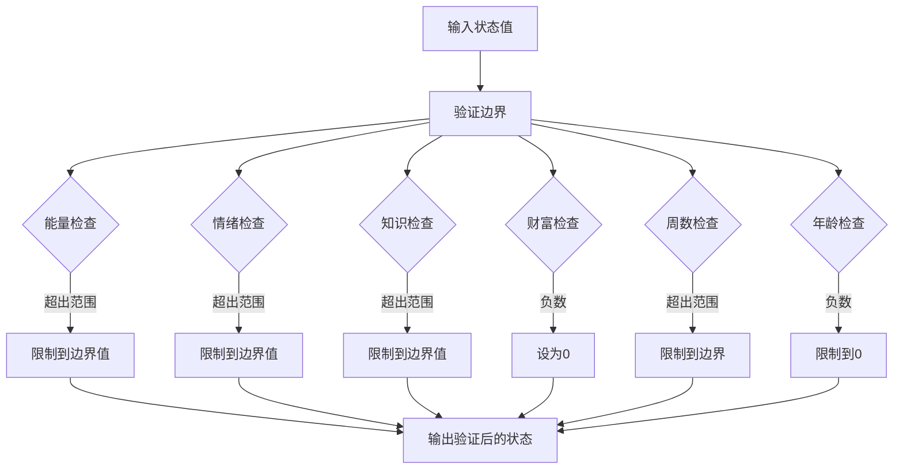
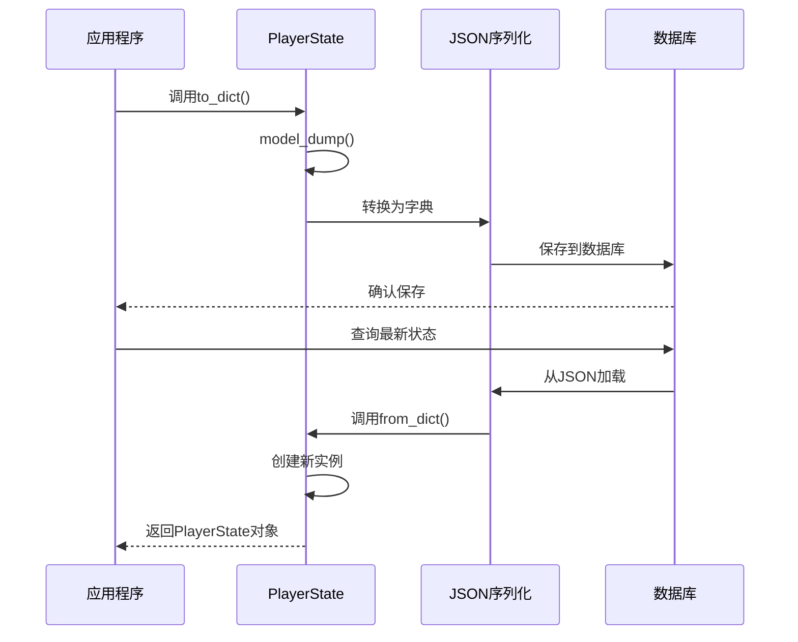
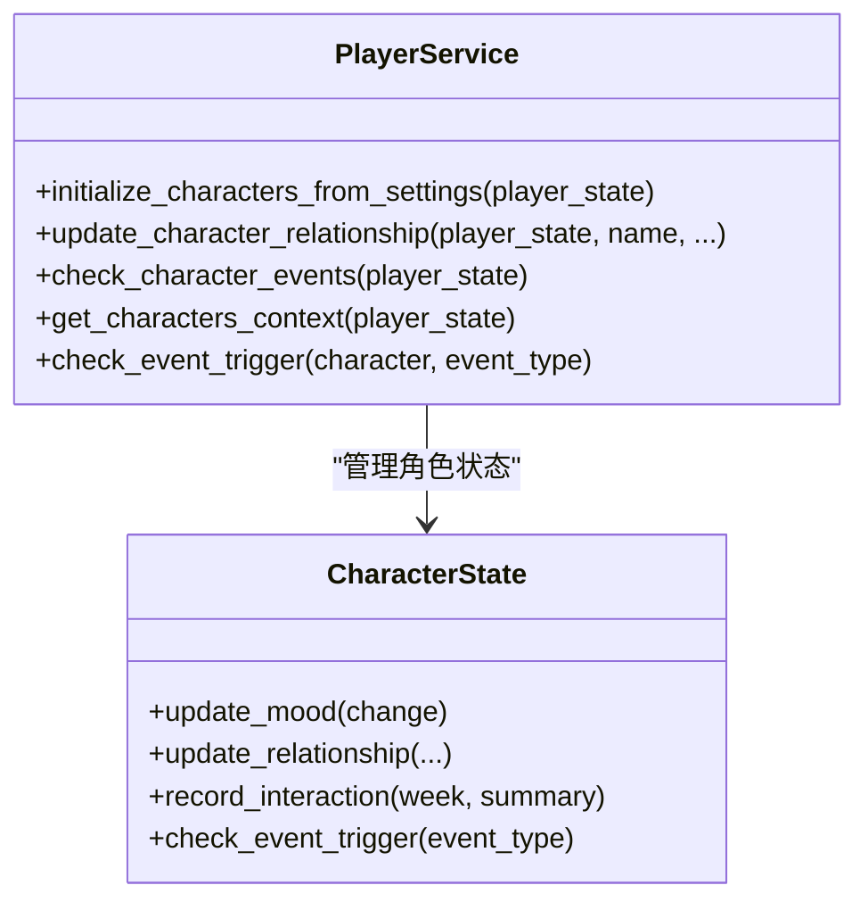
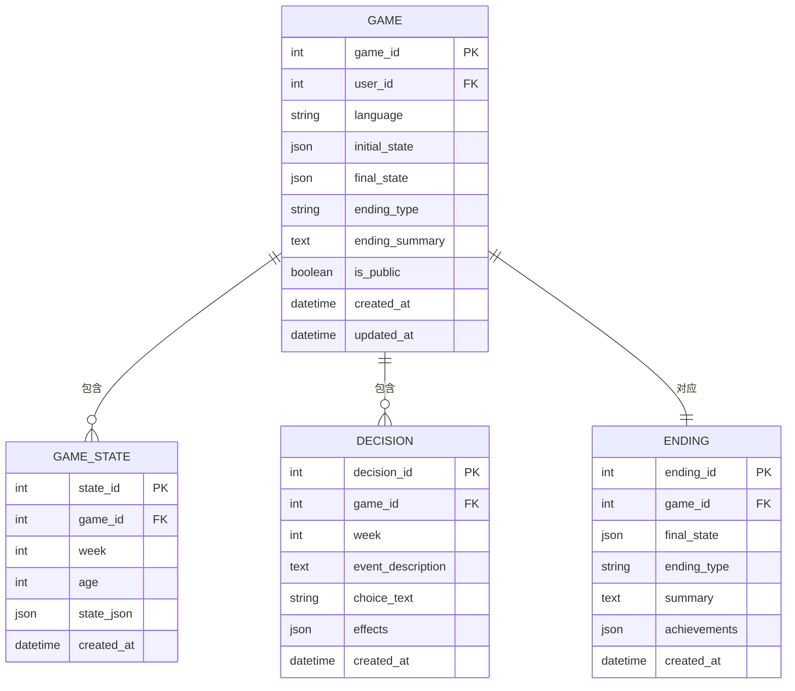
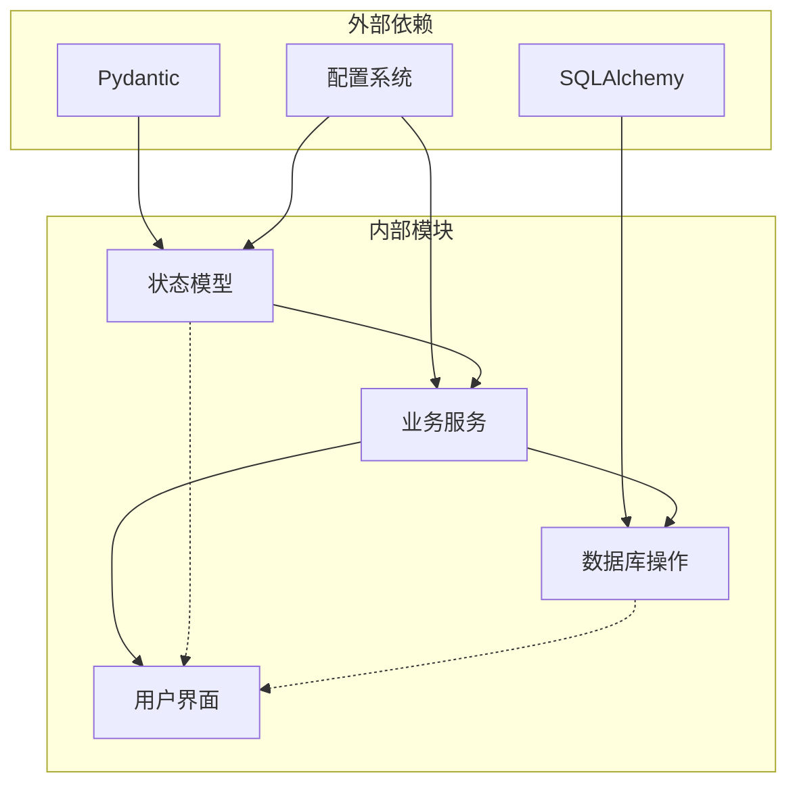

# 玩家状态系统

<cite>
**本文档引用的文件**
- [src/game/state.py](file://src/game/state.py)
- [src/game/player_service.py](file://src/game/player_service.py)
- [src/database/models.py](file://src/database/models.py)
- [src/database/db.py](file://src/database/db.py)
- [config/settings.py](file://config/settings.py)
- [src/game/game_loop.py](file://src/game/game_loop.py)
- [src/ui/state_manager.py](file://src/ui/state_manager.py)
- [src/ui/stats.py](file://src/ui/stats.py)
- [tests/test_character_state.py](file://tests/test_character_state.py)
- [tests/test_system_flow.py](file://tests/test_system_flow.py)
- [tests/test_state.py](file://tests/test_state.py)
</cite>

## 目录
1. [简介](#简介)
2. [项目结构](#项目结构)
3. [核心组件](#核心组件)
4. [架构概览](#架构概览)
5. [详细组件分析](#详细组件分析)
6. [依赖关系分析](#依赖关系分析)
7. [性能考虑](#性能考虑)
8. [故障排除指南](#故障排除指南)
9. [结论](#结论)
10. [附录](#附录)

## 简介

玩家状态系统是故事驱动型游戏中最核心的数据层，负责管理玩家角色的全部状态信息、属性变化和持久化机制。本系统采用Pydantic模型设计，确保数据的类型安全性和完整性约束，同时提供了丰富的业务逻辑封装，支持复杂的角色关系管理和多轮决策系统。

系统主要包含两个核心模型：PlayerState（玩家状态）和CharacterState（NPC角色状态），以及配套的服务层和持久化层，形成了完整的状态管理系统。

## 项目结构

玩家状态系统位于项目的`src/game/`目录下，采用模块化设计，各组件职责清晰：



**图表来源**
- [src/game/state.py](file://src/game/state.py#L244-L709)
- [src/game/player_service.py](file://src/game/player_service.py#L9-L176)
- [src/database/db.py](file://src/database/db.py#L10-L517)
- [config/settings.py](file://config/settings.py#L30-L100)

**章节来源**
- [src/game/state.py](file://src/game/state.py#L1-L709)
- [src/game/player_service.py](file://src/game/player_service.py#L1-L176)
- [src/database/db.py](file://src/database/db.py#L1-L517)

## 核心组件

### PlayerState - 玩家状态模型

PlayerState是整个系统的核心数据模型，继承自Pydantic的BaseModel，提供了完整的类型安全和数据验证功能。

#### 核心属性系统

系统定义了四个核心资源属性，均采用0-100的数值范围：

| 属性 | 类型 | 默认值 | 范围 | 描述 |
|------|------|--------|------|------|
| energy | int | 70 | 0-100 | 精力值，影响行动能力和决策质量 |
| mood | int | 60 | 0-100 | 情绪状态，影响社交互动和事件结果 |
| knowledge | int | 50 | 0-100 | 知识水平，决定学习机会和技能获取 |
| wealth | int | 10000 | ≥0 | 财富值，影响生活质量和选择机会 |

#### 时间管理系统

系统采用周制时间概念，支持精确的时间追踪：

- **age**: 玩家年龄，基于起始年龄和周数计算
- **week**: 当前周数，游戏总时长为96周（约2年）
- **四轮制系统**: 每周分为3个决策轮次，提供更细腻的故事体验

#### 多轮决策系统



**图表来源**
- [src/game/state.py](file://src/game/state.py#L282-L292)
- [src/game/state.py](file://src/game/state.py#L410-L431)

#### 角色关系系统

系统支持动态的角色关系管理，包括：

- **relationships**: 字典格式的简单关系映射
- **characters**: 完整的CharacterState对象集合
- **双向同步**: 确保两种关系存储格式的一致性

**章节来源**
- [src/game/state.py](file://src/game/state.py#L244-L418)
- [src/game/state.py](file://src/game/state.py#L597-L709)

### CharacterState - NPC角色模型

CharacterState专门用于管理非玩家角色的状态，提供了丰富的社交和情感属性：

#### 社交属性

| 属性 | 类型 | 默认值 | 描述 |
|------|------|--------|------|
| affinity | int | 50 | 亲密度，与玩家的双向关系 |
| trust | int | 50 | 信任度，反映关系深度 |
| respect | int | 50 | 尊重度，体现社会地位差异 |

#### 情感系统

- **mood**: 当前情绪状态（0-100）
- **mood_stability**: 情绪稳定性，影响情绪变化幅度
- **temperament**: 气质类型，影响行为模式

#### 关系事件触发器

系统内置了多种关系事件的触发阈值，支持复杂的情感发展：



**图表来源**
- [src/game/state.py](file://src/game/state.py#L12-L120)
- [src/game/player_service.py](file://src/game/player_service.py#L56-L130)

**章节来源**
- [src/game/state.py](file://src/game/state.py#L12-L120)
- [src/game/player_service.py](file://src/game/player_service.py#L56-L130)

## 架构概览

玩家状态系统采用分层架构设计，确保关注点分离和代码的可维护性：



**图表来源**
- [src/game/game_loop.py](file://src/game/game_loop.py#L24-L61)
- [src/game/player_service.py](file://src/game/player_service.py#L9-L10)
- [src/database/db.py](file://src/database/db.py#L10-L16)
- [config/settings.py](file://config/settings.py#L30-L100)

## 详细组件分析

### 状态验证与边界控制

系统实现了严格的边界控制机制，确保所有状态值都在有效范围内：



**图表来源**
- [src/game/state.py](file://src/game/state.py#L531-L551)

#### 边界控制策略

1. **资源属性边界**: 0-100范围内的严格限制
2. **财富属性**: 无上限但不能为负数
3. **时间属性**: 周数和年龄的合理范围控制
4. **关系属性**: 自动边界检查和修正

**章节来源**
- [src/game/state.py](file://src/game/state.py#L366-L408)
- [src/game/state.py](file://src/game/state.py#L531-L551)

### 序列化与反序列化机制

系统提供了完整的状态序列化支持，确保状态可以在内存、文件和数据库之间安全传输：

#### 序列化流程



**图表来源**
- [src/game/state.py](file://src/game/state.py#L553-L560)
- [src/database/db.py](file://src/database/db.py#L145-L172)

#### 状态恢复机制

系统支持从多种来源恢复状态：

1. **数据库快照**: 最新的GameState记录
2. **初始状态**: Game表中的initial_state
3. **混合恢复**: 从多个来源合并关键信息

**章节来源**
- [src/game/state.py](file://src/game/state.py#L553-L560)
- [src/database/db.py](file://src/database/db.py#L145-L172)

### 状态管理服务

PlayerService作为业务逻辑层的核心，提供了复杂的状态管理功能：

#### 角色关系管理



**图表来源**
- [src/game/player_service.py](file://src/game/player_service.py#L12-L176)
- [src/game/state.py](file://src/game/state.py#L121-L171)

#### 事件触发机制

系统实现了复杂的事件触发逻辑，基于角色的属性阈值：

| 事件类型 | 亲密度阈值 | 信任度阈值 | 条件说明 |
|----------|------------|------------|----------|
| deep_friendship | ≥80 | ≥70 | 深度友谊事件 |
| conflict | ≤30 | 任意 | 冲突事件 |
| help_request | ≥60 | 任意 | 请求帮助 |
| betrayal_risk | ≤15 | 任意 | 背叛风险 |
| romance_spark | ≥75 | 任意 | 恋爱萌芽 |
| marriage_proposal | ≥85 | 任意 | 求婚提议 |

**章节来源**
- [src/game/player_service.py](file://src/game/player_service.py#L106-L130)
- [src/game/state.py](file://src/game/state.py#L168-L171)

### 持久化机制

系统采用了多层次的持久化策略，确保数据的安全性和可靠性：

#### 数据库模型设计



**图表来源**
- [src/database/models.py](file://src/database/models.py#L61-L127)

#### 存储策略

1. **快照存储**: 定期保存GameState快照
2. **增量更新**: 实时更新Game表的updated_at字段
3. **历史记录**: 保存完整的决策历史
4. **最终状态**: 记录游戏结束时的最终状态

**章节来源**
- [src/database/models.py](file://src/database/models.py#L61-L127)
- [src/database/db.py](file://src/database/db.py#L48-L144)

## 依赖关系分析

玩家状态系统的依赖关系清晰明确，遵循单一职责原则：



**图表来源**
- [src/game/state.py](file://src/game/state.py#L1-L6)
- [src/game/player_service.py](file://src/game/player_service.py#L1-L6)
- [src/database/db.py](file://src/database/db.py#L1-L7)

### 关键依赖关系

1. **Pydantic依赖**: 提供类型安全和数据验证
2. **SQLAlchemy依赖**: 实现数据库抽象层
3. **配置依赖**: settings模块提供全局配置
4. **循环依赖控制**: 通过延迟导入避免循环引用

**章节来源**
- [src/game/state.py](file://src/game/state.py#L1-L6)
- [src/game/player_service.py](file://src/game/player_service.py#L1-L6)
- [src/database/db.py](file://src/database/db.py#L1-L7)

## 性能考虑

### 内存优化策略

1. **懒加载机制**: 角色数据按需加载
2. **增量更新**: 仅保存必要的状态变更
3. **缓存策略**: 频繁访问的数据进行缓存

### 数据库性能优化

1. **索引设计**: 在常用查询字段上建立索引
2. **批量操作**: 支持批量状态快照保存
3. **连接池**: 使用SQLAlchemy连接池管理数据库连接

### 序列化性能

1. **JSON优化**: 使用高效的JSON序列化库
2. **增量序列化**: 仅序列化变更的状态
3. **压缩策略**: 对大型状态进行压缩存储

## 故障排除指南

### 常见问题及解决方案

#### 状态验证失败

**问题**: 状态验证抛出ValueError异常
**原因**: 状态值超出有效范围
**解决**: 检查状态更新逻辑，确保值在边界范围内

#### 数据库连接问题

**问题**: 数据库操作失败
**原因**: 连接池耗尽或连接超时
**解决**: 检查数据库配置，增加连接池大小

#### 序列化错误

**问题**: 状态序列化/反序列化失败
**原因**: 数据格式不兼容或版本不匹配
**解决**: 检查数据模型版本，确保向前兼容

**章节来源**
- [src/game/state.py](file://src/game/state.py#L531-L551)
- [src/database/db.py](file://src/database/db.py#L285-L321)

## 结论

玩家状态系统通过精心设计的架构和完善的实现，为故事驱动型游戏提供了强大而灵活的状态管理能力。系统的主要优势包括：

1. **类型安全**: 基于Pydantic的强类型系统确保数据完整性
2. **扩展性强**: 模块化设计支持功能扩展和定制
3. **持久化可靠**: 多层次持久化策略确保数据安全
4. **性能优化**: 合理的缓存和数据库优化策略
5. **用户体验**: 支持断点续玩和状态恢复

该系统为开发者提供了清晰的扩展接口，可以轻松添加新的属性、事件和功能，同时保持系统的稳定性和一致性。

## 附录

### 开发者指南

#### 添加新属性的步骤

1. 在PlayerState类中添加新的字段定义
2. 更新配置文件中的默认值和边界
3. 编写相应的业务逻辑处理
4. 添加单元测试验证功能
5. 更新UI组件以显示新属性

#### 状态扩展接口

```python
# 示例：添加新的资源属性
class PlayerState(BaseModel):
    # ... 现有属性 ...
    
    # 新增的属性
    charisma: int = Field(default=50, ge=0, le=100)
    reputation: int = Field(default=50, ge=0, le=100)
    
    def update_charisma(self, change: int) -> None:
        """更新魅力值"""
        self.charisma = max(0, min(100, self.charisma + change))
    
    def update_reputation(self, change: int) -> None:
        """更新声望值"""
        self.reputation = max(0, min(100, self.reputation + change))
```

#### 最佳实践

1. **边界检查**: 始终在更新状态时进行边界检查
2. **事务处理**: 对于重要的状态更新使用数据库事务
3. **日志记录**: 记录重要的状态变更事件
4. **错误处理**: 实现完善的异常处理机制
5. **性能监控**: 监控状态系统的性能指标