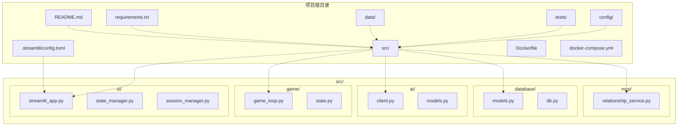
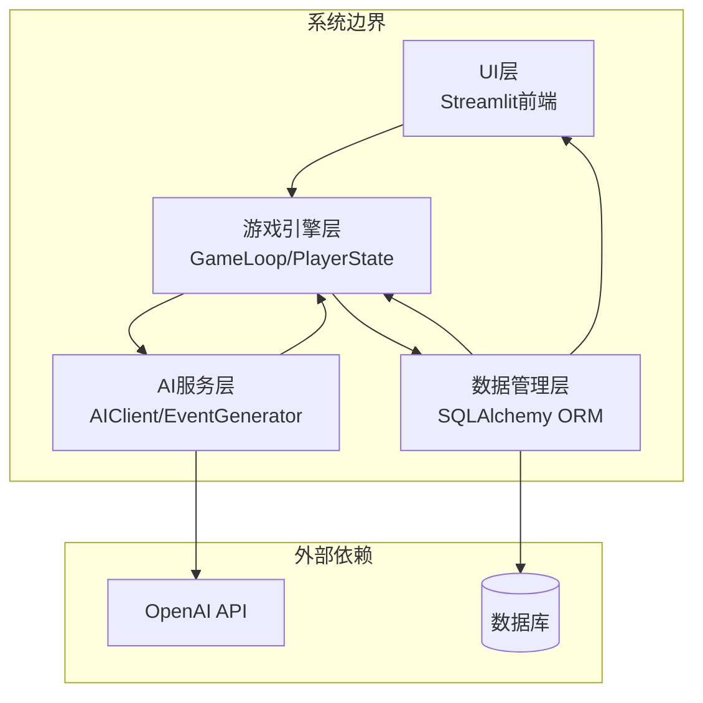
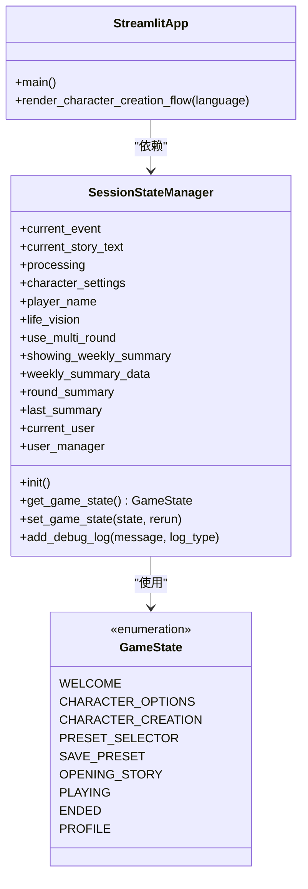
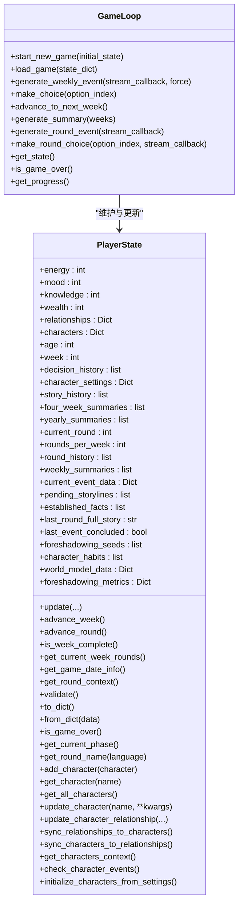
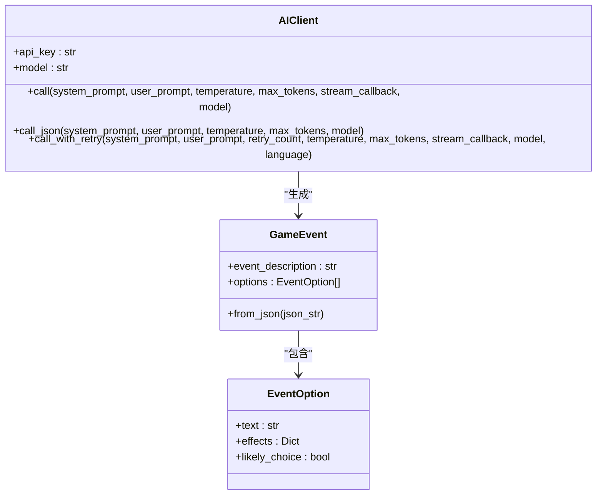
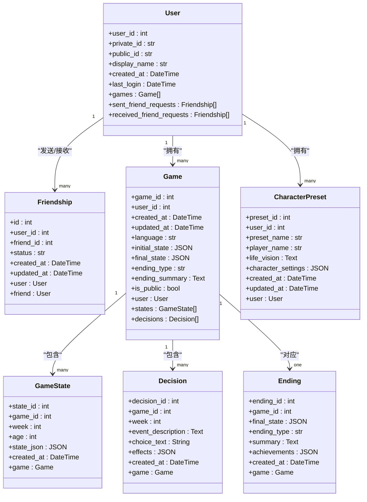
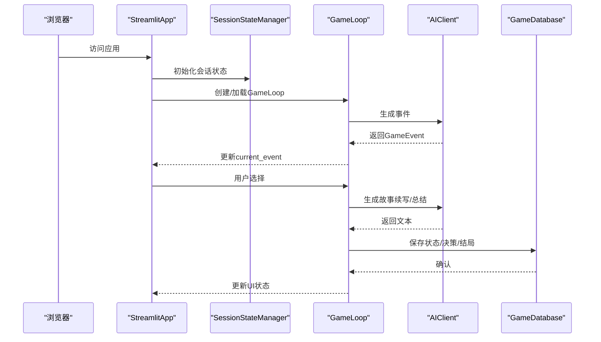
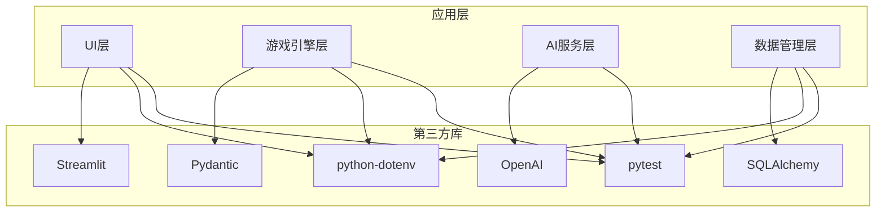

# 整体架构概览

<cite>
**本文档引用的文件**
- [README.md](file://README.md)
- [requirements.txt](file://requirements.txt)
- [config/settings.py](file://config/settings.py)
- [src/ui/streamlit_app.py](file://src/ui/streamlit_app.py)
- [src/ui/state_manager.py](file://src/ui/state_manager.py)
- [src/ui/session_manager.py](file://src/ui/session_manager.py)
- [src/game/game_loop.py](file://src/game/game_loop.py)
- [src/game/state.py](file://src/game/state.py)
- [src/ai/client.py](file://src/ai/client.py)
- [src/ai/models.py](file://src/ai/models.py)
- [src/database/models.py](file://src/database/models.py)
- [src/database/db.py](file://src/database/db.py)
- [run_web.py](file://run_web.py)
- [run_cli.py](file://run_cli.py)
</cite>

## 目录
1. [引言](#引言)
2. [项目结构](#项目结构)
3. [核心组件](#核心组件)
4. [架构总览](#架构总览)
5. [详细组件分析](#详细组件分析)
6. [依赖关系分析](#依赖关系分析)
7. [性能考虑](#性能考虑)
8. [故障排除指南](#故障排除指南)
9. [结论](#结论)

## 引言
本项目“人生草稿本”是一个基于文本的生涯模拟游戏，采用AI动态生成事件、资源管理与决策玩法，支持中英文双语体验，并提供多种结局。系统采用分层架构设计，分为UI层、游戏引擎层、AI服务层、数据管理层四大核心层次，职责清晰、耦合度低、扩展性强。

系统采用Streamlit作为Web前端框架，OpenAI API作为AI服务，SQLAlchemy作为ORM框架，结合Pydantic进行数据建模与校验，形成稳定可靠的技术栈组合。系统支持本地SQLite与云数据库（PostgreSQL/MySQL等）切换，具备良好的可移植性和可运维性。

## 项目结构
项目采用按功能域划分的目录组织方式，便于模块化开发与测试：

- config：配置与提示词管理
- src：核心源码
  - ui：用户界面与状态管理
  - game：游戏逻辑与状态模型
  - ai：AI事件生成与服务抽象
  - database：数据库模型与操作
  - mcp：关系事件服务（MCP）
- data：数据与缓存
- tests：单元与集成测试
- .streamlit：Streamlit运行配置

图表来源
- [README.md](file://README.md#L61-L73)
- [src/ui/streamlit_app.py](file://src/ui/streamlit_app.py#L1-L215)
- [src/game/game_loop.py](file://src/game/game_loop.py#L1-L120)
- [src/ai/client.py](file://src/ai/client.py#L1-L50)
- [src/database/models.py](file://src/database/models.py#L1-L60)

章节来源
- [README.md](file://README.md#L61-L73)
- [requirements.txt](file://requirements.txt#L1-L9)

## 核心组件
系统四大核心层次及其职责分工如下：

- UI层（用户界面层）
  - 负责页面渲染、用户交互、状态管理与持久化恢复
  - 提供欢迎页、角色创建、预设选择、游戏主界面、存档管理等功能
  - 通过状态管理器统一管理会话状态，实现UI与业务逻辑解耦

- 游戏引擎层（业务逻辑层）
  - 实现游戏主循环、事件生成、决策处理、资源管理、NPC关系系统
  - 支持周/轮次多阶段叙事，提供周总结与年度总结机制
  - 维护玩家状态模型，确保状态一致性与边界校验

- AI服务层（智能服务层）
  - 提供统一的AI调用抽象，封装OpenAI API调用、流式回调、JSON解析与重试机制
  - 通过事件生成器与故事服务，动态生成个性化事件与故事续写
  - 支持错误反馈注入与格式校验，提升生成质量与稳定性

- 数据管理层（数据持久化层）
  - 基于SQLAlchemy ORM，提供用户、游戏、状态、决策、结局、角色预设等模型
  - 支持本地SQLite与云数据库（PostgreSQL/MySQL）无缝切换
  - 提供完整的CRUD与查询接口，保障数据一致性与可恢复性

章节来源
- [src/ui/streamlit_app.py](file://src/ui/streamlit_app.py#L139-L211)
- [src/ui/state_manager.py](file://src/ui/state_manager.py#L29-L53)
- [src/game/game_loop.py](file://src/game/game_loop.py#L23-L60)
- [src/ai/client.py](file://src/ai/client.py#L22-L48)
- [src/database/models.py](file://src/database/models.py#L11-L144)
- [src/database/db.py](file://src/database/db.py#L10-L50)

## 架构总览
系统采用分层架构，四层之间通过清晰的接口进行交互，遵循高内聚、低耦合的设计原则。整体数据流从UI层进入，经过游戏引擎层处理，调用AI服务层生成内容，最终由数据管理层持久化存储。

图表来源
- [src/ui/streamlit_app.py](file://src/ui/streamlit_app.py#L139-L211)
- [src/game/game_loop.py](file://src/game/game_loop.py#L23-L60)
- [src/ai/client.py](file://src/ai/client.py#L22-L48)
- [src/database/models.py](file://src/database/models.py#L146-L171)

## 详细组件分析

### UI层组件分析
UI层以Streamlit为核心，提供响应式的Web界面与状态管理。主要组件包括：
- 主入口：负责页面配置、日志初始化、会话状态初始化与路由调度
- 状态管理：集中管理UI状态、用户会话、游戏状态与调试日志
- 页面视图：欢迎页、角色创建、预设选择、游戏主界面、存档管理等

图表来源
- [src/ui/streamlit_app.py](file://src/ui/streamlit_app.py#L139-L211)
- [src/ui/state_manager.py](file://src/ui/state_manager.py#L42-L53)

章节来源
- [src/ui/streamlit_app.py](file://src/ui/streamlit_app.py#L1-L215)
- [src/ui/state_manager.py](file://src/ui/state_manager.py#L1-L773)
- [src/ui/session_manager.py](file://src/ui/session_manager.py#L1-L65)

### 游戏引擎层组件分析
游戏引擎层是系统的核心业务逻辑，负责事件生成、决策处理、资源管理与叙事推进。关键组件包括：
- GameLoop：主循环控制器，协调事件生成、决策处理、周/轮次推进与总结生成
- PlayerState：玩家状态模型，包含资源、关系、NPC角色、历史记录、伏笔系统等
- 事件与故事服务：基于AI生成器的事件与故事续写，支持流式输出与格式校验

图表来源
- [src/game/game_loop.py](file://src/game/game_loop.py#L23-L120)
- [src/game/state.py](file://src/game/state.py#L244-L365)

章节来源
- [src/game/game_loop.py](file://src/game/game_loop.py#L1-L800)
- [src/game/state.py](file://src/game/state.py#L1-L709)

### AI服务层组件分析
AI服务层提供统一的AI调用抽象，屏蔽底层API差异，增强可维护性与可替换性。核心组件包括：
- AIClient：统一的AI客户端，封装OpenAI API调用、消息构建、流式回调、JSON解析与重试机制
- AI模型：GameEvent与EventOption数据模型，确保事件结构的规范性与一致性

图表来源
- [src/ai/client.py](file://src/ai/client.py#L22-L214)
- [src/ai/models.py](file://src/ai/models.py#L7-L27)

章节来源
- [src/ai/client.py](file://src/ai/client.py#L1-L214)
- [src/ai/models.py](file://src/ai/models.py#L1-L27)

### 数据管理层组件分析
数据管理层基于SQLAlchemy ORM，提供完整的数据模型与操作接口，支持本地SQLite与云数据库切换。核心组件包括：
- 数据模型：User、Friendship、Game、GameState、Decision、Ending、CharacterPreset
- 数据库操作：GameDatabase类提供游戏状态、决策、结局、角色预设的增删改查与批量查询

图表来源
- [src/database/models.py](file://src/database/models.py#L11-L144)

章节来源
- [src/database/models.py](file://src/database/models.py#L1-L171)
- [src/database/db.py](file://src/database/db.py#L10-L517)

### 系统数据流与控制流
系统运行时的数据流与控制流如下：

图表来源
- [src/ui/streamlit_app.py](file://src/ui/streamlit_app.py#L139-L211)
- [src/ui/state_manager.py](file://src/ui/state_manager.py#L178-L300)
- [src/game/game_loop.py](file://src/game/game_loop.py#L153-L256)
- [src/ai/client.py](file://src/ai/client.py#L51-L104)
- [src/database/db.py](file://src/database/db.py#L48-L144)

## 依赖关系分析
系统技术栈与外部依赖关系如下：

- 前端框架：Streamlit（Web界面与状态管理）
- AI服务：OpenAI API（事件生成与故事续写）
- 数据库：SQLAlchemy ORM（本地SQLite/云数据库）
- 环境变量：python-dotenv（配置管理）
- 测试：pytest（单元与集成测试）

图表来源
- [requirements.txt](file://requirements.txt#L1-L9)
- [config/settings.py](file://config/settings.py#L33-L41)

章节来源
- [requirements.txt](file://requirements.txt#L1-L9)
- [config/settings.py](file://config/settings.py#L1-L100)

## 性能考虑
- AI调用优化：通过统一客户端封装，支持流式回调与重试机制，减少网络抖动对用户体验的影响；合理设置温度与最大令牌数，平衡创造性与稳定性
- 数据持久化：采用增量状态快照与决策记录分离，降低数据库写入压力；提供批量查询接口，减少频繁IO
- UI渲染：通过状态管理器集中管理UI状态，避免不必要的重渲染；利用Streamlit的组件化特性，提升交互响应速度
- 资源管理：PlayerState对资源进行边界校验与衰减控制，防止数值溢出与异常状态

## 故障排除指南
- OpenAI API密钥缺失：系统会在配置校验阶段抛出异常，提示设置OPENAI_API_KEY；检查.env文件或环境变量
- 数据库连接问题：根据DATABASE_URL优先级选择云数据库或本地SQLite；确认数据库驱动安装（如psycopg2-binary）
- 会话恢复失败：检查URL参数与localStorage中的game_id与game_state；确认用户权限与游戏存在性
- AI生成失败：启用重试与错误反馈注入，确保输出格式正确；必要时降级为回退事件

章节来源
- [config/settings.py](file://config/settings.py#L84-L90)
- [src/database/models.py](file://src/database/models.py#L146-L171)
- [src/ui/state_manager.py](file://src/ui/state_manager.py#L662-L773)
- [src/ai/client.py](file://src/ai/client.py#L140-L214)

## 结论
“人生草稿本”系统通过清晰的分层架构与稳健的技术栈，实现了AI驱动的个性化生涯模拟体验。UI层提供直观易用的交互界面，游戏引擎层承载复杂的叙事与决策逻辑，AI服务层保证内容生成的质量与稳定性，数据管理层确保状态持久化与可恢复性。该架构既满足当前功能需求，又为未来扩展（如多人协作、更丰富的叙事引擎、云原生部署）预留了充足空间。