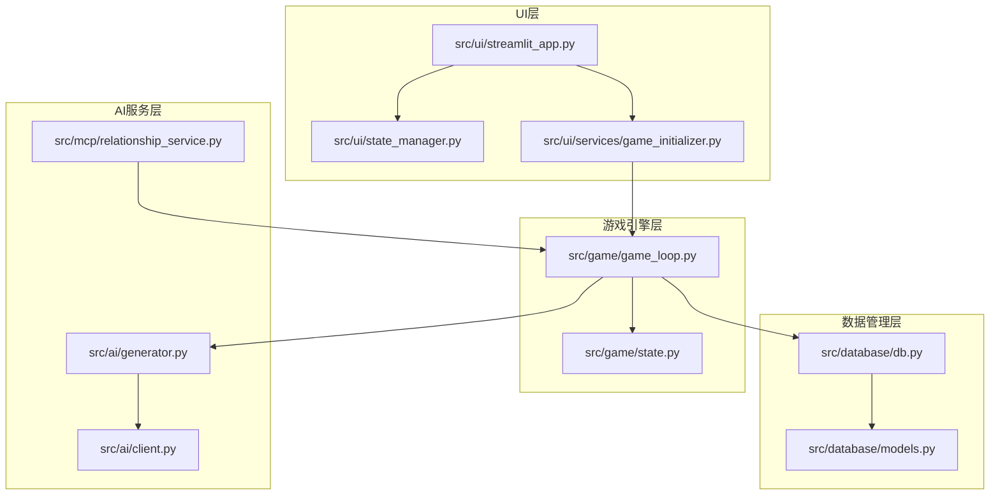
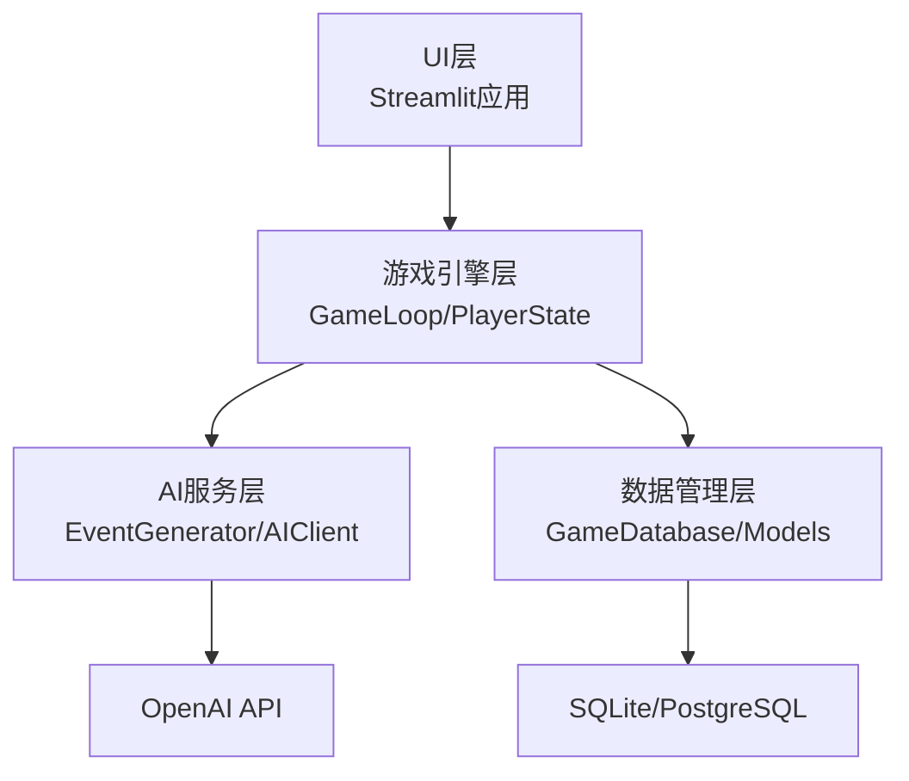
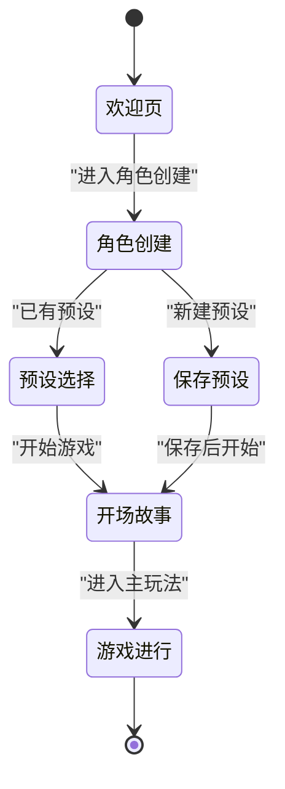
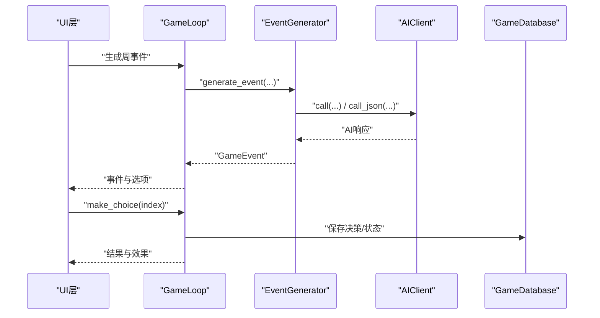
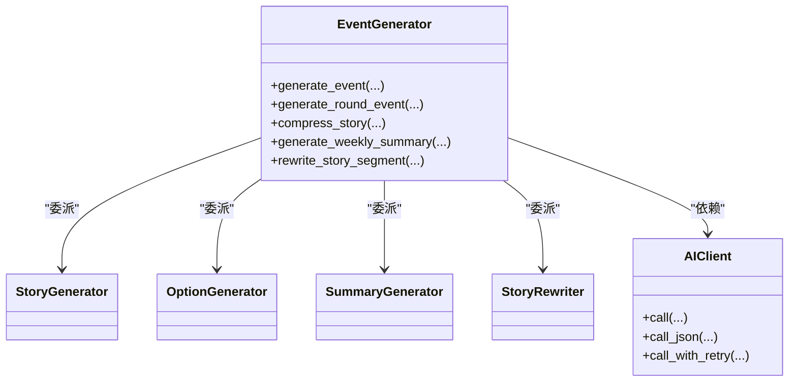
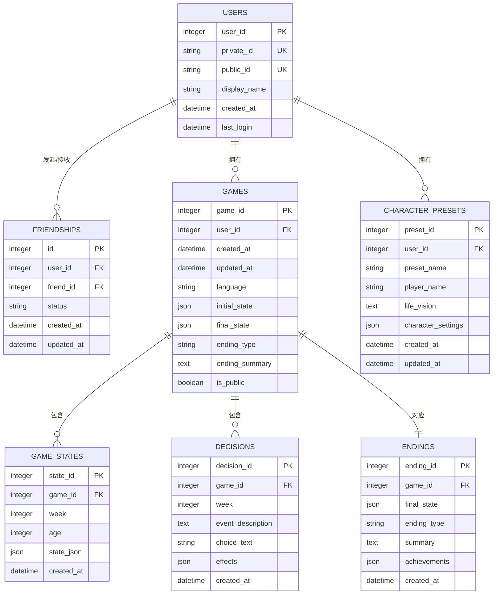
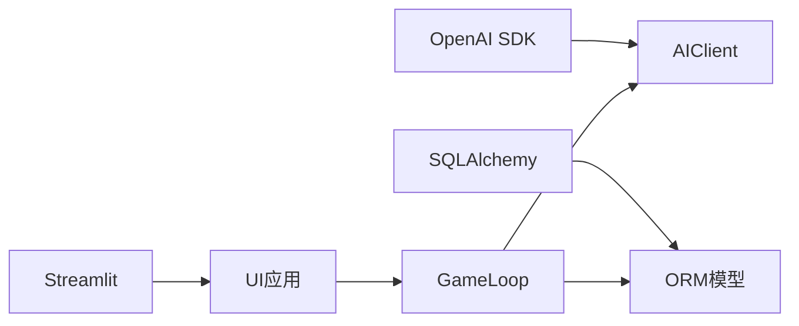

# 架构设计

<cite>
**本文引用的文件**
- [README.md](file://README.md)
- [requirements.txt](file://requirements.txt)
- [Dockerfile](file://Dockerfile)
- [config/settings.py](file://config/settings.py)
- [src/ui/streamlit_app.py](file://src/ui/streamlit_app.py)
- [src/ui/state_manager.py](file://src/ui/state_manager.py)
- [src/ui/services/game_initializer.py](file://src/ui/services/game_initializer.py)
- [src/game/game_loop.py](file://src/game/game_loop.py)
- [src/game/state.py](file://src/game/state.py)
- [src/ai/client.py](file://src/ai/client.py)
- [src/ai/generator.py](file://src/ai/generator.py)
- [src/mcp/relationship_service.py](file://src/mcp/relationship_service.py)
- [src/database/db.py](file://src/database/db.py)
- [src/database/models.py](file://src/database/models.py)
</cite>

## 目录
1. [引言](#引言)
2. [项目结构](#项目结构)
3. [核心组件](#核心组件)
4. [架构总览](#架构总览)
5. [详细组件分析](#详细组件分析)
6. [依赖关系分析](#依赖关系分析)
7. [性能考量](#性能考量)
8. [故障排查指南](#故障排查指南)
9. [结论](#结论)
10. [附录](#附录)

## 引言
本项目“人生草稿本”是一个基于文本的生涯模拟游戏，采用分层架构设计，围绕“UI层-游戏引擎层-AI服务层-数据管理层”展开。系统通过状态机驱动的UI路由、门面模式整合AI服务、工厂式的服务初始化以及统一的数据库抽象，实现可扩展、可维护、可测试的架构。

## 项目结构
项目采用按功能域分层的组织方式：
- config：集中配置与提示词管理
- src：核心业务代码
  - ui：Web界面与状态管理
  - game：游戏逻辑与状态
  - ai：AI事件生成与摘要
  - database：数据库模型与操作
  - mcp：关系事件检测与触发
- data：本地数据与缓存
- tests：单元与集成测试

图表来源
- [src/ui/streamlit_app.py](file://src/ui/streamlit_app.py#L1-L215)
- [src/ui/state_manager.py](file://src/ui/state_manager.py#L1-L773)
- [src/ui/services/game_initializer.py](file://src/ui/services/game_initializer.py#L1-L155)
- [src/game/game_loop.py](file://src/game/game_loop.py#L1-L1193)
- [src/game/state.py](file://src/game/state.py#L1-L709)
- [src/ai/client.py](file://src/ai/client.py#L1-L214)
- [src/ai/generator.py](file://src/ai/generator.py#L1-L407)
- [src/mcp/relationship_service.py](file://src/mcp/relationship_service.py#L1-L520)
- [src/database/db.py](file://src/database/db.py#L1-L517)
- [src/database/models.py](file://src/database/models.py#L1-L171)

章节来源
- [README.md](file://README.md#L61-L73)
- [src/ui/streamlit_app.py](file://src/ui/streamlit_app.py#L1-L215)
- [src/ui/state_manager.py](file://src/ui/state_manager.py#L1-L773)
- [src/game/game_loop.py](file://src/game/game_loop.py#L1-L1193)
- [src/ai/generator.py](file://src/ai/generator.py#L1-L407)
- [src/database/db.py](file://src/database/db.py#L1-L517)

## 核心组件
- UI层
  - Streamlit应用入口负责页面路由、会话状态初始化与调试控制台渲染
  - 状态管理器提供类型安全的会话状态访问与持久化策略
  - 游戏初始化服务封装从角色设定到游戏实例创建的流程
- 游戏引擎层
  - 游戏循环管理周/轮推进、事件生成、决策处理与总结产出
  - 玩家状态模型承载资源、关系、角色、世界模型等全量状态
- AI服务层
  - 统一AI客户端抽象，提供文本与JSON调用、重试与错误反馈注入
  - 事件生成门面聚合故事生成、选项生成、摘要与重写子服务
  - 关系事件MCP服务检测并触发基于角色关系的剧情事件
- 数据管理层
  - 数据库模型定义用户、游戏、状态、决策、结局与角色预设
  - 数据库操作封装持久化、查询与迁移策略

章节来源
- [src/ui/streamlit_app.py](file://src/ui/streamlit_app.py#L1-L215)
- [src/ui/state_manager.py](file://src/ui/state_manager.py#L1-L773)
- [src/ui/services/game_initializer.py](file://src/ui/services/game_initializer.py#L1-L155)
- [src/game/game_loop.py](file://src/game/game_loop.py#L1-L1193)
- [src/game/state.py](file://src/game/state.py#L1-L709)
- [src/ai/client.py](file://src/ai/client.py#L1-L214)
- [src/ai/generator.py](file://src/ai/generator.py#L1-L407)
- [src/mcp/relationship_service.py](file://src/mcp/relationship_service.py#L1-L520)
- [src/database/db.py](file://src/database/db.py#L1-L517)
- [src/database/models.py](file://src/database/models.py#L1-L171)

## 架构总览
系统采用分层解耦与职责分离：
- UI层仅负责展示与路由，不直接访问AI或数据库
- 游戏引擎层聚合业务规则与状态流转，对外暴露简洁接口
- AI服务层通过门面模式屏蔽复杂细节，统一错误处理与缓存策略
- 数据管理层提供ORM抽象与连接策略，支持本地SQLite与云数据库

图表来源
- [src/ui/streamlit_app.py](file://src/ui/streamlit_app.py#L1-L215)
- [src/game/game_loop.py](file://src/game/game_loop.py#L1-L1193)
- [src/ai/generator.py](file://src/ai/generator.py#L1-L407)
- [src/ai/client.py](file://src/ai/client.py#L1-L214)
- [src/database/db.py](file://src/database/db.py#L1-L517)
- [src/database/models.py](file://src/database/models.py#L1-L171)

## 详细组件分析

### UI层：状态机路由与会话管理
- 状态机路由
  - 通过枚举状态驱动页面切换，优先级明确，便于扩展新页面
  - 在欢迎页、角色创建、预设选择、保存预设、开场故事、游戏进行间切换
- 会话状态管理
  - 提供类型安全的getter/setter，集中初始化与清理
  - 统一current_event来源，保证UI与游戏引擎的数据一致性
  - 支持用户与游戏状态的URL/LocalStorage持久化与恢复

图表来源
- [src/ui/state_manager.py](file://src/ui/state_manager.py#L29-L40)
- [src/ui/streamlit_app.py](file://src/ui/streamlit_app.py#L175-L211)

章节来源
- [src/ui/streamlit_app.py](file://src/ui/streamlit_app.py#L1-L215)
- [src/ui/state_manager.py](file://src/ui/state_manager.py#L1-L773)

### 游戏引擎层：事件驱动与状态机
- 游戏循环
  - 每周生成一次事件，支持里程碑事件与回退事件
  - 决策处理后更新状态并回调结果
  - 周末自动生成4周/年度总结，维持叙事连续性
- 多轮系统
  - 每周拆分为固定轮次，每轮生成故事与选项
  - 基于世界模型与关系事件增强一致性与可玩性
- 玩家状态
  - 资源、关系、角色、世界模型、伏笔系统、习惯追踪等全量状态
  - 提供回合上下文构建、时间信息计算与阶段判定

图表来源
- [src/game/game_loop.py](file://src/game/game_loop.py#L153-L256)
- [src/ai/generator.py](file://src/ai/generator.py#L159-L214)
- [src/ai/client.py](file://src/ai/client.py#L51-L104)
- [src/database/db.py](file://src/database/db.py#L48-L104)

章节来源
- [src/game/game_loop.py](file://src/game/game_loop.py#L1-L1193)
- [src/game/state.py](file://src/game/state.py#L1-L709)

### AI服务层：门面模式与统一抽象
- 门面模式
  - EventGenerator作为统一入口，委派给StoryGenerator、OptionGenerator、SummaryGenerator、StoryRewriter
  - 保持对外接口稳定，内部模块可演进
- 统一AI客户端
  - AIClient封装OpenAI调用、流式回调、JSON解析与重试机制
  - 支持错误反馈注入，提升生成质量与鲁棒性
- 关系事件MCP
  - 基于角色属性与时代背景检测可触发事件，支持优先级排序与状态变更

图表来源
- [src/ai/generator.py](file://src/ai/generator.py#L30-L66)
- [src/ai/client.py](file://src/ai/client.py#L22-L48)

章节来源
- [src/ai/generator.py](file://src/ai/generator.py#L1-L407)
- [src/ai/client.py](file://src/ai/client.py#L1-L214)
- [src/mcp/relationship_service.py](file://src/mcp/relationship_service.py#L1-L520)

### 数据管理层：ORM抽象与连接策略
- 模型定义
  - 用户、好友关系、游戏、状态快照、决策、结局、角色预设
  - 支持索引与级联删除，保证数据一致性
- 数据库操作
  - GameDatabase封装创建、保存、加载、列表、删除等操作
  - 支持本地SQLite与云数据库（PostgreSQL/MySQL）URL切换
- 连接与初始化
  - 根据环境变量动态选择数据库URL，支持池化与预检

图表来源
- [src/database/models.py](file://src/database/models.py#L11-L144)
- [src/database/db.py](file://src/database/db.py#L17-L517)

章节来源
- [src/database/models.py](file://src/database/models.py#L1-L171)
- [src/database/db.py](file://src/database/db.py#L1-L517)
- [config/settings.py](file://config/settings.py#L68-L82)

## 依赖关系分析
- 技术栈与版本
  - Streamlit用于Web界面与状态管理
  - OpenAI SDK用于大模型调用
  - SQLAlchemy用于ORM与数据库抽象
  - httpx用于HTTP客户端（与OpenAI SDK共存）
  - pytest用于测试
- 容器化与部署
  - Dockerfile定义Python 3.9基础镜像、健康检查与启动命令
  - Streamlit运行参数与环境变量配置

图表来源
- [requirements.txt](file://requirements.txt#L1-L9)
- [Dockerfile](file://Dockerfile#L1-L48)
- [src/ai/client.py](file://src/ai/client.py#L14-L47)
- [src/database/models.py](file://src/database/models.py#L146-L156)

章节来源
- [requirements.txt](file://requirements.txt#L1-L9)
- [Dockerfile](file://Dockerfile#L1-L48)

## 性能考量
- 事件生成缓存
  - 通过缓存减少重复AI调用，降低延迟与成本
- 数据库连接池
  - 云数据库启用预检与池化，提升并发与稳定性
- 流式输出
  - 支持流式回调，改善用户体验与感知性能
- 状态快照
  - 周期性保存状态快照，平衡恢复能力与写入开销

## 故障排查指南
- 配置校验
  - 缺失OpenAI密钥将导致AI调用失败，需在环境变量中设置
  - 数据库URL优先使用云数据库，否则回退至本地SQLite
- 日志与调试
  - UI层与各模块均配置日志，可通过调试控制台查看状态
  - 会话状态管理器提供调试日志上限与时间戳
- 错误反馈
  - AI客户端支持重试与错误反馈注入，提升生成稳定性

章节来源
- [config/settings.py](file://config/settings.py#L84-L90)
- [src/ai/client.py](file://src/ai/client.py#L140-L213)
- [src/ui/streamlit_app.py](file://src/ui/streamlit_app.py#L160-L163)
- [src/ui/state_manager.py](file://src/ui/state_manager.py#L495-L509)

## 结论
本项目通过清晰的分层架构、门面模式的AI服务整合、状态机驱动的UI与游戏引擎、以及统一的数据库抽象，实现了可扩展、可维护与高性能的文本模拟游戏系统。技术选型兼顾易用性与可移植性，容器化与配置管理确保部署一致性。建议持续优化AI生成质量、完善关系事件与世界模型的约束校验，并引入更细粒度的监控与指标采集以支撑长期运营。

## 附录
- 设计模式应用
  - 门面模式：EventGenerator统一AI调用与子服务委派
  - 状态机模式：UI状态枚举与GameLoop推进
  - 工厂模式：GameInitializer集中创建与初始化流程
- 系统边界
  - UI层：仅负责展示与路由
  - 游戏引擎层：封装业务规则与状态
  - AI服务层：封装外部API调用与错误处理
  - 数据管理层：封装持久化与连接策略