# 工厂模式

<cite>
**本文引用的文件**
- [game_initializer.py](file://src/ui/services/game_initializer.py)
- [character_creation.py](file://src/game/character_creation.py)
- [models.py](file://src/database/models.py)
- [db.py](file://src/database/db.py)
- [world_model.py](file://src/game/world_model.py)
- [state.py](file://src/game/state.py)
- [game_loop.py](file://src/game/game_loop.py)
- [generator.py](file://src/ai/generator.py)
- [player_service.py](file://src/game/player_service.py)
</cite>

## 目录
1. [简介](#简介)
2. [项目结构](#项目结构)
3. [核心组件](#核心组件)
4. [架构概览](#架构概览)
5. [详细组件分析](#详细组件分析)
6. [依赖分析](#依赖分析)
7. [性能考虑](#性能考虑)
8. [故障排除指南](#故障排除指南)
9. [结论](#结论)

## 简介

工厂模式是一种创建型设计模式，它提供了一种创建对象的最佳方式。在本项目中，工厂模式被广泛应用在多个层面，包括游戏初始化、角色创建、数据库模型实例化等场景。通过工厂模式，系统实现了对象创建过程的解耦，提高了代码的可测试性和可维护性。

工厂模式的核心思想是将对象的创建过程封装起来，客户端不需要知道具体的创建细节，只需要通过工厂接口就能获得所需对象。这种模式特别适用于复杂的对象创建过程，需要处理依赖关系、参数传递、错误处理等情况。

## 项目结构

该项目采用模块化的架构设计，工厂模式在不同层次都有体现：

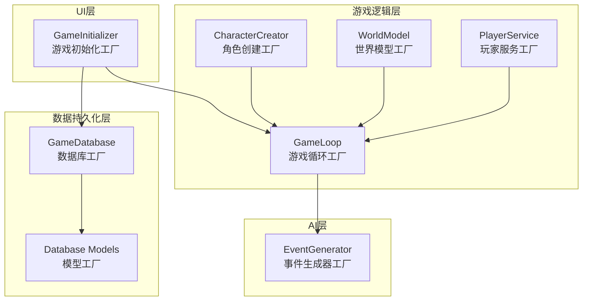

**图表来源**
- [game_initializer.py](file://src/ui/services/game_initializer.py#L49-L138)
- [character_creation.py](file://src/game/character_creation.py#L37-L49)
- [game_loop.py](file://src/game/game_loop.py#L24-L53)
- [world_model.py](file://src/game/world_model.py#L185-L287)
- [db.py](file://src/database/db.py#L10-L46)

**章节来源**
- [game_initializer.py](file://src/ui/services/game_initializer.py#L1-L155)
- [character_creation.py](file://src/game/character_creation.py#L1-L702)
- [game_loop.py](file://src/game/game_loop.py#L1-L800)

## 核心组件

### 游戏初始化工厂 (GameInitializer)

GameInitializer 是项目中最典型的工厂模式实现，负责集中管理游戏初始化过程中的各种对象创建。

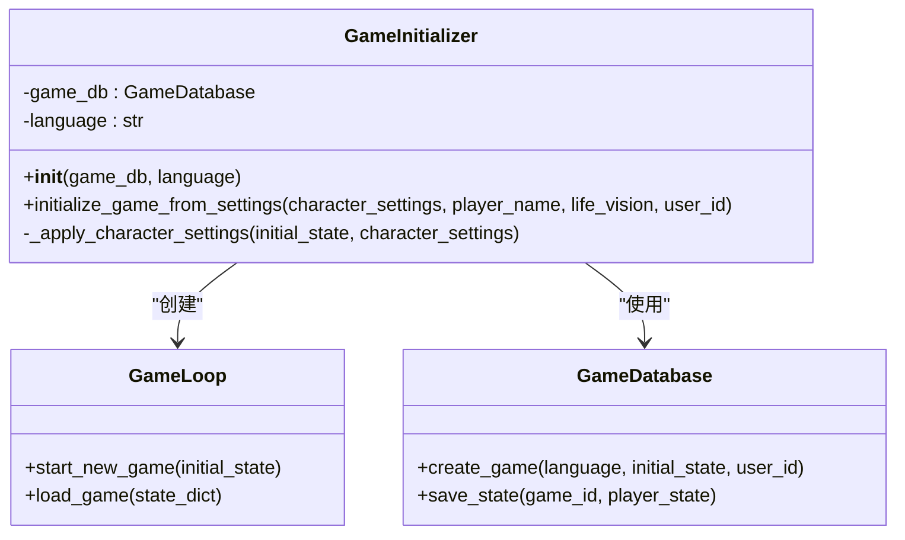

**图表来源**
- [game_initializer.py](file://src/ui/services/game_initializer.py#L49-L138)
- [game_loop.py](file://src/game/game_loop.py#L62-L91)
- [db.py](file://src/database/db.py#L17-L46)

### 角色创建工厂 (CharacterCreator)

CharacterCreator 展现了工厂模式在复杂对象创建中的应用，特别是在处理AI生成和回退机制时。

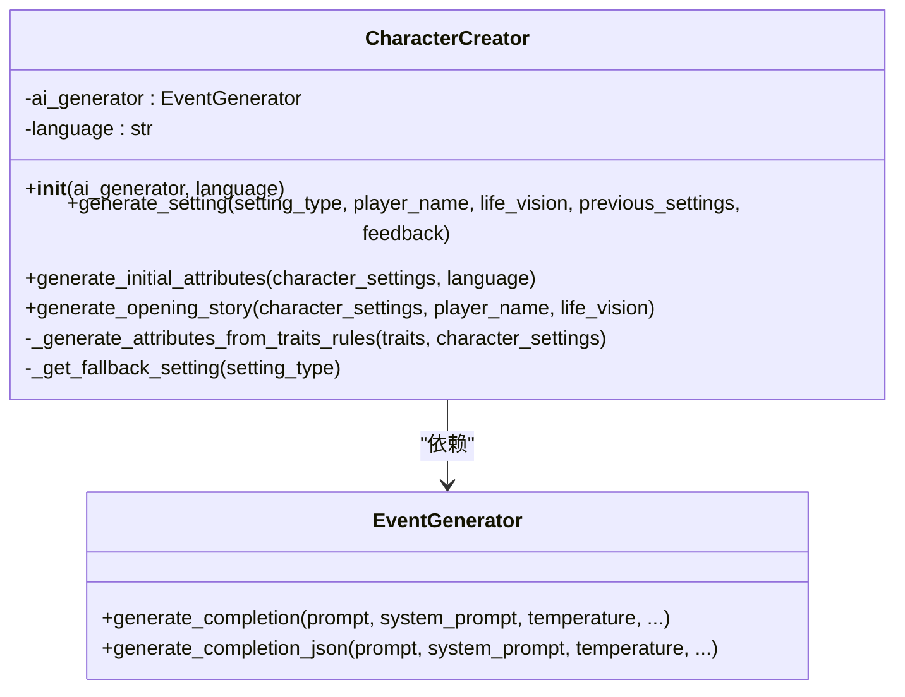

**图表来源**
- [character_creation.py](file://src/game/character_creation.py#L37-L158)
- [generator.py](file://src/ai/generator.py#L30-L66)

### 数据库模型工厂

数据库层通过工厂模式管理ORM模型的创建和初始化。

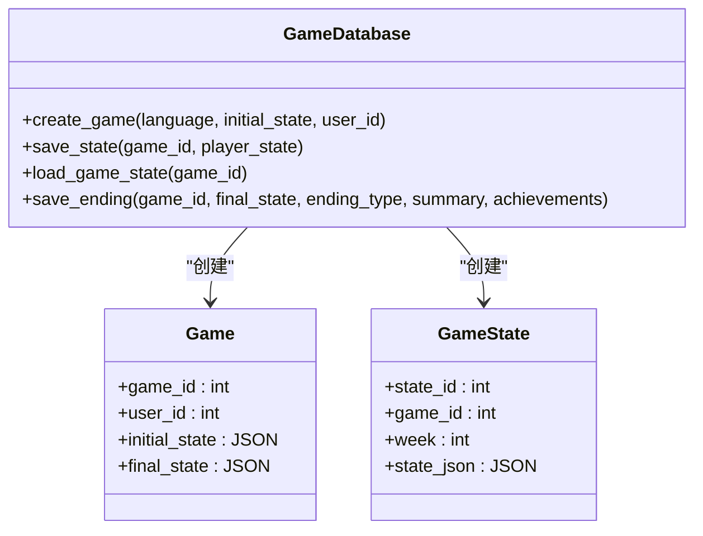

**图表来源**
- [db.py](file://src/database/db.py#L17-L143)
- [models.py](file://src/database/models.py#L61-L80)

**章节来源**
- [game_initializer.py](file://src/ui/services/game_initializer.py#L49-L138)
- [character_creation.py](file://src/game/character_creation.py#L37-L158)
- [db.py](file://src/database/db.py#L10-L143)

## 架构概览

工厂模式在整个系统中的应用形成了一个完整的对象创建体系：

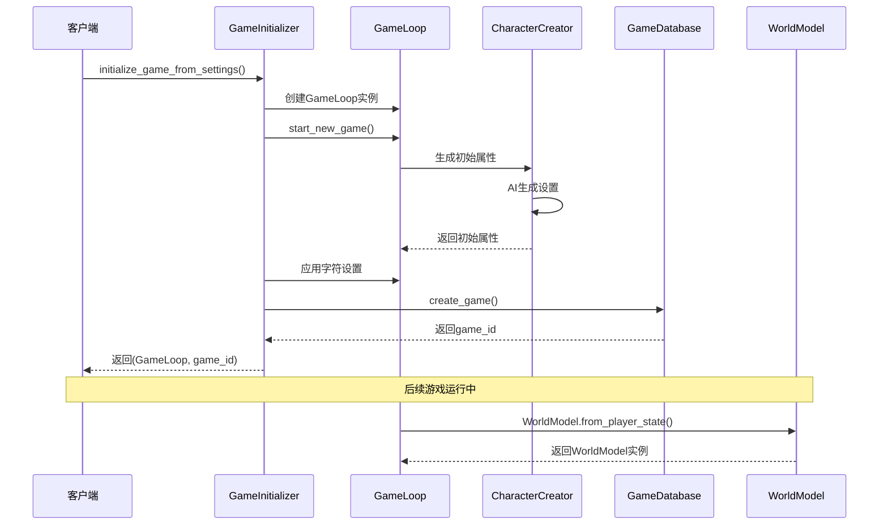

**图表来源**
- [game_initializer.py](file://src/ui/services/game_initializer.py#L63-L138)
- [game_loop.py](file://src/game/game_loop.py#L62-L91)
- [world_model.py](file://src/game/world_model.py#L202-L287)

## 详细组件分析

### 游戏初始化工厂深度分析

#### 工厂方法实现

GameInitializer 的 `initialize_game_from_settings` 方法展示了标准的工厂方法模式：

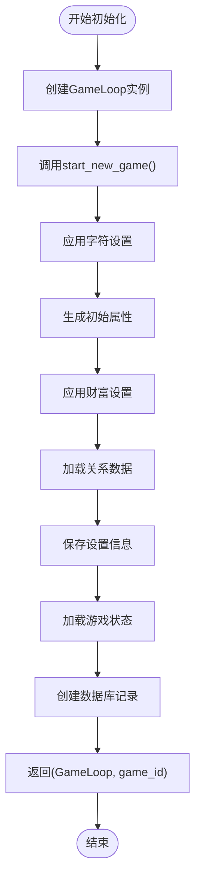

**图表来源**
- [game_initializer.py](file://src/ui/services/game_initializer.py#L63-L138)

#### 参数传递和依赖注入

工厂方法通过构造函数接收依赖项，实现了良好的依赖注入：

- `game_db`: 数据库操作的依赖注入
- `language`: 语言设置的参数化
- `character_settings`: 复杂配置对象的输入

#### 错误处理机制

工厂方法包含了完善的错误处理：

- 初始化失败时抛出 `ValueError`
- 日志记录详细的错误信息
- 提供回退机制确保系统稳定性

**章节来源**
- [game_initializer.py](file://src/ui/services/game_initializer.py#L63-L138)

### 角色创建工厂深度分析

#### 多层次工厂模式

CharacterCreator 展现了多层次的工厂模式应用：

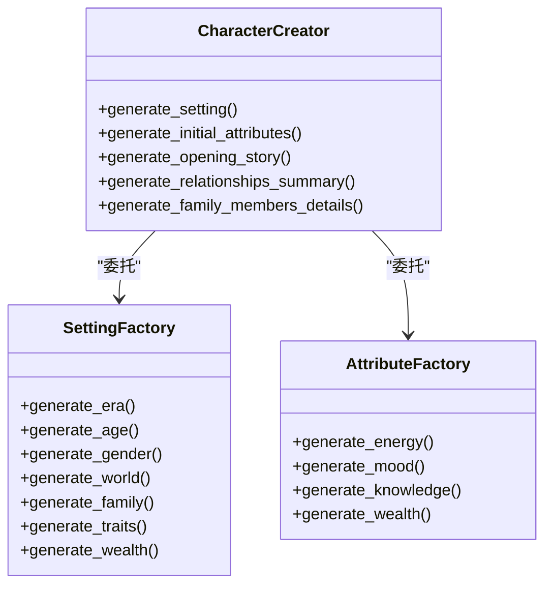

**图表来源**
- [character_creation.py](file://src/game/character_creation.py#L51-L158)
- [character_creation.py](file://src/game/character_creation.py#L325-L375)

#### AI驱动的工厂方法

角色创建过程大量使用AI生成器作为工厂方法的执行者：

- `EventGenerator`: 核心AI生成器
- `OptionGenerator`: 选项生成器
- `SummaryGenerator`: 摘要生成器
- `StoryGenerator`: 故事生成器

#### 回退机制设计

工厂方法实现了智能的回退机制：

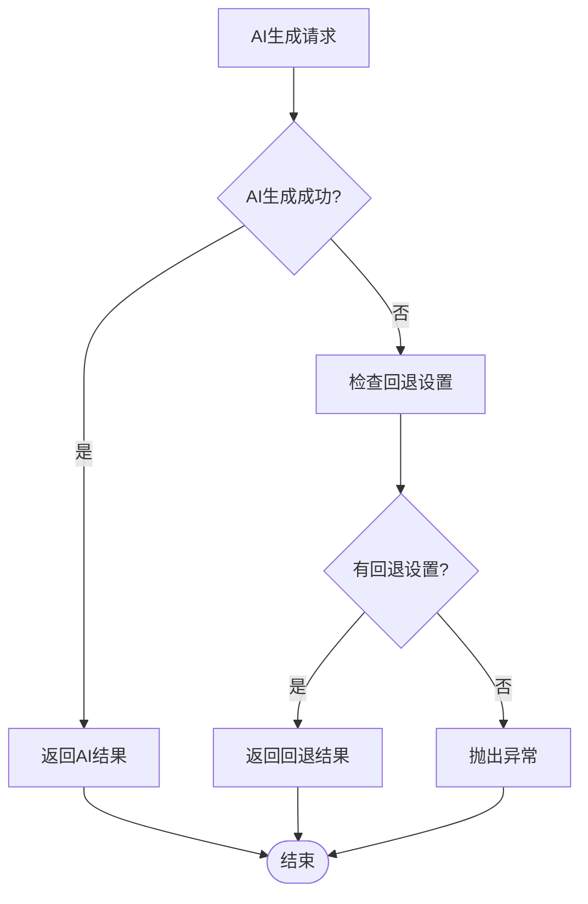

**图表来源**
- [character_creation.py](file://src/game/character_creation.py#L95-L158)

**章节来源**
- [character_creation.py](file://src/game/character_creation.py#L51-L158)
- [character_creation.py](file://src/game/character_creation.py#L325-L375)

### 数据库模型工厂分析

#### ORM模型工厂

数据库层通过工厂模式管理ORM模型的创建：

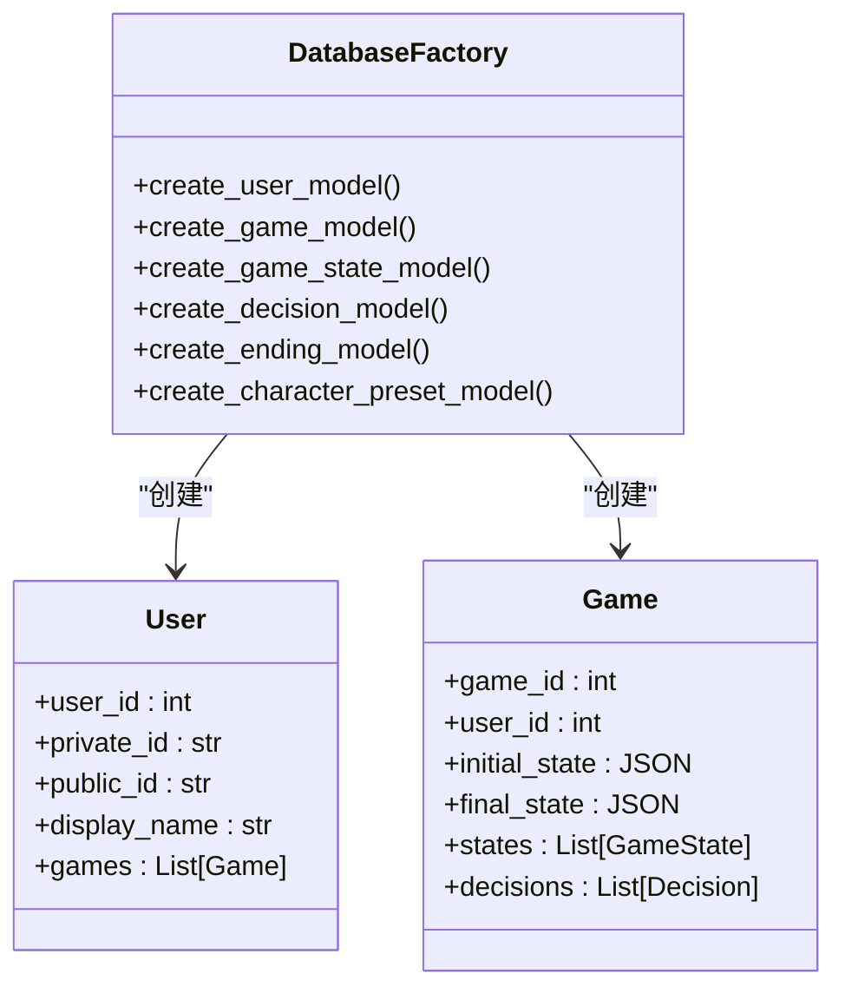

**图表来源**
- [models.py](file://src/database/models.py#L11-L80)

#### 数据库连接工厂

GameDatabase 类展示了数据库连接的工厂模式：

- `SessionLocal`: 数据库会话工厂
- `engine`: 数据库引擎工厂
- `init_db()`: 数据库初始化工厂

**章节来源**
- [models.py](file://src/database/models.py#L11-L171)
- [db.py](file://src/database/db.py#L10-L171)

### 世界模型工厂分析

#### 结构化数据工厂

WorldModel 展现了复杂数据结构的工厂模式：

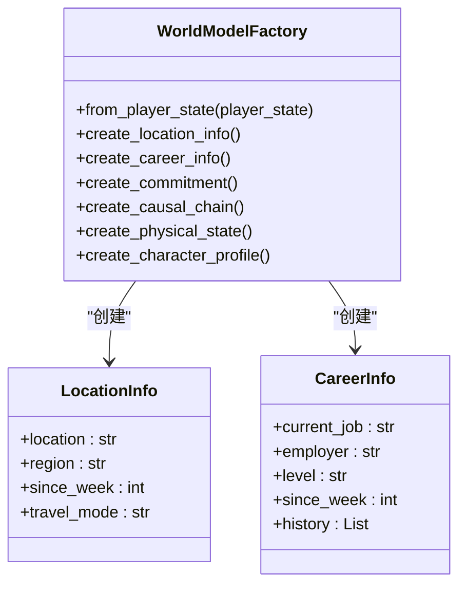

**图表来源**
- [world_model.py](file://src/game/world_model.py#L185-L287)

#### 数据转换工厂

工厂方法实现了从 PlayerState 到结构化数据的转换：

- `from_player_state()`: 主工厂方法
- `LocationInfo.from_dict()`: 地理位置工厂
- `CareerInfo.from_dict()`: 职业信息工厂
- `CharacterProfile.from_dict()`: 角色画像工厂

**章节来源**
- [world_model.py](file://src/game/world_model.py#L185-L287)

## 依赖分析

### 工厂模式的依赖关系

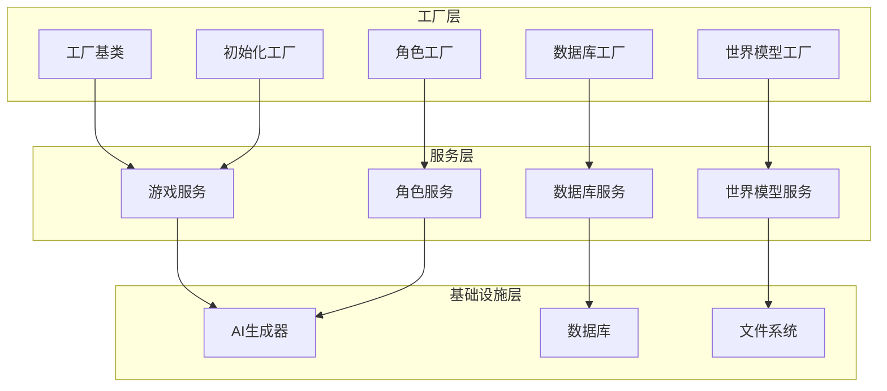

### 循环依赖检测

通过工厂模式的应用，系统有效避免了循环依赖：

- 工厂类只依赖抽象接口，不依赖具体实现
- 通过依赖注入实现松耦合
- 工厂方法返回抽象类型，隐藏具体实现

**章节来源**
- [game_loop.py](file://src/game/game_loop.py#L24-L53)
- [character_creation.py](file://src/game/character_creation.py#L37-L49)

## 性能考虑

### 工厂模式的性能优势

1. **延迟创建**: 工厂方法只在需要时创建对象
2. **对象复用**: 通过缓存机制复用昂贵的对象
3. **内存优化**: 工厂方法可以控制对象的生命周期
4. **并发安全**: 工厂方法可以实现线程安全的对象创建

### 性能优化策略

```python
# 示例：工厂方法的性能优化
class OptimizedFactory:
    def __init__(self):
        self._cache = {}
        self._lock = threading.Lock()
    
    def create_object(self, key, *args, **kwargs):
        # 缓存检查
        if key in self._cache:
            return self._cache[key]
        
        # 线程安全的创建
        with self._lock:
            if key not in self._cache:
                obj = self._do_create(*args, **kwargs)
                self._cache[key] = obj
            return self._cache[key]
    
    def _do_create(self, *args, **kwargs):
        # 实际的对象创建逻辑
        pass
```

## 故障排除指南

### 工厂模式常见问题

#### 对象创建失败

当工厂方法无法创建对象时，应该：

1. 检查依赖项是否正确注入
2. 验证输入参数的有效性
3. 查看日志中的错误信息
4. 实施适当的回退机制

#### 内存泄漏问题

工厂方法可能导致的内存泄漏：

- 确保及时清理不再使用的对象
- 实现适当的生命周期管理
- 使用弱引用避免循环引用

#### 并发安全问题

多线程环境下的工厂方法：

- 使用线程锁保护共享资源
- 实现线程安全的缓存机制
- 避免竞态条件

**章节来源**
- [character_creation.py](file://src/game/character_creation.py#L137-L152)
- [game_initializer.py](file://src/ui/services/game_initializer.py#L85-L87)

## 结论

工厂模式在本项目中的应用展现了其在复杂系统中的重要作用。通过工厂模式，系统实现了：

1. **解耦对象创建**: 客户端不需要了解具体的创建细节
2. **提高可测试性**: 可以轻松替换依赖项进行单元测试
3. **增强灵活性**: 支持动态配置和扩展
4. **改善代码质量**: 减少了重复代码，提高了代码复用性

工厂模式的成功应用使得系统能够优雅地处理复杂的对象创建过程，包括参数传递、依赖关系管理、错误处理等各个方面。这种设计模式为系统的长期维护和发展奠定了坚实的基础。

通过深入分析各个工厂类的实现，我们可以看到工厂模式不仅解决了技术问题，更重要的是提升了系统的整体架构质量，为开发者提供了清晰的扩展路径和良好的开发体验。