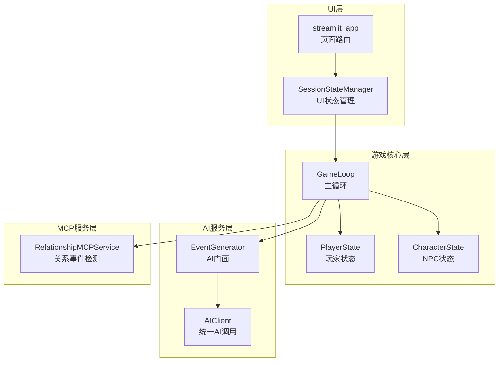
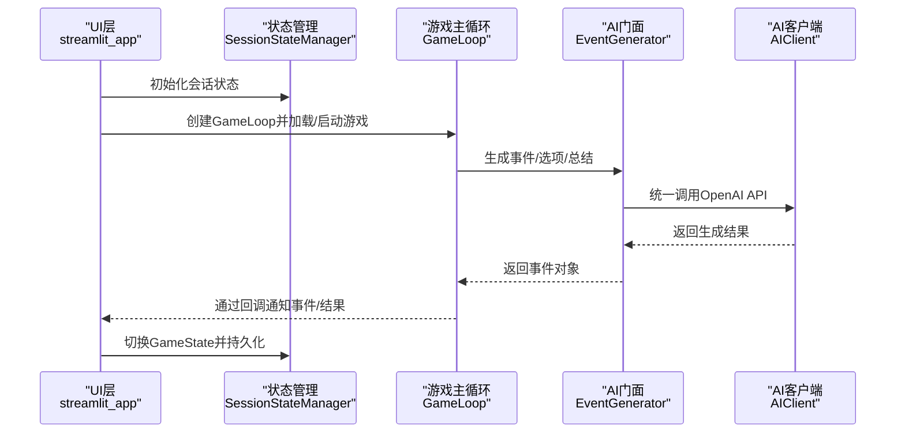
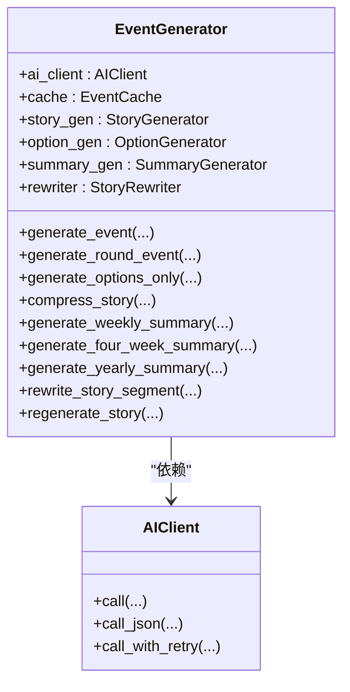
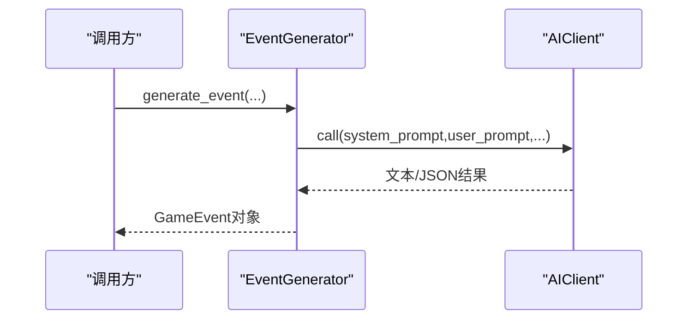
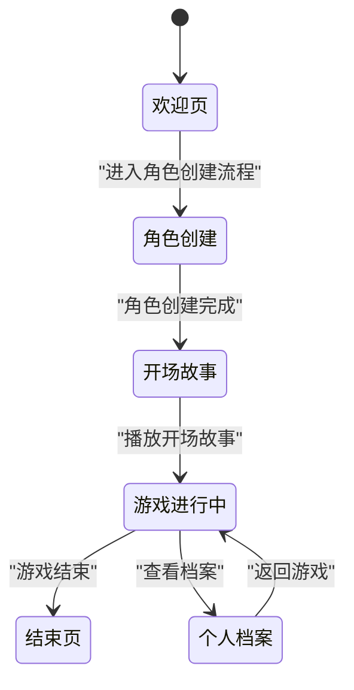
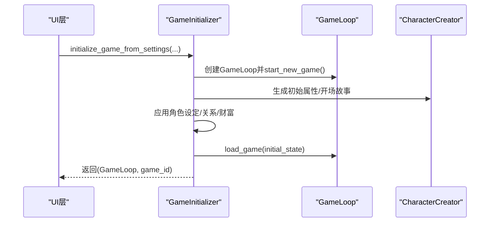
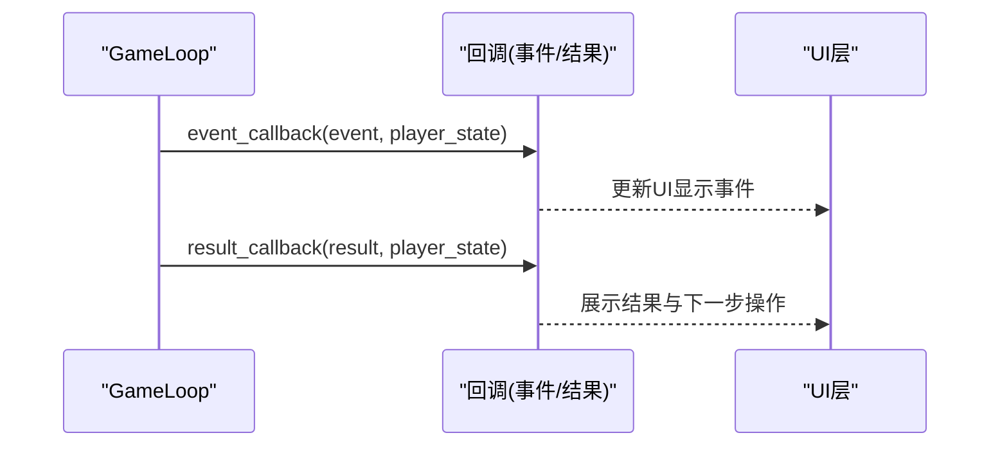
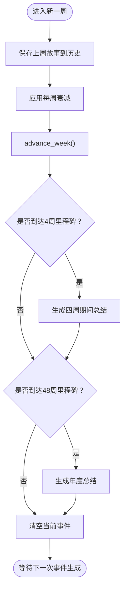
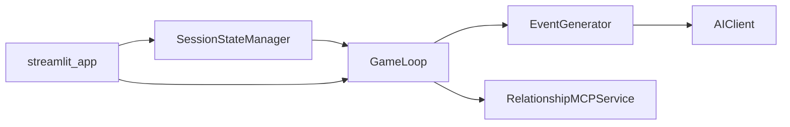

# 核心设计模式

<cite>
**本文引用的文件**
- [src/ai/generator.py](file://src/ai/generator.py)
- [src/ai/client.py](file://src/ai/client.py)
- [src/ui/state_manager.py](file://src/ui/state_manager.py)
- [src/game/state.py](file://src/game/state.py)
- [src/game/game_loop.py](file://src/game/game_loop.py)
- [src/ui/services/game_initializer.py](file://src/ui/services/game_initializer.py)
- [src/mcp/relationship_service.py](file://src/mcp/relationship_service.py)
- [src/ui/streamlit_app.py](file://src/ui/streamlit_app.py)
- [src/ui/session_manager.py](file://src/ui/session_manager.py)
</cite>

## 目录
1. [引言](#引言)
2. [项目结构](#项目结构)
3. [核心组件](#核心组件)
4. [架构总览](#架构总览)
5. [详细组件分析](#详细组件分析)
6. [依赖分析](#依赖分析)
7. [性能考虑](#性能考虑)
8. [故障排查指南](#故障排查指南)
9. [结论](#结论)
10. [附录](#附录)

## 引言
本文件聚焦“人生草稿本”项目中关键设计模式的应用与落地，围绕以下主题展开：
- 门面模式在AI服务中的应用：通过EventGenerator统一AI服务接口，屏蔽底层子模块细节，简化客户端调用。
- 状态机模式在UI状态管理中的实现：以GameState枚举为核心的状态机，配合SessionStateManager集中管理UI状态与持久化。
- 工厂模式在对象创建中的应用：GameInitializer集中创建与初始化GameLoop与初始状态；CharacterCreator负责角色与世界的AI生成。
- 观察者模式在事件驱动架构中的作用：GameLoop通过回调（事件回调、结果回调）实现事件驱动的解耦。

## 项目结构
项目采用按职责分层的组织方式：
- UI层：Streamlit页面渲染与状态管理（state_manager、session_manager、各page_views）
- 游戏核心层：GameLoop主循环、PlayerState/CharacterState状态模型、多轮回合系统
- AI服务层：EventGenerator门面、AIClient抽象、StoryGenerator/OptionGenerator/SummaryGenerator等子模块
- MCP服务层：RelationshipMCPService等扩展服务，提供关系事件检测与触发
- 数据与工具：数据库封装、配置与提示词、缓存与工具函数

图表来源
- [src/ui/state_manager.py](file://src/ui/state_manager.py#L29-L538)
- [src/ui/streamlit_app.py](file://src/ui/streamlit_app.py#L139-L215)
- [src/game/game_loop.py](file://src/game/game_loop.py#L23-L60)
- [src/ai/generator.py](file://src/ai/generator.py#L30-L66)
- [src/ai/client.py](file://src/ai/client.py#L22-L48)
- [src/mcp/relationship_service.py](file://src/mcp/relationship_service.py#L45-L65)

章节来源
- [src/ui/state_manager.py](file://src/ui/state_manager.py#L1-L773)
- [src/ui/streamlit_app.py](file://src/ui/streamlit_app.py#L1-L215)
- [src/game/game_loop.py](file://src/game/game_loop.py#L1-L800)
- [src/ai/generator.py](file://src/ai/generator.py#L1-L431)
- [src/ai/client.py](file://src/ai/client.py#L1-L214)
- [src/mcp/relationship_service.py](file://src/mcp/relationship_service.py#L1-L520)

## 核心组件
- 门面模式（AI服务）：EventGenerator作为统一入口，内部组合AIClient与多个子生成器（StoryGenerator、OptionGenerator、SummaryGenerator、StoryRewriter），对外暴露简洁接口，屏蔽复杂实现。
- 状态机模式（UI）：GameState枚举定义UI状态集合；SessionStateManager集中管理状态初始化、切换、持久化与清理。
- 工厂模式（对象创建）：GameInitializer集中创建GameLoop并填充初始状态；CharacterCreator通过AI生成角色与世界设定。
- 观察者模式（事件驱动）：GameLoop在事件生成与决策处理时通过回调通知UI层，实现松耦合。

章节来源
- [src/ai/generator.py](file://src/ai/generator.py#L30-L130)
- [src/ui/state_manager.py](file://src/ui/state_manager.py#L29-L244)
- [src/ui/services/game_initializer.py](file://src/ui/services/game_initializer.py#L49-L138)
- [src/game/game_loop.py](file://src/game/game_loop.py#L23-L60)

## 架构总览
下图展示了UI状态机、AI门面与游戏主循环之间的交互关系，以及AI服务层的内部协作。

图表来源
- [src/ui/streamlit_app.py](file://src/ui/streamlit_app.py#L139-L215)
- [src/ui/state_manager.py](file://src/ui/state_manager.py#L67-L90)
- [src/game/game_loop.py](file://src/game/game_loop.py#L153-L256)
- [src/ai/generator.py](file://src/ai/generator.py#L183-L238)
- [src/ai/client.py](file://src/ai/client.py#L51-L104)

## 详细组件分析

### 门面模式：AI服务统一入口（EventGenerator）
EventGenerator作为门面，聚合AI子模块与缓存，对外提供统一接口，同时保留向后兼容签名，便于客户端迁移。

- 关键职责
  - 统一AI调用：通过AIClient封装OpenAI调用，支持流式回调与重试注入错误反馈。
  - 子模块编排：将故事生成、选项生成、摘要生成、重写等职责委派给对应子模块。
  - 缓存与预设：支持事件缓存与里程碑预设事件，提升性能与一致性。
  - 向后兼容：保留原有公共方法签名，保证旧客户端无需修改即可继续使用。

- 类关系概览

图表来源
- [src/ai/generator.py](file://src/ai/generator.py#L30-L66)
- [src/ai/client.py](file://src/ai/client.py#L22-L48)

- 与客户端调用的时序

图表来源
- [src/ai/generator.py](file://src/ai/generator.py#L183-L238)
- [src/ai/client.py](file://src/ai/client.py#L51-L104)

章节来源
- [src/ai/generator.py](file://src/ai/generator.py#L1-L431)
- [src/ai/client.py](file://src/ai/client.py#L1-L214)

### 状态机模式：UI状态管理（GameState + SessionStateManager）
UI层通过SessionStateManager集中管理所有会话状态，并以GameState枚举实现状态机。

- 状态机定义
  - GameState枚举：WELCOME、CHARACTER_OPTIONS、CHARACTER_CREATION、PRESET_SELECTOR、SAVE_PRESET、OPENING_STORY、PLAYING、ENDED、PROFILE等。
  - 状态转换：由UI层根据业务流程调用set_game_state进行切换，并可选择触发页面刷新。

- 状态管理要点
  - 单一真相源：current_event统一由GameLoop提供，避免分散更新。
  - 初始化与清理：提供init、clear_user_session_data、clear_game_state等方法，确保状态一致性。
  - 持久化：提供save_game_to_storage/restore_game_from_storage，支持URL与localStorage双通道恢复。

- 状态流转示意

图表来源
- [src/ui/state_manager.py](file://src/ui/state_manager.py#L29-L40)
- [src/ui/streamlit_app.py](file://src/ui/streamlit_app.py#L175-L210)

章节来源
- [src/ui/state_manager.py](file://src/ui/state_manager.py#L29-L244)
- [src/ui/streamlit_app.py](file://src/ui/streamlit_app.py#L139-L215)
- [src/ui/session_manager.py](file://src/ui/session_manager.py#L31-L65)

### 工厂模式：对象创建（GameInitializer、CharacterCreator）
工厂模式用于集中创建与初始化复杂对象，降低调用方的耦合度。

- GameInitializer
  - 职责：从角色设定字典创建GameLoop实例，填充初始状态、属性、关系、货币等，并持久化到数据库。
  - 优势：消除重复初始化逻辑，保证创建流程一致。

- CharacterCreator
  - 职责：通过AI生成时代、年龄、性别、世界、家庭、关系、特质、财富等设定，以及初始属性与开场故事。
  - 容错：提供JSON提取与回退策略，确保在AI不稳定时仍能生成可用数据。

- 工厂调用序列

图表来源
- [src/ui/services/game_initializer.py](file://src/ui/services/game_initializer.py#L63-L138)
- [src/game/game_loop.py](file://src/game/game_loop.py#L61-L90)
- [src/game/character_creation.py](file://src/game/character_creation.py#L37-L49)

章节来源
- [src/ui/services/game_initializer.py](file://src/ui/services/game_initializer.py#L1-L155)
- [src/game/character_creation.py](file://src/game/character_creation.py#L1-L702)

### 观察者模式：事件驱动架构（GameLoop回调）
GameLoop在事件生成与决策处理时通过回调通知UI层，形成典型的观察者模式。

- 回调机制
  - 事件回调：事件生成完成后触发event_callback，UI据此渲染事件界面。
  - 结果回调：决策处理完成后触发result_callback，UI据此展示结果与后续流程。
- 解耦效果：UI无需直接依赖GameLoop内部实现，仅通过回调感知状态变化。

- 回调时序

图表来源
- [src/game/game_loop.py](file://src/game/game_loop.py#L238-L241)
- [src/game/game_loop.py](file://src/game/game_loop.py#L294-L297)
- [src/game/game_loop.py](file://src/game/game_loop.py#L766-L769)
- [src/game/game_loop.py](file://src/game/game_loop.py#L1029-L1032)

章节来源
- [src/game/game_loop.py](file://src/game/game_loop.py#L23-L60)

### 状态机模式：游戏内状态（PlayerState/CharacterState）
游戏核心状态模型同样体现状态机思想：通过明确的状态字段与转换方法，维持状态一致性与可预测性。

- PlayerState
  - 时间推进：advance_week/advance_round控制周与回合推进。
  - 资源与关系：update统一更新能量、情绪、知识、财富与关系值。
  - 历史与总结：维护故事历史、四周期间总结、年度总结、伏笔系统等。

- CharacterState
  - 情绪与关系：update_mood/update_relationship管理NPC情绪与亲密度等。
  - 事件触发：check_event_trigger委托PlayerService判定特殊事件触发。

- 状态转换流程（周推进）

图表来源
- [src/game/game_loop.py](file://src/game/game_loop.py#L300-L350)
- [src/game/state.py](file://src/game/state.py#L410-L442)

章节来源
- [src/game/state.py](file://src/game/state.py#L1-L709)
- [src/game/game_loop.py](file://src/game/game_loop.py#L300-L495)

## 依赖分析
- 组件耦合
  - EventGenerator依赖AIClient与多个子模块，但对外保持简洁接口，符合门面模式的“高内聚、低耦合”原则。
  - GameLoop依赖EventGenerator、StoryService、YearlySummaryGenerator、RelationshipMCPService等，形成清晰的职责边界。
  - SessionStateManager集中管理UI状态，UI层通过它间接访问GameLoop与数据库，避免直接耦合。
- 外部依赖
  - OpenAI SDK通过AIClient统一封装，便于替换与测试。
  - Streamlit通过SessionStateManager统一访问，避免全局变量散落。

图表来源
- [src/ui/state_manager.py](file://src/ui/state_manager.py#L178-L244)
- [src/game/game_loop.py](file://src/game/game_loop.py#L23-L60)
- [src/ai/generator.py](file://src/ai/generator.py#L30-L66)
- [src/ai/client.py](file://src/ai/client.py#L22-L48)
- [src/mcp/relationship_service.py](file://src/mcp/relationship_service.py#L45-L65)
- [src/ui/streamlit_app.py](file://src/ui/streamlit_app.py#L139-L215)

章节来源
- [src/ui/state_manager.py](file://src/ui/state_manager.py#L1-L773)
- [src/game/game_loop.py](file://src/game/game_loop.py#L1-L800)
- [src/ai/generator.py](file://src/ai/generator.py#L1-L431)
- [src/ai/client.py](file://src/ai/client.py#L1-L214)
- [src/mcp/relationship_service.py](file://src/mcp/relationship_service.py#L1-L520)
- [src/ui/streamlit_app.py](file://src/ui/streamlit_app.py#L1-L215)

## 性能考虑
- 缓存与预设：EventGenerator内置事件缓存与里程碑预设，减少重复AI调用与提高一致性。
- 分层与门面：通过EventGenerator与AIClient抽象，统一错误反馈与重试策略，提升鲁棒性。
- 多轮系统：PlayerState的多轮设计允许更细粒度的故事生成与总结，但需注意上下文长度与成本控制。
- 回调与渲染：UI通过回调接收增量数据，结合流式生成可优化用户体验与网络开销。

## 故障排查指南
- AI调用失败
  - 现象：generate_event/generate_round_event返回回退事件。
  - 排查：检查OPENAI_API_KEY、网络连通性；利用call_with_retry的错误反馈注入功能定位问题。
- 状态异常
  - 现象：current_event为空或重复生成。
  - 排查：确认SessionStateManager.current_event的单一真相源；检查GameLoop的last_event_week与force参数。
- 关系事件未触发
  - 现象：期望的关系事件未出现。
  - 排查：检查CharacterState.triggered_events是否已触发；核对阈值与时代适配；确认RelationshipMCPService的优先级与条件。

章节来源
- [src/ai/client.py](file://src/ai/client.py#L140-L213)
- [src/ui/state_manager.py](file://src/ui/state_manager.py#L247-L290)
- [src/game/game_loop.py](file://src/game/game_loop.py#L153-L256)
- [src/mcp/relationship_service.py](file://src/mcp/relationship_service.py#L330-L387)

## 结论
本项目在多个层面有效应用了经典设计模式：
- 门面模式使AI服务易于使用且可演进；
- 状态机模式让UI与游戏状态清晰可控；
- 工厂模式降低了对象创建的复杂度；
- 观察者模式实现了事件驱动的松耦合架构。
这些设计共同提升了系统的可维护性、可扩展性与用户体验。

## 附录
- 术语
  - 门面模式：为复杂的子系统提供统一的简单接口。
  - 状态机：以有限状态与状态转换为核心的建模方式。
  - 工厂模式：定义创建对象的接口，由子类决定实例化哪一个类。
  - 观察者模式：定义对象间一对多依赖，当一个对象状态改变时，通知其所有依赖对象。