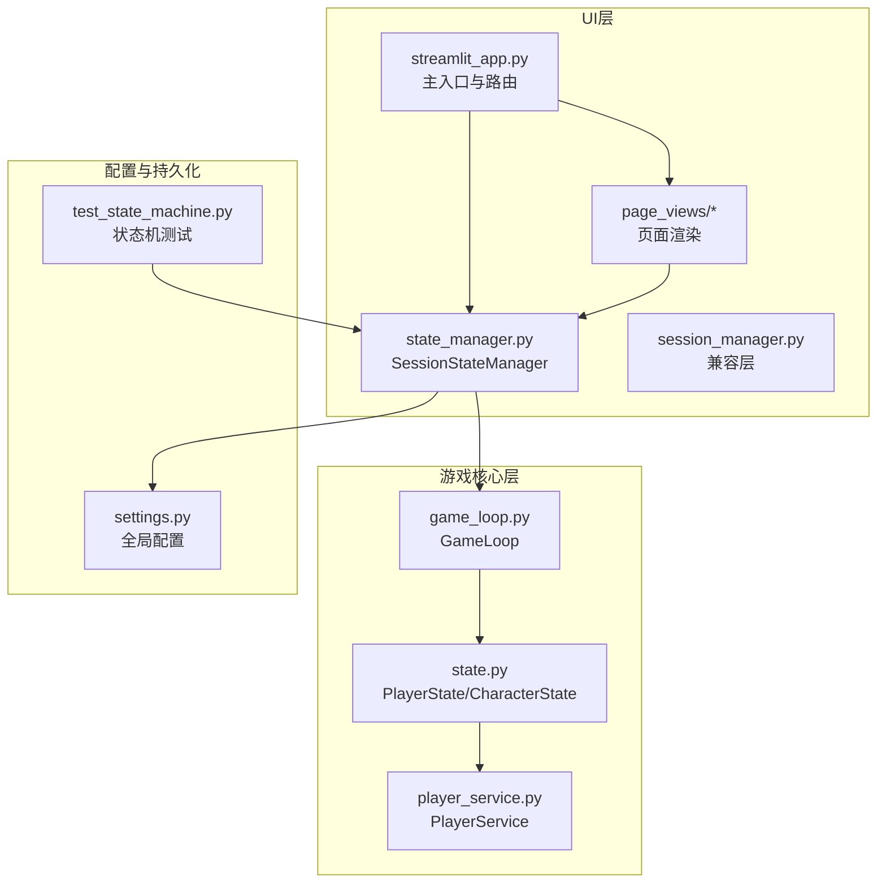
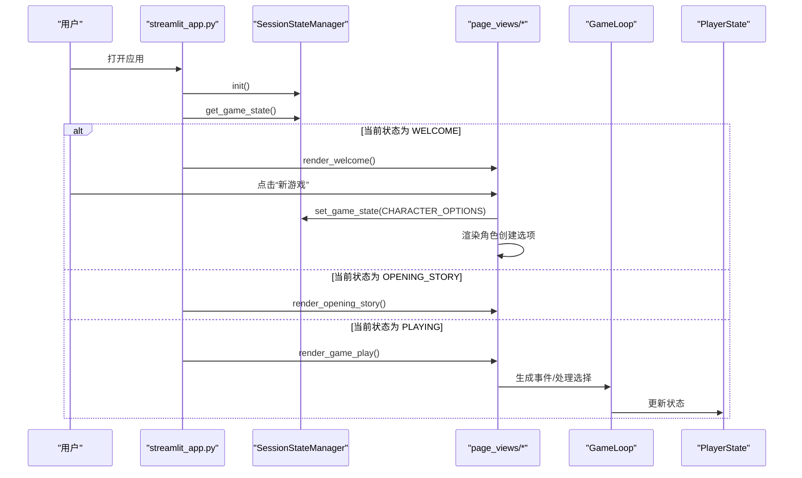
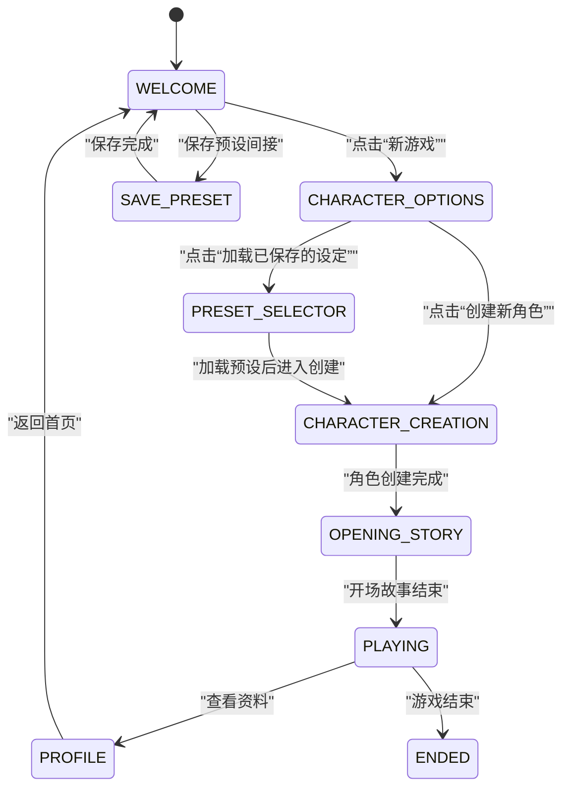
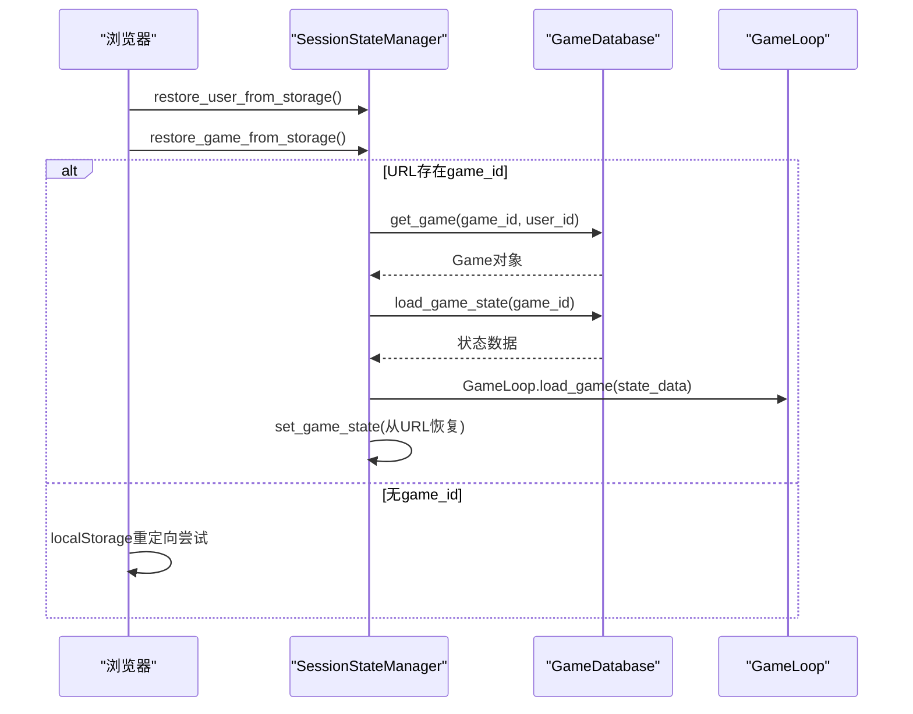
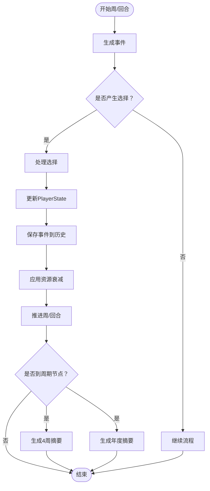
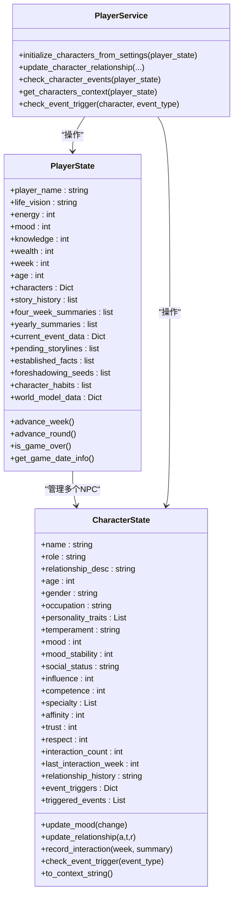
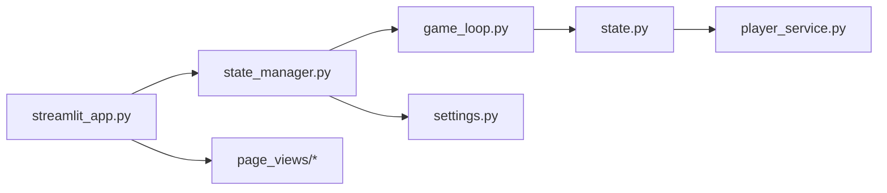

# 状态机模式

<cite>
**本文引用的文件**
- [src/ui/state_manager.py](file://src/ui/state_manager.py)
- [src/ui/session_manager.py](file://src/ui/session_manager.py)
- [src/ui/streamlit_app.py](file://src/ui/streamlit_app.py)
- [src/ui/page_views/welcome.py](file://src/ui/page_views/welcome.py)
- [src/ui/page_views/presets.py](file://src/ui/page_views/presets.py)
- [src/game/game_loop.py](file://src/game/game_loop.py)
- [src/game/state.py](file://src/game/state.py)
- [src/game/player_service.py](file://src/game/player_service.py)
- [config/settings.py](file://config/settings.py)
- [test_state_machine.py](file://test_state_machine.py)
</cite>

## 目录
1. [引言](#引言)
2. [项目结构](#项目结构)
3. [核心组件](#核心组件)
4. [架构总览](#架构总览)
5. [详细组件分析](#详细组件分析)
6. [依赖分析](#依赖分析)
7. [性能考虑](#性能考虑)
8. [故障排查指南](#故障排查指南)
9. [结论](#结论)
10. [附录](#附录)

## 引言
本文件系统性阐述本项目的“状态机模式”，聚焦于UI状态管理与游戏状态转换的实现机制。文档围绕以下目标展开：
- 解释UI状态机（GameState）的设计与状态转换规则
- 深入分析PlayerState与GameLoop在游戏流程控制中的协作
- 说明状态持久化与恢复策略（URL参数与localStorage）
- 提供状态转换图与典型流转示例
- 总结状态机在复杂业务逻辑与系统一致性方面的优势

## 项目结构
本项目采用“UI层-状态管理层-游戏核心层”的分层组织：
- UI层：负责页面渲染与用户交互，统一通过状态管理器驱动状态转换
- 状态管理层：集中管理会话状态、持久化与恢复
- 游戏核心层：封装玩家状态、事件生成、决策处理与周/回合推进

图表来源
- [src/ui/streamlit_app.py](file://src/ui/streamlit_app.py#L139-L215)
- [src/ui/state_manager.py](file://src/ui/state_manager.py#L29-L773)
- [src/ui/session_manager.py](file://src/ui/session_manager.py#L1-L65)
- [src/ui/page_views/welcome.py](file://src/ui/page_views/welcome.py#L1-L285)
- [src/ui/page_views/presets.py](file://src/ui/page_views/presets.py#L1-L39)
- [src/game/game_loop.py](file://src/game/game_loop.py#L24-L1216)
- [src/game/state.py](file://src/game/state.py#L244-L709)
- [src/game/player_service.py](file://src/game/player_service.py#L9-L176)
- [config/settings.py](file://config/settings.py#L30-L100)
- [test_state_machine.py](file://test_state_machine.py#L1-L207)

章节来源
- [src/ui/streamlit_app.py](file://src/ui/streamlit_app.py#L139-L215)
- [src/ui/state_manager.py](file://src/ui/state_manager.py#L29-L773)
- [src/ui/session_manager.py](file://src/ui/session_manager.py#L1-L65)
- [src/ui/page_views/welcome.py](file://src/ui/page_views/welcome.py#L1-L285)
- [src/ui/page_views/presets.py](file://src/ui/page_views/presets.py#L1-L39)
- [src/game/game_loop.py](file://src/game/game_loop.py#L24-L1216)
- [src/game/state.py](file://src/game/state.py#L244-L709)
- [src/game/player_service.py](file://src/game/player_service.py#L9-L176)
- [config/settings.py](file://config/settings.py#L30-L100)
- [test_state_machine.py](file://test_state_machine.py#L1-L207)

## 核心组件
- UI状态机（GameState）：定义UI层面的可互斥状态集合，确保同一时刻仅有一个有效状态
- SessionStateManager：集中式会话状态管理器，提供类型安全的getter/setter、初始化、清理与持久化/恢复接口
- GameLoop：游戏主循环，负责事件生成、决策处理、周/回合推进与摘要生成
- PlayerState：玩家状态载体，包含资源、时间、决策历史、角色系统、世界模型等
- PlayerService：从PlayerState抽离的业务逻辑服务，负责角色关系与事件检查
- settings：全局常量与配置，决定游戏时长、衰减、初始值等

章节来源
- [src/ui/state_manager.py](file://src/ui/state_manager.py#L29-L244)
- [src/ui/state_manager.py](file://src/ui/state_manager.py#L541-L773)
- [src/game/game_loop.py](file://src/game/game_loop.py#L24-L1216)
- [src/game/state.py](file://src/game/state.py#L244-L709)
- [src/game/player_service.py](file://src/game/player_service.py#L9-L176)
- [config/settings.py](file://config/settings.py#L30-L100)

## 架构总览
UI状态机通过SessionStateManager统一管理，配合Streamlit路由与页面渲染模块，实现清晰的状态转换；GameLoop与PlayerState共同完成游戏流程控制与状态持久化。

图表来源
- [src/ui/streamlit_app.py](file://src/ui/streamlit_app.py#L139-L215)
- [src/ui/state_manager.py](file://src/ui/state_manager.py#L215-L244)
- [src/ui/page_views/welcome.py](file://src/ui/page_views/welcome.py#L11-L177)
- [src/game/game_loop.py](file://src/game/game_loop.py#L154-L300)

## 详细组件分析

### UI状态机（GameState）设计与转换规则
- 状态集合：WELCOME、CHARACTER_OPTIONS、CHARACTER_CREATION、PRESET_SELECTOR、SAVE_PRESET、OPENING_STORY、PLAYING、ENDED、PROFILE
- 设计原则：
  - 互斥性：同一时刻仅允许一个状态为真
  - 明确性：每个状态对应唯一页面与交互路径
  - 可恢复性：通过URL参数与localStorage持久化，断线重连后可恢复
- 转换规则（基于UI层调用）：
  - WELCOME → CHARACTER_OPTIONS：点击“新游戏”
  - CHARACTER_OPTIONS → CHARACTER_CREATION：点击“创建新角色”
  - CHARACTER_OPTIONS → PRESET_SELECTOR：点击“加载已保存的设定”
  - CHARACTER_CREATION → OPENING_STORY：角色创建完成，准备进入开场故事
  - OPENING_STORY → PLAYING：开场故事结束，进入游戏主流程
  - PLAYING → PROFILE/ENDED：根据业务需要切换至资料页或结束页
  - PROFILE → WELCOME：退出资料页回到首页

图表来源
- [src/ui/state_manager.py](file://src/ui/state_manager.py#L29-L40)
- [src/ui/page_views/welcome.py](file://src/ui/page_views/welcome.py#L116-L135)
- [src/ui/page_views/presets.py](file://src/ui/page_views/presets.py#L15-L39)
- [src/ui/streamlit_app.py](file://src/ui/streamlit_app.py#L175-L210)

章节来源
- [src/ui/state_manager.py](file://src/ui/state_manager.py#L29-L244)
- [src/ui/page_views/welcome.py](file://src/ui/page_views/welcome.py#L116-L177)
- [src/ui/page_views/presets.py](file://src/ui/page_views/presets.py#L15-L39)
- [src/ui/streamlit_app.py](file://src/ui/streamlit_app.py#L175-L210)

### 状态持久化与恢复机制
- 用户会话持久化：
  - URL参数：user_id
  - localStorage：story2_user_id
- 游戏会话持久化：
  - URL参数：game_id、game_state
  - localStorage：story2_game_id、story2_game_state
- 恢复流程：
  - 应用启动时优先尝试从URL参数恢复；若无则尝试localStorage重定向恢复
  - 恢复成功后设置SessionStateManager.game_state，并清理临时状态

图表来源
- [src/ui/state_manager.py](file://src/ui/state_manager.py#L587-L773)

章节来源
- [src/ui/state_manager.py](file://src/ui/state_manager.py#L550-L773)

### 游戏状态转换与流程控制（GameLoop）
- 事件生成：每周生成一次事件，里程碑周优先触发
- 决策处理：解析选择，更新PlayerState，清理current_event_data
- 周推进：保存故事、应用资源衰减、生成周期性摘要、推进周数
- 多回合系统：每周内可多次生成事件（回合），支持回合上下文拼接与总结

图表来源
- [src/game/game_loop.py](file://src/game/game_loop.py#L154-L351)
- [src/game/game_loop.py](file://src/game/game_loop.py#L352-L496)

章节来源
- [src/game/game_loop.py](file://src/game/game_loop.py#L154-L496)

### PlayerState与角色系统
- PlayerState承载资源、时间、决策历史、角色系统、世界模型等
- 角色系统：CharacterState封装NPC属性与事件阈值，支持关系更新、情绪变化、互动记录
- 关系事件：通过PlayerService检查并触发特定事件（如深度友谊、冲突、背叛风险等）

图表来源
- [src/game/state.py](file://src/game/state.py#L12-L709)
- [src/game/player_service.py](file://src/game/player_service.py#L9-L176)

章节来源
- [src/game/state.py](file://src/game/state.py#L12-L709)
- [src/game/player_service.py](file://src/game/player_service.py#L9-L176)

### 状态一致性与约束（测试验证）
- 排他性约束：character_creation、show_preset_selector、show_save_preset三者不可同时为真
- 互斥性约束：存在game_loop时，character_creation应为False
- 初始化约束：character_creation为True时，player_name应已初始化

章节来源
- [test_state_machine.py](file://test_state_machine.py#L145-L169)

## 依赖分析
- UI层依赖状态管理层：通过SessionStateManager集中访问与修改状态
- 页面渲染依赖状态机：根据当前状态选择渲染对应页面
- GameLoop依赖PlayerState与AI生成器：负责事件生成与状态推进
- PlayerService依赖PlayerState：封装角色关系与事件检查逻辑
- settings提供全局常量：决定游戏时长、衰减、初始值等

图表来源
- [src/ui/streamlit_app.py](file://src/ui/streamlit_app.py#L1-L215)
- [src/ui/state_manager.py](file://src/ui/state_manager.py#L1-L773)
- [src/ui/page_views/welcome.py](file://src/ui/page_views/welcome.py#L1-L285)
- [src/game/game_loop.py](file://src/game/game_loop.py#L1-L1216)
- [src/game/state.py](file://src/game/state.py#L1-L709)
- [src/game/player_service.py](file://src/game/player_service.py#L1-L176)
- [config/settings.py](file://config/settings.py#L1-L100)

章节来源
- [src/ui/streamlit_app.py](file://src/ui/streamlit_app.py#L1-L215)
- [src/ui/state_manager.py](file://src/ui/state_manager.py#L1-L773)
- [src/ui/page_views/welcome.py](file://src/ui/page_views/welcome.py#L1-L285)
- [src/game/game_loop.py](file://src/game/game_loop.py#L1-L1216)
- [src/game/state.py](file://src/game/state.py#L1-L709)
- [src/game/player_service.py](file://src/game/player_service.py#L1-L176)
- [config/settings.py](file://config/settings.py#L1-L100)

## 性能考虑
- 事件生成与AI调用：通过回调与流式输出减少阻塞，必要时降级为简单事件
- 周期性摘要：按4周与48周生成，避免频繁计算
- 资源衰减：低阈值自动衰减，降低玩家长期高资源带来的计算压力
- 状态持久化：URL与localStorage双通道，提高恢复成功率与速度

## 故障排查指南
- 状态异常：
  - 症状：多个排他状态同时为真
  - 排查：检查页面按钮点击逻辑与状态设置顺序
  - 参考：测试用例对排他性与互斥性的验证
- 恢复失败：
  - 症状：URL参数无效或localStorage缺失
  - 排查：确认URL参数与localStorage键值；检查用户权限与游戏存在性
  - 参考：恢复函数的错误日志与清理逻辑
- 游戏循环异常：
  - 症状：事件重复生成或周推进失败
  - 排查：检查last_event_week与current_event_data；确认决策处理后的清理
  - 参考：GameLoop的事件生成与周推进流程

章节来源
- [test_state_machine.py](file://test_state_machine.py#L145-L169)
- [src/ui/state_manager.py](file://src/ui/state_manager.py#L662-L773)
- [src/game/game_loop.py](file://src/game/game_loop.py#L154-L351)

## 结论
本项目通过明确的UI状态机与集中式会话状态管理，实现了UI导航与业务流程的清晰分离；结合GameLoop与PlayerState，构建了可扩展、可恢复、可测试的游戏状态转换体系。状态机模式在以下方面体现出显著优势：
- 业务流程可视化：状态图直观表达UI与游戏流程
- 一致性保障：排他性与互斥性约束确保状态合法
- 可维护性：集中式状态管理降低耦合，便于扩展与调试
- 可靠性：完善的持久化与恢复机制提升用户体验

## 附录
- 状态转换示例（基于页面交互）：
  - “新游戏” → 进入角色创建选项 → 创建新角色 → 进入开场故事 → 进入游戏主流程
  - “加载已保存的设定” → 进入预设选择 → 加载预设 → 进入角色创建 → 完成后进入开场故事
- 最佳实践：
  - 在页面渲染前统一通过SessionStateManager获取状态
  - 修改状态时使用类型安全的setter，必要时触发st.rerun
  - 对关键状态变更添加测试用例，确保一致性