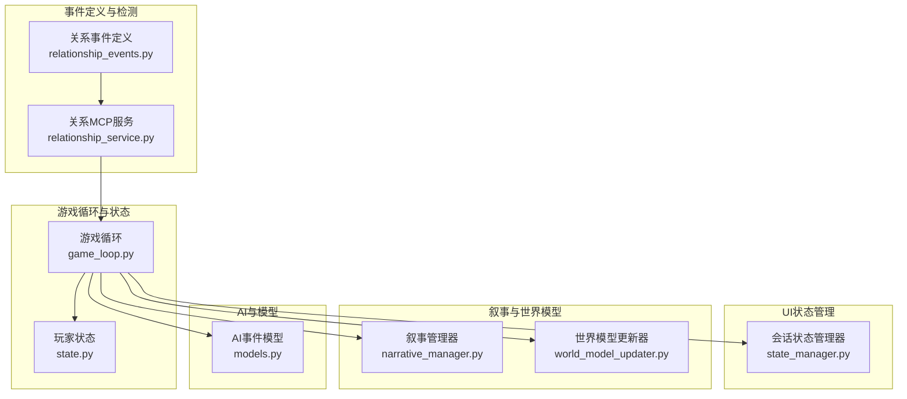
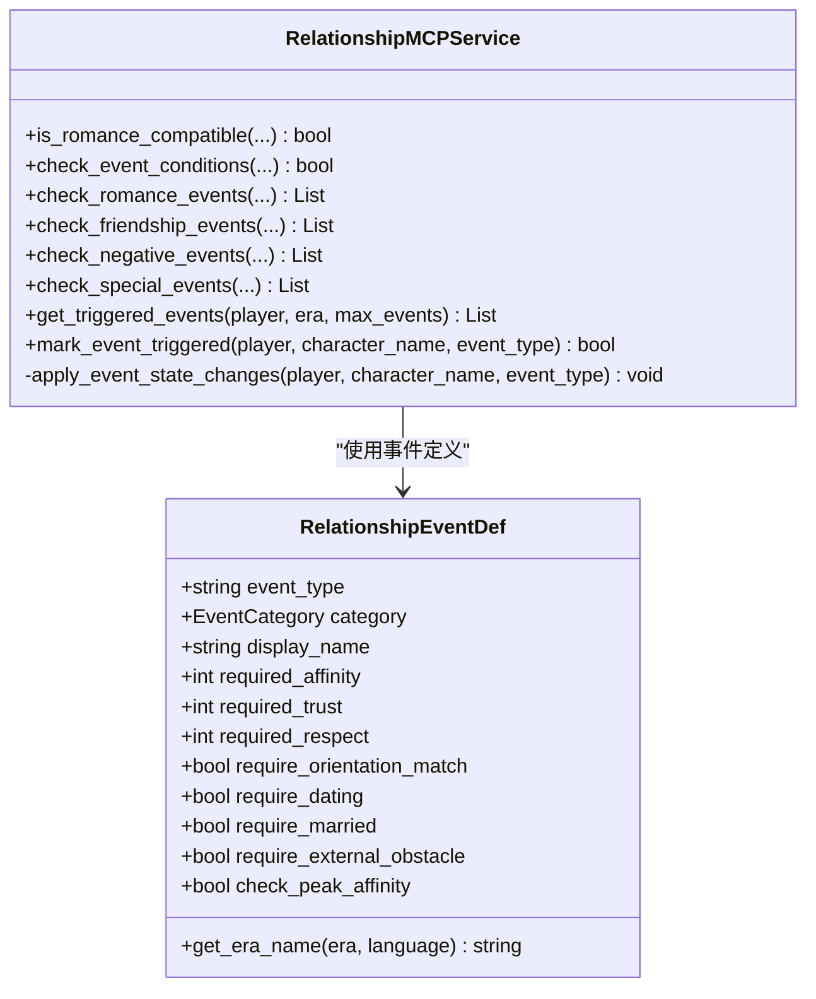
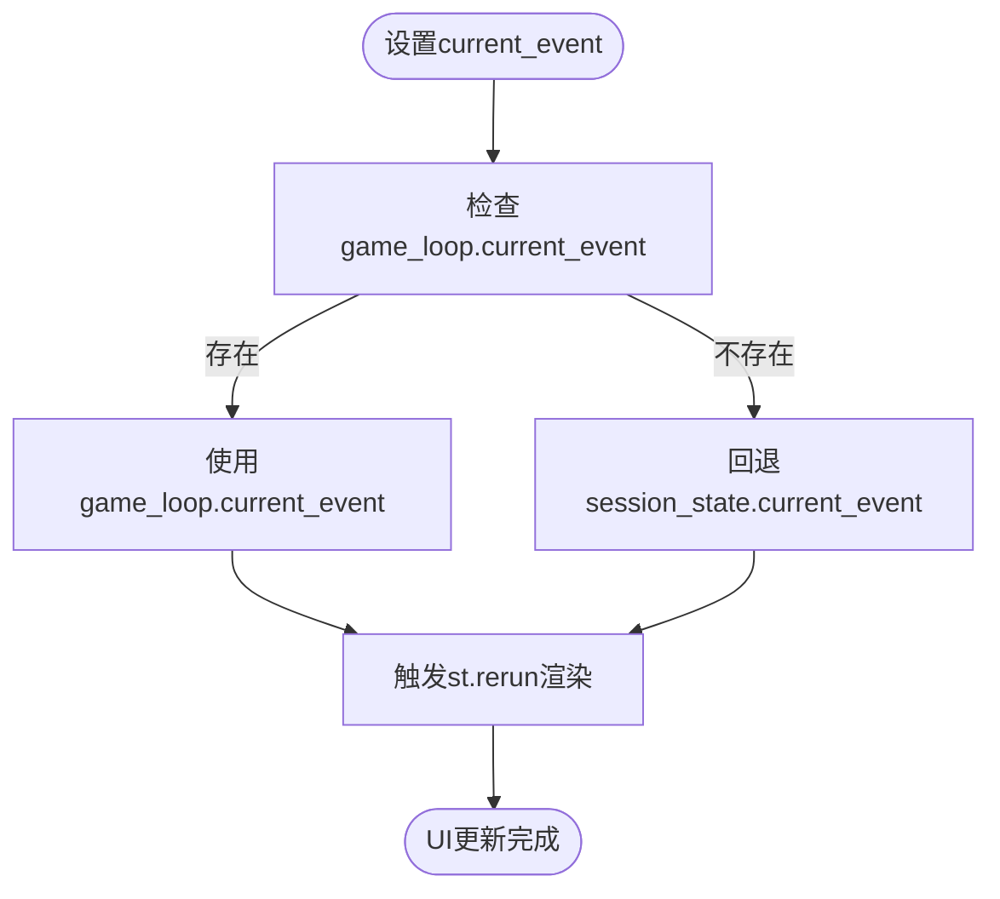
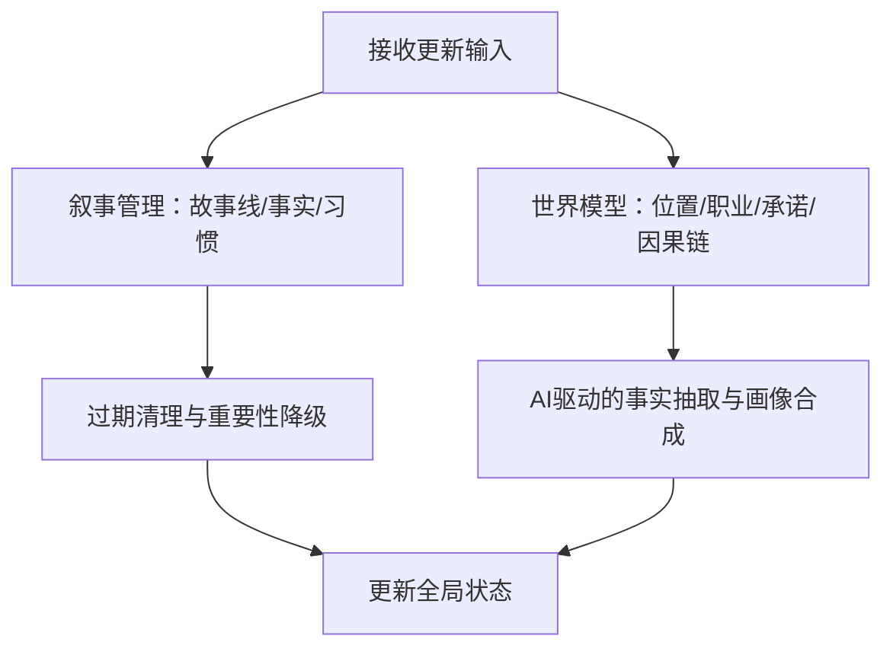
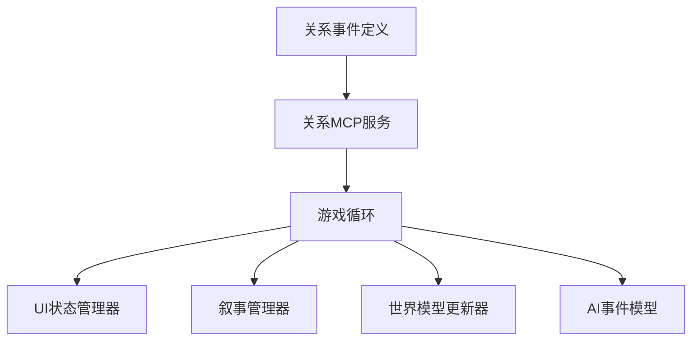

# 观察者模式

<cite>
**本文档引用的文件**
- [relationship_events.py](file://src/game/relationship_events.py)
- [relationship_service.py](file://src/mcp/relationship_service.py)
- [state.py](file://src/game/state.py)
- [game_loop.py](file://src/game/game_loop.py)
- [state_manager.py](file://src/ui/state_manager.py)
- [narrative_manager.py](file://src/game/narrative_manager.py)
- [models.py](file://src/ai/models.py)
- [test_relationship_events.py](file://tests/test_relationship_events.py)
- [test_events.py](file://tests/test_events.py)
</cite>

## 目录
1. [简介](#简介)
2. [项目结构](#项目结构)
3. [核心组件](#核心组件)
4. [架构总览](#架构总览)
5. [详细组件分析](#详细组件分析)
6. [依赖分析](#依赖分析)
7. [性能考虑](#性能考虑)
8. [故障排查指南](#故障排查指南)
9. [结论](#结论)

## 简介
本文件系统化阐述该代码库中的事件驱动架构与观察者模式实践，重点围绕以下主题展开：
- 事件发布订阅机制：以关系事件为核心，展示如何在NPC关系变化与叙事内容更新中实现松耦合的事件传播。
- 观察者与被观察者连接：通过关系事件检测服务与UI状态管理器的协作，体现观察者模式在响应式UI更新与多组件协调中的优势。
- 回调函数管理：通过流式回调与事件回调接口，实现事件生成、处理与渲染的解耦。
- 实现路径：提供事件处理流程图与代码示例路径，帮助读者快速定位注册观察者、触发事件、清理观察者的操作。

## 项目结构
该项目采用分层架构，事件驱动的核心模块包括：
- 关系事件定义与检测：关系事件定义、MCP服务检测与触发。
- 游戏循环与状态：事件生成、决策处理、状态推进。
- UI状态管理：统一事件源与响应式渲染。
- 叙事与世界模型：叙事线、事实、伏笔与角色画像的增量更新。



**图表来源**
- [relationship_events.py](file://src/game/relationship_events.py#L1-L354)
- [relationship_service.py](file://src/mcp/relationship_service.py#L1-L520)
- [game_loop.py](file://src/game/game_loop.py#L1-L200)
- [state.py](file://src/game/state.py#L1-L709)
- [state_manager.py](file://src/ui/state_manager.py#L1-L773)
- [narrative_manager.py](file://src/game/narrative_manager.py#L1-L584)
- [models.py](file://src/ai/models.py#L1-L27)

**章节来源**
- [relationship_events.py](file://src/game/relationship_events.py#L1-L354)
- [relationship_service.py](file://src/mcp/relationship_service.py#L1-L520)
- [game_loop.py](file://src/game/game_loop.py#L1-L200)
- [state.py](file://src/game/state.py#L1-L709)
- [state_manager.py](file://src/ui/state_manager.py#L1-L773)
- [narrative_manager.py](file://src/game/narrative_manager.py#L1-L584)
- [models.py](file://src/ai/models.py#L1-L27)

## 核心组件
- 关系事件定义系统：集中定义15种关系事件，包含触发条件、时代适配与描述模板，作为“被观察者”的事件源。
- 关系MCP服务：负责检测NPC关系事件的触发条件，生成触发事件列表，并应用事件带来的状态变更。
- 游戏循环：统一调度事件生成、决策处理与状态推进，充当事件的“发布者”与“观察者”之间的协调中枢。
- UI状态管理器：提供单一可信事件源，确保UI响应式更新与事件传播的一致性。
- 叙事与世界模型：负责叙事线、事实、伏笔与角色画像的增量更新，体现事件对全局状态的影响。

**章节来源**
- [relationship_events.py](file://src/game/relationship_events.py#L18-L354)
- [relationship_service.py](file://src/mcp/relationship_service.py#L45-L520)
- [game_loop.py](file://src/game/game_loop.py#L24-L200)
- [state_manager.py](file://src/ui/state_manager.py#L42-L538)
- [narrative_manager.py](file://src/game/narrative_manager.py#L15-L584)

## 架构总览
事件驱动架构以“关系事件”为核心，通过MCP服务检测触发条件，游戏循环统一生成与处理事件，UI状态管理器提供响应式渲染，形成松耦合的观察者模式体系。

```mermaid
sequenceDiagram
participant Player as "玩家状态<br/>PlayerState"
participant MCP as "关系MCP服务<br/>RelationshipMCPService"
participant Loop as "游戏循环<br/>GameLoop"
participant UI as "UI状态管理器<br/>SessionStateManager"
Player->>MCP : "检查可触发关系事件"
MCP-->>Player : "返回触发事件列表"
Player->>Loop : "生成事件并推进状态"
Loop-->>UI : "设置当前事件"
UI-->>UI : "响应式渲染"
Note over Player,MCP : "事件触发后更新NPC状态"
```

**图表来源**
- [relationship_service.py](file://src/mcp/relationship_service.py#L330-L387)
- [game_loop.py](file://src/game/game_loop.py#L154-L200)
- [state_manager.py](file://src/ui/state_manager.py#L247-L278)

**章节来源**
- [relationship_service.py](file://src/mcp/relationship_service.py#L330-L387)
- [game_loop.py](file://src/game/game_loop.py#L154-L200)
- [state_manager.py](file://src/ui/state_manager.py#L247-L278)

## 详细组件分析

### 组件A：关系事件定义与MCP服务
- 关系事件定义：集中定义15种事件类型，包含触发阈值、状态要求与时代适配，作为“被观察者”的事件源。
- MCP服务：检测NPC关系事件，生成触发事件并应用状态变更；避免重复触发，支持优先级排序与时代适配。



**图表来源**
- [relationship_events.py](file://src/game/relationship_events.py#L18-L354)
- [relationship_service.py](file://src/mcp/relationship_service.py#L45-L520)

**章节来源**
- [relationship_events.py](file://src/game/relationship_events.py#L18-L354)
- [relationship_service.py](file://src/mcp/relationship_service.py#L45-L520)

### 组件B：游戏循环与事件生成
- 事件生成：按周生成事件，支持里程碑事件与强制生成；通过回调接口传递事件至UI。
- 决策处理：处理玩家选择，应用效果并推进状态；支持多轮系统与周总结。

```mermaid
sequenceDiagram
participant Loop as "GameLoop"
participant Gen as "EventGenerator/AI"
participant UI as "UI状态管理器"
Loop->>Gen : "生成事件"
Gen-->>Loop : "返回GameEvent"
Loop->>UI : "设置current_event"
UI-->>UI : "渲染事件界面"
Loop->>Loop : "处理玩家选择"
Loop->>UI : "清理current_event"
```

**图表来源**
- [game_loop.py](file://src/game/game_loop.py#L154-L200)
- [models.py](file://src/ai/models.py#L14-L27)
- [state_manager.py](file://src/ui/state_manager.py#L247-L278)

**章节来源**
- [game_loop.py](file://src/game/game_loop.py#L154-L200)
- [models.py](file://src/ai/models.py#L14-L27)
- [state_manager.py](file://src/ui/state_manager.py#L247-L278)

### 组件C：UI状态管理器与响应式更新
- 单一可信事件源：统一current_event来源，确保UI渲染一致性。
- 响应式更新：通过st.rerun触发页面刷新，实现事件驱动的UI更新。



**图表来源**
- [state_manager.py](file://src/ui/state_manager.py#L247-L278)

**章节来源**
- [state_manager.py](file://src/ui/state_manager.py#L247-L278)

### 组件D：叙事与世界模型更新
- 叙事管理：处理故事线、事实与角色习惯的增删改查，支持过期清理与重要性降级。
- 世界模型：处理位置、职业、承诺与因果链的更新，支持AI驱动的事实抽取与角色画像合成。



**图表来源**
- [narrative_manager.py](file://src/game/narrative_manager.py#L22-L584)
- [world_model_updater.py](file://src/game/world_model_updater.py#L22-L528)

**章节来源**
- [narrative_manager.py](file://src/game/narrative_manager.py#L22-L584)
- [world_model_updater.py](file://src/game/world_model_updater.py#L22-L528)

## 依赖分析
- 松耦合设计：关系事件定义与MCP服务通过数据类与枚举解耦；游戏循环通过回调接口与UI解耦。
- 观察者链路：UI状态管理器作为观察者，统一消费来自游戏循环的事件；MCP服务作为事件检测者，向游戏循环提供触发事件。
- 数据一致性：通过单一可信事件源与状态推进，保证UI与业务逻辑的一致性。



**图表来源**
- [relationship_events.py](file://src/game/relationship_events.py#L1-L354)
- [relationship_service.py](file://src/mcp/relationship_service.py#L1-L520)
- [game_loop.py](file://src/game/game_loop.py#L1-L200)
- [state_manager.py](file://src/ui/state_manager.py#L1-L773)
- [narrative_manager.py](file://src/game/narrative_manager.py#L1-L584)
- [models.py](file://src/ai/models.py#L1-L27)

**章节来源**
- [relationship_events.py](file://src/game/relationship_events.py#L1-L354)
- [relationship_service.py](file://src/mcp/relationship_service.py#L1-L520)
- [game_loop.py](file://src/game/game_loop.py#L1-L200)
- [state_manager.py](file://src/ui/state_manager.py#L1-L773)
- [narrative_manager.py](file://src/game/narrative_manager.py#L1-L584)
- [models.py](file://src/ai/models.py#L1-L27)

## 性能考虑
- 事件检测优化：MCP服务按类别批量检测事件，支持优先级排序与数量限制，避免过度计算。
- UI渲染优化：通过单一可信事件源与st.rerun触发，减少不必要的全量刷新。
- 增量更新：叙事与世界模型采用增量更新策略，结合过期清理与重要性降级，控制内存与计算开销。

## 故障排查指南
- 事件未触发：检查NPC状态是否满足触发条件，确认事件是否已在已触发列表中。
- UI未更新：确认current_event是否正确设置，检查st.rerun是否被调用。
- 时代适配异常：验证事件定义中的时代映射，确保era字符串规范化处理。

**章节来源**
- [relationship_service.py](file://src/mcp/relationship_service.py#L146-L238)
- [state_manager.py](file://src/ui/state_manager.py#L247-L278)
- [relationship_events.py](file://src/game/relationship_events.py#L51-L90)

## 结论
该代码库通过关系事件定义与MCP服务实现了事件驱动的NPC关系变化监听，结合游戏循环与UI状态管理器，形成了松耦合的观察者模式体系。事件传播机制清晰、回调函数管理规范，有效支撑了响应式UI更新与多组件协调。通过叙事与世界模型的增量更新，进一步增强了系统的扩展性与可维护性。