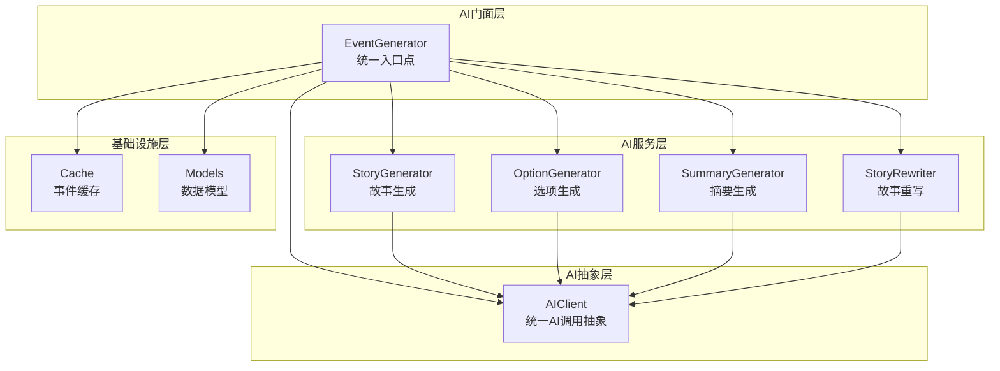
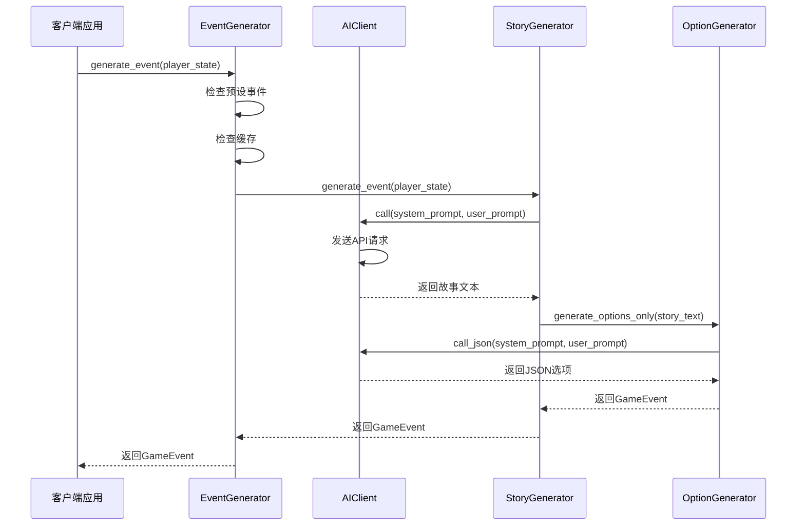
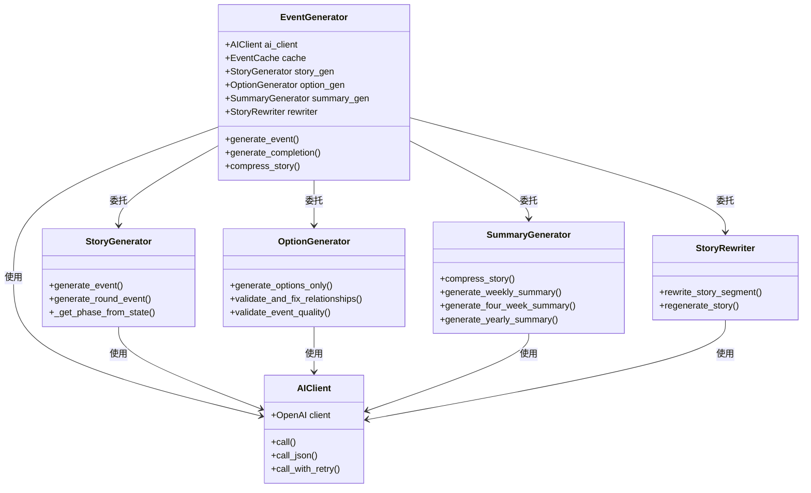
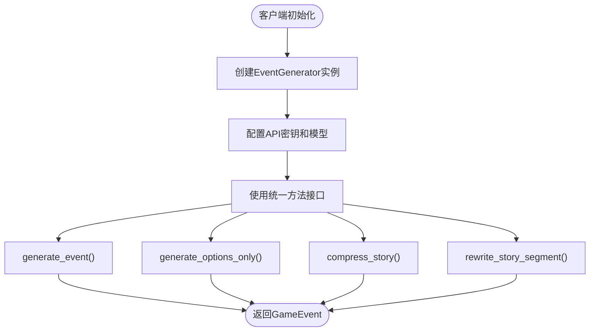

# 门面模式

<cite>
**本文档中引用的文件**
- [generator.py](file://src/ai/generator.py)
- [client.py](file://src/ai/client.py)
- [story_generator.py](file://src/ai/story_generator.py)
- [option_generator.py](file://src/ai/option_generator.py)
- [summary_generator.py](file://src/ai/summary_generator.py)
- [story_rewriter.py](file://src/ai/story_rewriter.py)
- [models.py](file://src/ai/models.py)
- [cache.py](file://src/ai/cache.py)
- [story_service.py](file://src/game/story_service.py)
- [__init__.py](file://src/ai/__init__.py)
</cite>

## 目录
1. [简介](#简介)
2. [项目结构](#项目结构)
3. [核心组件](#核心组件)
4. [架构概览](#架构概览)
5. [详细组件分析](#详细组件分析)
6. [依赖关系分析](#依赖关系分析)
7. [性能考虑](#性能考虑)
8. [故障排除指南](#故障排除指南)
9. [结论](#结论)

## 简介

本文档深入分析了AI服务中门面模式的实现，重点解释EventGenerator类如何作为AI服务的统一入口点。门面模式通过提供简化的接口来封装复杂的AI服务调用，使客户端能够以统一的方式访问各种AI功能，而无需了解底层实现的复杂性。

该实现将原本1174行的God Class重构为轻量级门面，委托给专门的子服务，包括故事生成器、选项生成器、摘要生成器和故事重写器。这种设计不仅提高了代码的可维护性，还确保了向后兼容性，所有现有的公共方法签名都得到了保留。

## 项目结构

AI模块采用清晰的分层架构，每个组件都有明确的职责分工：

**图表来源**
- [generator.py](file://src/ai/generator.py#L30-L65)
- [client.py](file://src/ai/client.py#L22-L48)

**章节来源**
- [generator.py](file://src/ai/generator.py#L1-L44)
- [__init__.py](file://src/ai/__init__.py#L1-L17)

## 核心组件

### EventGenerator - 门面模式的核心

EventGenerator是整个AI服务的统一入口点，实现了门面模式的核心原则：

#### 构造函数参数
- `api_key`: OpenAI API密钥（默认从配置获取）
- `model`: OpenAI模型名称（默认从配置获取）
- `use_cache`: 是否使用事件缓存

#### 关键特性
1. **向后兼容性**: 保留所有现有公共方法签名
2. **统一抽象**: 所有AI调用都通过AIClient进行
3. **子服务管理**: 创建并管理四个专门的子服务实例

**章节来源**
- [generator.py](file://src/ai/generator.py#L37-L65)

### AIClient - AI调用抽象层

AIClient提供了统一的AI调用接口，确保所有AI服务都通过同一个抽象层进行通信：

#### 核心方法
- `call()`: 基础文本生成调用
- `call_json()`: JSON格式响应的AI调用
- `call_with_retry()`: 带错误反馈的重试机制

#### 错误处理机制
- 统一的异常处理
- 多次重试支持
- 错误反馈注入（学习机制）

**章节来源**
- [client.py](file://src/ai/client.py#L22-L214)

## 架构概览

门面模式的实现遵循了清晰的分层设计原则：

**图表来源**
- [generator.py](file://src/ai/generator.py#L182-L238)
- [story_generator.py](file://src/ai/story_generator.py#L32-L175)
- [option_generator.py](file://src/ai/option_generator.py#L25-L132)

## 详细组件分析

### 故事生成器 (StoryGenerator)

负责两阶段管道的第一阶段，生成纯故事文本：

#### 两阶段生成流程
1. **阶段1**: 生成故事文本（StoryGenerator）
2. **阶段2**: 基于故事生成选项（OptionGenerator）

#### 关键功能
- 生活阶段确定
- 决策历史处理
- 一致性验证
- 缓存管理

**章节来源**
- [story_generator.py](file://src/ai/story_generator.py#L24-L175)

### 选项生成器 (OptionGenerator)

处理现有故事的选项生成和验证：

#### 验证和修复机制
- 关系名称验证和修复
- 选项数量检查（至少2个）
- 效果合理性验证

#### 回退策略
- 失败时生成默认选项
- 合理的属性变化范围

**章节来源**
- [option_generator.py](file://src/ai/option_generator.py#L17-L132)

### 摘要生成器 (SummaryGenerator)

处理故事压缩、周总结、四周期总结和年总结：

#### 压缩算法
- 故事到摘要的转换
- 世界事实更新
- 行动线跟踪
- 习惯变化记录

#### 多种摘要类型
- 单个故事压缩
- 周度总结
- 四周期总结
- 年度总结

**章节来源**
- [summary_generator.py](file://src/ai/summary_generator.py#L17-L140)

### 故事重写器 (StoryRewriter)

提供段落级重写和完整故事再生功能：

#### 重写功能
- 指定段落重写
- 上下文保持
- 角色设定一致性
- 文学质量保证

#### 再生功能
- 基于上下文的全新生成
- 逻辑一致性维护
- 流畅性优化

**章节来源**
- [story_rewriter.py](file://src/ai/story_rewriter.py#L16-L200)

### 数据模型 (Models)

定义了AI服务使用的数据结构：

#### GameEvent模型
- 事件描述（最多10000字符）
- 选项列表（2-4个选项）
- 效果映射

#### EventOption模型
- 选项文本（最多200字符）
- 效果字典
- 可能性标记

**章节来源**
- [models.py](file://src/ai/models.py#L7-L27)

### 事件缓存 (Cache)

提供智能缓存机制以减少API调用：

#### 缓存策略
- 基于玩家状态的缓存键生成
- 随机缓存使用率（30%）
- 哈希签名减少缓存冲突
- 自动序列化/反序列化

#### 性能优化
- 减少重复API调用
- 维持内容多样性
- 文件持久化存储

**章节来源**
- [cache.py](file://src/ai/cache.py#L13-L139)

## 依赖关系分析

门面模式的依赖关系体现了清晰的层次结构：

**图表来源**
- [generator.py](file://src/ai/generator.py#L30-L65)
- [client.py](file://src/ai/client.py#L22-L48)

### 客户端集成示例

门面模式的一个重要优势是简化了客户端的集成：

**图表来源**
- [story_service.py](file://src/game/story_service.py#L14-L16)
- [generator.py](file://src/ai/generator.py#L182-L408)

**章节来源**
- [story_service.py](file://src/game/story_service.py#L11-L16)

## 性能考虑

门面模式在性能方面提供了多重优化：

### 缓存策略
- 智能缓存键生成，基于玩家状态的关键特征
- 随机缓存使用率确保内容多样性
- 文件系统持久化减少内存压力

### 错误处理优化
- 统一的重试机制，避免重复API调用
- 错误反馈注入帮助模型学习改进
- 分阶段验证减少无效调用

### 内存管理
- 模块化设计便于垃圾回收
- 按需加载子服务实例
- 最小化全局状态共享

## 故障排除指南

### 常见问题及解决方案

#### API密钥配置问题
- **症状**: 初始化时抛出ValueError
- **原因**: 缺少API密钥配置
- **解决**: 在配置文件中设置OPENAI_API_KEY

#### 缓存失效问题
- **症状**: 缓存读取失败或返回None
- **原因**: 缓存文件损坏或解析错误
- **解决**: 清空缓存或禁用缓存功能

#### 选项生成失败
- **症状**: 生成的选项少于2个或格式错误
- **原因**: AI响应不符合预期格式
- **解决**: 使用回退策略生成默认选项

#### 重试机制问题
- **症状**: 重试次数过多但仍然失败
- **原因**: 持续的API错误或格式问题
- **解决**: 检查网络连接和API配额

**章节来源**
- [client.py](file://src/ai/client.py#L140-L213)
- [option_generator.py](file://src/ai/option_generator.py#L118-L132)
- [cache.py](file://src/ai/cache.py#L28-L45)

## 结论

EventGenerator类成功实现了门面模式，为AI服务提供了统一、简洁的接口。通过将复杂的AI服务调用封装为简单的接口，该设计显著降低了客户端的复杂度，提高了系统的可维护性。

### 主要优势

1. **简化接口**: 客户端只需了解一个统一的接口
2. **职责分离**: 每个子服务专注于特定功能
3. **向后兼容**: 保持现有API不变
4. **可扩展性**: 易于添加新的AI功能
5. **错误处理**: 统一的错误处理和重试机制

### 设计亮点

- **模块化架构**: 清晰的职责分工
- **智能缓存**: 性能优化和成本控制
- **回退策略**: 系统稳定性保障
- **统一抽象**: 底层实现的透明化

这种门面模式的实现为大型AI服务提供了良好的架构基础，既满足了功能需求，又保持了代码的可维护性和可扩展性。