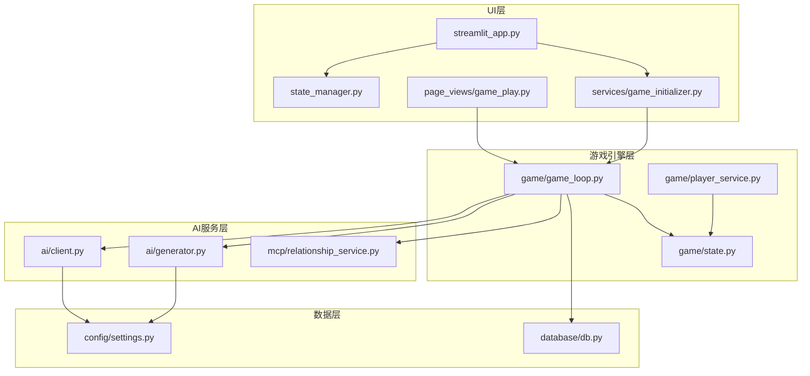
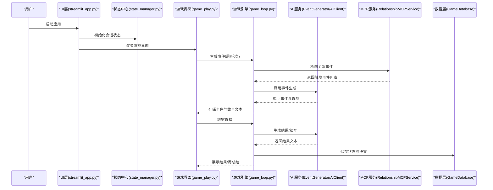
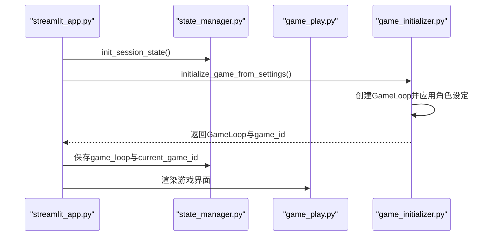
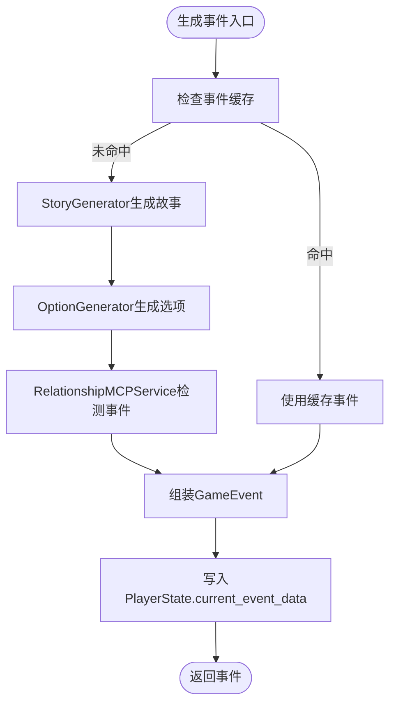
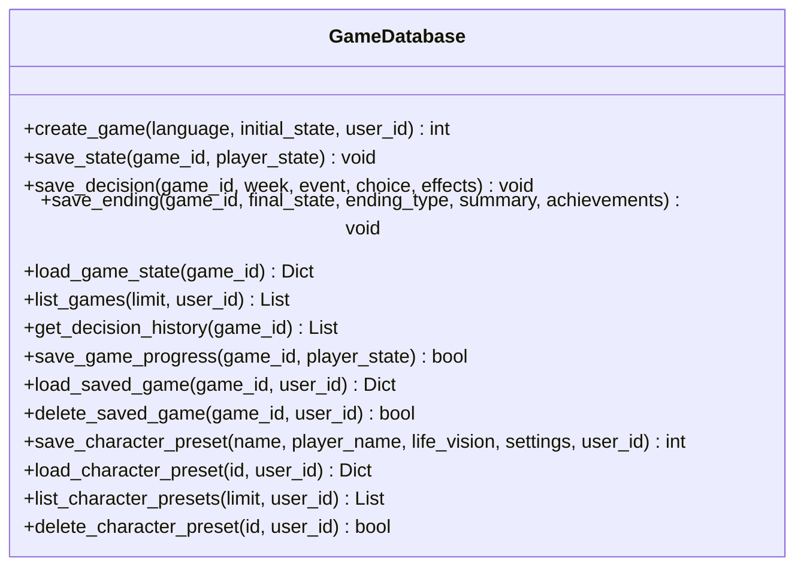
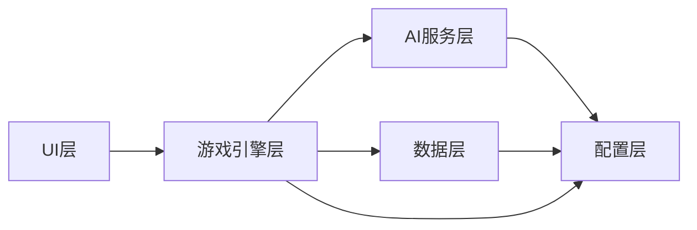

# 组件交互关系

<cite>
**本文引用的文件**
- [README.md](file://README.md)
- [src/ui/streamlit_app.py](file://src/ui/streamlit_app.py)
- [src/ui/state_manager.py](file://src/ui/state_manager.py)
- [src/ui/session_manager.py](file://src/ui/session_manager.py)
- [src/ui/page_views/game_play.py](file://src/ui/page_views/game_play.py)
- [src/ui/services/game_initializer.py](file://src/ui/services/game_initializer.py)
- [src/game/game_loop.py](file://src/game/game_loop.py)
- [src/game/state.py](file://src/game/state.py)
- [src/game/player_service.py](file://src/game/player_service.py)
- [src/ai/client.py](file://src/ai/client.py)
- [src/ai/generator.py](file://src/ai/generator.py)
- [src/mcp/relationship_service.py](file://src/mcp/relationship_service.py)
- [src/database/db.py](file://src/database/db.py)
- [config/settings.py](file://config/settings.py)
</cite>

## 目录
1. [简介](#简介)
2. [项目结构](#项目结构)
3. [核心组件](#核心组件)
4. [架构总览](#架构总览)
5. [详细组件分析](#详细组件分析)
6. [依赖分析](#依赖分析)
7. [性能考虑](#性能考虑)
8. [故障排查指南](#故障排查指南)
9. [结论](#结论)

## 简介
本文件聚焦“人生草稿本”的组件交互关系，系统性梳理UI层、游戏引擎、AI服务与数据管理层之间的协作与通信机制。重点说明：
- UI组件如何驱动游戏引擎产生事件、处理选择、刷新界面；
- 游戏引擎如何与AI服务协作生成事件、选项与总结，并与MCP服务协同触发关系事件；
- 数据管理层在持久化、缓存与事务协调中的枢纽作用；
- 组件间依赖注入、接口契约与消息传递机制；
- 提供典型用户操作的时序图与交互图，展示调用链路与数据流转。

## 项目结构
项目采用分层架构：UI层（Streamlit）、业务逻辑层（游戏引擎与MCP服务）、AI服务层（统一客户端与事件生成器）、数据层（数据库与缓存）。配置集中于settings模块，便于跨层共享。

图表来源
- [src/ui/streamlit_app.py](file://src/ui/streamlit_app.py#L1-L215)
- [src/ui/state_manager.py](file://src/ui/state_manager.py#L1-L773)
- [src/ui/page_views/game_play.py](file://src/ui/page_views/game_play.py#L1-L662)
- [src/ui/services/game_initializer.py](file://src/ui/services/game_initializer.py#L1-L155)
- [src/game/game_loop.py](file://src/game/game_loop.py#L1-L1193)
- [src/game/state.py](file://src/game/state.py#L1-L709)
- [src/game/player_service.py](file://src/game/player_service.py#L1-L176)
- [src/ai/client.py](file://src/ai/client.py#L1-L214)
- [src/ai/generator.py](file://src/ai/generator.py#L1-L431)
- [src/mcp/relationship_service.py](file://src/mcp/relationship_service.py#L1-L520)
- [src/database/db.py](file://src/database/db.py#L1-L517)
- [config/settings.py](file://config/settings.py#L1-L100)

章节来源
- [README.md](file://README.md#L61-L73)
- [config/settings.py](file://config/settings.py#L1-L100)

## 核心组件
- UI层
  - 应用入口与路由：streamlit_app.py负责页面路由、会话状态初始化与调试控制台渲染。
  - 状态中心：state_manager.py提供类型安全的全局会话状态管理，统一事件、结果、用户与UI标志位。
  - 游戏主界面：page_views/game_play.py承载事件展示、选项渲染、选择处理与结果呈现。
  - 初始化服务：services/game_initializer.py集中处理从角色设定到游戏实例创建与数据库落盘的流程。
- 游戏引擎层
  - GameLoop：主循环与事件生成器，负责周/轮次推进、事件生成、选择处理、总结生成与结束判定。
  - PlayerState：玩家状态模型，包含资源、关系、角色系统、历史与叙事元数据。
  - PlayerService：将PlayerState的数据与行为解耦，提供角色初始化、关系更新、事件检查与上下文生成。
- AI服务层
  - AIClient：统一的AI调用抽象，封装OpenAI SDK，提供流式回调、JSON解析与重试反馈。
  - EventGenerator：事件生成门面，委派给StoryGenerator、OptionGenerator、SummaryGenerator、StoryRewriter等子服务。
- MCP服务层
  - RelationshipMCPService：检测并触发人物关系事件，按时代背景适配事件描述，维护事件触发记录。
- 数据管理层
  - GameDatabase：封装数据库操作，提供游戏创建、状态快照、决策记录、结局保存与预设加载等。

章节来源
- [src/ui/streamlit_app.py](file://src/ui/streamlit_app.py#L1-L215)
- [src/ui/state_manager.py](file://src/ui/state_manager.py#L1-L773)
- [src/ui/page_views/game_play.py](file://src/ui/page_views/game_play.py#L1-L662)
- [src/ui/services/game_initializer.py](file://src/ui/services/game_initializer.py#L1-L155)
- [src/game/game_loop.py](file://src/game/game_loop.py#L1-L1193)
- [src/game/state.py](file://src/game/state.py#L1-L709)
- [src/game/player_service.py](file://src/game/player_service.py#L1-L176)
- [src/ai/client.py](file://src/ai/client.py#L1-L214)
- [src/ai/generator.py](file://src/ai/generator.py#L1-L431)
- [src/mcp/relationship_service.py](file://src/mcp/relationship_service.py#L1-L520)
- [src/database/db.py](file://src/database/db.py#L1-L517)

## 架构总览
系统采用“UI驱动引擎、引擎调度AI、AI产出内容、引擎整合数据”的流水线式交互。UI通过状态中心协调事件与结果展示；引擎通过AI生成器与MCP服务构建事件与选项；引擎将状态与决策写入数据库；配置模块贯穿各层提供统一参数。

图表来源
- [src/ui/streamlit_app.py](file://src/ui/streamlit_app.py#L139-L215)
- [src/ui/state_manager.py](file://src/ui/state_manager.py#L213-L244)
- [src/ui/page_views/game_play.py](file://src/ui/page_views/game_play.py#L276-L381)
- [src/game/game_loop.py](file://src/game/game_loop.py#L153-L256)
- [src/ai/generator.py](file://src/ai/generator.py#L183-L238)
- [src/mcp/relationship_service.py](file://src/mcp/relationship_service.py#L330-L387)
- [src/database/db.py](file://src/database/db.py#L48-L104)

## 详细组件分析

### UI层组件交互
- 应用入口与路由
  - streamlit_app.py负责页面配置、日志初始化、样式注入与状态恢复；根据GameState路由至不同页面视图。
  - 会话状态通过state_manager.py集中管理，提供类型安全的读写接口与清理函数。
- 游戏主界面
  - game_play.py在渲染阶段根据processing标志防止重复生成；事件生成采用流式回调逐步展示故事文本；选择处理后将结果与周总结写入状态并持久化。
- 初始化服务
  - game_initializer.py将角色设定映射到初始状态，创建GameLoop并写入数据库，统一了多处重复的启动逻辑。

图表来源
- [src/ui/streamlit_app.py](file://src/ui/streamlit_app.py#L139-L135)
- [src/ui/state_manager.py](file://src/ui/state_manager.py#L67-L90)
- [src/ui/services/game_initializer.py](file://src/ui/services/game_initializer.py#L63-L138)

章节来源
- [src/ui/streamlit_app.py](file://src/ui/streamlit_app.py#L1-L215)
- [src/ui/state_manager.py](file://src/ui/state_manager.py#L1-L773)
- [src/ui/page_views/game_play.py](file://src/ui/page_views/game_play.py#L1-L662)
- [src/ui/services/game_initializer.py](file://src/ui/services/game_initializer.py#L1-L155)

### 游戏引擎与AI协作模式
- 事件生成
  - game_loop.py根据周/轮次调用EventGenerator.generate_event/generate_round_event；EventGenerator再委派给StoryGenerator与OptionGenerator生成故事与选项，并可命中缓存。
  - AIClient提供统一的call/call_json/call_with_retry接口，支持流式回调与错误反馈重试。
- 关系事件集成
  - RelationshipMCPService在生成前检测可触发的关系事件，生成后标记已触发并应用状态变更。
- 总结与回写
  - 引擎在选择后生成结果文本与周/年总结，写入PlayerState并由GameDatabase保存。

图表来源
- [src/game/game_loop.py](file://src/game/game_loop.py#L153-L256)
- [src/ai/generator.py](file://src/ai/generator.py#L183-L280)
- [src/mcp/relationship_service.py](file://src/mcp/relationship_service.py#L330-L387)

章节来源
- [src/game/game_loop.py](file://src/game/game_loop.py#L1-L1193)
- [src/ai/client.py](file://src/ai/client.py#L1-L214)
- [src/ai/generator.py](file://src/ai/generator.py#L1-L431)
- [src/mcp/relationship_service.py](file://src/mcp/relationship_service.py#L1-L520)

### 数据管理层枢纽作用
- 访问模式
  - GameDatabase提供create_game/save_state/save_decision/save_ending/load_game_state/list_games等方法，统一ORM会话管理与异常处理。
- 缓存策略
  - EventGenerator内置事件缓存（基于settings.CACHE_EVENTS），减少重复AI调用。
- 事务协调
  - 保存状态与决策在同一事务中提交，保证一致性；加载时优先最新GameState，回退到Game.initial_state。
- 用户与预设
  - 支持用户维度的存档查询与角色预设的增删查改。

图表来源
- [src/database/db.py](file://src/database/db.py#L10-L517)

章节来源
- [src/database/db.py](file://src/database/db.py#L1-L517)
- [src/ai/generator.py](file://src/ai/generator.py#L54-L66)

### 依赖注入、接口契约与消息传递
- 依赖注入
  - GameLoop构造时注入EventGenerator、回调函数与MCP服务；UI通过GameInitializer创建GameLoop并注入语言与数据库实例。
- 接口契约
  - AIClient提供call/call_json/call_with_retry三类接口，统一温度、最大token与流式回调约定。
  - EventGenerator对外暴露generate_event/generate_round_event等方法，内部委派子服务。
- 消息传递
  - UI通过state_manager.py的属性与setter更新current_event/current_story_text/show_result等状态；引擎通过回调通知UI刷新。

章节来源
- [src/game/game_loop.py](file://src/game/game_loop.py#L26-L60)
- [src/ui/services/game_initializer.py](file://src/ui/services/game_initializer.py#L49-L62)
- [src/ai/client.py](file://src/ai/client.py#L22-L105)
- [src/ai/generator.py](file://src/ai/generator.py#L30-L66)
- [src/ui/state_manager.py](file://src/ui/state_manager.py#L247-L299)

## 依赖分析
- UI层依赖
  - 依赖state_manager.py进行状态管理；依赖game_initializer.py进行游戏初始化；依赖page_views渲染具体页面。
- 引擎层依赖
  - 依赖AI服务生成事件与选项；依赖MCP服务触发关系事件；依赖数据库持久化状态与决策；依赖配置模块读取常量。
- AI层依赖
  - 依赖统一客户端AIClient；依赖配置模块OPENAI密钥与模型；可选缓存。
- 数据层依赖
  - 依赖SQLAlchemy ORM；依赖配置模块数据库URL/路径。

图表来源
- [src/ui/streamlit_app.py](file://src/ui/streamlit_app.py#L1-L215)
- [src/game/game_loop.py](file://src/game/game_loop.py#L1-L1193)
- [src/ai/generator.py](file://src/ai/generator.py#L1-L431)
- [src/database/db.py](file://src/database/db.py#L1-L517)
- [config/settings.py](file://config/settings.py#L1-L100)

章节来源
- [src/ui/streamlit_app.py](file://src/ui/streamlit_app.py#L1-L215)
- [src/game/game_loop.py](file://src/game/game_loop.py#L1-L1193)
- [src/ai/generator.py](file://src/ai/generator.py#L1-L431)
- [src/database/db.py](file://src/database/db.py#L1-L517)
- [config/settings.py](file://config/settings.py#L1-L100)

## 性能考虑
- 事件缓存：启用settings.CACHE_EVENTS时，EventGenerator优先命中缓存，显著降低AI调用成本。
- 流式渲染：UI侧采用流式回调逐步展示故事文本，改善感知延迟。
- 周期性总结：4周与48周总结按需生成，避免频繁大文本处理。
- 数据批量写入：保存状态与决策在同一事务中提交，减少IO开销。

## 故障排查指南
- API配置错误
  - 现象：事件生成失败并提示检查OPENAI_API_KEY。
  - 处理：确认.env文件或环境变量中OPENAI_API_KEY与OPENAI_MODEL设置正确；必要时开启DEBUG_MODE查看日志。
- 会话状态异常
  - 现象：重复生成事件或状态不一致。
  - 处理：检查state_manager.py的processing标志与current_event同步；确保UI在生成与选择处理期间禁用重复触发。
- 数据持久化失败
  - 现象：保存失败或加载不到最新状态。
  - 处理：检查GameDatabase的save_state/save_decision/save_game_progress返回值与异常日志；确认数据库URL/路径配置。

章节来源
- [src/ui/page_views/game_play.py](file://src/ui/page_views/game_play.py#L369-L380)
- [src/ui/state_manager.py](file://src/ui/state_manager.py#L233-L244)
- [src/database/db.py](file://src/database/db.py#L274-L321)
- [config/settings.py](file://config/settings.py#L84-L90)

## 结论
本系统通过清晰的分层与职责分离，实现了UI驱动、引擎编排、AI生成与数据持久化的高效协同。状态中心与初始化服务降低了重复逻辑，MCP服务增强了叙事复杂度，缓存与流式渲染提升了用户体验。建议在扩展新功能时遵循现有接口契约与依赖注入模式，确保系统稳定与可维护性。