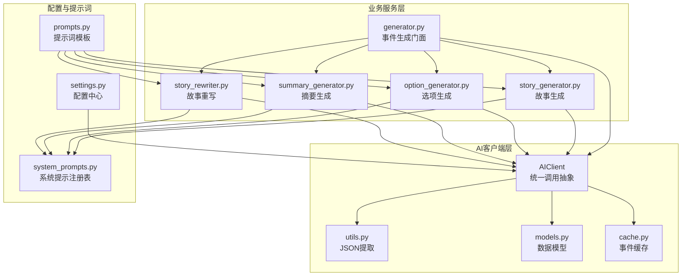
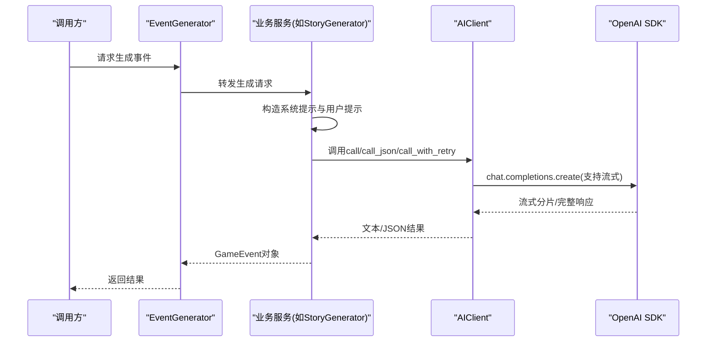
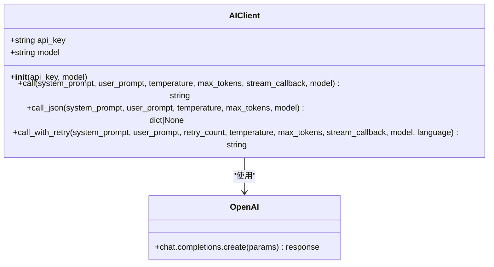
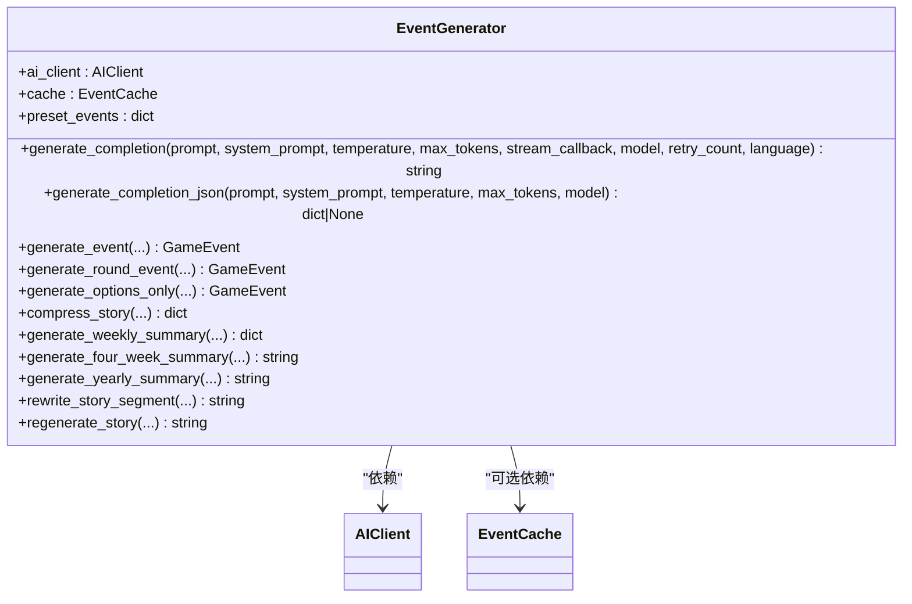
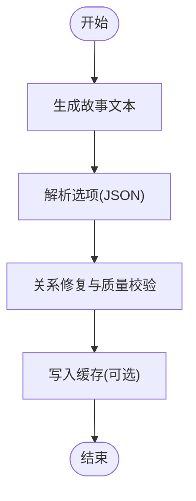
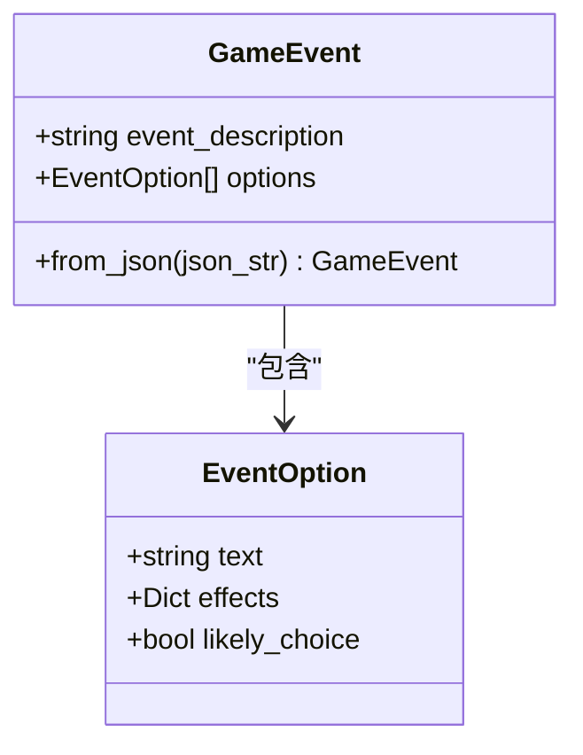
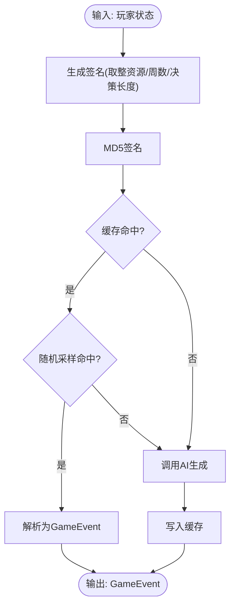
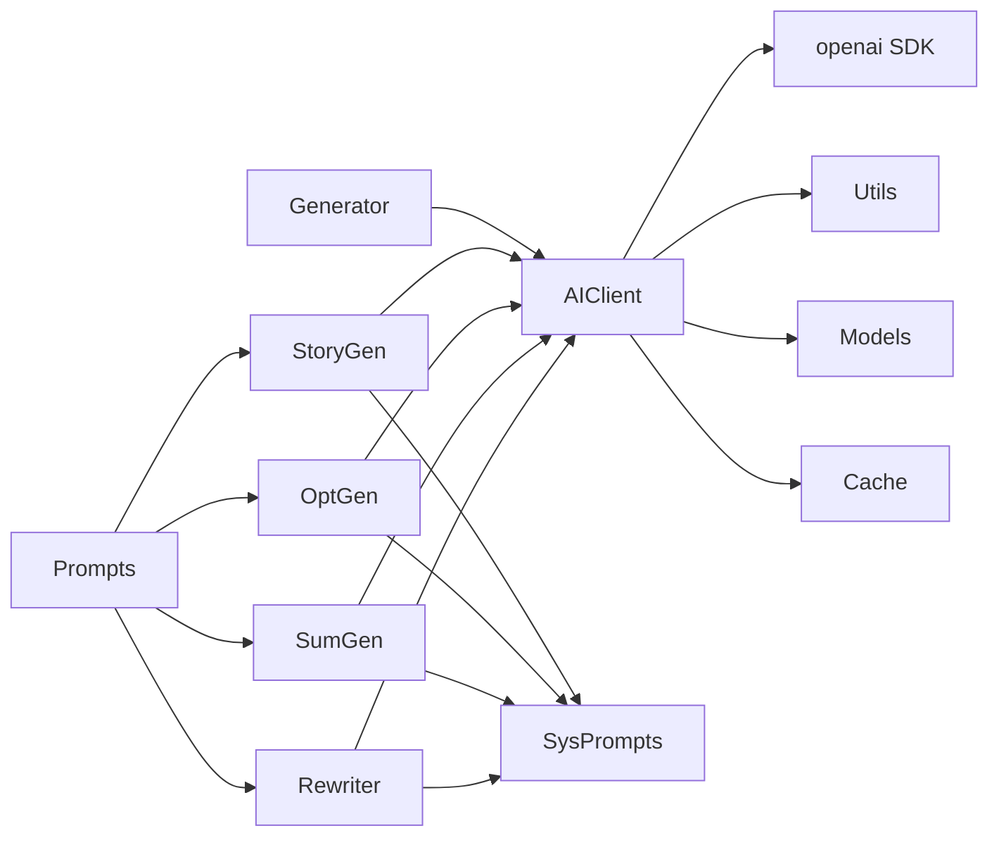

# AI客户端

<cite>
**本文引用的文件**
- [src/ai/client.py](file://src/ai/client.py)
- [src/ai/utils.py](file://src/ai/utils.py)
- [src/ai/models.py](file://src/ai/models.py)
- [src/ai/cache.py](file://src/ai/cache.py)
- [src/ai/generator.py](file://src/ai/generator.py)
- [src/ai/story_generator.py](file://src/ai/story_generator.py)
- [src/ai/option_generator.py](file://src/ai/option_generator.py)
- [src/ai/summary_generator.py](file://src/ai/summary_generator.py)
- [src/ai/story_rewriter.py](file://src/ai/story_rewriter.py)
- [src/ai/system_prompts.py](file://src/ai/system_prompts.py)
- [config/settings.py](file://config/settings.py)
- [config/prompts.py](file://config/prompts.py)
- [tests/test_ai_modules.py](file://tests/test_ai_modules.py)
- [src/ui/streamlit_app.py](file://src/ui/streamlit_app.py)
</cite>

## 目录
1. [简介](#简介)
2. [项目结构](#项目结构)
3. [核心组件](#核心组件)
4. [架构总览](#架构总览)
5. [详细组件分析](#详细组件分析)
6. [依赖分析](#依赖分析)
7. [性能考量](#性能考量)
8. [故障排查指南](#故障排查指南)
9. [结论](#结论)
10. [附录](#附录)

## 简介
本技术文档面向AI客户端组件，系统阐述AIClient类的抽象设计与OpenAI API集成机制，详解统一AI调用接口、流式输出处理、JSON解析与错误重试策略，以及API密钥管理、请求超时控制与并发处理策略。文档还提供通过AI客户端进行多种类型AI调用的实践路径，解释温度参数、最大令牌数与模型选择等配置选项，并说明安全、性能监控与故障诊断要点。

## 项目结构
AI客户端位于src/ai目录，围绕AIClient抽象层向上提供统一调用接口，向下对接各业务服务（故事生成、选项生成、摘要生成、重写等），并通过缓存与工具模块提升稳定性与效率。配置层通过config/settings.py集中管理OpenAI密钥、模型与基础URL等关键参数。

**图表来源**
- [src/ai/client.py](file://src/ai/client.py#L22-L214)
- [src/ai/utils.py](file://src/ai/utils.py#L10-L77)
- [src/ai/models.py](file://src/ai/models.py#L7-L27)
- [src/ai/cache.py](file://src/ai/cache.py#L13-L139)
- [src/ai/generator.py](file://src/ai/generator.py#L30-L66)
- [src/ai/story_generator.py](file://src/ai/story_generator.py#L24-L52)
- [src/ai/option_generator.py](file://src/ai/option_generator.py#L17-L22)
- [src/ai/summary_generator.py](file://src/ai/summary_generator.py#L17-L22)
- [src/ai/story_rewriter.py](file://src/ai/story_rewriter.py#L16-L21)
- [src/ai/system_prompts.py](file://src/ai/system_prompts.py#L196-L226)
- [config/settings.py](file://config/settings.py#L30-L100)
- [config/prompts.py](file://config/prompts.py#L674-L1008)

**章节来源**
- [src/ai/client.py](file://src/ai/client.py#L1-L214)
- [src/ai/generator.py](file://src/ai/generator.py#L30-L66)
- [config/settings.py](file://config/settings.py#L30-L100)

## 核心组件
- AIClient：统一AI调用抽象，封装OpenAI SDK调用、流式输出回调、JSON解析与错误重试注入。
- 事件生成门面EventGenerator：聚合故事生成、选项生成、摘要生成与重写服务，统一对外接口。
- 业务服务：StoryGenerator、OptionGenerator、SummaryGenerator、StoryRewriter分别负责故事文本生成、选项生成与校验、摘要压缩与总结、故事重写。
- 工具与模型：utils.extract_json提供鲁棒的JSON提取；models.GameEvent/EventOption定义事件与选项的数据结构。
- 缓存：EventCache通过签名与随机采样降低API调用成本。
- 配置与提示词：settings集中管理API密钥、模型与基础URL；system_prompts与prompts提供系统提示与模板。

**章节来源**
- [src/ai/client.py](file://src/ai/client.py#L22-L214)
- [src/ai/generator.py](file://src/ai/generator.py#L30-L66)
- [src/ai/story_generator.py](file://src/ai/story_generator.py#L24-L52)
- [src/ai/option_generator.py](file://src/ai/option_generator.py#L17-L22)
- [src/ai/summary_generator.py](file://src/ai/summary_generator.py#L17-L22)
- [src/ai/story_rewriter.py](file://src/ai/story_rewriter.py#L16-L21)
- [src/ai/utils.py](file://src/ai/utils.py#L10-L77)
- [src/ai/models.py](file://src/ai/models.py#L7-L27)
- [src/ai/cache.py](file://src/ai/cache.py#L13-L139)
- [src/ai/system_prompts.py](file://src/ai/system_prompts.py#L196-L226)
- [config/prompts.py](file://config/prompts.py#L674-L1008)

## 架构总览
AIClient作为单一可信源，向上屏蔽底层SDK差异，向下为各业务服务提供一致的调用入口。业务服务通过系统提示与提示词模板构造消息，调用AIClient完成纯文本或JSON输出，并在必要时进行一致性校验与缓存。

**图表来源**
- [src/ai/generator.py](file://src/ai/generator.py#L88-L129)
- [src/ai/story_generator.py](file://src/ai/story_generator.py#L107-L123)
- [src/ai/client.py](file://src/ai/client.py#L51-L104)
- [src/ai/client.py](file://src/ai/client.py#L140-L213)

## 详细组件分析

### AIClient：统一调用抽象与OpenAI集成
- 初始化与配置
  - 支持从配置settings读取OPENAI_API_KEY、OPENAI_MODEL与OPENAI_BASE_URL，若缺失则抛出异常。
  - 通过openai.OpenAI实例化客户端，支持自定义base_url以适配代理或兼容服务端。
- 核心方法
  - call(system_prompt, user_prompt, temperature, max_tokens, stream_callback, model)
    - 支持流式输出：遍历流式分片，实时回调stream_callback，累积文本并返回。
    - 非流式：直接返回choices[0].message.content.strip()。
  - call_json(system_prompt, user_prompt, temperature, max_tokens, model)
    - 在call基础上调用utils.extract_json，增强对AI输出中夹带JSON或代码块的解析鲁棒性。
  - call_with_retry(system_prompt, user_prompt, retry_count, temperature, max_tokens, stream_callback, model, language)
    - 多次尝试并在每次失败时将错误反馈注入用户提示，帮助模型“学会”避免重复错误。
    - 仅在首次尝试使用stream_callback，后续重试不启用流式回调。
- 错误处理与日志
  - 捕获异常并记录警告，最后一次尝试失败时抛出ValueError，便于上层感知与降级。

**图表来源**
- [src/ai/client.py](file://src/ai/client.py#L25-L47)
- [src/ai/client.py](file://src/ai/client.py#L51-L104)
- [src/ai/client.py](file://src/ai/client.py#L108-L136)
- [src/ai/client.py](file://src/ai/client.py#L140-L213)

**章节来源**
- [src/ai/client.py](file://src/ai/client.py#L22-L214)
- [config/settings.py](file://config/settings.py#L34-L36)

### 事件生成门面：EventGenerator
- 职责
  - 作为统一入口，聚合StoryGenerator、OptionGenerator、SummaryGenerator、StoryRewriter。
  - 通过AIClient执行各类AI调用，提供generate_completion与generate_completion_json等高层接口。
- 向后兼容
  - 保留旧版私有_call_ai方法，保证历史调用路径不变。
- 缓存与预设
  - 可选启用EventCache，结合随机采样策略减少重复调用。
  - 支持预设事件加载，优先返回预设以保证里程碑事件一致性。

**图表来源**
- [src/ai/generator.py](file://src/ai/generator.py#L30-L66)
- [src/ai/generator.py](file://src/ai/generator.py#L88-L146)
- [src/ai/generator.py](file://src/ai/generator.py#L183-L409)

**章节来源**
- [src/ai/generator.py](file://src/ai/generator.py#L30-L431)

### 业务服务：故事、选项、摘要与重写
- StoryGenerator
  - 两阶段流程：先生成纯故事文本，再基于故事生成选项。
  - 支持一致性校验（可选），对关键问题触发一次性重试。
  - 通过系统提示与提示词模板构造上下文，支持流式输出。
- OptionGenerator
  - 从已有故事生成选项，严格校验JSON格式与选项数量。
  - 提供关系名修复与事件质量校验，确保关系一致性与选项合理性。
- SummaryGenerator
  - 支持故事压缩、周/4周/年总结生成，具备JSON解析与回退提取能力。
  - 使用较低temperature与固定max_tokens以提升稳定性。
- StoryRewriter
  - 支持段落级重写与整篇重生成，提供流式回调与错误回退。

**图表来源**
- [src/ai/story_generator.py](file://src/ai/story_generator.py#L32-L175)
- [src/ai/option_generator.py](file://src/ai/option_generator.py#L25-L132)
- [src/ai/summary_generator.py](file://src/ai/summary_generator.py#L25-L140)
- [src/ai/story_rewriter.py](file://src/ai/story_rewriter.py#L24-L116)

**章节来源**
- [src/ai/story_generator.py](file://src/ai/story_generator.py#L24-L387)
- [src/ai/option_generator.py](file://src/ai/option_generator.py#L17-L280)
- [src/ai/summary_generator.py](file://src/ai/summary_generator.py#L17-L429)
- [src/ai/story_rewriter.py](file://src/ai/story_rewriter.py#L16-L201)

### JSON解析与数据模型
- utils.extract_json
  - 支持纯JSON、代码块包裹JSON、嵌入式JSON与多种引号风格，最后回退正则匹配。
  - 记录失败日志以便诊断。
- models.GameEvent/EventOption
  - Pydantic模型，约束事件描述长度、选项数量与字段结构，提供from_json工厂方法。

**图表来源**
- [src/ai/models.py](file://src/ai/models.py#L7-L27)
- [src/ai/utils.py](file://src/ai/utils.py#L10-L77)

**章节来源**
- [src/ai/utils.py](file://src/ai/utils.py#L10-L77)
- [src/ai/models.py](file://src/ai/models.py#L7-L27)

### 缓存系统：EventCache
- 设计要点
  - 基于玩家状态签名生成MD5键，包含年龄、资源四维、周数与决策历史长度。
  - 随机采样（约30%）命中缓存，其余走真实调用，平衡稳定性与多样性。
  - 文件持久化events_cache.json，异常时记录错误并降级。
- 接口
  - get(player_state, language) -> GameEvent|None
  - set(player_state, language, event) -> None
  - clear() / size()

**图表来源**
- [src/ai/cache.py](file://src/ai/cache.py#L47-L101)
- [src/ai/cache.py](file://src/ai/cache.py#L103-L128)

**章节来源**
- [src/ai/cache.py](file://src/ai/cache.py#L13-L139)

### 配置与提示词
- 配置中心settings
  - OPENAI_API_KEY、OPENAI_MODEL、OPENAI_BASE_URL、默认语言、缓存开关、调试模式等。
  - 提供validate校验，缺失密钥时抛错。
- 系统提示注册system_prompts
  - 统一管理各类系统提示（小说家、选项生成器、压缩器、重写器等），按语言返回对应提示。
- 提示词模板prompts
  - 事件生成、周/4周/年总结、仅故事生成、仅选项生成等模板，动态拼装角色、时间、关系、习惯、伏笔等上下文。

**章节来源**
- [config/settings.py](file://config/settings.py#L34-L41)
- [src/ai/system_prompts.py](file://src/ai/system_prompts.py#L196-L226)
- [config/prompts.py](file://config/prompts.py#L674-L1008)

## 依赖分析
- 组件耦合
  - AIClient与OpenAI SDK强耦合，但通过抽象层隔离上层业务。
  - EventGenerator聚合多服务，形成清晰的门面与职责边界。
  - 工具与模型模块低耦合，便于复用与测试。
- 外部依赖
  - openai SDK：用于chat.completions.create与流式分片。
  - Pydantic：用于数据模型校验与序列化。
- 循环依赖
  - 未见循环导入；服务间通过AIClient解耦。

**图表来源**
- [src/ai/client.py](file://src/ai/client.py#L14-L17)
- [src/ai/generator.py](file://src/ai/generator.py#L17-L25)
- [src/ai/story_generator.py](file://src/ai/story_generator.py#L12-L20)
- [src/ai/option_generator.py](file://src/ai/option_generator.py#L9-L12)
- [src/ai/summary_generator.py](file://src/ai/summary_generator.py#L10-L12)
- [src/ai/story_rewriter.py](file://src/ai/story_rewriter.py#L9-L12)

**章节来源**
- [src/ai/client.py](file://src/ai/client.py#L14-L17)
- [src/ai/generator.py](file://src/ai/generator.py#L17-L25)

## 性能考量
- 流式输出
  - AIClient在流式模式下逐片回调，降低首屏等待时间，适合UI实时渲染。
- 缓存策略
  - EventCache通过签名与随机采样在稳定性与多样性之间取得平衡，显著降低API调用次数。
- 温度与令牌
  - 不同场景采用不同temperature与max_tokens：故事生成较高温度与较大max_tokens，摘要与总结较低温度与较小max_tokens，提升稳定性与可控性。
- 并发处理
  - 当前实现未显式使用异步或线程池；在高并发场景建议：
    - 将AIClient实例化为单例，避免重复初始化。
    - 在上层业务中使用线程池/进程池并发调度，避免阻塞UI。
    - 控制并发度与队列长度，防止触发平台限流。
- 超时控制
  - openai SDK默认超时策略由底层网络栈决定；可在部署侧设置连接/读取超时，或在上层包装一层超时控制。

[本节为通用性能建议，不直接分析具体文件]

## 故障排查指南
- API密钥与模型配置
  - 若未设置OPENAI_API_KEY，初始化AIClient将抛出异常；检查.env或环境变量。
- 流式回调无效
  - 确认调用call时传入stream_callback，且仅在首次尝试启用；重试时不使用流式回调。
- JSON解析失败
  - utils.extract_json对多种格式有回退策略；若仍失败，检查上游提示词是否强制返回JSON。
- 一致性校验失败
  - StoryGenerator在提供WorldModel时进行一致性校验，关键问题触发一次性重试；若仍失败，检查提示词与约束条件。
- 缓存异常
  - 缓存文件损坏或权限不足会导致读写失败；可通过clear清空缓存并重建。
- 日志定位
  - AIClient与各服务均使用标准日志记录警告与错误，结合日志级别与上下文定位问题。

**章节来源**
- [config/settings.py](file://config/settings.py#L84-L90)
- [src/ai/client.py](file://src/ai/client.py#L175-L213)
- [src/ai/utils.py](file://src/ai/utils.py#L75-L76)
- [src/ai/cache.py](file://src/ai/cache.py#L34-L45)
- [src/ai/story_generator.py](file://src/ai/story_generator.py#L310-L373)

## 结论
AIClient通过统一抽象屏蔽底层差异，结合流式输出、JSON解析与错误重试机制，为上层业务提供了稳定可靠的AI调用能力。配合系统提示注册表、提示词模板、数据模型与缓存系统，整体架构在可维护性、可扩展性与运行效率方面达到良好平衡。建议在生产环境中强化超时控制与并发治理，并持续优化提示词与校验策略以提升输出质量。

## 附录

### 使用示例与最佳实践（路径指引）
- 通过AIClient进行纯文本生成（支持流式）
  - 参考路径：[src/ai/client.py](file://src/ai/client.py#L51-L104)
  - 示例调用：在业务服务中调用call(system_prompt, user_prompt, temperature, max_tokens, stream_callback)
- 通过AIClient进行JSON生成与解析
  - 参考路径：[src/ai/client.py](file://src/ai/client.py#L108-L136)、[src/ai/utils.py](file://src/ai/utils.py#L10-L77)
  - 示例调用：在OptionGenerator中调用call_json，随后使用extract_json解析
- 通过EventGenerator进行事件生成（两阶段：故事+选项）
  - 参考路径：[src/ai/generator.py](file://src/ai/generator.py#L183-L238)、[src/ai/story_generator.py](file://src/ai/story_generator.py#L32-L175)、[src/ai/option_generator.py](file://src/ai/option_generator.py#L25-L132)
- 通过EventGenerator进行摘要生成与总结
  - 参考路径：[src/ai/generator.py](file://src/ai/generator.py#L299-L367)、[src/ai/summary_generator.py](file://src/ai/summary_generator.py#L25-L140)
- 通过EventGenerator进行故事重写与再生
  - 参考路径：[src/ai/generator.py](file://src/ai/generator.py#L369-L409)、[src/ai/story_rewriter.py](file://src/ai/story_rewriter.py#L24-L116)

### 配置项与参数说明
- API密钥与模型
  - OPENAI_API_KEY：必填，用于认证
  - OPENAI_MODEL：默认模型名称
  - OPENAI_BASE_URL：可选，用于代理或兼容服务端
  - 参考路径：[config/settings.py](file://config/settings.py#L34-L36)
- 温度与最大令牌
  - temperature：控制创造性与多样性，默认0.8；故事生成可提高至1.0；摘要生成可降低至0.5-0.7
  - max_tokens：控制输出长度，默认2000；故事生成可达3500；摘要生成约1500
  - 参考路径：[src/ai/story_generator.py](file://src/ai/story_generator.py#L120-L122)、[src/ai/summary_generator.py](file://src/ai/summary_generator.py#L75-L77)
- 模型选择
  - 可在AIClient或各服务调用时传入model覆盖默认设置
  - 参考路径：[src/ai/client.py](file://src/ai/client.py#L78-L79)、[src/ai/generator.py](file://src/ai/generator.py#L118-L119)

### 安全与合规
- 密钥管理
  - 通过环境变量或Streamlit secrets注入，避免硬编码
  - 参考路径：[src/ui/streamlit_app.py](file://src/ui/streamlit_app.py#L21-L28)、[config/settings.py](file://config/settings.py#L8-L8)
- 输出净化
  - 严格限制系统提示与模板，避免泄露元信息与第四面墙
  - 参考路径：[src/ai/system_prompts.py](file://src/ai/system_prompts.py#L16-L30)、[src/ai/story_generator.py](file://src/ai/story_generator.py#L117-L123)

### 性能监控与诊断
- 日志
  - 使用标准logging记录关键事件与错误，便于追踪
  - 参考路径：[src/ai/client.py](file://src/ai/client.py#L205-L207)、[src/ai/utils.py](file://src/ai/utils.py#L75-L76)、[src/ai/cache.py](file://src/ai/cache.py#L35-L36)
- 缓存命中率
  - 通过size()与日志观察缓存使用情况
  - 参考路径：[src/ai/cache.py](file://src/ai/cache.py#L136-L139)