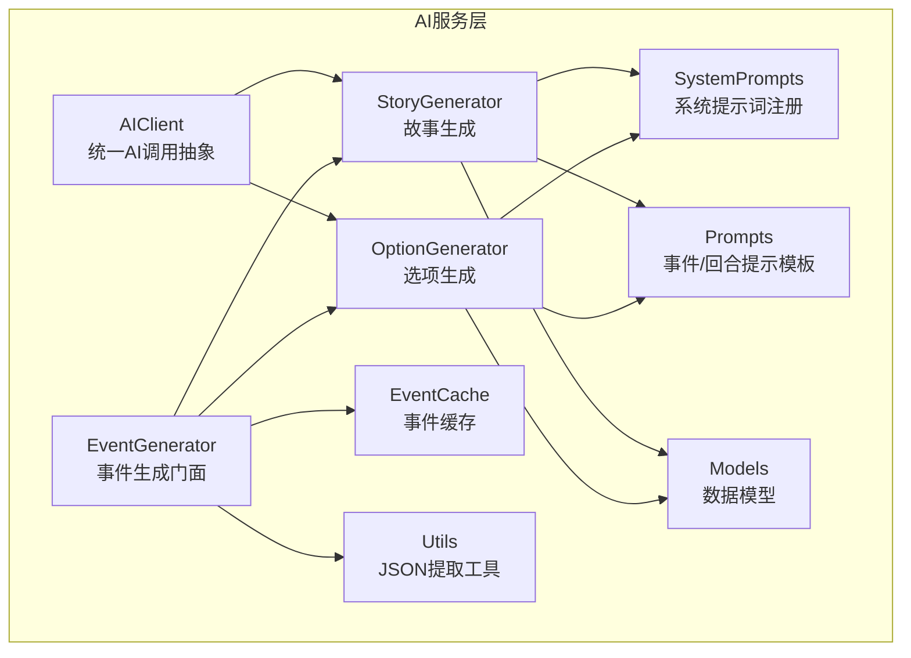
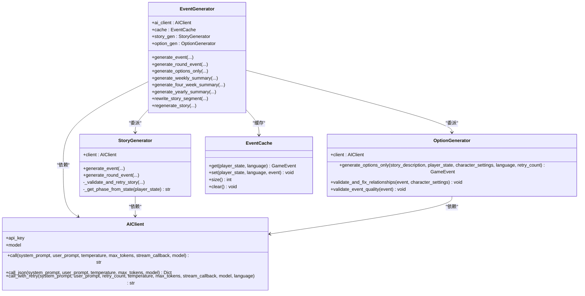
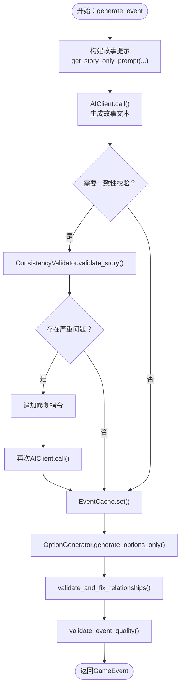
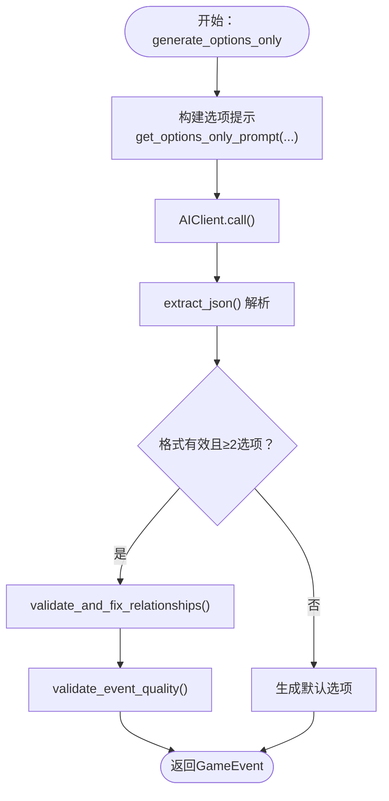
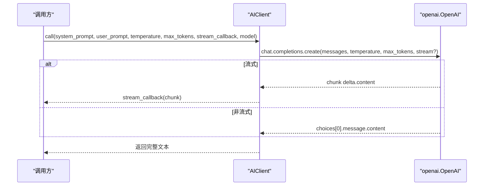
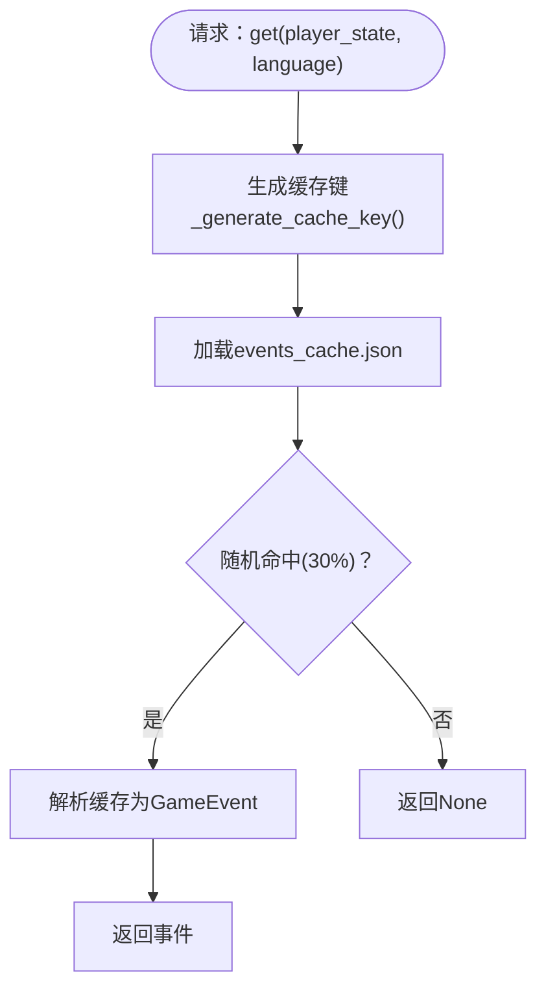
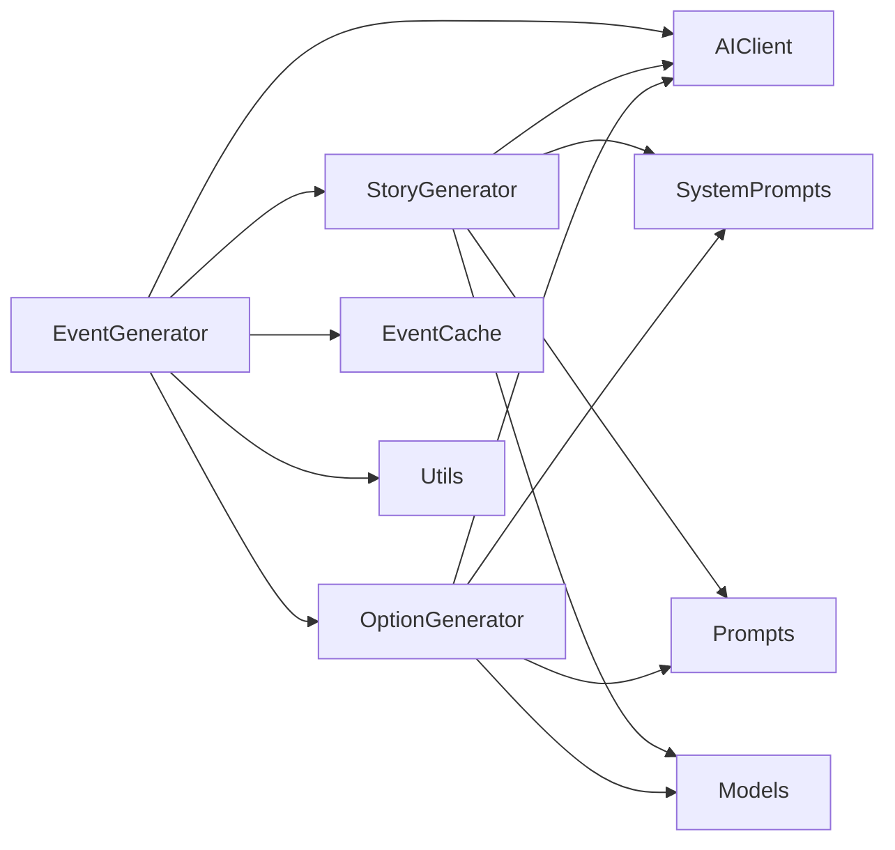

# AI服务模块

<cite>
**本文档引用的文件**
- [src/ai/__init__.py](file://src/ai/__init__.py)
- [src/ai/generator.py](file://src/ai/generator.py)
- [src/ai/story_generator.py](file://src/ai/story_generator.py)
- [src/ai/option_generator.py](file://src/ai/option_generator.py)
- [src/ai/client.py](file://src/ai/client.py)
- [src/ai/cache.py](file://src/ai/cache.py)
- [src/ai/system_prompts.py](file://src/ai/system_prompts.py)
- [src/ai/models.py](file://src/ai/models.py)
- [src/ai/utils.py](file://src/ai/utils.py)
- [config/prompts.py](file://config/prompts.py)
- [config/settings.py](file://config/settings.py)
- [src/game/game_loop.py](file://src/game/game_loop.py)
- [tests/test_ai_modules.py](file://tests/test_ai_modules.py)
</cite>

## 目录
1. [简介](#简介)
2. [项目结构](#项目结构)
3. [核心组件](#核心组件)
4. [架构总览](#架构总览)
5. [详细组件分析](#详细组件分析)
6. [依赖关系分析](#依赖关系分析)
7. [性能考虑](#性能考虑)
8. [故障排除指南](#故障排除指南)
9. [结论](#结论)
10. [附录](#附录)

## 简介
本文件面向AI服务模块的技术文档，重点阐述事件生成器（EventGenerator）、故事生成器（StoryGenerator）、选项生成器（OptionGenerator）的实现原理与使用方法。内容涵盖：
- AI客户端集成（统一调用抽象层）
- 系统提示词管理（集中式KV缓存）
- 缓存机制设计（事件缓存与随机命中策略）
- 流式输出处理（增量渲染与回调）
- 配置参数与环境变量
- 错误处理与重试策略
- 性能优化与最佳实践
- 具体调用示例（通过源码路径引用）

## 项目结构
AI服务模块位于src/ai目录，采用分层与职责分离的设计：
- 统一AI客户端：封装OpenAI调用，支持流式与JSON解析、重试与错误反馈注入
- 生成器层：事件生成门面（EventGenerator）协调故事与选项生成
- 服务层：故事生成器（StoryGenerator）、选项生成器（OptionGenerator）
- 提示词与模板：系统提示词注册表、事件/回合提示模板
- 数据模型与工具：Pydantic数据模型、JSON提取工具
- 缓存：事件缓存（文件持久化，带随机命中率）



**图表来源**
- [src/ai/client.py](file://src/ai/client.py#L22-L214)
- [src/ai/generator.py](file://src/ai/generator.py#L30-L66)
- [src/ai/story_generator.py](file://src/ai/story_generator.py#L24-L28)
- [src/ai/option_generator.py](file://src/ai/option_generator.py#L17-L21)
- [src/ai/cache.py](file://src/ai/cache.py#L13-L26)
- [src/ai/system_prompts.py](file://src/ai/system_prompts.py#L196-L226)
- [config/prompts.py](file://config/prompts.py#L674-L712)
- [src/ai/models.py](file://src/ai/models.py#L7-L27)
- [src/ai/utils.py](file://src/ai/utils.py#L10-L77)

**章节来源**
- [src/ai/__init__.py](file://src/ai/__init__.py#L1-L18)

## 核心组件
- AIClient：统一的AI调用抽象，负责OpenAI客户端初始化、消息构造、流式/非流式调用、JSON解析、重试与错误反馈注入
- EventGenerator：事件生成门面，聚合StoryGenerator、OptionGenerator、SummaryGenerator、StoryRewriter，提供向后兼容接口
- StoryGenerator：两阶段事件生成（Step 1：故事文本；Step 2：基于故事生成选项），支持一致性校验与重试
- OptionGenerator：从已有故事生成选项，进行关系名校正与事件质量检查
- EventCache：事件缓存，文件持久化，带随机命中率，降低重复API调用
- SystemPrompts：系统提示词注册表，集中管理提示词，保证KV缓存稳定性
- Prompts：事件与回合提示模板，构建上下文（时间、人物、剧情线、世界模型等）
- Models：GameEvent、EventOption数据模型，约束字段与长度
- Utils：JSON提取工具，兼容多种AI输出包裹形式

**章节来源**
- [src/ai/client.py](file://src/ai/client.py#L22-L214)
- [src/ai/generator.py](file://src/ai/generator.py#L30-L66)
- [src/ai/story_generator.py](file://src/ai/story_generator.py#L24-L28)
- [src/ai/option_generator.py](file://src/ai/option_generator.py#L17-L21)
- [src/ai/cache.py](file://src/ai/cache.py#L13-L26)
- [src/ai/system_prompts.py](file://src/ai/system_prompts.py#L196-L226)
- [config/prompts.py](file://config/prompts.py#L674-L712)
- [src/ai/models.py](file://src/ai/models.py#L7-L27)
- [src/ai/utils.py](file://src/ai/utils.py#L10-L77)

## 架构总览
AI服务模块遵循“门面+服务+工具”的分层架构：
- 门面层：EventGenerator对外暴露统一接口，内部委派给各子服务
- 服务层：StoryGenerator与OptionGenerator分别承担故事与选项生成职责
- 抽象层：AIClient屏蔽底层SDK差异，提供统一调用、流式输出、JSON解析与重试
- 支撑层：SystemPrompts集中提示词，Prompts构建上下文，EventCache降低API成本，Utils提升鲁棒性



**图表来源**
- [src/ai/client.py](file://src/ai/client.py#L22-L214)
- [src/ai/generator.py](file://src/ai/generator.py#L30-L66)
- [src/ai/story_generator.py](file://src/ai/story_generator.py#L24-L28)
- [src/ai/option_generator.py](file://src/ai/option_generator.py#L17-L21)
- [src/ai/cache.py](file://src/ai/cache.py#L13-L26)

## 详细组件分析

### EventGenerator（事件生成门面）
- 职责：向后兼容的统一入口，协调故事与选项生成，支持预设里程碑事件、缓存与子服务委派
- 关键能力：
  - 事件生成：generate_event（两阶段：故事→选项）
  - 回合事件：generate_round_event（支持世界模型一致性校验）
  - 选项生成：generate_options_only（仅生成选项）
  - 摘要与重写：压缩、周/季度/年度摘要、重写与再生
  - 预设里程碑事件：按周加载预设事件
  - 缓存：EventCache集成，支持强制刷新
- 参数与控制流：
  - 接受player_state、language、character_settings、时间/剧情上下文、世界模型等
  - 通过AIClient统一调用，支持流式回调与重试

```mermaid
sequenceDiagram
participant Caller as "调用方"
participant Gen as "EventGenerator"
participant Story as "StoryGenerator"
participant Opt as "OptionGenerator"
participant Cache as "EventCache"
participant AI as "AIClient"
Caller->>Gen : generate_event(player_state, language, ...)
Gen->>Cache : get(player_state, language)
alt 命中缓存且非强制
Cache-->>Gen : GameEvent
Gen-->>Caller : GameEvent
else 未命中或强制
Gen->>Story : generate_event(...)
Story->>AI : call(系统提示, 用户提示, temperature, max_tokens)
AI-->>Story : 故事文本
Story->>Opt : generate_options_only(故事文本, ...)
Opt->>AI : call(系统提示, 用户提示, temperature, max_tokens)
AI-->>Opt : JSON选项
Opt-->>Story : GameEvent(含选项)
Story->>Cache : set(player_state, language, event)
Story-->>Gen : GameEvent
Gen-->>Caller : GameEvent
end
```

**图表来源**
- [src/ai/generator.py](file://src/ai/generator.py#L183-L238)
- [src/ai/story_generator.py](file://src/ai/story_generator.py#L32-L157)
- [src/ai/option_generator.py](file://src/ai/option_generator.py#L25-L132)
- [src/ai/cache.py](file://src/ai/cache.py#L78-L128)
- [src/ai/client.py](file://src/ai/client.py#L51-L104)

**章节来源**
- [src/ai/generator.py](file://src/ai/generator.py#L30-L431)

### StoryGenerator（故事生成器）
- 职责：两阶段事件生成的第一阶段，生成纯故事文本，随后委派选项生成器生成选项
- 关键流程：
  - 构建故事提示（get_story_only_prompt），注入时间、人物、剧情线、世界事实、上一轮故事等上下文
  - 调用AIClient生成故事文本（支持流式回调）
  - 委派OptionGenerator生成选项（validate_and_fix_relationships、validate_event_quality）
  - 可选：世界模型一致性校验（_validate_and_retry_story），出现严重问题时追加修复指令重试
  - 缓存事件（EventCache.set）
- 参数要点：
  - temperature、max_tokens、stream_callback
  - last_event_concluded、last_round_full_story、activated_foreshadowing、character_habits等上下文
- 错误处理：
  - 多次重试，注入上次错误反馈
  - 验证异常（ValueError、ValidationError、JSON解析错误）捕获与累积



**图表来源**
- [src/ai/story_generator.py](file://src/ai/story_generator.py#L32-L175)
- [src/ai/story_generator.py](file://src/ai/story_generator.py#L310-L373)
- [src/ai/option_generator.py](file://src/ai/option_generator.py#L136-L247)
- [src/ai/cache.py](file://src/ai/cache.py#L103-L128)

**章节来源**
- [src/ai/story_generator.py](file://src/ai/story_generator.py#L24-L387)

### OptionGenerator（选项生成器）
- 职责：基于已有故事生成选项，进行关系名校正与事件质量检查
- 关键流程：
  - 构建选项提示（get_options_only_prompt），要求选项必须来自故事情节
  - 调用AIClient生成JSON选项
  - extract_json提取JSON，构造EventOption列表
  - 校正关系名（validate_and_fix_relationships）：确保仅使用key_people名单
  - 质量检查（validate_event_quality）：至少两个选项、动作点默认值、效果合理性、存在真实权衡
  - 失败回退：生成默认选项
- 参数要点：
  - language、retry_count、character_settings（含relationships.key_people）



**图表来源**
- [src/ai/option_generator.py](file://src/ai/option_generator.py#L25-L132)
- [src/ai/option_generator.py](file://src/ai/option_generator.py#L136-L247)
- [src/ai/utils.py](file://src/ai/utils.py#L10-L77)

**章节来源**
- [src/ai/option_generator.py](file://src/ai/option_generator.py#L17-L248)

### AIClient（AI客户端）
- 职责：统一AI调用抽象，封装OpenAI SDK
- 核心方法：
  - call：构造messages，支持流式与非流式调用，返回文本
  - call_json：先call再extract_json
  - call_with_retry：多轮重试，注入上次错误反馈，首轮可使用流式回调
- 配置：
  - 从settings读取OPENAI_API_KEY、OPENAI_MODEL、OPENAI_BASE_URL
  - 初始化openai.OpenAI客户端



**图表来源**
- [src/ai/client.py](file://src/ai/client.py#L51-L104)
- [src/ai/client.py](file://src/ai/client.py#L140-L213)

**章节来源**
- [src/ai/client.py](file://src/ai/client.py#L22-L214)

### EventCache（事件缓存）
- 职责：事件缓存，降低重复API调用
- 设计要点：
  - 文件持久化：events_cache.json
  - 随机命中策略：仅30%概率使用缓存，保证多样性
  - 缓存键：基于player_state关键字段签名（年龄、资源、周数、决策历史长度、语言），MD5
  - 增量保存：set后立即写盘
- 方法：get、set、size、clear



**图表来源**
- [src/ai/cache.py](file://src/ai/cache.py#L47-L101)
- [src/ai/cache.py](file://src/ai/cache.py#L13-L26)

**章节来源**
- [src/ai/cache.py](file://src/ai/cache.py#L13-L139)

### SystemPrompts（系统提示词管理）
- 职责：集中管理所有系统提示词，提供KV稳定性和一致性
- 结构：
  - 注册表：_PROMPT_REGISTRY，键为用途（如story_novelist、option_generator等）
  - get_system_prompt：按key与语言返回对应提示词
- 价值：KV缓存前缀稳定、便于审计与维护、跨调用行为一致

**章节来源**
- [src/ai/system_prompts.py](file://src/ai/system_prompts.py#L196-L226)

### Prompts（提示模板）
- 职责：构建事件与回合生成所需的上下文提示
- 功能：
  - get_event_generation_prompt：构建完整事件提示（角色、时间、剧情线、世界事实、世界模型、逻辑约束等）
  - get_story_only_prompt：仅生成故事文本的提示
  - get_round_event_prompt：回合事件提示（支持世界模型一致性约束）
  - 辅助函数：构建可用人物列表、时间上下文、未完结剧情线、世界事实、伏笔回响、逻辑约束等

**章节来源**
- [config/prompts.py](file://config/prompts.py#L674-L712)
- [config/prompts.py](file://config/prompts.py#L1-L800)

### Models（数据模型）
- EventOption：文本、效果字典、是否倾向选择
- GameEvent：故事描述、选项列表（2-4个），from_json解析
- 约束：长度限制、最小数量、字段必填

**章节来源**
- [src/ai/models.py](file://src/ai/models.py#L7-L27)

### Utils（工具）
- extract_json：从AI输出中提取JSON，兼容纯JSON、代码块包裹、嵌入文本等多种形式

**章节来源**
- [src/ai/utils.py](file://src/ai/utils.py#L10-L77)

## 依赖关系分析
- 组件耦合：
  - EventGenerator依赖AIClient、EventCache、StoryGenerator、OptionGenerator、SummaryGenerator、StoryRewriter
  - StoryGenerator与OptionGenerator均依赖AIClient与系统提示词
  - EventCache独立于业务逻辑，仅依赖GameEvent模型
- 外部依赖：
  - OpenAI SDK（通过AIClient）
  - Pydantic（数据模型）
  - Python标准库（json、hashlib、logging、pathlib、typing等）



**图表来源**
- [src/ai/generator.py](file://src/ai/generator.py#L30-L66)
- [src/ai/story_generator.py](file://src/ai/story_generator.py#L12-L28)
- [src/ai/option_generator.py](file://src/ai/option_generator.py#L9-L21)

**章节来源**
- [src/ai/generator.py](file://src/ai/generator.py#L30-L66)
- [src/ai/story_generator.py](file://src/ai/story_generator.py#L12-L28)
- [src/ai/option_generator.py](file://src/ai/option_generator.py#L9-L21)

## 性能考虑
- API成本控制
  - EventCache：30%随机命中，平衡多样性与成本
  - 预设里程碑事件：减少重复生成
- 文本长度与Token控制
  - 故事生成max_tokens较高（如3500），选项生成较低（如1000）
  - 通过提示模板精简上下文，避免冗余
- 流式输出
  - AIClient支持流式回调，UI可渐进渲染，改善交互体验
- 重试与错误反馈
  - call_with_retry在首次失败时注入错误原因，提高成功率，减少无效重试次数
- 数据模型约束
  - Pydantic约束减少无效数据带来的后续处理开销

[本节为通用性能讨论，无需特定文件引用]

## 故障排除指南
- 常见问题与定位
  - API密钥缺失：AIClient初始化即抛错，检查OPENAI_API_KEY
  - JSON解析失败：extract_json无法提取时，OptionGenerator回退为默认选项
  - 一致性校验失败：StoryGenerator在世界模型约束下触发重试，查看日志中的修复指令
  - 缓存读写失败：EventCache在加载/保存时记录警告，检查文件权限与磁盘空间
- 调试建议
  - 启用DEBUG_MODE（settings.DEBUG_MODE）查看更多日志
  - 使用call_with_retry并传入language，使错误反馈更易理解
  - 在UI层使用stream_callback观察增量输出，快速定位卡顿点

**章节来源**
- [src/ai/client.py](file://src/ai/client.py#L40-L41)
- [src/ai/option_generator.py](file://src/ai/option_generator.py#L114-L132)
- [src/ai/story_generator.py](file://src/ai/story_generator.py#L310-L373)
- [src/ai/cache.py](file://src/ai/cache.py#L34-L45)
- [config/settings.py](file://config/settings.py#L40-L41)

## 结论
AI服务模块通过“门面+服务+抽象+工具”的分层设计，实现了：
- 统一的AI调用与提示词管理
- 可靠的两阶段事件生成与一致性保障
- 低成本的事件缓存与多样化的流式输出
- 易扩展的子服务架构与健壮的错误处理

该架构既满足了游戏引擎对稳定性的需求，也为后续功能扩展（如重写、摘要、分析等）提供了清晰的边界。

[本节为总结性内容，无需特定文件引用]

## 附录

### 配置参数与环境变量
- OPENAI_API_KEY：OpenAI API密钥（必需）
- OPENAI_MODEL：默认模型名称（默认gpt-4）
- OPENAI_BASE_URL：OpenAI兼容服务基础URL（可选）
- DEFAULT_LANGUAGE：默认语言（zh/en）
- CACHE_EVENTS：是否启用事件缓存（默认true）
- DEBUG_MODE：调试模式（默认false）
- 数据目录：DATA_DIR、PRESETS_DIR、CACHE_DIR

**章节来源**
- [config/settings.py](file://config/settings.py#L34-L41)
- [config/settings.py](file://config/settings.py#L16-L27)

### 调用示例（通过源码路径引用）
- 生成个性化事件（两阶段：故事→选项）
  - EventGenerator.generate_event(...)
  - 参考路径：[src/ai/generator.py](file://src/ai/generator.py#L183-L238)
- 仅生成选项（基于已有故事）
  - OptionGenerator.generate_options_only(...)
  - 参考路径：[src/ai/option_generator.py](file://src/ai/option_generator.py#L25-L132)
- 流式输出（UI渐进渲染）
  - AIClient.call(stream_callback=...)
  - 参考路径：[src/ai/client.py](file://src/ai/client.py#L80-L96)
- 重试与错误反馈
  - AIClient.call_with_retry(...)
  - 参考路径：[src/ai/client.py](file://src/ai/client.py#L140-L213)
- 系统提示词使用
  - get_system_prompt(key, language)
  - 参考路径：[src/ai/system_prompts.py](file://src/ai/system_prompts.py#L211-L225)
- 事件缓存
  - EventCache.get/set/clear/size
  - 参考路径：[src/ai/cache.py](file://src/ai/cache.py#L78-L138)

### 单元测试要点（参考）
- JSON提取：extract_json对多种包裹形式的解析
  - 参考路径：[tests/test_ai_modules.py](file://tests/test_ai_modules.py#L18-L73)
- 模型校验：GameEvent/EventOption的约束与from_json
  - 参考路径：[tests/test_ai_modules.py](file://tests/test_ai_modules.py#L77-L111)
- 系统提示词：get_system_prompt返回有效提示
  - 参考路径：[tests/test_ai_modules.py](file://tests/test_ai_modules.py#L115-L154)
- 一致性校验：ConsistencyValidator行为
  - 参考路径：[tests/test_ai_modules.py](file://tests/test_ai_modules.py#L197-L292)
- 事件缓存：EventCache的增删查
  - 参考路径：[tests/test_ai_modules.py](file://tests/test_ai_modules.py#L296-L361)
- AIClient：call/call_json/流式/重试
  - 参考路径：[tests/test_ai_modules.py](file://tests/test_ai_modules.py#L366-L465)