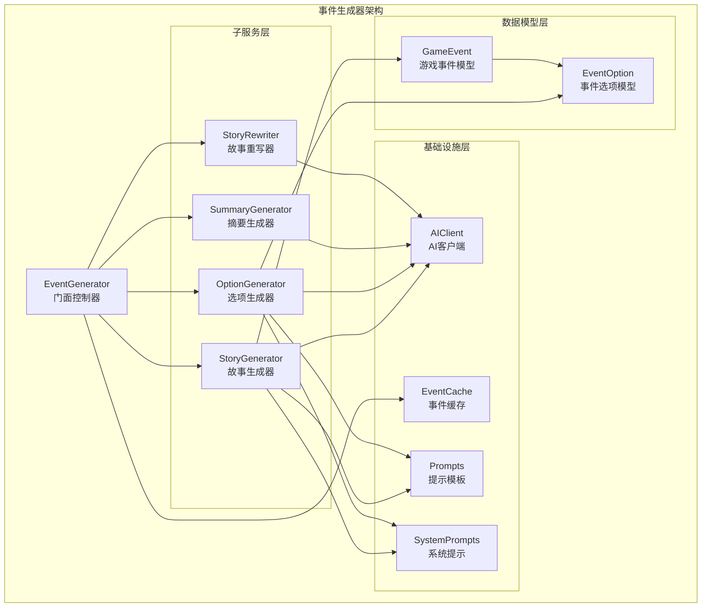
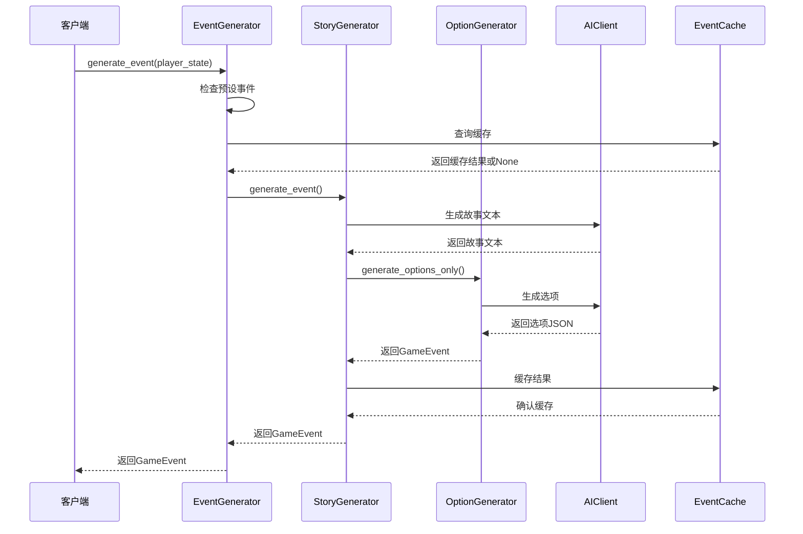
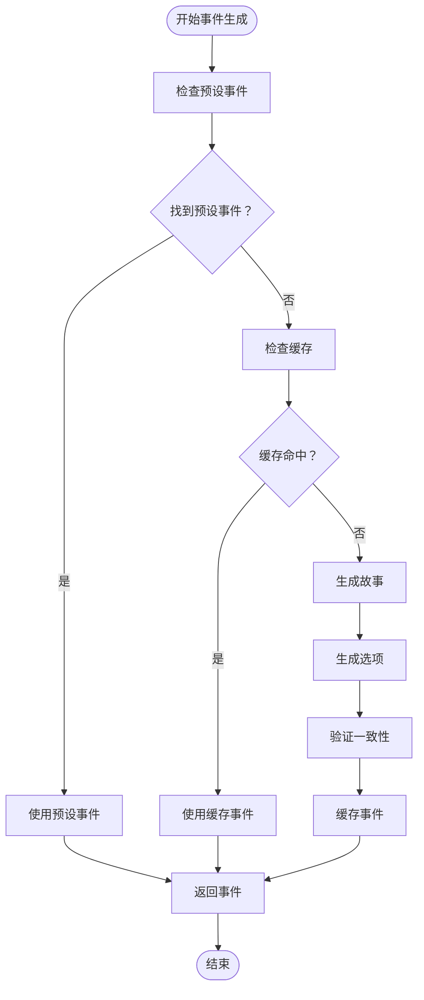
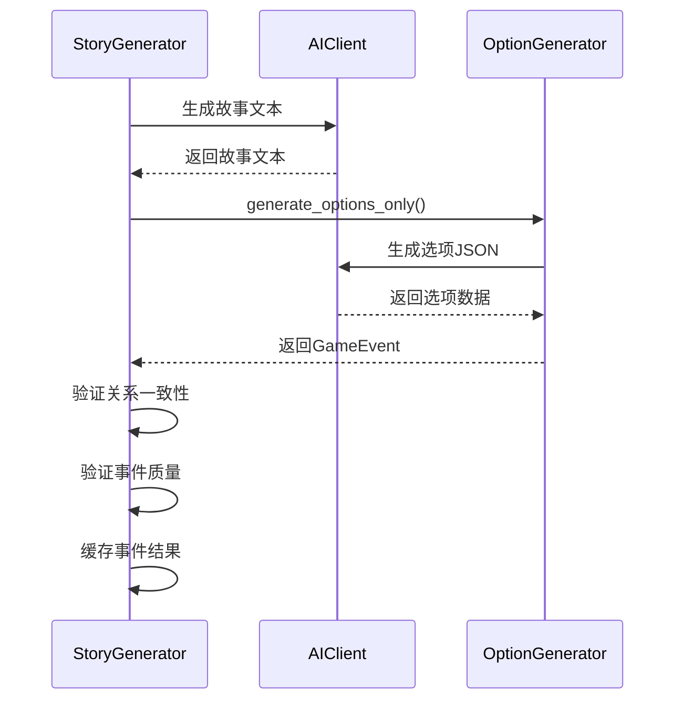
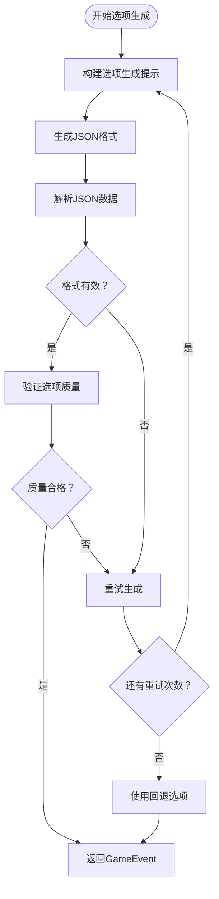
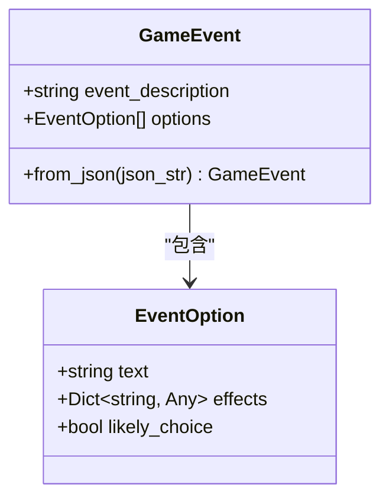
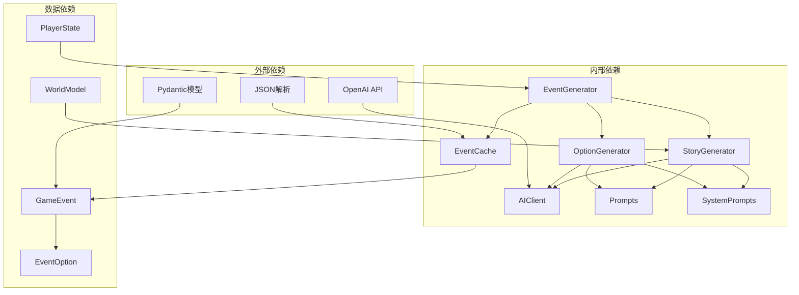

# 事件生成器

<cite>
**本文档引用的文件**
- [generator.py](file://src/ai/generator.py)
- [story_generator.py](file://src/ai/story_generator.py)
- [option_generator.py](file://src/ai/option_generator.py)
- [cache.py](file://src/ai/cache.py)
- [client.py](file://src/ai/client.py)
- [models.py](file://src/ai/models.py)
- [prompts.py](file://config/prompts.py)
- [system_prompts.py](file://src/ai/system_prompts.py)
- [state.py](file://src/game/state.py)
- [narrative_manager.py](file://src/game/narrative_manager.py)
- [world_model.py](file://src/game/world_model.py)
- [events.json](file://data/presets/events.json)
- [test_events.py](file://tests/test_events.py)
</cite>

## 目录
1. [简介](#简介)
2. [项目结构](#项目结构)
3. [核心组件](#核心组件)
4. [架构概览](#架构概览)
5. [详细组件分析](#详细组件分析)
6. [依赖关系分析](#依赖关系分析)
7. [性能考虑](#性能考虑)
8. [故障排除指南](#故障排除指南)
9. [结论](#结论)

## 简介

事件生成器组件是故事模拟游戏的核心AI引擎，负责根据玩家状态生成高质量的随机事件和选项。该组件采用门面模式设计，协调多个专门化的子服务，实现了高度模块化和可扩展的事件生成架构。

本组件的主要功能包括：
- 基于玩家状态的智能事件生成
- 两阶段事件生成流程（故事生成 + 选项生成）
- 预设事件处理机制
- 智能缓存策略
- 重试机制和错误处理
- 流式输出处理
- 世界模型一致性验证

## 项目结构

事件生成器组件位于AI模块中，采用分层架构设计：

**图表来源**
- [generator.py](file://src/ai/generator.py#L30-L66)
- [story_generator.py](file://src/ai/story_generator.py#L24-L28)
- [option_generator.py](file://src/ai/option_generator.py#L17-L21)

**章节来源**
- [generator.py](file://src/ai/generator.py#L1-L431)
- [story_generator.py](file://src/ai/story_generator.py#L1-L387)
- [option_generator.py](file://src/ai/option_generator.py#L1-L248)

## 核心组件

### EventGenerator 门面控制器

EventGenerator是整个事件生成系统的核心门面，负责协调各个子服务并提供统一的接口。该类实现了门面模式的最佳实践：

- **职责分离**：将复杂的AI调用逻辑封装在内部
- **向后兼容**：保持所有现有公共方法签名不变
- **子服务管理**：集中管理StoryGenerator、OptionGenerator等子服务
- **缓存集成**：统一处理事件缓存逻辑
- **预设事件支持**：内置预设事件处理机制

### StoryGenerator 故事生成器

负责生成纯文本故事内容，实现两阶段事件生成的第一阶段：

- **两阶段流程**：先生成故事文本，再生成选项
- **重试机制**：支持多次尝试和错误反馈
- **一致性验证**：与世界模型进行一致性检查
- **流式输出**：支持实时流式故事生成

### OptionGenerator 选项生成器

负责为现有故事生成合适的选项，实现两阶段事件生成的第二阶段：

- **选项质量保证**：确保选项数量和质量要求
- **关系名验证**：验证和修复关系名称一致性
- **效果验证**：检查选项效果的合理性
- **回退机制**：在失败时提供默认选项

**章节来源**
- [generator.py](file://src/ai/generator.py#L30-L431)
- [story_generator.py](file://src/ai/story_generator.py#L24-L387)
- [option_generator.py](file://src/ai/option_generator.py#L17-L248)

## 架构概览

事件生成器采用分层架构，实现了清晰的关注点分离：

**图表来源**
- [generator.py](file://src/ai/generator.py#L183-L238)
- [story_generator.py](file://src/ai/story_generator.py#L32-L175)
- [option_generator.py](file://src/ai/option_generator.py#L25-L132)

**章节来源**
- [generator.py](file://src/ai/generator.py#L183-L238)
- [story_generator.py](file://src/ai/story_generator.py#L32-L175)

## 详细组件分析

### EventGenerator 类分析

EventGenerator类实现了完整的门面模式，提供了简洁的API接口：

#### 核心方法

**generate_event 方法**：主事件生成入口
- 支持预设事件优先级检查
- 集成智能缓存查询
- 协调故事生成和选项生成
- 支持强制刷新和重试机制

**generate_round_event 方法**：回合事件生成
- 专门用于多回合故事生成
- 支持世界模型一致性验证
- 处理回合间的连续性

**generate_options_only 方法**：选项生成专用
- 仅生成选项，不生成故事
- 适用于已有故事的选项扩展

#### 预设事件处理机制

**图表来源**
- [generator.py](file://src/ai/generator.py#L205-L238)
- [generator.py](file://src/ai/generator.py#L150-L179)

#### 缓存策略

EventGenerator集成了智能缓存机制：

- **缓存键生成**：基于玩家状态的关键属性
- **缓存命中率控制**：30%随机命中率确保多样性
- **缓存持久化**：事件数据持久化存储
- **缓存失效**：支持手动清理和自动管理

**章节来源**
- [generator.py](file://src/ai/generator.py#L150-L238)
- [cache.py](file://src/ai/cache.py#L13-L139)

### StoryGenerator 类分析

StoryGenerator专注于故事文本生成，实现了复杂的两阶段流程：

#### 两阶段生成流程

**图表来源**
- [story_generator.py](file://src/ai/story_generator.py#L105-L175)
- [option_generator.py](file://src/ai/option_generator.py#L64-L132)

#### 一致性验证机制

StoryGenerator实现了多层次的一致性验证：

- **关系名验证**：确保选项中的关系名有效
- **事件质量检查**：验证选项的合理性和平衡性
- **世界模型验证**：与结构化世界模型进行对比
- **重试机制**：关键问题时自动重试

**章节来源**
- [story_generator.py](file://src/ai/story_generator.py#L105-L175)
- [option_generator.py](file://src/ai/option_generator.py#L135-L248)

### OptionGenerator 类分析

OptionGenerator专注于选项生成和验证：

#### 选项生成算法

**图表来源**
- [option_generator.py](file://src/ai/option_generator.py#L64-L132)

#### 关系名验证和修复

OptionGenerator实现了智能的关系名验证机制：

- **名称匹配**：精确匹配可用人物列表
- **大小写不敏感**：支持灵活的名称输入
- **角色匹配**：通过角色描述匹配人物
- **回退策略**：无法匹配时使用第一个有效名称

**章节来源**
- [option_generator.py](file://src/ai/option_generator.py#L135-L248)

### 数据模型分析

事件生成器使用了强类型的Pydantic模型：

#### GameEvent 模型

**图表来源**
- [models.py](file://src/ai/models.py#L7-L27)

#### 提示模板系统

事件生成器使用了灵活的提示模板系统：

- **多语言支持**：中英文双语提示模板
- **动态上下文**：根据玩家状态动态生成提示
- **约束注入**：自动注入世界模型和一致性约束
- **回响机制**：支持伏笔回响的自然融入

**章节来源**
- [models.py](file://src/ai/models.py#L1-L27)
- [prompts.py](file://config/prompts.py#L674-L800)
- [system_prompts.py](file://src/ai/system_prompts.py#L196-L226)

## 依赖关系分析

事件生成器组件的依赖关系体现了良好的架构设计：

**图表来源**
- [generator.py](file://src/ai/generator.py#L17-L25)
- [story_generator.py](file://src/ai/story_generator.py#L12-L20)
- [option_generator.py](file://src/ai/option_generator.py#L9-L12)

**章节来源**
- [generator.py](file://src/ai/generator.py#L17-L25)
- [story_generator.py](file://src/ai/story_generator.py#L12-L20)
- [option_generator.py](file://src/ai/option_generator.py#L9-L12)

## 性能考虑

事件生成器在设计时充分考虑了性能优化：

### 缓存优化
- **智能缓存键**：基于玩家状态关键属性生成缓存键
- **随机命中率**：30%命中率确保多样性
- **内存管理**：定期清理过期缓存项

### API调用优化
- **流式处理**：支持实时流式输出减少等待时间
- **KV缓存稳定**：系统提示的KV缓存前缀稳定性
- **批量处理**：支持多回合事件的批量生成

### 内存管理
- **对象池**：复用AI客户端实例
- **及时清理**：自动清理临时数据结构
- **内存监控**：监控缓存大小和内存使用

## 故障排除指南

### 常见问题和解决方案

**事件生成失败**
- 检查API密钥配置
- 验证网络连接状态
- 查看重试日志了解失败原因

**选项格式错误**
- 确保故事内容包含足够的上下文
- 检查系统提示的完整性
- 验证AI模型的正确性

**缓存问题**
- 清理缓存目录
- 检查缓存文件权限
- 验证缓存数据格式

**一致性验证失败**
- 检查世界模型数据完整性
- 验证玩家状态的有效性
- 确认约束条件的合理性

**章节来源**
- [client.py](file://src/ai/client.py#L140-L213)
- [cache.py](file://src/ai/cache.py#L28-L46)

## 结论

事件生成器组件通过门面模式设计，成功地将复杂的AI事件生成功能封装在一个简洁易用的接口后面。该组件具有以下优势：

1. **模块化设计**：清晰的职责分离和关注点分离
2. **可扩展性**：易于添加新的事件生成策略和验证机制
3. **可靠性**：完善的错误处理和重试机制
4. **性能优化**：智能缓存和流式处理
5. **一致性保证**：多层次的验证机制确保事件质量

该组件为故事模拟游戏提供了强大的事件生成能力，能够根据玩家状态生成丰富多样的随机事件，为玩家创造沉浸式的游戏体验。