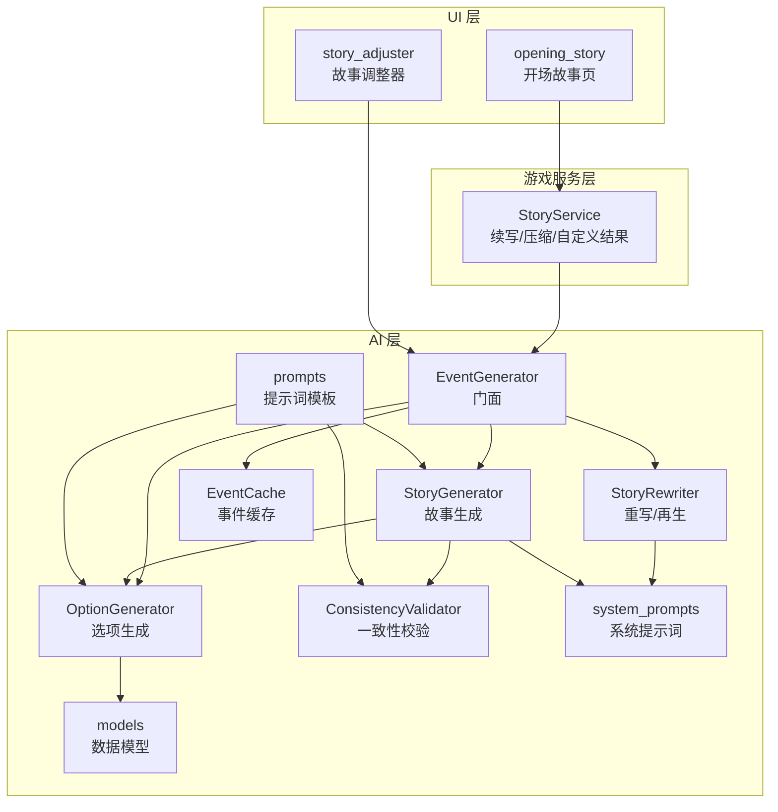
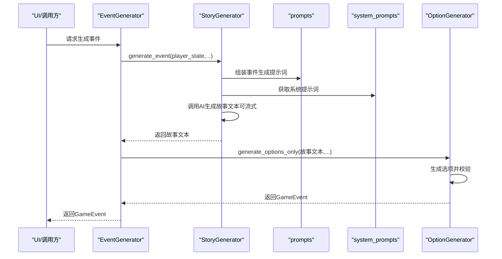
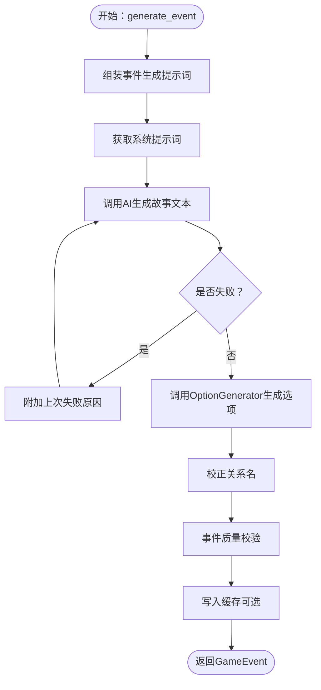
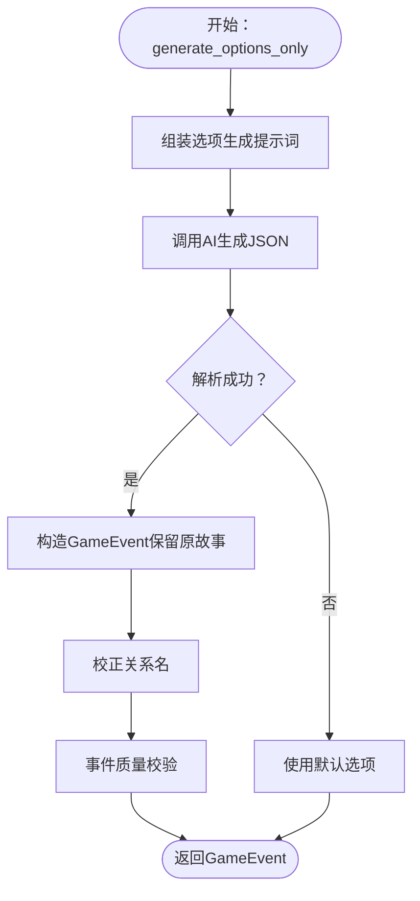
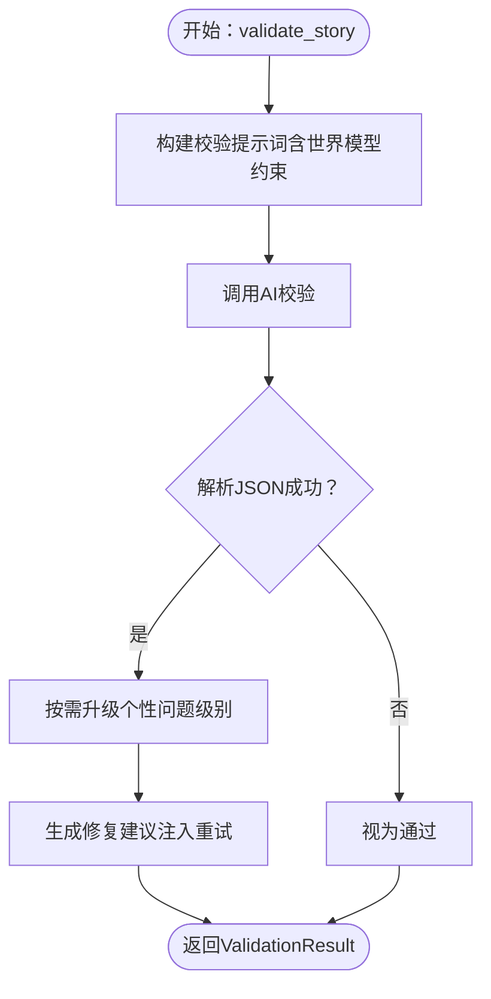
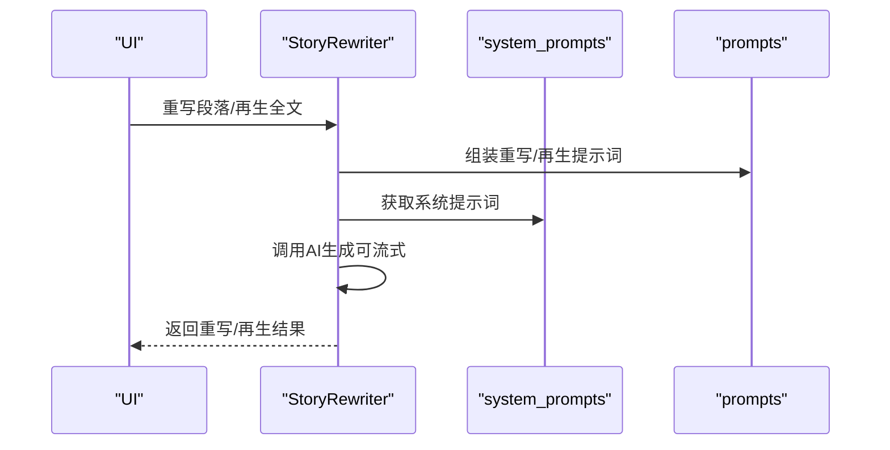
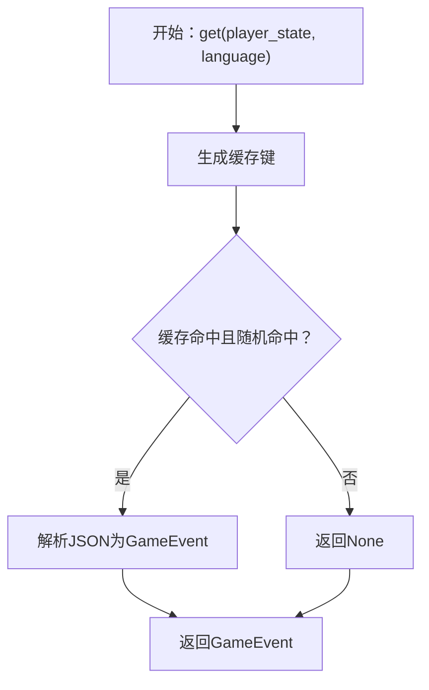
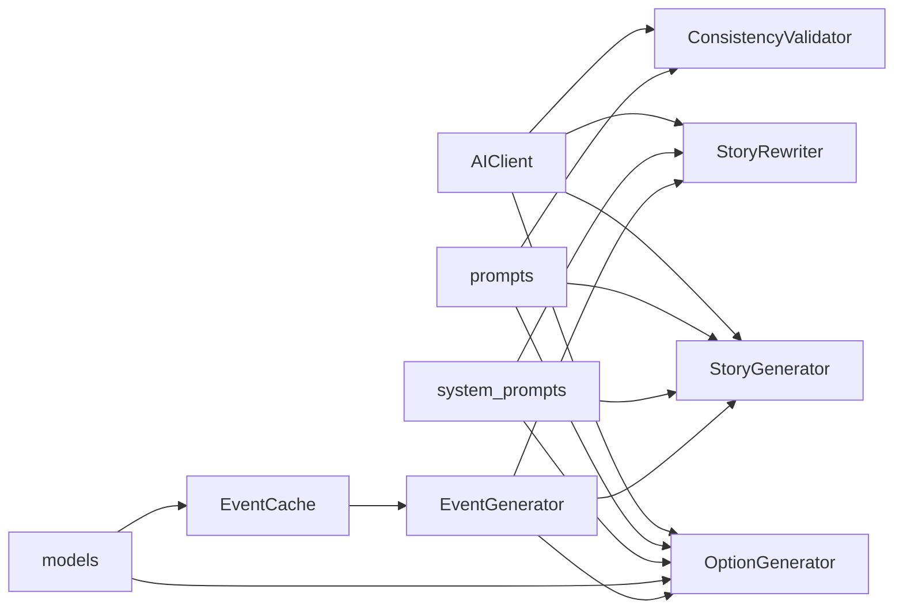

# 故事生成器

<cite>
**本文引用的文件**   
- [src/ai/story_generator.py](file://src/ai/story_generator.py)
- [src/ai/story_rewriter.py](file://src/ai/story_rewriter.py)
- [src/ai/generator.py](file://src/ai/generator.py)
- [src/ai/option_generator.py](file://src/ai/option_generator.py)
- [src/ai/consistency_validator.py](file://src/ai/consistency_validator.py)
- [src/ai/system_prompts.py](file://src/ai/system_prompts.py)
- [config/prompts.py](file://config/prompts.py)
- [src/ai/cache.py](file://src/ai/cache.py)
- [src/ai/models.py](file://src/ai/models.py)
- [src/game/story_service.py](file://src/game/story_service.py)
- [src/ui/components/story_adjuster.py](file://src/ui/components/story_adjuster.py)
- [src/ui/page_views/opening_story.py](file://src/ui/page_views/opening_story.py)
</cite>

## 目录
1. [简介](#简介)
2. [项目结构](#项目结构)
3. [核心组件](#核心组件)
4. [架构总览](#架构总览)
5. [详细组件分析](#详细组件分析)
6. [依赖分析](#依赖分析)
7. [性能考虑](#性能考虑)
8. [故障排查指南](#故障排查指南)
9. [结论](#结论)
10. [附录](#附录)

## 简介
本技术文档聚焦于故事生成器组件，系统阐述 StoryGenerator 类的两阶段生成管道设计、故事文本生成流程、质量控制机制、重写与全文再生能力，以及与选项生成、一致性校验、缓存与系统提示词体系的协作关系。文档还提供个性化故事生成的实践路径、模板系统与语言处理规则、边界情况与性能优化建议。

## 项目结构
故事生成器位于 AI 层，围绕 EventGenerator 门面进行模块化拆分，核心文件如下：
- 事件生成门面：EventGenerator（聚合 StoryGenerator、OptionGenerator、StoryRewriter、SummaryGenerator）
- 故事生成器：StoryGenerator（两阶段第一步：故事文本生成；可选一致性校验与重试）
- 选项生成器：OptionGenerator（两阶段第二步：基于故事生成选项并校验）
- 故事重写器：StoryRewriter（段落级重写与整篇再生）
- 一致性校验器：ConsistencyValidator（跨地理/职业/个性/时间/承诺/因果维度校验）
- 系统提示词注册表：system_prompts（统一系统提示词，保证 KV 缓存命中与行为一致）
- 提示词模板：prompts（事件生成、选项生成、一致性校验等模板）
- 数据模型：models（GameEvent、EventOption）
- 缓存：EventCache（事件缓存，降低 API 调用成本）
- UI 交互：story_adjuster（段落重写/整篇再生）、opening_story（开场故事）

图表来源
- [src/ai/generator.py](file://src/ai/generator.py#L30-L66)
- [src/ai/story_generator.py](file://src/ai/story_generator.py#L24-L52)
- [src/ai/option_generator.py](file://src/ai/option_generator.py#L17-L22)
- [src/ai/story_rewriter.py](file://src/ai/story_rewriter.py#L16-L21)
- [src/ai/consistency_validator.py](file://src/ai/consistency_validator.py#L42-L59)
- [src/ai/system_prompts.py](file://src/ai/system_prompts.py#L211-L226)
- [config/prompts.py](file://config/prompts.py#L674-L712)
- [src/ai/cache.py](file://src/ai/cache.py#L13-L27)
- [src/ai/models.py](file://src/ai/models.py#L7-L17)
- [src/game/story_service.py](file://src/game/story_service.py#L11-L17)
- [src/ui/components/story_adjuster.py](file://src/ui/components/story_adjuster.py#L10-L25)
- [src/ui/page_views/opening_story.py](file://src/ui/page_views/opening_story.py#L11-L21)

章节来源
- [src/ai/generator.py](file://src/ai/generator.py#L30-L66)
- [src/ai/story_generator.py](file://src/ai/story_generator.py#L24-L52)
- [src/ai/option_generator.py](file://src/ai/option_generator.py#L17-L22)
- [src/ai/story_rewriter.py](file://src/ai/story_rewriter.py#L16-L21)
- [src/ai/consistency_validator.py](file://src/ai/consistency_validator.py#L42-L59)
- [src/ai/system_prompts.py](file://src/ai/system_prompts.py#L211-L226)
- [config/prompts.py](file://config/prompts.py#L674-L712)
- [src/ai/cache.py](file://src/ai/cache.py#L13-L27)
- [src/ai/models.py](file://src/ai/models.py#L7-L17)
- [src/game/story_service.py](file://src/game/story_service.py#L11-L17)
- [src/ui/components/story_adjuster.py](file://src/ui/components/story_adjuster.py#L10-L25)
- [src/ui/page_views/opening_story.py](file://src/ui/page_views/opening_story.py#L11-L21)

## 核心组件
- EventGenerator（门面）：封装 AI 客户端、缓存、子服务，提供向后兼容接口，协调两阶段生成与重写再生。
- StoryGenerator：负责两阶段生成的第一阶段（故事文本生成），支持一致性校验与重试，支持回合级生成。
- OptionGenerator：基于已有故事生成选项，执行关系名校正与事件质量校验。
- StoryRewriter：支持段落级重写与整篇再生，结合角色设定与故事上下文。
- ConsistencyValidator：跨六个维度的 AI 驱动一致性校验，必要时触发重试。
- system_prompts：集中式系统提示词注册表，确保提示词稳定性与可审计性。
- prompts：事件生成、选项生成、一致性校验等模板，提供上下文拼装与约束注入。
- EventCache：事件缓存，降低重复请求成本。
- models：GameEvent、EventOption 数据模型，含长度与数量限制、JSON 解析工具方法。

章节来源
- [src/ai/generator.py](file://src/ai/generator.py#L30-L66)
- [src/ai/story_generator.py](file://src/ai/story_generator.py#L24-L52)
- [src/ai/option_generator.py](file://src/ai/option_generator.py#L17-L22)
- [src/ai/story_rewriter.py](file://src/ai/story_rewriter.py#L16-L21)
- [src/ai/consistency_validator.py](file://src/ai/consistency_validator.py#L42-L59)
- [src/ai/system_prompts.py](file://src/ai/system_prompts.py#L211-L226)
- [config/prompts.py](file://config/prompts.py#L674-L712)
- [src/ai/cache.py](file://src/ai/cache.py#L13-L27)
- [src/ai/models.py](file://src/ai/models.py#L7-L17)

## 架构总览
两阶段生成管道：
- 第一阶段（StoryGenerator）：基于系统提示词与提示词模板生成纯故事文本，支持流式输出与错误反馈重试。
- 第二阶段（OptionGenerator）：解析故事并生成选项，校验关系名一致性与事件质量，必要时回退默认选项。
- 可选一致性校验（ConsistencyValidator）：在回合级生成中对故事进行跨维度一致性检查，若出现严重问题则触发重试。
- 重写与再生（StoryRewriter）：支持段落级重写与整篇再生，结合角色设定与历史上下文。
- 缓存（EventCache）：按状态签名缓存事件，随机概率命中以平衡多样性与成本。

图表来源
- [src/ai/generator.py](file://src/ai/generator.py#L183-L238)
- [src/ai/story_generator.py](file://src/ai/story_generator.py#L32-L157)
- [src/ai/option_generator.py](file://src/ai/option_generator.py#L25-L132)
- [config/prompts.py](file://config/prompts.py#L674-L712)
- [src/ai/system_prompts.py](file://src/ai/system_prompts.py#L211-L226)

## 详细组件分析

### StoryGenerator：两阶段生成与一致性校验
- 设计要点
  - 两阶段管线：先生成故事文本，再基于故事生成选项。
  - 失败重试：带错误反馈的重试循环，首轮可流式输出。
  - 一致性校验：回合级生成可选地调用一致性校验器，严重问题触发一次性重试。
  - 生命周期阶段推断：依据周数推断人生阶段，注入提示词模板。
- 关键流程
  - 事件生成：组装提示词与系统提示词，调用 AI 生成故事文本，随后调用 OptionGenerator 生成选项并校验。
  - 回合事件生成：支持回合上下文、历史摘要、世界模型约束、伏笔回响等，必要时进行一致性校验与重试。
- 错误处理
  - 对 ValueError、ValidationError、JSON 解析异常进行捕获与重试。
  - 回合事件生成失败时返回“平静度过”的兜底事件。

图表来源
- [src/ai/story_generator.py](file://src/ai/story_generator.py#L32-L157)
- [src/ai/option_generator.py](file://src/ai/option_generator.py#L136-L132)

章节来源
- [src/ai/story_generator.py](file://src/ai/story_generator.py#L32-L175)
- [src/ai/story_generator.py](file://src/ai/story_generator.py#L177-L306)

### OptionGenerator：选项生成与质量控制
- 功能
  - 基于故事生成选项（2-4 个），解析 AI 返回的 JSON，构造 GameEvent。
  - 关系名校正：确保选项中的关系名来自角色设定的“关键人物”列表，大小写/角色映射不匹配时进行修复。
  - 事件质量校验：检查选项数量、动作点、效果合理性与权衡性。
- 回退策略
  - 无法解析或选项不足时，返回默认选项集合。

图表来源
- [src/ai/option_generator.py](file://src/ai/option_generator.py#L25-L132)
- [src/ai/option_generator.py](file://src/ai/option_generator.py#L136-L248)

章节来源
- [src/ai/option_generator.py](file://src/ai/option_generator.py#L25-L132)
- [src/ai/option_generator.py](file://src/ai/option_generator.py#L136-L248)

### ConsistencyValidator：跨维度一致性校验
- 维度
  - 地理、职业、个性、时间、承诺、因果。
- 行为
  - 将世界模型约束与故事文本一起送入 AI 进行校验，解析 JSON 结果。
  - 对涉及“已建立行为画像”的个性问题，升级为严重级别。
  - 生成修复建议，用于重试提示词注入。
- 容错
  - 解析失败或异常时，视为通过（不阻断生成）。

图表来源
- [src/ai/consistency_validator.py](file://src/ai/consistency_validator.py#L60-L117)
- [src/ai/consistency_validator.py](file://src/ai/consistency_validator.py#L119-L231)

章节来源
- [src/ai/consistency_validator.py](file://src/ai/consistency_validator.py#L42-L117)
- [src/ai/consistency_validator.py](file://src/ai/consistency_validator.py#L119-L231)

### StoryRewriter：段落重写与全文再生
- 段落重写
  - 接收完整故事、待重写段落、用户指令、角色设定与故事上下文，返回重写后的完整故事。
- 全文再生
  - 基于玩家状态、角色设定、故事上下文与人生阶段，生成全新故事，确保与先前故事逻辑一致。
- 容错
  - 失败时返回原始故事或本地化兜底文案。

图表来源
- [src/ai/story_rewriter.py](file://src/ai/story_rewriter.py#L24-L117)
- [src/ai/story_rewriter.py](file://src/ai/story_rewriter.py#L118-L201)
- [src/ai/system_prompts.py](file://src/ai/system_prompts.py#L211-L226)
- [config/prompts.py](file://config/prompts.py#L1371-L1404)

章节来源
- [src/ai/story_rewriter.py](file://src/ai/story_rewriter.py#L24-L117)
- [src/ai/story_rewriter.py](file://src/ai/story_rewriter.py#L118-L201)

### EventCache：事件缓存
- 策略
  - 基于状态签名（年龄、能量、情绪、知识、财富、周数、决策数、语言）生成 MD5 缓存键。
  - 随机概率命中（约 30%）以保持多样性。
  - 序列化 GameEvent 并持久化至 events_cache.json。
- 使用
  - EventGenerator 在生成前查询缓存，命中则直接返回。

图表来源
- [src/ai/cache.py](file://src/ai/cache.py#L78-L101)
- [src/ai/cache.py](file://src/ai/cache.py#L47-L76)

章节来源
- [src/ai/cache.py](file://src/ai/cache.py#L13-L139)

### 模型与提示词系统
- 数据模型
  - GameEvent：事件描述（上限）、选项列表（2-4 个）、选项文本与效果。
  - EventOption：文本、效果字典、倾向标记。
- 系统提示词
  - 集中式注册表，统一故事生成、选项生成、压缩、周/年总结、续写、重写、一致性校验、分析、画像合成等提示词。
- 提示词模板
  - 事件生成模板：整合角色设定、时间上下文、未完结剧情线、已建立事实、世界模型约束、逻辑约束、决策历史等。
  - 选项生成模板：基于故事内容生成选项，严格禁止通用选项。
  - 一致性校验模板：将故事与世界模型约束一起送入校验。

章节来源
- [src/ai/models.py](file://src/ai/models.py#L7-L27)
- [src/ai/system_prompts.py](file://src/ai/system_prompts.py#L211-L226)
- [config/prompts.py](file://config/prompts.py#L674-L712)
- [config/prompts.py](file://config/prompts.py#L1371-L1404)

### UI 与使用示例
- 故事调整器（Life Adjuster）
  - 支持“部分改写”与“重新生成本轮故事”，调用 StoryRewriter 并更新当前事件。
- 开场故事页
  - 通过 CharacterCreator 生成开场故事，支持流式渲染与缓存。
- 续写与压缩
  - StoryService 提供故事续写、压缩与自定义选择结果生成。

章节来源
- [src/ui/components/story_adjuster.py](file://src/ui/components/story_adjuster.py#L10-L160)
- [src/ui/page_views/opening_story.py](file://src/ui/page_views/opening_story.py#L11-L120)
- [src/game/story_service.py](file://src/game/story_service.py#L11-L304)

## 依赖分析
- 组件耦合
  - EventGenerator 作为门面聚合各子服务，降低外部依赖复杂度。
  - StoryGenerator 依赖 OptionGenerator 与 ConsistencyValidator（可选），并通过 prompts/system_prompts 注入上下文与约束。
  - OptionGenerator 依赖 models 与 system_prompts，通过 utils.extract_json 解析 AI 输出。
  - StoryRewriter 依赖 prompts 与 system_prompts。
  - EventCache 与 models 协作，持久化 GameEvent。
- 外部依赖
  - AIClient 抽象统一的 AI 调用接口，支持温度、最大令牌、流式回调与重试。
  - OpenAI SDK（通过 AIClient 封装）。

图表来源
- [src/ai/generator.py](file://src/ai/generator.py#L37-L66)
- [src/ai/story_generator.py](file://src/ai/story_generator.py#L17-L19)
- [src/ai/option_generator.py](file://src/ai/option_generator.py#L9-L12)
- [src/ai/story_rewriter.py](file://src/ai/story_rewriter.py#L9-L11)
- [src/ai/consistency_validator.py](file://src/ai/consistency_validator.py#L51-L58)
- [src/ai/cache.py](file://src/ai/cache.py#L16-L26)
- [src/ai/models.py](file://src/ai/models.py#L3-L4)

章节来源
- [src/ai/generator.py](file://src/ai/generator.py#L37-L66)
- [src/ai/story_generator.py](file://src/ai/story_generator.py#L17-L19)
- [src/ai/option_generator.py](file://src/ai/option_generator.py#L9-L12)
- [src/ai/story_rewriter.py](file://src/ai/story_rewriter.py#L9-L11)
- [src/ai/consistency_validator.py](file://src/ai/consistency_validator.py#L51-L58)
- [src/ai/cache.py](file://src/ai/cache.py#L16-L26)
- [src/ai/models.py](file://src/ai/models.py#L3-L4)

## 性能考虑
- 缓存策略
  - EventCache 使用状态签名与随机命中，显著降低重复请求次数，同时保持一定多样性。
- Token 控制
  - 故事生成与选项生成设置合理 max_tokens，避免超长输出。
- 流式输出
  - 支持流式回调，改善前端交互体验。
- 重试与容错
  - 失败重试附带上次错误原因，减少无效尝试。
- 一致性校验
  - 仅在回合级生成中启用，避免对常规事件生成造成额外开销。

## 故障排查指南
- 生成失败
  - 检查系统提示词与提示词模板是否正确拼装，确认语言参数与上下文完整性。
  - 查看 EventGenerator 的缓存命中情况，必要时禁用缓存定位问题。
- 选项解析失败
  - 确认 OptionGenerator 的 JSON 解析逻辑，检查 AI 输出是否包含有效 JSON。
  - 若解析失败，将回退默认选项，需检查提示词模板与系统提示词。
- 关系名不一致
  - 使用 validate_and_fix_relationships 校正关系名，确保来自角色设定的“关键人物”列表。
- 一致性校验失败
  - 检查世界模型约束文本构建，确认维度与修复建议是否合理。
  - 对于严重问题，系统会自动重试一次；若仍失败，需人工介入调整提示词或世界模型。
- UI 重写/再生失败
  - 查看 story_adjuster 的日志，确认调用链路与参数传递是否正确。

章节来源
- [src/ai/option_generator.py](file://src/ai/option_generator.py#L114-L132)
- [src/ai/option_generator.py](file://src/ai/option_generator.py#L136-L209)
- [src/ai/consistency_validator.py](file://src/ai/consistency_validator.py#L114-L117)
- [src/ai/story_rewriter.py](file://src/ai/story_rewriter.py#L113-L116)
- [src/ui/components/story_adjuster.py](file://src/ui/components/story_adjuster.py#L98-L101)

## 结论
故事生成器通过两阶段管道与模块化设计，在保证故事质量与一致性的同时，提供了灵活的重写与再生能力。系统提示词与提示词模板确保生成行为的稳定性与可审计性，缓存与流式输出优化了性能与用户体验。通过一致性校验与关系名校正，系统在复杂叙事中维持了逻辑连贯与角色一致性。

## 附录
- 个性化故事生成实践
  - 使用 EventGenerator.generate_event，传入 player_state、character_settings、language、上下文参数（如四周期/年摘要、时间信息、未完结剧情线、已建立事实、世界模型等）。
  - 若需要整篇再生，使用 EventGenerator.regenerate_story 或 StoryRewriter.regenerate_story。
  - 若需要段落重写，使用 StoryRewriter.rewrite_story_segment。
- 模板系统与语言处理
  - system_prompts 提供统一系统提示词，确保 KV 缓存命中与行为一致。
  - prompts 提供事件生成、选项生成、一致性校验等模板，自动注入可用人物列表、时间上下文、剧情线、世界模型约束等。
- 格式化规则
  - 故事文本生成遵循系统提示词，避免元信息与第四面墙。
  - 选项生成严格禁止通用选项，必须来源于故事情节。
  - 一致性校验维度覆盖地理、职业、个性、时间、承诺、因果，严重问题触发重试。