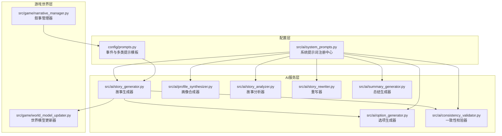
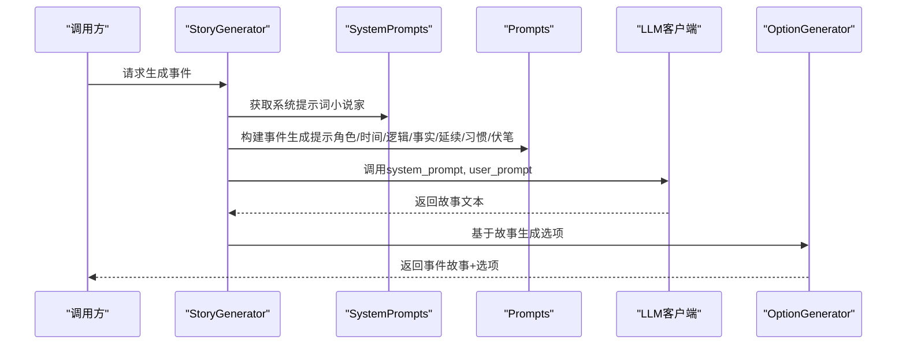
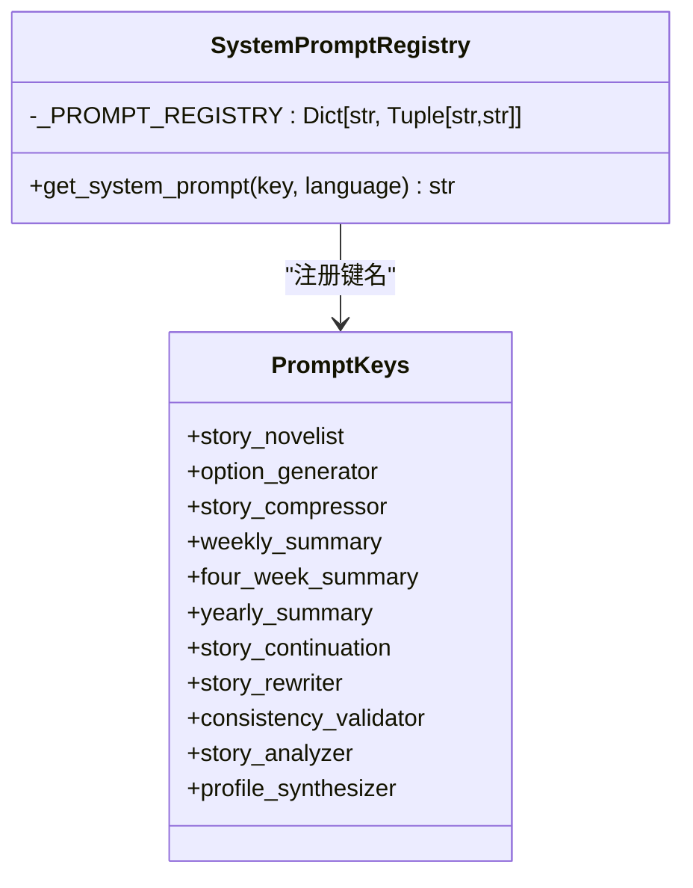
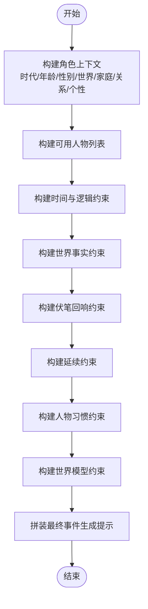
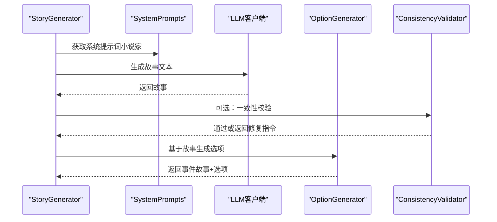
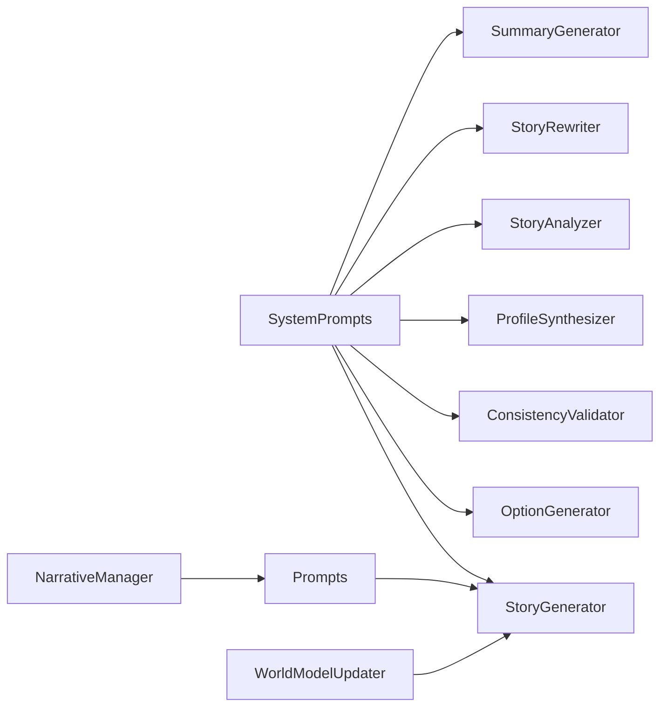

# 系统提示词

<cite>
**本文引用的文件**
- [config/prompts.py](file://config/prompts.py)
- [config/prompts.py.bak](file://config/prompts.py.bak)
- [src/ai/system_prompts.py](file://src/ai/system_prompts.py)
- [src/ai/story_generator.py](file://src/ai/story_generator.py)
- [src/ai/option_generator.py](file://src/ai/option_generator.py)
- [src/ai/consistency_validator.py](file://src/ai/consistency_validator.py)
- [src/ai/profile_synthesizer.py](file://src/ai/profile_synthesizer.py)
- [src/ai/story_analyzer.py](file://src/ai/story_analyzer.py)
- [src/ai/story_rewriter.py](file://src/ai/story_rewriter.py)
- [src/ai/summary_generator.py](file://src/ai/summary_generator.py)
- [src/game/world_model_updater.py](file://src/game/world_model_updater.py)
- [src/game/narrative_manager.py](file://src/game/narrative_manager.py)
- [tests/test_ai_modules.py](file://tests/test_ai_modules.py)
</cite>

## 目录
1. [简介](#简介)
2. [项目结构](#项目结构)
3. [核心组件](#核心组件)
4. [架构总览](#架构总览)
5. [详细组件分析](#详细组件分析)
6. [依赖关系分析](#依赖关系分析)
7. [性能考量](#性能考量)
8. [故障排查指南](#故障排查指南)
9. [结论](#结论)
10. [附录](#附录)

## 简介
本技术文档面向系统提示词组件，系统性阐述其设计原则、分类体系、模板结构、参数化与本地化机制、版本管理与更新策略、效果评估方法，并提供可操作的使用示例与最佳实践。系统提示词贯穿故事生成、选项生成、一致性校验、分析与重写、总结等全流程，确保叙事一致性、可玩性与可维护性。

## 项目结构
系统提示词相关代码主要分布在以下模块：
- 配置层：事件生成与多类提示模板（config/prompts.py），以及系统提示词注册中心（src/ai/system_prompts.py）
- 业务层：故事生成器（src/ai/story_generator.py）、选项生成器（src/ai/option_generator.py）、一致性校验器（src/ai/consistency_validator.py）、人物画像合成器（src/ai/profile_synthesizer.py）、故事分析器（src/ai/story_analyzer.py）、重写器（src/ai/story_rewriter.py）、总结生成器（src/ai/summary_generator.py）
- 世界模型与叙事管理：世界模型更新器（src/game/world_model_updater.py）、叙事管理器（src/game/narrative_manager.py）
- 测试：系统提示词注册表测试（tests/test_ai_modules.py）

图表来源
- [config/prompts.py](file://config/prompts.py#L674-L712)
- [src/ai/system_prompts.py](file://src/ai/system_prompts.py#L196-L225)
- [src/ai/story_generator.py](file://src/ai/story_generator.py#L12-L19)
- [src/ai/option_generator.py](file://src/ai/option_generator.py#L10-L60)
- [src/ai/consistency_validator.py](file://src/ai/consistency_validator.py#L6-L96)
- [src/ai/profile_synthesizer.py](file://src/ai/profile_synthesizer.py#L9-L52)
- [src/ai/story_analyzer.py](file://src/ai/story_analyzer.py#L20-L150)
- [src/ai/story_rewriter.py](file://src/ai/story_rewriter.py#L10-L101)
- [src/ai/summary_generator.py](file://src/ai/summary_generator.py#L10-L57)
- [src/game/world_model_updater.py](file://src/game/world_model_updater.py#L175-L209)
- [src/game/narrative_manager.py](file://src/game/narrative_manager.py#L354-L381)

章节来源
- [config/prompts.py](file://config/prompts.py#L674-L712)
- [src/ai/system_prompts.py](file://src/ai/system_prompts.py#L196-L225)

## 核心组件
- 系统提示词注册中心：集中管理各类系统提示词（小说家、选项生成器、压缩器、周/月/年总结、续写、重写、一致性校验、故事分析、画像合成等），按键名与语言返回对应提示词，保证KV缓存前缀稳定与统一审计。
- 事件生成提示模板：构建角色背景、可用人物列表、时间与逻辑约束、世界事实、伏笔回响、延续约束、习惯一致性等上下文，形成高质量事件生成提示。
- 多类提示模板：包含结果描述、结局、4周/年度总结、仅生成选项等专用提示，覆盖不同阶段与用途。
- 使用集成：各AI服务模块通过统一接口获取系统提示词与事件模板，形成两阶段流水线（先生成故事文本，再生成选项）。

章节来源
- [src/ai/system_prompts.py](file://src/ai/system_prompts.py#L196-L225)
- [config/prompts.py](file://config/prompts.py#L674-L712)
- [src/ai/story_generator.py](file://src/ai/story_generator.py#L32-L175)

## 架构总览
系统提示词在整体架构中的位置如下：
- 系统提示词注册中心为所有AI调用站点提供稳定的系统级提示词
- 事件生成提示模板负责拼装上下文（角色、时间、逻辑、世界事实、伏笔、延续、习惯等）
- 两阶段流水线：先由故事生成器调用LLM生成故事文本，再由选项生成器基于故事生成选项
- 一致性校验器在必要时对故事进行一致性检查与修复
- 世界模型与叙事管理器负责维护世界事实、因果链、承诺、伏笔种子等，为提示词注入约束与回响

图表来源
- [src/ai/story_generator.py](file://src/ai/story_generator.py#L32-L175)
- [src/ai/system_prompts.py](file://src/ai/system_prompts.py#L211-L225)
- [config/prompts.py](file://config/prompts.py#L674-L712)

## 详细组件分析

### 设计原则与分类体系
- 单一真实来源：系统提示词注册中心集中管理，避免分散散落导致的不一致与缓存失效
- 语言对齐：同一键名提供中英文版本，确保KV缓存前缀稳定，便于LLM侧KV缓存命中
- 任务导向：按功能域划分（故事、选项、压缩、总结、校验、分析、画像、重写），职责清晰
- 可审计与可维护：统一入口便于版本追踪、变更审计与回滚

章节来源
- [src/ai/system_prompts.py](file://src/ai/system_prompts.py#L1-L11)
- [src/ai/system_prompts.py](file://src/ai/system_prompts.py#L196-L225)

### 系统提示词注册中心
- 注册表：以键名映射中英文提示词对，覆盖故事、选项、压缩、周/月/年总结、续写、重写、一致性校验、分析、画像等
- 获取接口：按键名与语言返回对应提示词，不存在时抛出异常，便于快速定位缺失项

图表来源
- [src/ai/system_prompts.py](file://src/ai/system_prompts.py#L196-L225)

章节来源
- [src/ai/system_prompts.py](file://src/ai/system_prompts.py#L196-L225)
- [tests/test_ai_modules.py](file://tests/test_ai_modules.py#L113-L154)

### 事件生成提示模板（多上下文拼装）
- 角色上下文：时代、年龄、性别、世界背景、家庭、关系、个性与特质
- 可用人物列表：从家庭成员与关键人物合并去重，严格限定事件中出现的人
- 时间与逻辑约束：时间线、季节、年龄、动机一致性、因果逻辑、目标一致性
- 世界事实：地点、角色、事务等已建立事实，防止前后矛盾
- 伏笔回响：根据隐蔽度与回收方式，指导自然回响，避免元叙述
- 延续约束：上一轮未完结/已完结的不同续写规则，确保叙事连贯
- 人物习惯：行为一致性约束，必要时自然体现或展示变化过程
- 世界模型约束：综合地理、职业、承诺、因果链、身体状态等约束
- 输出要求：字数、对话、选项数量与效果、关系影响、倾向性标注等

图表来源
- [config/prompts.py](file://config/prompts.py#L580-L712)

章节来源
- [config/prompts.py](file://config/prompts.py#L580-L712)

### 参数化机制与本地化支持
- 参数化：通过函数参数传入玩家状态、语言、角色设定、时间信息、未完结剧情线、世界事实、世界模型等，形成可插拔的上下文拼装
- 本地化：同一键名提供中英文版本，按语言参数返回相应提示词，确保KV缓存前缀稳定
- 动态注入：根据上一轮事件是否完结、是否有活跃伏笔、是否有习惯记录等动态注入相应上下文段落

章节来源
- [config/prompts.py](file://config/prompts.py#L674-L712)
- [src/ai/system_prompts.py](file://src/ai/system_prompts.py#L211-L225)

### 结果格式化与两阶段流水线
- 两阶段：先生成纯故事文本（不含JSON），再基于故事生成选项（含效果与倾向性）
- 一致性校验：若提供世界模型，可在生成后进行一致性检查，必要时追加修复指令并重试
- 缓存与回退：支持事件缓存与生成失败回退策略，保障稳定性

图表来源
- [src/ai/story_generator.py](file://src/ai/story_generator.py#L100-L175)
- [src/ai/consistency_validator.py](file://src/ai/consistency_validator.py#L96-L146)

章节来源
- [src/ai/story_generator.py](file://src/ai/story_generator.py#L32-L175)
- [src/ai/consistency_validator.py](file://src/ai/consistency_validator.py#L96-L146)

### 世界模型与伏笔回响
- 世界模型约束：地理、职业、承诺、因果链、身体状态等综合约束，注入到事件生成提示中
- 伏笔回响：根据隐蔽度与回收方式分级，指导自然回响，避免元叙述词汇，强调克制与延迟满足

章节来源
- [config/prompts.py](file://config/prompts.py#L556-L578)
- [config/prompts.py](file://config/prompts.py#L333-L489)
- [src/game/world_model_updater.py](file://src/game/world_model_updater.py#L175-L209)
- [src/game/narrative_manager.py](file://src/game/narrative_manager.py#L354-L381)

### 多类提示模板与用途
- 结果描述：针对已做选择生成简短结果描述
- 结局：基于最终状态与关键决策生成人生总结
- 4周/年度总结：基于周期性故事与决策生成阶段性回顾
- 仅生成选项：基于现有故事生成选项，严格限制与故事相关

章节来源
- [config/prompts.py.bak](file://config/prompts.py.bak#L510-L800)

## 依赖关系分析
- 组件耦合：系统提示词注册中心与各AI服务模块松耦合，通过统一接口访问
- 直接依赖：故事生成器依赖系统提示词与事件模板；选项生成器依赖系统提示词与故事文本；一致性校验器依赖系统提示词与世界模型
- 间接依赖：世界模型与叙事管理器为提示词注入约束与回响，形成闭环

图表来源
- [src/ai/system_prompts.py](file://src/ai/system_prompts.py#L196-L225)
- [src/ai/story_generator.py](file://src/ai/story_generator.py#L12-L19)
- [src/ai/option_generator.py](file://src/ai/option_generator.py#L10-L60)
- [src/ai/consistency_validator.py](file://src/ai/consistency_validator.py#L6-L96)
- [src/ai/profile_synthesizer.py](file://src/ai/profile_synthesizer.py#L9-L52)
- [src/ai/story_analyzer.py](file://src/ai/story_analyzer.py#L20-L150)
- [src/ai/story_rewriter.py](file://src/ai/story_rewriter.py#L10-L101)
- [src/ai/summary_generator.py](file://src/ai/summary_generator.py#L10-L57)
- [src/game/world_model_updater.py](file://src/game/world_model_updater.py#L175-L209)
- [src/game/narrative_manager.py](file://src/game/narrative_manager.py#L354-L381)

章节来源
- [src/ai/system_prompts.py](file://src/ai/system_prompts.py#L196-L225)
- [src/ai/story_generator.py](file://src/ai/story_generator.py#L12-L19)

## 性能考量
- KV缓存前缀稳定性：同一键名在同一语言下返回固定提示词，提升LLM侧KV缓存命中率
- 两阶段流水线：先文本后选项，降低单次调用复杂度与错误概率
- 重试与回退：一致性校验失败时追加修复指令重试，失败时提供回退事件，保障稳定性
- 上下文裁剪：对延续上下文进行截断与保留，避免提示词过长影响性能

章节来源
- [src/ai/system_prompts.py](file://src/ai/system_prompts.py#L1-L11)
- [src/ai/story_generator.py](file://src/ai/story_generator.py#L100-L175)
- [config/prompts.py](file://config/prompts.py#L193-L273)

## 故障排查指南
- 系统提示词缺失：检查注册表键名是否正确，确保中英文版本均存在
- 事件生成失败：查看重试日志与最后错误信息，确认是否因JSON解析失败或字段缺失
- 一致性校验失败：关注严重级别（CRITICAL/WARNING），按修复指令调整后重试
- 选项生成异常：确认故事文本是否符合要求，人物名称是否来自可用人物列表

章节来源
- [tests/test_ai_modules.py](file://tests/test_ai_modules.py#L113-L154)
- [src/ai/story_generator.py](file://src/ai/story_generator.py#L159-L173)
- [src/ai/consistency_validator.py](file://src/ai/consistency_validator.py#L113-L146)

## 结论
系统提示词组件通过集中化注册、多语言对齐与严格的上下文拼装，实现了高质量、可维护、可审计的提示词体系。结合两阶段流水线与一致性校验，有效提升了叙事质量与稳定性。建议持续完善版本管理与效果评估流程，以支撑长期迭代与扩展。

## 附录

### 版本管理与更新策略
- 版本标识：建议在提示词文件中增加版本号与变更日志，便于追踪
- 回归测试：新增或修改提示词后，运行系统提示词注册表测试，确保键名与语言版本齐全
- 渐进式发布：优先在非生产环境验证，逐步扩大范围
- 回滚预案：保留备份文件（如.bak），以便快速回滚

章节来源
- [config/prompts.py.bak](file://config/prompts.py.bak#L1-L10)
- [tests/test_ai_modules.py](file://tests/test_ai_modules.py#L130-L154)

### 效果评估方法
- 一致性指标：通过一致性校验器统计CRITICAL/WARNING比例，评估提示词对一致性约束的有效性
- 选项质量：统计选项的合理性、权衡性与与故事的相关性
- 用户反馈：收集用户对故事沉浸感、决策体验与重复度的反馈
- A/B对比：对关键提示词进行A/B测试，比较不同版本在关键指标上的差异

章节来源
- [src/ai/consistency_validator.py](file://src/ai/consistency_validator.py#L113-L146)
- [src/ai/story_generator.py](file://src/ai/story_generator.py#L130-L175)

### 使用示例（路径指引）
- 获取系统提示词：参见 [src/ai/system_prompts.py](file://src/ai/system_prompts.py#L211-L225)
- 生成事件（故事+选项）：参见 [src/ai/story_generator.py](file://src/ai/story_generator.py#L32-L175)
- 仅生成选项：参见 [config/prompts.py.bak](file://config/prompts.py.bak#L640-L800)
- 结果描述与结局：参见 [config/prompts.py.bak](file://config/prompts.py.bak#L510-L557)
- 4周/年度总结：参见 [config/prompts.py.bak](file://config/prompts.py.bak#L559-L638)