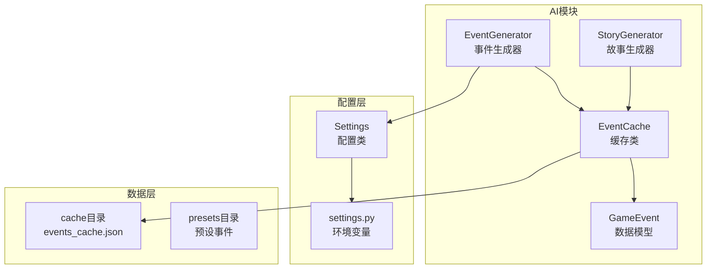
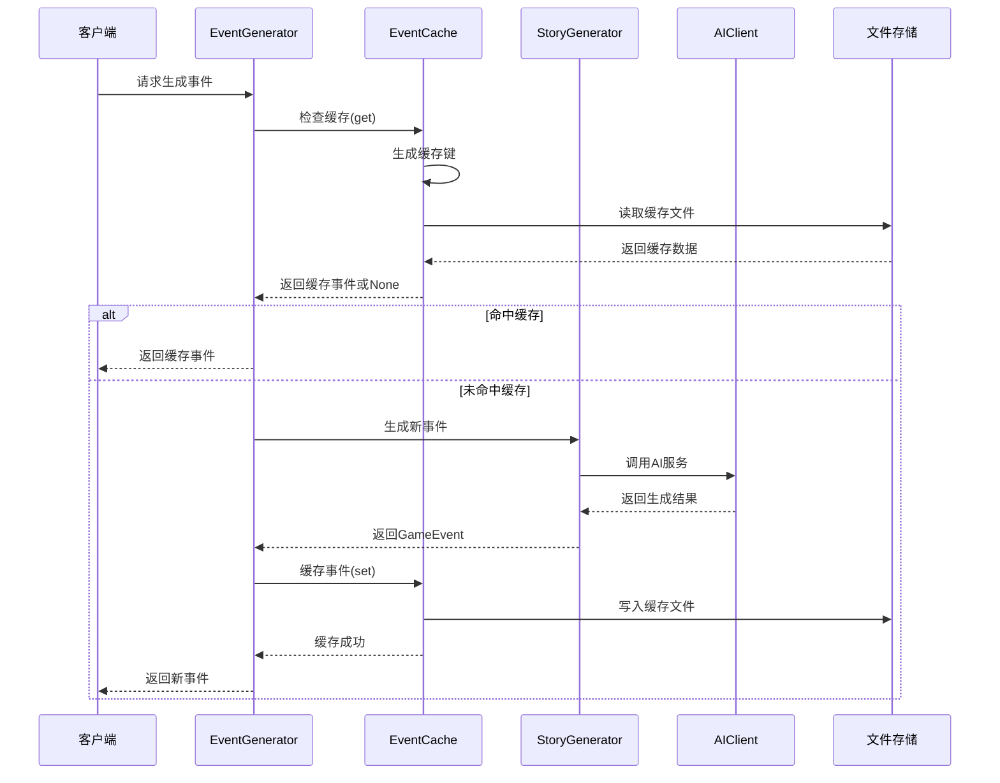
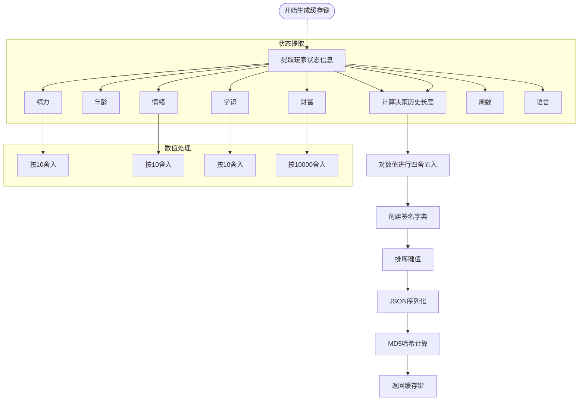
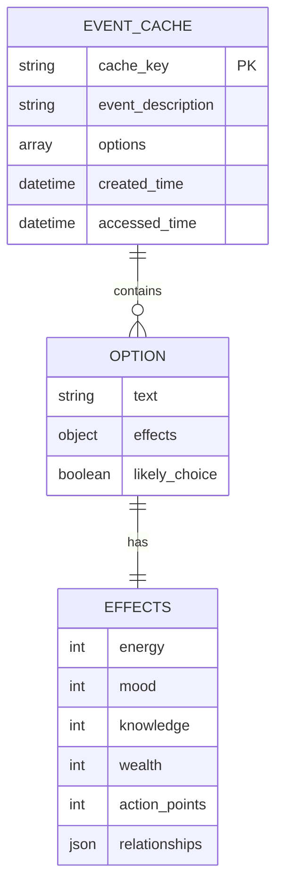
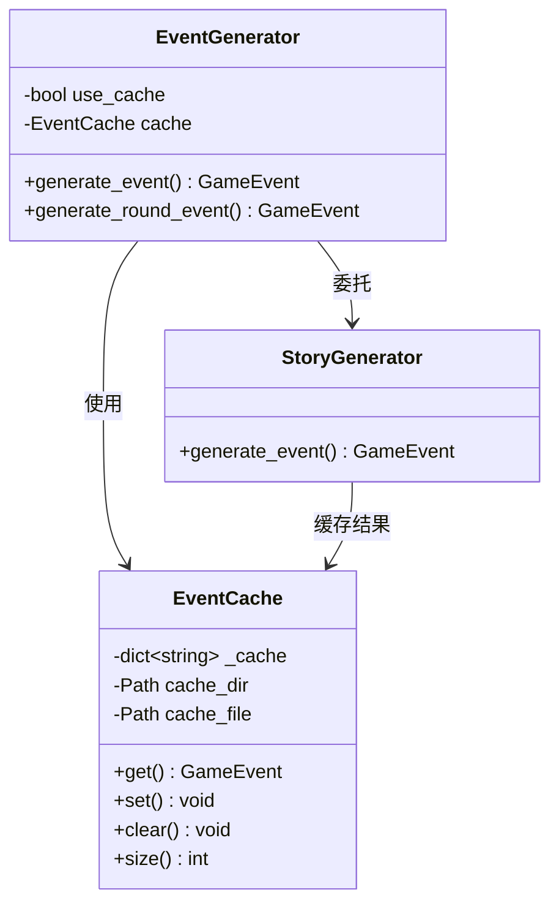
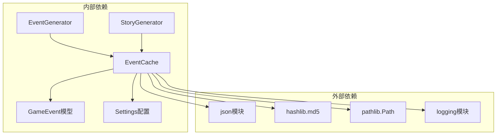
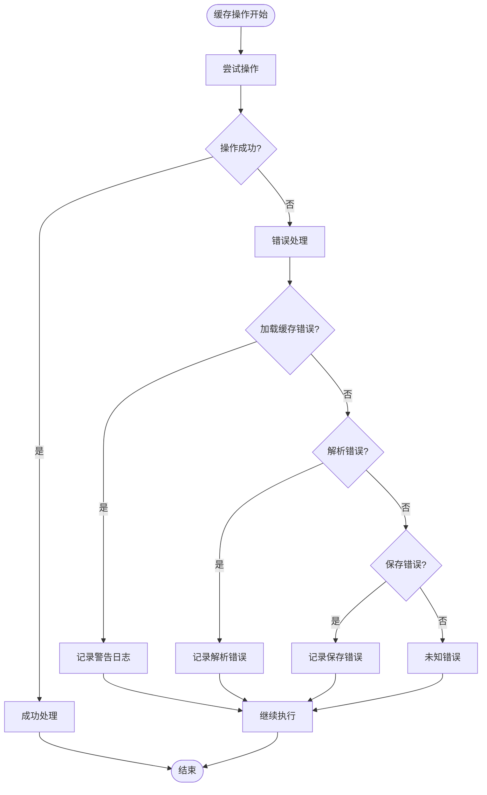

# 缓存系统

<cite>
**本文档引用的文件**
- [src/ai/cache.py](file://src/ai/cache.py)
- [src/ai/models.py](file://src/ai/models.py)
- [src/ai/generator.py](file://src/ai/generator.py)
- [src/ai/story_generator.py](file://src/ai/story_generator.py)
- [config/settings.py](file://config/settings.py)
- [data/cache/events_cache.json](file://data/cache/events_cache.json)
- [tests/test_ai_modules.py](file://tests/test_ai_modules.py)
</cite>

## 目录
1. [简介](#简介)
2. [项目结构](#项目结构)
3. [核心组件](#核心组件)
4. [架构概览](#架构概览)
5. [详细组件分析](#详细组件分析)
6. [依赖关系分析](#依赖关系分析)
7. [性能考量](#性能考量)
8. [故障排除指南](#故障排除指南)
9. [结论](#结论)
10. [附录](#附录)

## 简介
本项目实现了AI事件缓存系统，旨在减少重复的AI调用，提高系统响应速度并降低API成本。缓存系统基于事件描述和选项的组合，通过MD5哈希生成稳定的缓存键，支持事件的持久化存储和快速检索。

## 项目结构
缓存系统位于AI模块中，采用模块化设计，与其他AI组件协同工作：



**图表来源**
- [src/ai/cache.py](file://src/ai/cache.py#L13-L138)
- [src/ai/generator.py](file://src/ai/generator.py#L30-L66)
- [config/settings.py](file://config/settings.py#L16-L27)

**章节来源**
- [src/ai/cache.py](file://src/ai/cache.py#L1-L139)
- [config/settings.py](file://config/settings.py#L1-L100)

## 核心组件
缓存系统的核心由以下组件构成：

### EventCache类
主要负责事件缓存的完整生命周期管理，包括：
- 缓存键生成策略
- 事件存储和检索
- 缓存持久化
- 缓存清理功能

### GameEvent模型
定义了事件的数据结构，包括事件描述和选项列表，支持序列化和反序列化操作。

### 配置系统
通过Settings类管理缓存相关的配置参数，包括缓存开关、默认语言等设置。

**章节来源**
- [src/ai/cache.py](file://src/ai/cache.py#L13-L138)
- [src/ai/models.py](file://src/ai/models.py#L14-L27)
- [config/settings.py](file://config/settings.py#L30-L95)

## 架构概览
缓存系统采用分层架构设计，与AI生成流程紧密集成：



**图表来源**
- [src/ai/generator.py](file://src/ai/generator.py#L212-L217)
- [src/ai/cache.py](file://src/ai/cache.py#L78-L101)
- [src/ai/story_generator.py](file://src/ai/story_generator.py#L152-L154)

## 详细组件分析

### EventCache类设计分析

#### 缓存键生成策略
缓存键生成采用了多维度签名策略，确保相似状态的事件能够正确匹配：



**图表来源**
- [src/ai/cache.py](file://src/ai/cache.py#L47-L76)

#### 缓存存储格式
缓存采用JSON格式存储，结构清晰且易于调试：



**图表来源**
- [src/ai/cache.py](file://src/ai/cache.py#L114-L124)
- [src/ai/models.py](file://src/ai/models.py#L7-L17)

#### 缓存失效机制
系统实现了智能的缓存失效策略：
- **概率性失效**：30%的概率使用缓存，确保内容多样性
- **自动清理**：支持手动清空所有缓存
- **持久化存储**：缓存数据保存到events_cache.json文件

**章节来源**
- [src/ai/cache.py](file://src/ai/cache.py#L47-L138)

### 缓存集成机制

#### 与事件生成器的集成
EventGenerator通过装饰器模式集成缓存系统：



**图表来源**
- [src/ai/generator.py](file://src/ai/generator.py#L30-L66)
- [src/ai/story_generator.py](file://src/ai/story_generator.py#L152-L154)

#### 配置参数管理
缓存系统通过Settings类统一管理配置：

| 配置项 | 类型 | 默认值 | 描述 |
|--------|------|--------|------|
| CACHE_EVENTS | bool | true | 是否启用事件缓存 |
| DEFAULT_LANGUAGE | str | "zh" | 默认语言设置 |
| CACHE_DIR | Path | data/cache | 缓存文件目录 |

**章节来源**
- [config/settings.py](file://config/settings.py#L39-L41)
- [config/settings.py](file://config/settings.py#L19-L19)

## 依赖关系分析

### 组件耦合度分析
缓存系统与其他组件的依赖关系如下：



**图表来源**
- [src/ai/cache.py](file://src/ai/cache.py#L1-L10)
- [src/ai/generator.py](file://src/ai/generator.py#L17-L25)

### 错误处理机制
缓存系统实现了完善的错误处理策略：



**图表来源**
- [src/ai/cache.py](file://src/ai/cache.py#L34-L45)
- [src/ai/cache.py](file://src/ai/cache.py#L97-L98)

**章节来源**
- [src/ai/cache.py](file://src/ai/cache.py#L28-L45)
- [src/ai/cache.py](file://src/ai/cache.py#L96-L98)

## 性能考量

### 缓存命中率优化策略
系统采用了多重策略来优化缓存命中率：

1. **智能数值舍入**：对相近的数值进行舍入处理，减少微小差异导致的缓存失效
2. **概率性使用策略**：30%的概率使用缓存，确保内容多样性
3. **决策历史考虑**：将决策历史长度纳入缓存键，避免重复事件

### 内存管理策略
- **增量式加载**：缓存文件按需加载，避免一次性占用大量内存
- **对象池模式**：复用GameEvent对象，减少内存分配
- **及时清理**：提供clear()方法手动清理缓存

### 持久化策略
- **原子性写入**：使用json.dump进行原子性文件写入
- **异常容错**：文件读写异常不影响主流程执行
- **目录自动创建**：确保缓存目录存在

## 故障排除指南

### 常见问题诊断
1. **缓存文件损坏**
   - 现象：缓存加载失败，日志显示解析错误
   - 处理：调用clear()方法清空缓存，重新生成

2. **磁盘空间不足**
   - 现象：缓存保存失败，抛出IO异常
   - 处理：清理缓存文件或增加磁盘空间

3. **权限问题**
   - 现象：无法创建缓存目录或写入文件
   - 处理：检查数据目录权限

### 性能调优建议
1. **缓存大小控制**
   - 定期清理不需要的缓存条目
   - 监控缓存文件大小，避免过大

2. **配置优化**
   - 根据使用场景调整CACHE_EVENTS参数
   - 在开发环境可以关闭缓存以获取最新结果

**章节来源**
- [src/ai/cache.py](file://src/ai/cache.py#L34-L45)
- [src/ai/cache.py](file://src/ai/cache.py#L130-L134)

## 结论
本缓存系统通过合理的键生成策略、智能的失效机制和完善的错误处理，在保证内容质量的同时显著提升了系统性能。系统设计具有良好的扩展性和维护性，为AI驱动的游戏体验提供了可靠的技术支撑。

## 附录

### 缓存使用示例
以下展示了缓存系统的主要使用方式：

1. **初始化缓存**
   ```python
   cache = EventCache()
   ```

2. **查询缓存**
   ```python
   event = cache.get(player_state, language)
   ```

3. **设置缓存**
   ```python
   cache.set(player_state, language, event)
   ```

4. **清理缓存**
   ```python
   cache.clear()
   ```

### 配置参数详解

| 参数名称 | 类型 | 默认值 | 作用域 | 描述 |
|----------|------|--------|--------|------|
| CACHE_EVENTS | bool | true | 全局 | 控制是否启用事件缓存 |
| CACHE_DIR | Path | data/cache | 全局 | 缓存文件存储目录 |
| DEFAULT_LANGUAGE | str | "zh" | 全局 | 默认语言设置 |

### 监控指标建议
1. **缓存命中率**：统计缓存命中次数与总请求次数的比例
2. **缓存大小**：监控events_cache.json文件大小
3. **加载时间**：记录缓存文件读取耗时
4. **错误率**：统计缓存操作失败次数