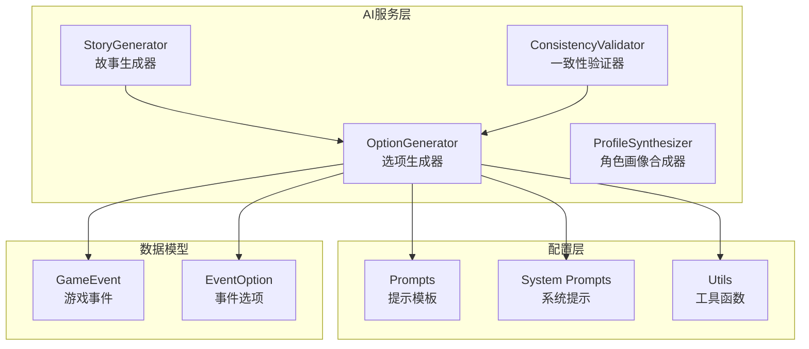
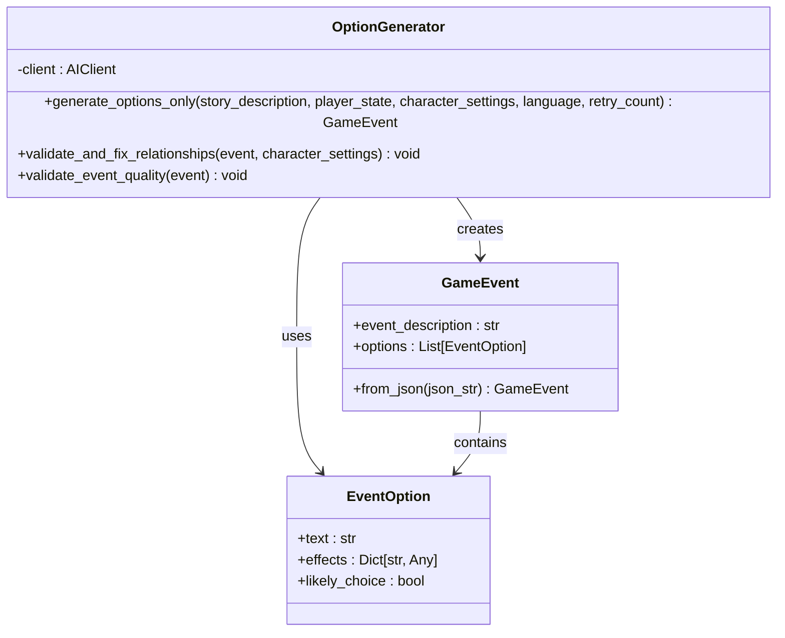
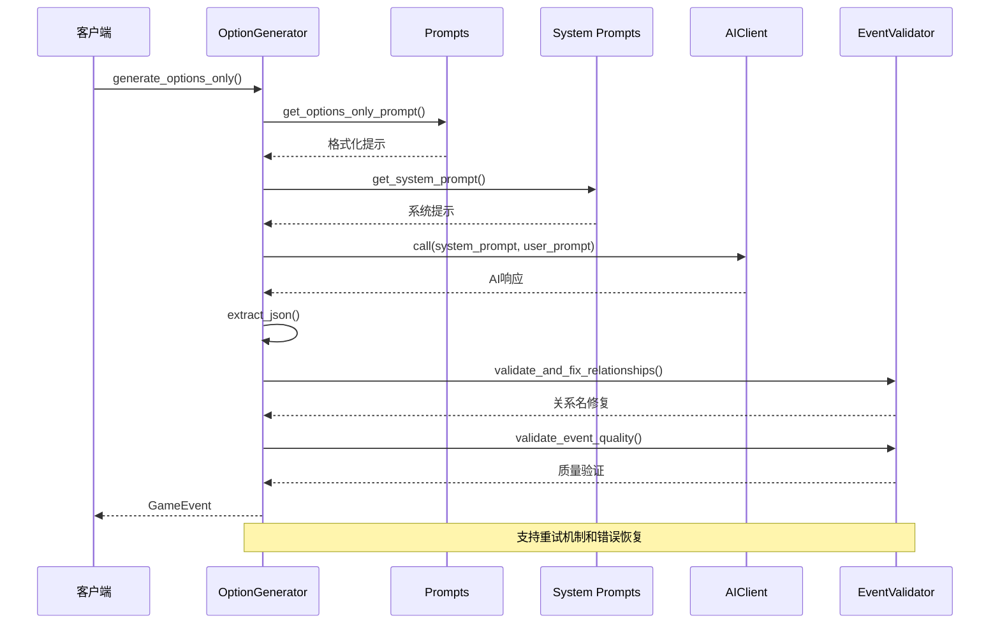
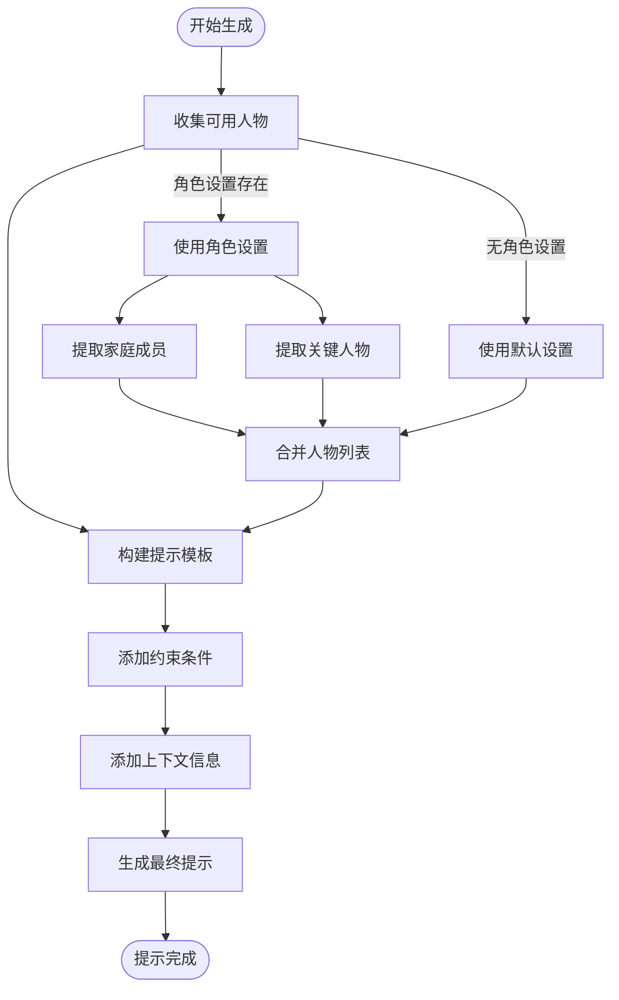
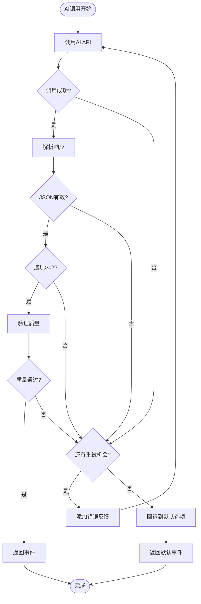
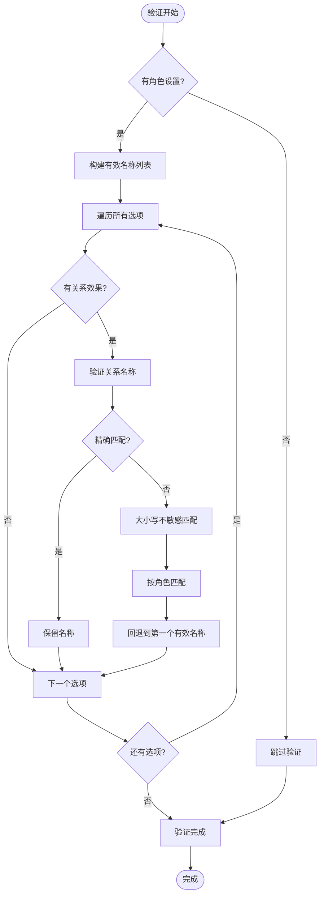
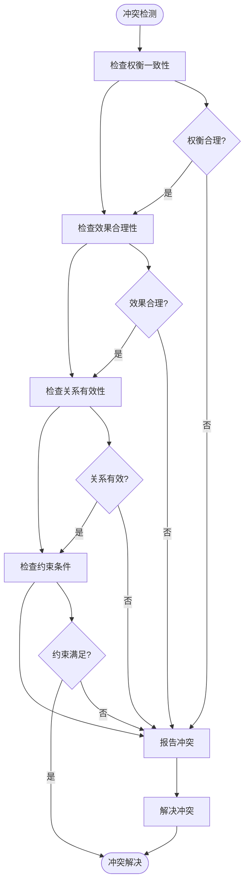
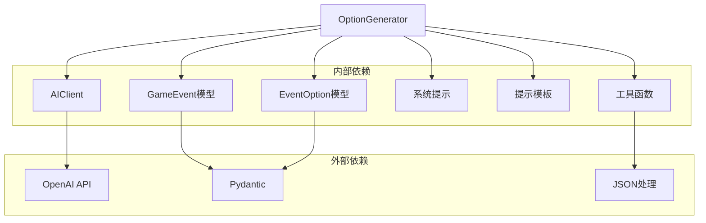

# 选项生成器

<cite>
**本文档引用的文件**
- [option_generator.py](file://src/ai/option_generator.py)
- [models.py](file://src/ai/models.py)
- [prompts.py](file://config/prompts.py)
- [prompts.py.bak](file://config/prompts.py.bak)
- [system_prompts.py](file://src/ai/system_prompts.py)
- [utils.py](file://src/ai/utils.py)
- [generator.py](file://src/ai/generator.py)
- [test_ai_extended.py](file://tests/test_ai_extended.py)
- [test_ai_modules.py](file://tests/test_ai_modules.py)
</cite>

## 目录
1. [简介](#简介)
2. [项目结构](#项目结构)
3. [核心组件](#核心组件)
4. [架构概览](#架构概览)
5. [详细组件分析](#详细组件分析)
6. [依赖分析](#依赖分析)
7. [性能考虑](#性能考虑)
8. [故障排除指南](#故障排除指南)
9. [结论](#结论)

## 简介

选项生成器（OptionGenerator）是故事驱动的人生模拟游戏中的关键组件，负责为现有故事生成合理的选项列表。该组件实现了两阶段流水线中的第二阶段，专门处理选项生成、验证和修复机制。它确保生成的选项与故事内容紧密相关，具有多样性和逻辑一致性，并提供完整的错误恢复和调试支持功能。

## 项目结构

选项生成器位于AI服务层的核心位置，与故事生成器、一致性验证器等组件协同工作：

**图表来源**
- [option_generator.py](file://src/ai/option_generator.py#L17-L248)
- [prompts.py](file://config/prompts.py#L640-L839)
- [system_prompts.py](file://src/ai/system_prompts.py#L196-L226)

**章节来源**
- [option_generator.py](file://src/ai/option_generator.py#L1-L248)
- [generator.py](file://src/ai/generator.py#L30-L66)

## 核心组件

### OptionGenerator 类

OptionGenerator 是选项生成器的核心类，提供了完整的选项生成、验证和修复功能：

**图表来源**
- [option_generator.py](file://src/ai/option_generator.py#L17-L248)
- [models.py](file://src/ai/models.py#L7-L27)

### 数据模型

系统使用Pydantic数据模型确保数据结构的完整性和类型安全：

- **GameEvent**: 包含事件描述和选项列表，强制要求至少2个选项
- **EventOption**: 表示单个游戏选项，包含文本描述、效果和可能性标记

**章节来源**
- [models.py](file://src/ai/models.py#L7-L27)

## 架构概览

选项生成器采用模块化设计，通过清晰的职责分离实现高内聚低耦合：

**图表来源**
- [option_generator.py](file://src/ai/option_generator.py#L25-L132)
- [prompts.py.bak](file://config/prompts.py.bak#L640-L800)
- [system_prompts.py](file://src/ai/system_prompts.py#L211-L226)

## 详细组件分析

### 选项生成算法

选项生成算法采用多阶段处理流程，确保生成的选项既相关又多样化：

#### 1. 提示模板生成

系统根据故事内容和玩家状态动态生成提示模板：

**图表来源**
- [prompts.py.bak](file://config/prompts.py.bak#L640-L700)

#### 2. AI调用与重试机制

选项生成器实现了智能重试机制，支持错误反馈和自动修复：

**图表来源**
- [option_generator.py](file://src/ai/option_generator.py#L64-L132)

#### 3. 选项质量评估

质量评估机制确保生成的选项具有合理的权衡和逻辑一致性：

**章节来源**
- [option_generator.py](file://src/ai/option_generator.py#L210-L247)

### 关系名称验证与修复

关系名称验证系统确保所有关系名称都来自预定义的有效列表：

**图表来源**
- [option_generator.py](file://src/ai/option_generator.py#L136-L209)

**章节来源**
- [option_generator.py](file://src/ai/option_generator.py#L136-L209)

### 选项格式化与约束处理

系统实现了严格的选项格式化和约束处理机制：

#### 1. 选项数量控制

- **最小数量**: 至少2个选项（GameEvent模型强制）
- **最大数量**: 最多4个选项（GameEvent模型限制）
- **智能调整**: 当AI生成的选项数量不符合要求时，系统会触发重试机制

#### 2. 选项格式化

每个选项必须包含以下必需字段：
- `text`: 选项描述（最多15个字符）
- `effects`: 影响效果字典
- `likely_choice`: 是否为角色的可能选择

#### 3. 效果标准化

系统自动标准化和验证各种效果类型：
- **能量 (energy)**: -50 到 50
- **情绪 (mood)**: -50 到 50  
- **学识 (knowledge)**: -50 到 50
- **财富 (wealth)**: -5000 到 5000
- **关系 (relationships)**: 嵌套字典，键必须来自有效名称列表

**章节来源**
- [models.py](file://src/ai/models.py#L7-L27)
- [option_generator.py](file://src/ai/option_generator.py#L210-L247)

### 冲突避免策略

系统采用了多层次的冲突避免策略：

#### 1. 语义一致性检查

**图表来源**
- [option_generator.py](file://src/ai/option_generator.py#L210-L247)

#### 2. 逻辑一致性验证

系统通过以下方式确保逻辑一致性：
- **效果范围验证**: 检查数值是否在合理范围内
- **权衡分析**: 确保没有明显最优选项
- **关系完整性**: 验证所有关系名称的有效性

**章节来源**
- [option_generator.py](file://src/ai/option_generator.py#L210-L247)

## 依赖分析

选项生成器的依赖关系体现了清晰的分层架构：

**图表来源**
- [option_generator.py](file://src/ai/option_generator.py#L9-L12)
- [models.py](file://src/ai/models.py#L3-L4)

**章节来源**
- [option_generator.py](file://src/ai/option_generator.py#L9-L12)
- [models.py](file://src/ai/models.py#L3-L4)

## 性能考虑

### 1. 缓存策略

虽然选项生成器本身不直接实现缓存，但它与事件缓存系统集成：
- **缓存键生成**: 基于玩家状态和语言的哈希值
- **缓存失效**: 基于时间戳和状态变化的智能失效
- **内存管理**: 限制缓存大小防止内存泄漏

### 2. 错误恢复机制

系统实现了多层次的错误恢复：
- **重试机制**: 最多重试3次，每次添加错误反馈
- **回退策略**: 当AI调用失败时使用默认选项
- **降级处理**: 即使部分功能失败也保证基本功能可用

### 3. 内存优化

- **流式处理**: 对大型响应进行流式处理
- **对象复用**: 重用已创建的对象减少内存分配
- **及时清理**: 及时释放不再使用的临时对象

## 故障排除指南

### 常见问题及解决方案

#### 1. 选项生成失败

**症状**: 生成的选项少于2个或格式无效

**诊断步骤**:
1. 检查AI API调用是否成功
2. 验证JSON提取函数是否正常工作
3. 确认提示模板是否正确生成

**解决方案**:
- 启用重试机制（retry_count参数）
- 检查系统提示是否正确
- 验证角色设置是否完整

#### 2. 关系名称不匹配

**症状**: 选项中的关系名称无法验证

**诊断步骤**:
1. 检查角色设置中的key_people列表
2. 验证关系名称的大小写和拼写
3. 确认角色角色映射是否正确

**解决方案**:
- 使用大小写不敏感匹配
- 尝试按角色进行匹配
- 回退到第一个有效名称

#### 3. 效果值异常

**症状**: 选项效果值超出合理范围

**诊断步骤**:
1. 检查效果值的范围限制
2. 验证数值计算逻辑
3. 确认数据类型转换

**解决方案**:
- 应用范围检查和裁剪
- 实施警告机制
- 提供默认值

**章节来源**
- [test_ai_extended.py](file://tests/test_ai_extended.py#L11-L151)
- [test_ai_modules.py](file://tests/test_ai_modules.py#L75-L111)

## 结论

选项生成器组件展现了优秀的软件工程实践，通过模块化设计、清晰的职责分离和完善的错误处理机制，实现了高质量的选项生成功能。其核心优势包括：

1. **智能重试机制**: 通过多轮重试和错误反馈确保生成质量
2. **严格的验证体系**: 多层次的质量检查确保逻辑一致性
3. **灵活的扩展性**: 模块化设计便于功能扩展和维护
4. **完善的错误恢复**: 多种回退策略保证系统稳定性
5. **详细的调试支持**: 丰富的日志记录和错误信息

该组件为整个故事驱动的游戏系统提供了坚实的基础，确保玩家能够获得丰富、有趣且逻辑合理的游戏体验。