# Streamlit应用架构

<cite>
**本文档引用的文件**
- [src/ui/streamlit_app.py](file://src/ui/streamlit_app.py)
- [src/ui/styles.py](file://src/ui/styles.py)
- [src/ui/state_manager.py](file://src/ui/state_manager.py)
- [src/ui/session_manager.py](file://src/ui/session_manager.py)
- [.streamlit/config.toml](file://.streamlit/config.toml)
- [config/settings.py](file://config/settings.py)
- [config/logging_config.py](file://config/logging_config.py)
- [run_web.py](file://run_web.py)
- [.env.example](file://.env.example)
- [requirements.txt](file://requirements.txt)
- [Dockerfile](file://Dockerfile)
- [DEPLOYMENT.md](file://DEPLOYMENT.md)
</cite>

## 目录
1. [简介](#简介)
2. [项目结构](#项目结构)
3. [核心组件](#核心组件)
4. [架构概览](#架构概览)
5. [详细组件分析](#详细组件分析)
6. [依赖关系分析](#依赖关系分析)
7. [性能考虑](#性能考虑)
8. [故障排除指南](#故障排除指南)
9. [结论](#结论)

## 简介

"人生草稿本"是一个基于Streamlit构建的交互式叙事游戏应用。该应用采用模块化架构设计，实现了完整的角色扮演游戏体验，包括角色创建、故事生成、决策影响和多周游戏循环等功能。

本应用的核心特色包括：
- **统一的状态管理系统**：通过集中式的SessionStateManager实现类型安全的状态管理
- **深度的主题定制**：完全自定义的CSS样式系统，支持深色主题和响应式设计
- **灵活的部署架构**：支持Streamlit Cloud、Docker和传统服务器部署
- **完善的错误处理**：多层次的异常捕获和用户友好的错误提示
- **国际化支持**：双语言界面支持（中文/英文）

## 项目结构

该项目采用清晰的分层架构，按照功能模块组织代码：

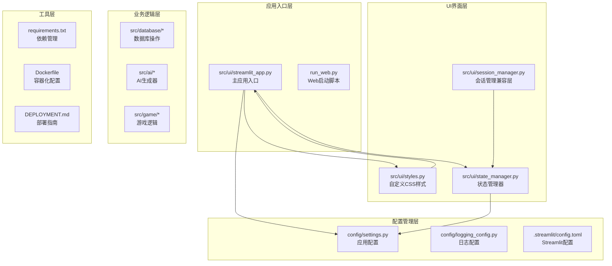

**图表来源**
- [src/ui/streamlit_app.py](file://src/ui/streamlit_app.py#L1-L215)
- [src/ui/styles.py](file://src/ui/styles.py#L1-L710)
- [src/ui/state_manager.py](file://src/ui/state_manager.py#L1-L773)

**章节来源**
- [src/ui/streamlit_app.py](file://src/ui/streamlit_app.py#L1-L215)
- [config/settings.py](file://config/settings.py#L1-L100)

## 核心组件

### 主应用入口点

主应用入口点位于`src/ui/streamlit_app.py`，负责应用的整体初始化和页面路由：

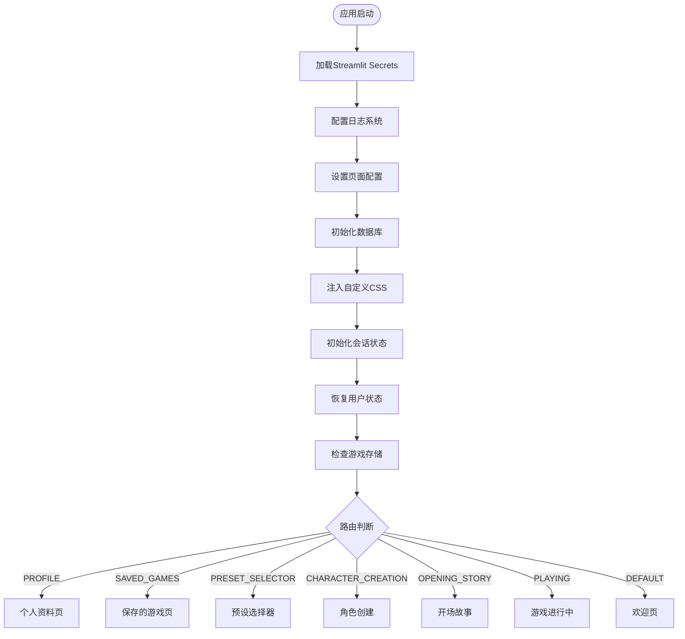

**图表来源**
- [src/ui/streamlit_app.py](file://src/ui/streamlit_app.py#L139-L211)

### 统一状态管理器

`SessionStateManager`是应用的核心组件，提供类型安全的状态管理：

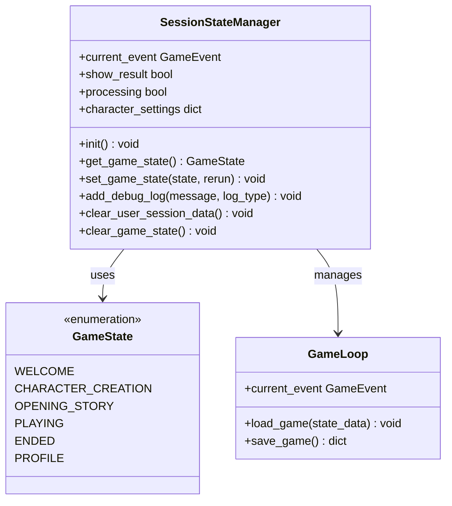

**图表来源**
- [src/ui/state_manager.py](file://src/ui/state_manager.py#L29-L546)

### 自定义CSS样式系统

应用实现了完整的自定义样式系统，支持深色主题和响应式设计：

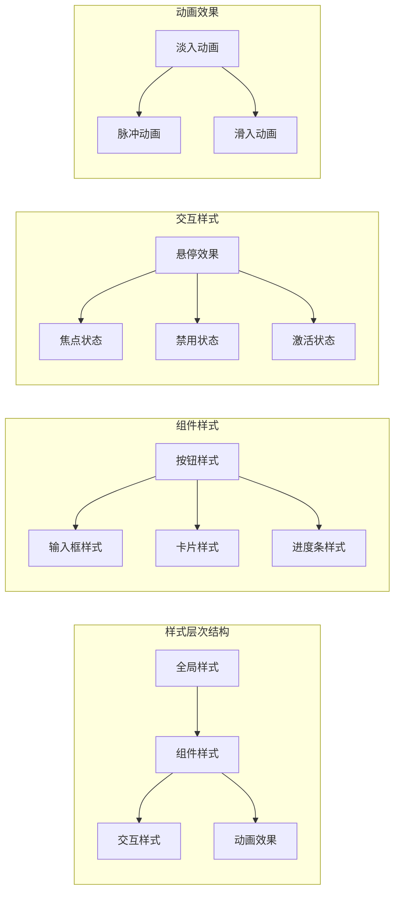

**图表来源**
- [src/ui/styles.py](file://src/ui/styles.py#L5-L704)

**章节来源**
- [src/ui/streamlit_app.py](file://src/ui/streamlit_app.py#L139-L215)
- [src/ui/state_manager.py](file://src/ui/state_manager.py#L1-L773)
- [src/ui/styles.py](file://src/ui/styles.py#L1-L710)

## 架构概览

应用采用分层架构设计，确保各层职责清晰分离：

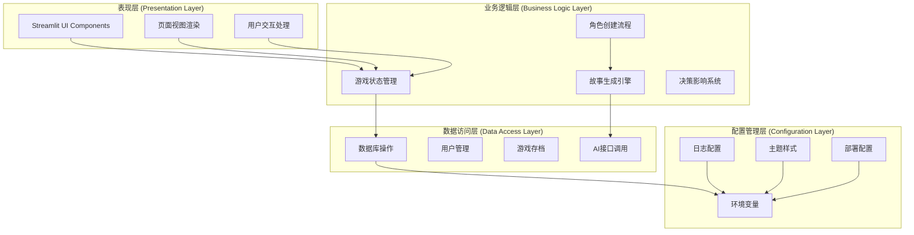

**图表来源**
- [src/ui/streamlit_app.py](file://src/ui/streamlit_app.py#L1-L215)
- [src/ui/state_manager.py](file://src/ui/state_manager.py#L1-L773)

## 详细组件分析

### 应用启动流程

应用启动流程遵循严格的初始化顺序，确保所有组件正确配置：

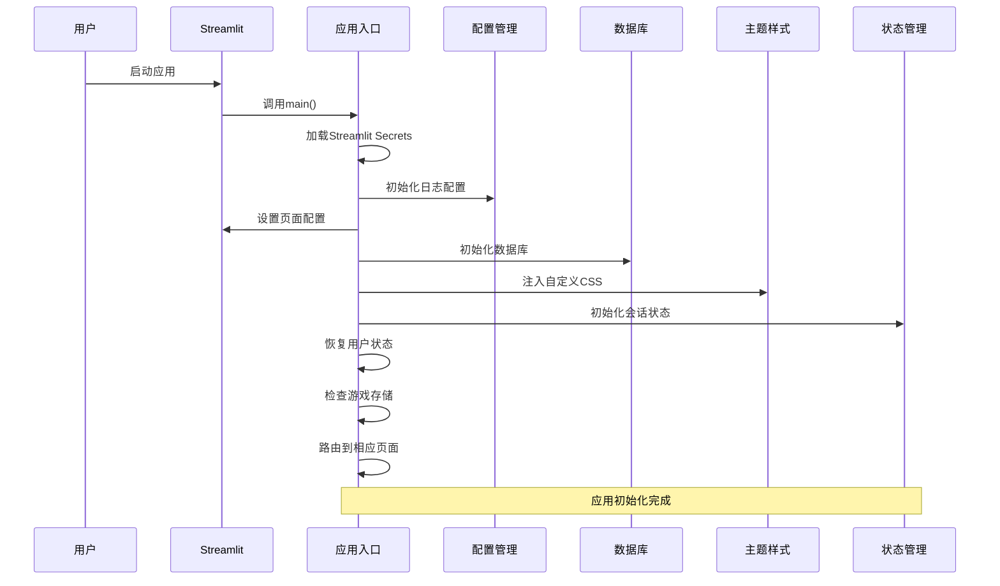

**图表来源**
- [src/ui/streamlit_app.py](file://src/ui/streamlit_app.py#L30-L167)

### 页面路由系统

应用实现了基于状态机的页面路由系统，支持复杂的页面导航：

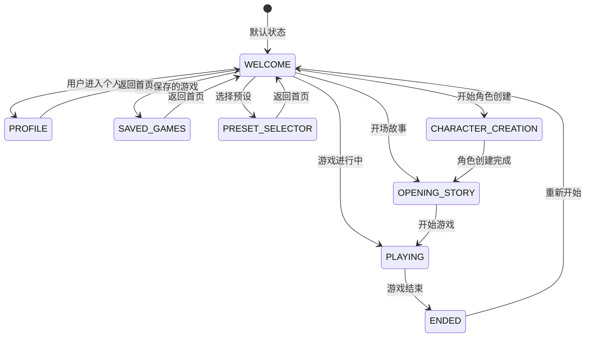

**图表来源**
- [src/ui/streamlit_app.py](file://src/ui/streamlit_app.py#L175-L210)

### 角色创建流程

角色创建流程是一个复杂的多步骤过程，包含多个验证和确认环节：

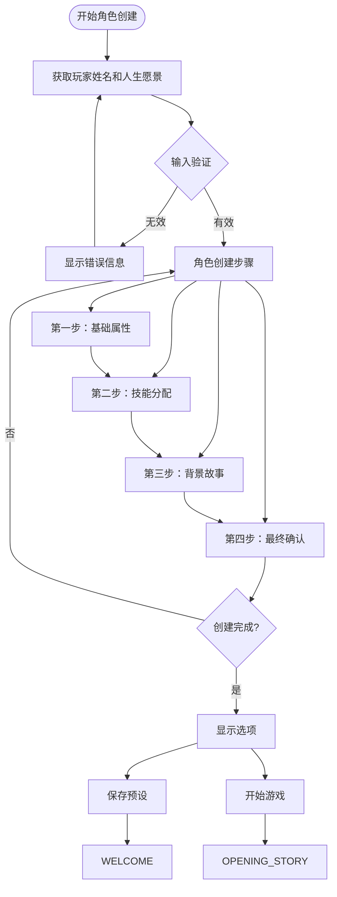

**图表来源**
- [src/ui/streamlit_app.py](file://src/ui/streamlit_app.py#L54-L137)

### 错误处理机制

应用实现了多层次的错误处理机制，确保用户体验的连续性：

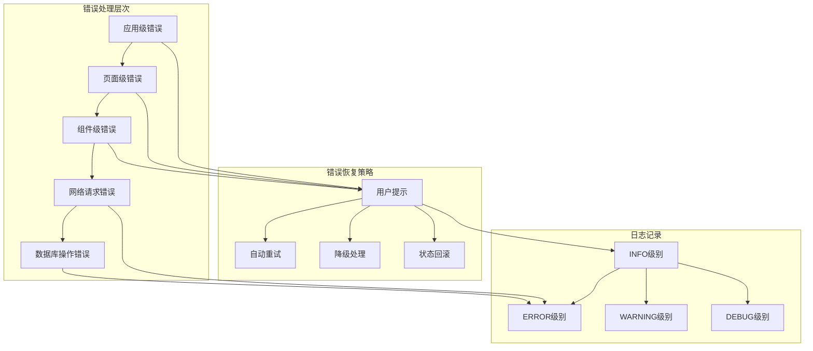

**图表来源**
- [src/ui/streamlit_app.py](file://src/ui/streamlit_app.py#L131-L135)

**章节来源**
- [src/ui/streamlit_app.py](file://src/ui/streamlit_app.py#L1-L215)
- [src/ui/state_manager.py](file://src/ui/state_manager.py#L1-L773)

## 依赖关系分析

应用的依赖关系体现了清晰的分层架构和模块化设计：

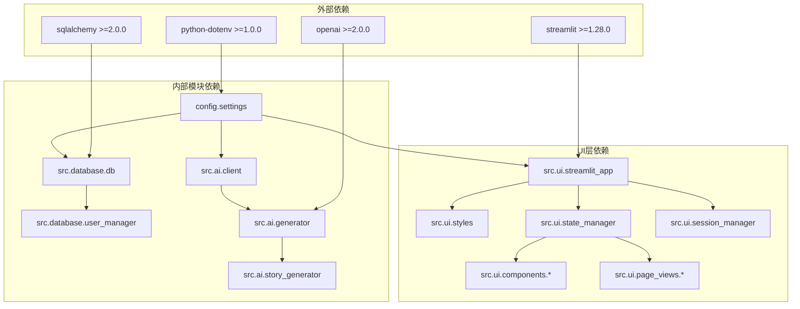

**图表来源**
- [requirements.txt](file://requirements.txt#L1-L9)
- [src/ui/streamlit_app.py](file://src/ui/streamlit_app.py#L6-L19)

**章节来源**
- [requirements.txt](file://requirements.txt#L1-L9)
- [src/ui/streamlit_app.py](file://src/ui/streamlit_app.py#L1-L215)

## 性能考虑

### 启动性能优化

应用采用了多种启动性能优化策略：

1. **延迟导入**：AI相关模块采用延迟导入，减少启动时间
2. **条件初始化**：仅在需要时初始化数据库连接
3. **缓存策略**：合理使用缓存减少重复计算

### 运行时性能优化

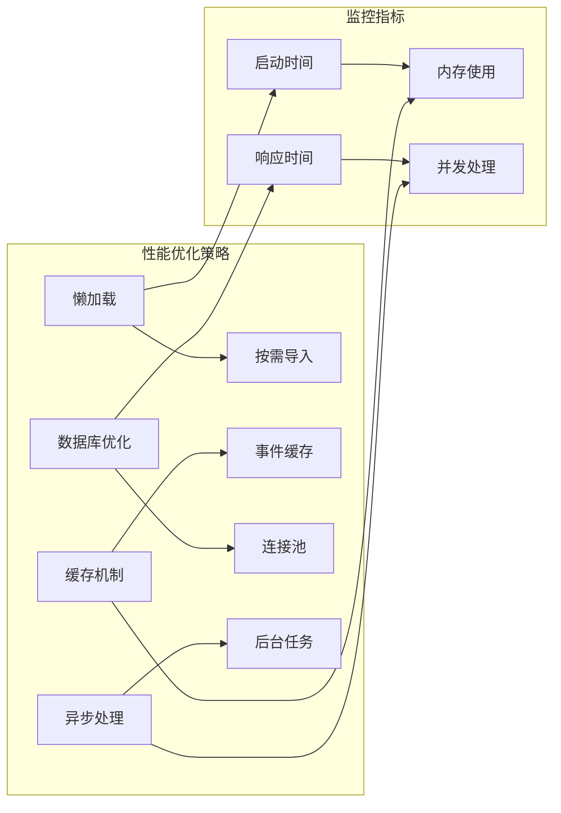

### 部署性能配置

应用支持多种部署模式的性能优化：

- **Streamlit Cloud**：自动扩缩容，适合小规模部署
- **Docker部署**：容器化优化，支持水平扩展
- **生产环境**：Nginx反向代理，负载均衡

**章节来源**
- [config/settings.py](file://config/settings.py#L30-L100)
- [Dockerfile](file://Dockerfile#L1-L48)

## 故障排除指南

### 常见部署问题

| 问题类型 | 症状 | 解决方案 |
|---------|------|----------|
| 环境变量缺失 | 应用启动失败或功能异常 | 检查.env文件配置，确保必需变量设置 |
| 数据库连接失败 | 游戏数据无法保存或读取 | 验证DATABASE_URL配置，检查数据库服务状态 |
| AI API错误 | 故事生成失败 | 检查OPENAI_API_KEY配置，验证API访问权限 |
| 样式加载问题 | 页面显示异常或样式错乱 | 清理浏览器缓存，检查CSS文件完整性 |

### 调试模式配置

应用支持调试模式，提供详细的日志输出：

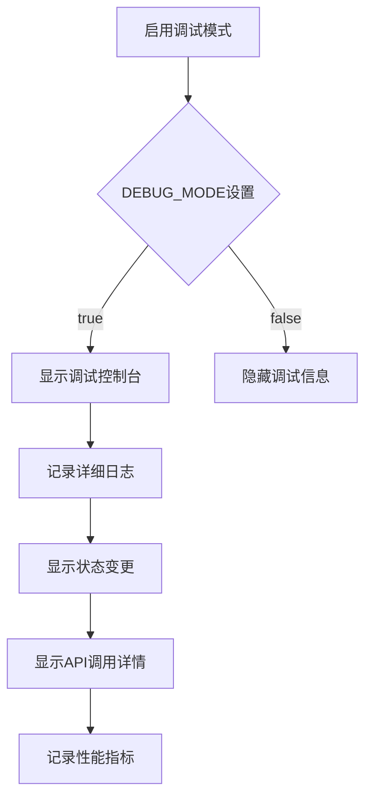

**图表来源**
- [config/settings.py](file://config/settings.py#L41)

### 日志配置详解

应用实现了灵活的日志配置系统：

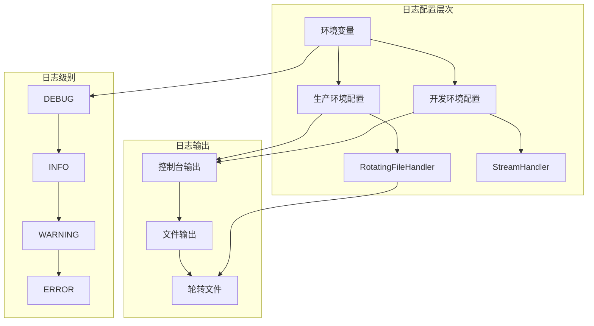

**图表来源**
- [config/logging_config.py](file://config/logging_config.py#L12-L69)

**章节来源**
- [config/logging_config.py](file://config/logging_config.py#L1-L78)
- [config/settings.py](file://config/settings.py#L41)

## 结论

"人生草稿本"应用展现了现代Streamlit应用的最佳实践，通过以下关键设计实现了高质量的用户体验：

### 架构优势

1. **模块化设计**：清晰的分层架构确保代码的可维护性和可扩展性
2. **类型安全**：通过SessionStateManager实现类型安全的状态管理
3. **主题定制**：完全自定义的CSS系统支持深度个性化
4. **多部署支持**：灵活的部署选项适应不同规模的需求

### 技术亮点

- **智能状态管理**：统一的状态管理器简化了复杂的UI状态处理
- **优雅的错误处理**：多层次的错误处理确保应用稳定性
- **性能优化**：多种性能优化策略提升用户体验
- **国际化支持**：双语言界面满足全球化需求

### 发展建议

1. **微服务架构**：考虑将AI服务和数据库服务独立部署
2. **缓存策略**：实施更精细的缓存策略提升性能
3. **监控系统**：集成APM工具进行性能监控
4. **测试覆盖**：增加单元测试和集成测试覆盖率

该应用为Streamlit生态系统的应用开发提供了优秀的参考模板，展示了如何构建功能完整、性能优异的Web应用。