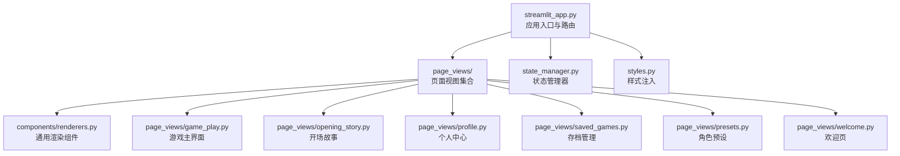
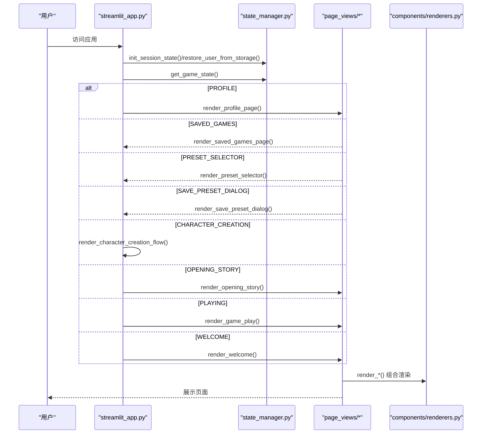
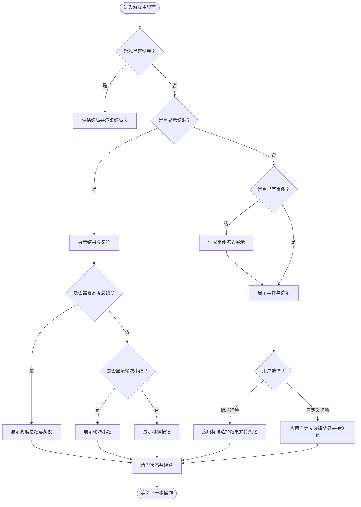
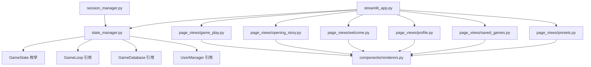

# UI界面模块

<cite>
**本文档引用的文件**
- [src/ui/streamlit_app.py](file://src/ui/streamlit_app.py)
- [src/ui/state_manager.py](file://src/ui/state_manager.py)
- [src/ui/session_manager.py](file://src/ui/session_manager.py)
- [src/ui/styles.py](file://src/ui/styles.py)
- [src/ui/page_views/__init__.py](file://src/ui/page_views/__init__.py)
- [src/ui/page_views/game_play.py](file://src/ui/page_views/game_play.py)
- [src/ui/page_views/opening_story.py](file://src/ui/page_views/opening_story.py)
- [src/ui/page_views/profile.py](file://src/ui/page_views/profile.py)
- [src/ui/page_views/saved_games.py](file://src/ui/page_views/saved_games.py)
- [src/ui/page_views/presets.py](file://src/ui/page_views/presets.py)
- [src/ui/page_views/welcome.py](file://src/ui/page_views/welcome.py)
- [src/ui/components/__init__.py](file://src/ui/components/__init__.py)
- [src/ui/components/renderers.py](file://src/ui/components/renderers.py)
</cite>

## 目录
1. [简介](#简介)
2. [项目结构](#项目结构)
3. [核心组件](#核心组件)
4. [架构总览](#架构总览)
5. [详细组件分析](#详细组件分析)
6. [依赖关系分析](#依赖关系分析)
7. [性能考虑](#性能考虑)
8. [故障排查指南](#故障排查指南)
9. [结论](#结论)

## 简介
本文件面向UI界面模块，系统性阐述基于Streamlit的应用架构、状态管理器、会话管理器与页面视图组件的实现细节。内容涵盖页面路由机制、组件复用设计、响应式布局与用户交互处理，并提供具体代码路径示例，帮助开发者快速理解与扩展UI功能。

## 项目结构
UI模块采用分层与按功能划分相结合的组织方式：
- 应用入口与路由：streamlit_app.py
- 状态与会话管理：state_manager.py、session_manager.py
- 页面视图：page_views/*（欢迎页、角色预设、开场故事、游戏主界面、个人中心、存档管理等）
- 组件渲染：components/*（事件渲染、选项渲染、结果渲染、调试控制台、故事调整器等）
- 样式与主题：styles.py

图表来源
- [src/ui/streamlit_app.py](file://src/ui/streamlit_app.py#L139-L211)
- [src/ui/page_views/__init__.py](file://src/ui/page_views/__init__.py#L1-L20)
- [src/ui/components/renderers.py](file://src/ui/components/renderers.py#L1-L385)

章节来源
- [src/ui/streamlit_app.py](file://src/ui/streamlit_app.py#L1-L215)
- [src/ui/page_views/__init__.py](file://src/ui/page_views/__init__.py#L1-L20)

## 核心组件
- 应用入口与路由：负责初始化数据库、注入样式、恢复用户与游戏状态、根据状态机路由到不同页面视图。
- 状态管理器：统一管理会话状态、事件状态、用户状态、UI标志位、调试日志等，提供类型安全的访问接口与持久化能力。
- 会话管理器：向后兼容的包装器，委托给状态管理器实现。
- 页面视图：以函数形式渲染各页面，遵循“先判断是否命中当前页面，再进行渲染”的短路模式。
- 渲染组件：封装事件、选项、结果、上下文聊天、调试控制台等通用UI部件，支持复用与扩展。
- 样式系统：集中注入CSS，覆盖默认样式、按钮、输入框、侧边栏、动画与响应式布局。

章节来源
- [src/ui/streamlit_app.py](file://src/ui/streamlit_app.py#L139-L211)
- [src/ui/state_manager.py](file://src/ui/state_manager.py#L29-L547)
- [src/ui/session_manager.py](file://src/ui/session_manager.py#L31-L65)
- [src/ui/components/renderers.py](file://src/ui/components/renderers.py#L1-L385)
- [src/ui/styles.py](file://src/ui/styles.py#L5-L710)

## 架构总览
UI采用“状态机驱动的路由”模式：通过状态管理器维护全局状态，应用入口根据状态值调用对应的页面渲染函数；页面内部再组合渲染组件，形成完整的用户界面。

图表来源
- [src/ui/streamlit_app.py](file://src/ui/streamlit_app.py#L139-L211)
- [src/ui/state_manager.py](file://src/ui/state_manager.py#L215-L244)
- [src/ui/page_views/profile.py](file://src/ui/page_views/profile.py#L10-L31)
- [src/ui/page_views/saved_games.py](file://src/ui/page_views/saved_games.py#L12-L51)
- [src/ui/page_views/presets.py](file://src/ui/page_views/presets.py#L15-L42)
- [src/ui/page_views/opening_story.py](file://src/ui/page_views/opening_story.py#L11-L120)
- [src/ui/page_views/game_play.py](file://src/ui/page_views/game_play.py#L18-L67)
- [src/ui/page_views/welcome.py](file://src/ui/page_views/welcome.py#L11-L37)
- [src/ui/components/renderers.py](file://src/ui/components/renderers.py#L64-L144)

## 详细组件分析

### 应用入口与路由（streamlit_app.py）
- 初始化与环境准备：设置页面配置、注入样式、初始化数据库、加载密钥。
- 用户与游戏状态恢复：从URL参数与localStorage恢复用户与游戏状态，支持断线重连。
- 状态机路由：按优先级判断当前页面，依次尝试个人中心、存档页、预设选择、保存预设对话框、角色创建、开场故事、游戏主界面、欢迎页。
- 角色创建流程：先收集玩家姓名与人生愿景，再进入角色创建步骤，完成后提供保存预设或直接开始游戏选项。

章节来源
- [src/ui/streamlit_app.py](file://src/ui/streamlit_app.py#L1-L215)

### 状态管理器（state_manager.py）
- 状态枚举：GameState统一管理UI状态，包括欢迎、角色选项、角色创建、预设选择、保存预设、开场故事、进行中、结束、个人中心。
- 类型安全访问：通过属性访问器与setter管理各类状态，确保单一真相源（如current_event由game_loop提供）。
- 初始化与清理：按类别初始化核心状态、事件状态、角色创建状态、多回合状态、用户状态、UI标志与调试状态；提供清理用户会话数据与游戏状态的方法。
- 用户与游戏持久化：提供保存/恢复用户与游戏状态到URL参数与localStorage的能力，支持跨会话恢复。
- 事件与结果管理：统一current_event与current_story_text的读写，保证与game_loop同步；提供show_result、last_result、processing等结果展示状态。

章节来源
- [src/ui/state_manager.py](file://src/ui/state_manager.py#L29-L547)
- [src/ui/state_manager.py](file://src/ui/state_manager.py#L549-L773)

### 会话管理器（session_manager.py）
- 向后兼容：重新导出state_manager中的符号，保持现有导入不变。
- 关键代理方法：init_session_state、get_game_state、set_game_state、get_current_user_id、clear_user_session_data、add_debug_log等。

章节来源
- [src/ui/session_manager.py](file://src/ui/session_manager.py#L1-L65)

### 页面视图组件

#### 欢迎页（page_views/welcome.py）
- 主菜单：新游戏、加载设定、加载存档（登录后显示）、继续游戏（存在进行中游戏时）。
- 角色创建入口：创建新角色或加载已保存设定。
- 登录/注册模态框：内联登录/注册表单，支持切换与注册成功提示。

章节来源
- [src/ui/page_views/welcome.py](file://src/ui/page_views/welcome.py#L11-L285)

#### 个人中心（page_views/profile.py）
- 登录后视图：显示用户信息、退出登录、好友系统（添加、列表、请求处理）。
- 未登录视图：登录/注册切换、表单提交与注册成功提示。

章节来源
- [src/ui/page_views/profile.py](file://src/ui/page_views/profile.py#L10-L184)

#### 存档管理（page_views/saved_games.py）
- 列表渲染：展示最近存档，格式化更新时间，支持加载与删除。
- 加载逻辑：从数据库加载状态，初始化game_loop并恢复事件与故事文本，清理中间状态，跳转至PLAYING。
- 删除逻辑：二次确认，防止误删。

章节来源
- [src/ui/page_views/saved_games.py](file://src/ui/page_views/saved_games.py#L12-L180)

#### 角色预设（page_views/presets.py）
- 预设选择：列出用户保存的角色设定，支持加载与删除。
- 加载流程：加载预设数据，若设定完整则直接开始游戏；否则进入角色创建流程补齐缺失设置。
- 保存预设对话框：支持仅保存或保存并开始游戏两种操作，保存后可继续游戏或回到欢迎页。

章节来源
- [src/ui/page_views/presets.py](file://src/ui/page_views/presets.py#L15-L425)

#### 开场故事（page_views/opening_story.py）
- 流式渲染：使用占位符逐步展示生成的故事文本。
- 缓存与回放：生成后缓存至session_state，后续直接展示。
- 状态迁移：点击按钮后进入PLAYING状态，并持久化游戏状态。

章节来源
- [src/ui/page_views/opening_story.py](file://src/ui/page_views/opening_story.py#L11-L120)

#### 游戏主界面（page_views/game_play.py）
- 控制栏：保存进度、返回主菜单。
- 事件与选项：根据是否已有事件决定生成新事件或展示已有事件与选项。
- 选择处理：支持标准选项与自定义选项；流式展示故事续写；应用结果并持久化。
- 结果与总结：展示决策结果与影响；支持周度/轮次总结；支持生成年度总结。
- 结束判定：当game_loop.is_game_over()为真时，评估结局并提供新游戏按钮。

图表来源
- [src/ui/page_views/game_play.py](file://src/ui/page_views/game_play.py#L18-L662)

章节来源
- [src/ui/page_views/game_play.py](file://src/ui/page_views/game_play.py#L18-L662)

### 渲染组件（components/renderers.py）
- 状态面板：sidebar中展示年龄、周数、精力、情绪、学识、财富与关系亲密度。
- 事件与选项：返回事件选项列表；渲染选项按钮与自定义输入框，支持返回索引或-1表示自定义选项。
- 结果展示：渲染决策结果文本与影响描述（含人类可读的效果说明）。
- 上下文聊天：记录历史、发送消息、调用AI生成回复；支持清空。
- 调试控制台：展示与清理调试日志。

章节来源
- [src/ui/components/renderers.py](file://src/ui/components/renderers.py#L22-L385)

### 样式系统（styles.py）
- 全局样式：隐藏默认头部与浮动输入、设置深色背景与渐变纹理、统一文字颜色。
- 组件样式：按钮、输入框、下拉菜单、标签页、展开器、指标、表格、JSON、滑块、日期时间输入等。
- 动画与过渡：淡入、脉冲、滑入等动画类。
- 响应式设计：针对移动端的容器与间距调整。

章节来源
- [src/ui/styles.py](file://src/ui/styles.py#L5-L710)

## 依赖关系分析

图表来源
- [src/ui/state_manager.py](file://src/ui/state_manager.py#L29-L547)
- [src/ui/session_manager.py](file://src/ui/session_manager.py#L10-L20)
- [src/ui/streamlit_app.py](file://src/ui/streamlit_app.py#L8-L19)
- [src/ui/page_views/game_play.py](file://src/ui/page_views/game_play.py#L8-L13)
- [src/ui/components/renderers.py](file://src/ui/components/renderers.py#L1-L8)

章节来源
- [src/ui/state_manager.py](file://src/ui/state_manager.py#L29-L547)
- [src/ui/session_manager.py](file://src/ui/session_manager.py#L10-L20)
- [src/ui/streamlit_app.py](file://src/ui/streamlit_app.py#L8-L19)

## 性能考虑
- 流式渲染：事件生成与故事续写采用流式回调，逐步更新UI，避免长时间阻塞。
- 状态缓存：开场故事与事件文本缓存于session_state，减少重复生成开销。
- 防重复生成：通过processing标志与备份事件，避免脚本中断导致的重复事件生成。
- 持久化策略：在关键节点（事件生成、选择处理、周推进）保存状态，降低会话中断风险。
- UI更新粒度：使用st.empty()与占位符进行局部更新，减少全量重绘。

## 故障排查指南
- API配置错误：事件生成失败时，检查OPENAI_API_KEY等环境变量配置。
- 会话恢复异常：确认URL参数与localStorage中的user_id、game_id、game_state是否匹配。
- 选择处理卡死：检查processing标志与_choice_backup_event备份是否正确清理。
- 登录/注册问题：查看模态框内的错误提示与日志输出。

章节来源
- [src/ui/page_views/game_play.py](file://src/ui/page_views/game_play.py#L369-L381)
- [src/ui/state_manager.py](file://src/ui/state_manager.py#L662-L773)
- [src/ui/page_views/opening_story.py](file://src/ui/page_views/opening_story.py#L78-L104)
- [src/ui/page_views/profile.py](file://src/ui/page_views/profile.py#L145-L184)

## 结论
UI界面模块通过状态机驱动的路由、类型安全的状态管理、组件化的渲染体系与完善的样式系统，实现了高内聚、低耦合的用户体验。其流式渲染与持久化策略有效提升了交互流畅度与可靠性。建议在扩展新页面或组件时，遵循现有模式：集中状态管理、短路路由、组件复用与最小化副作用，以保持架构一致性与可维护性。