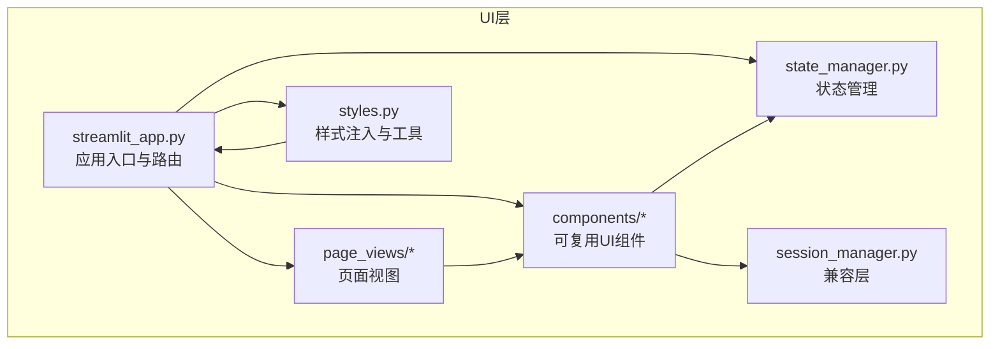
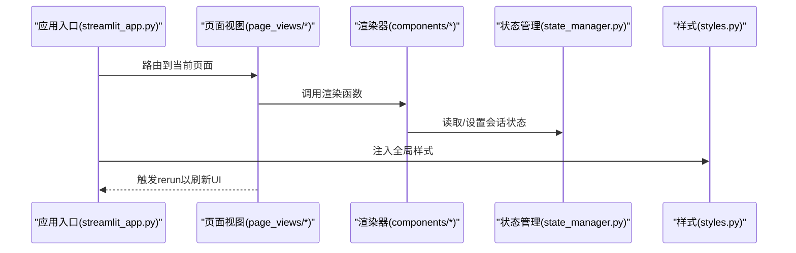
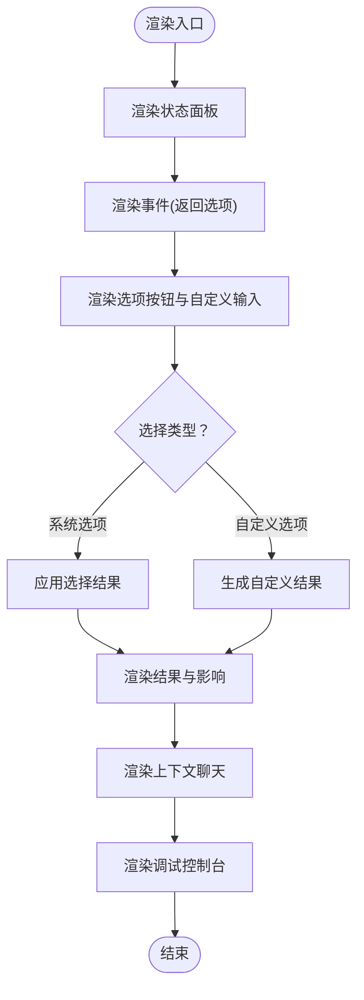
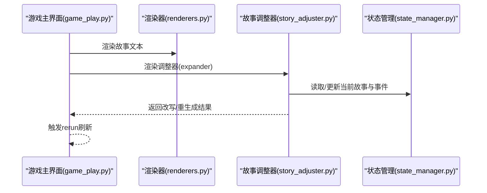
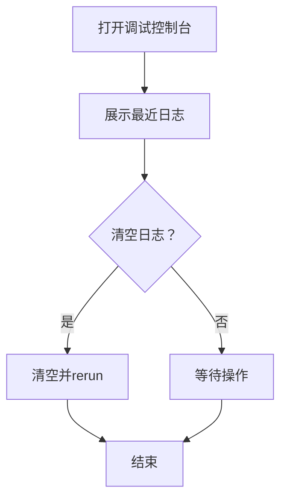
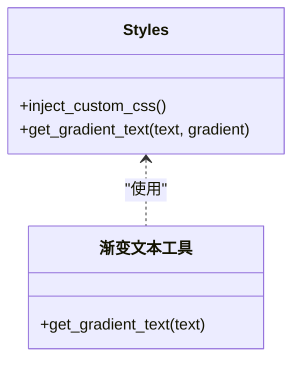
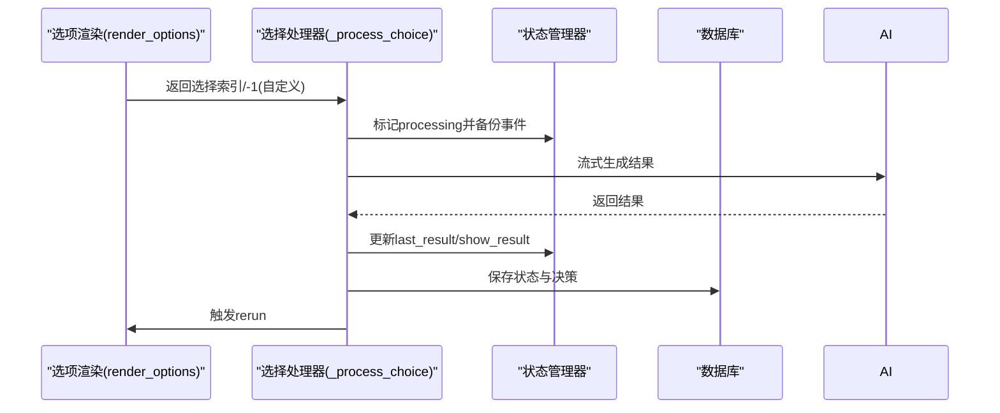
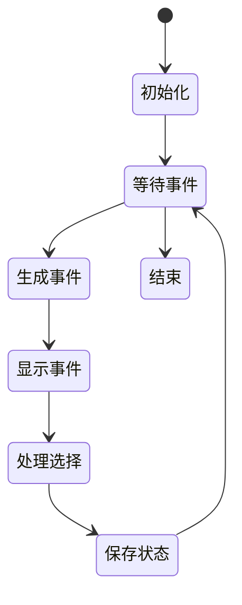
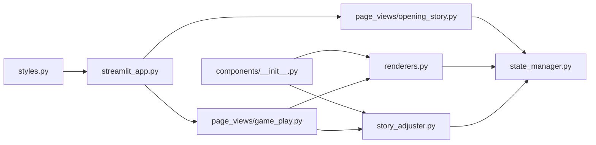

# UI组件库

<cite>
**本文引用的文件**
- [src/ui/components/__init__.py](file://src/ui/components/__init__.py)
- [src/ui/components/renderers.py](file://src/ui/components/renderers.py)
- [src/ui/components/story_adjuster.py](file://src/ui/components/story_adjuster.py)
- [src/ui/streamlit_app.py](file://src/ui/streamlit_app.py)
- [src/ui/styles.py](file://src/ui/styles.py)
- [src/ui/state_manager.py](file://src/ui/state_manager.py)
- [src/ui/session_manager.py](file://src/ui/session_manager.py)
- [src/ui/page_views/game_play.py](file://src/ui/page_views/game_play.py)
- [src/ui/page_views/opening_story.py](file://src/ui/page_views/opening_story.py)
- [src/game/state.py](file://src/game/state.py)
- [tests/test_ui_modules.py](file://tests/test_ui_modules.py)
- [tests/test_ui_functional.py](file://tests/test_ui_functional.py)
- [README.md](file://README.md)
</cite>

## 目录
1. [简介](#简介)
2. [项目结构](#项目结构)
3. [核心组件](#核心组件)
4. [架构总览](#架构总览)
5. [组件详解](#组件详解)
6. [依赖关系分析](#依赖关系分析)
7. [性能考量](#性能考量)
8. [故障排查指南](#故障排查指南)
9. [结论](#结论)
10. [附录](#附录)

## 简介
本文件面向UI组件库，系统性阐述可复用UI组件的设计、渲染器实现与“故事调整器”组件的功能。内容覆盖通用渲染组件、故事文本组件、调试控制台与自定义组件的实现细节，并提供组件生命周期管理、状态传递与性能优化策略。文档同时给出组件间通信与自定义样式的最佳实践，帮助开发者快速创建、使用与扩展UI组件。

## 项目结构
UI组件库位于src/ui目录，采用按功能分层组织：
- components：可复用UI组件（渲染器与故事调整器）
- page_views：页面级视图（游戏主界面、开场故事等）
- services：业务服务（游戏初始化等）
- state_manager与session_manager：统一的状态管理与持久化
- styles：全局样式注入与渐变文本工具
- streamlit_app：应用入口与路由

图表来源
- [src/ui/streamlit_app.py](file://src/ui/streamlit_app.py#L1-L215)
- [src/ui/page_views/game_play.py](file://src/ui/page_views/game_play.py#L1-L662)
- [src/ui/components/renderers.py](file://src/ui/components/renderers.py#L1-L385)
- [src/ui/components/story_adjuster.py](file://src/ui/components/story_adjuster.py#L1-L160)
- [src/ui/styles.py](file://src/ui/styles.py#L1-L710)
- [src/ui/state_manager.py](file://src/ui/state_manager.py#L1-L773)
- [src/ui/session_manager.py](file://src/ui/session_manager.py#L1-L65)

章节来源
- [README.md](file://README.md#L61-L73)
- [src/ui/streamlit_app.py](file://src/ui/streamlit_app.py#L1-L215)

## 核心组件
- 渲染器集合：状态面板、事件渲染、选项按钮、结果展示、上下文聊天、调试控制台
- 故事调整器：局部改写与整段重生成
- 样式系统：全局CSS注入、渐变文本工具
- 状态管理：集中式SessionStateManager，统一事件与结果状态、调试日志、用户与游戏持久化

章节来源
- [src/ui/components/__init__.py](file://src/ui/components/__init__.py#L1-L23)
- [src/ui/components/renderers.py](file://src/ui/components/renderers.py#L1-L385)
- [src/ui/components/story_adjuster.py](file://src/ui/components/story_adjuster.py#L1-L160)
- [src/ui/styles.py](file://src/ui/styles.py#L1-L710)
- [src/ui/state_manager.py](file://src/ui/state_manager.py#L1-L773)

## 架构总览
UI组件库围绕“状态中心化 + 页面视图 + 可复用渲染器”的架构设计：
- 应用入口负责路由与页面渲染
- 页面视图组合渲染器与故事调整器
- 渲染器与故事调整器通过状态管理器访问/更新会话状态
- 样式系统统一注入全局样式

图表来源
- [src/ui/streamlit_app.py](file://src/ui/streamlit_app.py#L139-L215)
- [src/ui/page_views/game_play.py](file://src/ui/page_views/game_play.py#L18-L67)
- [src/ui/components/renderers.py](file://src/ui/components/renderers.py#L22-L171)
- [src/ui/state_manager.py](file://src/ui/state_manager.py#L176-L332)
- [src/ui/styles.py](file://src/ui/styles.py#L5-L704)

## 组件详解

### 通用渲染组件
- 状态面板：根据语言与角色设定渲染年龄、周数、资源与关系
- 事件渲染：返回事件选项列表
- 选项渲染：渲染选项按钮与自定义输入，返回选择索引或自定义标记
- 结果渲染：展示决策结果与影响描述
- 上下文聊天：展示历史与输入，调用AI生成回复
- 调试控制台：展示与清理调试日志

图表来源
- [src/ui/components/renderers.py](file://src/ui/components/renderers.py#L22-L171)
- [src/ui/components/renderers.py](file://src/ui/components/renderers.py#L173-L274)
- [src/ui/components/renderers.py](file://src/ui/components/renderers.py#L277-L385)

章节来源
- [src/ui/components/renderers.py](file://src/ui/components/renderers.py#L22-L171)
- [src/ui/components/renderers.py](file://src/ui/components/renderers.py#L173-L274)
- [src/ui/components/renderers.py](file://src/ui/components/renderers.py#L277-L385)

### 故事文本组件
- 渲染当前周/轮次的故事文本
- 提供“人生调整器”扩展区，支持局部改写与整段重生成
- 支持流式续写与数据库持久化

图表来源
- [src/ui/page_views/game_play.py](file://src/ui/page_views/game_play.py#L383-L406)
- [src/ui/components/story_adjuster.py](file://src/ui/components/story_adjuster.py#L10-L39)
- [src/ui/components/story_adjuster.py](file://src/ui/components/story_adjuster.py#L41-L102)
- [src/ui/components/story_adjuster.py](file://src/ui/components/story_adjuster.py#L104-L160)
- [src/ui/state_manager.py](file://src/ui/state_manager.py#L245-L300)

章节来源
- [src/ui/page_views/game_play.py](file://src/ui/page_views/game_play.py#L383-L406)
- [src/ui/components/story_adjuster.py](file://src/ui/components/story_adjuster.py#L10-L160)

### 调试控制台
- 在侧边栏展开调试控制台
- 展示最新日志，支持清空
- 日志上限维护与类型化记录

图表来源
- [src/ui/components/renderers.py](file://src/ui/components/renderers.py#L277-L289)
- [src/ui/state_manager.py](file://src/ui/state_manager.py#L488-L509)

章节来源
- [src/ui/components/renderers.py](file://src/ui/components/renderers.py#L277-L289)
- [src/ui/state_manager.py](file://src/ui/state_manager.py#L488-L509)

### 自定义组件与样式
- 全局样式注入：深色主题、按钮、输入框、侧边栏、进度条、动画等
- 渐变文本工具：生成带渐变色的标题/强调文本
- 页面级样式：隐藏默认元素、卡片、动画等

图表来源
- [src/ui/styles.py](file://src/ui/styles.py#L5-L704)
- [src/ui/styles.py](file://src/ui/styles.py#L707-L710)

章节来源
- [src/ui/styles.py](file://src/ui/styles.py#L5-L704)
- [src/ui/styles.py](file://src/ui/styles.py#L707-L710)

### 组件间通信与事件处理
- 选项渲染返回选择索引；自定义选项返回特殊标记
- 选择处理通过状态管理器同步事件与结果，触发数据库保存与rerun
- 多轮系统支持周内多轮选择与周总结

图表来源
- [src/ui/components/renderers.py](file://src/ui/components/renderers.py#L79-L143)
- [src/ui/page_views/game_play.py](file://src/ui/page_views/game_play.py#L468-L550)
- [src/ui/page_views/game_play.py](file://src/ui/page_views/game_play.py#L552-L588)

章节来源
- [src/ui/components/renderers.py](file://src/ui/components/renderers.py#L79-L143)
- [src/ui/page_views/game_play.py](file://src/ui/page_views/game_play.py#L468-L550)
- [src/ui/page_views/game_play.py](file://src/ui/page_views/game_play.py#L552-L588)

### 生命周期管理与状态传递
- 初始化：统一初始化核心、事件、角色、多轮、用户、UI标志与调试状态
- 事件状态：current_event与current_story_text统一由状态管理器与GameLoop协调
- 处理状态：processing标志防止重复生成与竞态
- 用户与游戏持久化：URL参数与localStorage双通道保存/恢复

图表来源
- [src/ui/state_manager.py](file://src/ui/state_manager.py#L67-L76)
- [src/ui/state_manager.py](file://src/ui/state_manager.py#L245-L290)
- [src/ui/state_manager.py](file://src/ui/state_manager.py#L488-L509)
- [src/ui/state_manager.py](file://src/ui/state_manager.py#L662-L773)

章节来源
- [src/ui/state_manager.py](file://src/ui/state_manager.py#L67-L76)
- [src/ui/state_manager.py](file://src/ui/state_manager.py#L245-L290)
- [src/ui/state_manager.py](file://src/ui/state_manager.py#L488-L509)
- [src/ui/state_manager.py](file://src/ui/state_manager.py#L662-L773)

## 依赖关系分析
- 组件导出：components/__init__.py统一导出渲染器与故事调整器
- 页面依赖：game_play依赖渲染器与故事调整器；opening_story依赖状态管理器
- 状态依赖：渲染器与故事调整器均依赖状态管理器与样式工具
- 样式依赖：全局样式注入在应用入口执行

图表来源
- [src/ui/components/__init__.py](file://src/ui/components/__init__.py#L1-L23)
- [src/ui/components/renderers.py](file://src/ui/components/renderers.py#L1-L10)
- [src/ui/components/story_adjuster.py](file://src/ui/components/story_adjuster.py#L1-L7)
- [src/ui/page_views/game_play.py](file://src/ui/page_views/game_play.py#L1-L16)
- [src/ui/page_views/opening_story.py](file://src/ui/page_views/opening_story.py#L1-L12)
- [src/ui/state_manager.py](file://src/ui/state_manager.py#L1-L27)
- [src/ui/styles.py](file://src/ui/styles.py#L1-L7)
- [src/ui/streamlit_app.py](file://src/ui/streamlit_app.py#L1-L20)

章节来源
- [src/ui/components/__init__.py](file://src/ui/components/__init__.py#L1-L23)
- [src/ui/page_views/game_play.py](file://src/ui/page_views/game_play.py#L1-L16)
- [src/ui/page_views/opening_story.py](file://src/ui/page_views/opening_story.py#L1-L12)
- [src/ui/state_manager.py](file://src/ui/state_manager.py#L1-L27)
- [src/ui/styles.py](file://src/ui/styles.py#L1-L7)
- [src/ui/streamlit_app.py](file://src/ui/streamlit_app.py#L1-L20)

## 性能考量
- 流式渲染：事件与结果采用流式回调逐步展示，减少一次性渲染压力
- 会话状态缓存：current_event与current_story_text在会话中缓存，避免重复生成
- 处理状态保护：processing标志防止并发生成与重复事件
- 样式注入：全局样式一次性注入，避免重复计算
- 日志上限：调试日志最多保留100条，避免内存膨胀

章节来源
- [src/ui/page_views/game_play.py](file://src/ui/page_views/game_play.py#L332-L381)
- [src/ui/components/renderers.py](file://src/ui/components/renderers.py#L332-L381)
- [src/ui/state_manager.py](file://src/ui/state_manager.py#L495-L509)

## 故障排查指南
- 事件生成失败：查看错误日志与提示，检查API密钥与网络配置
- 选择处理异常：查看备份事件恢复逻辑，确认processing标志被正确清理
- 调试日志过多：使用清空按钮清理日志，或检查日志上限策略
- 会话恢复问题：检查URL参数与localStorage保存/恢复逻辑

章节来源
- [src/ui/page_views/game_play.py](file://src/ui/page_views/game_play.py#L369-L381)
- [src/ui/page_views/game_play.py](file://src/ui/page_views/game_play.py#L532-L548)
- [src/ui/components/renderers.py](file://src/ui/components/renderers.py#L277-L289)
- [src/ui/state_manager.py](file://src/ui/state_manager.py#L662-L773)

## 结论
UI组件库通过集中式状态管理、模块化的渲染器与故事调整器，以及完善的样式系统，实现了高可复用、易扩展的UI架构。组件间通过状态管理器进行解耦通信，结合流式渲染与会话缓存，兼顾了用户体验与性能表现。建议在新增组件时遵循现有模式：统一状态入口、最小化副作用、合理使用流式渲染与调试日志。

## 附录

### 如何创建与使用UI组件
- 创建渲染器：在renderers.py中新增函数，接收必要参数（如语言、状态对象），返回HTML片段或Streamlit组件
- 使用状态管理：通过get_state_manager()获取SessionStateManager实例，读取/设置会话状态
- 注入样式：在styles.py中添加CSS规则，或使用get_gradient_text生成渐变文本
- 页面集成：在page_views中调用渲染器，处理返回的选择并更新状态

章节来源
- [src/ui/components/renderers.py](file://src/ui/components/renderers.py#L22-L171)
- [src/ui/state_manager.py](file://src/ui/state_manager.py#L541-L547)
- [src/ui/styles.py](file://src/ui/styles.py#L5-L704)

### 组件事件与组件间通信
- 选项渲染返回选择索引或自定义标记
- 选择处理器同步事件与结果，保存至数据库并触发rerun
- 多轮系统通过current_round与rounds_per_week控制周内轮次

章节来源
- [src/ui/components/renderers.py](file://src/ui/components/renderers.py#L79-L143)
- [src/ui/page_views/game_play.py](file://src/ui/page_views/game_play.py#L468-L550)
- [src/game/state.py](file://src/game/state.py#L282-L288)

### 自定义组件样式
- 全局样式：在styles.py中添加CSS规则，确保深色主题与一致性
- 渐变文本：使用get_gradient_text生成强调文本
- 页面级样式：在页面渲染前注入隐藏默认元素与卡片样式

章节来源
- [src/ui/styles.py](file://src/ui/styles.py#L5-L704)
- [src/ui/styles.py](file://src/ui/styles.py#L707-L710)
- [src/ui/page_views/opening_story.py](file://src/ui/page_views/opening_story.py#L22-L28)