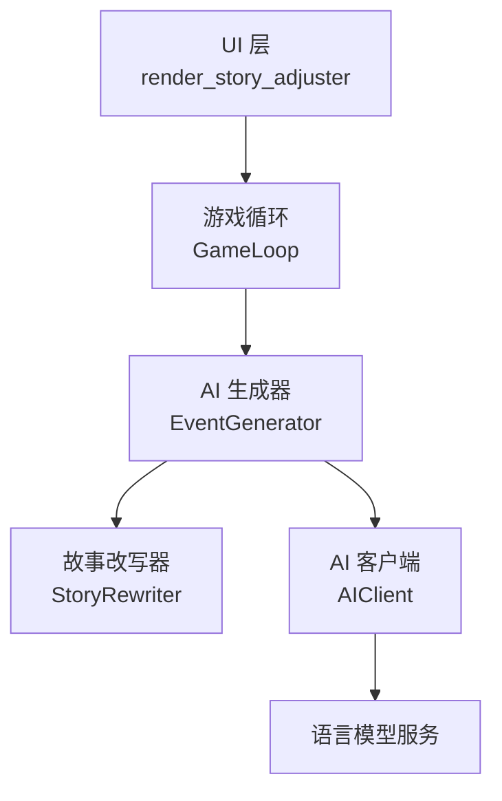
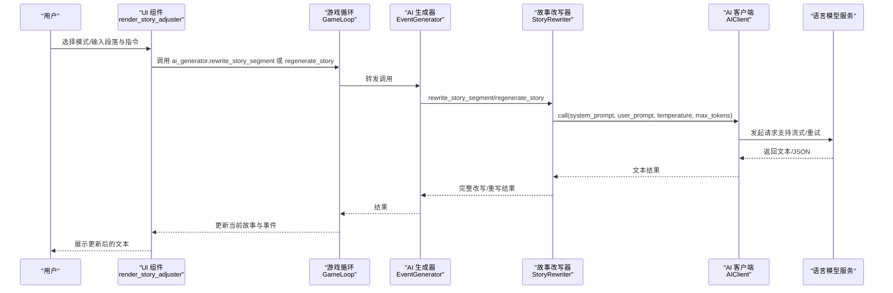
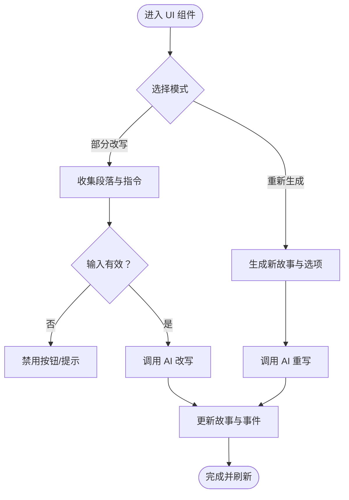
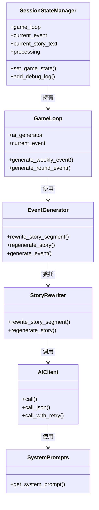

# 故事调整器组件

<cite>
**本文引用的文件**
- [story_adjuster.py](file://src/ui/components/story_adjuster.py)
- [game_play.py](file://src/ui/page_views/game_play.py)
- [game_loop.py](file://src/game/game_loop.py)
- [generator.py](file://src/ai/generator.py)
- [story_rewriter.py](file://src/ai/story_rewriter.py)
- [system_prompts.py](file://src/ai/system_prompts.py)
- [client.py](file://src/ai/client.py)
- [prompts.py](file://config/prompts.py)
- [state_manager.py](file://src/ui/state_manager.py)
</cite>

## 目录
1. [简介](#简介)
2. [项目结构](#项目结构)
3. [核心组件](#核心组件)
4. [架构总览](#架构总览)
5. [详细组件分析](#详细组件分析)
6. [依赖关系分析](#依赖关系分析)
7. [性能考量](#性能考量)
8. [故障排查指南](#故障排查指南)
9. [结论](#结论)

## 简介
本技术文档聚焦于“故事调整器”组件，旨在全面解释其设计目的、调整逻辑与用户交互机制。故事调整器允许玩家对当前周/轮次的故事进行局部改写或整段重写，从而优化叙事体验、提升个性化表达与沉浸感。组件覆盖文本编辑、格式调整、内容优化等能力，并与AI生成系统深度集成，提供智能改写与再生成服务。文档还包含用户输入处理、智能调整算法思路、与AI系统的集成方式、性能优化与用户体验策略等内容，帮助开发者与使用者高效理解与使用该功能。

## 项目结构
故事调整器位于UI层，作为“人生调整器”的交互入口，调用游戏循环中的AI生成器完成改写或重写操作。其核心调用链如下：
- UI层：渲染“人生调整器”面板，收集用户输入（改写模式、段落、指令）
- 游戏循环：封装AI生成器，负责上下文拼装与调用
- AI生成器：统一调度各子服务（故事改写、故事再生等）
- 语言模型客户端：统一发起请求、处理流式输出与重试

图表来源
- [story_adjuster.py](file://src/ui/components/story_adjuster.py#L10-L160)
- [game_loop.py](file://src/game/game_loop.py#L24-L61)
- [generator.py](file://src/ai/generator.py#L30-L66)
- [story_rewriter.py](file://src/ai/story_rewriter.py#L16-L21)
- [client.py](file://src/ai/client.py#L22-L48)

章节来源
- [story_adjuster.py](file://src/ui/components/story_adjuster.py#L10-L160)
- [game_play.py](file://src/ui/page_views/game_play.py#L383-L406)
- [game_loop.py](file://src/game/game_loop.py#L24-L61)

## 核心组件
- UI组件：负责渲染“人生调整器”界面，收集用户输入并触发改写/重写流程
- 游戏循环：封装AI生成器，负责上下文拼装（如最近轮次摘要、角色设定等）
- AI生成器：统一调度StoryRewriter等子服务，提供rewrite_story_segment与regenerate_story接口
- 故事改写器：构造改写提示词，调用AIClient完成改写
- AI客户端：统一发起请求、支持流式输出与重试
- 系统提示注册表：集中管理各类系统提示词，保证一致性与缓存友好
- 会话状态管理：统一管理UI状态、事件与故事文本，保障一致性

章节来源
- [story_adjuster.py](file://src/ui/components/story_adjuster.py#L10-L160)
- [generator.py](file://src/ai/generator.py#L30-L66)
- [story_rewriter.py](file://src/ai/story_rewriter.py#L16-L21)
- [system_prompts.py](file://src/ai/system_prompts.py#L196-L226)
- [client.py](file://src/ai/client.py#L22-L48)
- [state_manager.py](file://src/ui/state_manager.py#L42-L53)

## 架构总览
故事调整器的调用序列如下：

图表来源
- [story_adjuster.py](file://src/ui/components/story_adjuster.py#L41-L102)
- [story_adjuster.py](file://src/ui/components/story_adjuster.py#L104-L160)
- [game_loop.py](file://src/game/game_loop.py#L24-L61)
- [generator.py](file://src/ai/generator.py#L369-L409)
- [story_rewriter.py](file://src/ai/story_rewriter.py#L24-L117)
- [client.py](file://src/ai/client.py#L51-L104)

## 详细组件分析

### UI组件：故事调整器
- 功能定位：提供“部分改写”和“重新生成本轮故事”两种模式
- 用户交互：
  - 部分改写：用户粘贴需要改写的段落，输入改写说明，点击“开始改写”
  - 重新生成：一键重新生成当前轮次的完整故事，并生成新的选项
- 状态管理：
  - 使用会话状态标记“rewrite_processing”，防止重复提交
  - 收集最近5轮摘要作为故事上下文，提升一致性
  - 成功后更新当前故事文本与事件对象，触发页面刷新

图表来源
- [story_adjuster.py](file://src/ui/components/story_adjuster.py#L25-L102)
- [story_adjuster.py](file://src/ui/components/story_adjuster.py#L104-L160)

章节来源
- [story_adjuster.py](file://src/ui/components/story_adjuster.py#L10-L160)
- [state_manager.py](file://src/ui/state_manager.py#L245-L300)

### 游戏循环与AI生成器
- 游戏循环封装AI生成器，负责：
  - 从玩家状态中提取最近轮次摘要，作为故事上下文
  - 将角色设定、时间信息、剧情线、世界模型等注入提示词
  - 调用AI生成器执行改写或重写
- AI生成器：
  - 提供rewrite_story_segment与regenerate_story两个对外接口
  - 内部委托StoryRewriter完成具体任务
  - 支持温度、最大token数、流式回调等参数

章节来源
- [game_loop.py](file://src/game/game_loop.py#L24-L61)
- [generator.py](file://src/ai/generator.py#L369-L409)

### 故事改写器与系统提示
- 故事改写器：
  - 针对“部分改写”：接收完整故事、待替换段落、用户指令、角色设定、故事上下文，返回改写后的完整故事
  - 针对“重新生成”：根据玩家状态、角色设定、故事上下文生成全新故事
  - 使用系统提示注册表获取对应系统提示词，保证一致性
- 系统提示注册表：
  - 集中管理“故事改写器”、“小说家”等系统提示词，支持中英双语
  - 通过键值映射获取对应提示词，便于统一维护与缓存优化

章节来源
- [story_rewriter.py](file://src/ai/story_rewriter.py#L16-L21)
- [story_rewriter.py](file://src/ai/story_rewriter.py#L24-L117)
- [story_rewriter.py](file://src/ai/story_rewriter.py#L118-L201)
- [system_prompts.py](file://src/ai/system_prompts.py#L196-L226)

### AI客户端与错误处理
- AI客户端：
  - 统一发起请求，支持流式输出（逐字回调）与非流式输出
  - 支持重试与错误反馈注入，提升稳定性
- 错误处理：
  - 改写失败时返回原始故事作为回退
  - 重写/重生成异常时捕获并提示用户，同时记录调试日志

章节来源
- [client.py](file://src/ai/client.py#L51-L104)
- [client.py](file://src/ai/client.py#L140-L214)
- [story_rewriter.py](file://src/ai/story_rewriter.py#L113-L117)

### 提示词工程与上下文拼装
- 提示词模板：
  - 针对不同任务（故事改写、故事再生、选项生成等）提供专用模板
  - 支持可用人物列表、时间上下文、剧情线、世界模型约束、逻辑一致性等
- 上下文拼装：
  - 从玩家状态抽取最近轮次摘要、决策历史、角色设定等
  - 在重写/重生时注入先前故事脉络，确保前后一致

章节来源
- [prompts.py](file://config/prompts.py#L1-L800)
- [story_rewriter.py](file://src/ai/story_rewriter.py#L162-L183)

## 依赖关系分析

图表来源
- [state_manager.py](file://src/ui/state_manager.py#L42-L53)
- [game_loop.py](file://src/game/game_loop.py#L24-L61)
- [generator.py](file://src/ai/generator.py#L30-L66)
- [story_rewriter.py](file://src/ai/story_rewriter.py#L16-L21)
- [client.py](file://src/ai/client.py#L22-L48)
- [system_prompts.py](file://src/ai/system_prompts.py#L211-L226)

章节来源
- [state_manager.py](file://src/ui/state_manager.py#L42-L53)
- [game_loop.py](file://src/game/game_loop.py#L24-L61)
- [generator.py](file://src/ai/generator.py#L30-L66)
- [story_rewriter.py](file://src/ai/story_rewriter.py#L16-L21)
- [client.py](file://src/ai/client.py#L22-L48)
- [system_prompts.py](file://src/ai/system_prompts.py#L211-L226)

## 性能考量
- 流式输出：UI层支持流式展示，降低等待时间，提升交互体验
- 重试与错误反馈：AI客户端支持重试并在后续尝试中注入错误原因，减少重复失败
- 上下文裁剪：对历史摘要与上下文进行长度限制，避免超出token上限
- 缓存与回退：改写失败时返回原始故事，避免中断用户流程
- 会话状态保护：通过“rewrite_processing”等标志位防止并发提交

章节来源
- [story_adjuster.py](file://src/ui/components/story_adjuster.py#L70-L101)
- [client.py](file://src/ai/client.py#L140-L214)
- [story_rewriter.py](file://src/ai/story_rewriter.py#L113-L117)

## 故障排查指南
- 常见问题
  - 改写失败：检查API密钥与网络连接；查看调试日志；确认输入是否完整
  - 重写后故事不一致：确认是否正确传入角色设定与故事上下文
  - UI卡顿：检查是否启用流式输出；适当降低max_tokens
- 排查步骤
  - 查看会话状态中的调试日志，定位错误发生阶段
  - 确认AI客户端初始化参数（模型、基础URL、API密钥）
  - 验证系统提示词是否正确加载
- 建议
  - 对于复杂改写，建议先提供清晰的“改写说明”，并限制段落大小
  - 若多次重试仍失败，可尝试简化提示词或调整温度参数

章节来源
- [state_manager.py](file://src/ui/state_manager.py#L495-L509)
- [client.py](file://src/ai/client.py#L25-L48)
- [system_prompts.py](file://src/ai/system_prompts.py#L211-L226)

## 结论
故事调整器通过清晰的UI交互、完善的上下文拼装与稳健的AI调用链路，实现了对故事的局部改写与整段重写。其设计兼顾易用性与一致性，既满足玩家的个性化需求，又通过系统提示与上下文约束保障叙事质量。配合流式输出、重试与回退机制，显著提升了用户体验与系统稳定性。未来可在提示词模板扩展、上下文长度优化与多语言支持方面持续改进。