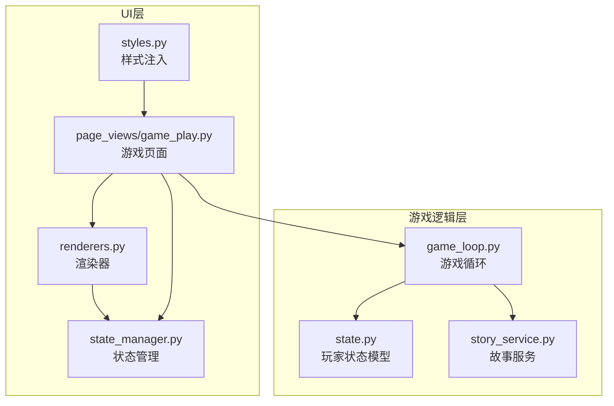
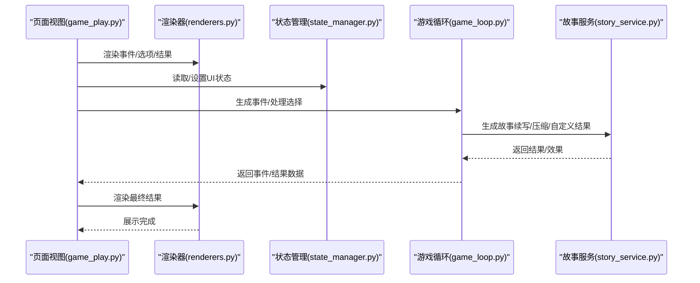
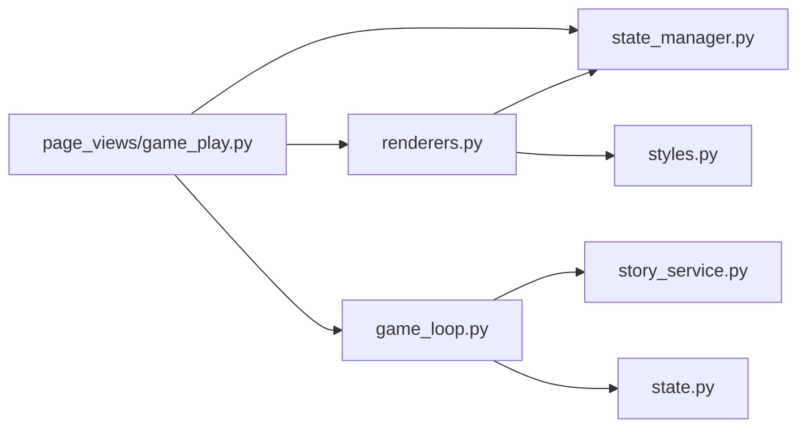

# 渲染器组件

<cite>
**本文引用的文件**
- [src/ui/components/renderers.py](file://src/ui/components/renderers.py)
- [src/ui/state_manager.py](file://src/ui/state_manager.py)
- [src/ui/page_views/game_play.py](file://src/ui/page_views/game_play.py)
- [src/game/game_loop.py](file://src/game/game_loop.py)
- [src/game/state.py](file://src/game/state.py)
- [src/game/story_service.py](file://src/game/story_service.py)
- [src/ui/styles.py](file://src/ui/styles.py)
- [src/ui/session_manager.py](file://src/ui/session_manager.py)
</cite>

## 目录
1. [简介](#简介)
2. [项目结构](#项目结构)
3. [核心组件](#核心组件)
4. [架构总览](#架构总览)
5. [详细组件分析](#详细组件分析)
6. [依赖分析](#依赖分析)
7. [性能考虑](#性能考虑)
8. [故障排查指南](#故障排查指南)
9. [结论](#结论)
10. [附录](#附录)

## 简介
本技术文档聚焦于“渲染器组件”，系统性阐述其设计原理、渲染逻辑与组件复用机制。渲染器组件负责将游戏事件、选项、结果以及调试与上下文聊天等界面内容以统一的UI形态呈现，并与状态管理、AI生成服务、数据库持久化等模块协同工作。文档同时提供使用示例路径、性能优化策略、错误处理机制与UI状态管理集成方式，帮助开发者快速理解与扩展渲染器功能。

## 项目结构
渲染器组件位于UI层，围绕Streamlit构建，主要文件如下：
- 渲染器：src/ui/components/renderers.py
- 状态管理：src/ui/state_manager.py
- 页面视图：src/ui/page_views/game_play.py
- 游戏循环：src/game/game_loop.py
- 玩家状态模型：src/game/state.py
- 故事服务：src/game/story_service.py
- 样式注入：src/ui/styles.py
- 会话兼容层：src/ui/session_manager.py

图表来源
- [src/ui/components/renderers.py](file://src/ui/components/renderers.py#L1-L385)
- [src/ui/state_manager.py](file://src/ui/state_manager.py#L1-L773)
- [src/ui/page_views/game_play.py](file://src/ui/page_views/game_play.py#L1-L662)
- [src/game/game_loop.py](file://src/game/game_loop.py#L1-L200)
- [src/game/state.py](file://src/game/state.py#L244-L403)
- [src/game/story_service.py](file://src/game/story_service.py#L1-L304)
- [src/ui/styles.py](file://src/ui/styles.py#L1-L710)

章节来源
- [src/ui/components/renderers.py](file://src/ui/components/renderers.py#L1-L385)
- [src/ui/state_manager.py](file://src/ui/state_manager.py#L1-L773)
- [src/ui/page_views/game_play.py](file://src/ui/page_views/game_play.py#L1-L662)
- [src/game/game_loop.py](file://src/game/game_loop.py#L1-L200)
- [src/game/state.py](file://src/game/state.py#L244-L403)
- [src/game/story_service.py](file://src/game/story_service.py#L1-L304)
- [src/ui/styles.py](file://src/ui/styles.py#L1-L710)

## 核心组件
- 通用渲染函数
  - 状态面板渲染：render_state_panel
  - 事件渲染：render_event
  - 选项渲染：render_options
  - 结果渲染：render_result
  - 调试控制台：render_debug_console
  - 上下文聊天：render_context_chat
  - 调试日志：add_debug_log
- 事件渲染器
  - 基于事件对象的描述与选项抽取，供页面视图调用
- 故事文本渲染器
  - 将AI生成的事件故事文本以渐进式流式方式展示，支持占位符与最终存储
- 组件复用机制
  - 通过统一的状态管理器SessionStateManager集中管理UI状态，避免分散访问st.session_state
  - 通过页面视图game_play.py协调事件生成、选项展示、结果渲染与后续流程

章节来源
- [src/ui/components/renderers.py](file://src/ui/components/renderers.py#L22-L171)
- [src/ui/page_views/game_play.py](file://src/ui/page_views/game_play.py#L383-L406)
- [src/ui/state_manager.py](file://src/ui/state_manager.py#L42-L538)

## 架构总览
渲染器组件在UI层承担“展示职责”，通过状态管理器与游戏循环交互，结合故事服务生成文本，最终以Streamlit组件呈现。

图表来源
- [src/ui/page_views/game_play.py](file://src/ui/page_views/game_play.py#L383-L550)
- [src/ui/components/renderers.py](file://src/ui/components/renderers.py#L64-L171)
- [src/ui/state_manager.py](file://src/ui/state_manager.py#L176-L332)
- [src/game/game_loop.py](file://src/game/game_loop.py#L154-L200)
- [src/game/story_service.py](file://src/game/story_service.py#L11-L134)

## 详细组件分析

### 通用渲染函数
- render_state_panel
  - 功能：在侧边栏展示玩家状态（年龄、周数、精力、情绪、学识、财富、关系等），支持中英文切换与货币符号动态获取
  - 关键点：从PlayerState读取数据；从character_settings中读取货币符号；遍历关系列表渲染进度条
- render_event
  - 功能：从GameEvent对象中抽取选项列表，供render_options使用
  - 关键点：返回options列表；与页面视图配合决定渲染顺序
- render_options
  - 功能：渲染系统选项按钮与自定义输入框，返回用户选择索引或-1（自定义）
  - 关键点：按键唯一性由状态管理器提供的game_id/week/current_round拼接；禁用处理中状态；自定义输入提交后写入session_state.custom_choice
- render_result
  - 功能：渲染决策结果文本与效果描述
  - 关键点：内部调用_build_effect_descriptions生成人类可读的效果说明；支持中英文
- _build_effect_descriptions
  - 功能：将effects字典映射为自然语言描述
  - 关键点：按能量、情绪、学识、财富、关系分别生成描述；根据数值区间给出不同文案
- render_debug_console
  - 功能：侧边栏调试控制台，展示最近100条日志，支持清空
- render_context_chat
  - 功能：底部展开式聊天，与AI对话助手交互，基于当前角色设定与事件上下文生成回复
  - 关键点：使用state_manager的game_loop.ai_generator调用AI；处理异常与加载提示；支持清空历史

章节来源
- [src/ui/components/renderers.py](file://src/ui/components/renderers.py#L22-L171)
- [src/ui/components/renderers.py](file://src/ui/components/renderers.py#L173-L274)
- [src/ui/components/renderers.py](file://src/ui/components/renderers.py#L277-L385)

### 事件渲染器
- 设计要点
  - 事件描述与选项分离：render_event只负责抽取options，具体展示由render_options完成
  - 与页面视图协作：game_play.py在事件生成后调用render_event与render_options，形成“先事件后选项”的渲染序列
  - 自定义选项：render_options支持用户自定义输入，返回-1并在页面视图中单独处理
- 错误与回退
  - 若事件生成失败，页面视图捕获异常并提示用户检查API配置

章节来源
- [src/ui/components/renderers.py](file://src/ui/components/renderers.py#L64-L90)
- [src/ui/page_views/game_play.py](file://src/ui/page_views/game_play.py#L383-L406)
- [src/ui/page_views/game_play.py](file://src/ui/page_views/game_play.py#L369-L381)

### 故事文本渲染器
- 设计要点
  - 渐进式流式展示：页面视图通过stream_callback将AI生成的片段逐步追加到占位符，提升交互体验
  - 最终存储：事件生成完成后，将完整故事文本存入session_state与PlayerState.current_event_data，确保中断后可恢复
  - 回退策略：若AI生成失败，使用fallback文本保证基本可读性
- 与故事服务协作
  - generate_story_continuation：生成200-400字符的续写
  - generate_fallback_continuation：在失败时生成简单续写
  - compress_story：压缩故事并产出行故事线、世界事实、习惯变更等元数据

章节来源
- [src/ui/page_views/game_play.py](file://src/ui/page_views/game_play.py#L324-L381)
- [src/game/story_service.py](file://src/game/story_service.py#L18-L117)
- [src/game/story_service.py](file://src/game/story_service.py#L118-L134)

### 组件复用机制
- 统一状态入口
  - 通过get_state_manager()获取SessionStateManager单例，集中管理processing、current_event、last_result、show_result、debug_logs等
  - 页面视图与渲染器均通过该管理器读写状态，避免分散访问st.session_state导致的耦合
- 键盘与交互复用
  - render_options使用由状态管理器提供的唯一键前缀，确保同一周/回合的多个选项按键互不冲突
- UI一致性
  - styles.py统一注入CSS，保证按钮、卡片、进度条等组件风格一致

章节来源
- [src/ui/state_manager.py](file://src/ui/state_manager.py#L541-L547)
- [src/ui/components/renderers.py](file://src/ui/components/renderers.py#L98-L143)
- [src/ui/styles.py](file://src/ui/styles.py#L5-L704)

### 渲染器与UI状态管理的集成
- 页面视图驱动渲染
  - render_game_play：主控流程，根据processing、current_event、show_result等状态决定渲染分支
  - _render_event_section：事件生成与流式展示
  - _render_current_event：事件文本展示、故事调整器、选项渲染
  - _process_choice/_process_custom_choice：处理选择并应用结果
- 状态同步
  - 事件生成后，将current_event与current_story_text写入session_state，并持久化到数据库
  - 结果展示后，清理current_event并设置show_result/last_result

章节来源
- [src/ui/page_views/game_play.py](file://src/ui/page_views/game_play.py#L18-L67)
- [src/ui/page_views/game_play.py](file://src/ui/page_views/game_play.py#L276-L381)
- [src/ui/page_views/game_play.py](file://src/ui/page_views/game_play.py#L383-L550)

## 依赖分析
- 渲染器对状态管理器的依赖
  - 读取processing、current_event、last_result、show_result、debug_logs等
  - 写入custom_choice、context_chat_history等
- 渲染器对游戏循环的依赖
  - 通过状态管理器间接访问game_loop，用于AI生成与结果应用
- 渲染器对玩家状态模型的依赖
  - render_state_panel读取PlayerState字段，支持中英文切换与货币符号
- 页面视图对渲染器的依赖
  - 统一导入renderers.py中的渲染函数，形成稳定的API边界

图表来源
- [src/ui/components/renderers.py](file://src/ui/components/renderers.py#L1-L20)
- [src/ui/state_manager.py](file://src/ui/state_manager.py#L1-L76)
- [src/ui/page_views/game_play.py](file://src/ui/page_views/game_play.py#L1-L20)
- [src/game/game_loop.py](file://src/game/game_loop.py#L1-L61)
- [src/game/state.py](file://src/game/state.py#L244-L275)
- [src/game/story_service.py](file://src/game/story_service.py#L1-L20)

章节来源
- [src/ui/components/renderers.py](file://src/ui/components/renderers.py#L1-L20)
- [src/ui/state_manager.py](file://src/ui/state_manager.py#L1-L76)
- [src/ui/page_views/game_play.py](file://src/ui/page_views/game_play.py#L1-L20)
- [src/game/game_loop.py](file://src/game/game_loop.py#L1-L61)

## 性能考虑
- 流式渲染
  - 事件生成与结果续写采用流式回调，逐步追加到UI，减少一次性渲染压力，提升感知性能
- 状态缓存与持久化
  - 事件生成完成后立即持久化到数据库，避免长时间中断导致的重复生成
- UI禁用与节流
  - processing标志位控制按钮禁用，防止重复点击与并发请求
- 日志截断
  - 调试日志最多保留100条，避免内存膨胀

章节来源
- [src/ui/page_views/game_play.py](file://src/ui/page_views/game_play.py#L324-L381)
- [src/ui/components/renderers.py](file://src/ui/components/renderers.py#L17-L19)
- [src/ui/state_manager.py](file://src/ui/state_manager.py#L495-L509)

## 故障排查指南
- 事件生成失败
  - 现象：页面显示错误提示并打印堆栈
  - 排查：检查API密钥配置、网络连通性；查看调试日志
- 选项不可点击
  - 现象：按钮被禁用
  - 排查：确认processing标志位是否仍为True；检查页面视图是否正确重置
- 自定义选项未生效
  - 现象：提交后未返回-1或未触发自定义处理
  - 排查：确认render_options返回-1且页面视图正确读取st.session_state.custom_choice
- 结果未显示
  - 现象：事件结束后未进入结果展示
  - 排查：确认_page_views中show_result与last_result的设置逻辑；检查_apply_choice_result是否被调用

章节来源
- [src/ui/page_views/game_play.py](file://src/ui/page_views/game_play.py#L369-L381)
- [src/ui/page_views/game_play.py](file://src/ui/page_views/game_play.py#L510-L550)
- [src/ui/components/renderers.py](file://src/ui/components/renderers.py#L98-L143)

## 结论
渲染器组件通过清晰的职责划分与统一的状态入口，实现了事件、选项、结果与辅助功能（调试、聊天）的一致化展示。其与状态管理器、游戏循环、故事服务的协作，既保证了渲染的灵活性，也确保了UI状态的可控性与可维护性。建议在扩展新渲染场景时遵循现有模式：将数据抽取与UI展示分离、通过状态管理器集中读写、利用流式渲染优化用户体验，并在异常路径提供明确的回退策略。

## 附录

### 使用示例（代码路径）
- 在页面视图中渲染事件与选项
  - [事件生成与流式展示](file://src/ui/page_views/game_play.py#L324-L381)
  - [事件展示与选项渲染](file://src/ui/page_views/game_play.py#L383-L406)
- 在渲染器中渲染状态面板
  - [状态面板渲染](file://src/ui/components/renderers.py#L22-L62)
- 在渲染器中渲染结果与效果描述
  - [结果渲染](file://src/ui/components/renderers.py#L146-L171)
  - [效果描述构建](file://src/ui/components/renderers.py#L173-L274)
- 在渲染器中渲染调试控制台与上下文聊天
  - [调试控制台](file://src/ui/components/renderers.py#L277-L290)
  - [上下文聊天](file://src/ui/components/renderers.py#L292-L385)

### 与UI状态管理的集成要点
- 通过get_state_manager()获取SessionStateManager实例，集中管理processing、current_event、last_result、show_result、debug_logs等
- 在渲染器中仅读取/写入session_state，不在其他模块直接操作st.session_state
- 页面视图负责协调渲染流程，渲染器专注于UI展示

章节来源
- [src/ui/state_manager.py](file://src/ui/state_manager.py#L541-L547)
- [src/ui/components/renderers.py](file://src/ui/components/renderers.py#L10-L20)
- [src/ui/page_views/game_play.py](file://src/ui/page_views/game_play.py#L18-L67)