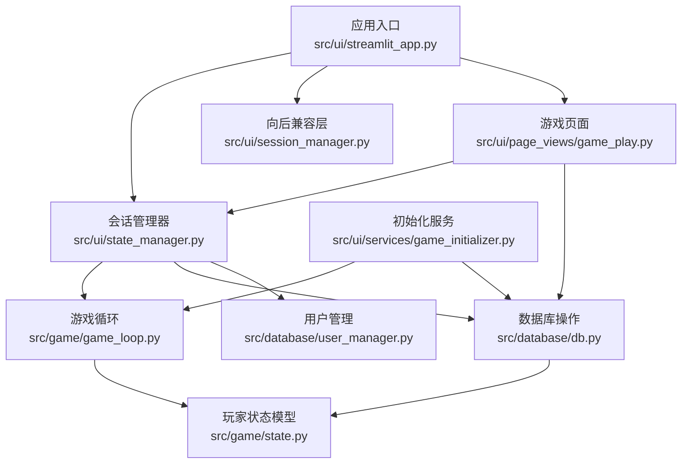
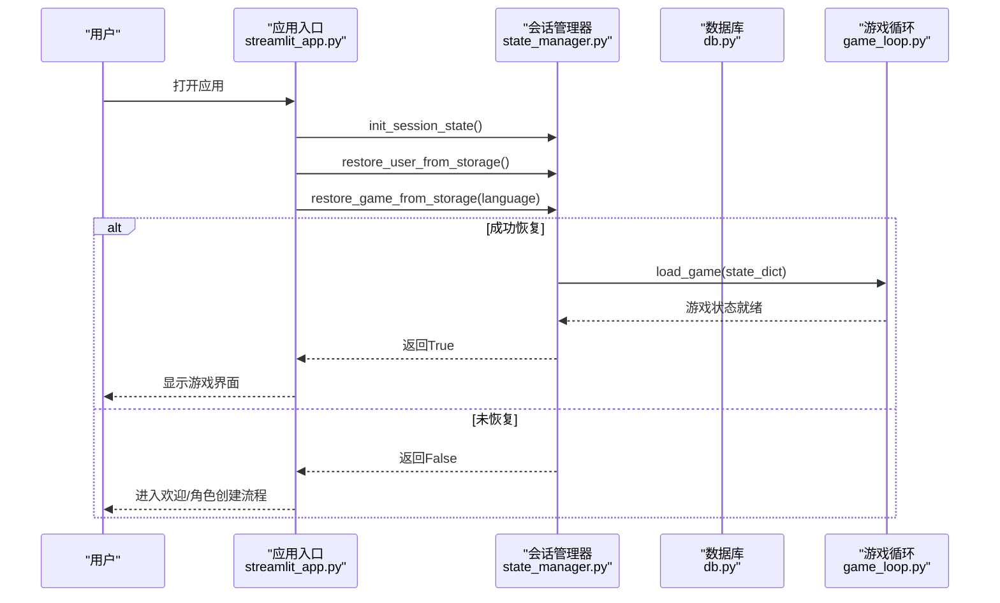
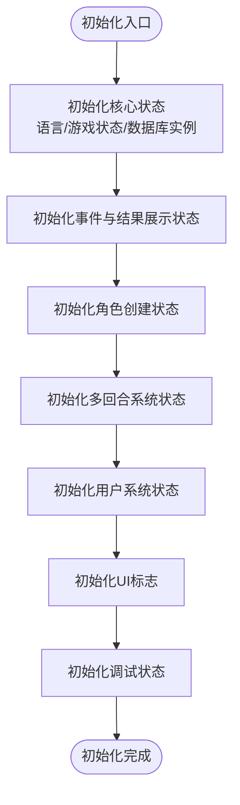
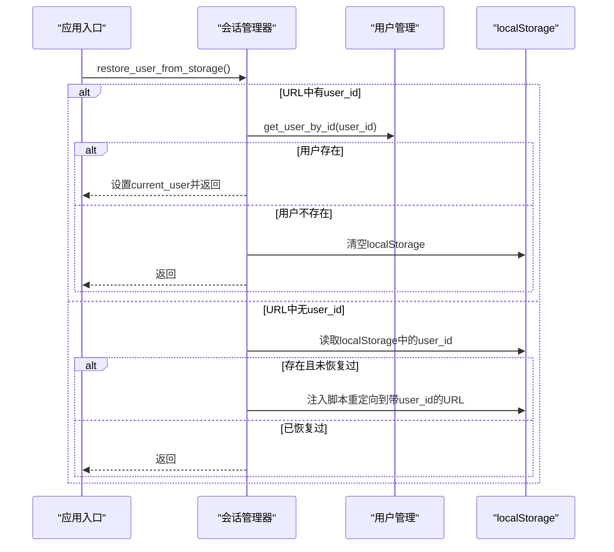
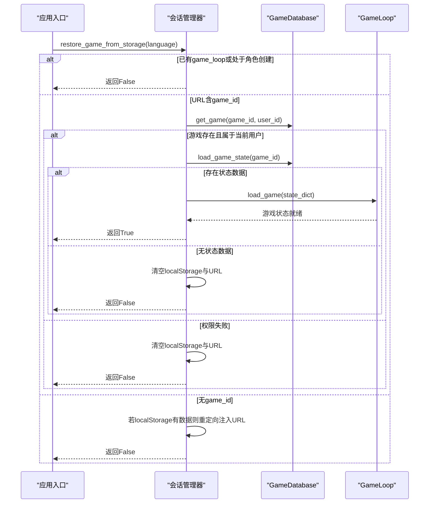
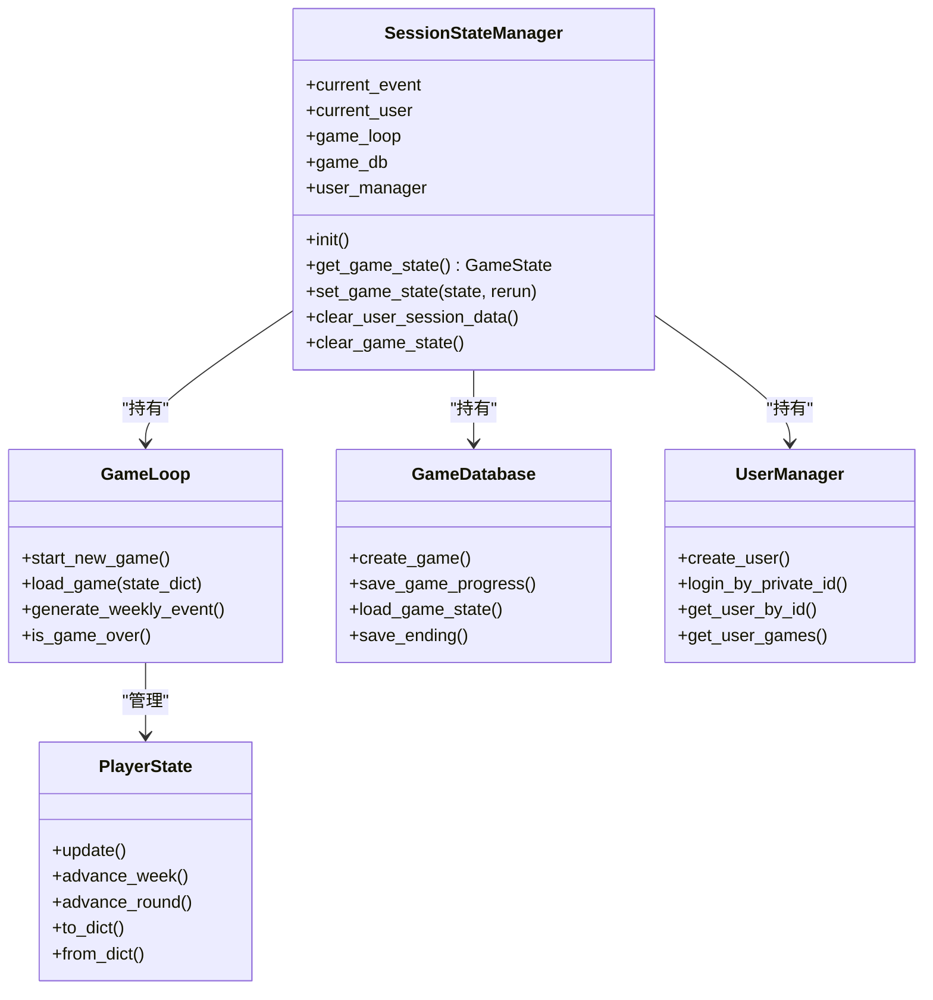

# 会话管理器

<cite>
**本文引用的文件**
- [src/ui/session_manager.py](file://src/ui/session_manager.py)
- [src/ui/state_manager.py](file://src/ui/state_manager.py)
- [src/game/state.py](file://src/game/state.py)
- [src/database/db.py](file://src/database/db.py)
- [src/database/user_manager.py](file://src/database/user_manager.py)
- [src/game/game_loop.py](file://src/game/game_loop.py)
- [src/ui/streamlit_app.py](file://src/ui/streamlit_app.py)
- [src/ui/page_views/game_play.py](file://src/ui/page_views/game_play.py)
- [src/ui/services/game_initializer.py](file://src/ui/services/game_initializer.py)
</cite>

## 目录
1. [简介](#简介)
2. [项目结构](#项目结构)
3. [核心组件](#核心组件)
4. [架构总览](#架构总览)
5. [详细组件分析](#详细组件分析)
6. [依赖关系分析](#依赖关系分析)
7. [性能考量](#性能考量)
8. [故障排查指南](#故障排查指南)
9. [结论](#结论)

## 简介
本文件为“会话管理器”的技术文档，聚焦于会话状态生命周期管理、用户会话处理与游戏状态存储机制。内容涵盖会话初始化、状态恢复、自动保存与清理流程，并提供具体代码路径示例，说明如何初始化会话状态、恢复用户会话、保存游戏进度以及处理会话超时。同时解释会话安全机制、数据持久化策略与验证流程。

## 项目结构
会话管理器位于前端UI层，围绕Streamlit会话状态进行统一管理，同时与游戏核心状态、数据库持久化模块协同工作。主要文件与职责如下：
- 会话管理：src/ui/state_manager.py 提供集中式会话状态管理与持久化函数
- 向后兼容：src/ui/session_manager.py 重导出旧接口，确保现有代码可用
- 游戏状态：src/game/state.py 定义玩家与NPC状态模型
- 数据库：src/database/db.py 提供游戏状态与决策的持久化接口
- 用户管理：src/database/user_manager.py 提供用户认证与权限验证
- 应用入口：src/ui/streamlit_app.py 负责初始化、恢复与路由
- 游戏页面：src/ui/page_views/game_play.py 展示游戏界面与保存逻辑
- 初始化服务：src/ui/services/game_initializer.py 统一角色创建与游戏初始化

图表来源
- [src/ui/state_manager.py](file://src/ui/state_manager.py#L1-L773)
- [src/ui/session_manager.py](file://src/ui/session_manager.py#L1-L65)
- [src/ui/streamlit_app.py](file://src/ui/streamlit_app.py#L1-L215)
- [src/ui/page_views/game_play.py](file://src/ui/page_views/game_play.py#L1-L200)
- [src/ui/services/game_initializer.py](file://src/ui/services/game_initializer.py#L1-L155)
- [src/game/game_loop.py](file://src/game/game_loop.py#L1-L200)
- [src/game/state.py](file://src/game/state.py#L1-L709)
- [src/database/db.py](file://src/database/db.py#L1-L517)
- [src/database/user_manager.py](file://src/database/user_manager.py#L1-L401)

章节来源
- [src/ui/state_manager.py](file://src/ui/state_manager.py#L1-L773)
- [src/ui/session_manager.py](file://src/ui/session_manager.py#L1-L65)
- [src/ui/streamlit_app.py](file://src/ui/streamlit_app.py#L1-L215)

## 核心组件
- 会话状态枚举：定义UI状态机（欢迎、角色选择、角色创建、预设选择、开场故事、游戏中、结束、个人资料等）
- 会话状态管理器：集中初始化、读写、清理会话状态；统一事件源；提供调试日志
- 用户持久化函数：URL参数与localStorage双通道保存/恢复用户ID
- 游戏持久化函数：URL参数与localStorage双通道保存/恢复游戏ID与状态
- 游戏状态模型：PlayerState与CharacterState，承载玩家与NPC的动态属性与历史记录
- 数据库接口：创建/保存/加载游戏状态，保存决策与结局，查询用户游戏列表
- 用户管理：用户创建、登录、好友系统与游戏公开设置

章节来源
- [src/ui/state_manager.py](file://src/ui/state_manager.py#L29-L41)
- [src/ui/state_manager.py](file://src/ui/state_manager.py#L42-L536)
- [src/ui/state_manager.py](file://src/ui/state_manager.py#L549-L773)
- [src/game/state.py](file://src/game/state.py#L244-L709)
- [src/database/db.py](file://src/database/db.py#L10-L517)
- [src/database/user_manager.py](file://src/database/user_manager.py#L34-L401)

## 架构总览
会话管理器采用“集中式状态 + 双通道持久化 + 数据库备份”的设计：
- 集中式状态：通过SessionStateManager统一管理st.session_state，提供类型安全的getter/setter
- 双通道持久化：URL参数作为主持久化载体，localStorage作为备份；用于断线重连与跨页恢复
- 数据库备份：GameDatabase负责游戏状态快照、决策与结局的持久化，支持恢复与列表查询
- 权限验证：restore_game_from_storage在恢复前验证用户权限与游戏存在性

图表来源
- [src/ui/streamlit_app.py](file://src/ui/streamlit_app.py#L139-L200)
- [src/ui/state_manager.py](file://src/ui/state_manager.py#L587-L773)
- [src/game/game_loop.py](file://src/game/game_loop.py#L93-L152)
- [src/database/db.py](file://src/database/db.py#L145-L172)

## 详细组件分析

### 会话状态生命周期管理
- 初始化：init()按类别初始化核心、事件、角色、多回合、用户、UI标志与调试状态
- 类型安全：get_game_state()/set_game_state()确保状态值在枚举范围内
- 事件统一源：current_event仅由game_loop维护，保证一致性
- 清理：clear_user_session_data()与clear_game_state()分别清理用户切换与新游戏启动所需的状态

图表来源
- [src/ui/state_manager.py](file://src/ui/state_manager.py#L67-L175)

章节来源
- [src/ui/state_manager.py](file://src/ui/state_manager.py#L67-L175)
- [src/ui/state_manager.py](file://src/ui/state_manager.py#L215-L244)
- [src/ui/state_manager.py](file://src/ui/state_manager.py#L247-L290)
- [src/ui/state_manager.py](file://src/ui/state_manager.py#L512-L535)

### 用户会话处理与恢复
- 用户持久化：save_user_to_storage()将user_id写入URL参数与localStorage
- 用户恢复：restore_user_from_storage()优先从URL恢复，其次从localStorage重定向恢复
- 权限检查：若已登录则跳过恢复；URL无效或用户不存在时清空存储并记录警告

图表来源
- [src/ui/state_manager.py](file://src/ui/state_manager.py#L587-L625)
- [src/database/user_manager.py](file://src/database/user_manager.py#L141-L144)

章节来源
- [src/ui/state_manager.py](file://src/ui/state_manager.py#L552-L584)
- [src/ui/state_manager.py](file://src/ui/state_manager.py#L587-L625)
- [src/database/user_manager.py](file://src/database/user_manager.py#L104-L126)

### 游戏状态存储与恢复
- 游戏持久化：save_game_to_storage()将game_id与game_state写入URL与localStorage
- 游戏恢复：restore_game_from_storage()在以下条件满足时恢复：
  - 无game_loop在运行
  - 非角色创建阶段
  - URL包含有效game_id
  - 验证用户权限与游戏存在性
  - 从GameDatabase加载最新状态快照
  - 重建GameLoop并恢复事件与展示状态
- 自动保存：游戏页面在保存按钮点击时调用GameDatabase.save_game_progress()

图表来源
- [src/ui/state_manager.py](file://src/ui/state_manager.py#L628-L773)
- [src/database/db.py](file://src/database/db.py#L145-L172)
- [src/game/game_loop.py](file://src/game/game_loop.py#L93-L152)

章节来源
- [src/ui/state_manager.py](file://src/ui/state_manager.py#L628-L773)
- [src/database/db.py](file://src/database/db.py#L274-L321)
- [src/ui/page_views/game_play.py](file://src/ui/page_views/game_play.py#L108-L117)

### 会话安全机制与验证策略
- URL参数为主持久化：URL参数具备最高优先级，便于跨页恢复与断线重连
- localStorage为备份：当URL参数缺失时，通过脚本注入重定向至带参数的URL，确保恢复
- 权限验证：restore_game_from_storage()在恢复前验证game_id存在性与归属权
- 用户恢复验证：restore_user_from_storage()在URL恢复失败时，从localStorage读取并重定向，避免泄露
- 清理策略：clear_user_storage()/clear_game_storage()在登出或恢复失败时清除残留数据

章节来源
- [src/ui/state_manager.py](file://src/ui/state_manager.py#L552-L584)
- [src/ui/state_manager.py](file://src/ui/state_manager.py#L587-L625)
- [src/ui/state_manager.py](file://src/ui/state_manager.py#L645-L660)
- [src/ui/state_manager.py](file://src/ui/state_manager.py#L713-L722)

### 代码示例路径（如何执行关键流程）
- 初始化会话状态
  - 路径：[src/ui/streamlit_app.py](file://src/ui/streamlit_app.py#L145-L146)
  - 说明：调用init_session_state()完成会话初始化
- 恢复用户会话
  - 路径：[src/ui/streamlit_app.py](file://src/ui/streamlit_app.py#L148-L149)
  - 说明：调用restore_user_from_storage()从URL或localStorage恢复用户
- 恢复游戏进度
  - 路径：[src/ui/streamlit_app.py](file://src/ui/streamlit_app.py#L155-L158)
  - 说明：调用restore_game_from_storage()恢复断线重连后的游戏状态
- 保存游戏进度
  - 路径：[src/ui/page_views/game_play.py](file://src/ui/page_views/game_play.py#L108-L117)
  - 说明：点击保存按钮时调用GameDatabase.save_game_progress()持久化当前状态
- 处理会话超时与清理
  - 路径：[src/ui/state_manager.py](file://src/ui/state_manager.py#L512-L535)
  - 说明：clear_user_session_data()与clear_game_state()用于清理用户切换或新游戏启动所需状态

章节来源
- [src/ui/streamlit_app.py](file://src/ui/streamlit_app.py#L145-L158)
- [src/ui/page_views/game_play.py](file://src/ui/page_views/game_play.py#L108-L117)
- [src/ui/state_manager.py](file://src/ui/state_manager.py#L512-L535)

## 依赖关系分析
- 会话管理器依赖
  - 游戏循环：通过game_loop属性与current_event统一事件源
  - 数据库：通过game_db属性访问GameDatabase进行状态持久化
  - 用户管理：通过user_manager属性访问UserManager进行用户权限验证
- 游戏状态模型
  - PlayerState与CharacterState定义了玩家与NPC的完整状态结构，支撑事件、关系与世界模型
- 数据库接口
  - GameDatabase封装了状态快照、决策与结局的持久化，提供加载与列表查询

图表来源
- [src/ui/state_manager.py](file://src/ui/state_manager.py#L42-L536)
- [src/game/game_loop.py](file://src/game/game_loop.py#L24-L152)
- [src/database/db.py](file://src/database/db.py#L10-L517)
- [src/database/user_manager.py](file://src/database/user_manager.py#L34-L401)
- [src/game/state.py](file://src/game/state.py#L244-L709)

章节来源
- [src/ui/state_manager.py](file://src/ui/state_manager.py#L42-L536)
- [src/game/game_loop.py](file://src/game/game_loop.py#L24-L152)
- [src/database/db.py](file://src/database/db.py#L10-L517)
- [src/database/user_manager.py](file://src/database/user_manager.py#L34-L401)
- [src/game/state.py](file://src/game/state.py#L244-L709)

## 性能考量
- 会话状态读写：通过集中式getter/setter减少全局直接访问，降低耦合与错误概率
- 事件统一源：current_event仅由game_loop维护，避免多处修改导致的竞态
- 数据库批量写入：save_game_progress()在事务中提交，失败时回滚，保证一致性
- 恢复路径优化：restore_game_from_storage()在URL参数缺失时通过localStorage重定向，减少重复尝试

## 故障排查指南
- 恢复失败
  - 检查URL参数是否包含有效的game_id与game_state
  - 确认用户登录状态与游戏归属权
  - 查看日志输出，确认clear_game_storage()是否被调用
  - 参考路径：[src/ui/state_manager.py](file://src/ui/state_manager.py#L662-L773)
- 用户恢复失败
  - 确认URL参数user_id是否有效
  - 检查localStorage中是否存在user_id
  - 参考路径：[src/ui/state_manager.py](file://src/ui/state_manager.py#L587-L625)
- 保存失败
  - 检查GameDatabase.save_game_progress()返回值与异常日志
  - 确认game_id与PlayerState有效性
  - 参考路径：[src/database/db.py](file://src/database/db.py#L274-L321)
- 会话清理
  - 使用clear_user_session_data()与clear_game_state()清理残留状态
  - 参考路径：[src/ui/state_manager.py](file://src/ui/state_manager.py#L512-L535)

章节来源
- [src/ui/state_manager.py](file://src/ui/state_manager.py#L512-L535)
- [src/ui/state_manager.py](file://src/ui/state_manager.py#L587-L625)
- [src/ui/state_manager.py](file://src/ui/state_manager.py#L662-L773)
- [src/database/db.py](file://src/database/db.py#L274-L321)

## 结论
会话管理器通过集中式状态管理、双通道持久化与数据库备份，实现了可靠的会话生命周期管理。其设计兼顾易用性与安全性，既简化了UI层的状态访问，又在恢复与保存流程中强化了权限验证与数据一致性。建议在扩展新功能时遵循现有模式，保持状态来源单一与持久化路径清晰，以维持系统的稳定与可维护性。