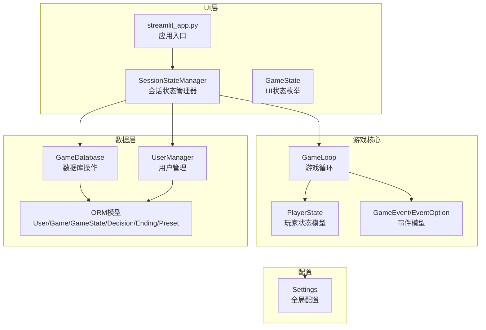
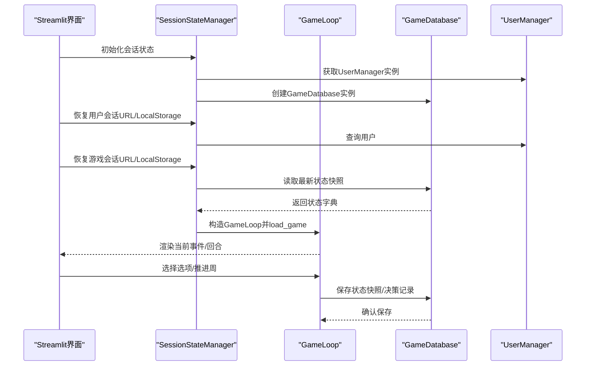
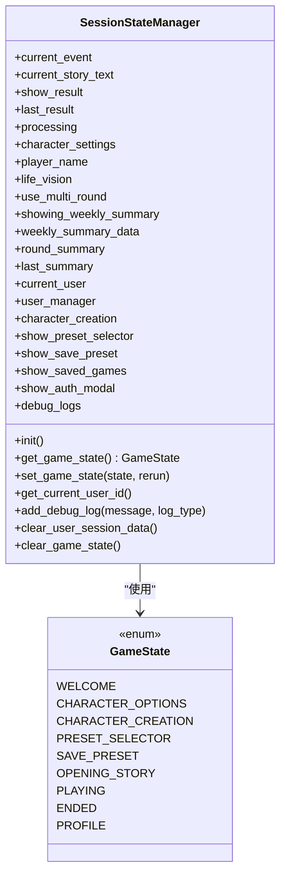
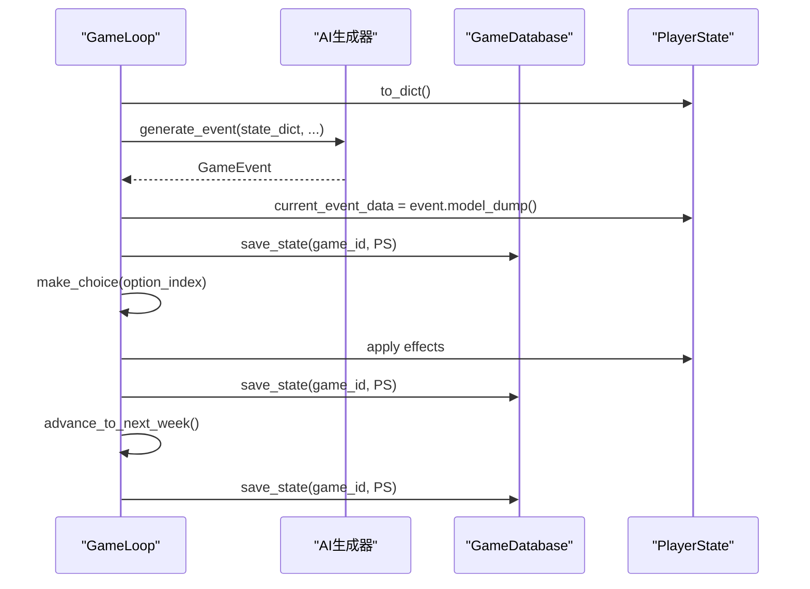
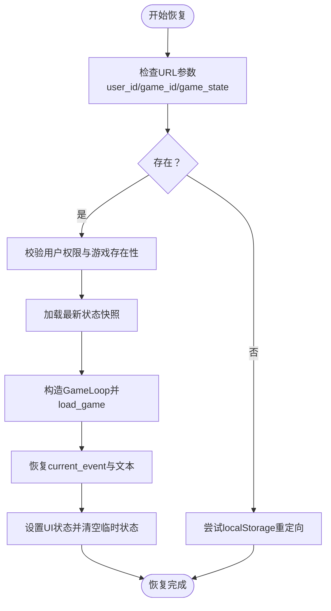
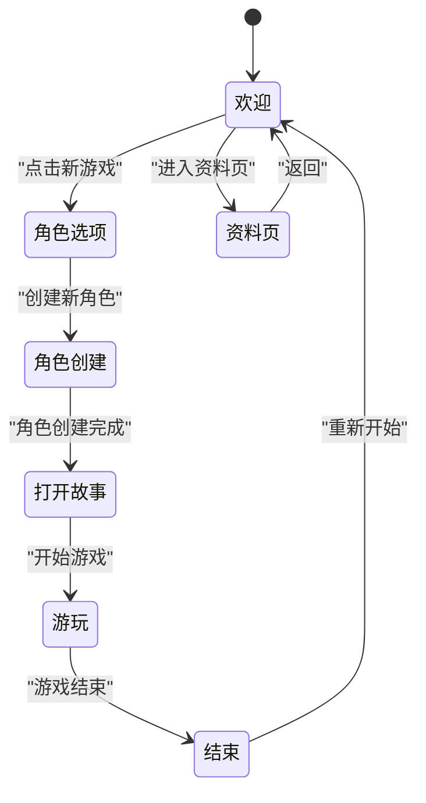
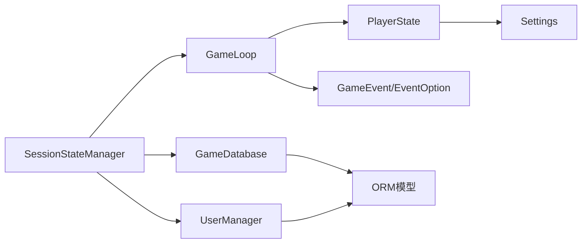

# 状态管理器

<cite>
**本文引用的文件**
- [src/ui/state_manager.py](file://src/ui/state_manager.py)
- [src/game/state.py](file://src/game/state.py)
- [src/ui/session_manager.py](file://src/ui/session_manager.py)
- [src/game/game_loop.py](file://src/game/game_loop.py)
- [src/database/db.py](file://src/database/db.py)
- [src/database/models.py](file://src/database/models.py)
- [src/database/user_manager.py](file://src/database/user_manager.py)
- [src/ai/models.py](file://src/ai/models.py)
- [config/settings.py](file://config/settings.py)
- [src/ui/streamlit_app.py](file://src/ui/streamlit_app.py)
- [tests/test_state.py](file://tests/test_state.py)
- [test_state_machine.py](file://test_state_machine.py)
</cite>

## 目录
1. [简介](#简介)
2. [项目结构](#项目结构)
3. [核心组件](#核心组件)
4. [架构总览](#架构总览)
5. [详细组件分析](#详细组件分析)
6. [依赖关系分析](#依赖关系分析)
7. [性能考量](#性能考量)
8. [故障排查指南](#故障排查指南)
9. [结论](#结论)
10. [附录](#附录)

## 简介
本文件面向“状态管理器”的技术文档，聚焦以下目标：
- 设计模式：集中式会话状态管理、UI状态机、数据模型与业务逻辑分离
- 状态持久化机制：本地存储（URL参数与localStorage）、数据库快照、文件缓存
- 会话状态管理：用户会话、游戏会话、事件与回合状态、调试日志
- 状态机实现与转换：UI状态机（欢迎/角色创建/打开故事/游玩/结束/资料页等）
- 数据序列化与反序列化：Pydantic模型、JSON序列化、数据库JSON列
- 状态变更监听与验证：类型安全访问、边界校验、一致性检查
- 并发访问控制：线程池与回调、事件生成与决策处理的顺序保障

## 项目结构
围绕状态管理的关键目录与文件：
- UI层：状态管理器、会话管理器、页面视图、入口应用
- 游戏核心：玩家状态模型、游戏循环、AI事件模型
- 数据层：数据库操作、ORM模型、用户管理
- 配置层：全局常量与默认值

图表来源
- [src/ui/state_manager.py](file://src/ui/state_manager.py#L42-L539)
- [src/game/state.py](file://src/game/state.py#L244-L709)
- [src/ai/models.py](file://src/ai/models.py#L7-L27)
- [src/game/game_loop.py](file://src/game/game_loop.py#L24-L153)
- [src/database/db.py](file://src/database/db.py#L10-L517)
- [src/database/models.py](file://src/database/models.py#L11-L171)
- [src/database/user_manager.py](file://src/database/user_manager.py#L34-L401)
- [config/settings.py](file://config/settings.py#L30-L100)
- [src/ui/streamlit_app.py](file://src/ui/streamlit_app.py#L139-L215)

章节来源
- [src/ui/state_manager.py](file://src/ui/state_manager.py#L1-L773)
- [src/game/state.py](file://src/game/state.py#L1-L709)
- [src/ui/session_manager.py](file://src/ui/session_manager.py#L1-L65)
- [src/game/game_loop.py](file://src/game/game_loop.py#L1-L800)
- [src/database/db.py](file://src/database/db.py#L1-L517)
- [src/database/models.py](file://src/database/models.py#L1-L171)
- [src/database/user_manager.py](file://src/database/user_manager.py#L1-L401)
- [src/ai/models.py](file://src/ai/models.py#L1-L27)
- [config/settings.py](file://config/settings.py#L1-L100)
- [src/ui/streamlit_app.py](file://src/ui/streamlit_app.py#L1-L215)

## 核心组件
- 会话状态管理器（SessionStateManager）
  - 类型安全的st.session_state封装，统一初始化、读写、清理
  - UI状态机（GameState）与事件状态（current_event/current_story_text）管理
  - 用户会话与游戏会话的持久化与恢复（URL参数与localStorage）
- 玩家状态模型（PlayerState）
  - 资源与时间维度（能量、情绪、知识、财富、年龄、周数）
  - 人物关系与NPC系统（CharacterState、关系阈值、事件触发）
  - 多回合系统（rounds_per_week、round_history、weekly_summaries）
  - 序列化/反序列化（to_dict/from_dict）、一致性校验（validate）
- 游戏循环（GameLoop）
  - 事件生成（常规/里程碑/回合）、决策处理、周推进、摘要生成
  - 与数据库交互（保存/加载状态快照）、与AI生成器协作
- 数据库与用户管理
  - GameDatabase：状态快照、决策记录、结局记录、角色预设
  - UserManager：用户创建/登录、好友关系、公开游戏
- 配置与常量（Settings）
  - 默认语言、资源上下限、衰减系数、总周数等

章节来源
- [src/ui/state_manager.py](file://src/ui/state_manager.py#L42-L539)
- [src/game/state.py](file://src/game/state.py#L244-L709)
- [src/game/game_loop.py](file://src/game/game_loop.py#L24-L153)
- [src/database/db.py](file://src/database/db.py#L10-L517)
- [src/database/user_manager.py](file://src/database/user_manager.py#L34-L401)
- [config/settings.py](file://config/settings.py#L30-L100)

## 架构总览
状态管理器贯穿UI、游戏核心与数据层，形成“UI状态机 + 游戏状态 + 数据持久化”的闭环。

图表来源
- [src/ui/state_manager.py](file://src/ui/state_manager.py#L587-L773)
- [src/database/db.py](file://src/database/db.py#L145-L365)
- [src/game/game_loop.py](file://src/game/game_loop.py#L93-L152)
- [src/database/user_manager.py](file://src/database/user_manager.py#L104-L144)

## 详细组件分析

### 会话状态管理器（SessionStateManager）
- 设计要点
  - 单例全局实例，集中初始化与清理
  - UI状态机（GameState）与事件状态（current_event/current_story_text）统一入口
  - 用户会话与游戏会话的双通道持久化（URL参数 + localStorage）
- 关键接口
  - 初始化：init()按类别初始化核心/事件/角色/多回合/用户/UI/调试状态
  - 游戏状态：get_game_state()/set_game_state()，类型安全
  - 事件状态：current_event/current_story_text读写，统一来源（game_loop优先）
  - 用户会话：save_user_to_storage()/restore_user_from_storage()/clear_user_storage()
  - 游戏会话：save_game_to_storage()/restore_game_from_storage()/clear_game_storage()
  - 清理：clear_user_session_data()/clear_game_state()
- 并发与一致性
  - 通过st.session_state作为单一真相来源，避免分散读写
  - current_event写入同时更新game_loop与session_state，保证一致性

图表来源
- [src/ui/state_manager.py](file://src/ui/state_manager.py#L42-L539)
- [src/ui/state_manager.py](file://src/ui/state_manager.py#L29-L40)

章节来源
- [src/ui/state_manager.py](file://src/ui/state_manager.py#L42-L539)

### 玩家状态模型（PlayerState）
- 数据结构
  - 资源：energy/mood/knowledge/wealth
  - 时间：age/week/round（多回合）
  - 关系：characters（NPC集合）/relationships（兼容字典）
  - 历史：decision_history/story_history/four_week_summaries/yearly_summaries
  - 事件：current_event_data（用于断点续玩）
  - 世界模型：world_model_data/established_facts/pending_storylines
  - 伏笔系统：foreshadowing_seeds/foreshadowing_metrics
- 方法与行为
  - update()：批量更新资源与关系，边界裁剪
  - advance_week()/advance_round()：周/回合推进与年龄计算
  - get_round_context()：构建回合上下文（富文本）
  - validate()：边界校验
  - to_dict()/from_dict()：序列化/反序列化
  - NPC管理：add_character()/get_character()/update_character()/check_character_events()
- 与服务层解耦
  - 复杂关系与事件检查委托给PlayerService，保持数据模型纯净

```mermaid
classDiagram
class PlayerState {
+player_name : string
+life_vision : string
+energy : int
+mood : int
+knowledge : int
+wealth : int
+characters : Dict~string, Dict~
+relationships : Dict~string, int~
+age : int
+week : int
+decision_history : list
+story_history : list
+four_week_summaries : list
+yearly_summaries : list
+current_round : int
+rounds_per_week : int
+round_history : list
+weekly_summaries : list
+current_event_data : Dict
+pending_storylines : list
+established_facts : list
+last_round_full_story : string
+last_event_concluded : bool
+foreshadowing_seeds : list
+character_habits : list
+world_model_data : Dict
+foreshadowing_metrics : Dict
+update(...)
+advance_week()
+advance_round() bool
+is_week_complete() bool
+get_current_week_rounds() list
+get_game_date_info() Dict
+get_round_context() string
+validate() bool
+to_dict() Dict
+from_dict(data) PlayerState
+is_game_over() bool
+get_current_phase() string
+get_round_name(language) string
+add_character(character)
+get_character(name) CharacterState
+get_all_characters() CharacterState[]
+update_character(name, **kwargs) bool
+update_character_relationship(...)
+sync_relationships_to_characters()
+sync_characters_to_relationships()
+get_characters_context() string
+check_character_events() List
+initialize_characters_from_settings()
}
class CharacterState {
+name : string
+role : string
+relationship_desc : string
+age : int
+gender : string
+occupation : string
+personality_traits : string[]
+temperament : string
+mood : int
+mood_stability : int
+social_status : string
+influence : int
+competence : int
+specialty : string[]
+sexual_orientation : string
+relationship_status : string
+romantic_interest : string
+has_external_obstacle : bool
+peak_affinity : int
+affinity : int
+trust : int
+respect : int
+interaction_count : int
+last_interaction_week : int
+relationship_history : string
+event_triggers : Dict~string, int~
+triggered_events : string[]
+update_mood(change)
+update_relationship(...)
+record_interaction(week, summary)
+check_event_trigger(event_type) bool
+get_interaction_style() string
+to_context_string() string
+from_simple_dict(data) CharacterState
}
PlayerState --> CharacterState : "管理"
```

图表来源
- [src/game/state.py](file://src/game/state.py#L12-L242)
- [src/game/state.py](file://src/game/state.py#L244-L709)

章节来源
- [src/game/state.py](file://src/game/state.py#L1-L709)

### 游戏循环（GameLoop）
- 职责
  - 事件生成：常规/里程碑/回合事件；回退策略
  - 决策处理：process_decision，应用效果，生成续写
  - 周推进：保存故事、衰减资源、生成4周/年度摘要
  - 与数据库交互：保存/加载状态快照、决策记录、结局记录
- 关键流程
  - start_new_game/load_game：初始化/恢复玩家状态与事件
  - generate_weekly_event/generate_round_event：事件生成与持久化
  - make_choice/make_round_choice：决策应用与状态更新
  - advance_to_next_week：周推进与摘要生成
- 多回合系统
  - current_round/rounds_per_week控制每轮事件
  - round_history/weekly_summaries维护回合与周级摘要

图表来源
- [src/game/game_loop.py](file://src/game/game_loop.py#L154-L351)
- [src/database/db.py](file://src/database/db.py#L48-L72)

章节来源
- [src/game/game_loop.py](file://src/game/game_loop.py#L24-L800)
- [src/database/db.py](file://src/database/db.py#L10-L517)

### 数据持久化与恢复
- 本地持久化（URL参数 + localStorage）
  - 用户会话：save_user_to_storage()/restore_user_from_storage()/clear_user_storage()
  - 游戏会话：save_game_to_storage()/restore_game_from_storage()/clear_game_storage()
- 数据库持久化
  - GameDatabase.save_state()/load_game_state()：状态快照
  - GameDatabase.save_decision()/get_decision_history()：决策记录
  - GameDatabase.save_ending()：结局记录
  - GameDatabase.list_saved_games()/load_saved_game()：用户游戏列表与加载
- 恢复流程
  - 从URL参数或localStorage读取user_id/game_id/game_state
  - 校验权限与存在性，加载最新状态快照
  - 构造GameLoop并load_game，恢复current_event与UI状态

图表来源
- [src/ui/state_manager.py](file://src/ui/state_manager.py#L587-L773)
- [src/database/db.py](file://src/database/db.py#L145-L173)

章节来源
- [src/ui/state_manager.py](file://src/ui/state_manager.py#L587-L773)
- [src/database/db.py](file://src/database/db.py#L145-L365)

### UI状态机与页面路由
- 状态机（GameState）
  - WELCOME/CHARACTER_OPTIONS/CHARACTER_CREATION/PRESET_SELECTOR/SAVE_PRESET/OPENING_STORY/PLAYING/ENDED/PROFILE
- 页面路由
  - streamlit_app根据get_game_state()与会话标志决定渲染哪个页面
  - 字符串兼容：legacy show_opening_story标志自动迁移
- 状态一致性
  - 测试用例验证互斥状态、角色创建与游戏循环的约束

图表来源
- [src/ui/state_manager.py](file://src/ui/state_manager.py#L29-L40)
- [src/ui/streamlit_app.py](file://src/ui/streamlit_app.py#L175-L211)
- [test_state_machine.py](file://test_state_machine.py#L30-L201)

章节来源
- [src/ui/state_manager.py](file://src/ui/state_manager.py#L29-L40)
- [src/ui/streamlit_app.py](file://src/ui/streamlit_app.py#L139-L215)
- [test_state_machine.py](file://test_state_machine.py#L1-L207)

### 序列化与反序列化
- Pydantic模型
  - PlayerState/CharacterState/EventOption/GameEvent均基于Pydantic
  - to_dict()/from_dict()用于内存序列化
- 数据库存储
  - JSON列存储状态字典（state_json/initial_state/final_state/JSON字段）
  - GameDatabase.save_state()/load_game_state()负责快照读写
- AI事件
  - GameEvent.from_json()从JSON字符串解析事件

章节来源
- [src/game/state.py](file://src/game/state.py#L244-L709)
- [src/ai/models.py](file://src/ai/models.py#L14-L27)
- [src/database/db.py](file://src/database/db.py#L48-L72)

### 状态变更监听与验证
- 监听
  - 通过SessionStateManager的属性setter统一写入st.session_state
  - 事件状态写入同时更新GameLoop.current_event，确保UI与逻辑一致
- 验证
  - PlayerState.validate()：资源范围、周数、年龄、财富非负
  - GameEvent/EventOption：字段长度与结构约束
- 边界控制
  - update()对资源进行MIN/MAX裁剪
  - advance_week()重置回合计数

章节来源
- [src/ui/state_manager.py](file://src/ui/state_manager.py#L247-L290)
- [src/game/state.py](file://src/game/state.py#L372-L409)
- [src/game/state.py](file://src/game/state.py#L531-L551)
- [src/ai/models.py](file://src/ai/models.py#L7-L27)

### 并发访问控制
- 线程池与回调
  - GameLoop在事件生成与回合事件中使用ThreadPoolExecutor处理异步任务
  - 提供stream_callback接收流式文本片段
- 顺序保障
  - 事件生成与决策处理严格按周/回合顺序执行
  - current_event_data作为断点续玩的原子状态

章节来源
- [src/game/game_loop.py](file://src/game/game_loop.py#L5-L6)
- [src/game/game_loop.py](file://src/game/game_loop.py#L154-L257)
- [src/game/game_loop.py](file://src/game/game_loop.py#L666-L780)

## 依赖关系分析
- 组件耦合
  - SessionStateManager依赖GameLoop/数据库/UserManager/AI模型
  - GameLoop依赖PlayerState/事件模型/数据库/AI生成器
  - PlayerState与PlayerService解耦，仅在调用处注入
- 外部依赖
  - SQLAlchemy（数据库ORM）
  - Streamlit（会话状态与页面渲染）
  - Pydantic（数据模型与序列化）

图表来源
- [src/ui/state_manager.py](file://src/ui/state_manager.py#L42-L539)
- [src/game/game_loop.py](file://src/game/game_loop.py#L24-L153)
- [src/database/db.py](file://src/database/db.py#L10-L517)
- [src/database/models.py](file://src/database/models.py#L11-L171)
- [src/database/user_manager.py](file://src/database/user_manager.py#L34-L401)
- [config/settings.py](file://config/settings.py#L30-L100)

章节来源
- [src/ui/state_manager.py](file://src/ui/state_manager.py#L1-L773)
- [src/game/game_loop.py](file://src/game/game_loop.py#L1-L800)
- [src/database/db.py](file://src/database/db.py#L1-L517)
- [src/database/models.py](file://src/database/models.py#L1-L171)
- [src/database/user_manager.py](file://src/database/user_manager.py#L1-L401)
- [config/settings.py](file://config/settings.py#L1-L100)

## 性能考量
- 序列化成本
  - PlayerState.to_dict()用于快照保存，建议在周推进或回合结束时触发
  - GameEvent/EventOption字段长度限制减少JSON体积
- 数据库写入
  - save_state/save_decision按需写入，避免频繁I/O
  - 使用索引（week/created_at）优化查询
- UI渲染
  - 通过st.rerun()最小化刷新范围，仅在必要时触发
  - 事件文本与回合上下文采用增量拼接，避免重复计算

## 故障排查指南
- 无法恢复游戏
  - 检查URL参数与localStorage中的game_id/game_state
  - 校验用户权限与游戏存在性
  - 查看日志中“Failed to restore game”错误
- 事件生成失败
  - 观察fallback事件日志，确认AI生成器可用性
  - 检查PlayerState完整性（validate）
- 状态不一致
  - 确认current_event写入同时更新GameLoop与session_state
  - 使用clear_user_session_data/clear_game_state清理残留状态
- 资源越界
  - update()会裁剪至MIN/MAX，检查调用参数
  - validate()抛出异常时，定位越界字段

章节来源
- [src/ui/state_manager.py](file://src/ui/state_manager.py#L587-L773)
- [src/game/game_loop.py](file://src/game/game_loop.py#L246-L256)
- [src/game/state.py](file://src/game/state.py#L531-L551)

## 结论
本状态管理器通过集中式会话状态管理、类型安全的数据模型与严谨的持久化策略，实现了UI状态机、游戏状态与数据库的无缝衔接。其设计强调：
- 单一真相来源（st.session_state）与类型安全访问
- 事件与回合的断点续玩能力
- 本地与云端双重持久化路径
- 严格的边界校验与一致性检查
- 可扩展的多回合系统与NPC关系网络

## 附录
- 示例路径（不展示具体代码内容）
  - 创建状态管理器实例：[get_state_manager](file://src/ui/state_manager.py#L541-L547)
  - 初始化会话状态：[SessionStateManager.init](file://src/ui/state_manager.py#L67-L76)
  - 设置UI状态：[SessionStateManager.set_game_state](file://src/ui/state_manager.py#L233-L244)
  - 管理玩家状态：[PlayerState.update](file://src/game/state.py#L372-L409)
  - 事件生成与保存：[GameLoop.generate_weekly_event](file://src/game/game_loop.py#L154-L257)
  - 状态恢复：[restore_game_from_storage](file://src/ui/state_manager.py#L662-L773)
  - 数据库快照：[GameDatabase.save_state](file://src/database/db.py#L48-L72)
  - 测试用例：[tests/test_state.py](file://tests/test_state.py#L1-L99)、[test_state_machine.py](file://test_state_machine.py#L1-L207)