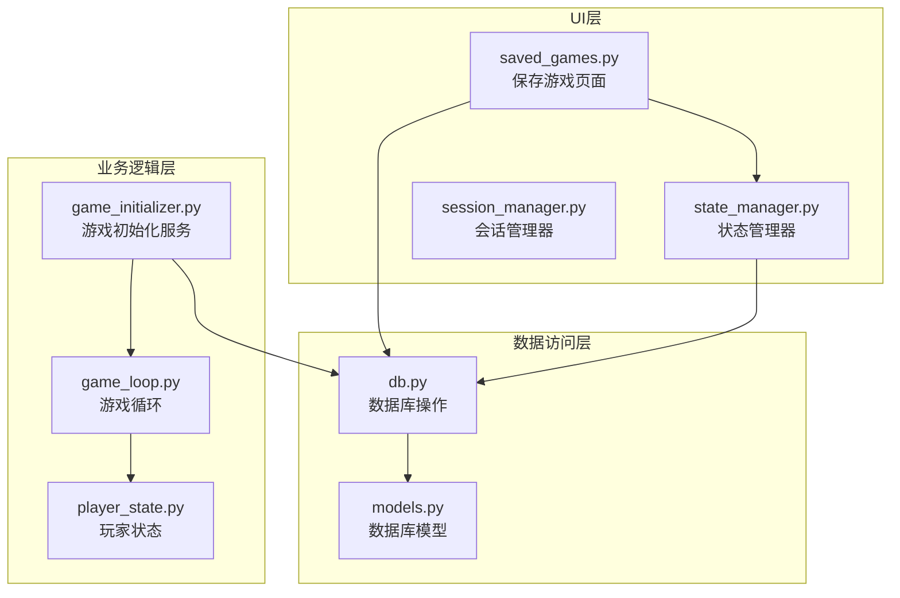
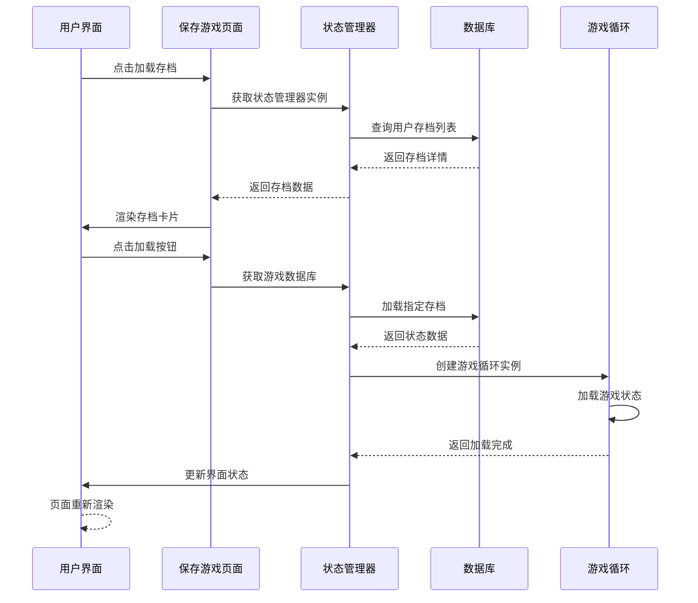
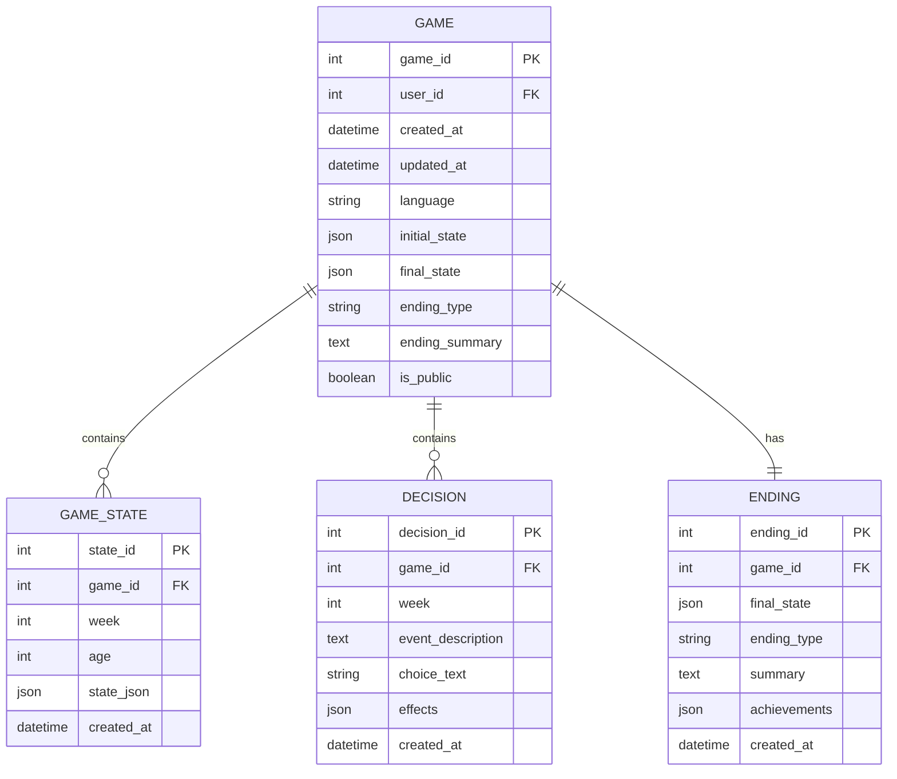
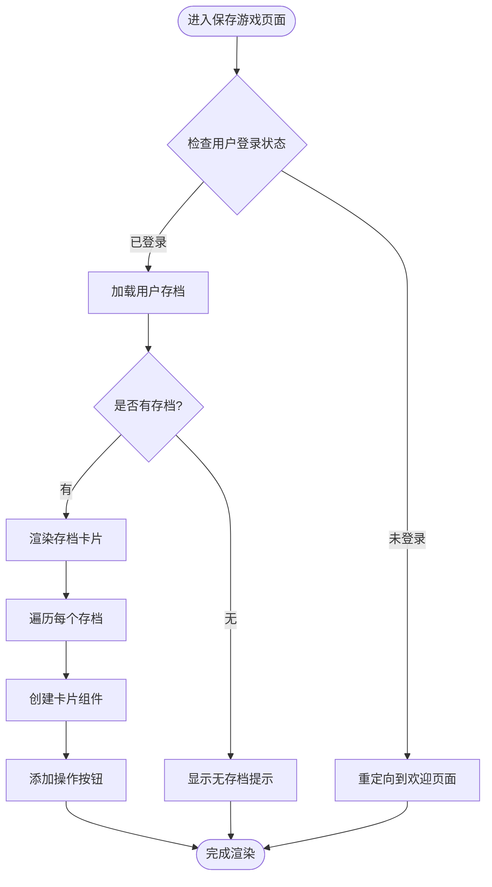
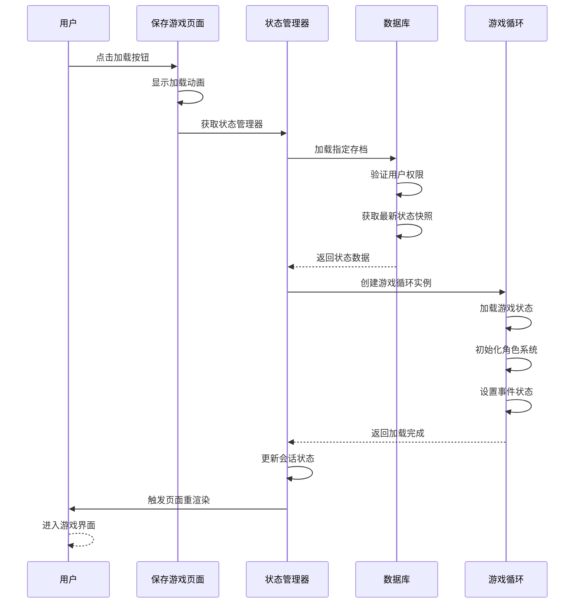
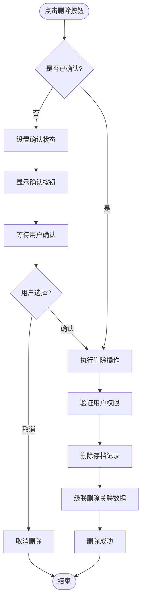
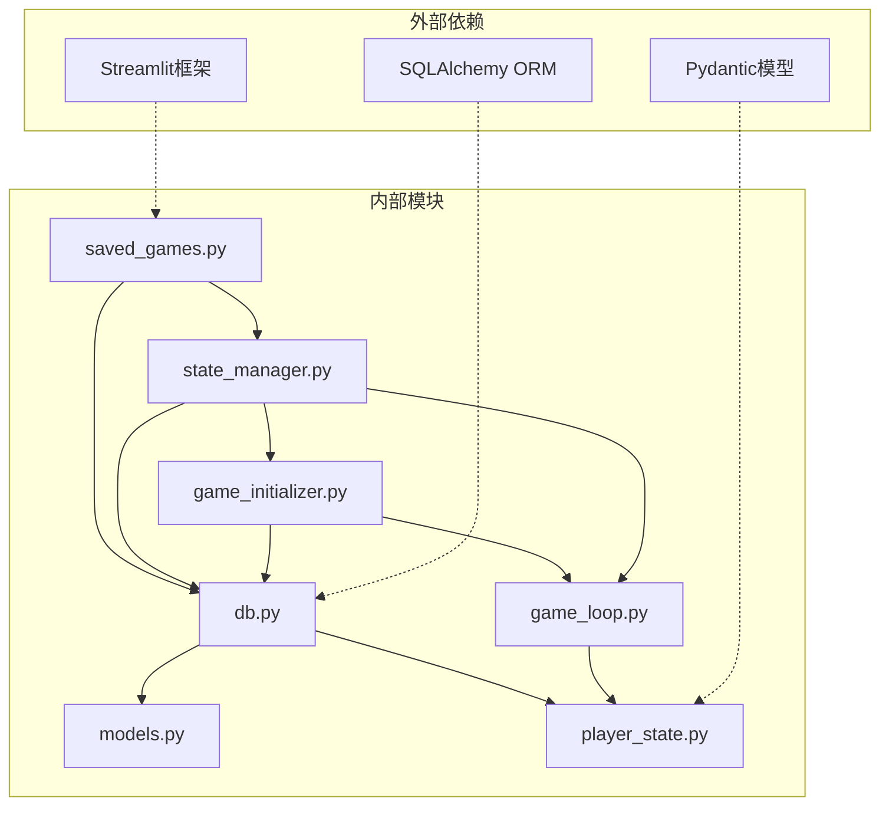

# 保存游戏页面

<cite>
**本文引用的文件**
- [saved_games.py](file://src/ui/page_views/saved_games.py)
- [db.py](file://src/database/db.py)
- [models.py](file://src/database/models.py)
- [state.py](file://src/game/state.py)
- [state_manager.py](file://src/ui/state_manager.py)
- [session_manager.py](file://src/ui/session_manager.py)
- [game_loop.py](file://src/game/game_loop.py)
- [game_initializer.py](file://src/ui/services/game_initializer.py)
</cite>

## 目录
1. [简介](#简介)
2. [项目结构](#项目结构)
3. [核心组件](#核心组件)
4. [架构概览](#架构概览)
5. [详细组件分析](#详细组件分析)
6. [依赖关系分析](#依赖关系分析)
7. [性能考虑](#性能考虑)
8. [故障排除指南](#故障排除指南)
9. [结论](#结论)

## 简介

保存游戏页面是故事驱动型游戏中重要的存档管理系统，负责管理玩家的游戏进度、提供存档列表展示以及实现各种存档操作功能。本文档深入解析了该系统的实现细节，包括存档数据结构、备份机制、错误处理策略以及完整的功能流程。

该系统采用分层架构设计，通过数据库持久化存储游戏状态，使用Streamlit构建用户界面，并通过状态管理器统一协调各个组件之间的交互。

## 项目结构

保存游戏页面位于UI层的page_views模块中，主要文件组织如下：

**图表来源**
- [saved_games.py](file://src/ui/page_views/saved_games.py#L1-L180)
- [state_manager.py](file://src/ui/state_manager.py#L1-L773)
- [db.py](file://src/database/db.py#L1-L517)

**章节来源**
- [saved_games.py](file://src/ui/page_views/saved_games.py#L1-L180)
- [state_manager.py](file://src/ui/state_manager.py#L1-L773)
- [db.py](file://src/database/db.py#L1-L517)

## 核心组件

### 存档管理器（GameDatabase）

GameDatabase是整个存档系统的核心，负责所有数据库相关的操作：

- **存档创建**：创建新的游戏记录并保存初始状态
- **状态保存**：保存游戏进度快照到GameState表
- **状态加载**：从数据库恢复游戏状态
- **存档查询**：获取用户的存档列表和详细信息
- **存档删除**：安全地删除指定的存档记录

### 状态管理器（SessionStateManager）

SessionStateManager提供统一的状态管理接口，确保应用状态的一致性和类型安全性：

- **全局状态**：集中管理所有会话状态变量
- **类型安全**：提供类型化的getter和setter方法
- **状态初始化**：自动初始化所有必要的默认值
- **事件管理**：统一管理当前事件和故事文本状态

### 存档页面组件

保存游戏页面提供直观的用户界面，包含以下功能：

- **存档列表渲染**：展示用户的可用存档
- **存档详情显示**：显示每个存档的基本信息
- **加载存档**：恢复指定的存档状态
- **删除存档**：安全删除不需要的存档
- **返回导航**：提供便捷的页面导航

**章节来源**
- [db.py](file://src/database/db.py#L10-L517)
- [state_manager.py](file://src/ui/state_manager.py#L42-L535)
- [saved_games.py](file://src/ui/page_views/saved_games.py#L12-L180)

## 架构概览

保存游戏页面采用分层架构，各层职责明确，耦合度低：

**图表来源**
- [saved_games.py](file://src/ui/page_views/saved_games.py#L107-L153)
- [state_manager.py](file://src/ui/state_manager.py#L178-L244)
- [db.py](file://src/database/db.py#L323-L365)

## 详细组件分析

### 存档数据结构

存档系统使用JSON格式存储游戏状态，包含以下关键字段：

**图表来源**
- [models.py](file://src/database/models.py#L61-L127)

### 存档列表渲染机制

存档列表采用响应式设计，动态展示用户的所有可用存档：

**图表来源**
- [saved_games.py](file://src/ui/page_views/saved_games.py#L19-L50)
- [saved_games.py](file://src/ui/page_views/saved_games.py#L39-L43)

### 加载存档流程

加载存档是一个复杂的状态恢复过程，涉及多个组件的协调：

**图表来源**
- [saved_games.py](file://src/ui/page_views/saved_games.py#L107-L153)
- [db.py](file://src/database/db.py#L323-L365)
- [game_loop.py](file://src/game/game_loop.py#L93-L152)

### 删除存档机制

删除存档采用双重确认机制，确保用户操作的安全性：

**图表来源**
- [saved_games.py](file://src/ui/page_views/saved_games.py#L155-L179)
- [db.py](file://src/database/db.py#L366-L391)

### 玩家状态管理

PlayerState类定义了完整的游戏状态结构，支持复杂的角色关系和事件系统：

```mermaid
classDiagram
class PlayerState {
+string player_name
+string life_vision
+int energy
+int mood
+int knowledge
+int wealth
+dict relationships
+dict characters
+int age
+int week
+list decision_history
+dict character_settings
+list story_history
+list four_week_summaries
+list yearly_summaries
+int current_round
+int rounds_per_week
+list round_history
+list weekly_summaries
+dict current_event_data
+list pending_storylines
+list established_facts
+string last_round_full_story
+bool last_event_concluded
+list foreshadowing_seeds
+list character_habits
+dict world_model_data
+dict foreshadowing_metrics
+update() void
+advance_week() void
+advance_round() bool
+is_week_complete() bool
+get_current_week_rounds() list
+get_game_date_info() dict
+get_round_context() string
+validate() bool
+to_dict() dict
+from_dict() PlayerState
+is_game_over() bool
+get_current_phase() string
+get_round_name() string
+add_character() void
+get_character() CharacterState
+get_all_characters() list
+update_character() bool
+update_character_relationship() bool
+sync_relationships_to_characters() void
+sync_characters_to_relationships() void
+get_characters_context() string
+check_character_events() list
+initialize_characters_from_settings() void
}
class CharacterState {
+string name
+string role
+string relationship_desc
+int age
+string gender
+string occupation
+list personality_traits
+string temperament
+int mood
+int mood_stability
+string social_status
+int influence
+int competence
+list specialty
+string sexual_orientation
+string relationship_status
+string romantic_interest
+bool has_external_obstacle
+int peak_affinity
+int affinity
+int trust
+int respect
+int interaction_count
+int last_interaction_week
+string relationship_history
+dict event_triggers
+list triggered_events
+update_mood() void
+update_relationship() void
+record_interaction() void
+check_event_trigger() bool
+get_interaction_style() string
+to_context_string() string
+from_simple_dict() CharacterState
}
PlayerState --> CharacterState : contains
```

**图表来源**
- [state.py](file://src/game/state.py#L244-L709)

**章节来源**
- [models.py](file://src/database/models.py#L61-L127)
- [state.py](file://src/game/state.py#L244-L709)
- [saved_games.py](file://src/ui/page_views/saved_games.py#L53-L179)

## 依赖关系分析

保存游戏页面的依赖关系清晰，遵循单一职责原则：

**图表来源**
- [saved_games.py](file://src/ui/page_views/saved_games.py#L1-L10)
- [state_manager.py](file://src/ui/state_manager.py#L14-L25)
- [db.py](file://src/database/db.py#L1-L8)

### 组件耦合度分析

- **低耦合**：各模块职责明确，通过接口进行交互
- **高内聚**：每个模块专注于特定的功能领域
- **依赖方向**：UI层依赖业务逻辑层，业务逻辑层依赖数据访问层

**章节来源**
- [state_manager.py](file://src/ui/state_manager.py#L1-L773)
- [db.py](file://src/database/db.py#L1-L517)

## 性能考虑

### 数据库优化策略

1. **索引优化**：在用户ID和创建时间字段上建立索引
2. **查询优化**：使用分页查询限制返回结果数量
3. **连接池管理**：合理配置数据库连接池参数
4. **事务管理**：使用事务确保数据一致性

### 内存管理

1. **状态清理**：及时清理不再使用的会话状态
2. **对象复用**：复用数据库连接和ORM对象
3. **缓存策略**：实现适当的缓存机制减少数据库访问

### 前端性能

1. **懒加载**：按需加载存档数据
2. **虚拟滚动**：对于大量存档时使用虚拟滚动
3. **防抖处理**：对频繁操作进行防抖处理

## 故障排除指南

### 常见问题及解决方案

#### 存档加载失败

**症状**：点击加载按钮后出现错误提示

**可能原因**：
1. 数据库连接异常
2. 存档数据损坏
3. 权限验证失败

**解决步骤**：
1. 检查数据库连接状态
2. 验证存档数据完整性
3. 确认用户权限

#### 存档删除异常

**症状**：删除存档后仍然显示在列表中

**可能原因**：
1. 事务未提交
2. 缓存未刷新
3. 权限验证失败

**解决步骤**：
1. 检查数据库事务状态
2. 强制刷新页面状态
3. 重新登录验证权限

#### 界面状态不同步

**症状**：存档操作后界面状态未更新

**可能原因**：
1. 会话状态未正确更新
2. 页面未触发重新渲染
3. 状态管理器异常

**解决步骤**：
1. 检查状态管理器实例
2. 手动触发st.rerun()
3. 重新初始化状态管理器

**章节来源**
- [saved_games.py](file://src/ui/page_views/saved_games.py#L111-L152)
- [db.py](file://src/database/db.py#L316-L321)

## 结论

保存游戏页面实现了完整的存档管理系统，具有以下特点：

### 技术优势

1. **架构清晰**：采用分层架构，职责分离明确
2. **类型安全**：使用Pydantic模型确保数据完整性
3. **状态统一**：通过SessionStateManager集中管理状态
4. **扩展性强**：模块化设计便于功能扩展

### 功能完整性

1. **存档管理**：完整的CRUD操作支持
2. **用户界面**：直观易用的操作界面
3. **数据持久化**：可靠的数据库存储机制
4. **错误处理**：完善的异常处理和恢复机制

### 改进建议

1. **性能优化**：实现存档数据的增量更新
2. **安全增强**：添加数据加密和访问控制
3. **用户体验**：提供存档导入导出功能
4. **监控完善**：增加详细的日志和监控指标

该系统为故事驱动型游戏提供了稳定可靠的存档基础，为玩家的游戏体验提供了重要保障。