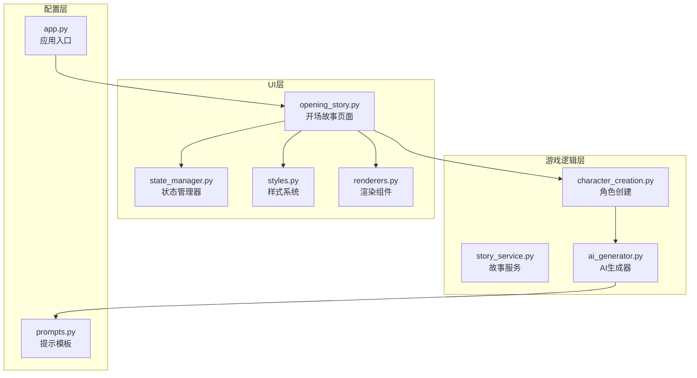
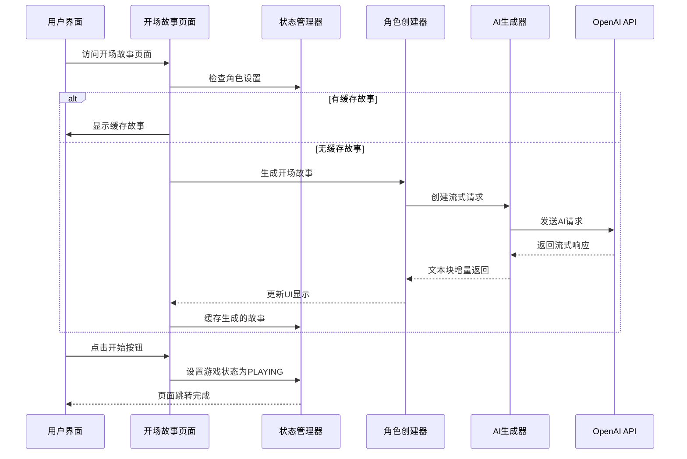
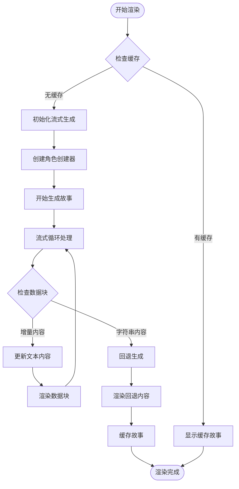
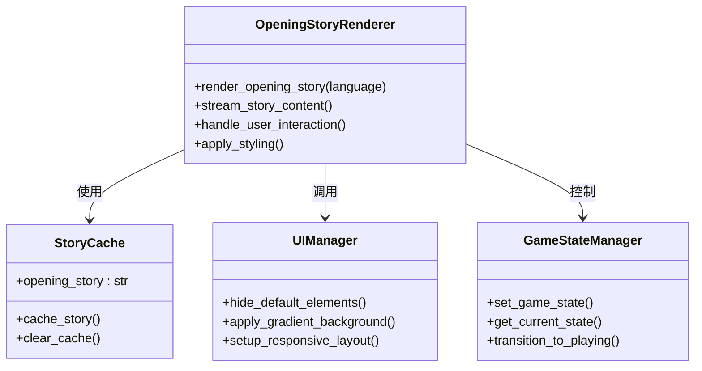
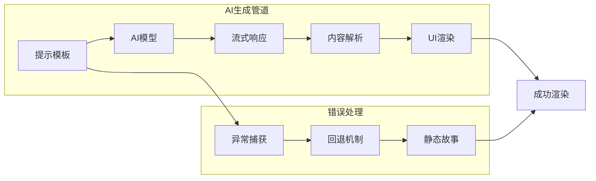
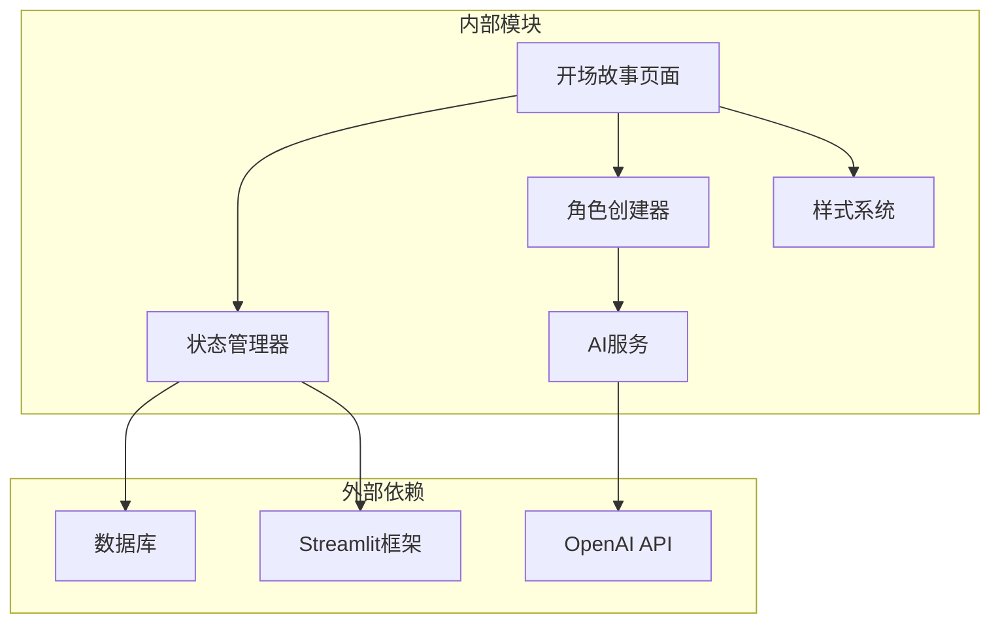

# 开场故事页面

<cite>
**本文档引用的文件**
- [src/ui/page_views/opening_story.py](file://src/ui/page_views/opening_story.py)
- [src/ui/state_manager.py](file://src/ui/state_manager.py)
- [src/ui/session_manager.py](file://src/ui/session_manager.py)
- [src/game/character_creation.py](file://src/game/character_creation.py)
- [src/ai/generator.py](file://src/ai/generator.py)
- [src/ui/styles.py](file://src/ui/styles.py)
- [src/ui/streamlit_app.py](file://src/ui/streamlit_app.py)
- [src/ui/components/renderers.py](file://src/ui/components/renderers.py)
- [src/game/story_service.py](file://src/game/story_service.py)
- [config/prompts.py](file://config/prompts.py)
</cite>

## 目录
1. [简介](#简介)
2. [项目结构](#项目结构)
3. [核心组件](#核心组件)
4. [架构概览](#架构概览)
5. [详细组件分析](#详细组件分析)
6. [依赖关系分析](#依赖关系分析)
7. [性能考虑](#性能考虑)
8. [故障排除指南](#故障排除指南)
9. [结论](#结论)

## 简介

开场故事页面是人生模拟游戏中的关键入口，负责为玩家呈现个性化的人生开端故事。该页面实现了完整的流式故事生成、自动播放控制、用户交互暂停以及无缝的页面跳转机制。

本文档深入分析了开场故事页面的技术实现，包括故事叙述流程、文本渲染机制、状态管理策略和用户体验优化方案。通过详细的代码分析和架构图解，帮助开发者理解和扩展这一核心功能模块。

## 项目结构

开场故事页面位于UI层的页面视图模块中，采用模块化设计，与其他游戏组件形成清晰的职责分离：



**图表来源**
- [src/ui/page_views/opening_story.py](file://src/ui/page_views/opening_story.py#L1-L120)
- [src/ui/state_manager.py](file://src/ui/state_manager.py#L1-L773)
- [src/game/character_creation.py](file://src/game/character_creation.py#L1-L702)

**章节来源**
- [src/ui/page_views/opening_story.py](file://src/ui/page_views/opening_story.py#L1-L120)
- [src/ui/state_manager.py](file://src/ui/state_manager.py#L1-L200)

## 核心组件

开场故事页面由多个核心组件协同工作，形成完整的用户体验：

### 页面渲染组件
- **渲染函数**: `render_opening_story()` - 主要的页面渲染入口
- **流式渲染**: 支持实时文本流式显示
- **缓存机制**: 防止重复生成相同故事

### 状态管理组件
- **游戏状态**: `GameState.OPENING_STORY` - 专门的状态标识
- **会话状态**: `st.session_state.opening_story` - 故事缓存存储
- **全局状态**: `SessionStateManager` - 统一的状态管理接口

### AI生成组件
- **角色创建器**: `CharacterCreator` - 负责故事生成
- **AI客户端**: `EventGenerator` - 底层AI调用封装
- **流式响应**: 支持实时文本增量返回

**章节来源**
- [src/ui/page_views/opening_story.py](file://src/ui/page_views/opening_story.py#L11-L120)
- [src/ui/state_manager.py](file://src/ui/state_manager.py#L29-L40)

## 架构概览

开场故事页面采用分层架构设计，确保各组件职责清晰、耦合度低：



**图表来源**
- [src/ui/page_views/opening_story.py](file://src/ui/page_views/opening_story.py#L42-L118)
- [src/game/character_creation.py](file://src/game/character_creation.py#L541-L596)
- [src/ai/generator.py](file://src/ai/generator.py#L572-L587)

## 详细组件分析

### 开场故事渲染器

开场故事渲染器是页面的核心组件，负责整个故事的展示和交互：

#### 流式文本渲染机制



**图表来源**
- [src/ui/page_views/opening_story.py](file://src/ui/page_views/opening_story.py#L42-L104)

#### 用户交互控制

页面提供了完整的用户交互控制机制：

- **自动播放**: 通过流式API实现实时文本显示
- **暂停功能**: 在生成过程中保持当前进度
- **继续按钮**: 用户手动触发故事继续
- **状态切换**: 一键跳转到游戏主界面

#### 样式和布局优化



**图表来源**
- [src/ui/page_views/opening_story.py](file://src/ui/page_views/opening_story.py#L22-L118)
- [src/ui/styles.py](file://src/ui/styles.py#L5-L704)

**章节来源**
- [src/ui/page_views/opening_story.py](file://src/ui/page_views/opening_story.py#L11-L120)

### 状态管理系统

状态管理系统为开场故事页面提供了可靠的状态管理机制：

#### 游戏状态枚举

```python
class GameState(Enum):
    WELCOME = "welcome"
    CHARACTER_OPTIONS = "character_options"
    CHARACTER_CREATION = "character_creation"
    PRESET_SELECTOR = "preset_selector"
    SAVE_PRESET = "save_preset"
    OPENING_STORY = "opening_story"  # 开场故事专用状态
    PLAYING = "playing"
    ENDED = "ended"
    PROFILE = "profile"
```

#### 会话状态管理

会话状态管理器提供了统一的状态访问接口：

- **核心状态**: `game_state`, `current_game_id`
- **角色状态**: `character_settings`, `player_name`, `life_vision`
- **UI标志**: `opening_story`, `context_chat_history`
- **调试状态**: `debug_logs`

**章节来源**
- [src/ui/state_manager.py](file://src/ui/state_manager.py#L29-L175)

### AI故事生成系统

AI故事生成系统是开场故事页面的技术核心，提供了强大的内容生成能力：

#### 流式生成架构



**图表来源**
- [src/game/character_creation.py](file://src/game/character_creation.py#L541-L596)
- [src/ai/generator.py](file://src/ai/generator.py#L572-L587)

#### 提示模板系统

提示模板系统提供了灵活的故事生成框架：

- **角色背景**: 时代、年龄、性别、家庭背景
- **个人特质**: 性格、能力、兴趣、优缺点
- **故事约束**: 时代背景一致性、人物关系限制
- **质量保证**: 逻辑一致性、因果关系完整性

**章节来源**
- [src/game/character_creation.py](file://src/game/character_creation.py#L541-L596)
- [config/prompts.py](file://config/prompts.py#L580-L671)

## 依赖关系分析

开场故事页面的依赖关系体现了清晰的分层架构：



**图表来源**
- [src/ui/page_views/opening_story.py](file://src/ui/page_views/opening_story.py#L1-L120)
- [src/ui/state_manager.py](file://src/ui/state_manager.py#L1-L100)

### 关键依赖关系

1. **UI层依赖**: 依赖Streamlit框架进行页面渲染
2. **业务逻辑依赖**: 依赖状态管理器进行状态协调
3. **AI服务依赖**: 依赖角色创建器进行内容生成
4. **数据持久化依赖**: 依赖数据库进行状态存储

**章节来源**
- [src/ui/streamlit_app.py](file://src/ui/streamlit_app.py#L1-L215)

## 性能考虑

开场故事页面在性能方面采用了多项优化策略：

### 流式渲染优化
- **增量显示**: 避免一次性渲染大量文本
- **内存管理**: 及时清理临时变量和缓存
- **网络优化**: 减少API调用次数和响应大小

### 缓存策略
- **会话级缓存**: 避免重复生成相同内容
- **智能失效**: 基于用户设置变化的缓存更新
- **内存控制**: 限制缓存大小防止内存泄漏

### 并发处理
- **异步生成**: 支持后台故事生成不影响UI响应
- **错误隔离**: 单个组件故障不影响整体系统
- **资源池化**: 复用AI客户端连接减少开销

## 故障排除指南

### 常见问题及解决方案

#### 故障1: 故事生成失败
**症状**: 页面显示空白或错误信息
**原因**: AI API调用失败或网络问题
**解决方案**: 
1. 检查API密钥配置
2. 验证网络连接状态
3. 查看日志文件获取详细错误信息

#### 故障2: 缓存问题
**症状**: 显示过期或错误的故事内容
**原因**: 缓存未正确更新
**解决方案**:
1. 清除会话状态缓存
2. 重启应用实例
3. 检查缓存存储机制

#### 故障3: 状态同步问题
**症状**: 页面状态混乱或跳转异常
**原因**: 状态管理器冲突
**解决方案**:
1. 重置游戏状态
2. 检查状态转换逻辑
3. 验证状态持久化机制

**章节来源**
- [src/ui/page_views/opening_story.py](file://src/ui/page_views/opening_story.py#L78-L103)

## 结论

开场故事页面展现了现代Web应用的优秀实践，通过合理的架构设计和优化策略，为用户提供了流畅、沉浸式的故事体验。该页面不仅实现了基本的功能需求，还在性能、可维护性和用户体验方面达到了较高水准。

### 技术亮点

1. **流式渲染技术**: 实现了真实的文本生成体验
2. **状态管理系统**: 提供了可靠的状态协调机制
3. **AI集成架构**: 展现了现代化的AI应用模式
4. **样式优化**: 实现了优秀的视觉效果和响应式设计

### 扩展建议

1. **多语言支持**: 增强国际化功能
2. **个性化定制**: 提供更多故事风格选择
3. **性能监控**: 添加详细的性能指标跟踪
4. **A/B测试**: 支持不同故事版本的对比测试

该页面为整个游戏系统奠定了坚实的基础，其设计理念和实现方案值得在其他模块中借鉴和应用。