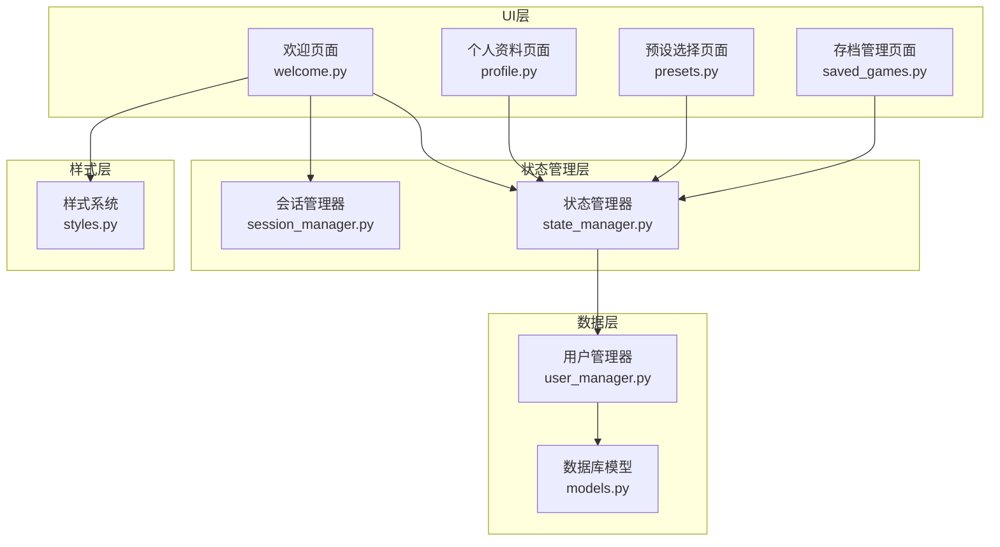
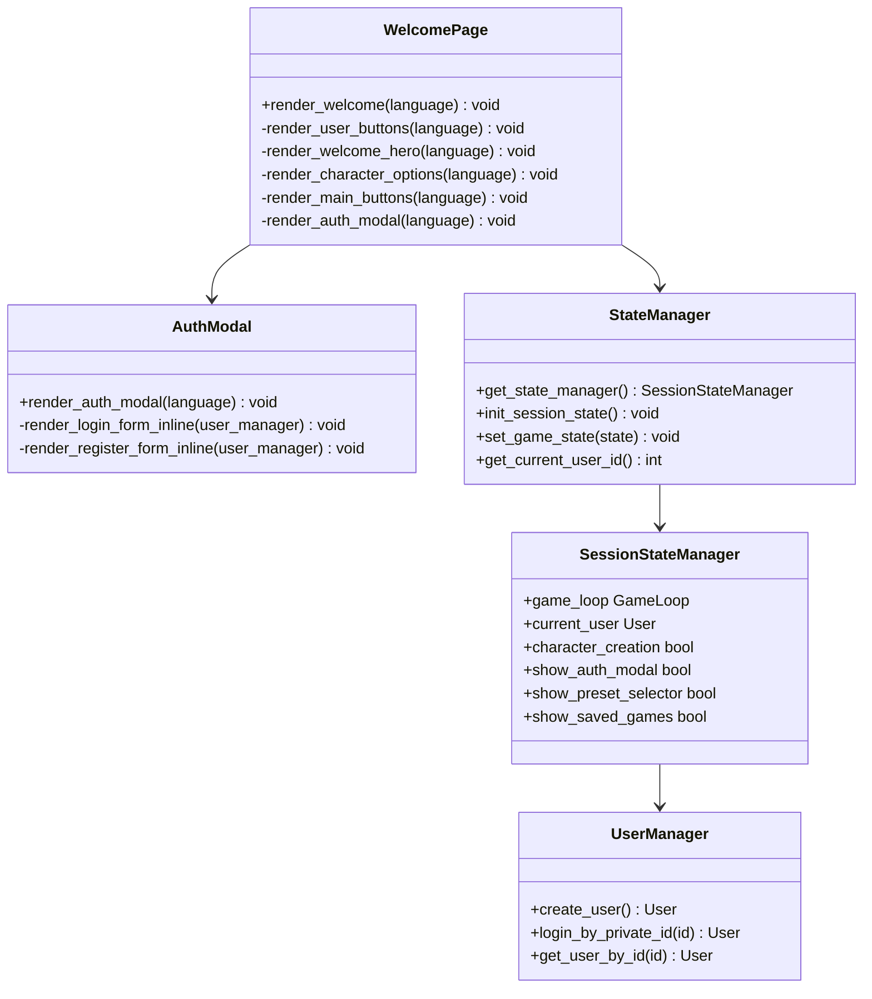
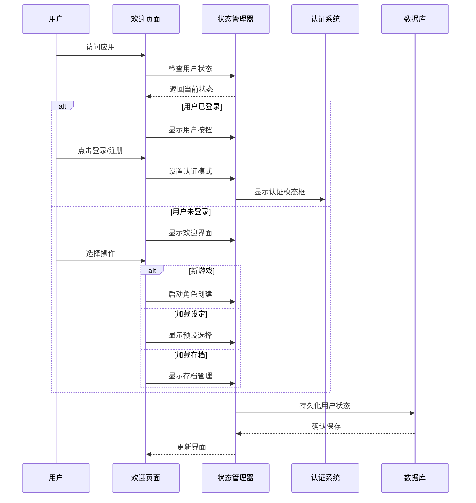
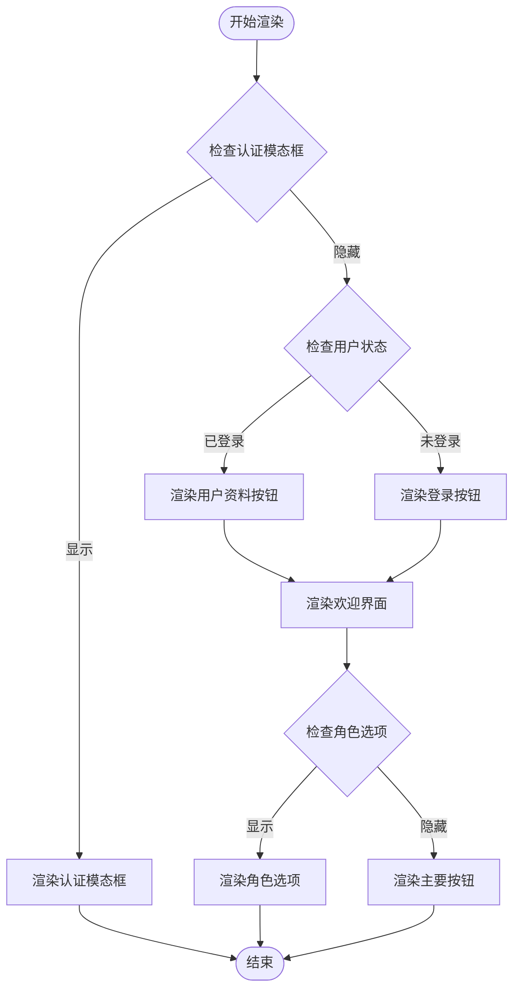
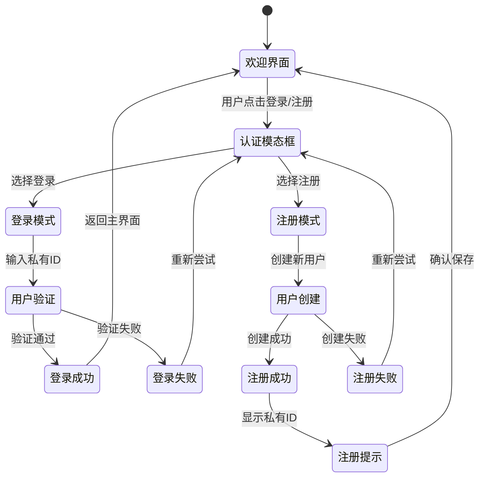
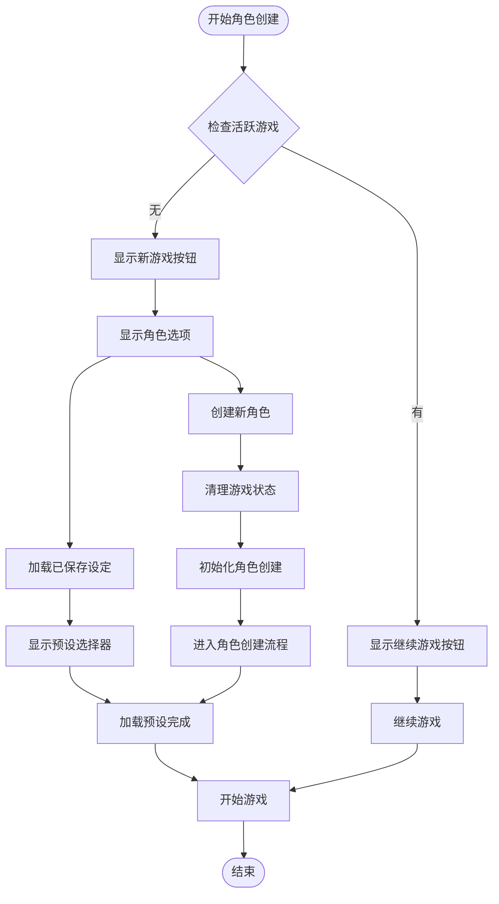
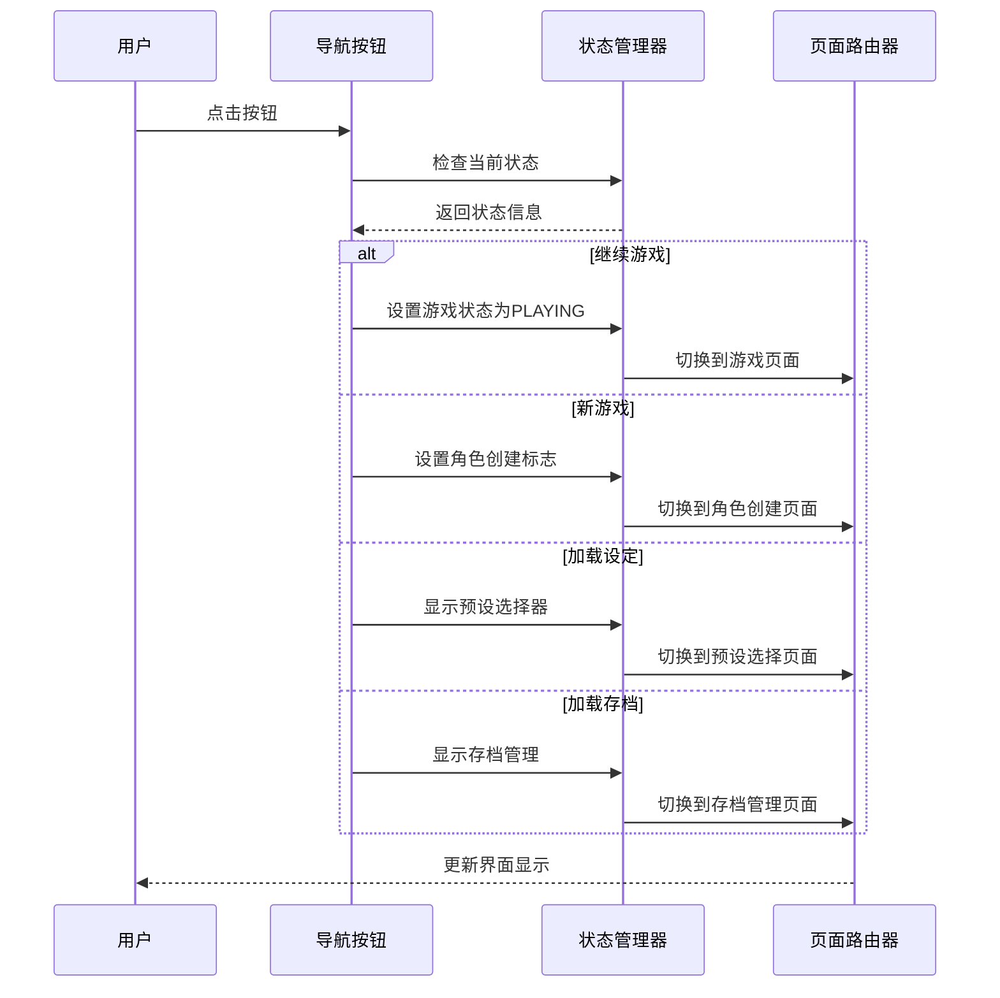
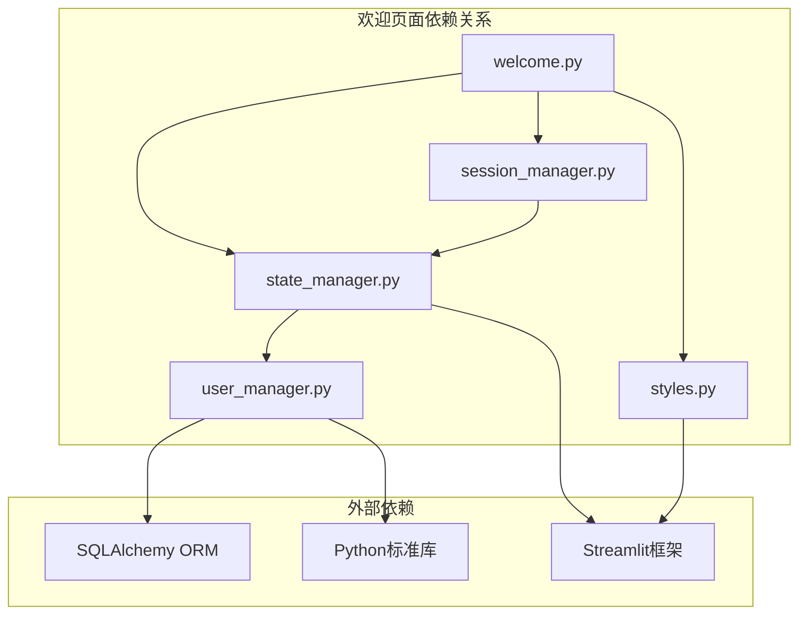

# 欢迎页面

<cite>
**本文档引用的文件**
- [welcome.py](file://src/ui/page_views/welcome.py)
- [streamlit_app.py](file://src/ui/streamlit_app.py)
- [state_manager.py](file://src/ui/state_manager.py)
- [session_manager.py](file://src/ui/session_manager.py)
- [styles.py](file://src/ui/styles.py)
- [user_manager.py](file://src/database/user_manager.py)
- [models.py](file://src/database/models.py)
- [profile.py](file://src/ui/page_views/profile.py)
- [presets.py](file://src/ui/page_views/presets.py)
- [saved_games.py](file://src/ui/page_views/saved_games.py)
</cite>

## 目录
1. [简介](#简介)
2. [项目结构](#项目结构)
3. [核心组件](#核心组件)
4. [架构概览](#架构概览)
5. [详细组件分析](#详细组件分析)
6. [依赖关系分析](#依赖关系分析)
7. [性能考虑](#性能考虑)
8. [故障排除指南](#故障排除指南)
9. [结论](#结论)

## 简介

欢迎页面是人生草稿本游戏的主入口界面，负责为用户提供完整的用户引导流程和游戏导航。该页面实现了现代化的深色主题设计，集成了用户认证系统、角色创建流程、游戏预设管理和存档加载功能。

## 项目结构

欢迎页面位于UI层的page_views包中，采用模块化设计，与其他页面组件协同工作形成完整的用户界面体系。

**图表来源**
- [welcome.py](file://src/ui/page_views/welcome.py#L1-L285)
- [state_manager.py](file://src/ui/state_manager.py#L1-L773)
- [user_manager.py](file://src/database/user_manager.py#L1-L401)

**章节来源**
- [welcome.py](file://src/ui/page_views/welcome.py#L1-L285)
- [streamlit_app.py](file://src/ui/streamlit_app.py#L1-L215)

## 核心组件

欢迎页面由多个精心设计的组件构成，每个组件都有明确的职责和交互逻辑：

### 主要组件架构

**图表来源**
- [welcome.py](file://src/ui/page_views/welcome.py#L11-L285)
- [state_manager.py](file://src/ui/state_manager.py#L42-L547)
- [user_manager.py](file://src/database/user_manager.py#L34-L401)

### 页面布局设计

欢迎页面采用响应式布局设计，支持多种屏幕尺寸：

- **主容器布局**：使用Streamlit的容器组件实现内容隔离
- **网格系统**：采用三列布局（1:2:1比例）突出主要内容区域
- **响应式设计**：针对移动设备优化显示效果
- **动画效果**：包含浮动动画和渐变色彩增强视觉体验

**章节来源**
- [welcome.py](file://src/ui/page_views/welcome.py#L23-L36)
- [styles.py](file://src/ui/styles.py#L694-L702)

## 架构概览

欢迎页面采用分层架构设计，确保代码的可维护性和扩展性：

**图表来源**
- [streamlit_app.py](file://src/ui/streamlit_app.py#L139-L215)
- [welcome.py](file://src/ui/page_views/welcome.py#L11-L285)

## 详细组件分析

### 欢迎界面渲染器

欢迎界面的核心渲染器负责整个页面的布局和内容组织：

#### 主要功能特性

- **动态内容显示**：根据用户状态和应用状态动态调整界面元素
- **模态框管理**：智能控制认证模态框的显示和隐藏
- **用户入口管理**：为已登录和未登录用户提供不同的界面入口
- **响应式布局**：适配不同屏幕尺寸的显示需求

#### 渲染流程

**图表来源**
- [welcome.py](file://src/ui/page_views/welcome.py#L11-L36)

**章节来源**
- [welcome.py](file://src/ui/page_views/welcome.py#L11-L94)

### 用户认证系统

欢迎页面集成了完整的用户认证系统，支持登录和注册两种模式：

#### 认证流程设计

**图表来源**
- [welcome.py](file://src/ui/page_views/welcome.py#L179-L285)
- [user_manager.py](file://src/database/user_manager.py#L68-L127)

#### 认证安全机制

- **私有ID生成**：使用32位随机字符串，格式为8组4位字符，用连字符分隔
- **用户唯一性**：确保私有ID和公有ID的唯一性
- **会话持久化**：支持URL参数和localStorage双重存储机制
- **自动恢复**：断线重连时自动恢复用户会话

**章节来源**
- [welcome.py](file://src/ui/page_views/welcome.py#L179-L285)
- [user_manager.py](file://src/database/user_manager.py#L15-L31)

### 角色创建引导流程

欢迎页面提供了完整的角色创建引导流程，帮助新用户快速开始游戏体验：

#### 角色创建步骤

**图表来源**
- [welcome.py](file://src/ui/page_views/welcome.py#L96-L177)

#### 角色创建状态管理

- **状态隔离**：使用独立的状态变量管理角色创建流程
- **进度跟踪**：支持部分完成的角色设定
- **错误处理**：优雅处理角色创建过程中的各种异常情况
- **用户反馈**：提供清晰的进度指示和操作反馈

**章节来源**
- [welcome.py](file://src/ui/page_views/welcome.py#L96-L177)

### 主要导航按钮系统

欢迎页面提供了直观的导航按钮系统，支持用户快速访问游戏的不同功能：

#### 导航按钮分类

| 按钮类型 | 功能描述 | 触发条件 | 状态影响 |
|---------|----------|----------|----------|
| 继续游戏 | 恢复之前的未完成游戏 | 存在活跃游戏 | 切换到游戏进行状态 |
| 新游戏 | 开始全新的角色创建流程 | 无活跃游戏 | 启动角色创建模式 |
| 加载设定 | 从预设模板开始游戏 | 无活跃游戏 | 显示预设选择器 |
| 加载存档 | 恢复之前的游戏进度 | 已登录用户 | 显示存档管理界面 |

#### 按钮交互逻辑

**图表来源**
- [welcome.py](file://src/ui/page_views/welcome.py#L138-L177)

**章节来源**
- [welcome.py](file://src/ui/page_views/welcome.py#L138-L177)

## 依赖关系分析

欢迎页面的依赖关系体现了清晰的分层架构设计：

**图表来源**
- [welcome.py](file://src/ui/page_views/welcome.py#L1-L10)
- [state_manager.py](file://src/ui/state_manager.py#L14-L26)

### 核心依赖关系

| 依赖模块 | 作用 | 关键功能 |
|---------|------|----------|
| state_manager.py | 状态管理 | 类型安全的状态访问、游戏状态切换 |
| session_manager.py | 会话管理 | 会话状态初始化、用户会话持久化 |
| styles.py | 样式系统 | 自定义CSS注入、响应式设计支持 |
| user_manager.py | 用户管理 | 用户认证、用户数据操作 |

**章节来源**
- [welcome.py](file://src/ui/page_views/welcome.py#L1-L10)
- [state_manager.py](file://src/ui/state_manager.py#L1-L773)

## 性能考虑

欢迎页面在设计时充分考虑了性能优化和用户体验：

### 性能优化策略

1. **懒加载机制**：仅在需要时加载和渲染特定组件
2. **状态缓存**：使用会话状态避免重复计算
3. **条件渲染**：根据用户状态动态决定渲染内容
4. **资源优化**：最小化CSS和JavaScript资源的加载

### 用户体验优化

- **即时反馈**：所有用户操作都有明确的视觉反馈
- **加载指示**：长时间操作显示进度指示器
- **错误处理**：友好的错误消息和恢复选项
- **无障碍设计**：支持键盘导航和屏幕阅读器

## 故障排除指南

### 常见问题及解决方案

#### 认证问题

| 问题症状 | 可能原因 | 解决方案 |
|----------|----------|----------|
| 登录失败 | 私有ID格式错误 | 确认ID格式为8组4位字符，用连字符分隔 |
| 注册失败 | 数据库连接问题 | 检查数据库配置和网络连接 |
| 会话丢失 | 浏览器隐私设置 | 允许第三方Cookie和localStorage |

#### 界面显示问题

| 问题症状 | 可能原因 | 解决方案 |
|----------|----------|----------|
| 页面布局错乱 | CSS加载失败 | 检查网络连接和浏览器缓存 |
| 按钮无响应 | JavaScript错误 | 刷新页面或清除浏览器缓存 |
| 响应式显示异常 | 屏幕尺寸过小 | 调整浏览器窗口大小或使用移动设备 |

#### 性能问题

| 问题症状 | 可能原因 | 解决方案 |
|----------|----------|----------|
| 页面加载缓慢 | 网络延迟 | 检查网络连接质量 |
| 交互卡顿 | 内存泄漏 | 重启浏览器或清理缓存 |
| 数据同步失败 | 网络中断 | 检查网络连接并重试 |

**章节来源**
- [welcome.py](file://src/ui/page_views/welcome.py#L234-L285)
- [user_manager.py](file://src/database/user_manager.py#L104-L127)

## 结论

欢迎页面作为人生草稿本游戏的主入口界面，展现了现代Web应用的设计理念和技术实现。通过模块化的架构设计、完善的用户认证系统和流畅的交互体验，为用户提供了优质的初始使用体验。

该页面的成功实现体现了以下关键设计原则：
- **清晰的层次结构**：各组件职责明确，便于维护和扩展
- **用户导向的设计**：以用户需求为中心的界面布局和交互逻辑
- **技术栈的最佳实践**：充分利用Streamlit框架的优势和特性
- **可扩展的架构**：为未来功能扩展预留了充足的空间

通过持续的优化和完善，欢迎页面将继续为用户提供卓越的使用体验，并为整个游戏系统的稳定运行奠定坚实基础。