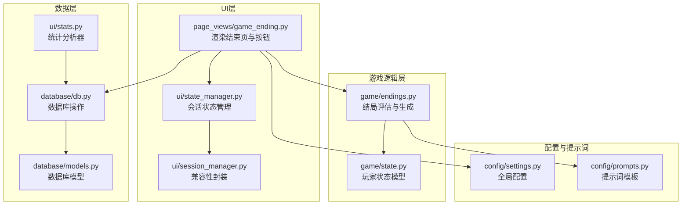
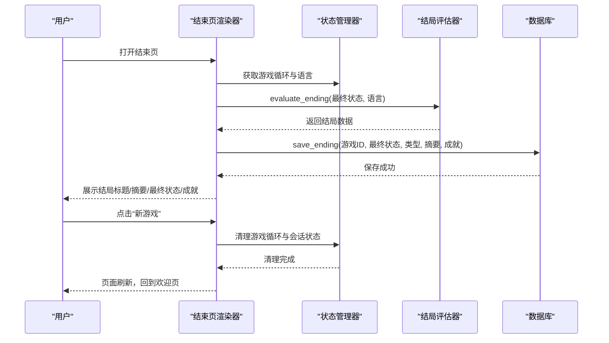
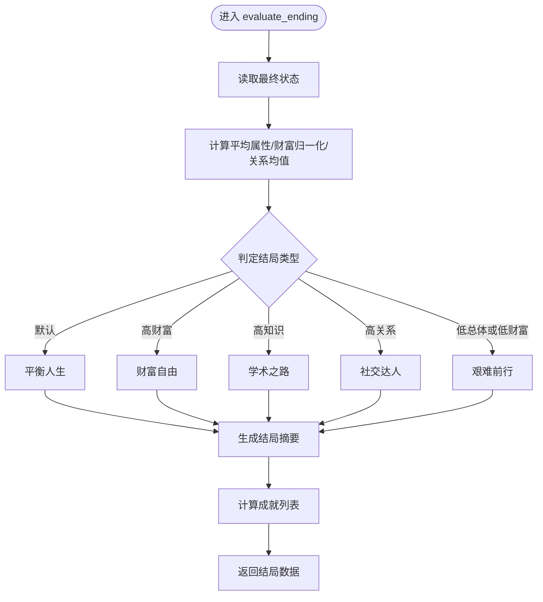
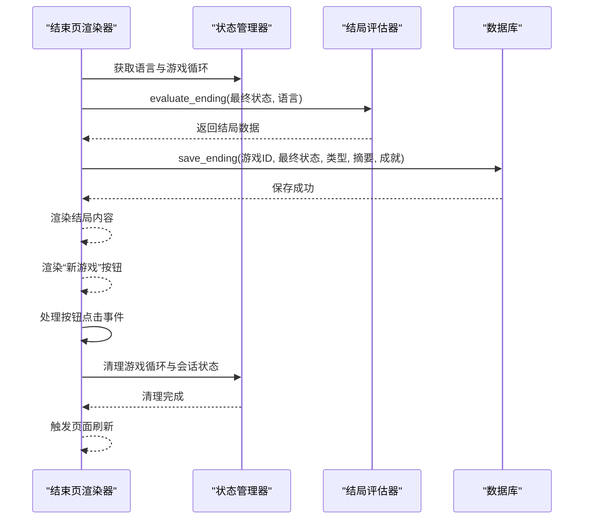
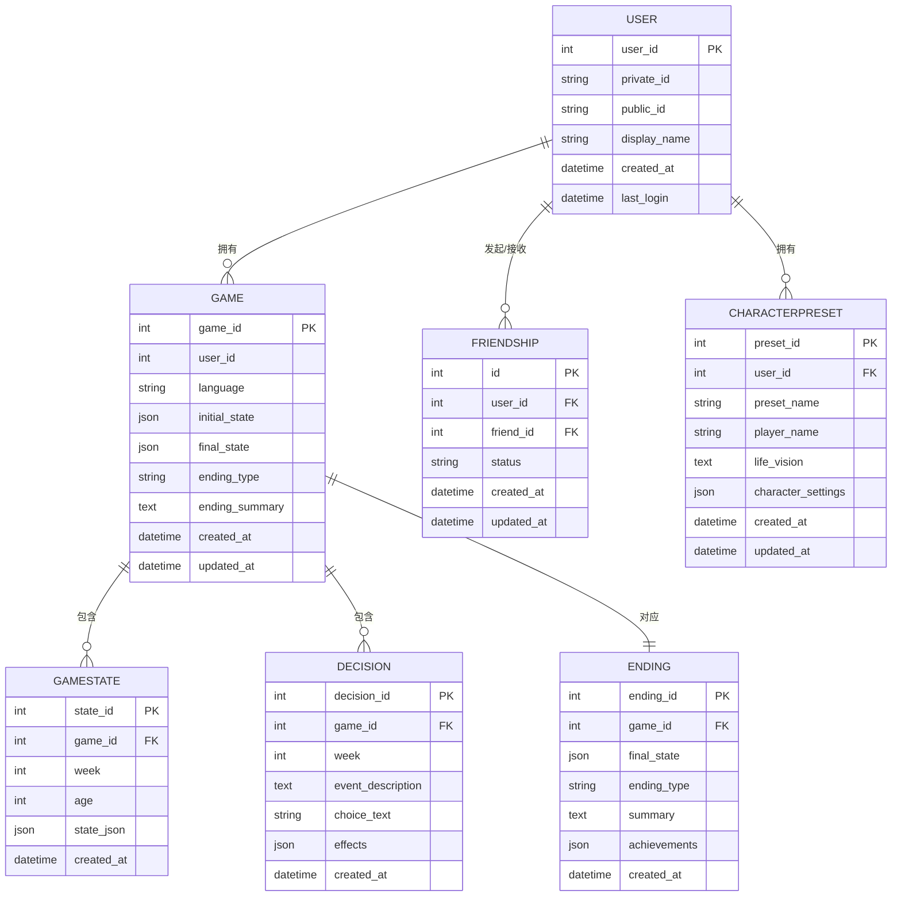
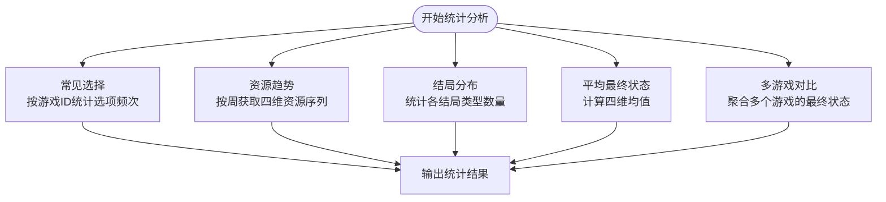
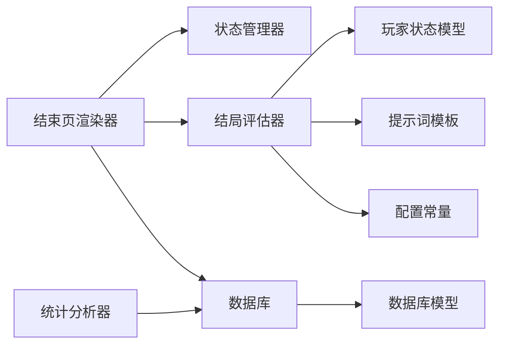

# 游戏结束页面

<cite>
**本文引用的文件**
- [game_ending.py](file://src/ui/page_views/game_ending.py)
- [endings.py](file://src/game/endings.py)
- [state.py](file://src/game/state.py)
- [stats.py](file://src/ui/stats.py)
- [models.py](file://src/database/models.py)
- [db.py](file://src/database/db.py)
- [state_manager.py](file://src/ui/state_manager.py)
- [session_manager.py](file://src/ui/session_manager.py)
- [prompts.py](file://config/prompts.py)
- [settings.py](file://config/settings.py)
</cite>

## 目录
1. [简介](#简介)
2. [项目结构](#项目结构)
3. [核心组件](#核心组件)
4. [架构总览](#架构总览)
5. [详细组件分析](#详细组件分析)
6. [依赖关系分析](#依赖关系分析)
7. [性能考量](#性能考量)
8. [故障排查指南](#故障排查指南)
9. [结论](#结论)
10. [附录](#附录)

## 简介
本技术文档聚焦“游戏结束页面”的实现，涵盖结局展示、结局数据分析与用户反馈收集三大部分。文档将详细说明结局故事呈现、统计数据展示、重新开始与返回菜单功能，并给出渲染结局内容、计算统计指标、处理用户选择与页面跳转的具体实现路径。同时解释结局生成算法、数据可视化与用户体验设计要点，帮助开发者与产品人员快速理解与优化该模块。

## 项目结构
游戏结束页面位于 UI 层的页面视图模块中，通过状态管理器与游戏循环交互，调用结局评估器生成结局，再将结果持久化至数据库。统计数据分析由专门的分析器负责，结合数据库模型与查询接口完成。

图表来源
- [game_ending.py](file://src/ui/page_views/game_ending.py#L1-L96)
- [state_manager.py](file://src/ui/state_manager.py#L1-L773)
- [session_manager.py](file://src/ui/session_manager.py#L1-L65)
- [endings.py](file://src/game/endings.py#L1-L286)
- [state.py](file://src/game/state.py#L1-L709)
- [db.py](file://src/database/db.py#L1-L517)
- [models.py](file://src/database/models.py#L1-L171)
- [stats.py](file://src/ui/stats.py#L1-L183)
- [prompts.py](file://config/prompts.py#L1-L800)
- [settings.py](file://config/settings.py#L1-L100)

章节来源
- [game_ending.py](file://src/ui/page_views/game_ending.py#L1-L96)
- [state_manager.py](file://src/ui/state_manager.py#L1-L773)
- [endings.py](file://src/game/endings.py#L1-L286)
- [db.py](file://src/database/db.py#L1-L517)
- [models.py](file://src/database/models.py#L1-L171)
- [stats.py](file://src/ui/stats.py#L1-L183)
- [prompts.py](file://config/prompts.py#L1-L800)
- [settings.py](file://config/settings.py#L1-L100)

## 核心组件
- 结局评估器（Endings）：根据玩家最终状态计算结局类型、生成结局摘要与成就列表。
- 结束页渲染器（Game Ending Page）：负责展示结局标题、摘要、最终状态、成就与交互按钮。
- 数据库与模型（DB/Models）：持久化结局、最终状态、成就与统计数据。
- 统计分析器（Stats）：提供常见选择、资源趋势、结局分布与平均最终状态等分析。
- 状态管理器（State Manager）：统一管理会话状态、游戏循环与页面切换。

章节来源
- [endings.py](file://src/game/endings.py#L11-L286)
- [game_ending.py](file://src/ui/page_views/game_ending.py#L8-L96)
- [db.py](file://src/database/db.py#L105-L144)
- [models.py](file://src/database/models.py#L113-L127)
- [stats.py](file://src/ui/stats.py#L7-L183)
- [state_manager.py](file://src/ui/state_manager.py#L29-L440)

## 架构总览
结束页面的控制流如下：页面初始化时从状态管理器获取游戏循环与语言；调用结局评估器生成结局数据；将结局持久化到数据库；渲染结局内容；提供“新游戏”按钮触发清理与重置。

图表来源
- [game_ending.py](file://src/ui/page_views/game_ending.py#L58-L96)
- [state_manager.py](file://src/ui/state_manager.py#L178-L244)
- [endings.py](file://src/game/endings.py#L46-L94)
- [db.py](file://src/database/db.py#L105-L144)

## 详细组件分析

### 结局评估与生成（Endings）
- 结局类型判定：基于平均属性、财富归一化与关系均值，综合判断“平衡人生/财富自由/学术之路/社交达人/艰难前行”。
- 摘要生成：优先使用 AI 生成器结合角色设定、近期周总结与决策历史生成个性化摘要；失败时回退到模板摘要。
- 成就计算：依据财富里程碑、知识阈值、关系数量、决策次数与完美周数等条件生成成就列表。

图表来源
- [endings.py](file://src/game/endings.py#L46-L94)
- [endings.py](file://src/game/endings.py#L96-L122)
- [endings.py](file://src/game/endings.py#L123-L223)
- [endings.py](file://src/game/endings.py#L250-L286)

章节来源
- [endings.py](file://src/game/endings.py#L11-L286)

### 结束页渲染与交互（Game Ending Page）
- 渲染结构：标题、结局名称、摘要、最终状态（能量/情绪/学识/财富/关系）、成就列表。
- 交互按钮：“新游戏”按钮禁用处理中状态，点击后清理游戏循环与会话状态并刷新页面。
- 语言支持：根据语言参数切换中文/英文文案。

图表来源
- [game_ending.py](file://src/ui/page_views/game_ending.py#L8-L96)
- [state_manager.py](file://src/ui/state_manager.py#L525-L535)

章节来源
- [game_ending.py](file://src/ui/page_views/game_ending.py#L8-L96)
- [state_manager.py](file://src/ui/state_manager.py#L525-L535)

### 数据持久化与模型（DB/Models）
- 保存结局：更新游戏记录的最终状态与结局类型，同时写入独立的 Ending 记录。
- 数据模型：Game、GameState、Decision、Ending、User、Friendship、CharacterPreset 等。
- 查询接口：按游戏 ID 获取决策历史、资源趋势、结局分布与平均最终状态等。

图表来源
- [models.py](file://src/database/models.py#L11-L171)
- [db.py](file://src/database/db.py#L105-L144)

章节来源
- [db.py](file://src/database/db.py#L105-L144)
- [models.py](file://src/database/models.py#L113-L127)

### 统计数据分析（Statistics Analyzer）
- 常见选择：统计某游戏的选项频率并排序。
- 资源趋势：按周获取能量/情绪/学识/财富的趋势序列。
- 结局分布：统计全量游戏的结局类型分布。
- 平均最终状态：计算所有已完成游戏的最终状态均值。
- 多游戏对比：对多个游戏的最终状态进行横向比较。

图表来源
- [stats.py](file://src/ui/stats.py#L19-L44)
- [stats.py](file://src/ui/stats.py#L46-L83)
- [stats.py](file://src/ui/stats.py#L84-L104)
- [stats.py](file://src/ui/stats.py#L106-L142)
- [stats.py](file://src/ui/stats.py#L144-L183)

章节来源
- [stats.py](file://src/ui/stats.py#L7-L183)

### 用户体验与界面设计
- 文案国际化：标题、副标题、指标名称与成就文案支持中/英双语。
- 布局与交互：使用 Streamlit 的 metric、列布局与按钮组件，保证信息密度与可读性。
- 交互保护：在处理中禁用按钮，避免重复提交或状态冲突。
- 无障碍与一致性：统一使用状态管理器与会话状态，确保跨页面状态一致。

章节来源
- [game_ending.py](file://src/ui/page_views/game_ending.py#L8-L96)
- [state_manager.py](file://src/ui/state_manager.py#L178-L244)

## 依赖关系分析
- 结束页渲染器依赖状态管理器获取语言与游戏循环，依赖结局评估器生成结局数据，依赖数据库保存结局。
- 结局评估器依赖玩家状态模型、AI 生成器与提示词模板，内部使用配置常量。
- 统计分析器依赖数据库模型与查询接口，提供聚合统计。
- 数据库层提供统一的 CRUD 与查询接口，模型定义清晰，支持扩展。

图表来源
- [game_ending.py](file://src/ui/page_views/game_ending.py#L58-L96)
- [state_manager.py](file://src/ui/state_manager.py#L178-L244)
- [endings.py](file://src/game/endings.py#L37-L44)
- [state.py](file://src/game/state.py#L244-L311)
- [prompts.py](file://config/prompts.py#L674-L712)
- [settings.py](file://config/settings.py#L30-L100)
- [stats.py](file://src/ui/stats.py#L10-L18)
- [db.py](file://src/database/db.py#L105-L144)
- [models.py](file://src/database/models.py#L11-L171)

章节来源
- [game_ending.py](file://src/ui/page_views/game_ending.py#L58-L96)
- [endings.py](file://src/game/endings.py#L37-L44)
- [state.py](file://src/game/state.py#L244-L311)
- [stats.py](file://src/ui/stats.py#L10-L18)
- [db.py](file://src/database/db.py#L105-L144)
- [models.py](file://src/database/models.py#L11-L171)

## 性能考量
- 结局生成：AI 生成摘要存在网络延迟，建议在 UI 层加入加载提示与错误降级策略（模板摘要）。
- 数据库写入：保存结局与状态为轻量级操作，建议在 UI 层增加防抖与幂等校验，避免重复提交。
- 统计分析：资源趋势与结局分布查询涉及全表扫描，建议在生产环境启用索引与缓存策略。
- 渲染性能：Streamlit 的 rerun 与按钮禁用机制可减少不必要的重绘，保持交互流畅。

## 故障排查指南
- 结局未保存：检查数据库连接与 save_ending 调用是否成功；确认游戏 ID 有效且用户权限正确。
- 摘要生成失败：查看 AI 客户端异常日志，确认提示词模板与上下文拼装正确。
- 统计数据为空：确认数据库中是否存在对应记录；检查查询条件与过滤逻辑。
- 语言切换异常：确认语言参数传递正确，渲染逻辑中语言分支覆盖完整。

章节来源
- [db.py](file://src/database/db.py#L105-L144)
- [endings.py](file://src/game/endings.py#L123-L223)
- [stats.py](file://src/ui/stats.py#L106-L142)
- [game_ending.py](file://src/ui/page_views/game_ending.py#L8-L96)

## 结论
游戏结束页面通过“状态管理—结局评估—数据持久化—UI 渲染—交互处理”的闭环实现，既保证了结局生成的多样性与个性化，又提供了清晰的数据统计与用户反馈入口。建议在生产环境中强化错误降级、缓存与索引策略，持续优化用户体验与系统稳定性。

## 附录
- 代码示例路径（不展示具体代码内容，仅提供定位）：
  - 结束页渲染函数：[render_ending](file://src/ui/page_views/game_ending.py#L8-L56)
  - 结束页主流程：[render_ending_page](file://src/ui/page_views/game_ending.py#L58-L96)
  - 结局评估主流程：[evaluate_ending](file://src/game/endings.py#L46-L94)
  - 结局类型判定：[_determine_ending_type](file://src/game/endings.py#L96-L122)
  - 摘要生成（AI）：[_generate_summary](file://src/game/endings.py#L123-L223)
  - 摘要生成（模板）：[_generate_template_summary](file://src/game/endings.py#L224-L248)
  - 成就计算：[_calculate_achievements](file://src/game/endings.py#L250-L286)
  - 保存结局：[save_ending](file://src/database/db.py#L105-L144)
  - 常见选择统计：[get_common_choices](file://src/ui/stats.py#L19-L44)
  - 资源趋势统计：[get_resource_trends](file://src/ui/stats.py#L46-L83)
  - 结局分布统计：[get_ending_distribution](file://src/ui/stats.py#L84-L104)
  - 平均最终状态：[get_average_final_stats](file://src/ui/stats.py#L106-L142)
  - 多游戏对比：[compare_games](file://src/ui/stats.py#L144-L183)
  - 状态管理初始化与清理：[init/clear](file://src/ui/state_manager.py#L67-L535)