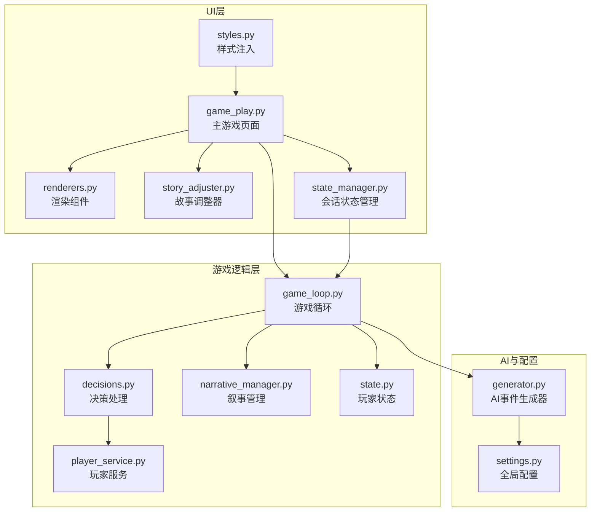
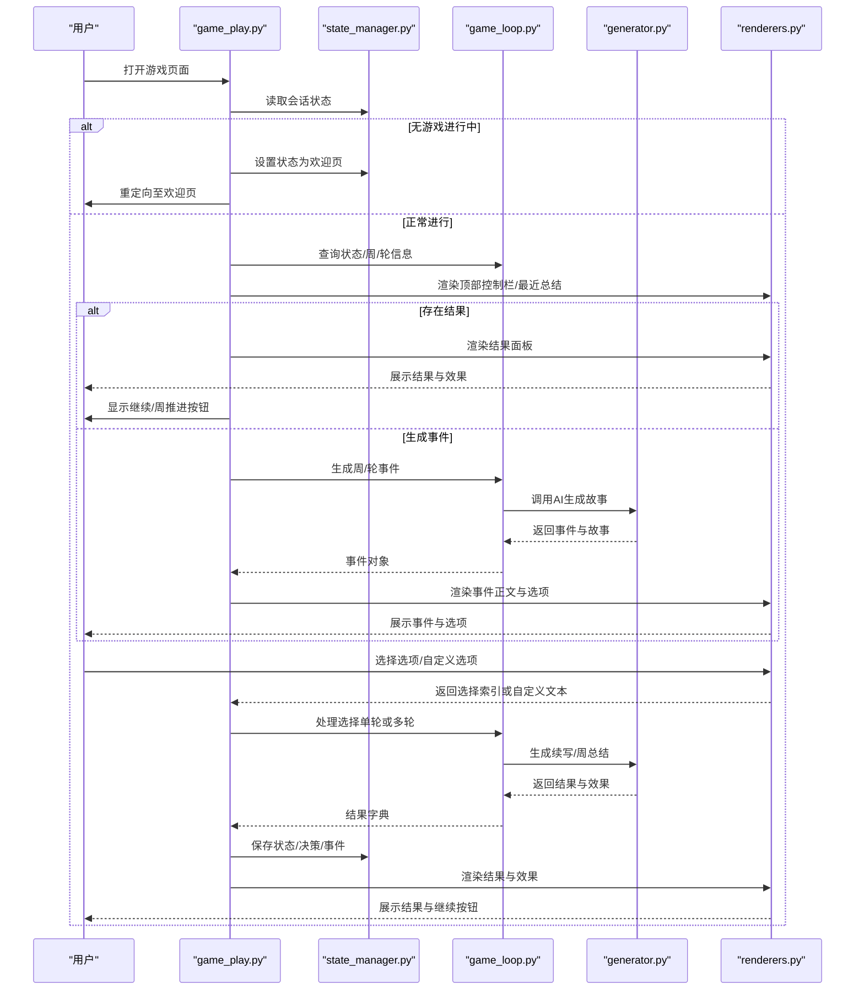
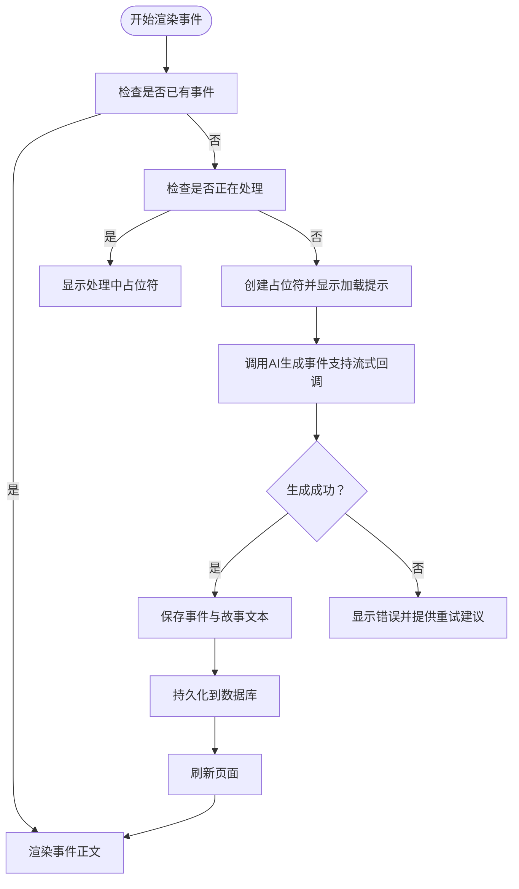
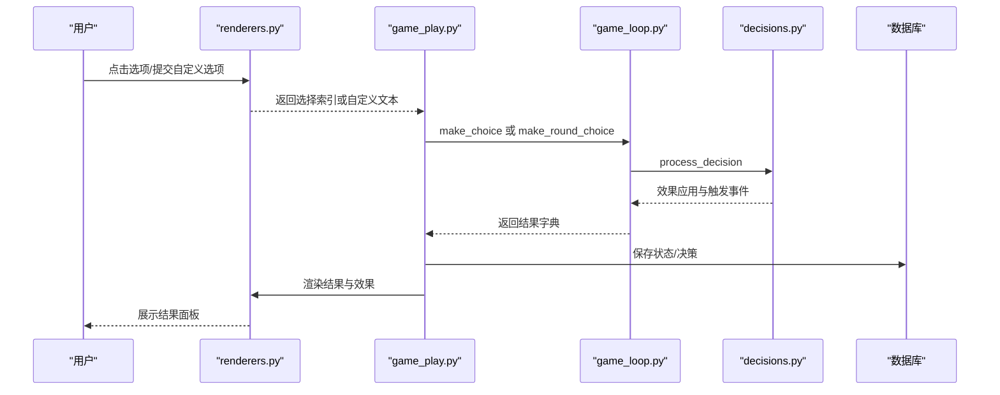
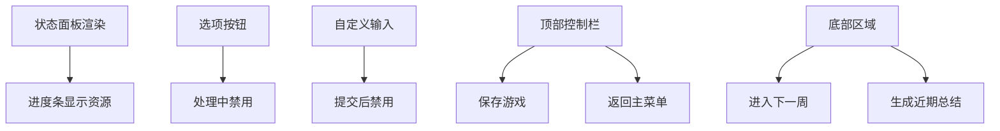
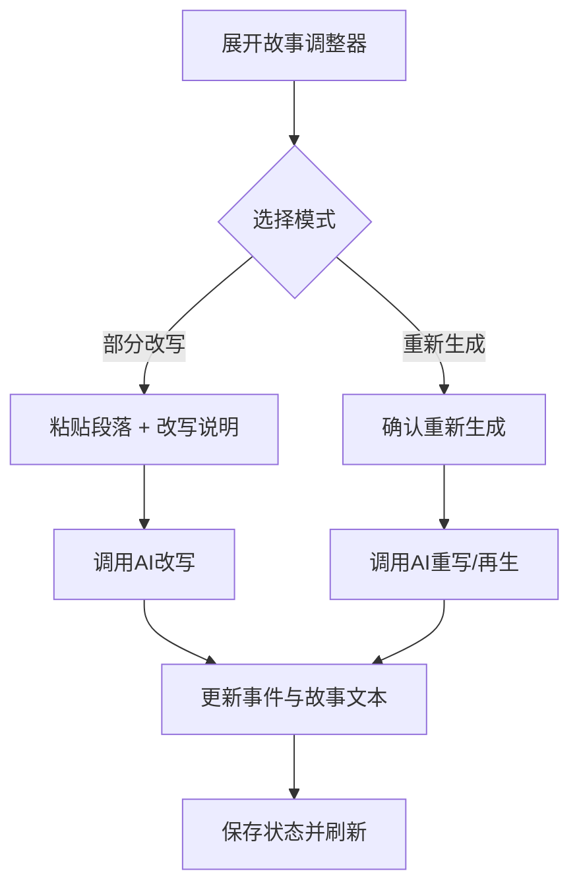
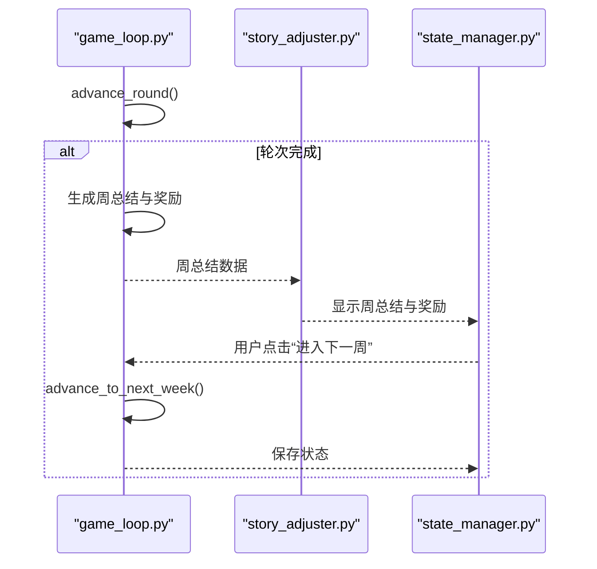
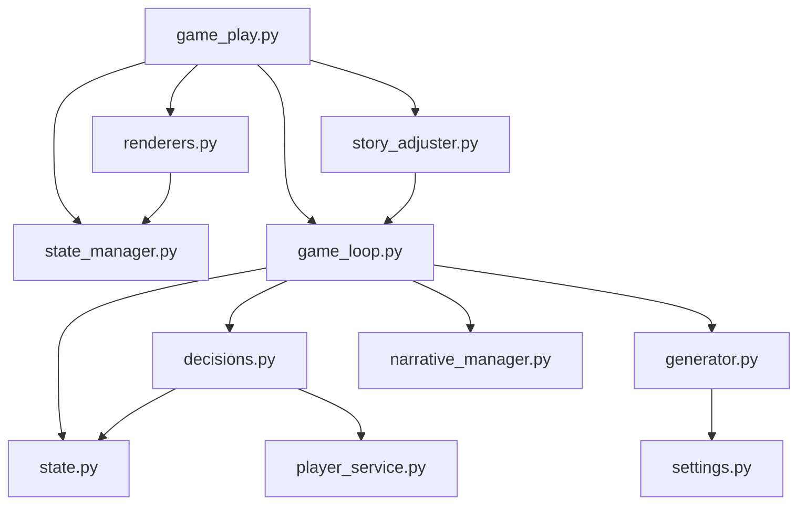

# 游戏进行页面

<cite>
**本文档引用的文件**
- [src/ui/page_views/game_play.py](file://src/ui/page_views/game_play.py)
- [src/game/game_loop.py](file://src/game/game_loop.py)
- [src/game/state.py](file://src/game/state.py)
- [src/game/decisions.py](file://src/game/decisions.py)
- [src/ui/components/renderers.py](file://src/ui/components/renderers.py)
- [src/ui/state_manager.py](file://src/ui/state_manager.py)
- [src/ai/generator.py](file://src/ai/generator.py)
- [src/ui/components/story_adjuster.py](file://src/ui/components/story_adjuster.py)
- [src/game/narrative_manager.py](file://src/game/narrative_manager.py)
- [src/game/player_service.py](file://src/game/player_service.py)
- [config/settings.py](file://config/settings.py)
- [src/ui/styles.py](file://src/ui/styles.py)
</cite>

## 目录
1. [简介](#简介)
2. [项目结构](#项目结构)
3. [核心组件](#核心组件)
4. [架构总览](#架构总览)
5. [详细组件分析](#详细组件分析)
6. [依赖关系分析](#依赖关系分析)
7. [性能考虑](#性能考虑)
8. [故障排查指南](#故障排查指南)
9. [结论](#结论)

## 简介
本技术文档围绕“游戏进行页面”的实现进行深入解析，涵盖事件渲染、用户决策处理、状态更新与结果展示、故事叙述与调整、以及事件流式显示与动画交互机制。文档面向不同技术背景的读者，既提供高层架构概览，也包含代码级细节与可视化图示，帮助开发者快速理解并扩展功能。

## 项目结构
游戏进行页面位于 UI 层的页面视图模块中，通过状态管理器统一调度游戏循环、事件生成与渲染组件，并与 AI 生成器、数据库持久化、配置设置等模块协作。

图表来源
- [src/ui/page_views/game_play.py](file://src/ui/page_views/game_play.py#L1-L662)
- [src/ui/components/renderers.py](file://src/ui/components/renderers.py#L1-L385)
- [src/ui/components/story_adjuster.py](file://src/ui/components/story_adjuster.py#L1-L160)
- [src/ui/state_manager.py](file://src/ui/state_manager.py#L1-L773)
- [src/game/game_loop.py](file://src/game/game_loop.py#L1-L800)
- [src/game/decisions.py](file://src/game/decisions.py#L1-L270)
- [src/game/state.py](file://src/game/state.py#L1-L709)
- [src/game/player_service.py](file://src/game/player_service.py#L1-L176)
- [src/game/narrative_manager.py](file://src/game/narrative_manager.py#L1-L584)
- [src/ai/generator.py](file://src/ai/generator.py#L1-L463)
- [config/settings.py](file://config/settings.py#L1-L100)
- [src/ui/styles.py](file://src/ui/styles.py#L1-L710)

章节来源
- [src/ui/page_views/game_play.py](file://src/ui/page_views/game_play.py#L1-L662)
- [src/ui/state_manager.py](file://src/ui/state_manager.py#L1-L773)

## 核心组件
- 游戏主页面渲染器：负责事件生成、选项渲染、结果展示、周/轮推进、剧情助手与总结生成。
- 游戏循环：封装事件生成、决策处理、周推进、周/年总结、多轮系统与世界模型集成。
- 状态管理：集中管理会话状态、事件与结果缓存、多轮状态、用户与游戏持久化。
- 渲染组件：事件正文、选项按钮、结果面板、调试日志、剧情助手对话。
- AI 事件生成器：故事生成、选项生成、故事压缩与重写、周/年总结生成。
- 玩家状态与服务：资源状态、角色关系、决策效果应用、触发事件检查。
- 叙事管理：故事线、世界事实、伏笔种子、角色习惯的抽取与维护。

章节来源
- [src/ui/page_views/game_play.py](file://src/ui/page_views/game_play.py#L1-L662)
- [src/game/game_loop.py](file://src/game/game_loop.py#L1-L800)
- [src/game/state.py](file://src/game/state.py#L1-L709)
- [src/game/decisions.py](file://src/game/decisions.py#L1-L270)
- [src/ui/components/renderers.py](file://src/ui/components/renderers.py#L1-L385)
- [src/ai/generator.py](file://src/ai/generator.py#L1-L463)
- [src/game/narrative_manager.py](file://src/game/narrative_manager.py#L1-L584)
- [src/game/player_service.py](file://src/game/player_service.py#L1-L176)

## 架构总览
游戏进行页面采用“页面视图-状态管理-游戏循环-渲染组件-AI生成器”的分层架构。页面视图负责用户交互与渲染编排；状态管理器提供统一的会话状态入口；游戏循环承载核心业务逻辑；渲染组件提供 UI 元素；AI 生成器负责文本生成与故事压缩；配置模块提供全局参数。

图表来源
- [src/ui/page_views/game_play.py](file://src/ui/page_views/game_play.py#L1-L662)
- [src/ui/state_manager.py](file://src/ui/state_manager.py#L1-L773)
- [src/game/game_loop.py](file://src/game/game_loop.py#L1-L800)
- [src/ai/generator.py](file://src/ai/generator.py#L1-L463)
- [src/ui/components/renderers.py](file://src/ui/components/renderers.py#L1-L385)

## 详细组件分析

### 事件生成与流式显示
- 页面在“无事件”状态下，先显示加载提示，再通过回调函数逐步渲染生成的故事片段，实现“流式显示”体验。
- 支持强制重新生成与多轮事件生成，事件对象包含故事正文与选项列表。
- 事件生成失败时，提供错误提示与调试日志。

图表来源
- [src/ui/page_views/game_play.py](file://src/ui/page_views/game_play.py#L276-L381)
- [src/game/game_loop.py](file://src/game/game_loop.py#L154-L257)
- [src/ai/generator.py](file://src/ai/generator.py#L183-L238)

章节来源
- [src/ui/page_views/game_play.py](file://src/ui/page_views/game_play.py#L276-L381)
- [src/game/game_loop.py](file://src/game/game_loop.py#L154-L257)
- [src/ai/generator.py](file://src/ai/generator.py#L183-L238)

### 用户决策处理与结果展示
- 渲染选项按钮与自定义输入，支持“自定义选项”直达处理。
- 处理选择时，同步当前事件对象，调用游戏循环进行决策处理，支持单轮与多轮两种路径。
- 决策处理完成后，应用资源变化、角色关系与触发事件，生成结果文本与效果描述，并持久化到数据库。

图表来源
- [src/ui/components/renderers.py](file://src/ui/components/renderers.py#L79-L143)
- [src/ui/page_views/game_play.py](file://src/ui/page_views/game_play.py#L468-L549)
- [src/game/game_loop.py](file://src/game/game_loop.py#L258-L299)
- [src/game/decisions.py](file://src/game/decisions.py#L134-L239)

章节来源
- [src/ui/components/renderers.py](file://src/ui/components/renderers.py#L79-L143)
- [src/ui/page_views/game_play.py](file://src/ui/page_views/game_play.py#L468-L549)
- [src/game/decisions.py](file://src/game/decisions.py#L134-L239)

### 资源状态显示与UI交互
- 左侧边栏状态面板实时显示年龄、周数、精力、情绪、学识与财富等核心资源。
- 选项按钮与自定义输入在处理过程中禁用，防止重复提交。
- 顶部控制栏提供保存、返回主菜单等功能；底部提供周推进与总结生成。

图表来源
- [src/ui/components/renderers.py](file://src/ui/components/renderers.py#L22-L62)
- [src/ui/page_views/game_play.py](file://src/ui/page_views/game_play.py#L100-L127)
- [src/ui/page_views/game_play.py](file://src/ui/page_views/game_play.py#L628-L662)

章节来源
- [src/ui/components/renderers.py](file://src/ui/components/renderers.py#L22-L62)
- [src/ui/page_views/game_play.py](file://src/ui/page_views/game_play.py#L100-L127)
- [src/ui/page_views/game_play.py](file://src/ui/page_views/game_play.py#L628-L662)

### 故事叙述与调整
- 故事调整器支持“部分改写”与“重新生成本轮故事”，允许用户基于当前故事进行局部修改或整体重写。
- 重写时保留角色设定与上下文，确保一致性；重新生成后自动附加新的选项。

图表来源
- [src/ui/components/story_adjuster.py](file://src/ui/components/story_adjuster.py#L10-L160)
- [src/ai/generator.py](file://src/ai/generator.py#L401-L441)

章节来源
- [src/ui/components/story_adjuster.py](file://src/ui/components/story_adjuster.py#L10-L160)
- [src/ai/generator.py](file://src/ai/generator.py#L401-L441)

### 多轮系统与周推进
- 多轮系统将每周拆分为多个轮次，每轮生成独立事件与选项，最终汇总生成周总结与奖励效果。
- 周末或轮次完成时，显示周总结与额外收益，支持进入下一周并自动保存进度。

图表来源
- [src/game/game_loop.py](file://src/game/game_loop.py#L410-L450)
- [src/ui/page_views/game_play.py](file://src/ui/page_views/game_play.py#L192-L243)

章节来源
- [src/game/game_loop.py](file://src/game/game_loop.py#L410-L450)
- [src/ui/page_views/game_play.py](file://src/ui/page_views/game_play.py#L192-L243)

## 依赖关系分析
- 页面视图依赖状态管理器与游戏循环，间接依赖渲染组件与 AI 生成器。
- 游戏循环依赖玩家状态、决策处理、AI 生成器、叙事管理与世界模型更新。
- 决策处理依赖玩家服务与玩家状态，负责资源与角色关系的更新。
- 渲染组件依赖状态管理器与样式注入，提供 UI 元素与交互。
- 配置模块为 AI 生成器与数据库提供参数与连接信息。

图表来源
- [src/ui/page_views/game_play.py](file://src/ui/page_views/game_play.py#L1-L662)
- [src/ui/state_manager.py](file://src/ui/state_manager.py#L1-L773)
- [src/game/game_loop.py](file://src/game/game_loop.py#L1-L800)
- [src/game/state.py](file://src/game/state.py#L1-L709)
- [src/game/decisions.py](file://src/game/decisions.py#L1-L270)
- [src/game/player_service.py](file://src/game/player_service.py#L1-L176)
- [src/ui/components/renderers.py](file://src/ui/components/renderers.py#L1-L385)
- [src/ui/components/story_adjuster.py](file://src/ui/components/story_adjuster.py#L1-L160)
- [src/ai/generator.py](file://src/ai/generator.py#L1-L463)
- [config/settings.py](file://config/settings.py#L1-L100)

章节来源
- [src/ui/page_views/game_play.py](file://src/ui/page_views/game_play.py#L1-L662)
- [src/game/game_loop.py](file://src/game/game_loop.py#L1-L800)

## 性能考虑
- 事件生成与续写采用流式回调，避免一次性渲染大文本导致卡顿。
- 会话状态集中管理，减少跨模块状态同步成本。
- 缓存与重试机制由 AI 生成器提供，降低重复请求与失败重试的开销。
- 周/年总结按需生成，避免频繁计算。

## 故障排查指南
- 事件生成失败：检查 API 密钥与网络配置，查看调试日志与错误提示。
- 选择处理异常：页面会在 finally 中清理备份事件，确保用户可重试；同时记录详细错误堆栈。
- 会话中断：状态管理器提供恢复与清理工具，确保重新连接后可继续游戏。
- UI 交互失效：确认 processing 标志位与按钮禁用状态，避免并发操作。

章节来源
- [src/ui/page_views/game_play.py](file://src/ui/page_views/game_play.py#L369-L381)
- [src/ui/state_manager.py](file://src/ui/state_manager.py#L662-L773)

## 结论
游戏进行页面通过清晰的分层架构与组件化设计，实现了流畅的事件流式显示、直观的用户决策交互、稳定的资源状态展示与强大的故事叙述与调整能力。配合多轮系统与周推进机制，为玩家提供了沉浸式的叙事体验。未来可在 AI 生成质量优化、缓存策略与性能监控方面进一步增强。