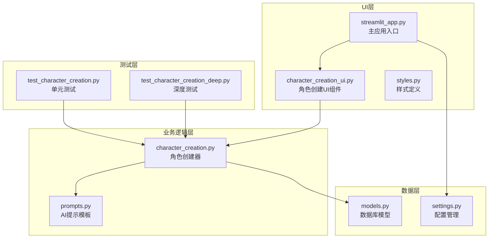
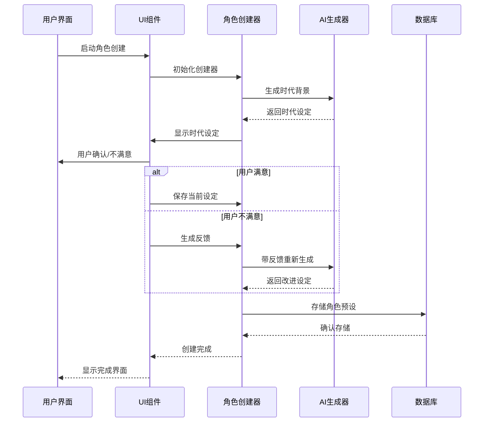
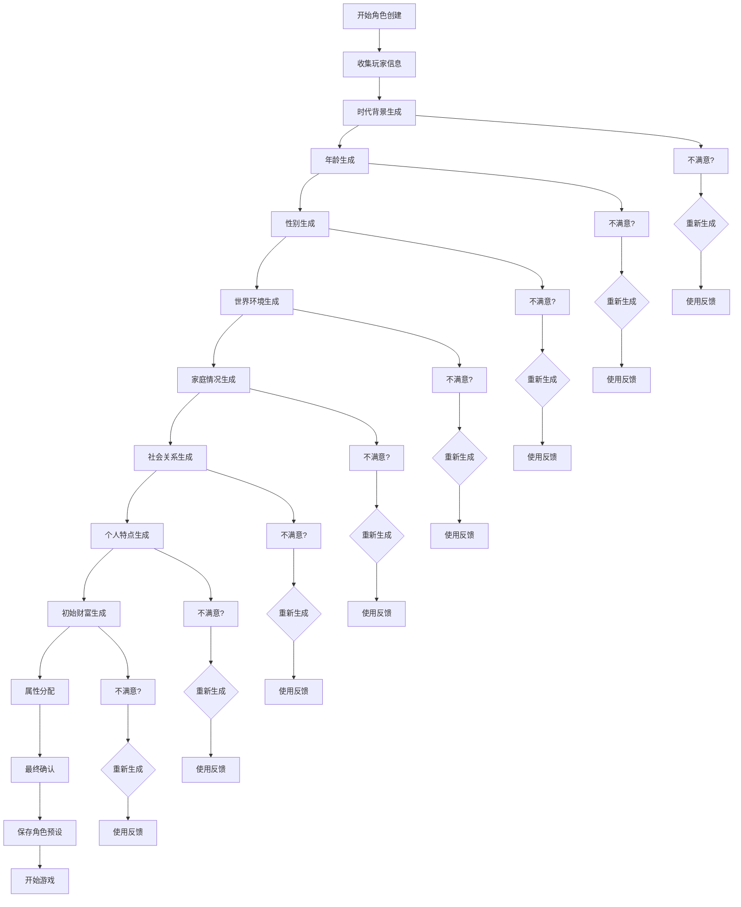
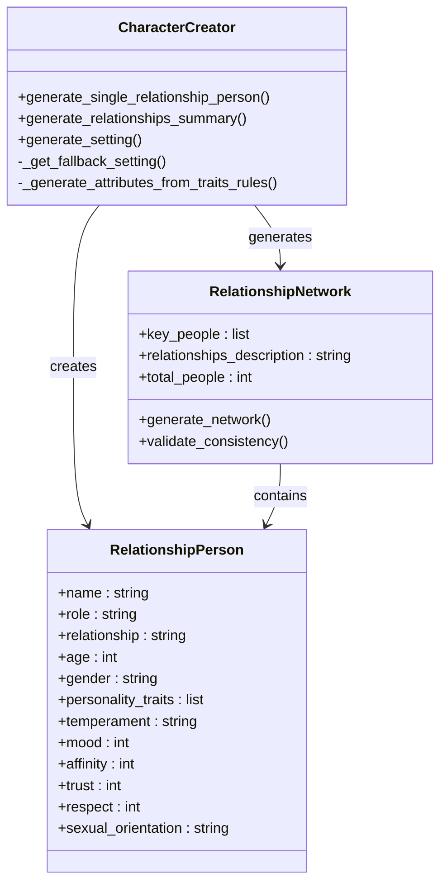
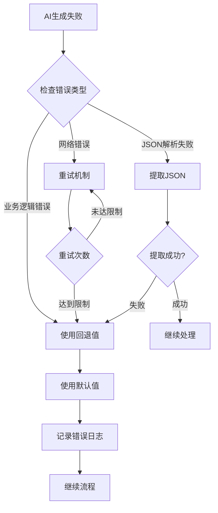
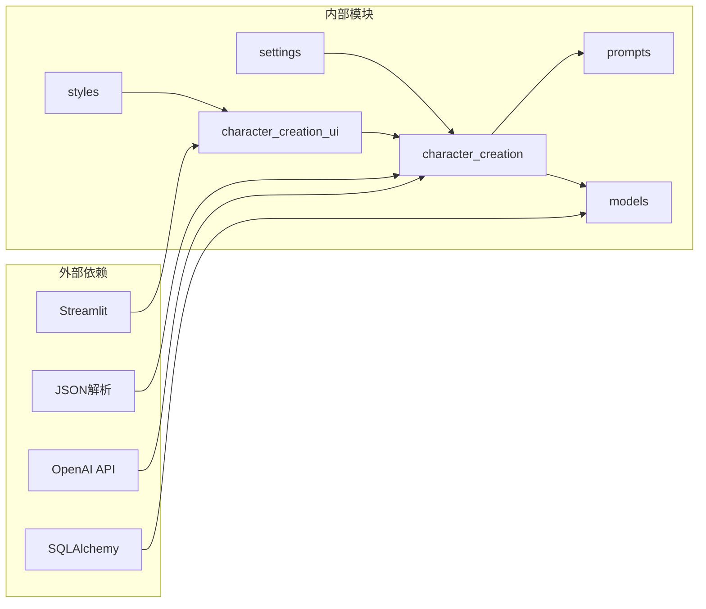

# 角色创建页面

<cite>
**本文档引用的文件**
- [character_creation_ui.py](file://src/ui/character_creation_ui.py)
- [character_creation.py](file://src/game/character_creation.py)
- [prompts.py](file://config/prompts.py)
- [styles.py](file://src/ui/styles.py)
- [models.py](file://src/database/models.py)
- [settings.py](file://config/settings.py)
- [streamlit_app.py](file://src/ui/streamlit_app.py)
- [test_character_creation.py](file://tests/test_character_creation.py)
- [test_character_creation_deep.py](file://tests/test_character_creation_deep.py)
</cite>

## 目录
1. [简介](#简介)
2. [项目结构](#项目结构)
3. [核心组件](#核心组件)
4. [架构概览](#架构概览)
5. [详细组件分析](#详细组件分析)
6. [依赖关系分析](#依赖关系分析)
7. [性能考虑](#性能考虑)
8. [故障排除指南](#故障排除指南)
9. [结论](#结论)

## 简介

角色创建页面是人生草稿本游戏的核心入口界面，负责引导玩家完成角色的基本信息收集、属性分配、外观定制和最终确认提交。该系统采用AI驱动的智能生成机制，结合用户交互反馈，为每个玩家创建独特而丰富的角色背景。

系统实现了完整的角色创建流程，包括时代背景、起始年龄、性别、世界环境、家庭情况、社会关系、个人特点和初始财富等维度的智能生成。同时提供了强大的验证机制和错误处理能力，确保角色设定的质量和一致性。

## 项目结构

角色创建功能分布在多个模块中，形成了清晰的分层架构：

**图表来源**
- [character_creation_ui.py](file://src/ui/character_creation_ui.py#L1-L821)
- [character_creation.py](file://src/game/character_creation.py#L1-L702)
- [prompts.py](file://config/prompts.py#L1-L3648)

**章节来源**
- [character_creation_ui.py](file://src/ui/character_creation_ui.py#L1-L821)
- [character_creation.py](file://src/game/character_creation.py#L1-L702)

## 核心组件

### 角色创建器 (CharacterCreator)

角色创建器是整个系统的核心，负责协调AI生成、数据验证和错误恢复。它实现了以下关键功能：

- **多维度角色生成**：支持时代背景、年龄、性别、世界环境、家庭情况、社会关系、个人特点和初始财富的智能生成
- **AI集成**：通过EventGenerator与AI服务交互，获取高质量的角色设定
- **数据验证**：自动验证生成的数据完整性，确保逻辑一致性
- **错误恢复**：在AI生成失败时提供降级策略和默认值

### UI渲染组件

UI层提供了直观的用户交互界面，包含：

- **步骤化导航**：将复杂的角色创建过程分解为可管理的步骤
- **实时反馈**：提供即时的生成状态和用户反馈
- **自适应布局**：支持中英文双语界面
- **状态管理**：通过session_state维护复杂的用户交互状态

### 数据模型

系统使用SQLAlchemy ORM定义了完整的数据模型，支持角色设定的持久化存储：

- **CharacterPreset**：保存角色预设，支持用户个性化配置
- **User**：用户管理系统，支持登录和角色管理
- **Game**：游戏会话管理，跟踪玩家的游戏进度

**章节来源**
- [character_creation.py](file://src/game/character_creation.py#L37-L540)
- [character_creation_ui.py](file://src/ui/character_creation_ui.py#L8-L334)
- [models.py](file://src/database/models.py#L129-L144)

## 架构概览

角色创建系统的整体架构采用了分层设计，确保了良好的可维护性和扩展性：

**图表来源**
- [streamlit_app.py](file://src/ui/streamlit_app.py#L54-L137)
- [character_creation_ui.py](file://src/ui/character_creation_ui.py#L662-L800)
- [character_creation.py](file://src/game/character_creation.py#L51-L158)

系统采用事件驱动的设计模式，每个角色创建步骤都是一个独立的事件处理器，通过状态机管理整个流程的执行顺序。

## 详细组件分析

### 角色创建流程控制

角色创建流程通过一个智能的状态机实现，支持动态跳转和条件分支：

**图表来源**
- [character_creation_ui.py](file://src/ui/character_creation_ui.py#L662-L800)
- [character_creation.py](file://src/game/character_creation.py#L51-L158)

### 社会关系生成算法

社会关系生成是最复杂的模块，实现了动态的人际关系网络构建：

**图表来源**
- [character_creation.py](file://src/game/character_creation.py#L160-L324)
- [character_creation.py](file://src/game/character_creation.py#L325-L487)

### 数据验证和一致性检查

系统实现了多层次的数据验证机制：

1. **AI生成验证**：检查JSON格式和必需字段
2. **业务逻辑验证**：确保数据间的逻辑一致性
3. **边界值检查**：防止异常值进入系统
4. **回退机制**：在验证失败时提供默认值

**章节来源**
- [character_creation.py](file://src/game/character_creation.py#L137-L158)
- [character_creation.py](file://src/game/character_creation.py#L249-L267)

### 错误处理和恢复策略

系统采用渐进式的错误处理策略：

**图表来源**
- [character_creation.py](file://src/game/character_creation.py#L137-L158)
- [character_creation.py](file://src/game/character_creation.py#L500-L540)

**章节来源**
- [character_creation.py](file://src/game/character_creation.py#L137-L158)
- [character_creation.py](file://src/game/character_creation.py#L500-L540)

## 依赖关系分析

角色创建系统的依赖关系体现了清晰的分层架构：

**图表来源**
- [character_creation_ui.py](file://src/ui/character_creation_ui.py#L1-L6)
- [character_creation.py](file://src/game/character_creation.py#L1-L13)

系统的主要依赖包括：
- **AI服务集成**：通过EventGenerator与OpenAI API交互
- **UI框架**：基于Streamlit构建响应式界面
- **数据持久化**：使用SQLAlchemy ORM管理数据库操作
- **配置管理**：通过Settings类统一管理应用配置

**章节来源**
- [character_creation_ui.py](file://src/ui/character_creation_ui.py#L1-L6)
- [character_creation.py](file://src/game/character_creation.py#L1-L13)
- [settings.py](file://config/settings.py#L30-L100)

## 性能考虑

角色创建系统在性能方面采用了多项优化策略：

### 异步生成优化
- **并行处理**：社会关系生成支持并行处理多个角色
- **缓存机制**：使用session_state缓存中间结果
- **增量更新**：只重新生成受影响的部分

### 内存管理
- **状态清理**：及时清理已完成步骤的临时状态
- **资源释放**：避免内存泄漏和资源浪费
- **批量操作**：减少频繁的数据库访问

### 网络优化
- **重试策略**：智能的重试机制避免网络波动影响
- **超时控制**：合理的超时设置提升用户体验
- **错误隔离**：单个步骤失败不影响整体流程

## 故障排除指南

### 常见问题及解决方案

**AI生成失败**
- 检查OPENAI_API_KEY配置
- 验证网络连接稳定性
- 查看日志文件获取详细错误信息

**角色设定不一致**
- 检查时代背景和年龄的逻辑关系
- 验证家庭背景与社会环境的匹配度
- 确认个人特点与社会关系的合理性

**界面显示异常**
- 刷新浏览器缓存
- 检查CSS样式加载
- 验证浏览器兼容性

### 调试工具

系统提供了完善的调试功能：
- **状态监控**：实时显示session_state的当前状态
- **日志记录**：详细的错误日志和操作记录
- **性能分析**：生成耗时统计和性能指标

**章节来源**
- [streamlit_app.py](file://src/ui/streamlit_app.py#L30-L41)
- [character_creation.py](file://src/game/character_creation.py#L137-L158)

## 结论

角色创建页面系统展现了现代Web应用的最佳实践，通过AI驱动的智能生成、完善的用户交互设计和健壮的错误处理机制，为玩家提供了流畅而丰富的角色创建体验。

系统的主要优势包括：
- **智能化程度高**：AI生成确保每个角色的独特性和合理性
- **用户体验优秀**：直观的界面设计和流畅的交互流程
- **可靠性强**：完善的错误处理和数据验证机制
- **可扩展性好**：模块化的架构便于功能扩展和维护

未来可以进一步优化的方向包括：
- 增加更多的角色定制选项
- 实现更精细的AI提示工程
- 优化移动端适配
- 增强社交功能集成