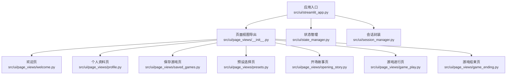
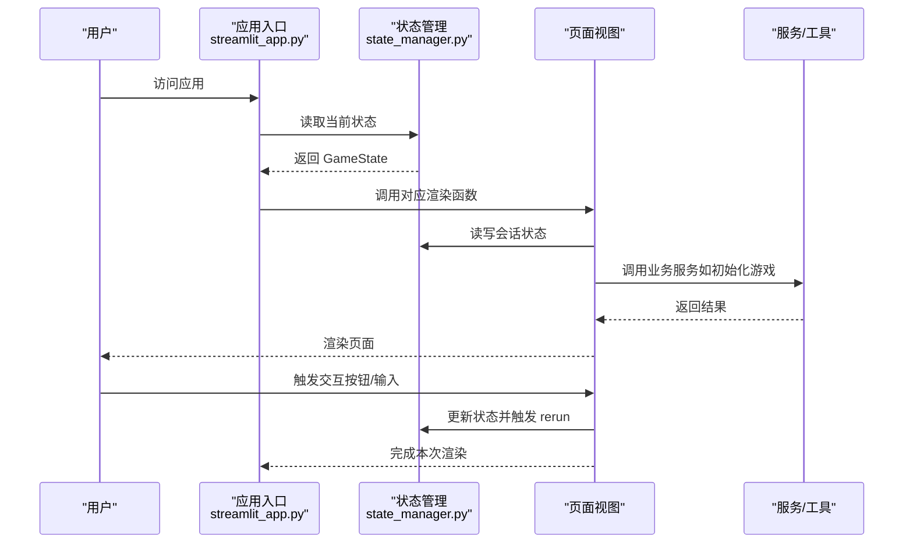
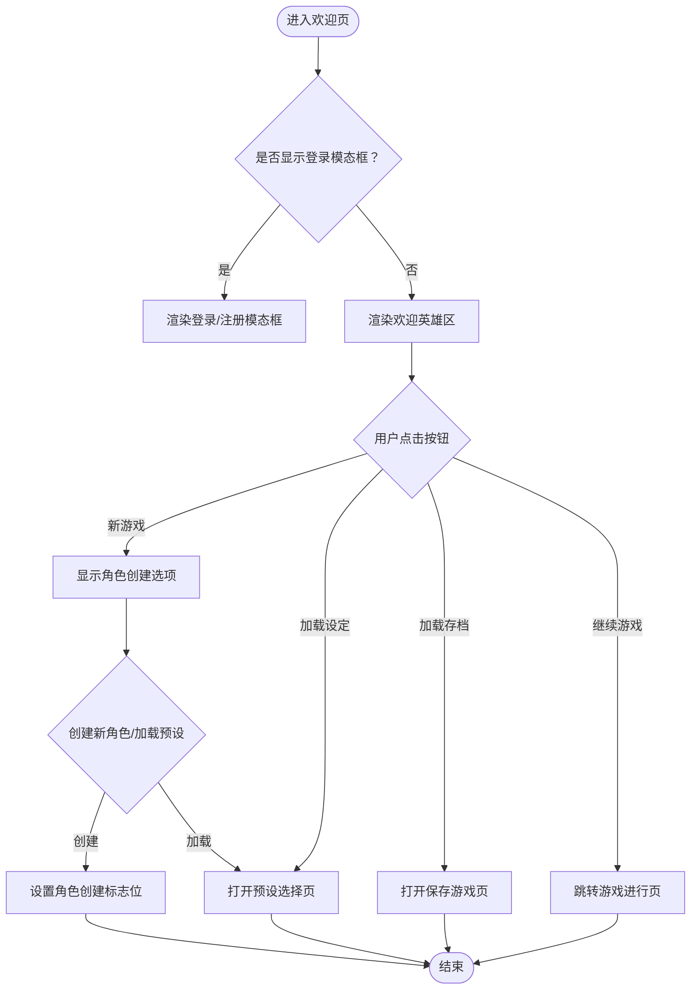
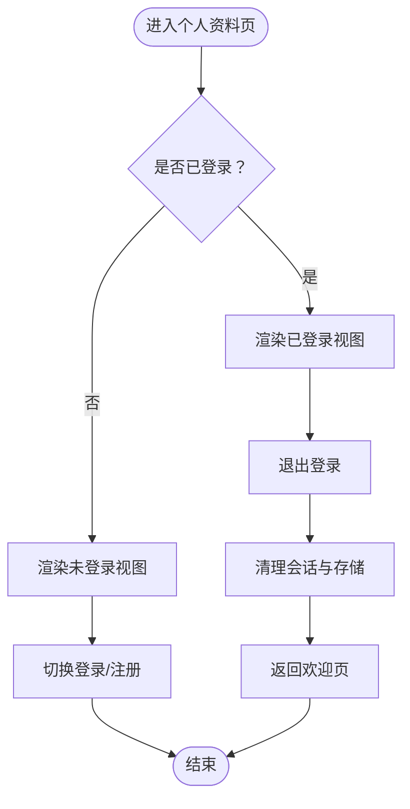
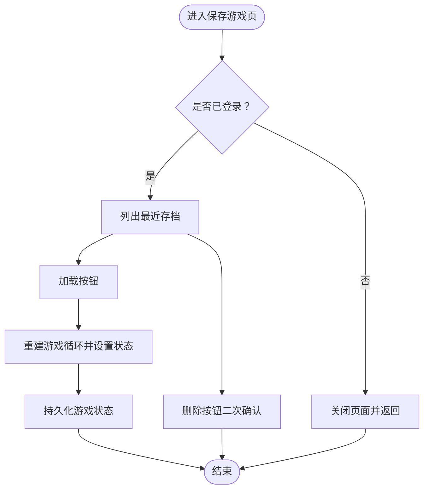
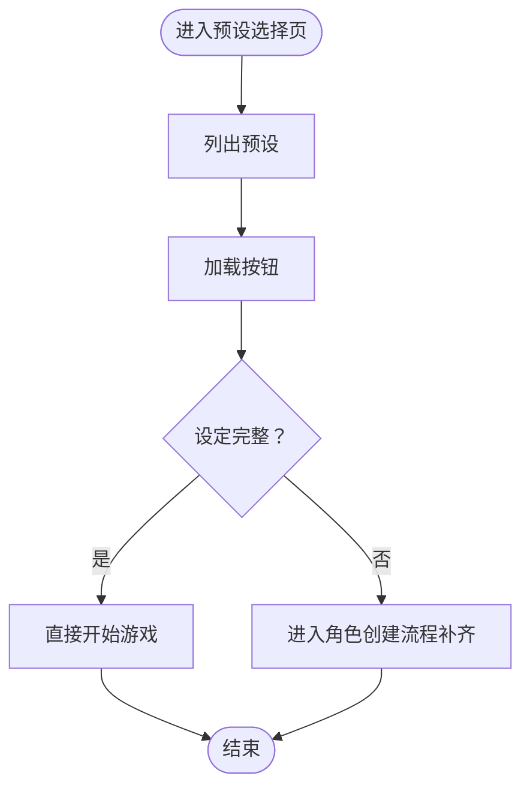
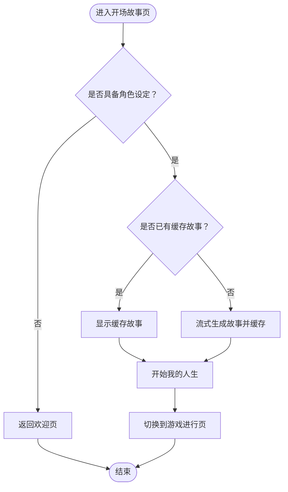
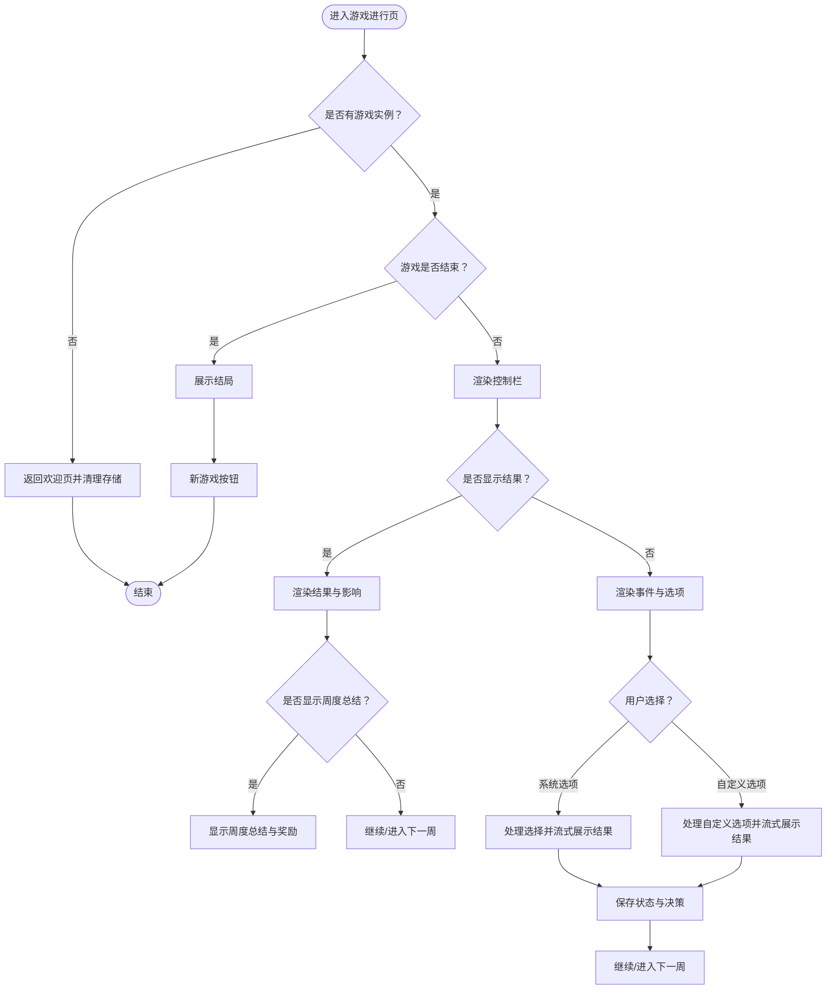
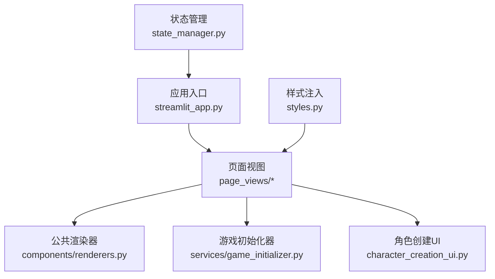

# 页面视图组件

<cite>
**本文档引用的文件**
- [src/ui/page_views/__init__.py](file://src/ui/page_views/__init__.py)
- [src/ui/streamlit_app.py](file://src/ui/streamlit_app.py)
- [src/ui/state_manager.py](file://src/ui/state_manager.py)
- [src/ui/session_manager.py](file://src/ui/session_manager.py)
- [src/ui/page_views/welcome.py](file://src/ui/page_views/welcome.py)
- [src/ui/page_views/profile.py](file://src/ui/page_views/profile.py)
- [src/ui/page_views/saved_games.py](file://src/ui/page_views/saved_games.py)
- [src/ui/page_views/presets.py](file://src/ui/page_views/presets.py)
- [src/ui/page_views/opening_story.py](file://src/ui/page_views/opening_story.py)
- [src/ui/page_views/game_play.py](file://src/ui/page_views/game_play.py)
- [src/ui/page_views/game_ending.py](file://src/ui/page_views/game_ending.py)
- [src/ui/styles.py](file://src/ui/styles.py)
- [src/ui/character_creation_ui.py](file://src/ui/character_creation_ui.py)
- [src/ui/services/game_initializer.py](file://src/ui/services/game_initializer.py)
- [src/ui/components/renderers.py](file://src/ui/components/renderers.py)
</cite>

## 目录
1. [简介](#简介)
2. [项目结构](#项目结构)
3. [核心组件](#核心组件)
4. [架构总览](#架构总览)
5. [详细组件分析](#详细组件分析)
6. [依赖关系分析](#依赖关系分析)
7. [性能考虑](#性能考虑)
8. [故障排查指南](#故障排查指南)
9. [结论](#结论)

## 简介
本文件面向页面视图组件，系统性阐述欢迎页、角色创建页、游戏进行页、个人资料页、保存游戏页、预设选择页等页面的设计与实现。重点覆盖：
- 页面路由机制与状态机驱动的页面切换
- 用户交互处理与页面状态管理
- 页面复用设计、国际化支持与响应式布局
- 从入口到渲染的完整调用链路与数据流

## 项目结构
页面视图位于 `src/ui/page_views/`，通过统一入口导出，并由应用主入口按状态机路由分发渲染。

图表来源
- [src/ui/streamlit_app.py](file://src/ui/streamlit_app.py#L139-L211)
- [src/ui/page_views/__init__.py](file://src/ui/page_views/__init__.py#L1-L20)

章节来源
- [src/ui/page_views/__init__.py](file://src/ui/page_views/__init__.py#L1-L20)
- [src/ui/streamlit_app.py](file://src/ui/streamlit_app.py#L139-L211)

## 核心组件
- 应用入口与路由：根据状态机枚举决定渲染哪个页面视图，优先级与条件分支明确。
- 状态机与会话：通过集中式状态管理器统一读写会话状态，保证跨页面一致性。
- 页面视图：每个页面负责自身渲染、交互与状态流转，遵循统一的国际化与样式规范。
- 组件复用：公共渲染器模块提供事件、选项、结果、上下文聊天等通用组件。

章节来源
- [src/ui/streamlit_app.py](file://src/ui/streamlit_app.py#L139-L211)
- [src/ui/state_manager.py](file://src/ui/state_manager.py#L29-L40)
- [src/ui/session_manager.py](file://src/ui/session_manager.py#L31-L64)
- [src/ui/components/renderers.py](file://src/ui/components/renderers.py#L64-L144)

## 架构总览
页面视图采用“状态机驱动 + 分层渲染”的架构：
- 状态机：定义页面状态集合，驱动路由与渲染。
- 路由器：根据当前状态选择对应页面渲染函数。
- 页面：负责UI渲染、用户交互、状态更新与页面跳转。
- 服务：如游戏初始化器、角色创建UI等，为页面提供业务能力。

图表来源
- [src/ui/streamlit_app.py](file://src/ui/streamlit_app.py#L139-L211)
- [src/ui/state_manager.py](file://src/ui/state_manager.py#L215-L244)
- [src/ui/services/game_initializer.py](file://src/ui/services/game_initializer.py#L63-L138)

## 详细组件分析

### 欢迎页面（Welcome）
- 功能要点
  - 主菜单入口：新游戏、加载设定、加载存档、继续游戏等。
  - 登录/注册：右上角用户入口或弹窗登录。
  - 角色创建入口：创建新角色或加载已保存设定。
- 关键交互
  - 点击“新游戏” → 展示角色创建选项。
  - 点击“加载设定” → 打开预设选择页。
  - 点击“加载存档” → 打开保存游戏页。
  - 点击“继续游戏” → 跳转至游戏进行页。
- 状态流转
  - 设置角色创建标志位，或打开预设选择/保存游戏页面标志位。
  - 保存当前游戏状态以便断线重连恢复。

图表来源
- [src/ui/page_views/welcome.py](file://src/ui/page_views/welcome.py#L11-L177)

章节来源
- [src/ui/page_views/welcome.py](file://src/ui/page_views/welcome.py#L11-L177)

### 个人资料页面（Profile）
- 功能要点
  - 登录后展示用户信息与登出功能。
  - 未登录时提供登录/注册入口与成功提示。
  - 好友系统：添加好友、查看好友列表、处理好友请求。
- 关键交互
  - 登录/注册按钮切换。
  - 好友请求接受/拒绝。
  - 退出登录清理用户与游戏存储并返回欢迎页。

图表来源
- [src/ui/page_views/profile.py](file://src/ui/page_views/profile.py#L10-L143)

章节来源
- [src/ui/page_views/profile.py](file://src/ui/page_views/profile.py#L10-L143)

### 保存游戏页面（Saved Games）
- 功能要点
  - 展示用户已保存的游戏记录（最近10条）。
  - 支持加载与删除操作。
  - 返回按钮回到欢迎页。
- 关键交互
  - 加载：读取存档状态，重建游戏循环，设置状态为“进行中”，并持久化URL参数。
  - 删除：二次确认，调用数据库接口删除。

图表来源
- [src/ui/page_views/saved_games.py](file://src/ui/page_views/saved_games.py#L12-L50)
- [src/ui/page_views/saved_games.py](file://src/ui/page_views/saved_games.py#L107-L153)

章节来源
- [src/ui/page_views/saved_games.py](file://src/ui/page_views/saved_games.py#L12-L180)

### 预设选择页面（Presets）
- 功能要点
  - 展示用户保存的角色设定列表。
  - 支持加载、删除、返回。
  - 加载后若设定完整则直接开始游戏；否则进入角色创建流程补齐缺失设置。
  - 保存设定对话框：可仅保存或保存并开始游戏。
- 关键交互
  - 加载：校验设定完整性，必要时进入角色创建流程。
  - 保存：调用数据库保存角色设定，可选择立即开始游戏。
  - 删除：调用数据库删除预设。

图表来源
- [src/ui/page_views/presets.py](file://src/ui/page_views/presets.py#L15-L41)
- [src/ui/page_views/presets.py](file://src/ui/page_views/presets.py#L117-L168)
- [src/ui/page_views/presets.py](file://src/ui/page_views/presets.py#L170-L202)

章节来源
- [src/ui/page_views/presets.py](file://src/ui/page_views/presets.py#L15-L236)
- [src/ui/page_views/presets.py](file://src/ui/page_views/presets.py#L238-L425)

### 开场故事页面（Opening Story）
- 功能要点
  - 展示角色设定生成的开场故事，支持流式渲染。
  - 缓存生成内容，避免重复计算。
  - 点击“开始我的人生”进入游戏进行页。
- 关键交互
  - 生成/缓存故事文本。
  - 点击按钮切换状态为“进行中”。

图表来源
- [src/ui/page_views/opening_story.py](file://src/ui/page_views/opening_story.py#L11-L120)

章节来源
- [src/ui/page_views/opening_story.py](file://src/ui/page_views/opening_story.py#L11-L120)

### 游戏进行页面（Game Play）
- 功能要点
  - 事件展示与选项选择，支持自定义选项。
  - 结果展示与影响解析，支持周度/轮次总结。
  - 控制栏：保存、返回主菜单。
  - 上下文聊天：基于当前事件与角色设定的剧情助手。
  - 结束检测：评估结局并展示。
- 关键交互
  - 事件生成：支持多轮/单周模式，流式展示故事。
  - 选择处理：系统选项或自定义选项，流式展示结果。
  - 总结生成：年度/近期总结，支持关闭与继续。
  - 保存：自动保存当前状态与决策。

图表来源
- [src/ui/page_views/game_play.py](file://src/ui/page_views/game_play.py#L18-L67)
- [src/ui/page_views/game_play.py](file://src/ui/page_views/game_play.py#L276-L381)
- [src/ui/page_views/game_play.py](file://src/ui/page_views/game_play.py#L383-L406)
- [src/ui/page_views/game_play.py](file://src/ui/page_views/game_play.py#L468-L550)
- [src/ui/page_views/game_play.py](file://src/ui/page_views/game_play.py#L552-L588)
- [src/ui/page_views/game_play.py](file://src/ui/page_views/game_play.py#L591-L662)

章节来源
- [src/ui/page_views/game_play.py](file://src/ui/page_views/game_play.py#L18-L662)

### 游戏结束页面（Game Ending）
- 功能要点
  - 展示结局名称、总结、最终状态与成就。
  - 提供“新游戏”按钮，清理状态并返回欢迎页。
- 关键交互
  - 评估结局并保存到数据库。
  - 清理游戏存储并重置状态。

章节来源
- [src/ui/page_views/game_ending.py](file://src/ui/page_views/game_ending.py#L8-L96)

## 依赖关系分析
- 页面视图依赖状态管理器读写会话状态，确保跨页面一致性。
- 应用入口集中路由，避免分散的条件判断。
- 服务层（如游戏初始化器）解耦业务逻辑，供多个页面共享。
- 公共组件（渲染器）提供复用能力，降低重复代码。

图表来源
- [src/ui/streamlit_app.py](file://src/ui/streamlit_app.py#L13-L18)
- [src/ui/state_manager.py](file://src/ui/state_manager.py#L1-L26)
- [src/ui/components/renderers.py](file://src/ui/components/renderers.py#L1-L8)

章节来源
- [src/ui/streamlit_app.py](file://src/ui/streamlit_app.py#L13-L18)
- [src/ui/state_manager.py](file://src/ui/state_manager.py#L1-L26)
- [src/ui/services/game_initializer.py](file://src/ui/services/game_initializer.py#L49-L138)
- [src/ui/character_creation_ui.py](file://src/ui/character_creation_ui.py#L662-L800)
- [src/ui/components/renderers.py](file://src/ui/components/renderers.py#L1-L8)

## 性能考虑
- 流式渲染：事件与结果采用流式展示，提升感知性能与交互流畅度。
- 缓存策略：开场故事与部分中间结果缓存于会话状态，减少重复计算。
- 状态持久化：URL参数与localStorage结合，支持断线重连与自动恢复。
- 事件生成保护：处理中状态标记防止重复生成与脚本中断导致的重复事件。

## 故障排查指南
- 登录/注册异常
  - 检查用户存储与URL参数同步逻辑，确认localStorage回填流程。
  - 查看调试控制台日志，定位错误来源。
- 游戏初始化失败
  - 检查OPENAI相关环境变量是否正确配置。
  - 查看初始化器日志，确认角色设定完整性与数据库记录创建。
- 事件生成失败
  - 查看事件生成回调与流式占位符更新逻辑。
  - 检查处理中状态标记与异常捕获后的状态清理。
- 存档加载失败
  - 校验用户权限与存档存在性，确认状态数据完整性。
  - 检查事件缓存与故事文本恢复逻辑。

章节来源
- [src/ui/state_manager.py](file://src/ui/state_manager.py#L587-L626)
- [src/ui/services/game_initializer.py](file://src/ui/services/game_initializer.py#L88-L138)
- [src/ui/page_views/game_play.py](file://src/ui/page_views/game_play.py#L324-L381)
- [src/ui/page_views/saved_games.py](file://src/ui/page_views/saved_games.py#L114-L153)

## 结论
页面视图组件以状态机为核心，配合集中式状态管理与服务层抽象，实现了高内聚、低耦合的UI架构。通过流式渲染、缓存与持久化策略，兼顾了用户体验与系统性能。国际化与样式模块进一步提升了跨语言与跨设备的适配能力。建议后续持续优化事件生成的容错与可观测性，并扩展更多页面的复用组件库。