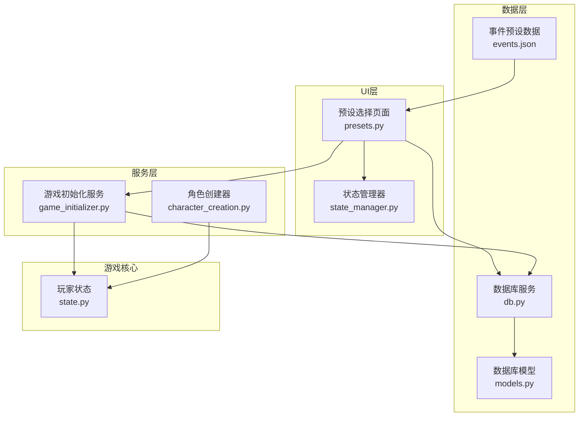
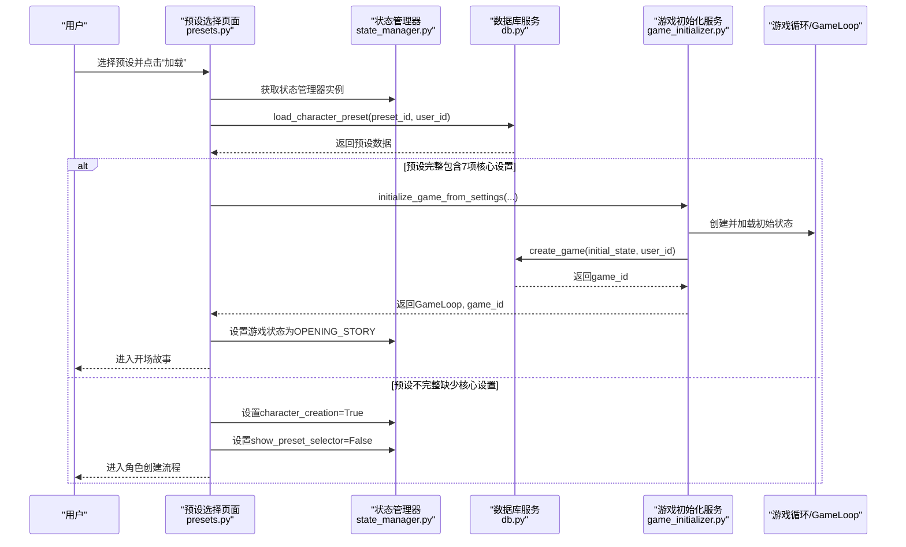
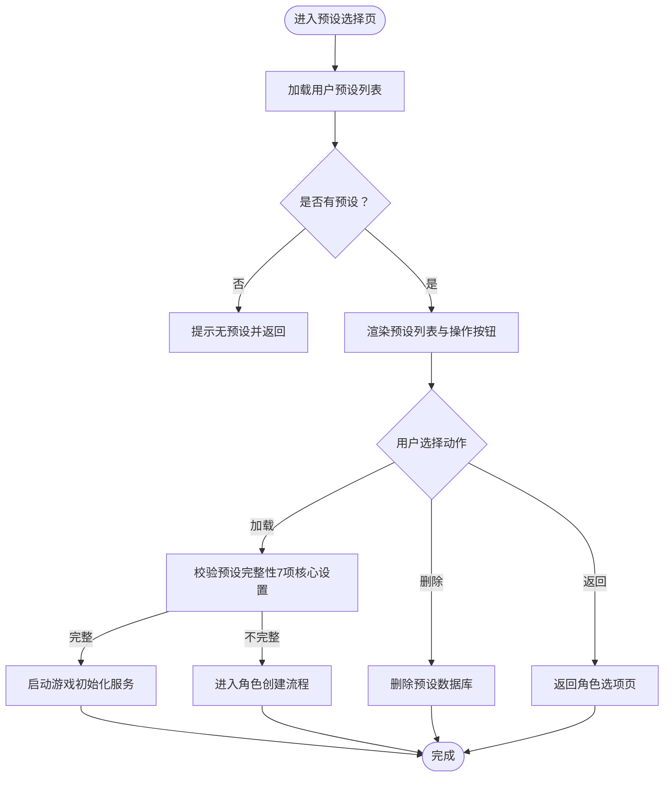
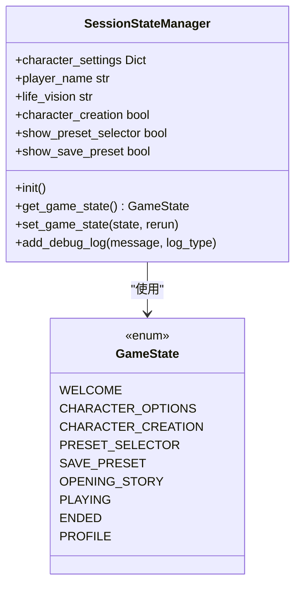
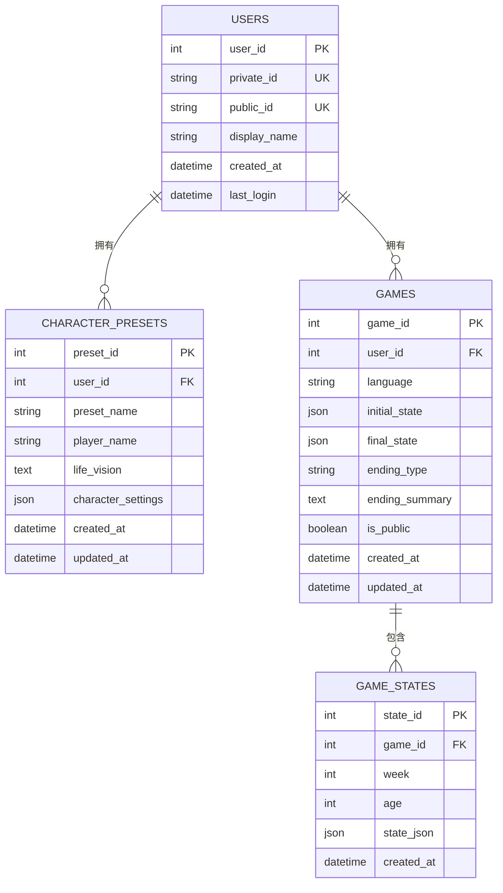
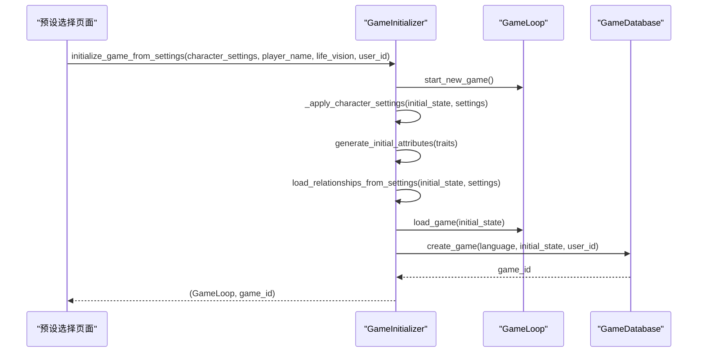
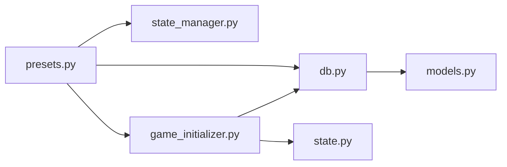

# 预设选择页面

<cite>
**本文引用的文件**
- [presets.py](file://src/ui/page_views/presets.py)
- [state_manager.py](file://src/ui/state_manager.py)
- [db.py](file://src/database/db.py)
- [models.py](file://src/database/models.py)
- [game_initializer.py](file://src/ui/services/game_initializer.py)
- [character_creation.py](file://src/game/character_creation.py)
- [state.py](file://src/game/state.py)
- [events.json](file://data/presets/events.json)
</cite>

## 目录
1. [简介](#简介)
2. [项目结构](#项目结构)
3. [核心组件](#核心组件)
4. [架构总览](#架构总览)
5. [详细组件分析](#详细组件分析)
6. [依赖关系分析](#依赖关系分析)
7. [性能考虑](#性能考虑)
8. [故障排除指南](#故障排除指南)
9. [结论](#结论)
10. [附录](#附录)

## 简介
本文件为“预设选择页面”的技术文档，聚焦于角色预设的加载、保存、删除与应用流程。内容涵盖：
- 预设列表展示与交互
- 预设详情查看与兼容性验证
- 用户选择确认与应用预设
- 预设数据格式、默认值处理与用户偏好保存
- 与数据库层、状态管理器、游戏初始化服务的集成关系

## 项目结构
预设选择页面位于UI层，通过状态管理器协调UI状态，并调用数据库服务完成预设的持久化与加载；当预设完整时直接启动新游戏，否则进入角色创建流程以补齐缺失设置。

图表来源
- [presets.py](file://src/ui/page_views/presets.py#L15-L425)
- [state_manager.py](file://src/ui/state_manager.py#L29-L547)
- [db.py](file://src/database/db.py#L10-L517)
- [models.py](file://src/database/models.py#L129-L144)
- [game_initializer.py](file://src/ui/services/game_initializer.py#L49-L155)
- [character_creation.py](file://src/game/character_creation.py#L37-L200)
- [state.py](file://src/game/state.py#L244-L709)
- [events.json](file://data/presets/events.json#L1-L239)

章节来源
- [presets.py](file://src/ui/page_views/presets.py#L15-L425)
- [state_manager.py](file://src/ui/state_manager.py#L29-L547)

## 核心组件
- 预设选择页面渲染器：负责渲染预设列表、处理加载/删除/返回操作，以及触发保存预设对话框。
- 状态管理器：集中管理UI状态、用户会话、游戏状态切换与持久化。
- 数据库服务：提供预设的增删改查、游戏存档的读写与恢复。
- 游戏初始化服务：从预设设置构建初始游戏状态，创建GameLoop并持久化游戏记录。
- 角色创建器：在预设不完整时，引导用户完成缺失设置。
- 玩家状态模型：承载玩家属性、关系、回合制系统等核心数据结构。

章节来源
- [presets.py](file://src/ui/page_views/presets.py#L15-L425)
- [state_manager.py](file://src/ui/state_manager.py#L42-L547)
- [db.py](file://src/database/db.py#L10-L517)
- [game_initializer.py](file://src/ui/services/game_initializer.py#L49-L155)
- [character_creation.py](file://src/game/character_creation.py#L37-L200)
- [state.py](file://src/game/state.py#L244-L709)

## 架构总览
预设选择页面采用“UI渲染 + 状态管理 + 数据访问 + 初始化服务”的分层设计。用户在预设选择页进行操作，状态管理器统一调度，数据库服务负责持久化，初始化服务负责将预设转化为可运行的游戏状态。

图表来源
- [presets.py](file://src/ui/page_views/presets.py#L117-L202)
- [state_manager.py](file://src/ui/state_manager.py#L213-L244)
- [db.py](file://src/database/db.py#L430-L463)
- [game_initializer.py](file://src/ui/services/game_initializer.py#L63-L138)

## 详细组件分析

### 预设选择页面（presets.py）
- 页面入口函数：根据会话状态决定是否渲染预设选择界面，并加载当前用户保存的预设列表。
- 预设列表渲染：将每个预设组合为“名称(角色名)”的显示名，并附加创建日期。
- 加载逻辑：校验预设完整性（必须包含7项核心设置），完整则直接启动游戏，否则进入角色创建流程。
- 删除逻辑：验证用户权限后删除预设。
- 保存对话框：提供仅保存与保存并开始两种模式，均先保存预设，再可选地立即启动游戏。

图表来源
- [presets.py](file://src/ui/page_views/presets.py#L72-L236)

章节来源
- [presets.py](file://src/ui/page_views/presets.py#L15-L425)

### 状态管理器（state_manager.py）
- 统一管理UI状态：包括游戏状态枚举、角色创建标志、预设选择开关、语言、调试日志等。
- 提供类型安全的状态访问器与setter，保证全局状态的一致性。
- 提供用户会话与游戏会话的持久化/恢复能力，支持URL参数与localStorage双通道。

图表来源
- [state_manager.py](file://src/ui/state_manager.py#L29-L547)

章节来源
- [state_manager.py](file://src/ui/state_manager.py#L42-L547)

### 数据库服务（db.py）
- 预设相关接口：保存、加载、列出、删除角色预设；支持用户权限验证。
- 游戏存档接口：创建游戏记录、保存状态快照、加载最新状态、删除游戏等。
- 预设数据结构：JSON字段存储character_settings，包含时代、年龄、性别、世界、家庭、关系、特质、财富等。

图表来源
- [models.py](file://src/database/models.py#L11-L144)
- [db.py](file://src/database/db.py#L10-L517)

章节来源
- [db.py](file://src/database/db.py#L392-L517)
- [models.py](file://src/database/models.py#L129-L144)

### 游戏初始化服务（game_initializer.py）
- 从预设设置构建初始游戏状态：应用时代、年龄、性别、世界、家庭、关系、特质、财富等设置。
- 生成初始属性（能量、情绪、知识、财富）并加载关系网络。
- 创建GameLoop并持久化游戏记录，返回GameLoop实例与game_id。

图表来源
- [game_initializer.py](file://src/ui/services/game_initializer.py#L63-L138)

章节来源
- [game_initializer.py](file://src/ui/services/game_initializer.py#L49-L155)

### 角色创建器与玩家状态（character_creation.py, state.py）
- 角色创建器：在预设不完整时，引导用户完成缺失设置；提供设置回退策略与错误处理。
- 玩家状态：包含资源、关系、回合制系统、世界模型等，支撑游戏运行与事件生成。

章节来源
- [character_creation.py](file://src/game/character_creation.py#L37-L200)
- [state.py](file://src/game/state.py#L244-L709)

## 依赖关系分析
- 预设选择页面依赖状态管理器进行UI状态控制，依赖数据库服务进行预设读写。
- 初始化服务依赖数据库服务创建游戏记录，并依赖玩家状态模型构建初始状态。
- 数据库模型定义了预设与游戏存档的数据结构，支持JSON字段存储复杂配置。

图表来源
- [presets.py](file://src/ui/page_views/presets.py#L1-L12)
- [state_manager.py](file://src/ui/state_manager.py#L14-L26)
- [db.py](file://src/database/db.py#L1-L8)
- [models.py](file://src/database/models.py#L1-L8)
- [game_initializer.py](file://src/ui/services/game_initializer.py#L1-L7)
- [state.py](file://src/game/state.py#L1-L7)

章节来源
- [presets.py](file://src/ui/page_views/presets.py#L1-L12)
- [state_manager.py](file://src/ui/state_manager.py#L14-L26)
- [db.py](file://src/database/db.py#L1-L8)
- [models.py](file://src/database/models.py#L1-L8)
- [game_initializer.py](file://src/ui/services/game_initializer.py#L1-L7)
- [state.py](file://src/game/state.py#L1-L7)

## 性能考虑
- 预设列表限制：数据库查询限制返回数量，避免一次性加载过多预设造成UI卡顿。
- 异步加载：使用Streamlit的spinner与禁用按钮避免并发操作。
- 状态缓存：状态管理器集中管理session_state，减少重复读写开销。
- 数据库索引：预设表按更新时间倒序查询，提高常用操作效率。

## 故障排除指南
- 加载预设失败：检查预设ID与用户权限，确认预设存在且未被他人占用。
- 预设不完整：系统会自动进入角色创建流程补齐缺失设置，确保7项核心设置齐全。
- 保存预设失败：检查输入名称、网络连接与API密钥配置，必要时重试或清理缓存。
- 游戏启动异常：查看调试日志与错误堆栈，确认初始化服务与数据库服务正常。

章节来源
- [presets.py](file://src/ui/page_views/presets.py#L117-L202)
- [state_manager.py](file://src/ui/state_manager.py#L495-L509)

## 结论
预设选择页面通过清晰的UI流程与完善的后台服务，实现了从预设加载、兼容性校验到游戏启动的完整闭环。其模块化设计便于扩展与维护，同时具备良好的错误处理与用户体验保障。

## 附录

### 预设数据格式与默认值
- 必填字段：预设名称、角色名、生命愿景、character_settings（JSON）。
- 核心设置键：era、age、gender、world、family、relationships、traits。
- 默认值策略：若预设中缺少某些字段，系统会在初始化时应用回退策略或引导用户补充。

章节来源
- [presets.py](file://src/ui/page_views/presets.py#L149-L151)
- [db.py](file://src/database/db.py#L430-L463)
- [models.py](file://src/database/models.py#L129-L144)

### 用户偏好保存
- 会话持久化：通过URL参数与localStorage保存用户ID与游戏状态，支持断线重连。
- 预设归属：未登录用户可查看公共预设，登录用户仅能看到自己的预设。

章节来源
- [state_manager.py](file://src/ui/state_manager.py#L552-L660)
- [db.py](file://src/database/db.py#L465-L486)

### 事件预设数据（参考）
- 里程碑事件与特殊事件：包含事件描述、选项及效果，用于生成游戏中的随机事件。

章节来源
- [events.json](file://data/presets/events.json#L1-L239)