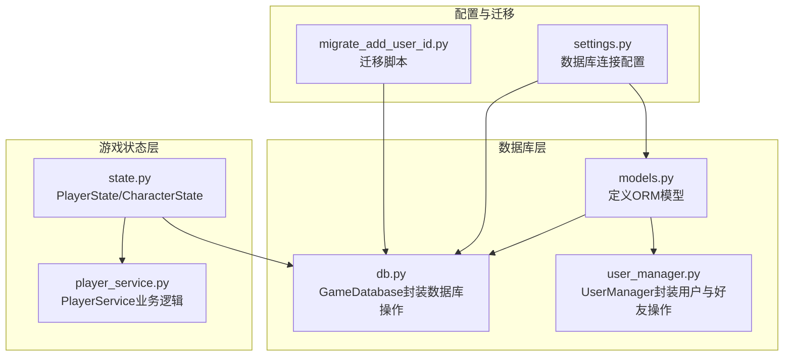
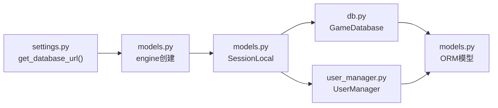
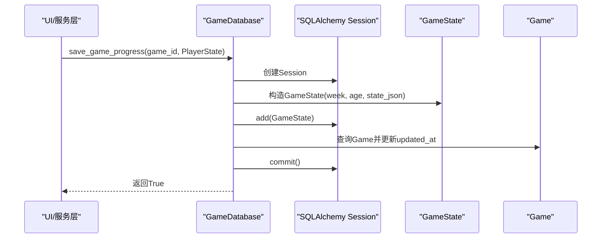
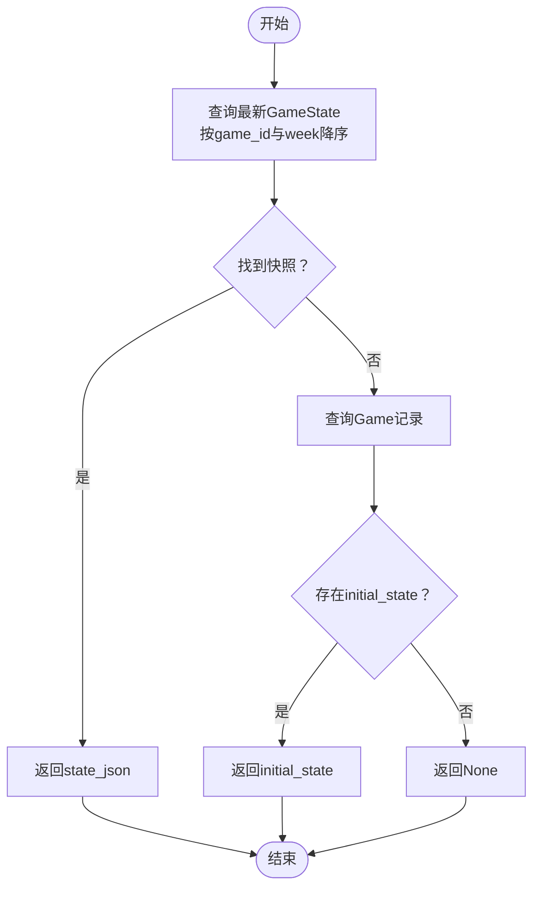

# ORM模型设计

<cite>
**本文引用的文件**
- [models.py](file://src/database/models.py)
- [db.py](file://src/database/db.py)
- [user_manager.py](file://src/database/user_manager.py)
- [state.py](file://src/game/state.py)
- [player_service.py](file://src/game/player_service.py)
- [settings.py](file://config/settings.py)
- [migrate_add_user_id.py](file://migrate_add_user_id.py)
- [test_database.py](file://tests/test_database.py)
- [game_initializer.py](file://src/ui/services/game_initializer.py)
</cite>

## 目录
1. [简介](#简介)
2. [项目结构](#项目结构)
3. [核心组件](#核心组件)
4. [架构总览](#架构总览)
5. [详细组件分析](#详细组件分析)
6. [依赖关系分析](#依赖关系分析)
7. [性能考量](#性能考量)
8. [故障排查指南](#故障排查指南)
9. [结论](#结论)
10. [附录](#附录)

## 简介
本文件面向ORM模型设计，系统性阐述数据库模型类的设计理念与实现细节，覆盖User、Friendship、Game、GameState、Decision、Ending、CharacterPreset等核心模型。内容包括字段定义、数据类型、约束条件、索引设计、模型间关系映射（一对一、一对多、多对多）、外键约束与级联操作，并提供模型初始化、数据库表创建与迁移策略的实现说明。同时给出基于实际源码的图示与流程，帮助读者快速理解与应用。

## 项目结构
数据库层采用SQLAlchemy声明式ORM，模型集中于数据库模块，配合数据库操作封装与用户管理服务，形成清晰的分层：
- 模型层：定义实体与关系
- 数据库操作层：封装CRUD与业务查询
- 用户管理层：用户、好友关系与游戏可见性控制
- 游戏状态层：PlayerState/CharacterState用于运行时状态，持久化为JSON字段



图表来源
- [models.py](file://src/database/models.py#L1-L171)
- [db.py](file://src/database/db.py#L1-L517)
- [user_manager.py](file://src/database/user_manager.py#L1-L401)
- [state.py](file://src/game/state.py#L1-L709)
- [player_service.py](file://src/game/player_service.py#L1-L176)
- [settings.py](file://config/settings.py#L68-L82)
- [migrate_add_user_id.py](file://migrate_add_user_id.py#L1-L78)

章节来源
- [models.py](file://src/database/models.py#L1-L171)
- [db.py](file://src/database/db.py#L1-L517)
- [user_manager.py](file://src/database/user_manager.py#L1-L401)
- [state.py](file://src/game/state.py#L1-L709)
- [player_service.py](file://src/game/player_service.py#L1-L176)
- [settings.py](file://config/settings.py#L68-L82)
- [migrate_add_user_id.py](file://migrate_add_user_id.py#L1-L78)

## 核心组件
本节概述各模型的核心字段、约束与索引，以及它们之间的关系映射。

- User（用户）
  - 字段：user_id（主键，自增）、private_id（唯一、非空，索引）、public_id（唯一、非空，索引）、display_name（可选）、created_at、last_login
  - 关系：一对多到Game（games），一对多到Friendship（sent_friend_requests、received_friend_requests）
  - 约束：unique约束保证private_id与public_id唯一；index加速登录与查找

- Friendship（好友关系）
  - 字段：id（主键，自增）、user_id（外键到users.user_id）、friend_id（外键到users.user_id）、status（默认pending）、created_at、updated_at
  - 关系：多对一到User（user、friend）
  - 约束：唯一复合索引(ix_friendship_pair)确保同一对用户仅一条记录

- Game（游戏会话）
  - 字段：game_id（主键，自增）、user_id（可空，外键到users.user_id，索引）、created_at、updated_at、language（默认en）、initial_state（JSON）、final_state（JSON，可空）、ending_type（可空）、ending_summary（Text，可空）、is_public（布尔，默认False）
  - 关系：多对一到User（user），一对多到GameState（states）、Decision（decisions），一对一到Ending（uselist=False）
  - 约束：user_id可空以兼容匿名会话；is_public控制好友可见性；cascade删除孤儿记录

- GameState（游戏状态快照）
  - 字段：state_id（主键，自增）、game_id（外键到games.game_id）、week、age、state_json（JSON，非空）、created_at
  - 关系：多对一到Game（game）

- Decision（决策记录）
  - 字段：decision_id（主键，自增）、game_id（外键到games.game_id）、week、event_description（Text，非空）、choice_text（String，非空）、effects（JSON，非空）、created_at
  - 关系：多对一到Game（game）

- Ending（结局记录）
  - 字段：ending_id（主键，自增）、game_id（外键到games.game_id，唯一）、final_state（JSON，非空）、ending_type（非空）、summary（Text，非空）、achievements（JSON，可空）、created_at
  - 关系：一对一到Game（uselist=False）

- CharacterPreset（角色预设）
  - 字段：preset_id（主键，自增）、user_id（可空，外键到users.user_id，索引）、preset_name（非空）、player_name（非空）、life_vision（Text，可空）、character_settings（JSON，非空）、created_at、updated_at
  - 关系：多对一到User（user）

章节来源
- [models.py](file://src/database/models.py#L11-L144)

## 架构总览
ORM模型与业务层协作，形成“模型-服务-数据库”的清晰边界：
- 模型层：负责数据结构与关系映射
- 服务层：UserManager负责用户与好友关系；GameDatabase负责游戏数据持久化
- 运行时状态：PlayerState/CharacterState在内存中维护复杂状态，持久化为JSON字段

```mermaid
classDiagram
class User {
+int user_id
+string private_id
+string public_id
+string display_name
+datetime created_at
+datetime last_login
}
class Friendship {
+int id
+int user_id
+int friend_id
+string status
+datetime created_at
+datetime updated_at
}
class Game {
+int game_id
+int user_id
+datetime created_at
+datetime updated_at
+string language
+dict initial_state
+dict final_state
+string ending_type
+string ending_summary
+bool is_public
}
class GameState {
+int state_id
+int game_id
+int week
+int age
+dict state_json
+datetime created_at
}
class Decision {
+int decision_id
+int game_id
+int week
+string event_description
+string choice_text
+dict effects
+datetime created_at
}
class Ending {
+int ending_id
+int game_id
+dict final_state
+string ending_type
+string summary
+dict achievements
+datetime created_at
}
class CharacterPreset {
+int preset_id
+int user_id
+string preset_name
+string player_name
+string life_vision
+dict character_settings
+datetime created_at
+datetime updated_at
}
User "1" o-- "many" Game : "games"
User "1" o-- "many" Friendship : "sent_friend_requests"
User "1" o-- "many" Friendship : "received_friend_requests"
Game "1" o-- "many" GameState : "states"
Game "1" o-- "many" Decision : "decisions"
Game "1" ||-- "1" Ending : "ending"
User "1" o-- "many" CharacterPreset : "character_presets"
```

图表来源
- [models.py](file://src/database/models.py#L11-L144)

## 详细组件分析

### User模型
- 设计要点
  - 私有ID用于安全登录，公有ID用于社交展示与加好友
  - unique与index确保登录与查找效率
  - 一对多关系到Game与Friendship，支持用户视角下的游戏与好友请求管理
- 约束与索引
  - unique(private_id)、unique(public_id)
  - index(private_id)、index(public_id)
- 典型用法
  - 创建用户：生成唯一private_id与public_id，写入User
  - 登录：按标准化后的private_id查询User并更新last_login
  - 好友请求：通过public_id查找目标用户，建立Friendship记录

章节来源
- [models.py](file://src/database/models.py#L11-L38)
- [user_manager.py](file://src/database/user_manager.py#L68-L127)

### Friendship模型
- 设计要点
  - 双向外键指向users表，分别代表发起者与接收者
  - status枚举值控制请求状态流转（pending/accepted/rejected）
  - 复合唯一索引(ix_friendship_pair)防止重复关系
- 关系映射
  - 多对一到User（user、friend）
- 典型用法
  - 发送请求：校验非自身、非重复，创建pending记录
  - 自动接受：若互发请求，后者自动接受
  - 查询待处理：按friend_id与status筛选

章节来源
- [models.py](file://src/database/models.py#L40-L58)
- [user_manager.py](file://src/database/user_manager.py#L165-L336)

### Game模型
- 设计要点
  - user_id可空，支持匿名会话；is_public控制好友可见性
  - initial_state与final_state均为JSON，便于灵活存储复杂状态
  - 级联删除：删除Game时自动删除其states与decisions
  - 一对一Ending：通过unique约束保证每局游戏仅一个结局
- 索引
  - index(user_id)提升按用户查询效率
- 典型用法
  - 创建游戏：写入language与initial_state
  - 保存进度：新增GameState快照并更新updated_at
  - 结束游戏：写入final_state、ending_type、summary并创建Ending

章节来源
- [models.py](file://src/database/models.py#L61-L80)
- [db.py](file://src/database/db.py#L17-L144)

### GameState模型
- 设计要点
  - 以week与age作为快照维度，state_json存储完整状态字典
  - 与Game为一对多关系，支持多快照对比与回溯
- 典型用法
  - 保存快照：根据PlayerState构造GameState并入库
  - 加载最新快照：按game_id与week降序取第一条

章节来源
- [models.py](file://src/database/models.py#L82-L95)
- [db.py](file://src/database/db.py#L48-L173)

### Decision模型
- 设计要点
  - 记录每周事件与选择，effects存储量化影响
  - 与Game为一对多关系，支持决策历史查询
- 典型用法
  - 保存决策：写入event_description、choice_text、effects
  - 查询历史：按game_id与week排序获取完整决策链

章节来源
- [models.py](file://src/database/models.py#L97-L111)
- [db.py](file://src/database/db.py#L73-L221)

### Ending模型
- 设计要点
  - 一对一绑定Game，unique(game_id)确保唯一结局
  - achievements可选，支持成就系统扩展
- 典型用法
  - 保存结局：同时更新Game的ending字段并创建Ending记录

章节来源
- [models.py](file://src/database/models.py#L113-L127)
- [db.py](file://src/database/db.py#L105-L144)

### CharacterPreset模型
- 设计要点
  - 支持用户专属预设与匿名预设（user_id可空）
  - character_settings存储角色创建参数，便于快速复用
- 典型用法
  - 保存预设：写入preset_name、player_name、life_vision与settings
  - 加载预设：按preset_id与user_id进行所有权校验

章节来源
- [models.py](file://src/database/models.py#L129-L144)
- [db.py](file://src/database/db.py#L392-L487)

### 关系映射与级联操作
- User → Game：一对多（级联删除孤儿）
- User → Friendship：一对多（双向，分别对应发起与接收）
- Game → GameState：一对多（级联删除孤儿）
- Game → Decision：一对多（级联删除孤儿）
- Game → Ending：一对一（unique约束）
- User → CharacterPreset：一对多

章节来源
- [models.py](file://src/database/models.py#L22-L37)
- [models.py](file://src/database/models.py#L76-L79)
- [models.py](file://src/database/models.py#L126-L126)

## 依赖关系分析
- 数据库连接与引擎
  - settings.get_database_url()统一管理数据库URL，支持云数据库与本地SQLite
  - models.py中根据URL类型选择不同引擎配置（pool_pre_ping等）
- 会话管理
  - SessionLocal提供线程安全的会话工厂
  - init_db()创建所有表，确保Schema一致性
- 业务依赖
  - GameDatabase依赖models中的Game、GameState、Decision、Ending、CharacterPreset
  - UserManager依赖models中的User、Friendship、Game



图表来源
- [settings.py](file://config/settings.py#L68-L82)
- [models.py](file://src/database/models.py#L146-L171)
- [db.py](file://src/database/db.py#L10-L16)
- [user_manager.py](file://src/database/user_manager.py#L34-L65)

章节来源
- [settings.py](file://config/settings.py#L68-L82)
- [models.py](file://src/database/models.py#L146-L171)
- [db.py](file://src/database/db.py#L10-L16)
- [user_manager.py](file://src/database/user_manager.py#L34-L65)

## 性能考量
- 索引设计
  - User：private_id、public_id（唯一+索引）加速登录与查找
  - Friendship：ix_friendship_pair（唯一复合索引）避免重复关系
  - Game：user_id（索引）提升按用户查询效率
  - CharacterPreset：user_id（索引）提升按用户查询效率
- JSON字段
  - initial_state、final_state、state_json、effects、character_settings等采用JSON存储，便于扩展但查询需谨慎，建议结合索引与必要字段冗余
- 级联删除
  - 通过cascade="all, delete-orphan"减少孤立数据，降低清理成本
- 引擎配置
  - PostgreSQL启用pool_pre_ping提升连接稳定性
  - SQLite默认echo=False，避免调试日志开销

章节来源
- [models.py](file://src/database/models.py#L16-L17)
- [models.py](file://src/database/models.py#L47-L58)
- [models.py](file://src/database/models.py#L66-L66)
- [models.py](file://src/database/models.py#L134-L134)
- [models.py](file://src/database/models.py#L151-L154)

## 故障排查指南
- 登录失败
  - 检查private_id格式是否标准化（去除空格、转大写、统一连字符）
  - 确认private_id存在且未被篡改
- 好友请求异常
  - 避免自加为好友；检查是否存在重复请求；互发请求会自动接受
- 查询不到游戏状态
  - 若无GameState快照，系统会回退到Game.initial_state；确认game_id正确
- 删除游戏后仍有残留
  - 确认使用级联删除路径（删除Game）；检查数据库事务是否提交
- 预设加载失败
  - 校验preset_id与user_id所有权；确认JSON字段完整性

章节来源
- [user_manager.py](file://src/database/user_manager.py#L104-L127)
- [user_manager.py](file://src/database/user_manager.py#L165-L225)
- [db.py](file://src/database/db.py#L145-L173)
- [db.py](file://src/database/db.py#L366-L391)
- [db.py](file://src/database/db.py#L430-L464)

## 结论
本ORM模型设计以简洁明确的字段与关系为核心，结合索引与级联策略，在保证数据一致性的同时兼顾查询性能与扩展性。User/Friendship/Game/GameState/Decision/Ending/CharacterPreset构成完整的游戏数据生命周期闭环，配合UserManager与GameDatabase的服务层封装，能够支撑从用户管理到游戏存档的全栈需求。迁移脚本与测试用例进一步保障了Schema演进与质量。

## 附录

### 数据库表创建与迁移策略
- 初始化
  - init_db()调用Base.metadata.create_all()创建所有表
  - settings.get_database_url()决定连接类型（云数据库或本地SQLite）
- 迁移
  - migrate_add_user_id.py为SQLite环境提供增量迁移：添加user_id、is_public、updated_at列并创建索引
  - 建议在生产环境使用数据库迁移工具（如Alembic）替代手工SQL脚本

章节来源
- [models.py](file://src/database/models.py#L159-L171)
- [settings.py](file://config/settings.py#L68-L82)
- [migrate_add_user_id.py](file://migrate_add_user_id.py#L9-L78)

### 模型初始化与使用示例（路径指引）
- 定义模型
  - 参考：[models.py](file://src/database/models.py#L11-L144)
- 建立关系
  - 参考：User与Game/Friendship的关系映射
  - 参考：Game与GameState/Decision/Ending的关系映射
- 使用索引优化查询
  - 参考：User与Friendship的索引设计
  - 参考：Game与CharacterPreset的索引设计
- 数据库表创建
  - 参考：init_db()与settings.get_database_url()
- 运行时状态持久化
  - 参考：PlayerState/CharacterState与GameState/Decision/Ending的JSON字段交互
  - 参考：GameDatabase.save_state/save_decision/save_ending/load_game_state

章节来源
- [models.py](file://src/database/models.py#L11-L144)
- [db.py](file://src/database/db.py#L17-L144)
- [state.py](file://src/game/state.py#L244-L709)
- [settings.py](file://config/settings.py#L68-L82)

### 关键流程图

#### 保存游戏进度序列图


图表来源
- [db.py](file://src/database/db.py#L274-L322)

#### 加载游戏状态流程图


图表来源
- [db.py](file://src/database/db.py#L145-L173)