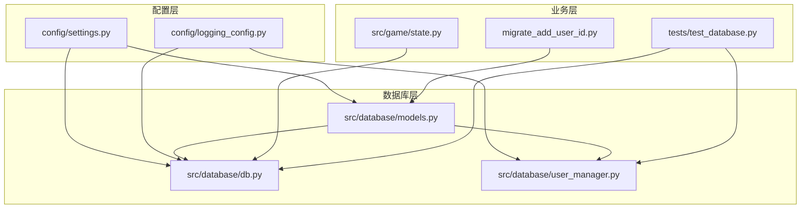
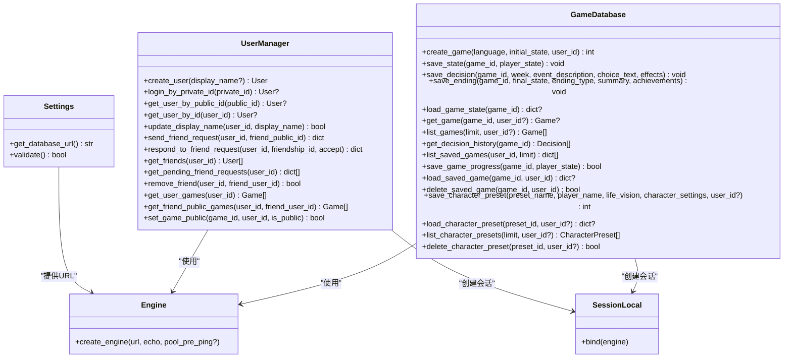
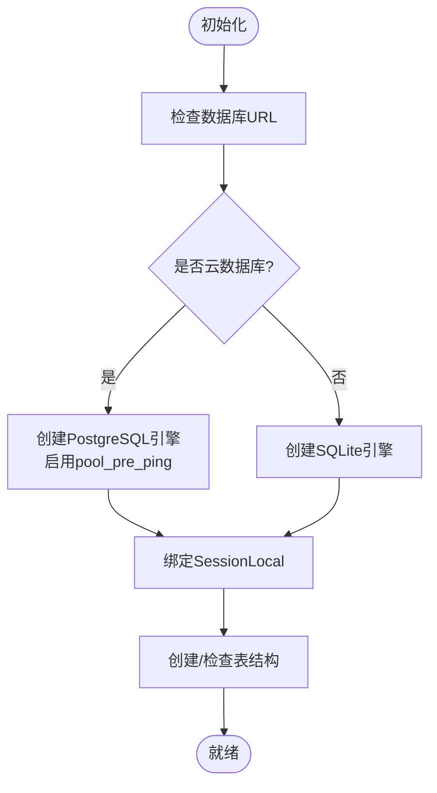
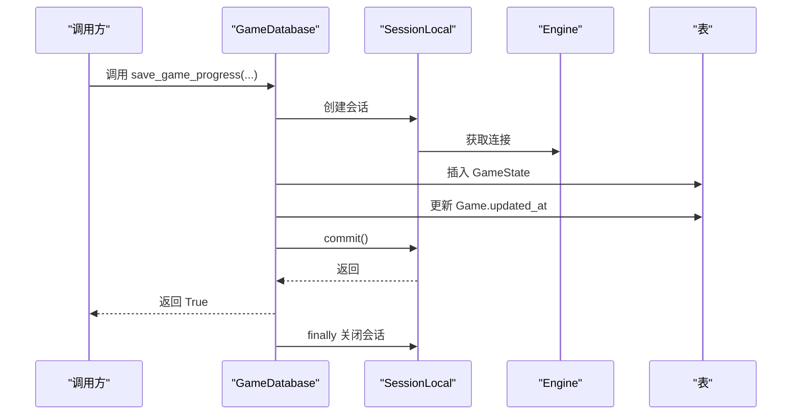
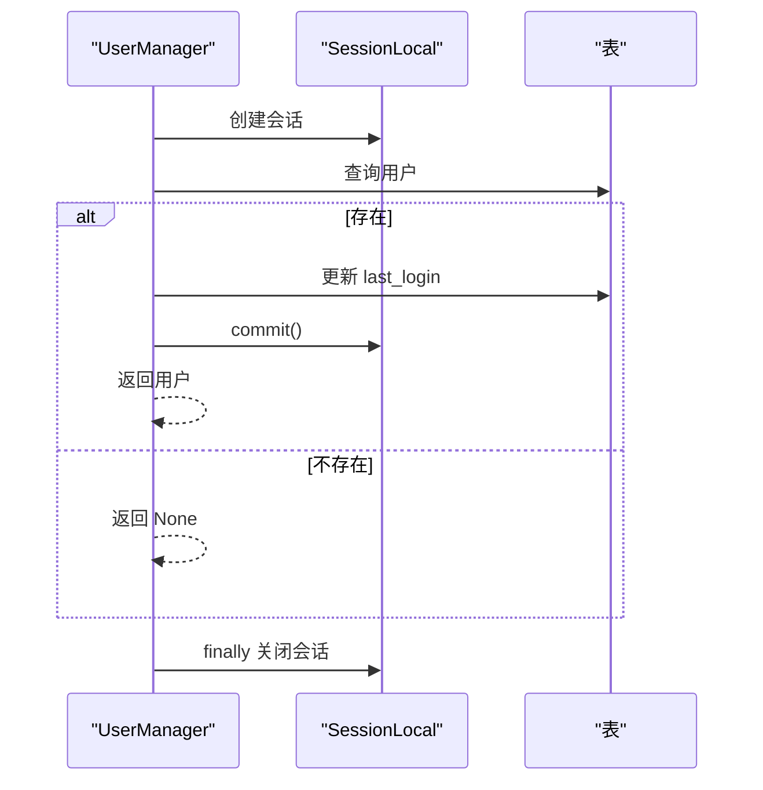
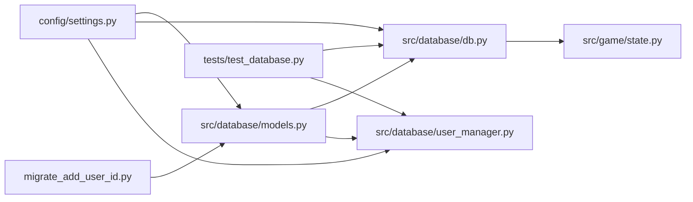

# 数据库操作接口

<cite>
**本文引用的文件**
- [src/database/db.py](file://src/database/db.py)
- [src/database/models.py](file://src/database/models.py)
- [src/database/user_manager.py](file://src/database/user_manager.py)
- [config/settings.py](file://config/settings.py)
- [config/logging_config.py](file://config/logging_config.py)
- [tests/test_database.py](file://tests/test_database.py)
- [migrate_add_user_id.py](file://migrate_add_user_id.py)
- [src/game/state.py](file://src/game/state.py)
</cite>

## 目录
1. [简介](#简介)
2. [项目结构](#项目结构)
3. [核心组件](#核心组件)
4. [架构总览](#架构总览)
5. [详细组件分析](#详细组件分析)
6. [依赖关系分析](#依赖关系分析)
7. [性能考虑](#性能考虑)
8. [故障排查指南](#故障排查指南)
9. [结论](#结论)
10. [附录](#附录)

## 简介
本技术文档围绕数据库操作接口展开，系统性阐述数据库连接管理、会话处理、事务操作、CRUD封装、查询优化、批量操作、异常处理、配置参数、性能调优与故障恢复策略，并结合实际代码路径给出可操作的示例与最佳实践。目标读者包括开发者、运维工程师与测试人员。

## 项目结构
数据库相关模块主要分布在以下位置：
- 数据库模型与连接：`src/database/models.py`
- 数据库操作封装：`src/database/db.py`
- 用户管理与好友系统：`src/database/user_manager.py`
- 配置与日志：`config/settings.py`、`config/logging_config.py`
- 测试用例：`tests/test_database.py`
- 迁移脚本：`migrate_add_user_id.py`
- 游戏状态模型：`src/game/state.py`



图表来源
- [src/database/models.py](file://src/database/models.py#L146-L170)
- [src/database/db.py](file://src/database/db.py#L1-L517)
- [src/database/user_manager.py](file://src/database/user_manager.py#L1-L401)
- [config/settings.py](file://config/settings.py#L68-L82)
- [config/logging_config.py](file://config/logging_config.py#L12-L69)
- [tests/test_database.py](file://tests/test_database.py#L1-L643)
- [migrate_add_user_id.py](file://migrate_add_user_id.py#L1-L78)
- [src/game/state.py](file://src/game/state.py#L244-L560)

章节来源
- [src/database/models.py](file://src/database/models.py#L146-L170)
- [src/database/db.py](file://src/database/db.py#L1-L517)
- [src/database/user_manager.py](file://src/database/user_manager.py#L1-L401)
- [config/settings.py](file://config/settings.py#L68-L82)
- [config/logging_config.py](file://config/logging_config.py#L12-L69)
- [tests/test_database.py](file://tests/test_database.py#L1-L643)
- [migrate_add_user_id.py](file://migrate_add_user_id.py#L1-L78)
- [src/game/state.py](file://src/game/state.py#L244-L560)

## 核心组件
- 数据库引擎与会话工厂：基于 SQLAlchemy 的引擎创建与会话工厂，支持本地 SQLite 与云数据库（如 PostgreSQL）。
- ORM 模型：定义用户、好友关系、游戏、状态快照、决策、结局、角色预设等表结构及索引。
- 数据库操作封装：GameDatabase 提供游戏存档、状态快照、决策记录、结局保存、角色预设等 CRUD 封装。
- 用户管理：UserManager 提供用户创建、登录、好友请求、公开游戏设置等用户相关操作。
- 配置与日志：统一的数据库连接 URL 生成逻辑与日志配置，便于生产环境部署与监控。

章节来源
- [src/database/models.py](file://src/database/models.py#L146-L170)
- [src/database/db.py](file://src/database/db.py#L10-L517)
- [src/database/user_manager.py](file://src/database/user_manager.py#L34-L401)
- [config/settings.py](file://config/settings.py#L68-L82)
- [config/logging_config.py](file://config/logging_config.py#L12-L69)

## 架构总览
数据库层采用“模型-会话-操作”三层架构：
- 模型层：声明式 ORM 定义表结构与关系。
- 会话层：SessionLocal 提供每请求/每操作的会话实例，确保资源正确释放。
- 操作层：GameDatabase 与 UserManager 封装业务 CRUD，负责事务提交与回滚。



图表来源
- [src/database/db.py](file://src/database/db.py#L10-L517)
- [src/database/user_manager.py](file://src/database/user_manager.py#L34-L401)
- [src/database/models.py](file://src/database/models.py#L146-L170)
- [config/settings.py](file://config/settings.py#L73-L82)

## 详细组件分析

### 数据库引擎与会话管理
- 引擎创建：根据配置动态选择数据库类型，云数据库启用 pre_ping 以检测连接有效性；本地 SQLite 使用默认配置。
- 会话工厂：SessionLocal 绑定引擎，每次操作创建独立会话，确保并发安全。
- 初始化：init_db 在应用启动时创建所有表（幂等）。
- 会话生命周期：每个操作在 try/finally 中确保会话关闭，避免连接泄漏。



图表来源
- [src/database/models.py](file://src/database/models.py#L146-L161)
- [config/settings.py](file://config/settings.py#L73-L82)

章节来源
- [src/database/models.py](file://src/database/models.py#L146-L170)
- [config/settings.py](file://config/settings.py#L68-L82)

### ORM 模型设计与关系
- 用户与游戏：一对多级联删除孤儿记录，支持用户维度的数据隔离。
- 游戏与状态快照：按周存储快照，支持回溯与恢复。
- 游戏与决策：记录每周选择及其效果，支持历史回放。
- 游戏与结局：一对一结局记录，支持成就与摘要。
- 角色预设：支持用户维度的预设管理，兼容匿名用户场景。
- 索引与约束：为 user_id、preset user_id 等常用过滤字段建立索引，保证查询效率。

```mermaid
erDiagram
USERS {
integer user_id PK
string private_id UK
string public_id UK
string display_name
datetime created_at
datetime last_login
}
FRIENDSHIPS {
integer id PK
integer user_id FK
integer friend_id FK
string status
datetime created_at
datetime updated_at
}
GAMES {
integer game_id PK
integer user_id FK
datetime created_at
datetime updated_at
string language
json initial_state
json final_state
string ending_type
text ending_summary
boolean is_public
}
GAME_STATES {
integer state_id PK
integer game_id FK
integer week
integer age
json state_json
datetime created_at
}
DECISIONS {
integer decision_id PK
integer game_id FK
integer week
text event_description
string choice_text
json effects
datetime created_at
}
ENDINGS {
integer ending_id PK
integer game_id FK UK
json final_state
string ending_type
text summary
json achievements
datetime created_at
}
CHARACTER_PRESETS {
integer preset_id PK
integer user_id FK
string preset_name
string player_name
text life_vision
json character_settings
datetime created_at
datetime updated_at
}
USERS ||--o{ GAMES : "拥有"
GAMES ||--o{ GAME_STATES : "有快照"
GAMES ||--o{ DECISIONS : "有决策"
GAMES ||--|| ENDINGS : "有结局"
USERS ||--o{ CHARACTER_PRESETS : "拥有"
FRIENDSHIPS }o--|| USERS : "参与"
```

图表来源
- [src/database/models.py](file://src/database/models.py#L11-L144)

章节来源
- [src/database/models.py](file://src/database/models.py#L11-L144)

### GameDatabase：CRUD 封装与事务控制
- 事务边界：每个方法内部使用 try/finally 确保 commit/rollback 与 session.close。
- 权限校验：查询游戏与角色预设时支持 user_id 过滤，防止越权访问。
- 级联删除：删除游戏会级联删除其状态快照与决策记录。
- 查询优化：按主键/外键索引查询，必要时使用 order_by + limit 控制结果集大小。
- 异常处理：记录错误日志，必要时回滚事务，返回布尔值或 None 以指示失败。



图表来源
- [src/database/db.py](file://src/database/db.py#L274-L321)

章节来源
- [src/database/db.py](file://src/database/db.py#L10-L517)

### UserManager：用户与好友管理
- 会话管理：支持传入外部会话或内部创建，提供上下文管理器接口。
- ID 生成：私有 ID 与公有 ID 生成规则明确，冲突检测与重试保障唯一性。
- 好友流程：请求发送、自动接受、拒绝、删除好友、待处理请求查询等完整闭环。
- 权限控制：公开游戏设置仅允许游戏所属用户操作。



图表来源
- [src/database/user_manager.py](file://src/database/user_manager.py#L104-L126)

章节来源
- [src/database/user_manager.py](file://src/database/user_manager.py#L34-L401)

### 配置与日志
- 数据库 URL：优先使用 DATABASE_URL（云数据库），否则回退到本地 SQLite 文件路径。
- 日志配置：生产环境可开启文件轮转，控制台与文件双通道输出，第三方库日志级别降噪。

章节来源
- [config/settings.py](file://config/settings.py#L68-L82)
- [config/logging_config.py](file://config/logging_config.py#L12-L69)

### 测试与验证
- 模型测试：覆盖用户、好友关系、游戏、状态快照、决策、结局、角色预设的建模与约束。
- 操作测试：覆盖 GameDatabase 与 UserManager 的典型 CRUD 场景，包括权限校验、级联删除、错误输入处理等。
- 内存数据库：使用 SQLite 内存引擎进行单元测试，确保隔离与快速执行。

章节来源
- [tests/test_database.py](file://tests/test_database.py#L1-L643)

## 依赖关系分析
- 模块耦合：GameDatabase 与 UserManager 均依赖 models 与 settings，但彼此解耦，通过会话与引擎间接交互。
- 外部依赖：SQLAlchemy ORM、JSON 字段、datetime 时间戳。
- 潜在循环：当前结构未发现循环导入；若引入更多服务层，需注意避免循环依赖。



图表来源
- [config/settings.py](file://config/settings.py#L68-L82)
- [src/database/models.py](file://src/database/models.py#L146-L170)
- [src/database/db.py](file://src/database/db.py#L1-L517)
- [src/database/user_manager.py](file://src/database/user_manager.py#L1-L401)
- [src/game/state.py](file://src/game/state.py#L244-L560)
- [tests/test_database.py](file://tests/test_database.py#L1-L643)
- [migrate_add_user_id.py](file://migrate_add_user_id.py#L1-L78)

## 性能考虑
- 连接池与预检：云数据库启用 pool_pre_ping，降低连接失效导致的异常。
- 索引策略：为 user_id、preset user_id 等高频过滤字段建立索引，减少全表扫描。
- 查询限制：列表查询使用 order_by + limit 控制结果集大小，避免内存膨胀。
- JSON 字段：合理使用 JSON 字段存储状态快照，避免过度规范化带来的 JOIN 成本。
- 批量写入：当前实现逐条插入，如需提升吞吐可在批量场景使用 bulk_insert_mappings 或原生 SQL。
- 缓存策略：可结合应用层缓存（如 LRU）缓存热点游戏状态，减少数据库压力。

章节来源
- [src/database/models.py](file://src/database/models.py#L150-L154)
- [src/database/db.py](file://src/database/db.py#L195-L210)

## 故障排查指南
- 连接失败
  - 检查 DATABASE_URL 是否正确，本地 SQLite 路径是否存在。
  - 云数据库确认网络连通与凭据。
- 事务未提交
  - 确认每个操作均在 try/finally 中关闭会话，必要时捕获异常并执行 rollback。
- 权限问题
  - 查询游戏与预设时传入 user_id 进行所有权校验。
- 级联删除异常
  - 删除游戏会级联删除状态快照与决策记录，确认预期行为。
- 日志定位
  - 使用日志配置输出到文件，结合错误堆栈定位问题。

章节来源
- [src/database/db.py](file://src/database/db.py#L316-L321)
- [src/database/db.py](file://src/database/db.py#L185-L193)
- [config/logging_config.py](file://config/logging_config.py#L12-L69)

## 结论
本数据库接口以 SQLAlchemy ORM 为基础，结合清晰的会话管理与事务控制，实现了从模型定义到业务封装的完整闭环。通过合理的索引、查询限制与日志配置，系统在开发与生产环境中均具备良好的可维护性与可扩展性。建议在高并发场景下进一步引入连接池参数调优与批量写入策略，并持续完善监控与告警体系。

## 附录

### 数据库配置参数与示例
- 数据库 URL 生成
  - 云数据库：使用 DATABASE_URL 环境变量。
  - 本地 SQLite：回退到 data/game.db。
- 示例路径
  - [数据库 URL 生成逻辑](file://config/settings.py#L73-L82)
  - [引擎创建与会话工厂](file://src/database/models.py#L146-L156)

章节来源
- [config/settings.py](file://config/settings.py#L68-L82)
- [src/database/models.py](file://src/database/models.py#L146-L156)

### 代码示例路径
- 建立数据库连接
  - [初始化引擎与会话](file://src/database/models.py#L146-L156)
- 执行复杂查询
  - [加载游戏状态（回退到初始状态）](file://src/database/db.py#L145-L172)
  - [列出用户已保存游戏（含最新状态）](file://src/database/db.py#L222-L272)
- 处理事务
  - [保存进度并更新游戏更新时间](file://src/database/db.py#L274-L321)
- 管理数据库资源
  - [会话关闭与异常回滚](file://src/database/db.py#L316-L321)
  - [UserManager 会话管理与上下文](file://src/database/user_manager.py#L37-L64)

章节来源
- [src/database/models.py](file://src/database/models.py#L146-L156)
- [src/database/db.py](file://src/database/db.py#L145-L321)
- [src/database/user_manager.py](file://src/database/user_manager.py#L37-L64)

### 数据库迁移与备份恢复
- 迁移脚本
  - 为 games 表增加 user_id、is_public、updated_at 字段并创建索引。
  - [迁移脚本](file://migrate_add_user_id.py#L9-L74)
- 备份与恢复
  - 本地 SQLite：直接复制 data/game.db 文件即可备份；恢复时替换文件或重建数据库。
  - 云数据库：使用数据库自带的备份工具（如 pg_dump/备份策略）进行定期备份与恢复演练。

章节来源
- [migrate_add_user_id.py](file://migrate_add_user_id.py#L9-L74)

### 监控与告警
- 日志配置
  - 生产环境开启文件轮转，控制台与文件双通道输出，第三方库日志降噪。
  - [日志配置](file://config/logging_config.py#L12-L69)
- 建议指标
  - 连接池命中率、慢查询统计、事务失败率、会话泄漏检测。

章节来源
- [config/logging_config.py](file://config/logging_config.py#L12-L69)