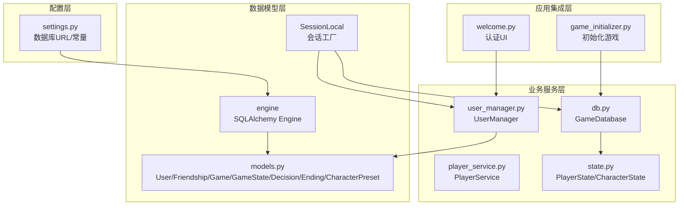
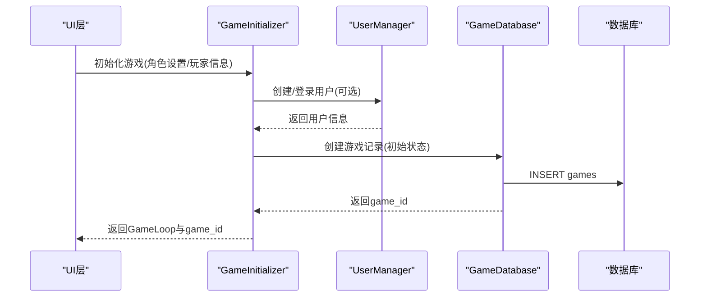
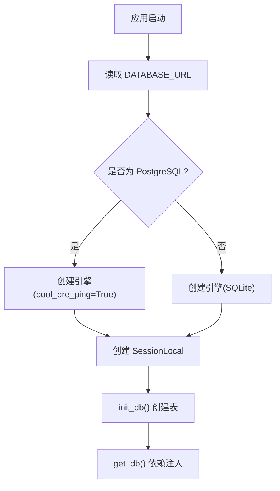
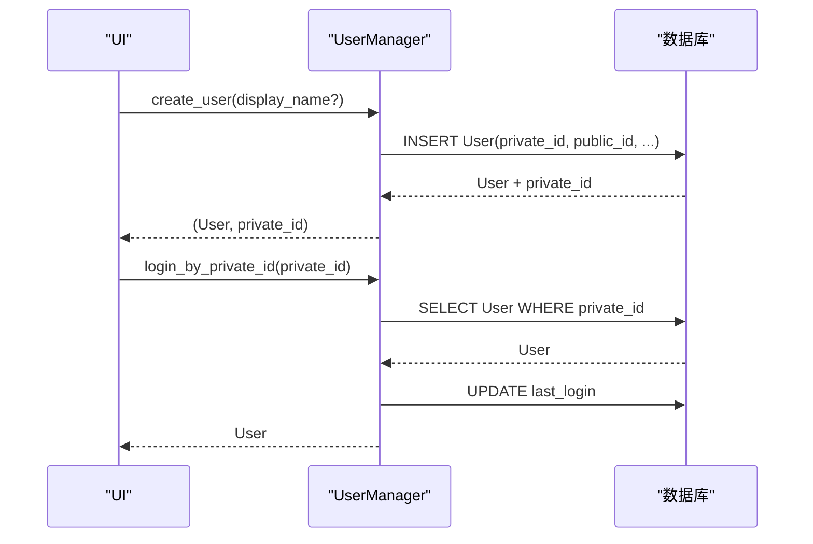
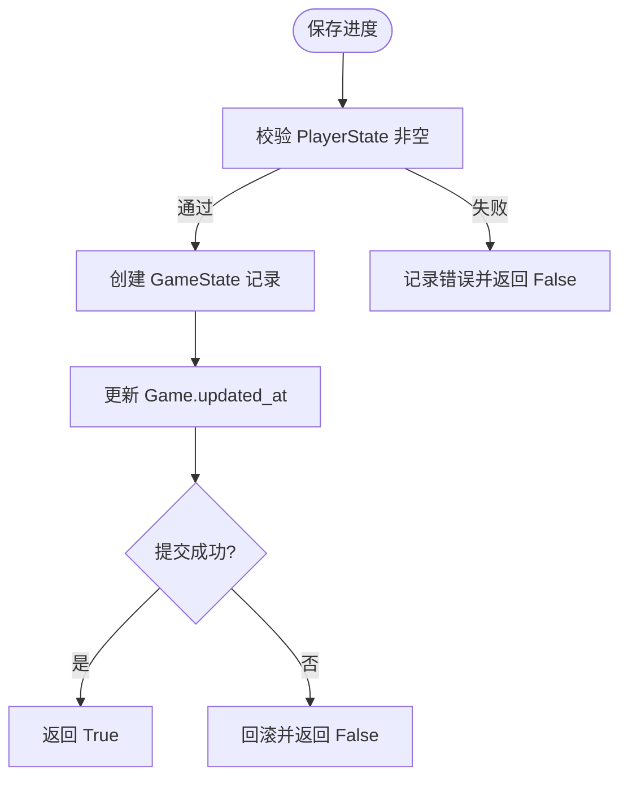
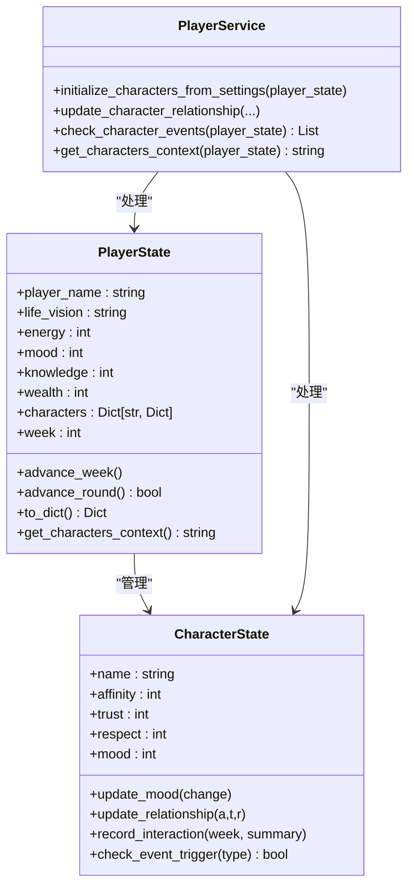
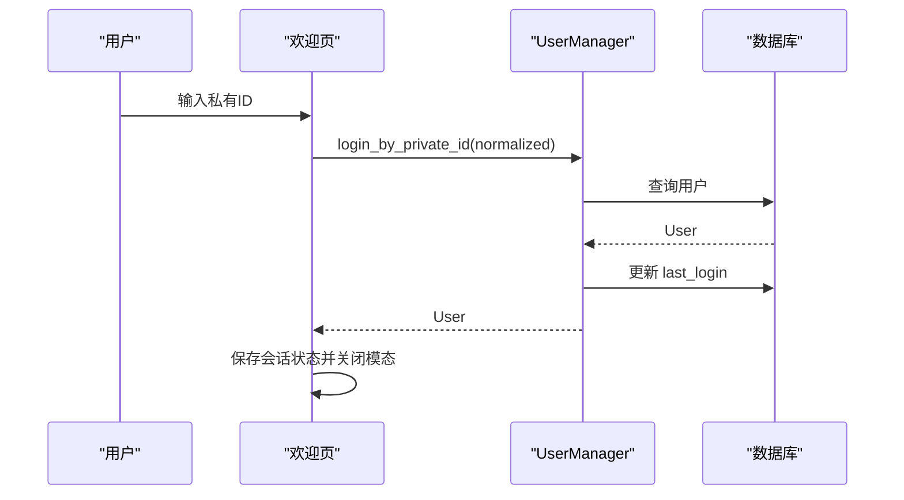
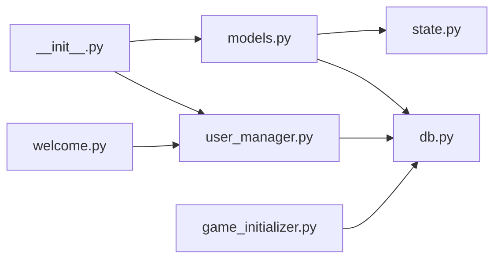

# 数据管理层

<cite>
**本文引用的文件**
- [models.py](file://src/database/models.py)
- [db.py](file://src/database/db.py)
- [user_manager.py](file://src/database/user_manager.py)
- [state.py](file://src/game/state.py)
- [player_service.py](file://src/game/player_service.py)
- [settings.py](file://config/settings.py)
- [test_database.py](file://tests/test_database.py)
- [__init__.py](file://src/database/__init__.py)
- [game_initializer.py](file://src/ui/services/game_initializer.py)
- [welcome.py](file://src/ui/page_views/welcome.py)
</cite>

## 目录
1. [简介](#简介)
2. [项目结构](#项目结构)
3. [核心组件](#核心组件)
4. [架构总览](#架构总览)
5. [详细组件分析](#详细组件分析)
6. [依赖关系分析](#依赖关系分析)
7. [性能考虑](#性能考虑)
8. [故障排查指南](#故障排查指南)
9. [结论](#结论)
10. [附录](#附录)

## 简介
本文件面向数据管理层，系统性阐述ORM模型设计、用户管理服务、数据库连接与操作接口的实现细节。重点覆盖：
- 数据模型关系与约束
- 用户认证机制与会话管理
- 游戏状态持久化与事务控制
- CRUD操作与一致性保障
- 数据库配置、连接池与性能优化策略

## 项目结构
数据管理层位于 src/database 目录，配合 config/settings 提供统一的数据库配置；游戏状态由 src/game/state 定义，通过 src/database/db 进行持久化；用户管理由 src/database/user_manager 提供，配合 UI 层进行认证交互。



图表来源
- [models.py](file://src/database/models.py#L146-L171)
- [db.py](file://src/database/db.py#L10-L517)
- [user_manager.py](file://src/database/user_manager.py#L34-L401)
- [state.py](file://src/game/state.py#L10-L709)
- [settings.py](file://config/settings.py#L68-L82)
- [game_initializer.py](file://src/ui/services/game_initializer.py#L49-L155)
- [welcome.py](file://src/ui/page_views/welcome.py#L192-L260)

章节来源
- [models.py](file://src/database/models.py#L1-L171)
- [settings.py](file://config/settings.py#L68-L82)

## 核心组件
- ORM模型层：定义用户、好友关系、游戏会话、状态快照、决策记录、结局记录、角色预设等实体及关系。
- 数据库操作层：封装游戏存档、状态快照、决策记录、结局记录、角色预设的CRUD与查询。
- 用户管理服务：负责用户创建、登录、好友系统、公开游戏设置等。
- 游戏状态模型：定义玩家状态、NPC角色属性、回合制机制、世界模型等。
- 配置与连接：集中管理数据库URL、连接参数、会话工厂与初始化。

章节来源
- [models.py](file://src/database/models.py#L11-L144)
- [db.py](file://src/database/db.py#L10-L517)
- [user_manager.py](file://src/database/user_manager.py#L34-L401)
- [state.py](file://src/game/state.py#L244-L709)
- [settings.py](file://config/settings.py#L68-L82)

## 架构总览
数据管理层采用“模型-服务-应用”三层架构：
- 模型层：基于 SQLAlchemy 声明式基类，定义表结构、索引与级联关系。
- 服务层：UserManager 与 GameDatabase 提供业务操作，统一使用 SessionLocal 管理会话。
- 应用层：UI 通过 GameInitializer 与欢迎页认证流程调用服务层完成用户与游戏初始化。



图表来源
- [game_initializer.py](file://src/ui/services/game_initializer.py#L63-L138)
- [user_manager.py](file://src/database/user_manager.py#L68-L102)
- [db.py](file://src/database/db.py#L17-L46)

## 详细组件分析

### ORM模型设计与关系
- 用户(User)：主键自增，私有ID与公有ID唯一且带索引；与游戏、好友请求双向关联。
- 好友(Friendship)：唯一索引保证同一对用户仅一条关系；状态字段支持待定/接受/拒绝。
- 游戏(Game)：语言、初始/最终状态JSON、结局类型与摘要；与用户、状态快照、决策记录级联。
- 状态快照(GameState)：按周/年龄快照，JSON存储完整状态。
- 决策记录(Decision)：事件描述、选择文本、效果JSON。
- 结局记录(Ending)：一对一绑定游戏，存储最终状态与成就。
- 角色预设(CharacterPreset)：用户可选，JSON存储角色设置。

```mermaid
erDiagram
USERS {
integer user_id PK
string private_id UK
string public_id UK
string display_name
datetime created_at
datetime last_login
}
FRIENDSHIPS {
integer id PK
integer user_id FK
integer friend_id FK
string status
datetime created_at
datetime updated_at
}
GAMES {
integer game_id PK
integer user_id FK
datetime created_at
datetime updated_at
string language
json initial_state
json final_state
string ending_type
text ending_summary
boolean is_public
}
GAME_STATES {
integer state_id PK
integer game_id FK
integer week
integer age
json state_json
datetime created_at
}
DECISIONS {
integer decision_id PK
integer game_id FK
integer week
text event_description
string choice_text
json effects
datetime created_at
}
ENDINGS {
integer ending_id PK
integer game_id FK UK
json final_state
string ending_type
text summary
json achievements
datetime created_at
}
CHARACTER_PRESETS {
integer preset_id PK
integer user_id FK
string preset_name
string player_name
text life_vision
json character_settings
datetime created_at
datetime updated_at
}
USERS ||--o{ GAMES : "拥有"
USERS ||--o{ FRIENDSHIPS : "发起/接收"
FRIENDSHIPS }o--|| USERS : "双方"
GAMES ||--o{ GAME_STATES : "包含"
GAMES ||--o{ DECISIONS : "包含"
GAMES ||--|| ENDINGS : "对应"
USERS ||--o{ CHARACTER_PRESETS : "拥有"
```

图表来源
- [models.py](file://src/database/models.py#L11-L144)

章节来源
- [models.py](file://src/database/models.py#L11-L144)

### 数据库连接与会话管理
- 数据库URL优先级：环境变量 DATABASE_URL（云数据库）> 本地 SQLite 文件路径。
- 引擎创建：PostgreSQL 使用 pool_pre_ping 以提升连接健壮性；SQLite 默认 echo=False。
- 会话工厂：SessionLocal 绑定引擎；get_db 提供依赖注入的上下文生成器。
- 初始化：init_db 在应用启动时创建所有表（幂等）。



图表来源
- [settings.py](file://config/settings.py#L68-L82)
- [models.py](file://src/database/models.py#L146-L171)

章节来源
- [settings.py](file://config/settings.py#L68-L82)
- [models.py](file://src/database/models.py#L146-L171)

### 用户管理服务（UserManager）
- 用户创建：生成唯一私有ID与公有ID，写入数据库并返回私有ID明文（仅一次）。
- 登录：标准化私有ID格式后查询，更新最后登录时间。
- 好友系统：发送/响应请求、获取待处理请求、获取好友列表、删除好友；自动互相关注检测。
- 游戏公开设置：校验所有权后设置 is_public 字段。



图表来源
- [user_manager.py](file://src/database/user_manager.py#L68-L127)

章节来源
- [user_manager.py](file://src/database/user_manager.py#L34-L401)

### 游戏状态持久化与事务管理（GameDatabase）
- 创建游戏：插入 Game 记录，返回 game_id。
- 保存状态：插入 GameState 快照，包含周数、年龄与完整状态JSON。
- 保存决策：插入 Decision 记录，包含周数、事件描述、选择文本与效果。
- 保存结局：更新 Game 的最终状态与结局信息，并插入 Ending 记录。
- 查询与列表：加载最新状态、按用户过滤列出游戏、获取决策历史、列出未结束的保存游戏。
- 权限与一致性：加载/删除保存游戏时校验 user_id；保存进度时更新 Game.updated_at。
- 事务控制：每个操作使用 try/finally 确保会话关闭；保存进度包含显式 rollback 与日志记录。



图表来源
- [db.py](file://src/database/db.py#L274-L321)

章节来源
- [db.py](file://src/database/db.py#L10-L517)

### 游戏状态模型与业务逻辑（PlayerState/CharacterState/PlayerService）
- PlayerState：包含玩家基础属性、NPC角色系统、回合制机制、世界模型数据、伏笔系统等；提供推进周/回合、上下文构建、有效性校验等方法。
- CharacterState：NPC角色的丰富属性与事件触发阈值；提供情绪更新、关系更新、互动记录、事件检查等。
- PlayerService：将业务逻辑从 PlayerState 中分离，处理角色初始化、关系更新、事件检查与上下文生成。



图表来源
- [state.py](file://src/game/state.py#L12-L709)
- [player_service.py](file://src/game/player_service.py#L9-L176)

章节来源
- [state.py](file://src/game/state.py#L244-L709)
- [player_service.py](file://src/game/player_service.py#L9-L176)

### 认证机制与会话管理
- 私有ID：32位分组格式，登录时标准化处理（去空格、大写、统一分隔符）。
- 公有ID：8位字母数字，用于展示与添加好友。
- UI交互：欢迎页提供登录/注册模态，登录成功后保存用户信息至会话状态。



图表来源
- [welcome.py](file://src/ui/page_views/welcome.py#L234-L260)
- [user_manager.py](file://src/database/user_manager.py#L104-L127)

章节来源
- [welcome.py](file://src/ui/page_views/welcome.py#L192-L260)
- [user_manager.py](file://src/database/user_manager.py#L104-L127)

### 数据一致性与事务控制
- 外键与级联：Game 与 GameState/Decision/Ending 的级联删除确保数据完整性。
- 会话隔离：每个操作使用独立 SessionLocal 会话，try/finally 保证关闭。
- 错误处理：保存进度捕获异常并回滚，记录日志，返回布尔结果。
- 权限校验：加载/删除保存游戏与角色预设均校验 user_id。

章节来源
- [models.py](file://src/database/models.py#L76-L80)
- [db.py](file://src/database/db.py#L314-L321)
- [db.py](file://src/database/db.py#L323-L364)

## 依赖关系分析
- 模块导出：src/database/__init__.py 导出模型、引擎、会话工厂与用户管理器，便于上层统一导入。
- 依赖注入：get_db 作为依赖注入器，确保会话生命周期可控。
- UI集成：GameInitializer 通过 GameDatabase 创建游戏记录；欢迎页通过 UserManager 完成认证。



图表来源
- [__init__.py](file://src/database/__init__.py#L1-L13)
- [models.py](file://src/database/models.py#L1-L10)
- [db.py](file://src/database/db.py#L1-L8)
- [user_manager.py](file://src/database/user_manager.py#L1-L12)
- [game_initializer.py](file://src/ui/services/game_initializer.py#L1-L8)
- [welcome.py](file://src/ui/page_views/welcome.py#L1-L8)

章节来源
- [__init__.py](file://src/database/__init__.py#L1-L13)

## 性能考虑
- 连接池与预检：PostgreSQL 使用 pool_pre_ping 提升连接可用性，降低超时导致的失败。
- 索引策略：用户ID、公有ID、角色预设用户ID等关键字段建立索引，加速查询。
- JSON字段：状态快照与设置以JSON存储，减少表结构复杂度，但需注意查询与更新的代价。
- 事务粒度：每个操作独立事务，避免长时间持有锁；批量写入建议合并为单事务。
- 缓存与归档：可结合缓存层与定期归档未活跃游戏，降低查询压力。

## 故障排查指南
- 连接失败：检查 DATABASE_URL 与数据库可达性；确认 PostgreSQL 使用 pool_pre_ping。
- 会话泄漏：确认每个操作都正确关闭 SessionLocal；使用 get_db 上下文管理器。
- 权限错误：加载/删除保存游戏与角色预设需校验 user_id；检查传参是否正确。
- 数据不一致：检查外键约束与级联删除；必要时手动清理孤儿数据。
- 单元测试参考：tests/test_database.py 提供模型与服务层的完整测试用例，可对照定位问题。

章节来源
- [test_database.py](file://tests/test_database.py#L1-L643)

## 结论
数据管理层通过清晰的ORM模型、严谨的会话管理与完善的业务服务，实现了用户认证、游戏状态持久化与数据一致性保障。结合配置层的灵活数据库适配与UI层的认证流程，整体架构具备良好的扩展性与可维护性。

## 附录

### 数据库配置与连接池
- 数据库URL优先级：DATABASE_URL > 本地SQLite。
- PostgreSQL：启用 pool_pre_ping。
- SQLite：默认配置，适合开发与轻量部署。

章节来源
- [settings.py](file://config/settings.py#L68-L82)
- [models.py](file://src/database/models.py#L146-L154)

### 典型CRUD操作示例（路径指引）
- 创建游戏：[db.py](file://src/database/db.py#L17-L46)
- 保存状态快照：[db.py](file://src/database/db.py#L48-L71)
- 保存决策记录：[db.py](file://src/database/db.py#L73-L103)
- 保存结局记录：[db.py](file://src/database/db.py#L105-L143)
- 加载最新状态：[db.py](file://src/database/db.py#L145-L172)
- 列出游戏（按用户）：[db.py](file://src/database/db.py#L195-L210)
- 保存进度（带事务）：[db.py](file://src/database/db.py#L274-L321)
- 加载保存游戏（权限校验）：[db.py](file://src/database/db.py#L323-L364)
- 删除保存游戏（权限校验）：[db.py](file://src/database/db.py#L366-L390)
- 保存角色预设：[db.py](file://src/database/db.py#L393-L428)
- 加载角色预设（权限校验）：[db.py](file://src/database/db.py#L430-L463)
- 列出角色预设（按用户）：[db.py](file://src/database/db.py#L465-L486)
- 删除角色预设（权限校验）：[db.py](file://src/database/db.py#L488-L516)

### 用户管理典型操作（路径指引）
- 创建用户：[user_manager.py](file://src/database/user_manager.py#L68-L102)
- 登录（私有ID）：[user_manager.py](file://src/database/user_manager.py#L104-L127)
- 发送好友请求：[user_manager.py](file://src/database/user_manager.py#L165-L224)
- 响应好友请求：[user_manager.py](file://src/database/user_manager.py#L226-L253)
- 获取好友列表：[user_manager.py](file://src/database/user_manager.py#L255-L281)
- 获取待处理请求：[user_manager.py](file://src/database/user_manager.py#L283-L309)
- 删除好友：[user_manager.py](file://src/database/user_manager.py#L311-L335)
- 设置游戏公开：[user_manager.py](file://src/database/user_manager.py#L379-L400)