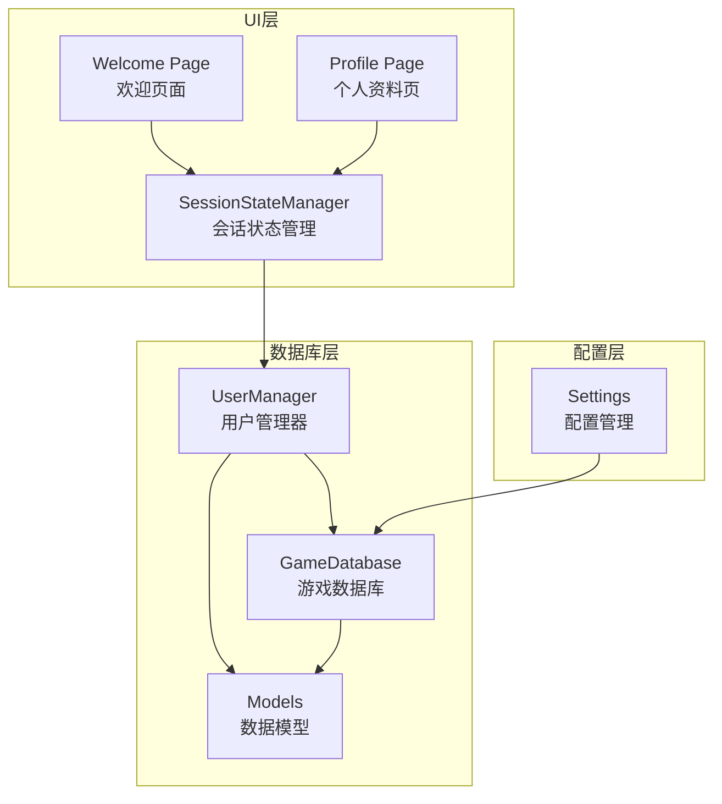
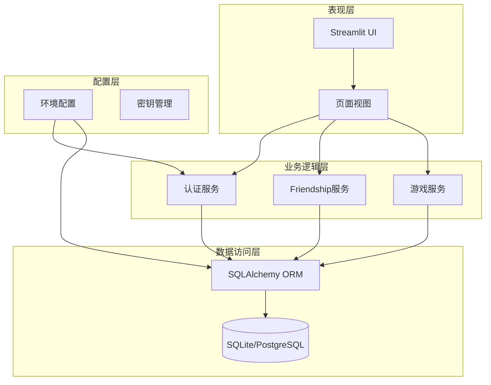
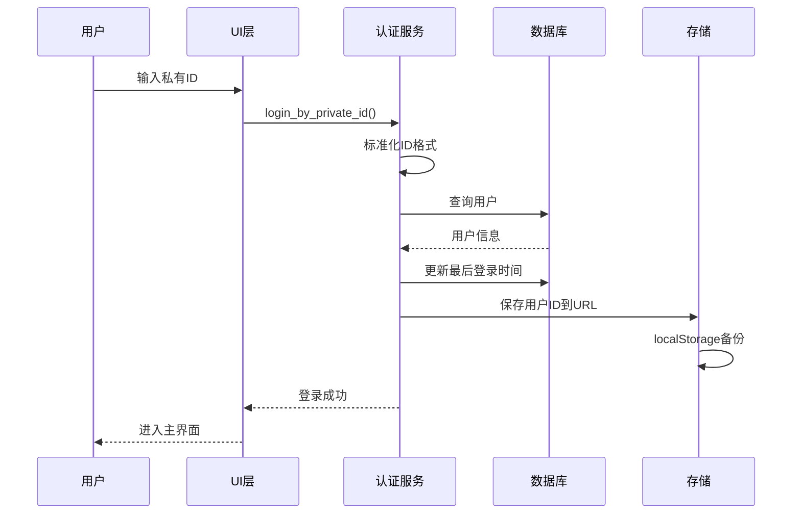
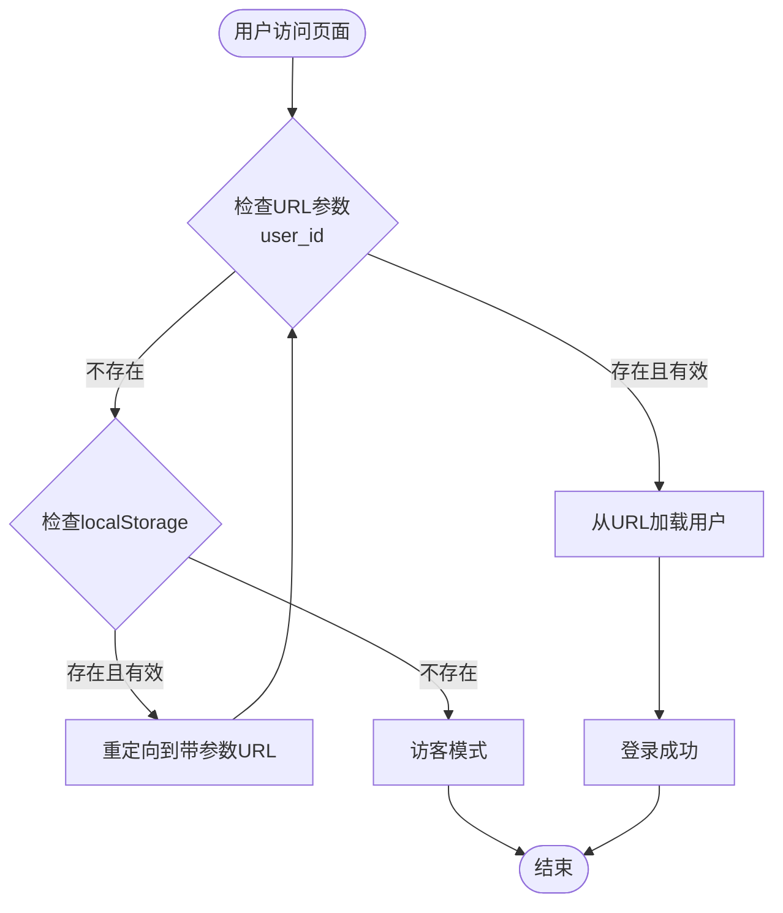
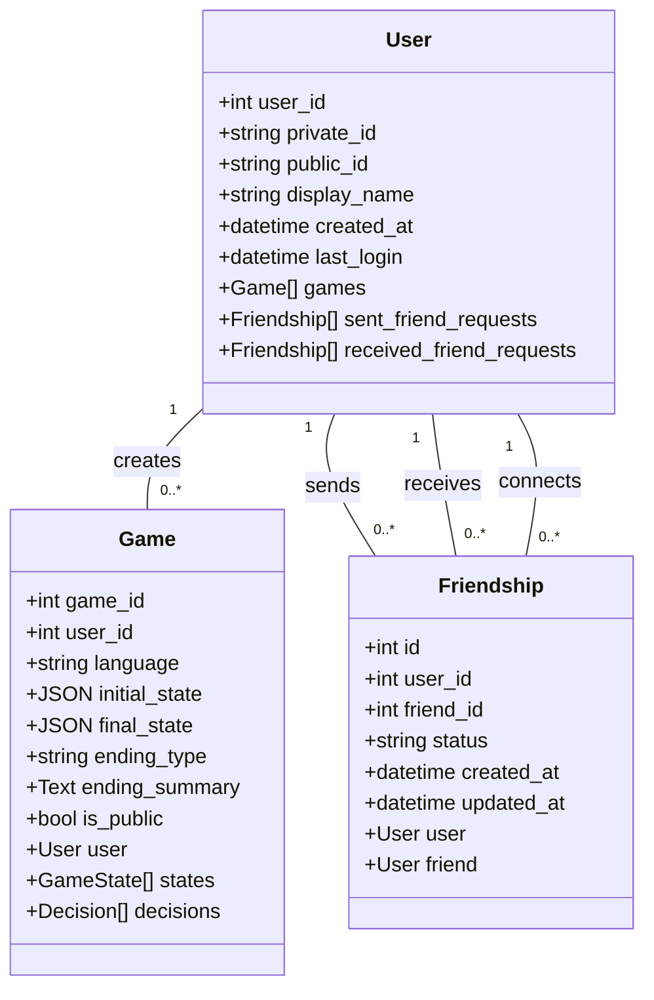
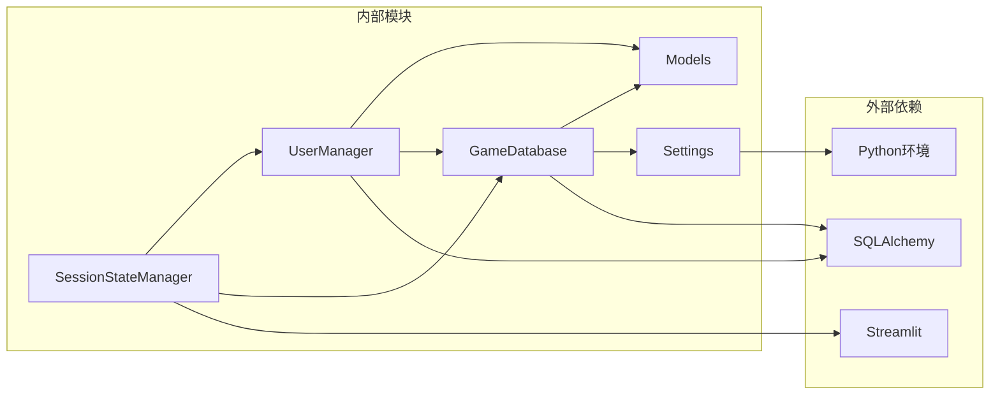

# 用户管理服务

<cite>
**本文档引用的文件**
- [user_manager.py](file://src/database/user_manager.py)
- [models.py](file://src/database/models.py)
- [state_manager.py](file://src/ui/state_manager.py)
- [session_manager.py](file://src/ui/session_manager.py)
- [db.py](file://src/database/db.py)
- [settings.py](file://config/settings.py)
- [welcome.py](file://src/ui/page_views/welcome.py)
- [profile.py](file://src/ui/page_views/profile.py)
- [test_database.py](file://tests/test_database.py)
</cite>

## 目录
1. [简介](#简介)
2. [项目结构](#项目结构)
3. [核心组件](#核心组件)
4. [架构概览](#架构概览)
5. [详细组件分析](#详细组件分析)
6. [依赖关系分析](#依赖关系分析)
7. [性能考虑](#性能考虑)
8. [故障排除指南](#故障排除指南)
9. [结论](#结论)

## 简介

用户管理服务是故事2项目的核心基础设施，负责处理用户身份验证、会话管理、用户数据操作和好友系统。该服务采用双ID策略（私有ID和公有ID），实现了安全的用户认证机制和完善的会话状态管理。

本服务支持完整的用户生命周期管理，包括用户注册、登录、个人信息管理、好友关系维护以及游戏进度的用户关联。系统设计注重安全性、可扩展性和用户体验。

## 项目结构

用户管理服务主要分布在以下模块中：

**图表来源**
- [user_manager.py](file://src/database/user_manager.py#L34-L401)
- [models.py](file://src/database/models.py#L11-L171)
- [state_manager.py](file://src/ui/state_manager.py#L42-L773)

**章节来源**
- [user_manager.py](file://src/database/user_manager.py#L1-L401)
- [models.py](file://src/database/models.py#L1-L171)
- [state_manager.py](file://src/ui/state_manager.py#L1-L773)

## 核心组件

### 用户管理器 (UserManager)

UserManager是用户管理服务的核心类，提供完整的用户生命周期管理功能：

- **用户创建**: 自动生成唯一ID并创建用户账户
- **用户认证**: 通过私有ID进行安全登录
- **个人信息管理**: 支持显示名称更新等基础信息维护
- **好友系统**: 完整的社交功能，包括请求发送、接受、拒绝和删除

### 数据模型 (Models)

系统采用SQLAlchemy ORM定义了完整的数据模型：

- **User**: 用户实体，包含私有ID、公有ID、显示名称等核心信息
- **Friendship**: 好友关系实体，支持待处理、已接受、已拒绝三种状态
- **Game**: 游戏会话实体，与用户建立一对一关系
- **GameState**: 游戏状态快照实体
- **Decision**: 决策记录实体
- **Ending**: 结局记录实体
- **CharacterPreset**: 角色预设实体

### 会话状态管理 (SessionStateManager)

统一管理Streamlit应用的会话状态，提供类型安全的访问接口：

- **用户状态**: 当前登录用户、认证模态框状态
- **游戏状态**: 游戏循环实例、当前游戏ID
- **持久化**: URL参数和localStorage的用户ID持久化
- **清理**: 用户切换时的状态清理机制

**章节来源**
- [user_manager.py](file://src/database/user_manager.py#L34-L401)
- [models.py](file://src/database/models.py#L11-L171)
- [state_manager.py](file://src/ui/state_manager.py#L42-L773)

## 架构概览

用户管理服务采用分层架构设计，确保关注点分离和模块化：

**图表来源**
- [state_manager.py](file://src/ui/state_manager.py#L1-L773)
- [user_manager.py](file://src/database/user_manager.py#L1-L401)
- [db.py](file://src/database/db.py#L1-L517)

## 详细组件分析

### 用户认证机制

用户认证采用双ID策略，确保安全性和易用性的平衡：

#### 私有ID (Private ID)
- **格式**: 8组4位字符，用连字符分隔（如：ABCD-1234-EFGH-5678）
- **用途**: 仅用于登录认证，必须严格保密
- **生成**: 使用加密安全的随机数生成器
- **唯一性**: 数据库级唯一约束保证全局唯一

#### 公有ID (Public ID)
- **格式**: 8位字母数字组合
- **用途**: 用于用户标识和添加好友
- **生成**: 随机生成，确保唯一性
- **可见性**: 可以公开分享给其他用户

**图表来源**
- [user_manager.py](file://src/database/user_manager.py#L104-L127)
- [state_manager.py](file://src/ui/state_manager.py#L587-L625)

**章节来源**
- [user_manager.py](file://src/database/user_manager.py#L15-L31)
- [user_manager.py](file://src/database/user_manager.py#L104-L127)
- [state_manager.py](file://src/ui/state_manager.py#L587-L625)

### 会话管理

会话管理采用多层持久化策略，确保用户状态的可靠恢复：

#### URL参数持久化
- **主要持久化方式**: 将用户ID保存在URL查询参数中
- **优势**: 浏览器刷新后仍能保持登录状态
- **可靠性**: 不依赖浏览器存储，跨设备兼容性好

#### localStorage备份
- **备用持久化方式**: 同时保存到localStorage
- **用途**: URL参数不可用时的后备方案
- **自动重定向**: 检测到localStorage存在时自动重定向到带参数的URL

**图表来源**
- [state_manager.py](file://src/ui/state_manager.py#L587-L625)

**章节来源**
- [state_manager.py](file://src/ui/state_manager.py#L587-L625)

### 好友系统

好友系统实现了完整的社交功能，支持多种交互场景：

#### 好友关系状态
- **待处理 (pending)**: 请求已发送但尚未响应
- **已接受 (accepted)**: 双方互为好友
- **已拒绝 (rejected)**: 请求被拒绝

#### 关系验证机制
- **双向验证**: 确保双方都确认成为好友
- **重复检测**: 防止重复的好友请求
- **自循环保护**: 不能添加自己为好友

**图表来源**
- [models.py](file://src/database/models.py#L11-L171)

**章节来源**
- [user_manager.py](file://src/database/user_manager.py#L165-L336)
- [models.py](file://src/database/models.py#L40-L59)

### 用户数据操作

用户数据操作涵盖了完整的CRUD功能，同时确保数据一致性和完整性：

#### 用户信息管理
- **显示名称**: 支持更新，最大长度50字符
- **用户关联**: 自动关联到相关的游戏和决策记录
- **级联删除**: 删除用户时自动清理相关数据

#### 游戏数据关联
- **用户游戏**: 每个用户可以拥有多个游戏会话
- **公开设置**: 支持设置游戏为公开或私有
- **权限验证**: 访问他人游戏时进行权限检查

**章节来源**
- [user_manager.py](file://src/database/user_manager.py#L145-L401)
- [db.py](file://src/database/db.py#L174-L391)

### 权限控制机制

系统实现了多层次的权限控制，确保数据安全：

#### 访问控制
- **用户游戏**: 仅允许访问自己的游戏数据
- **好友访问**: 仅允许访问已接受好友的公开游戏
- **预设访问**: 仅允许访问自己的角色预设

#### 数据完整性
- **外键约束**: 确保引用关系的完整性
- **唯一性约束**: 保证ID的唯一性
- **级联操作**: 自动处理相关数据的同步删除

**章节来源**
- [user_manager.py](file://src/database/user_manager.py#L351-L377)
- [db.py](file://src/database/db.py#L337-L340)

## 依赖关系分析

用户管理服务的依赖关系清晰明确，遵循单一职责原则：

**图表来源**
- [user_manager.py](file://src/database/user_manager.py#L1-L12)
- [state_manager.py](file://src/ui/state_manager.py#L14-L26)
- [db.py](file://src/database/db.py#L1-L8)

**章节来源**
- [user_manager.py](file://src/database/user_manager.py#L1-L12)
- [state_manager.py](file://src/ui/state_manager.py#L14-L26)
- [db.py](file://src/database/db.py#L1-L8)

## 性能考虑

用户管理服务在设计时充分考虑了性能优化：

### 数据库优化
- **索引设计**: 在常用查询字段上建立索引
- **批量操作**: 支持批量查询和更新操作
- **连接池**: 使用SQLAlchemy连接池提高数据库访问效率

### 缓存策略
- **内存缓存**: 用户会话状态存储在内存中
- **持久化备份**: URL参数和localStorage双重持久化
- **懒加载**: 按需加载数据库连接和用户数据

### 并发处理
- **线程安全**: 会话状态管理器支持并发访问
- **事务管理**: 数据库操作使用事务确保一致性
- **锁机制**: 避免竞态条件和数据冲突

## 故障排除指南

### 常见问题及解决方案

#### 用户登录失败
**症状**: 输入正确的私有ID但仍无法登录
**原因分析**:
- ID格式不正确（缺少连字符或大小写问题）
- 数据库连接异常
- 用户不存在

**解决步骤**:
1. 检查私有ID格式是否符合"XXXX-XXXX-XXXX-XXXX"模式
2. 验证数据库连接状态
3. 确认用户是否存在于数据库中

#### 好友请求异常
**症状**: 好友请求发送后状态异常
**原因分析**:
- 重复发送相同请求
- 请求超时或网络中断
- 数据库事务失败

**解决步骤**:
1. 检查是否已经发送过相同请求
2. 验证网络连接稳定性
3. 查看数据库日志确认事务状态

#### 会话状态丢失
**症状**: 刷新页面后需要重新登录
**原因分析**:
- URL参数被清理
- localStorage存储空间不足
- 浏览器隐私设置阻止存储

**解决步骤**:
1. 检查浏览器存储权限设置
2. 清理浏览器缓存和Cookie
3. 尝试使用不同的浏览器

**章节来源**
- [user_manager.py](file://src/database/user_manager.py#L104-L127)
- [state_manager.py](file://src/ui/state_manager.py#L587-L625)

## 结论

用户管理服务通过精心设计的架构和实现，为故事2项目提供了稳定可靠的用户管理基础设施。系统采用双ID策略平衡了安全性与易用性，完善的会话管理确保了良好的用户体验，而严格的权限控制机制保障了数据安全。

该服务的主要优势包括：
- **安全性**: 双ID策略和严格的权限控制
- **可靠性**: 多层持久化和错误处理机制
- **可扩展性**: 模块化设计便于功能扩展
- **易用性**: 简洁的API和完善的文档

未来可以考虑的改进方向：
- 增强密码安全机制（如支持密码登录）
- 实现更细粒度的权限控制
- 添加用户行为审计功能
- 优化大数据量下的性能表现