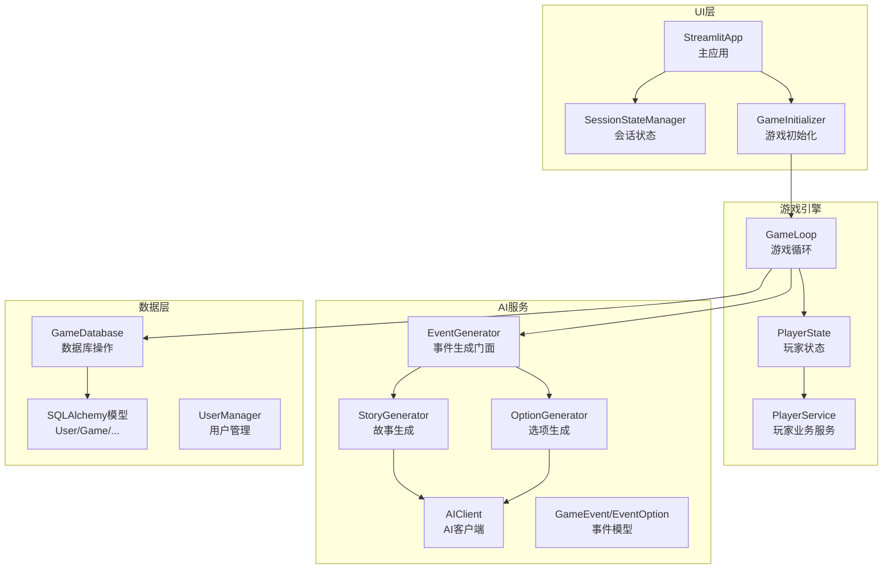
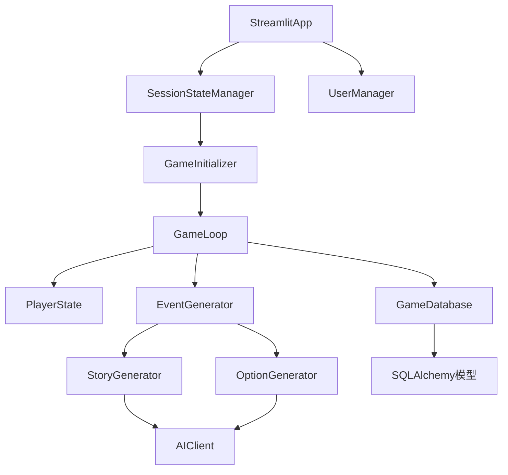
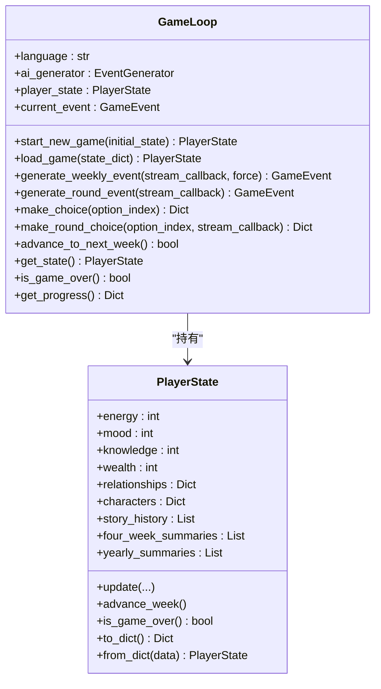
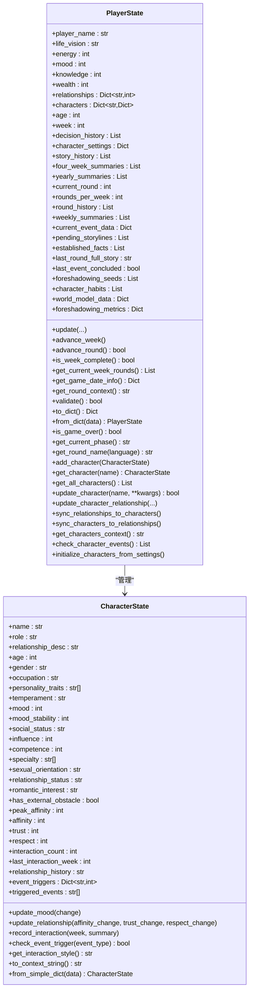
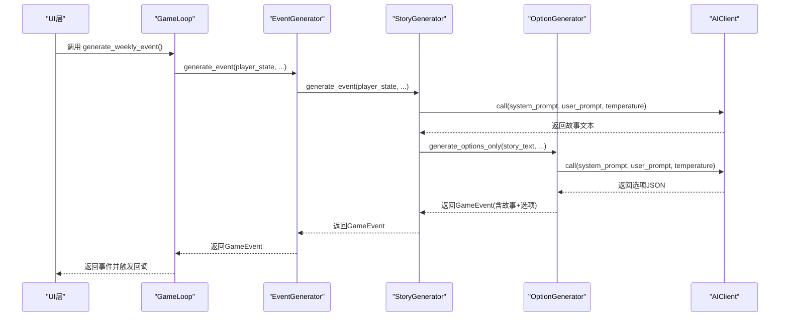
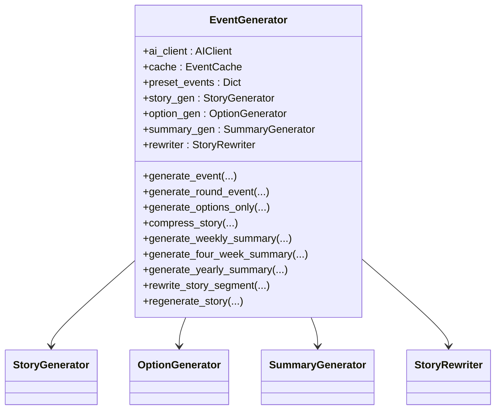
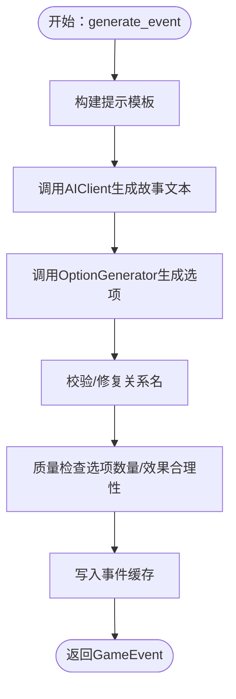
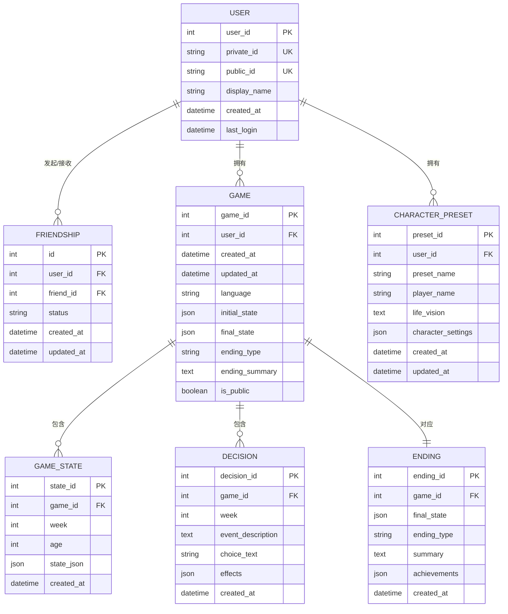
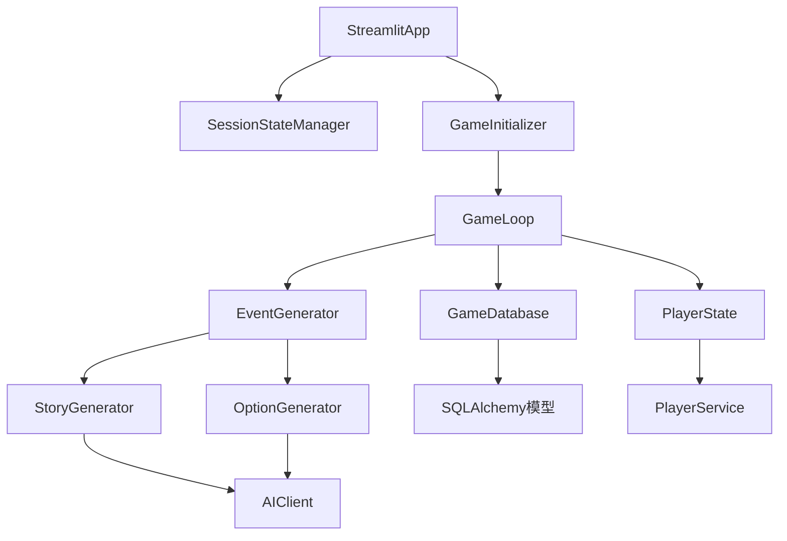

# 核心模块详解

<cite>
**本文档引用的文件**
- [src/game/game_loop.py](file://src/game/game_loop.py)
- [src/game/state.py](file://src/game/state.py)
- [src/ai/generator.py](file://src/ai/generator.py)
- [src/ai/story_generator.py](file://src/ai/story_generator.py)
- [src/ai/option_generator.py](file://src/ai/option_generator.py)
- [src/ai/client.py](file://src/ai/client.py)
- [src/ai/models.py](file://src/ai/models.py)
- [src/database/models.py](file://src/database/models.py)
- [src/database/db.py](file://src/database/db.py)
- [src/database/user_manager.py](file://src/database/user_manager.py)
- [src/ui/streamlit_app.py](file://src/ui/streamlit_app.py)
- [src/ui/state_manager.py](file://src/ui/state_manager.py)
- [src/ui/session_manager.py](file://src/ui/session_manager.py)
- [src/ui/services/game_initializer.py](file://src/ui/services/game_initializer.py)
- [src/game/player_service.py](file://src/game/player_service.py)
- [config/settings.py](file://config/settings.py)
- [config/prompts.py](file://config/prompts.py)
</cite>

## 目录
1. [简介](#简介)
2. [项目结构](#项目结构)
3. [核心组件](#核心组件)
4. [架构总览](#架构总览)
5. [详细组件分析](#详细组件分析)
6. [依赖关系分析](#依赖关系分析)
7. [性能考虑](#性能考虑)
8. [故障排除指南](#故障排除指南)
9. [结论](#结论)

## 简介
本文件为“人生草稿本”的核心模块技术文档，聚焦四大模块：游戏引擎模块（GameLoop、PlayerState、事件生成）、AI服务模块（事件生成、故事生成、选项生成）、数据管理层（ORM模型、用户管理、状态持久化）和UI界面模块（Streamlit应用、页面视图、会话管理）。文档深入解析各模块的类结构、方法接口、数据流与使用示例，并阐明模块间的依赖关系与协作模式。

## 项目结构
项目采用按功能域划分的目录结构，核心模块分布如下：
- 游戏引擎：src/game（游戏循环、状态管理、决策处理、NPC系统等）
- AI服务：src/ai（事件生成、故事生成、选项生成、客户端抽象等）
- 数据层：src/database（ORM模型、数据库操作、用户管理）
- UI层：src/ui（Streamlit应用、页面视图、会话管理、状态管理）

图表来源
- [src/game/game_loop.py](file://src/game/game_loop.py#L23-L1193)
- [src/game/state.py](file://src/game/state.py#L244-L709)
- [src/ai/generator.py](file://src/ai/generator.py#L30-L407)
- [src/ai/story_generator.py](file://src/ai/story_generator.py#L24-L387)
- [src/ai/option_generator.py](file://src/ai/option_generator.py#L17-L248)
- [src/ai/client.py](file://src/ai/client.py#L22-L214)
- [src/ai/models.py](file://src/ai/models.py#L7-L27)
- [src/database/db.py](file://src/database/db.py#L10-L517)
- [src/database/models.py](file://src/database/models.py#L11-L171)
- [src/database/user_manager.py](file://src/database/user_manager.py#L34-L401)
- [src/ui/streamlit_app.py](file://src/ui/streamlit_app.py#L1-L215)
- [src/ui/state_manager.py](file://src/ui/state_manager.py#L42-L773)
- [src/ui/services/game_initializer.py](file://src/ui/services/game_initializer.py#L49-L155)

章节来源
- [src/game/game_loop.py](file://src/game/game_loop.py#L1-L1193)
- [src/ai/generator.py](file://src/ai/generator.py#L1-L407)
- [src/database/db.py](file://src/database/db.py#L1-L517)
- [src/ui/streamlit_app.py](file://src/ui/streamlit_app.py#L1-L215)

## 核心组件

### 游戏引擎模块
- GameLoop：主循环控制器，负责事件生成、决策处理、周推进、年度/季度总结、多轮系统集成。
- PlayerState：统一的状态容器，包含资源、关系、角色、历史、总结、伏笔系统、世界模型数据等。
- PlayerService：从PlayerState抽离的业务逻辑服务，负责角色初始化、关系更新、事件检查等。

章节来源
- [src/game/game_loop.py](file://src/game/game_loop.py#L23-L1193)
- [src/game/state.py](file://src/game/state.py#L244-L709)
- [src/game/player_service.py](file://src/game/player_service.py#L9-L176)

### AI服务模块
- EventGenerator：事件生成门面，聚合StoryGenerator、OptionGenerator、SummaryGenerator、StoryRewriter。
- StoryGenerator：两阶段流水线第一步，生成纯故事文本，再交由OptionGenerator生成选项。
- OptionGenerator：两阶段流水线第二步，生成选项并进行关系名校验与质量检查。
- AIClient：统一的AI调用抽象层，封装OpenAI客户端、流式回调、JSON解析、重试与错误反馈注入。
- GameEvent/EventOption：事件与选项的数据模型。

章节来源
- [src/ai/generator.py](file://src/ai/generator.py#L30-L407)
- [src/ai/story_generator.py](file://src/ai/story_generator.py#L24-L387)
- [src/ai/option_generator.py](file://src/ai/option_generator.py#L17-L248)
- [src/ai/client.py](file://src/ai/client.py#L22-L214)
- [src/ai/models.py](file://src/ai/models.py#L7-L27)

### 数据管理层
- SQLAlchemy模型：User、Friendship、Game、GameState、Decision、Ending、CharacterPreset。
- GameDatabase：封装数据库CRUD、状态快照、决策记录、结局保存、角色预设管理。
- UserManager：用户创建/登录、好友系统、公开游戏管理。

章节来源
- [src/database/models.py](file://src/database/models.py#L11-L171)
- [src/database/db.py](file://src/database/db.py#L10-L517)
- [src/database/user_manager.py](file://src/database/user_manager.py#L34-L401)

### UI界面模块
- StreamlitApp：应用入口，页面路由、角色创建流程、游戏播放页渲染。
- SessionStateManager：统一的会话状态管理，类型安全、集中初始化、事件与结果状态统一来源。
- GameInitializer：从角色设定初始化游戏，创建GameLoop与数据库记录。

章节来源
- [src/ui/streamlit_app.py](file://src/ui/streamlit_app.py#L1-L215)
- [src/ui/state_manager.py](file://src/ui/state_manager.py#L42-L773)
- [src/ui/services/game_initializer.py](file://src/ui/services/game_initializer.py#L49-L155)

## 架构总览
整体架构遵循“UI层-业务层-数据层”的分层设计，AI服务作为业务层的核心支撑，通过门面模式解耦复杂性；游戏引擎负责状态与流程控制；数据层提供持久化与用户管理；UI层通过会话状态管理协调各模块。

图表来源
- [src/ui/streamlit_app.py](file://src/ui/streamlit_app.py#L139-L215)
- [src/ui/state_manager.py](file://src/ui/state_manager.py#L42-L773)
- [src/ui/services/game_initializer.py](file://src/ui/services/game_initializer.py#L49-L155)
- [src/game/game_loop.py](file://src/game/game_loop.py#L23-L1193)
- [src/ai/generator.py](file://src/ai/generator.py#L30-L407)
- [src/ai/client.py](file://src/ai/client.py#L22-L214)
- [src/database/db.py](file://src/database/db.py#L10-L517)
- [src/database/models.py](file://src/database/models.py#L11-L171)
- [src/database/user_manager.py](file://src/database/user_manager.py#L34-L401)

## 详细组件分析

### 游戏引擎模块

#### GameLoop 类结构与方法
- 核心职责：管理主游戏循环，生成每周事件，处理玩家选择，推进周/年进度，生成周期性总结。
- 关键方法：
  - start_new_game/load_game：初始化/加载玩家状态，支持从character_settings批量生成NPC。
  - generate_weekly_event/generate_round_event：事件生成（常规周事件与多轮事件）。
  - make_choice/make_round_choice：处理玩家选择，应用效果，生成故事续写与周/年总结。
  - advance_to_next_week/_generate_four_week_summary/_generate_yearly_summary：周推进与周期性总结。
  - get_state/is_game_over/get_progress：状态查询与进度报告。
- 依赖关系：依赖EventGenerator、StoryService、YearlySummaryGenerator、NarrativeManager、WorldModelUpdater、HistoricalSummarySelector、RelationshipMCPService。

图表来源
- [src/game/game_loop.py](file://src/game/game_loop.py#L23-L1193)
- [src/game/state.py](file://src/game/state.py#L244-L709)

章节来源
- [src/game/game_loop.py](file://src/game/game_loop.py#L23-L1193)
- [src/game/state.py](file://src/game/state.py#L244-L709)

#### PlayerState 类结构与字段
- 资源属性：energy、mood、knowledge、wealth（带上下界校验）。
- 关系系统：relationships（兼容旧版）与characters（新NPC系统）双轨并行。
- 历史与总结：story_history、four_week_summaries、yearly_summaries。
- 多轮系统：current_round、rounds_per_week、round_history、weekly_summaries。
- 世界模型与伏笔：world_model_data、foreshadowing_seeds、foreshadowing_metrics。
- NPC角色：CharacterState（包含亲密度、信任、尊重、情绪稳定性、事件触发阈值等）。

图表来源
- [src/game/state.py](file://src/game/state.py#L12-L709)

章节来源
- [src/game/state.py](file://src/game/state.py#L12-L709)

#### 事件生成流程（GameLoop → EventGenerator → StoryGenerator → OptionGenerator）

图表来源
- [src/game/game_loop.py](file://src/game/game_loop.py#L153-L256)
- [src/ai/generator.py](file://src/ai/generator.py#L159-L214)
- [src/ai/story_generator.py](file://src/ai/story_generator.py#L32-L175)
- [src/ai/option_generator.py](file://src/ai/option_generator.py#L25-L132)
- [src/ai/client.py](file://src/ai/client.py#L51-L104)

章节来源
- [src/game/game_loop.py](file://src/game/game_loop.py#L153-L256)
- [src/ai/generator.py](file://src/ai/generator.py#L159-L214)
- [src/ai/story_generator.py](file://src/ai/story_generator.py#L32-L175)
- [src/ai/option_generator.py](file://src/ai/option_generator.py#L25-L132)
- [src/ai/client.py](file://src/ai/client.py#L51-L104)

### AI服务模块

#### EventGenerator 门面模式
- 职责：聚合StoryGenerator、OptionGenerator、SummaryGenerator、StoryRewriter，统一对外接口，保留向后兼容。
- 关键方法：generate_event/generate_round_event/generate_options_only/compress_story/generate_weekly_summary/generate_four_week_summary/generate_yearly_summary/rewrite_story_segment/regenerate_story。
- 缓存与预设：EventCache、预设事件(events.json)。

图表来源
- [src/ai/generator.py](file://src/ai/generator.py#L30-L407)

章节来源
- [src/ai/generator.py](file://src/ai/generator.py#L30-L407)

#### StoryGenerator 两阶段流水线
- 第一阶段：根据提示模板生成纯故事文本，支持流式回调与重试。
- 第二阶段：基于故事文本生成选项，进行关系名校验与质量检查，缓存事件。
- 一致性校验：可选WorldModel一致性校验与自动重试。

图表来源
- [src/ai/story_generator.py](file://src/ai/story_generator.py#L32-L175)
- [src/ai/option_generator.py](file://src/ai/option_generator.py#L25-L132)

章节来源
- [src/ai/story_generator.py](file://src/ai/story_generator.py#L32-L175)
- [src/ai/option_generator.py](file://src/ai/option_generator.py#L25-L132)

#### OptionGenerator 选项生成与校验
- 从现有故事生成选项，提取JSON并构造GameEvent。
- 关系名校验：确保仅使用key_people中的合法名称，支持大小写与角色名模糊匹配。
- 质量检查：选项数量、动作点成本、效果合理性与权衡性。

章节来源
- [src/ai/option_generator.py](file://src/ai/option_generator.py#L17-L248)

#### AIClient 统一AI调用抽象
- 统一封装OpenAI客户端，支持流式回调、JSON解析、重试与错误反馈注入。
- 提供call/call_json/call_with_retry三种调用方式。

章节来源
- [src/ai/client.py](file://src/ai/client.py#L22-L214)

#### 事件模型 GameEvent/EventOption
- GameEvent：包含事件描述与选项列表。
- EventOption：包含选项文本、效果字典与倾向标记。

章节来源
- [src/ai/models.py](file://src/ai/models.py#L7-L27)

### 数据管理层

#### SQLAlchemy模型与关系
- User/Friendship：用户与好友关系，支持状态（pending/accepted/rejected）。
- Game/GameState/Decision/Ending：游戏会话、状态快照、决策记录、结局。
- CharacterPreset：角色预设，支持用户绑定与公开/私有。

图表来源
- [src/database/models.py](file://src/database/models.py#L11-L171)

章节来源
- [src/database/models.py](file://src/database/models.py#L11-L171)

#### GameDatabase 数据访问层
- 核心方法：create_game/save_state/save_decision/save_ending/load_game_state/get_game/list_games/get_decision_history/list_saved_games/save_game_progress/load_saved_game/delete_saved_game/save_character_preset/load_character_preset/list_character_presets/delete_character_preset。
- 状态持久化：按周保存GameState快照，支持恢复与进度更新。

章节来源
- [src/database/db.py](file://src/database/db.py#L10-L517)

#### UserManager 用户管理
- 用户：创建/登录（私有ID）、显示名更新。
- 好友：发送/接受/拒绝请求、删除好友、获取好友列表与待处理请求。
- 游戏：获取用户游戏、好友公开游戏、设置公开状态。

章节来源
- [src/database/user_manager.py](file://src/database/user_manager.py#L34-L401)

### UI界面模块

#### StreamlitApp 应用入口
- 页面路由：欢迎页、角色创建、预设选择、保存预设、开场故事、游戏进行中、个人资料。
- 初始化：数据库初始化、样式注入、会话状态初始化、用户/游戏恢复。
- 字符串创建流程：输入姓名与人生愿景，调用GameInitializer创建GameLoop与Game记录。

章节来源
- [src/ui/streamlit_app.py](file://src/ui/streamlit_app.py#L1-L215)

#### SessionStateManager 会话状态管理
- 类型安全：GameState枚举、类型化getter/setter。
- 单一真相源：current_event统一来源于GameLoop，兼顾向后兼容。
- 用户持久化：URL参数与localStorage双通道保存/恢复用户ID与游戏ID/状态。
- 调试日志：统一的日志收集与上限控制。

章节来源
- [src/ui/state_manager.py](file://src/ui/state_manager.py#L29-L773)

#### GameInitializer 游戏初始化服务
- 从角色设定创建GameLoop与初始状态，应用年龄、属性、财富、货币、关系。
- 创建数据库Game记录，返回GameLoop与game_id。

章节来源
- [src/ui/services/game_initializer.py](file://src/ui/services/game_initializer.py#L49-L155)

## 依赖关系分析

图表来源
- [src/game/game_loop.py](file://src/game/game_loop.py#L23-L1193)
- [src/ai/generator.py](file://src/ai/generator.py#L30-L407)
- [src/ai/client.py](file://src/ai/client.py#L22-L214)
- [src/database/db.py](file://src/database/db.py#L10-L517)
- [src/database/models.py](file://src/database/models.py#L11-L171)
- [src/ui/streamlit_app.py](file://src/ui/streamlit_app.py#L1-L215)
- [src/ui/state_manager.py](file://src/ui/state_manager.py#L42-L773)
- [src/ui/services/game_initializer.py](file://src/ui/services/game_initializer.py#L49-L155)
- [src/game/player_service.py](file://src/game/player_service.py#L9-L176)

章节来源
- [src/game/game_loop.py](file://src/game/game_loop.py#L23-L1193)
- [src/ai/generator.py](file://src/ai/generator.py#L30-L407)
- [src/database/db.py](file://src/database/db.py#L10-L517)
- [src/ui/streamlit_app.py](file://src/ui/streamlit_app.py#L1-L215)

## 性能考虑
- AI调用优化：AIClient支持流式回调减少首屏等待；EventCache启用可显著降低重复事件生成成本。
- 数据持久化：按周保存GameState快照，避免全量序列化；数据库连接池与索引优化（Friendship.ix_friendship_pair）。
- UI渲染：SessionStateManager集中状态，减少st.session_state分散读写；合理使用st.rerun与增量更新。
- 事件生成：两阶段流水线（故事+选项）在失败时重试并注入错误反馈，提升成功率与稳定性。

## 故障排除指南
- AI API密钥缺失：Settings.validate会在缺少OPENAI_API_KEY时抛出异常，需在环境变量中配置。
- 事件生成失败：EventGenerator在失败时回退到简单事件；检查日志与重试次数配置。
- 数据库连接：settings.get_database_url优先使用DATABASE_URL（云数据库），否则回退SQLite路径。
- 会话恢复：restore_user_from_storage/restore_game_from_storage通过URL参数与localStorage双通道恢复，若失败会清理存储并记录日志。

章节来源
- [config/settings.py](file://config/settings.py#L84-L90)
- [src/ai/generator.py](file://src/ai/generator.py#L188-L256)
- [config/settings.py](file://config/settings.py#L73-L82)
- [src/ui/state_manager.py](file://src/ui/state_manager.py#L587-L773)

## 结论
本项目通过清晰的模块划分与职责分离，实现了可扩展、可维护的游戏引擎与AI驱动的叙事系统。GameLoop与PlayerState为核心状态与流程控制单元，EventGenerator与StoryGenerator/OptionGenerator构成强大的事件生成流水线，GameDatabase与UserManager保障数据与用户体系的稳定，UI层通过SessionStateManager实现统一、类型安全的会话管理。模块间通过明确的接口与依赖注入实现松耦合，便于后续扩展与演进。