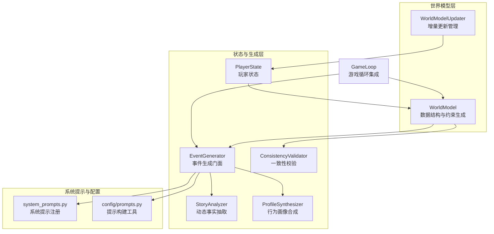
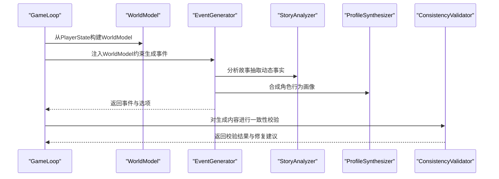
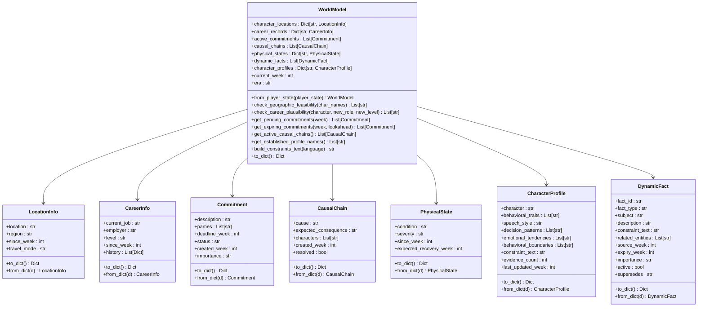
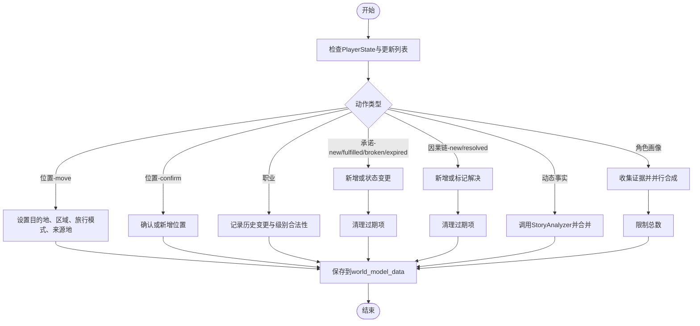
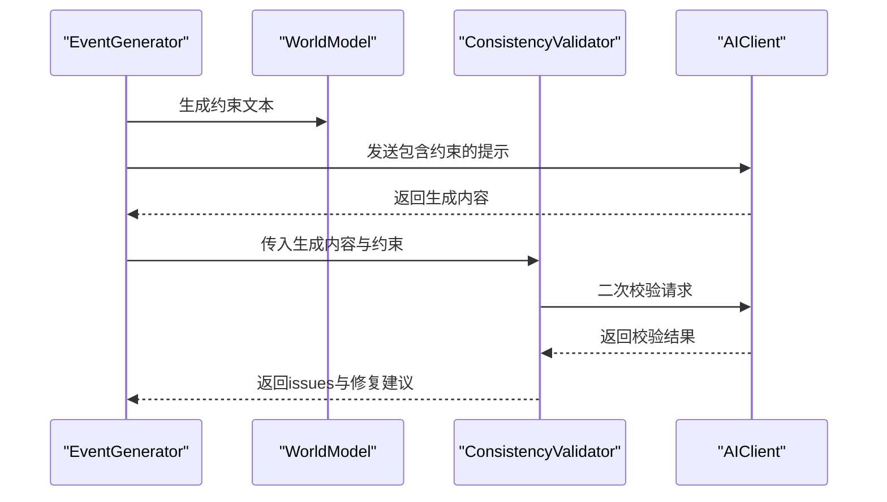
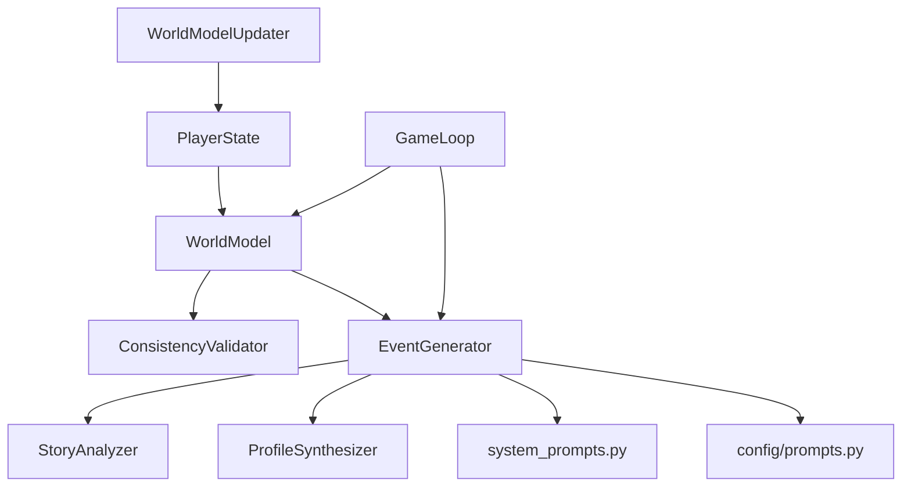

# 世界模型系统

<cite>
**本文引用的文件**
- [src/game/world_model.py](file://src/game/world_model.py)
- [src/game/world_model_updater.py](file://src/game/world_model_updater.py)
- [src/game/state.py](file://src/game/state.py)
- [src/ai/consistency_validator.py](file://src/ai/consistency_validator.py)
- [src/ai/generator.py](file://src/ai/generator.py)
- [src/ai/story_analyzer.py](file://src/ai/story_analyzer.py)
- [src/ai/profile_synthesizer.py](file://src/ai/profile_synthesizer.py)
- [src/game/game_loop.py](file://src/game/game_loop.py)
- [src/ai/system_prompts.py](file://src/ai/system_prompts.py)
- [config/prompts.py](file://config/prompts.py)
</cite>

## 目录
1. [简介](#简介)
2. [项目结构](#项目结构)
3. [核心组件](#核心组件)
4. [架构总览](#架构总览)
5. [详细组件分析](#详细组件分析)
6. [依赖关系分析](#依赖关系分析)
7. [性能考量](#性能考量)
8. [故障排查指南](#故障排查指南)
9. [结论](#结论)
10. [附录](#附录)

## 简介
本技术文档围绕“世界模型系统”展开，系统目标是为故事驱动型游戏中提供统一、可查询、可校验的结构化世界状态，确保事件生成与叙述一致性。世界模型以PlayerState为输入，构建包含角色位置、职业记录、承诺事项、因果链、身体状态、动态事实与角色行为画像等维度的数据结构，并通过约束文本注入AI提示词，实现AI生成内容的一致性校验与故事连贯性保障。

## 项目结构
世界模型系统主要分布在以下模块：
- 数据结构与模型：src/game/world_model.py
- 模型增量更新：src/game/world_model_updater.py
- 玩家状态载体：src/game/state.py
- 一致性校验：src/ai/consistency_validator.py
- 事件生成与提示注入：src/ai/generator.py、config/prompts.py
- 动态事实抽取：src/ai/story_analyzer.py
- 行为画像合成：src/ai/profile_synthesizer.py
- 游戏循环集成：src/game/game_loop.py
- 系统提示词注册：src/ai/system_prompts.py

图表来源
- [src/game/world_model.py](file://src/game/world_model.py#L185-L641)
- [src/game/world_model_updater.py](file://src/game/world_model_updater.py#L15-L528)
- [src/game/state.py](file://src/game/state.py#L244-L709)
- [src/ai/consistency_validator.py](file://src/ai/consistency_validator.py#L42-L231)
- [src/ai/generator.py](file://src/ai/generator.py#L30-L431)
- [src/ai/story_analyzer.py](file://src/ai/story_analyzer.py#L94-L318)
- [src/ai/profile_synthesizer.py](file://src/ai/profile_synthesizer.py#L16-L85)
- [src/game/game_loop.py](file://src/game/game_loop.py#L24-L200)
- [src/ai/system_prompts.py](file://src/ai/system_prompts.py#L1-L200)
- [config/prompts.py](file://config/prompts.py#L556-L577)

章节来源
- [src/game/world_model.py](file://src/game/world_model.py#L1-L665)
- [src/game/world_model_updater.py](file://src/game/world_model_updater.py#L1-L528)
- [src/game/state.py](file://src/game/state.py#L244-L709)
- [src/ai/consistency_validator.py](file://src/ai/consistency_validator.py#L1-L231)
- [src/ai/generator.py](file://src/ai/generator.py#L1-L431)
- [src/ai/story_analyzer.py](file://src/ai/story_analyzer.py#L1-L318)
- [src/ai/profile_synthesizer.py](file://src/ai/profile_synthesizer.py#L1-L85)
- [src/game/game_loop.py](file://src/game/game_loop.py#L1-L200)
- [src/ai/system_prompts.py](file://src/ai/system_prompts.py#L1-L200)
- [config/prompts.py](file://config/prompts.py#L556-L577)

## 核心组件
- WorldModel：结构化世界模型，负责从PlayerState构建、序列化、约束文本生成与一致性校验。
- WorldModelUpdater：增量更新管理，处理位置、职业、承诺、因果链、动态事实与角色画像的更新。
- PlayerState：承载玩家与NPC状态、回合历史、世界模型数据容器等。
- ConsistencyValidator：基于AI的二次校验，确保生成内容与世界模型一致。
- EventGenerator：事件生成门面，负责调用各子服务并注入世界模型约束。
- StoryAnalyzer：从故事中抽取动态事实，形成可复用的约束。
- ProfileSynthesizer：从行为证据合成角色行为画像，纳入一致性约束。
- GameLoop：游戏循环集成点，负责构建WorldModel、调用生成与校验流程。

章节来源
- [src/game/world_model.py](file://src/game/world_model.py#L185-L641)
- [src/game/world_model_updater.py](file://src/game/world_model_updater.py#L15-L528)
- [src/game/state.py](file://src/game/state.py#L244-L709)
- [src/ai/consistency_validator.py](file://src/ai/consistency_validator.py#L42-L231)
- [src/ai/generator.py](file://src/ai/generator.py#L30-L431)
- [src/ai/story_analyzer.py](file://src/ai/story_analyzer.py#L94-L318)
- [src/ai/profile_synthesizer.py](file://src/ai/profile_synthesizer.py#L16-L85)
- [src/game/game_loop.py](file://src/game/game_loop.py#L24-L200)

## 架构总览
世界模型系统采用“数据结构 + 增量更新 + AI驱动抽取与校验”的分层架构：
- 数据层：LocationInfo、CareerInfo、Commitment、CausalChain、PhysicalState、CharacterProfile、DynamicFact。
- 构建层：WorldModel.from_player_state()从PlayerState读取结构化数据与历史事实，补充初始职业与地区推断。
- 约束层：WorldModel.build_constraints_text()将多维约束整合为可注入提示词的文本块。
- 更新层：WorldModelUpdater按动作类型处理位置、职业、承诺、因果链、动态事实与角色画像的增删改。
- 校验层：ConsistencyValidator调用AI对生成故事进行一致性检查，结合角色画像提升敏感度。
- 集成层：GameLoop在每轮生成前构建WorldModel，注入提示词并执行校验，确保故事连贯性。

图表来源
- [src/game/game_loop.py](file://src/game/game_loop.py#L714-L744)
- [src/game/world_model.py](file://src/game/world_model.py#L202-L287)
- [src/ai/generator.py](file://src/ai/generator.py#L240-L280)
- [src/ai/story_analyzer.py](file://src/ai/story_analyzer.py#L111-L165)
- [src/ai/profile_synthesizer.py](file://src/ai/profile_synthesizer.py#L22-L85)
- [src/ai/consistency_validator.py](file://src/ai/consistency_validator.py#L60-L118)

## 详细组件分析

### WorldModel 类与数据结构
- 数据结构设计
  - 地理位置：LocationInfo，包含地点、区域、到达时间、旅行模式。
  - 职业记录：CareerInfo，包含当前职位、雇主、级别、起始周、历史变更。
  - 承诺事项：Commitment，包含描述、参与方、截止周、状态、创建周、重要性。
  - 因果链：CausalChain，包含原因、预期后果、涉及角色、创建周、是否解决。
  - 身体状态：PhysicalState，包含状况、严重程度、起始周、预计恢复周。
  - 角色画像：CharacterProfile，包含行为特征、言语风格、决策模式、情感倾向、行为边界、约束文本、证据计数、最后更新周。
  - 动态事实：DynamicFact（由StoryAnalyzer产出），包含事实ID、类型、主体、描述、约束文本、关联实体、来源周、过期周、重要性、活动状态、替代ID。
- 构建过程
  - 从PlayerState读取world_model_data与legacy established_facts，补充初始职业与地区推断。
  - 从StoryAnalyzer动态事实中过滤有效且未过期的事实。
- 约束文本生成
  - 按地理、职业、承诺、因果链、身体状态、动态事实、角色画像顺序生成约束段落。
  - 支持中英文切换与令牌限制控制。
- 一致性校验
  - 提供地理可行性检查、职业晋升合理性检查、承诺到期与将到期检查、未解决因果链检查、角色画像建立情况检查。

图表来源
- [src/game/world_model.py](file://src/game/world_model.py#L17-L161)
- [src/game/world_model.py](file://src/game/world_model.py#L185-L641)

章节来源
- [src/game/world_model.py](file://src/game/world_model.py#L17-L161)
- [src/game/world_model.py](file://src/game/world_model.py#L185-L641)

### WorldModelUpdater 增量更新
- 位置更新：支持move与confirm两类动作，维护区域推断、旅行模式与来源地。
- 职业更新：记录历史变更、级别合法性与最小任职周数。
- 承诺更新：新增、完成、破坏、过期四种状态转换，清理过期承诺。
- 因果链更新：新增与解决两种动作，维护解决周与解释。
- 动态事实抽取：调用StoryAnalyzer，执行替代、过期过滤与数量限制。
- 角色画像合成：收集本周回合证据，提取关键角色，AI合成画像并限制总数。

图表来源
- [src/game/world_model_updater.py](file://src/game/world_model_updater.py#L22-L197)
- [src/game/world_model_updater.py](file://src/game/world_model_updater.py#L202-L258)
- [src/game/world_model_updater.py](file://src/game/world_model_updater.py#L263-L354)
- [src/game/world_model_updater.py](file://src/game/world_model_updater.py#L359-L527)

章节来源
- [src/game/world_model_updater.py](file://src/game/world_model_updater.py#L15-L528)

### PlayerState 与世界模型数据容器
- world_model_data：结构化世界模型数据容器，包含位置、职业、承诺、因果链、身体状态、动态事实、角色画像。
- established_facts：历史遗留事实，WorldModel构建时仍会读取以兼容旧存档。
- 世界模型构建：WorldModel.from_player_state()从world_model_data与established_facts构建，补充初始职业与地区推断。

章节来源
- [src/game/state.py](file://src/game/state.py#L334-L351)
- [src/game/world_model.py](file://src/game/world_model.py#L202-L287)

### 一致性校验与约束注入
- 约束文本生成：WorldModel.build_constraints_text()按维度生成约束段落，支持中英文切换与令牌限制。
- 一致性校验：ConsistencyValidator.validate_story()调用AI对生成内容进行检查，结合角色画像提升敏感度，输出修复建议。
- 提示构建：config/prompts.py提供_build_world_model_constraints()，统一调用WorldModel.build_constraints_text()。

图表来源
- [src/game/world_model.py](file://src/game/world_model.py#L381-L434)
- [src/ai/consistency_validator.py](file://src/ai/consistency_validator.py#L60-L118)
- [config/prompts.py](file://config/prompts.py#L556-L577)

章节来源
- [src/ai/consistency_validator.py](file://src/ai/consistency_validator.py#L42-L231)
- [src/ai/system_prompts.py](file://src/ai/system_prompts.py#L119-L132)
- [config/prompts.py](file://config/prompts.py#L556-L577)

### 动态事实抽取与角色画像合成
- 动态事实抽取：StoryAnalyzer.analyze_story()从完整故事与玩家选择中抽取关键事实，生成约束文本，支持替代、更新与失效操作。
- 角色画像合成：ProfileSynthesizer.synthesize()基于行为证据与既有画像，合成角色行为画像，纳入约束文本。

章节来源
- [src/ai/story_analyzer.py](file://src/ai/story_analyzer.py#L94-L318)
- [src/ai/profile_synthesizer.py](file://src/ai/profile_synthesizer.py#L16-L85)

### 游戏循环中的世界模型集成
- GameLoop在每轮事件生成前构建WorldModel，注入提示词并执行一致性校验，确保故事连贯性与逻辑一致性。

章节来源
- [src/game/game_loop.py](file://src/game/game_loop.py#L714-L744)

## 依赖关系分析
- WorldModel依赖PlayerState提供的world_model_data与character_settings。
- WorldModelUpdater静态方法接受PlayerState与更新列表，直接修改world_model_data。
- ConsistencyValidator依赖WorldModel生成的约束文本与角色画像信息。
- EventGenerator作为门面，协调StoryAnalyzer、ProfileSynthesizer与系统提示词。
- GameLoop在事件生成前后集成WorldModel构建、约束注入与一致性校验。

图表来源
- [src/game/world_model.py](file://src/game/world_model.py#L202-L287)
- [src/game/world_model_updater.py](file://src/game/world_model_updater.py#L15-L528)
- [src/ai/consistency_validator.py](file://src/ai/consistency_validator.py#L60-L118)
- [src/ai/generator.py](file://src/ai/generator.py#L30-L431)
- [src/ai/story_analyzer.py](file://src/ai/story_analyzer.py#L111-L165)
- [src/ai/profile_synthesizer.py](file://src/ai/profile_synthesizer.py#L22-L85)
- [src/game/game_loop.py](file://src/game/game_loop.py#L714-L744)

章节来源
- [src/game/world_model.py](file://src/game/world_model.py#L202-L287)
- [src/game/world_model_updater.py](file://src/game/world_model_updater.py#L15-L528)
- [src/ai/consistency_validator.py](file://src/ai/consistency_validator.py#L42-L231)
- [src/ai/generator.py](file://src/ai/generator.py#L30-L431)
- [src/ai/story_analyzer.py](file://src/ai/story_analyzer.py#L94-L318)
- [src/ai/profile_synthesizer.py](file://src/ai/profile_synthesizer.py#L16-L85)
- [src/game/game_loop.py](file://src/game/game_loop.py#L714-L744)

## 性能考量
- 令牌与内存控制
  - 约束文本生成对动态事实与角色画像进行数量限制，避免提示词过长。
  - 动态事实与因果链在过期后清理，减少无效数据。
- 并行与异步
  - 角色画像合成使用线程池并行处理，降低等待时间。
- 缓存与复用
  - EventGenerator支持事件缓存，减少重复生成成本。
- 数据结构复杂度
  - 字典查找与列表遍历为主，时间复杂度与数据规模线性相关，适合常规游戏规模。

[本节为通用指导，无需特定文件来源]

## 故障排查指南
- 构建失败
  - 现象：WorldModel构建失败导致跳过一致性校验。
  - 排查：检查PlayerState.world_model_data结构完整性与字段类型。
  - 参考路径：[src/game/world_model.py](file://src/game/world_model.py#L202-L287)
- 约束文本为空
  - 现象：生成内容缺少约束注入。
  - 排查：确认WorldModel是否包含任一维度数据；检查语言参数与令牌限制。
  - 参考路径：[src/game/world_model.py](file://src/game/world_model.py#L381-L434)
- 一致性校验误报
  - 现象：AI对生成内容进行过度校验。
  - 排查：调整提示词温度、检查角色画像证据计数与重要性等级。
  - 参考路径：[src/ai/consistency_validator.py](file://src/ai/consistency_validator.py#L119-L231)
- 动态事实未生效
  - 现象：故事中未体现AI抽取的约束。
  - 排查：确认StoryAnalyzer解析响应成功、替代与过期逻辑正确。
  - 参考路径：[src/ai/story_analyzer.py](file://src/ai/story_analyzer.py#L191-L318)
- 角色画像合成失败
  - 现象：画像合成异常或未更新。
  - 排查：检查证据数量、并发执行日志与错误捕获。
  - 参考路径：[src/ai/profile_synthesizer.py](file://src/ai/profile_synthesizer.py#L22-L85)

章节来源
- [src/game/world_model.py](file://src/game/world_model.py#L202-L287)
- [src/ai/consistency_validator.py](file://src/ai/consistency_validator.py#L119-L231)
- [src/ai/story_analyzer.py](file://src/ai/story_analyzer.py#L191-L318)
- [src/ai/profile_synthesizer.py](file://src/ai/profile_synthesizer.py#L22-L85)

## 结论
世界模型系统通过结构化的数据模型、增量更新机制与AI驱动的动态抽取与校验，实现了对故事一致性与连贯性的强约束。其分层设计使构建、更新、校验与集成清晰分离，既保证了可维护性，也提升了扩展性。建议在实际部署中关注令牌与并发控制，持续优化提示词与校验策略，以获得更稳定的生成质量与更高的用户满意度。

[本节为总结，无需特定文件来源]

## 附录
- 代码示例路径（不展示具体代码内容）
  - 从玩家状态构建世界模型：[src/game/world_model.py](file://src/game/world_model.py#L202-L287)
  - 模型更新（位置/职业/承诺/因果链/动态事实/角色画像）：[src/game/world_model_updater.py](file://src/game/world_model_updater.py#L22-L197)、[src/game/world_model_updater.py](file://src/game/world_model_updater.py#L202-L258)、[src/game/world_model_updater.py](file://src/game/world_model_updater.py#L263-L354)、[src/game/world_model_updater.py](file://src/game/world_model_updater.py#L359-L527)
  - 约束检查与生成：[src/game/world_model.py](file://src/game/world_model.py#L291-L378)、[src/game/world_model.py](file://src/game/world_model.py#L381-L434)
  - 一致性验证流程：[src/ai/consistency_validator.py](file://src/ai/consistency_validator.py#L60-L118)
  - 事件生成与提示注入：[src/ai/generator.py](file://src/ai/generator.py#L240-L280)、[config/prompts.py](file://config/prompts.py#L556-L577)
  - 动态事实抽取与角色画像合成：[src/ai/story_analyzer.py](file://src/ai/story_analyzer.py#L111-L165)、[src/ai/profile_synthesizer.py](file://src/ai/profile_synthesizer.py#L22-L85)
  - 游戏循环集成点：[src/game/game_loop.py](file://src/game/game_loop.py#L714-L744)