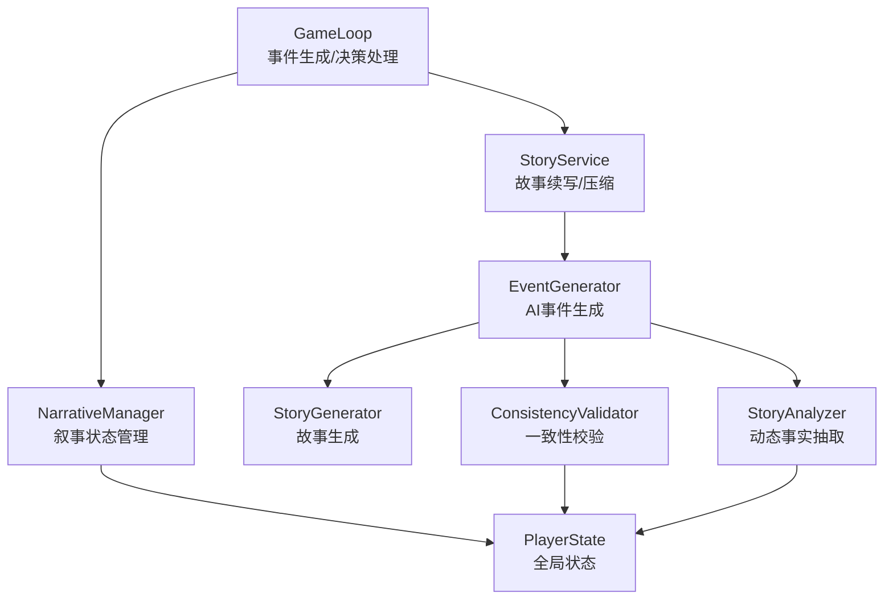
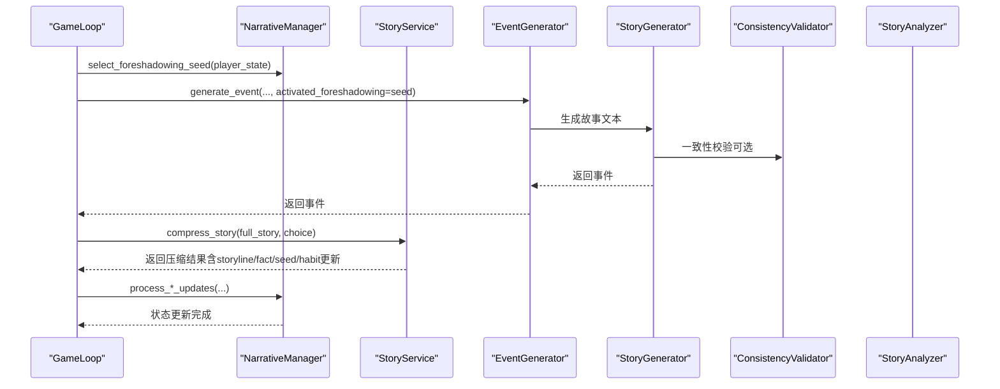
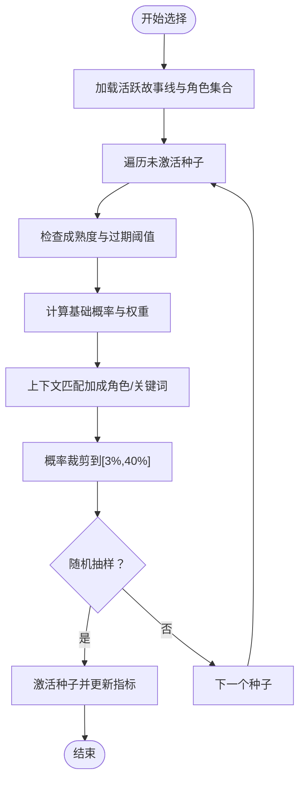
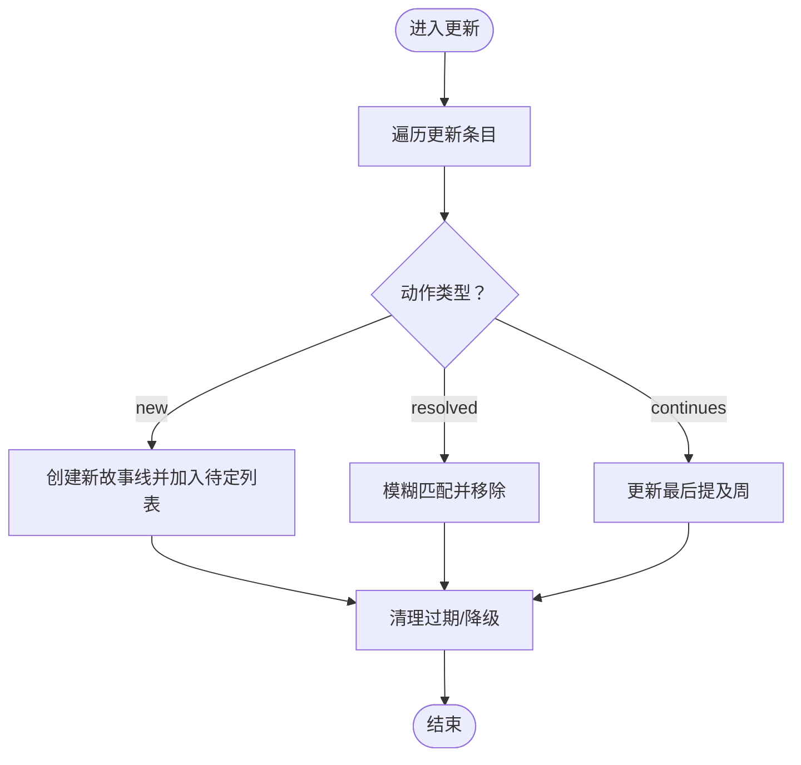
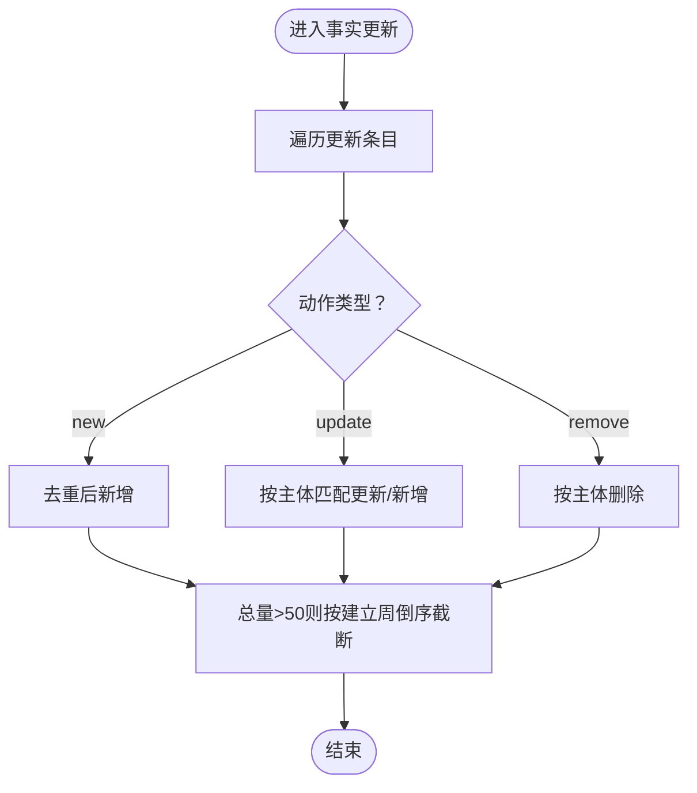
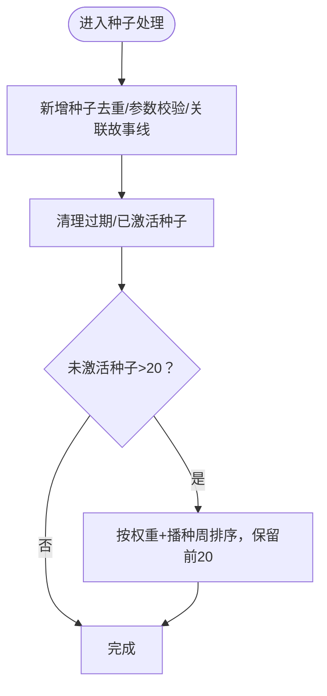
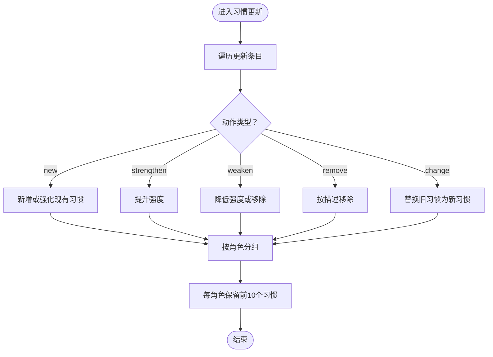
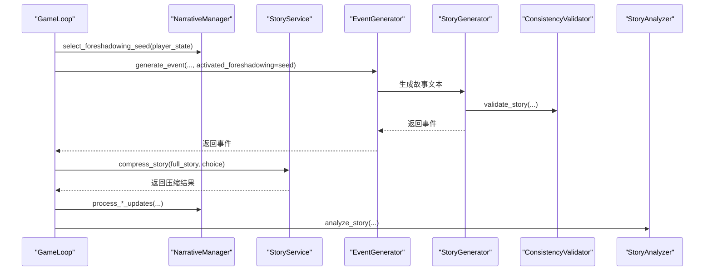
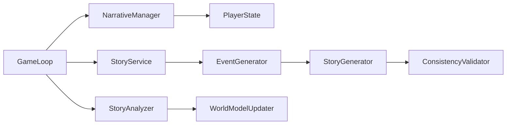

# 叙事管理器

<cite>
**本文引用的文件**
- [narrative_manager.py](file://src/game/narrative_manager.py)
- [state.py](file://src/game/state.py)
- [game_loop.py](file://src/game/game_loop.py)
- [story_service.py](file://src/game/story_service.py)
- [story_generator.py](file://src/ai/story_generator.py)
- [story_analyzer.py](file://src/ai/story_analyzer.py)
- [consistency_validator.py](file://src/ai/consistency_validator.py)
- [generator.py](file://src/ai/generator.py)
</cite>

## 目录
1. [简介](#简介)
2. [项目结构](#项目结构)
3. [核心组件](#核心组件)
4. [架构总览](#架构总览)
5. [详细组件分析](#详细组件分析)
6. [依赖关系分析](#依赖关系分析)
7. [性能考量](#性能考量)
8. [故障排查指南](#故障排查指南)
9. [结论](#结论)

## 简介
本文件面向“叙事管理器”（NarrativeManager）的技术文档，系统阐述其在叙事设计与管理中的职责与机制，涵盖：
- 预示种子（Foreshadowing Seed）选择算法与激活流程
- 故事线（Storyline）的增删改查与过期清理策略
- 世界事实（Established Fact）的新增、更新与上限控制
- 人物习惯（Character Habit）的追踪与强度衰减
- 与AI事件生成、一致性校验、故事压缩与分析的协作关系
- 叙事一致性维护与玩家体验优化机制

该模块以静态方法形式提供纯函数式的叙事状态管理，便于测试与解耦，同时通过PlayerState作为唯一状态载体，确保可序列化与持久化。

## 项目结构
叙事管理器位于游戏核心模块中，与AI生成器、故事服务、世界模型更新器共同构成叙事闭环。关键交互如下：
- 游戏循环在事件生成前后调用叙事管理器进行状态更新
- 故事服务负责故事续写与压缩，产出叙事更新项
- AI生成器负责故事文本生成与一致性校验
- 世界模型分析器负责动态事实抽取与约束管理

图表来源
- [game_loop.py](file://src/game/game_loop.py#L210-L224)
- [narrative_manager.py](file://src/game/narrative_manager.py#L15-L584)
- [story_service.py](file://src/game/story_service.py#L11-L304)
- [generator.py](file://src/ai/generator.py#L30-L431)
- [story_generator.py](file://src/ai/story_generator.py#L24-L387)
- [consistency_validator.py](file://src/ai/consistency_validator.py#L42-L231)
- [story_analyzer.py](file://src/ai/story_analyzer.py#L94-L318)

章节来源
- [game_loop.py](file://src/game/game_loop.py#L210-L224)
- [narrative_manager.py](file://src/game/narrative_manager.py#L15-L584)

## 核心组件
- NarrativeManager：纯静态方法的叙事状态管理器，负责故事线、世界事实、预示种子与人物习惯的增删改与清理。
- PlayerState：承载叙事状态的Pydantic模型，包含pending_storylines、established_facts、foreshadowing_seeds、character_habits、foreshadowing_metrics等字段。
- StoryService：封装故事续写与压缩，调用AI生成器产出叙事更新项。
- EventGenerator/StoryGenerator：两阶段故事生成（Step 1：故事文本；Step 2：选项），并进行一致性校验与缓存。
- ConsistencyValidator：跨维度一致性校验（地理、职业、人格、时间、承诺、因果）。
- StoryAnalyzer：动态事实抽取，构建可注入未来生成的约束文本。

章节来源
- [narrative_manager.py](file://src/game/narrative_manager.py#L15-L584)
- [state.py](file://src/game/state.py#L244-L709)
- [story_service.py](file://src/game/story_service.py#L11-L304)
- [generator.py](file://src/ai/generator.py#L30-L431)
- [story_generator.py](file://src/ai/story_generator.py#L24-L387)
- [consistency_validator.py](file://src/ai/consistency_validator.py#L42-L231)
- [story_analyzer.py](file://src/ai/story_analyzer.py#L94-L318)

## 架构总览
叙事管理器在游戏循环中的调用位置如下：
- 事件生成前：通过select_foreshadowing_seed注入激活的预示种子
- 事件生成后：通过process_storyline_updates、process_fact_updates、process_foreshadowing_seeds、process_habit_updates更新状态
- 世界模型更新：由WorldModelUpdater统一处理location/career/commitment/causal等结构化事实

图表来源
- [game_loop.py](file://src/game/game_loop.py#L210-L224)
- [story_service.py](file://src/game/story_service.py#L118-L133)
- [generator.py](file://src/ai/generator.py#L183-L238)
- [story_generator.py](file://src/ai/story_generator.py#L32-L175)
- [consistency_validator.py](file://src/ai/consistency_validator.py#L60-L117)

## 详细组件分析

### 预示种子选择与激活
NarrativeManager.select_foreshadowing_seed基于成熟度、隐蔽度、叙事权重、活跃故事线与角色匹配度计算激活概率，并进行随机采样。激活后更新foreshadowing_metrics中的恢复距离统计。

- 成熟度计算：考虑基础成熟周数与隐蔽度系数，形成有效成熟周数
- 概率曲线：先线性上升至峰值，再指数衰减；权重按major/supporting/minor调整
- 上下文增强：若种子涉及活跃角色或与活跃故事线关键词重叠，则提升概率
- 边界保护：最小/最大概率限制，防止极端波动
- 激活记录：记录激活周数、恢复距离（激活周-播种周）

图表来源
- [narrative_manager.py](file://src/game/narrative_manager.py#L187-L285)

章节来源
- [narrative_manager.py](file://src/game/narrative_manager.py#L187-L285)
- [state.py](file://src/game/state.py#L315-L364)

### 故事线管理
NarrativeManager.process_storyline_updates支持三种动作：
- new：新增待定故事线，记录创建周、重要性、相关角色、最后提及周
- resolved：匹配描述相似度，移除对应故事线
- continues：更新最后提及周

随后执行分级清理：超过20周的直接移除；中等重要性超过12周、高重要性超过8周降级或移除，实现渐进式过期。

图表来源
- [narrative_manager.py](file://src/game/narrative_manager.py#L22-L95)

章节来源
- [narrative_manager.py](file://src/game/narrative_manager.py#L22-L95)

### 世界事实管理
NarrativeManager.process_fact_updates支持三种动作：
- new：去重后新增事实，记录主体、类别、建立周
- update：按主体匹配更新事实，不存在则新增
- remove：按主体删除

随后进行总量限制：超过50条时按建立周倒序截断至50条，保证知识图谱规模可控。

图表来源
- [narrative_manager.py](file://src/game/narrative_manager.py#L101-L182)

章节来源
- [narrative_manager.py](file://src/game/narrative_manager.py#L101-L182)

### 预示种子生命周期管理
NarrativeManager.process_foreshadowing_seeds负责：
- 新增：去重后加入种子，设置类型、成熟度、隐蔽度、权重、回收方式、相关故事线
- 清理：已激活且超过4周的种子移除；未激活且超过60周的种子计数并移除
- 限额：未激活种子超过20个时，按权重优先级与播种周排序，保留前20个

图表来源
- [narrative_manager.py](file://src/game/narrative_manager.py#L291-L414)

章节来源
- [narrative_manager.py](file://src/game/narrative_manager.py#L291-L414)

### 人物习惯追踪
NarrativeManager.process_habit_updates支持五种动作：
- new：新增习惯，若相似描述存在则强化强度
- strengthen：提升强度（最多到strong）
- weaken：降低强度（降至emerging则移除）
- remove：按描述匹配移除
- change：替换旧习惯为新习惯，可变更类别/强度

随后按角色分组，每角色保留最强的10个习惯，其余按强度与最近出现周数排序后丢弃。

图表来源
- [narrative_manager.py](file://src/game/narrative_manager.py#L420-L583)

章节来源
- [narrative_manager.py](file://src/game/narrative_manager.py#L420-L583)

### 与AI事件生成的协作
- 事件生成前：GameLoop调用NarrativeManager.select_foreshadowing_seed并将激活种子传入EventGenerator.generate_event，作为上下文注入故事生成提示词
- 事件生成后：GameLoop调用StoryService.compress_story得到压缩结果，再调用NarrativeManager.process_*_updates进行状态更新
- 一致性校验：StoryGenerator在生成故事后可调用ConsistencyValidator.validate_story，对CRITICAL问题触发重试并注入修复指令
- 动态事实抽取：WorldModelUpdater.run_story_analyzer调用StoryAnalyzer.analyze_story，将AI识别的事实转化为约束文本，供后续生成使用

图表来源
- [game_loop.py](file://src/game/game_loop.py#L210-L224)
- [story_service.py](file://src/game/story_service.py#L118-L133)
- [generator.py](file://src/ai/generator.py#L183-L238)
- [story_generator.py](file://src/ai/story_generator.py#L32-L175)
- [consistency_validator.py](file://src/ai/consistency_validator.py#L60-L117)
- [story_analyzer.py](file://src/ai/story_analyzer.py#L111-L164)

章节来源
- [game_loop.py](file://src/game/game_loop.py#L210-L224)
- [story_service.py](file://src/game/story_service.py#L118-L133)
- [generator.py](file://src/ai/generator.py#L183-L238)
- [story_generator.py](file://src/ai/story_generator.py#L32-L175)
- [consistency_validator.py](file://src/ai/consistency_validator.py#L60-L117)
- [story_analyzer.py](file://src/ai/story_analyzer.py#L111-L164)

## 依赖关系分析
- NarrativeManager依赖PlayerState中的多个列表/字典字段：pending_storylines、established_facts、foreshadowing_seeds、character_habits、foreshadowing_metrics
- GameLoop在事件生成前后调用NarrativeManager的方法，形成“生成-更新-记录”的闭环
- StoryService依赖EventGenerator进行故事续写与压缩，产出叙事更新项
- StoryGenerator依赖ConsistencyValidator进行一致性校验，必要时重试
- StoryAnalyzer与WorldModelUpdater协同，将动态事实注入世界模型

图表来源
- [narrative_manager.py](file://src/game/narrative_manager.py#L15-L584)
- [state.py](file://src/game/state.py#L244-L709)
- [game_loop.py](file://src/game/game_loop.py#L210-L224)
- [story_service.py](file://src/game/story_service.py#L11-L304)
- [generator.py](file://src/ai/generator.py#L30-L431)
- [story_generator.py](file://src/ai/story_generator.py#L24-L387)
- [consistency_validator.py](file://src/ai/consistency_validator.py#L42-L231)
- [story_analyzer.py](file://src/ai/story_analyzer.py#L94-L318)

章节来源
- [narrative_manager.py](file://src/game/narrative_manager.py#L15-L584)
- [state.py](file://src/game/state.py#L244-L709)
- [game_loop.py](file://src/game/game_loop.py#L210-L224)

## 性能考量
- 静态方法设计：NarrativeManager采用静态方法，避免实例化开销，便于并发调用与单元测试
- 数据结构复杂度：
  - 故事线清理：O(n)遍历，n为待定故事线数量
  - 世界事实去重/更新：O(n)遍历，n为事实数量
  - 预示种子清理：O(n)遍历，n为种子数量
  - 人物习惯限额：O(n log n)，n为角色习惯数量（排序）
- 日志与调试：大量info/warning日志便于追踪状态变化与异常，生产环境可根据需要调整日志级别
- 缓存与重试：EventGenerator支持事件缓存与AI调用重试，减少重复生成成本

## 故障排查指南
- 预示种子未激活
  - 检查是否超过成熟度阈值或过期（>60周）
  - 检查隐蔽度与权重是否过低
  - 检查活跃故事线与角色匹配度是否足够
  - 查看foreshadowing_metrics中的恢复距离统计
- 故事线未正确移除
  - 确认描述相似度匹配逻辑是否满足
  - 检查是否被清理策略误判为“继续”
- 世界事实未更新
  - 确认主体与类别是否一致
  - 检查总量限制是否触发截断
- 人物习惯未按预期衰减
  - 检查强度等级顺序与最近出现周数
  - 确认每角色限额是否触发

章节来源
- [narrative_manager.py](file://src/game/narrative_manager.py#L187-L285)
- [narrative_manager.py](file://src/game/narrative_manager.py#L22-L95)
- [narrative_manager.py](file://src/game/narrative_manager.py#L101-L182)
- [narrative_manager.py](file://src/game/narrative_manager.py#L420-L583)
- [state.py](file://src/game/state.py#L315-L364)

## 结论
NarrativeManager通过清晰的状态字段与纯函数式接口，实现了叙事元素的生成、发展与整合，配合AI事件生成与一致性校验，形成了稳定可扩展的叙事闭环。其分级清理与限额策略有效控制了状态规模，预示种子的概率化选择提升了叙事的连贯性与惊喜感。建议在后续迭代中：
- 引入更细粒度的叙事权重与回收方式配置
- 增强预示种子与故事线的语义关联度评估
- 提供可视化工具辅助调试与平衡叙事节奏