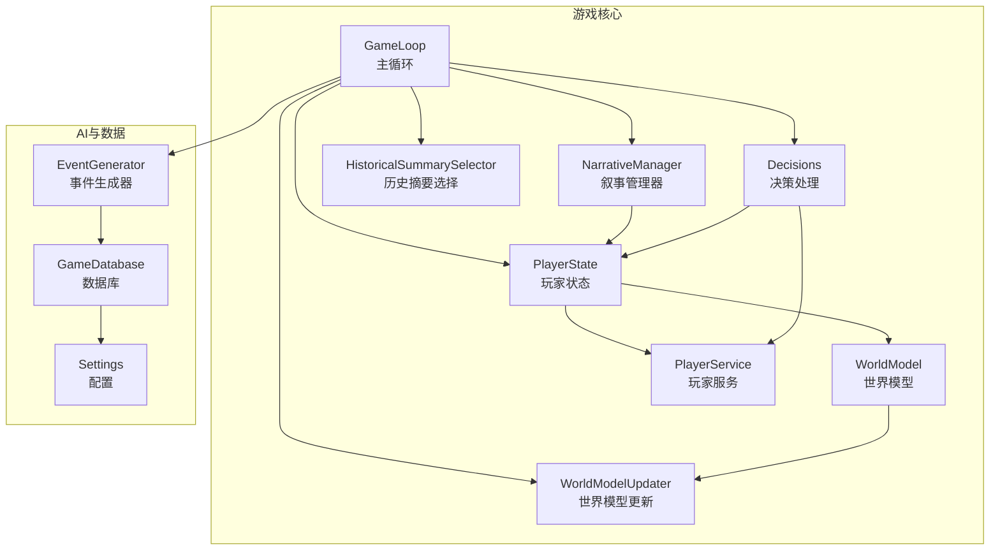
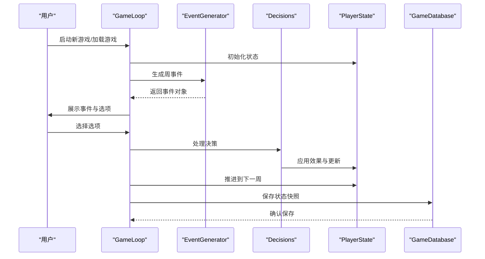
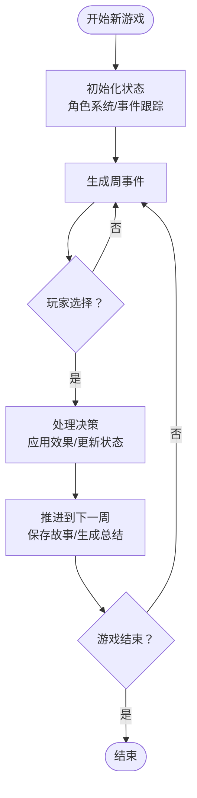
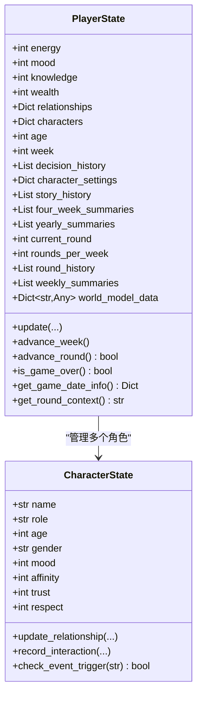
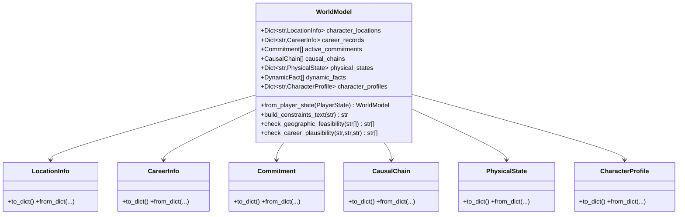
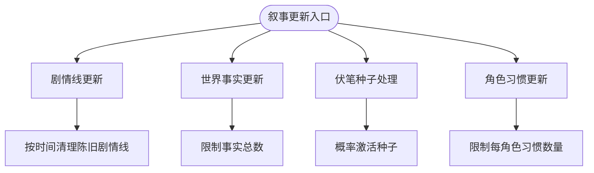
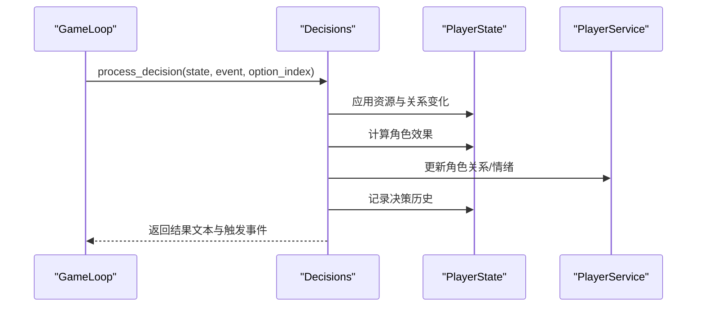
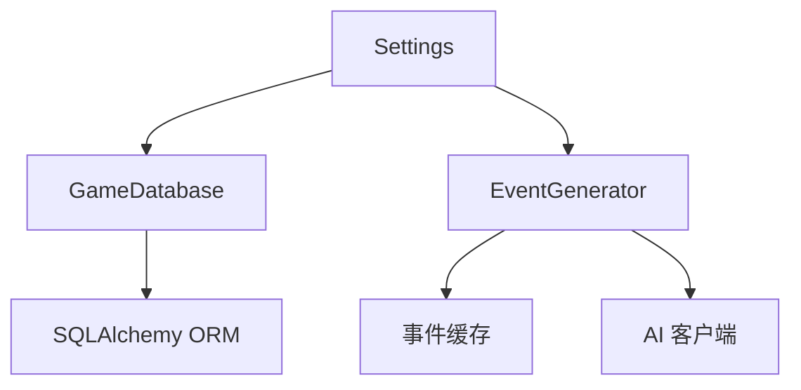
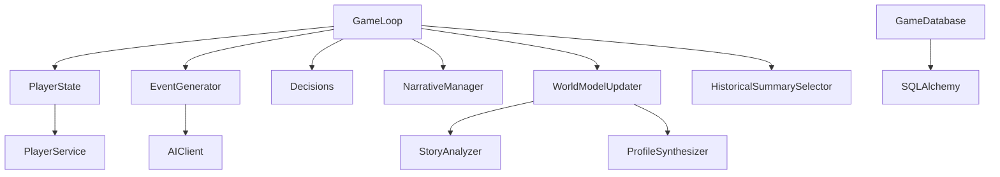

# 游戏引擎模块

<cite>
**本文档引用的文件**
- [src/game/game_loop.py](file://src/game/game_loop.py)
- [src/game/state.py](file://src/game/state.py)
- [src/game/world_model.py](file://src/game/world_model.py)
- [src/game/narrative_manager.py](file://src/game/narrative_manager.py)
- [src/game/player_service.py](file://src/game/player_service.py)
- [src/game/decisions.py](file://src/game/decisions.py)
- [src/game/world_model_updater.py](file://src/game/world_model_updater.py)
- [src/game/historical_summary_selector.py](file://src/game/historical_summary_selector.py)
- [src/ai/generator.py](file://src/ai/generator.py)
- [src/database/db.py](file://src/database/db.py)
- [config/settings.py](file://config/settings.py)
- [tests/test_game_loop.py](file://tests/test_game_loop.py)
- [tests/test_state.py](file://tests/test_state.py)
</cite>

## 目录
1. [简介](#简介)
2. [项目结构](#项目结构)
3. [核心组件](#核心组件)
4. [架构概览](#架构概览)
5. [详细组件分析](#详细组件分析)
6. [依赖关系分析](#依赖关系分析)
7. [性能考虑](#性能考虑)
8. [故障排除指南](#故障排除指南)
9. [结论](#结论)
10. [附录](#附录)

## 简介
本技术文档深入解析游戏引擎模块，重点阐述以下核心机制：
- GameLoop 主循环机制：事件生成、决策处理、周推进与持久化
- PlayerState 玩家状态管理：资源系统、关系网络、角色属性与多轮制
- WorldModel 世界模型：地理、职业、承诺、因果链与动态事实的结构化管理
- NarrativeManager 叙事管理器：剧情线、事实、伏笔种子与角色习惯的维护
- 资源管理系统：AI 事件缓存、数据库持久化与配置管理
- 决策机制：效果计算、角色影响、事件触发与结果生成

文档提供具体代码示例路径，解释各组件间的协作关系与数据流向，并包含可视化图表帮助理解。

## 项目结构
游戏引擎模块位于 `src/game/` 目录下，采用分层设计：
- 核心循环：`game_loop.py`
- 状态管理：`state.py`
- 世界模型：`world_model.py`
- 叙事管理：`narrative_manager.py`
- 决策处理：`decisions.py`
- 世界模型更新：`world_model_updater.py`
- 历史摘要选择：`historical_summary_selector.py`
- 玩家服务：`player_service.py`

AI 事件生成与缓存位于 `src/ai/`，数据库操作位于 `src/database/`，全局配置位于 `config/`。

**图表来源**
- [src/game/game_loop.py](file://src/game/game_loop.py#L23-L120)
- [src/game/state.py](file://src/game/state.py#L244-L560)
- [src/game/world_model.py](file://src/game/world_model.py#L185-L287)
- [src/game/narrative_manager.py](file://src/game/narrative_manager.py#L15-L100)
- [src/game/decisions.py](file://src/game/decisions.py#L134-L240)
- [src/game/world_model_updater.py](file://src/game/world_model_updater.py#L14-L80)
- [src/game/historical_summary_selector.py](file://src/game/historical_summary_selector.py#L14-L40)
- [src/game/player_service.py](file://src/game/player_service.py#L9-L54)
- [src/ai/generator.py](file://src/ai/generator.py#L30-L120)
- [src/database/db.py](file://src/database/db.py#L10-L72)
- [config/settings.py](file://config/settings.py#L30-L100)

**章节来源**
- [src/game/game_loop.py](file://src/game/game_loop.py#L1-L120)
- [src/game/state.py](file://src/game/state.py#L1-L120)
- [src/game/world_model.py](file://src/game/world_model.py#L1-L80)
- [src/game/narrative_manager.py](file://src/game/narrative_manager.py#L1-L40)
- [src/game/decisions.py](file://src/game/decisions.py#L1-L40)
- [src/game/world_model_updater.py](file://src/game/world_model_updater.py#L1-L40)
- [src/game/historical_summary_selector.py](file://src/game/historical_summary_selector.py#L1-L40)
- [src/game/player_service.py](file://src/game/player_service.py#L1-L20)
- [src/ai/generator.py](file://src/ai/generator.py#L1-L40)
- [src/database/db.py](file://src/database/db.py#L1-L40)
- [config/settings.py](file://config/settings.py#L1-L40)

## 核心组件
本节概述四大核心组件及其职责：

- GameLoop：负责游戏主循环，包括事件生成、决策处理、周推进、里程碑事件、周/年总结生成与持久化。
- PlayerState：管理玩家资源、关系、角色系统、时间推进、多轮制与世界模型数据。
- WorldModel：结构化管理地理、职业、承诺、因果链、动态事实与角色画像，提供约束文本与一致性校验。
- NarrativeManager：维护剧情线、世界事实、伏笔种子与角色习惯，支持概率激活与生命周期管理。

**章节来源**
- [src/game/game_loop.py](file://src/game/game_loop.py#L23-L120)
- [src/game/state.py](file://src/game/state.py#L244-L360)
- [src/game/world_model.py](file://src/game/world_model.py#L185-L287)
- [src/game/narrative_manager.py](file://src/game/narrative_manager.py#L15-L60)

## 架构概览
游戏引擎采用分层架构，GameLoop 作为协调者，调用 AI 事件生成器生成事件，通过决策模块应用效果并更新状态，同时维护叙事与世界模型数据。数据库模块负责持久化。

**图表来源**
- [src/game/game_loop.py](file://src/game/game_loop.py#L61-L151)
- [src/ai/generator.py](file://src/ai/generator.py#L159-L214)
- [src/game/decisions.py](file://src/game/decisions.py#L134-L240)
- [src/database/db.py](file://src/database/db.py#L48-L72)

**章节来源**
- [src/game/game_loop.py](file://src/game/game_loop.py#L61-L151)
- [src/ai/generator.py](file://src/ai/generator.py#L159-L214)
- [src/game/decisions.py](file://src/game/decisions.py#L134-L240)
- [src/database/db.py](file://src/database/db.py#L48-L72)

## 详细组件分析

### GameLoop 核心循环机制
- 启动与加载：支持从初始状态或保存状态启动，初始化角色系统与事件跟踪。
- 事件生成：按周生成事件，支持里程碑事件与历史摘要注入；失败时回退到简单事件。
- 决策处理：根据选项索引计算效果，应用到玩家与角色，生成结果文本并记录决策历史。
- 周推进：保存故事历史、应用每周衰减、生成4周/48周总结、清理当前事件并检查游戏结束。
- 多轮制：每轮生成事件，应用角色影响，生成周总结与奖励效果。
- 持久化：保存当前状态快照，支持进度保存与加载。

**图表来源**
- [src/game/game_loop.py](file://src/game/game_loop.py#L61-L151)
- [src/game/game_loop.py](file://src/game/game_loop.py#L257-L298)
- [src/game/game_loop.py](file://src/game/game_loop.py#L300-L349)

**章节来源**
- [src/game/game_loop.py](file://src/game/game_loop.py#L61-L151)
- [src/game/game_loop.py](file://src/game/game_loop.py#L257-L298)
- [src/game/game_loop.py](file://src/game/game_loop.py#L300-L349)

### PlayerState 玩家状态管理
- 资源系统：能量、情绪、知识、财富，支持边界检查与批量更新。
- 关系网络：角色亲密度、信任度、尊重度，支持同步与验证。
- 角色系统：NPC 角色状态（性格、气质、社会地位、能力等），支持互动记录与事件触发。
- 时间推进：周数、年龄、回合数，支持周/年计算与阶段判定。
- 世界模型数据：地理、职业、承诺、因果链、动态事实与角色画像的结构化存储。
- 多轮制：每轮压缩总结、决策记录与周总结生成。

**图表来源**
- [src/game/state.py](file://src/game/state.py#L244-L560)
- [src/game/state.py](file://src/game/state.py#L12-L120)

**章节来源**
- [src/game/state.py](file://src/game/state.py#L244-L560)
- [src/game/state.py](file://src/game/state.py#L12-L120)

### WorldModel 世界模型
- 数据结构：LocationInfo、CareerInfo、Commitment、CausalChain、PhysicalState、CharacterProfile。
- 构建：从 PlayerState 的 world_model_data 与 established_facts 构建，支持旧存档兼容。
- 约束文本：生成地理、职业、承诺、因果链、身体状态、动态事实与角色画像的约束文本。
- 校验：检查地理可行性、职业合理性、待履行承诺、未解决因果链与角色行为一致性。

**图表来源**
- [src/game/world_model.py](file://src/game/world_model.py#L185-L287)
- [src/game/world_model.py](file://src/game/world_model.py#L17-L162)

**章节来源**
- [src/game/world_model.py](file://src/game/world_model.py#L185-L287)
- [src/game/world_model.py](file://src/game/world_model.py#L17-L162)

### NarrativeManager 叙事管理器
- 剧情线更新：新增、解决、延续剧情线，按时间清理陈旧剧情线。
- 世界事实更新：新增、更新、删除世界事实，限制总数并按重要性排序。
- 伏笔种子选择：基于成熟度、隐蔽度、叙事权重与上下文匹配的概率激活。
- 角色习惯更新：新增、强化、弱化、移除与变更角色习惯，限制每角色习惯数量。

**图表来源**
- [src/game/narrative_manager.py](file://src/game/narrative_manager.py#L22-L96)
- [src/game/narrative_manager.py](file://src/game/narrative_manager.py#L101-L182)
- [src/game/narrative_manager.py](file://src/game/narrative_manager.py#L291-L415)
- [src/game/narrative_manager.py](file://src/game/narrative_manager.py#L420-L584)

**章节来源**
- [src/game/narrative_manager.py](file://src/game/narrative_manager.py#L22-L96)
- [src/game/narrative_manager.py](file://src/game/narrative_manager.py#L101-L182)
- [src/game/narrative_manager.py](file://src/game/narrative_manager.py#L291-L415)
- [src/game/narrative_manager.py](file://src/game/narrative_manager.py#L420-L584)

### 决策机制
- 效果计算：将事件效果转换为玩家与角色的影响，支持关系变化与详细角色效果。
- 角色影响：通过 PlayerService 更新角色关系与情绪，记录互动并检查事件触发。
- 结果生成：调用 AI 生成结果文本，失败时回退到简单文本。
- 历史记录：记录决策、效果与角色影响，支持验证与回溯。

**图表来源**
- [src/game/decisions.py](file://src/game/decisions.py#L134-L240)
- [src/game/player_service.py](file://src/game/player_service.py#L56-L103)

**章节来源**
- [src/game/decisions.py](file://src/game/decisions.py#L134-L240)
- [src/game/player_service.py](file://src/game/player_service.py#L56-L103)

### 资源管理系统
- AI 事件缓存：EventGenerator 支持事件缓存，减少重复调用。
- 数据库持久化：GameDatabase 提供游戏创建、状态保存、决策记录、结局保存与查询。
- 配置管理：Settings 统一管理 API 密钥、语言、常量与数据库连接。

**图表来源**
- [src/ai/generator.py](file://src/ai/generator.py#L30-L120)
- [src/database/db.py](file://src/database/db.py#L10-L72)
- [config/settings.py](file://config/settings.py#L30-L100)

**章节来源**
- [src/ai/generator.py](file://src/ai/generator.py#L30-L120)
- [src/database/db.py](file://src/database/db.py#L10-L72)
- [config/settings.py](file://config/settings.py#L30-L100)

## 依赖关系分析
- GameLoop 依赖 PlayerState、EventGenerator、Decisions、NarrativeManager、WorldModelUpdater、HistoricalSummarySelector、RelationshipMCPService。
- PlayerState 依赖 PlayerService 与配置设置。
- WorldModelUpdater 依赖 StoryAnalyzer 与 ProfileSynthesizer。
- EventGenerator 依赖 AIClient、Cache、StoryGenerator、OptionGenerator、SummaryGenerator、StoryRewriter。
- GameDatabase 依赖 SQLAlchemy 模型与配置。

**图表来源**
- [src/game/game_loop.py](file://src/game/game_loop.py#L1-L50)
- [src/game/world_model_updater.py](file://src/game/world_model_updater.py#L262-L353)
- [src/ai/generator.py](file://src/ai/generator.py#L30-L120)
- [src/database/db.py](file://src/database/db.py#L1-L20)

**章节来源**
- [src/game/game_loop.py](file://src/game/game_loop.py#L1-L50)
- [src/game/world_model_updater.py](file://src/game/world_model_updater.py#L262-L353)
- [src/ai/generator.py](file://src/ai/generator.py#L30-L120)
- [src/database/db.py](file://src/database/db.py#L1-L20)

## 性能考虑
- 事件缓存：启用缓存可显著减少 AI 调用次数，提高响应速度。
- 历史摘要选择：相关性评分与指数衰减平衡上下文质量与 token 成本。
- 世界模型约束：分段构建约束文本，避免一次性注入过多内容。
- 数据库批处理：状态快照与决策记录采用批量提交，减少 I/O 开销。
- 多轮制优化：每轮仅记录必要信息，周末统一生成总结，控制 token 使用。

## 故障排除指南
- 事件生成失败：检查 AI 客户端配置与网络连接；查看日志中的异常堆栈；使用回退事件保证流程继续。
- 状态验证失败：确保资源值在允许范围内；检查周数与年龄计算；验证角色关系同步。
- 数据库保存失败：确认数据库连接 URL；检查权限与磁盘空间；查看回滚日志。
- 世界模型校验错误：检查地理、职业、承诺与因果链的合理性；确保动态事实未过期。

**章节来源**
- [src/game/game_loop.py](file://src/game/game_loop.py#L245-L255)
- [src/game/state.py](file://src/game/state.py#L531-L551)
- [src/database/db.py](file://src/database/db.py#L316-L321)

## 结论
本游戏引擎模块通过清晰的分层设计与模块化组件，实现了可扩展、可维护且高性能的游戏循环系统。GameLoop 协调 AI 事件生成、决策处理与状态更新，PlayerState 提供全面的状态管理，WorldModel 与 NarrativeManager 确保叙事一致性与长期记忆，资源管理系统保障性能与可靠性。该架构为后续功能扩展（如多人协作、复杂 AI 交互、更丰富的世界规则）奠定了坚实基础。

## 附录

### 代码示例路径
- 启动新游戏：[start_new_game](file://src/game/game_loop.py#L61-L90)
- 加载游戏：[load_game](file://src/game/game_loop.py#L92-L151)
- 生成周事件：[generate_weekly_event](file://src/game/game_loop.py#L153-L256)
- 处理决策：[make_choice](file://src/game/game_loop.py#L257-L298)
- 推进到下一周：[advance_to_next_week](file://src/game/game_loop.py#L300-L349)
- 生成周/年总结：[generate_summary/_generate_four_week_summary/_generate_yearly_summary](file://src/game/game_loop.py#L449-L495)
- 状态验证：[validate](file://src/game/state.py#L531-L551)
- 世界模型构建：[from_player_state](file://src/game/world_model.py#L202-L287)
- 叙事更新：[process_storyline_updates/process_fact_updates](file://src/game/narrative_manager.py#L22-L182)
- 决策处理：[process_decision](file://src/game/decisions.py#L134-L240)
- 数据库保存：[save_state/save_decision](file://src/database/db.py#L48-L104)
- 配置设置：[Settings](file://config/settings.py#L30-L100)

**章节来源**
- [src/game/game_loop.py](file://src/game/game_loop.py#L61-L298)
- [src/game/state.py](file://src/game/state.py#L531-L551)
- [src/game/world_model.py](file://src/game/world_model.py#L202-L287)
- [src/game/narrative_manager.py](file://src/game/narrative_manager.py#L22-L182)
- [src/game/decisions.py](file://src/game/decisions.py#L134-L240)
- [src/database/db.py](file://src/database/db.py#L48-L104)
- [config/settings.py](file://config/settings.py#L30-L100)