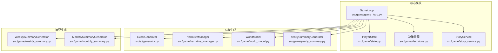
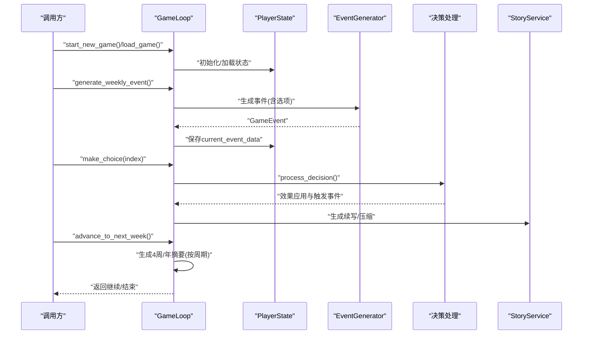
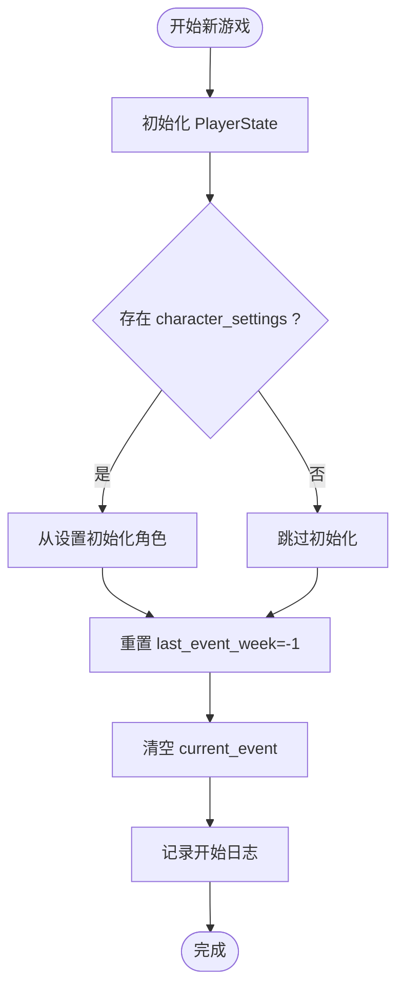
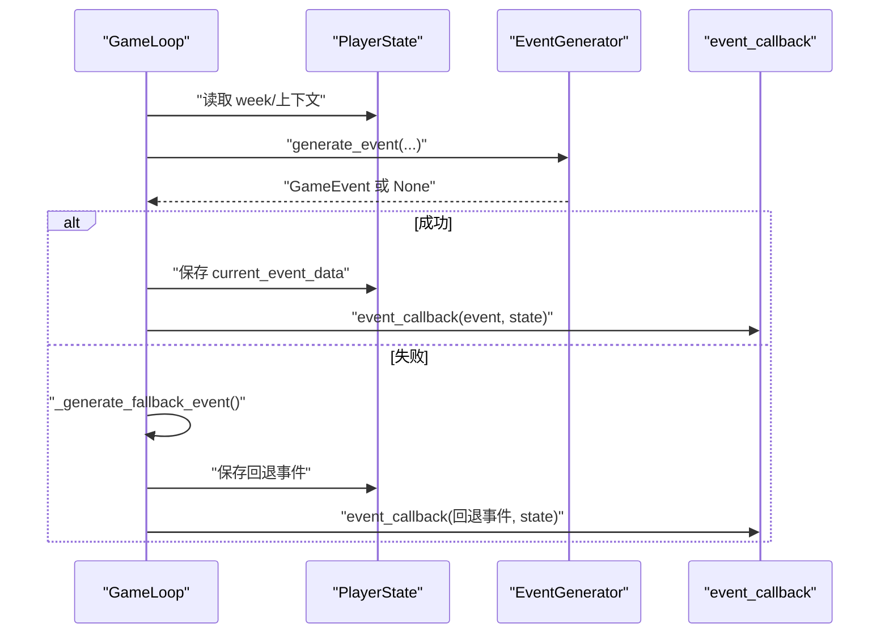
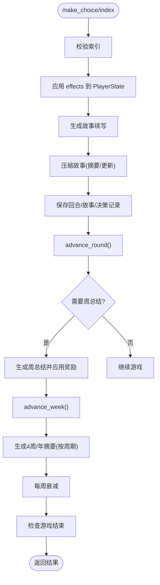
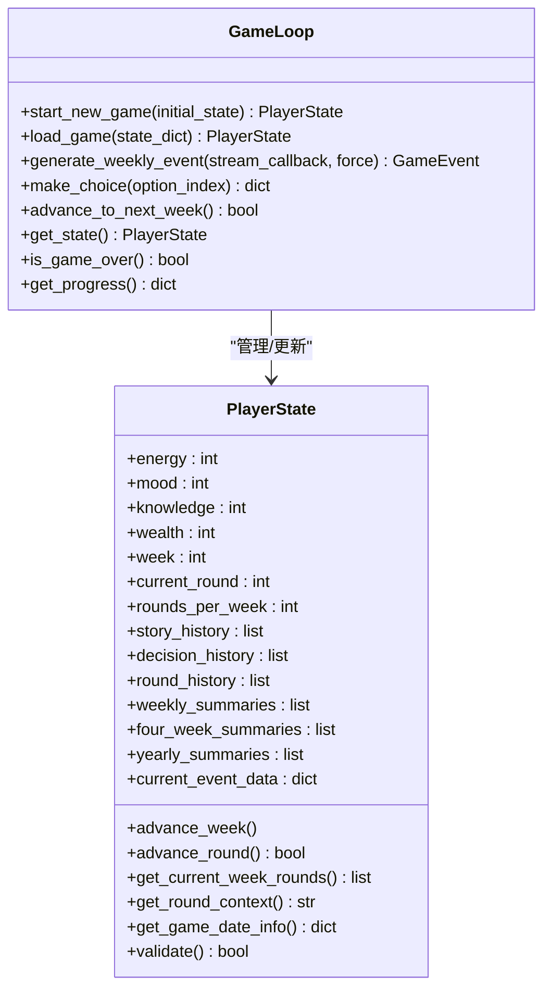
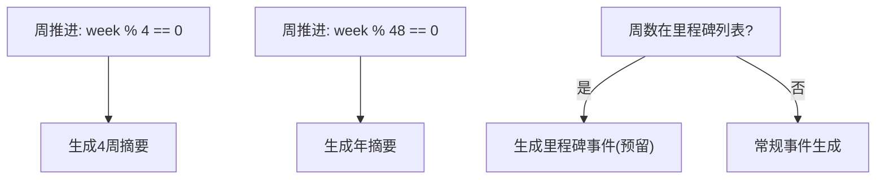
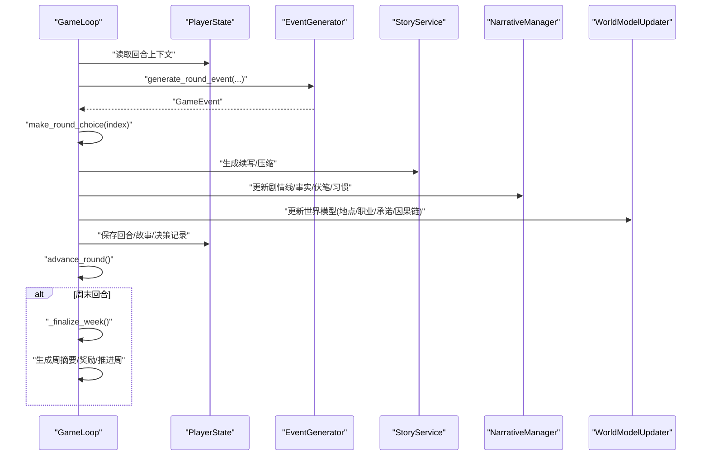
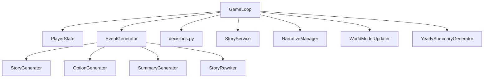

# 游戏循环核心

<cite>
**本文引用的文件**
- [src/game/game_loop.py](file://src/game/game_loop.py)
- [src/game/state.py](file://src/game/state.py)
- [src/game/decisions.py](file://src/game/decisions.py)
- [src/ai/generator.py](file://src/ai/generator.py)
- [src/game/narrative_manager.py](file://src/game/narrative_manager.py)
- [src/game/world_model.py](file://src/game/world_model.py)
- [src/game/yearly_summary.py](file://src/game/yearly_summary.py)
- [src/game/monthly_summary.py](file://src/game/monthly_summary.py)
- [src/game/weekly_summary.py](file://src/game/weekly_summary.py)
- [src/game/story_service.py](file://src/game/story_service.py)
- [tests/test_game_loop.py](file://tests/test_game_loop.py)
- [tests/test_game_loop_deep.py](file://tests/test_game_loop_deep.py)
</cite>

## 目录
1. [简介](#简介)
2. [项目结构](#项目结构)
3. [核心组件](#核心组件)
4. [架构总览](#架构总览)
5. [详细组件分析](#详细组件分析)
6. [依赖关系分析](#依赖关系分析)
7. [性能考量](#性能考量)
8. [故障排查指南](#故障排查指南)
9. [结论](#结论)
10. [附录](#附录)

## 简介
本技术文档聚焦于游戏循环核心模块，系统阐述 GameLoop 类的实现与设计，涵盖游戏启动流程、事件生成机制、决策处理流程、状态管理、每周事件与里程碑事件处理、周推进机制、游戏结束检测、回调函数机制、错误处理策略与回退事件生成逻辑，并深入解析多轮系统的设计与实现细节。文档提供基于源码路径的示例引用，帮助读者快速定位实现位置。

## 项目结构
游戏循环核心位于 src/game 目录，围绕 GameLoop 类组织，配合 PlayerState 状态模型、决策处理模块、AI 事件生成器、叙事与世界模型管理器、以及各类摘要生成器协同工作。测试用例位于 tests 目录，覆盖生命周期、事件生成、选择处理、周推进、回退事件与多轮系统等关键路径。

**图表来源**
- [src/game/game_loop.py](file://src/game/game_loop.py#L23-L1193)
- [src/game/state.py](file://src/game/state.py#L244-L709)
- [src/game/decisions.py](file://src/game/decisions.py#L134-L270)
- [src/ai/generator.py](file://src/ai/generator.py#L30-L431)
- [src/game/narrative_manager.py](file://src/game/narrative_manager.py#L15-L584)
- [src/game/world_model.py](file://src/game/world_model.py#L185-L665)
- [src/game/yearly_summary.py](file://src/game/yearly_summary.py#L10-L170)
- [src/game/monthly_summary.py](file://src/game/monthly_summary.py#L10-L138)
- [src/game/weekly_summary.py](file://src/game/weekly_summary.py#L10-L119)

**章节来源**
- [src/game/game_loop.py](file://src/game/game_loop.py#L23-L1193)
- [src/game/state.py](file://src/game/state.py#L244-L709)
- [src/ai/generator.py](file://src/ai/generator.py#L30-L431)

## 核心组件
- GameLoop：主控制器，负责游戏生命周期、事件生成、决策处理、周推进、摘要生成、多轮系统与状态持久化。
- PlayerState：统一的状态模型，承载玩家属性、关系、角色、历史记录、摘要、多轮数据等。
- EventGenerator：AI 事件生成门面，封装故事生成、选项生成、摘要生成与重写等子服务。
- StoryService：故事续写、压缩与自定义选择结果/效果生成。
- 决策处理模块：将选项效果应用到玩家与角色状态，触发角色特殊事件。
- 叙事与世界模型管理：维护剧情线、世界事实、伏笔种子、角色习惯与世界模型约束。
- 摘要生成器：周/月/年摘要生成器，按周期产出结构化摘要。

**章节来源**
- [src/game/game_loop.py](file://src/game/game_loop.py#L23-L1193)
- [src/game/state.py](file://src/game/state.py#L244-L709)
- [src/ai/generator.py](file://src/ai/generator.py#L30-L431)
- [src/game/decisions.py](file://src/game/decisions.py#L134-L270)
- [src/game/narrative_manager.py](file://src/game/narrative_manager.py#L15-L584)
- [src/game/world_model.py](file://src/game/world_model.py#L185-L665)
- [src/game/yearly_summary.py](file://src/game/yearly_summary.py#L10-L170)
- [src/game/monthly_summary.py](file://src/game/monthly_summary.py#L10-L138)
- [src/game/weekly_summary.py](file://src/game/weekly_summary.py#L10-L119)

## 架构总览
GameLoop 作为中枢，协调 PlayerState 的状态变更、AI 事件生成器的事件与选项生成、决策处理模块的效果应用、StoryService 的续写与压缩、以及摘要生成器的周期性总结。NarrativeManager 与 WorldModelUpdater 负责叙事与世界模型的更新与约束注入，形成闭环。

**图表来源**
- [src/game/game_loop.py](file://src/game/game_loop.py#L61-L151)
- [src/game/game_loop.py](file://src/game/game_loop.py#L153-L256)
- [src/game/game_loop.py](file://src/game/game_loop.py#L257-L298)
- [src/game/game_loop.py](file://src/game/game_loop.py#L300-L349)
- [src/ai/generator.py](file://src/ai/generator.py#L183-L238)
- [src/game/decisions.py](file://src/game/decisions.py#L134-L239)
- [src/game/story_service.py](file://src/game/story_service.py#L18-L74)

**章节来源**
- [src/game/game_loop.py](file://src/game/game_loop.py#L61-L349)
- [src/ai/generator.py](file://src/ai/generator.py#L183-L238)
- [src/game/decisions.py](file://src/game/decisions.py#L134-L239)
- [src/game/story_service.py](file://src/game/story_service.py#L18-L74)

## 详细组件分析

### GameLoop 类与生命周期
- 初始化与语言设置、AI 生成器注入、回调函数注册。
- 启动新游戏：初始化 PlayerState，从 character_settings 初始化角色，重置事件跟踪与当前事件。
- 加载游戏：从保存状态重建 PlayerState，恢复 current_event，初始化年边界与事件周跟踪。
- 进度查询与结束检测：基于 week 与配置的总周数判断。

**图表来源**
- [src/game/game_loop.py](file://src/game/game_loop.py#L61-L90)
- [src/game/game_loop.py](file://src/game/game_loop.py#L92-L151)

**章节来源**
- [src/game/game_loop.py](file://src/game/game_loop.py#L23-L90)
- [src/game/game_loop.py](file://src/game/game_loop.py#L92-L151)

### 事件生成机制（每周/多轮）
- 每周事件生成：检查是否已生成、里程碑事件优先、构造上下文（最近4周摘要、年摘要、世界事实、角色习惯等）、调用 AI 生成事件，失败时回退。
- 多轮事件生成：每轮包含回合上下文、关系事件、历史摘要、世界模型约束，生成回合事件并保存 current_event_data。
- 回调机制：事件生成与决策处理完成后触发回调，便于 UI 或持久化层响应。

**图表来源**
- [src/game/game_loop.py](file://src/game/game_loop.py#L153-L256)
- [src/ai/generator.py](file://src/ai/generator.py#L183-L238)

**章节来源**
- [src/game/game_loop.py](file://src/game/game_loop.py#L153-L256)
- [src/ai/generator.py](file://src/ai/generator.py#L183-L238)

### 决策处理流程
- 选项索引校验、提取选项 effects。
- 应用到 PlayerState（能量、情绪、学识、财富、关系）。
- 生成故事续写（可流式回调）。
- 压缩故事（100字摘要、剧情线、事实、习惯、伏笔种子等更新）。
- 保存回合/故事/决策记录，推进轮次，必要时生成周总结并应用奖励效果，推进周数，生成4周/年摘要，应用每周衰减。

**图表来源**
- [src/game/game_loop.py](file://src/game/game_loop.py#L257-L298)
- [src/game/game_loop.py](file://src/game/game_loop.py#L800-L1033)
- [src/game/decisions.py](file://src/game/decisions.py#L134-L239)
- [src/game/story_service.py](file://src/game/story_service.py#L118-L133)

**章节来源**
- [src/game/game_loop.py](file://src/game/game_loop.py#L257-L298)
- [src/game/game_loop.py](file://src/game/game_loop.py#L800-L1033)
- [src/game/decisions.py](file://src/game/decisions.py#L134-L239)
- [src/game/story_service.py](file://src/game/story_service.py#L118-L133)

### 状态管理与持久化
- PlayerState 提供统一的状态结构与验证、推进周、推进轮次、日期信息、回合上下文构建、角色管理等。
- GameLoop 在事件生成后将 current_event_data 写入 PlayerState，加载时恢复 current_event。
- 周推进时保存故事历史、决策历史、回合历史、周摘要，并在周结束时生成4周/年摘要。

**图表来源**
- [src/game/state.py](file://src/game/state.py#L244-L709)
- [src/game/game_loop.py](file://src/game/game_loop.py#L61-L151)
- [src/game/game_loop.py](file://src/game/game_loop.py#L300-L349)

**章节来源**
- [src/game/state.py](file://src/game/state.py#L244-L709)
- [src/game/game_loop.py](file://src/game/game_loop.py#L61-L151)
- [src/game/game_loop.py](file://src/game/game_loop.py#L300-L349)

### 摘要生成与里程碑事件
- 每4周生成一次“4周摘要”，聚合最近四周故事与决策。
- 每48周生成一次“年摘要”，汇总12个4周摘要与决策。
- 里程碑事件：当前版本返回 None（预留预设里程碑事件），可扩展为固定周数事件。
- 自定义摘要：用户触发生成 N 周摘要，使用 YearlySummaryGenerator 生成灵活摘要。

**图表来源**
- [src/game/game_loop.py](file://src/game/game_loop.py#L332-L339)
- [src/game/game_loop.py](file://src/game/game_loop.py#L351-L396)
- [src/game/game_loop.py](file://src/game/game_loop.py#L397-L434)
- [src/game/game_loop.py](file://src/game/game_loop.py#L497-L501)

**章节来源**
- [src/game/game_loop.py](file://src/game/game_loop.py#L332-L434)
- [src/game/yearly_summary.py](file://src/game/yearly_summary.py#L24-L82)

### 回退事件生成与错误处理
- AI 事件生成失败或异常时，回退到简单事件，保证游戏连续性。
- 回退事件包含两个选项，效果按周/轮场景分别设计，中文/英文双语支持。
- 故障日志记录与异常捕获，确保回退事件可用。

**章节来源**
- [src/game/game_loop.py](file://src/game/game_loop.py#L245-L255)
- [src/game/game_loop.py](file://src/game/game_loop.py#L503-L561)

### 多轮系统设计与实现
- 每周分为多个回合（默认3轮），每轮独立生成事件与选项。
- 回合上下文：利用上周回合的完整故事与选择，避免重复并节省 token。
- 回合结束后进行压缩、叙事/世界模型更新、记录保存、推进轮次。
- 周末回合触发周总结，应用奖励效果并推进周数，生成4周/年摘要。

**图表来源**
- [src/game/game_loop.py](file://src/game/game_loop.py#L665-L779)
- [src/game/game_loop.py](file://src/game/game_loop.py#L780-L1033)
- [src/game/game_loop.py](file://src/game/game_loop.py#L1035-L1083)
- [src/game/story_service.py](file://src/game/story_service.py#L118-L133)

**章节来源**
- [src/game/game_loop.py](file://src/game/game_loop.py#L665-L1083)
- [src/game/story_service.py](file://src/game/story_service.py#L118-L133)

### 回调函数机制与持久化
- 事件生成回调：事件生成后触发 event_callback(event, state)，便于 UI 展示或持久化。
- 决策结果回调：决策处理后触发 result_callback(result, state)，便于 UI 更新或统计。
- 持久化：current_event_data 保存当前事件，加载时恢复；周推进时保存历史与摘要。

**章节来源**
- [src/game/game_loop.py](file://src/game/game_loop.py#L239-L241)
- [src/game/game_loop.py](file://src/game/game_loop.py#L295-L297)
- [src/game/game_loop.py](file://src/game/game_loop.py#L1030-L1032)

## 依赖关系分析
- GameLoop 依赖 PlayerState、EventGenerator、决策处理模块、StoryService、NarrativeManager、WorldModelUpdater、YearlySummaryGenerator 等。
- EventGenerator 作为门面，内部委派给 StoryGenerator、OptionGenerator、SummaryGenerator、StoryRewriter。
- PlayerState 提供统一的数据结构与验证、推进逻辑。
- 测试覆盖生命周期、事件生成、选择处理、周推进、回退事件与多轮系统。

**图表来源**
- [src/game/game_loop.py](file://src/game/game_loop.py#L23-L60)
- [src/ai/generator.py](file://src/ai/generator.py#L30-L66)

**章节来源**
- [src/game/game_loop.py](file://src/game/game_loop.py#L23-L60)
- [src/ai/generator.py](file://src/ai/generator.py#L30-L66)

## 性能考量
- 缓存与预设：EventGenerator 支持事件缓存与预设里程碑事件，减少重复生成成本。
- 周期性摘要：4周/48周摘要按需生成，避免频繁大文本处理。
- Token 控制：多轮系统通过回合上下文压缩与限制摘要长度，控制 token 使用。
- 衰减与平衡：每周衰减参数可调，避免资源无限增长。

[本节为通用指导，无需特定文件引用]

## 故障排查指南
- 事件生成失败：检查 AI 服务可用性与网络，查看日志中的异常类型与周数；确认回退事件是否正常生成。
- 决策无效：确认选项索引合法，检查 effects 字段完整性。
- 周推进异常：检查周数推进与摘要生成逻辑，确认历史数据结构正确。
- 多轮系统中断：确认回合上下文构建与压缩结果，检查世界模型与叙事更新是否成功。

**章节来源**
- [src/game/game_loop.py](file://src/game/game_loop.py#L245-L255)
- [src/game/game_loop.py](file://src/game/game_loop.py#L807-L808)
- [src/game/game_loop.py](file://src/game/game_loop.py#L1035-L1083)

## 结论
GameLoop 通过清晰的职责划分与模块化设计，实现了稳定的游戏循环：从状态管理到事件生成、从决策处理到摘要与多轮推进，辅以回退机制与错误处理，保障了游戏体验的连续性与可扩展性。结合 NarrativeManager 与 WorldModel 的一致性约束，进一步提升了叙事质量与世界可信度。

[本节为总结性内容，无需特定文件引用]

## 附录

### 代码示例路径（基于源码）
- 启动新游戏
  - [start_new_game](file://src/game/game_loop.py#L61-L90)
- 加载游戏
  - [load_game](file://src/game/game_loop.py#L92-L151)
- 生成每周事件
  - [generate_weekly_event](file://src/game/game_loop.py#L153-L256)
- 处理选择
  - [make_choice](file://src/game/game_loop.py#L257-L298)
  - [process_decision](file://src/game/decisions.py#L134-L239)
- 周推进与摘要
  - [advance_to_next_week](file://src/game/game_loop.py#L300-L349)
  - [generate_summary](file://src/game/game_loop.py#L449-L495)
  - [YearlySummaryGenerator.generate_summary](file://src/game/yearly_summary.py#L24-L82)
- 回退事件
  - [_generate_fallback_event](file://src/game/game_loop.py#L503-L561)
- 多轮系统
  - [generate_round_event](file://src/game/game_loop.py#L665-L779)
  - [make_round_choice](file://src/game/game_loop.py#L780-L1033)
  - [compress_round_story](file://src/game/game_loop.py#L1105-L1114)
  - [StoryService.generate_story_continuation](file://src/game/story_service.py#L18-L74)
  - [StoryService.compress_story](file://src/game/story_service.py#L118-L133)
- 测试用例参考
  - [test_game_loop.py](file://tests/test_game_loop.py#L12-L76)
  - [test_game_loop_deep.py](file://tests/test_game_loop_deep.py#L36-L556)