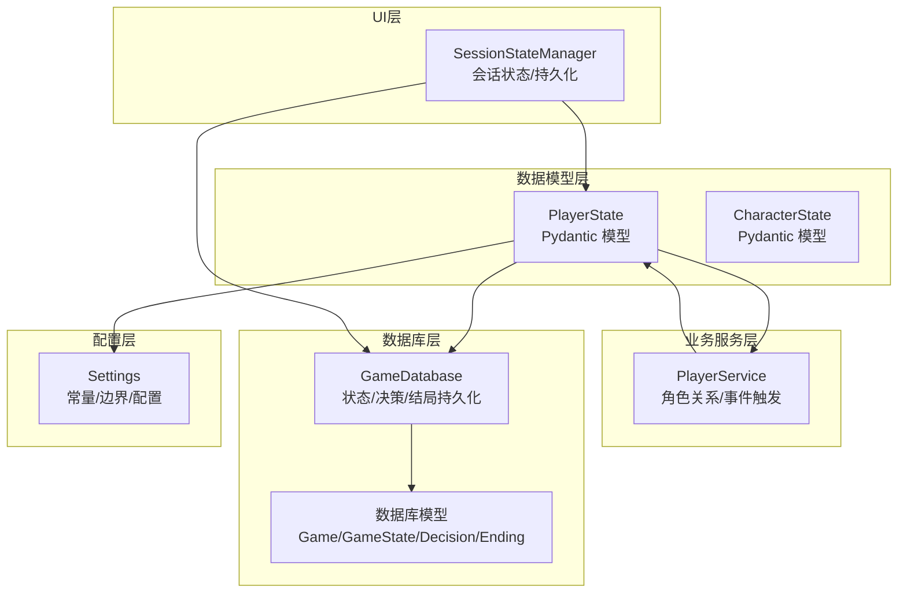
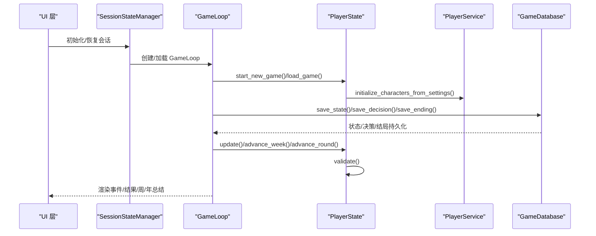
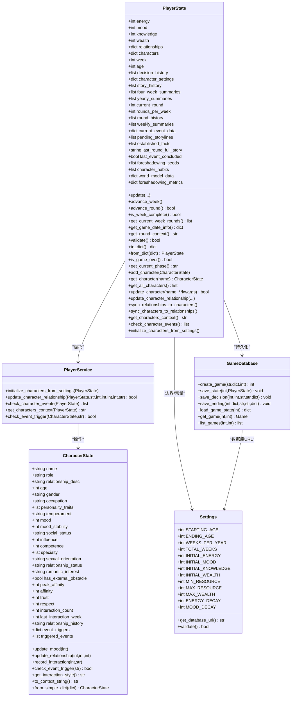

# 玩家状态管理

<cite>
**本文引用的文件**
- [src/game/state.py](file://src/game/state.py)
- [src/game/player_service.py](file://src/game/player_service.py)
- [src/database/models.py](file://src/database/models.py)
- [src/database/db.py](file://src/database/db.py)
- [config/settings.py](file://config/settings.py)
- [src/game/decisions.py](file://src/game/decisions.py)
- [src/game/game_loop.py](file://src/game/game_loop.py)
- [src/game/character_creation.py](file://src/game/character_creation.py)
- [src/ui/state_manager.py](file://src/ui/state_manager.py)
</cite>

## 目录
1. [简介](#简介)
2. [项目结构](#项目结构)
3. [核心组件](#核心组件)
4. [架构总览](#架构总览)
5. [详细组件分析](#详细组件分析)
6. [依赖关系分析](#依赖关系分析)
7. [性能考量](#性能考量)
8. [故障排查指南](#故障排查指南)
9. [结论](#结论)
10. [附录](#附录)

## 简介
本技术文档围绕“玩家状态管理系统”展开，重点解析 PlayerState 类的状态模型设计与实现，涵盖四大核心属性（能量、情绪、知识、财富）的管理机制、边界控制与序列化/反序列化流程；同时阐述状态转换逻辑、游戏结束条件判断、角色设置系统、关系管理、历史记录存储与进度跟踪机制，并提供可定位的代码路径示例，帮助开发者快速理解与扩展。

## 项目结构
本系统采用分层架构：
- 数据模型层：Pydantic 模型定义状态结构与校验
- 业务服务层：PlayerService 提供角色关系与事件触发等业务逻辑
- 数据库层：GameDatabase 提供状态快照、决策与结局的持久化
- 配置层：Settings 统一管理常量与边界
- UI 层：SessionStateManager 提供前端会话状态统一入口与持久化

图表来源
- [src/game/state.py](file://src/game/state.py#L244-L709)
- [src/game/player_service.py](file://src/game/player_service.py#L9-L176)
- [src/database/db.py](file://src/database/db.py#L10-L200)
- [src/database/models.py](file://src/database/models.py#L61-L127)
- [config/settings.py](file://config/settings.py#L30-L100)
- [src/ui/state_manager.py](file://src/ui/state_manager.py#L42-L538)

章节来源
- [src/game/state.py](file://src/game/state.py#L1-L709)
- [src/game/player_service.py](file://src/game/player_service.py#L1-L176)
- [src/database/db.py](file://src/database/db.py#L1-L200)
- [src/database/models.py](file://src/database/models.py#L1-L171)
- [config/settings.py](file://config/settings.py#L1-L100)
- [src/ui/state_manager.py](file://src/ui/state_manager.py#L1-L773)

## 核心组件
- PlayerState：玩家当前状态容器，包含四维属性、时间轴、决策历史、角色系统、世界模型、伏笔系统等
- CharacterState：NPC 角色状态，包含基础信息、动态状态、社会属性、能力属性、隐藏属性、关系属性、互动记录与事件阈值
- PlayerService：封装角色关系更新、事件触发检查、角色上下文生成等业务逻辑
- GameDatabase：提供状态快照、决策记录、结局记录的持久化接口
- Settings：集中管理初始值、边界、常量与数据库连接
- SessionStateManager：UI 层统一会话状态管理，负责持久化与恢复

章节来源
- [src/game/state.py](file://src/game/state.py#L244-L709)
- [src/game/player_service.py](file://src/game/player_service.py#L9-L176)
- [src/database/db.py](file://src/database/db.py#L10-L200)
- [config/settings.py](file://config/settings.py#L30-L100)
- [src/ui/state_manager.py](file://src/ui/state_manager.py#L42-L538)

## 架构总览
PlayerState 作为核心数据模型，通过 Pydantic 的 model_dump/from_dict 实现序列化与反序列化；PlayerService 将复杂业务逻辑从 PlayerState 中剥离，保证数据模型与行为分离；GameDatabase 负责将 PlayerState 的快照与决策、结局持久化到数据库；Settings 提供全局常量与边界约束；UI 层通过 SessionStateManager 统一管理会话状态与持久化。

图表来源
- [src/game/game_loop.py](file://src/game/game_loop.py#L62-L152)
- [src/game/state.py](file://src/game/state.py#L553-L560)
- [src/game/player_service.py](file://src/game/player_service.py#L13-L53)
- [src/database/db.py](file://src/database/db.py#L48-L143)
- [src/ui/state_manager.py](file://src/ui/state_manager.py#L662-L772)

## 详细组件分析

### PlayerState：状态模型与边界控制
- 四大核心属性
  - 能量（energy）：范围 [MIN_RESOURCE, MAX_RESOURCE]，默认 INITIAL_ENERGY
  - 情绪（mood）：范围 [MIN_RESOURCE, MAX_RESOURCE]，默认 INITIAL_MOOD
  - 知识（knowledge）：范围 [MIN_RESOURCE, MAX_RESOURCE]，默认 INITIAL_KNOWLEDGE
  - 财富（wealth）：最小 0，无上限，默认 INITIAL_WEALTH
- 边界控制
  - update 方法对每项属性进行边界钳制，防止越界
  - validate 方法在决策后执行，确保状态合法
- 时间与阶段
  - week/age：每周推进，年龄按周数换算
  - get_current_phase：按周数划分不同人生阶段
- 多轮系统
  - current_round/rounds_per_week：周内多轮推进，周末汇总
  - get_current_week_rounds/is_week_complete：周内回合统计与完成判定
- 日期信息
  - get_game_date_info：基于 era.year 与 week 计算年/月/周/季
- 序列化/反序列化
  - to_dict/from_dict：基于 Pydantic 的 model_dump/model_validate
- 游戏结束条件
  - is_game_over：当 week >= TOTAL_WEEKS 时结束

章节来源
- [src/game/state.py](file://src/game/state.py#L372-L408)
- [src/game/state.py](file://src/game/state.py#L531-L551)
- [src/game/state.py](file://src/game/state.py#L410-L418)
- [src/game/state.py](file://src/game/state.py#L562-L566)
- [src/game/state.py](file://src/game/state.py#L452-L486)
- [src/game/state.py](file://src/game/state.py#L553-L560)

### CharacterState：NPC 角色状态模型
- 基础信息：name/role/relationship_desc/age/gender/occupation
- 性格系统：personality_traits/temperament
- 动态状态：mood/mood_stability
- 社会属性：social_status/influence
- 能力属性：competence/specialty
- 隐藏属性：sexual_orientation/relationship_status/romantic_interest/has_external_obstacle/peak_affinity
- 关系属性：affinity/trust/respect
- 互动记录：interaction_count/last_interaction_week/relationship_history
- 事件阈值：event_triggers（包含多类事件的亲密度/信任度阈值）
- 事件触发：check_event_trigger（委托给 PlayerService）
- 关系更新：update_relationship（亲密度/信任/尊重边界钳制）
- 情绪更新：update_mood（受情绪稳定性影响）
- 上下文生成：to_context_string/get_interaction_style

章节来源
- [src/game/state.py](file://src/game/state.py#L12-L120)
- [src/game/state.py](file://src/game/state.py#L121-L151)
- [src/game/state.py](file://src/game/state.py#L168-L171)
- [src/game/state.py](file://src/game/state.py#L206-L223)

### PlayerService：角色关系与事件业务逻辑
- initialize_characters_from_settings：从 character_settings 初始化角色系统，兼容旧格式
- update_character_relationship：更新角色关系属性、情绪与互动记录，同步回 PlayerState
- check_character_events：遍历所有角色检查特殊事件触发
- get_characters_context：生成角色上下文字符串
- check_event_trigger：根据事件阈值与角色属性判断是否触发

章节来源
- [src/game/player_service.py](file://src/game/player_service.py#L13-L53)
- [src/game/player_service.py](file://src/game/player_service.py#L56-L103)
- [src/game/player_service.py](file://src/game/player_service.py#L106-L129)
- [src/game/player_service.py](file://src/game/player_service.py#L132-L150)
- [src/game/player_service.py](file://src/game/player_service.py#L153-L175)

### 决策处理与角色属性变化
- calculate_character_effects：将事件 effects 中的关系变化映射为角色属性变化
- apply_character_effects：批量应用角色属性变化并检查事件触发
- process_decision：应用玩家自身属性变化、同步关系到角色、记录决策历史、校验状态

章节来源
- [src/game/decisions.py](file://src/game/decisions.py#L13-L59)
- [src/game/decisions.py](file://src/game/decisions.py#L62-L106)
- [src/game/decisions.py](file://src/game/decisions.py#L134-L206)

### 数据库持久化与恢复
- GameDatabase.save_state：保存 PlayerState 快照（含 week/age/state_json）
- GameDatabase.save_decision：保存决策记录（event_description/choice_text/effects）
- GameDatabase.save_ending：保存结局记录（final_state/ending_type/summary/achievements）
- GameDatabase.load_game_state：加载最新状态快照或初始状态
- 数据库模型：Game/GameState/Decision/Ending

章节来源
- [src/database/db.py](file://src/database/db.py#L48-L143)
- [src/database/db.py](file://src/database/db.py#L145-L172)
- [src/database/models.py](file://src/database/models.py#L61-L127)

### 角色设置系统与世界构建
- CharacterCreator：通过 AI 生成时代/年龄/性别/世界/家庭/关系/特质/财富等设定
- generate_initial_attributes：根据角色特质生成初始四维属性
- generate_family_members_details：将旧格式家庭成员升级为新格式
- check_and_fix_missing_attributes：修复缺失的 birth_year 与家庭成员格式

章节来源
- [src/game/character_creation.py](file://src/game/character_creation.py#L51-L158)
- [src/game/character_creation.py](file://src/game/character_creation.py#L325-L376)
- [src/game/character_creation.py](file://src/game/character_creation.py#L598-L644)
- [src/game/character_creation.py](file://src/game/character_creation.py#L646-L701)

### UI 会话状态与持久化
- SessionStateManager：统一管理游戏状态、事件、结果、用户、调试日志等
- save_game_to_storage/restore_game_from_storage：通过 URL 参数与 localStorage 实现会话重连
- clear_user_session_data/clear_game_state：清理会话数据

章节来源
- [src/ui/state_manager.py](file://src/ui/state_manager.py#L67-L535)
- [src/ui/state_manager.py](file://src/ui/state_manager.py#L628-L772)

## 依赖关系分析

图表来源
- [src/game/state.py](file://src/game/state.py#L244-L709)
- [src/game/player_service.py](file://src/game/player_service.py#L9-L176)
- [src/database/db.py](file://src/database/db.py#L10-L200)
- [config/settings.py](file://config/settings.py#L30-L100)

## 性能考量
- Pydantic 序列化/反序列化：to_dict/from_dict 基于 model_dump/model_validate，开销较低且类型安全
- 边界钳制：update/validate 在每次状态变更后执行，避免越界导致的异常传播
- 多轮系统：周内多轮推进减少一次性大计算，周末汇总降低 UI 压力
- 数据库写入：save_state/save_decision/save_ending 采用批量提交，避免频繁 IO
- 事件生成：GameLoop 控制事件生成频率，避免重复生成

[本节为通用建议，无需特定文件引用]

## 故障排查指南
- 状态越界
  - 现象：validate 抛出异常
  - 排查：检查 update 调用与 effects 是否过大
  - 参考路径：[src/game/state.py](file://src/game/state.py#L531-L551)
- 关系值异常
  - 现象：relationships 与 characters 不一致
  - 排查：调用 sync_relationships_to_characters/sync_characters_to_relationships
  - 参考路径：[src/game/state.py](file://src/game/state.py#L679-L693)
- 事件未触发
  - 现象：check_event_trigger 返回 False
  - 排查：确认 event_triggers 阈值与角色属性是否满足
  - 参考路径：[src/game/player_service.py](file://src/game/player_service.py#L153-L175)
- 持久化失败
  - 现象：save_state/save_decision/save_ending 抛出异常
  - 排查：检查数据库连接与表结构
  - 参考路径：[src/database/db.py](file://src/database/db.py#L48-L143)
- 会话恢复失败
  - 现象：restore_game_from_storage 返回 False
  - 排查：检查 URL 参数与 localStorage、用户权限
  - 参考路径：[src/ui/state_manager.py](file://src/ui/state_manager.py#L662-L772)

章节来源
- [src/game/state.py](file://src/game/state.py#L531-L551)
- [src/game/state.py](file://src/game/state.py#L679-L693)
- [src/game/player_service.py](file://src/game/player_service.py#L153-L175)
- [src/database/db.py](file://src/database/db.py#L48-L143)
- [src/ui/state_manager.py](file://src/ui/state_manager.py#L662-L772)

## 结论
PlayerState 以 Pydantic 模型为核心，结合 PlayerService 的业务逻辑与 GameDatabase 的持久化能力，构建了稳定、可扩展的状态管理体系。通过严格的边界控制、清晰的序列化/反序列化与完善的事件触发机制，系统能够可靠地支撑角色关系、历史记录与进度跟踪。UI 层通过 SessionStateManager 提供统一的会话状态管理与持久化，确保用户体验的一致性与连续性。

[本节为总结，无需特定文件引用]

## 附录

### 状态更新与属性计算示例（代码路径）
- 更新玩家属性
  - 路径：[src/game/state.py](file://src/game/state.py#L372-L408)
- 应用决策效果
  - 路径：[src/game/decisions.py](file://src/game/decisions.py#L168-L181)
- 计算角色效果
  - 路径：[src/game/decisions.py](file://src/game/decisions.py#L13-L59)
- 应用角色效果并检查事件
  - 路径：[src/game/decisions.py](file://src/game/decisions.py#L62-L106)

### 状态序列化与反序列化示例（代码路径）
- PlayerState 序列化/反序列化
  - 路径：[src/game/state.py](file://src/game/state.py#L553-L560)
- GameLoop 加载/保存状态
  - 路径：[src/game/game_loop.py](file://src/game/game_loop.py#L93-L152)
- 数据库持久化
  - 路径：[src/database/db.py](file://src/database/db.py#L48-L71)

### 游戏结束条件与阶段判定（代码路径）
- 结束条件
  - 路径：[src/game/state.py](file://src/game/state.py#L562-L566)
- 阶段判定
  - 路径：[src/game/state.py](file://src/game/state.py#L567-L576)

### 角色设置与世界构建（代码路径）
- 生成初始属性
  - 路径：[src/game/character_creation.py](file://src/game/character_creation.py#L325-L376)
- 家庭成员格式修复
  - 路径：[src/game/character_creation.py](file://src/game/character_creation.py#L646-L701)