# 世界模型更新器

<cite>
**本文档引用的文件**
- [world_model_updater.py](file://src/game/world_model_updater.py)
- [world_model.py](file://src/game/world_model.py)
- [player_state.py](file://src/game/state/player_state.py)
- [character_state.py](file://src/game/state/character_state.py)
- [scheduled_events.py](file://src/game/scheduled_events.py)
- [story_analyzer.py](file://src/ai/story_analyzer.py)
- [profile_synthesizer.py](file://src/ai/profile_synthesizer.py)
- [test_world_model_updater.py](file://tests/test_world_model_updater.py)
- [test_world_model.py](file://tests/test_world_model.py)
- [world_prompts.py](file://config/prompts/world_prompts.py)
</cite>

## 目录
1. [简介](#简介)
2. [项目结构](#项目结构)
3. [核心组件](#核心组件)
4. [架构概览](#架构概览)
5. [详细组件分析](#详细组件分析)
6. [依赖关系分析](#依赖关系分析)
7. [性能考虑](#性能考虑)
8. [故障排除指南](#故障排除指南)
9. [结论](#结论)
10. [附录](#附录)

## 简介
世界模型更新器是故事驱动游戏中负责维护和更新世界状态的核心组件。它通过分析玩家行为和故事内容，动态构建和维护一个结构化的世界模型，包括地理位置、职业轨迹、承诺约定、因果链、身体状态等维度。该组件采用模块化设计，将复杂的更新逻辑分离为多个专门的功能模块，实现了高内聚、低耦合的架构。

## 项目结构
世界模型更新器位于游戏核心模块中，与玩家状态管理、AI分析器、预定事件系统等组件协同工作：

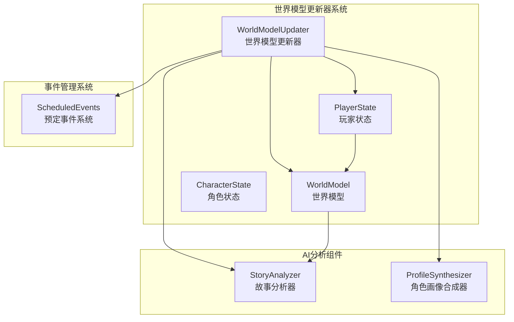

**图表来源**
- [world_model_updater.py](file://src/game/world_model_updater.py#L15-L712)
- [world_model.py](file://src/game/world_model.py#L198-L697)
- [player_state.py](file://src/game/state/player_state.py#L15-L590)

**章节来源**
- [world_model_updater.py](file://src/game/world_model_updater.py#L1-L712)
- [world_model.py](file://src/game/world_model.py#L1-L697)

## 核心组件
世界模型更新器包含以下核心功能模块：

### 1. 位置更新模块
负责处理角色地理位置变更和确认，支持移动、确认等操作类型。

### 2. 职业更新模块  
处理角色职业轨迹变化，包括职位变动、晋升、转职等场景。

### 3. 承诺更新模块
管理角色间的承诺约定，支持新建、履行、违背、过期等状态变更。

### 4. 因果链更新模块
跟踪事件之间的因果关系，支持新因果链创建和解决状态。

### 5. AI分析模块
集成AI驱动的故事分析和角色画像合成功能。

**章节来源**
- [world_model_updater.py](file://src/game/world_model_updater.py#L22-L712)

## 架构概览
世界模型更新器采用分层架构设计，实现了清晰的职责分离：

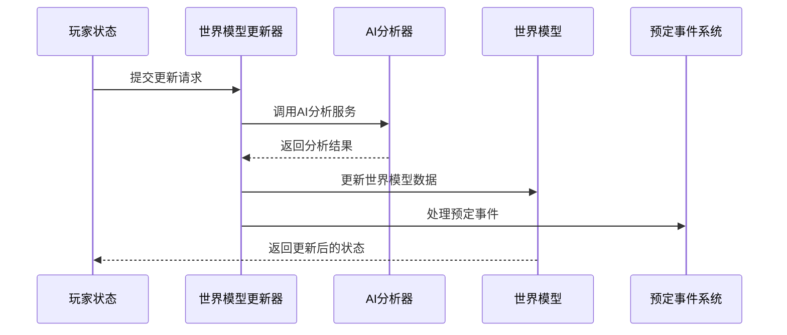

**图表来源**
- [world_model_updater.py](file://src/game/world_model_updater.py#L295-L386)
- [story_analyzer.py](file://src/ai/story_analyzer.py#L125-L183)

## 详细组件分析

### 世界模型数据结构
世界模型采用强类型的数据结构设计，确保数据的一致性和完整性：

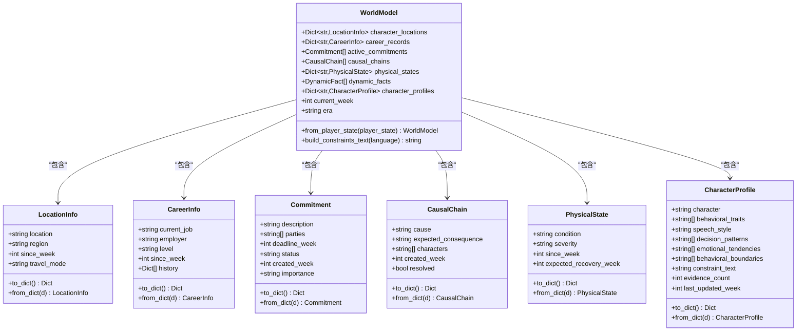

**图表来源**
- [world_model.py](file://src/game/world_model.py#L17-L174)

**章节来源**
- [world_model.py](file://src/game/world_model.py#L17-L697)

### 世界模型更新器核心功能

#### 位置更新处理
位置更新模块支持多种操作类型，包括移动和确认：

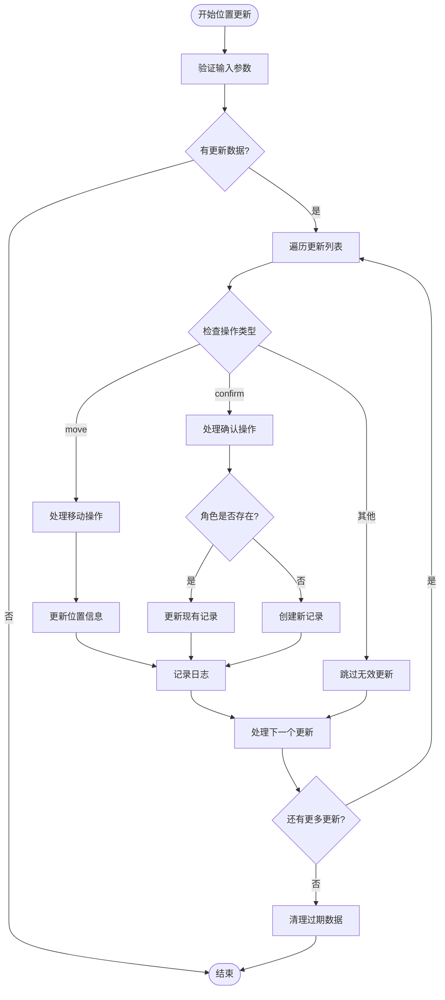

**图表来源**
- [world_model_updater.py](file://src/game/world_model_updater.py#L22-L74)

#### 职业更新处理
职业更新模块实现了复杂的职业轨迹管理：

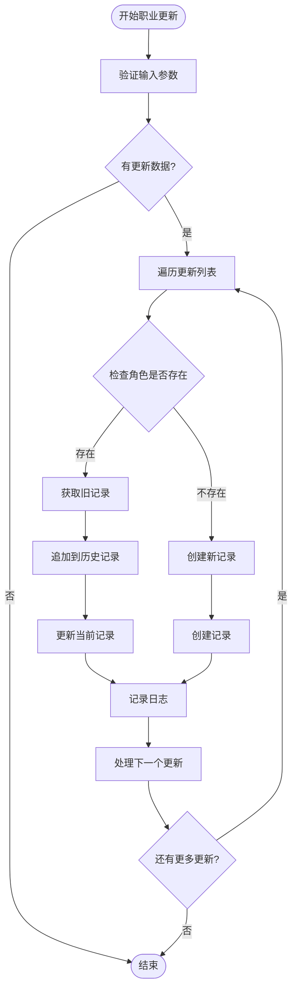

**图表来源**
- [world_model_updater.py](file://src/game/world_model_updater.py#L80-L136)

#### 承诺更新处理
承诺更新模块实现了智能的承诺匹配和状态管理：

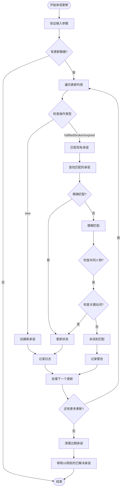

**图表来源**
- [world_model_updater.py](file://src/game/world_model_updater.py#L142-L228)

#### AI驱动的动态分析
AI分析模块提供了强大的故事理解和约束提取能力：

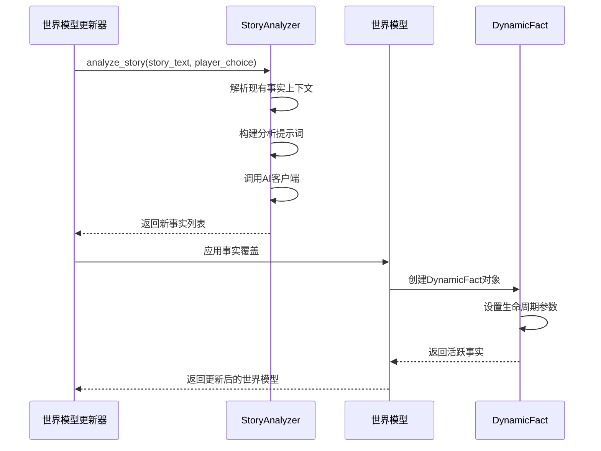

**图表来源**
- [world_model_updater.py](file://src/game/world_model_updater.py#L295-L386)
- [story_analyzer.py](file://src/ai/story_analyzer.py#L125-L183)

**章节来源**
- [world_model_updater.py](file://src/game/world_model_updater.py#L1-L712)
- [story_analyzer.py](file://src/ai/story_analyzer.py#L1-L472)

### 世界模型与玩家状态的交互

#### 数据流映射
世界模型更新器与玩家状态之间建立了紧密的数据绑定关系：

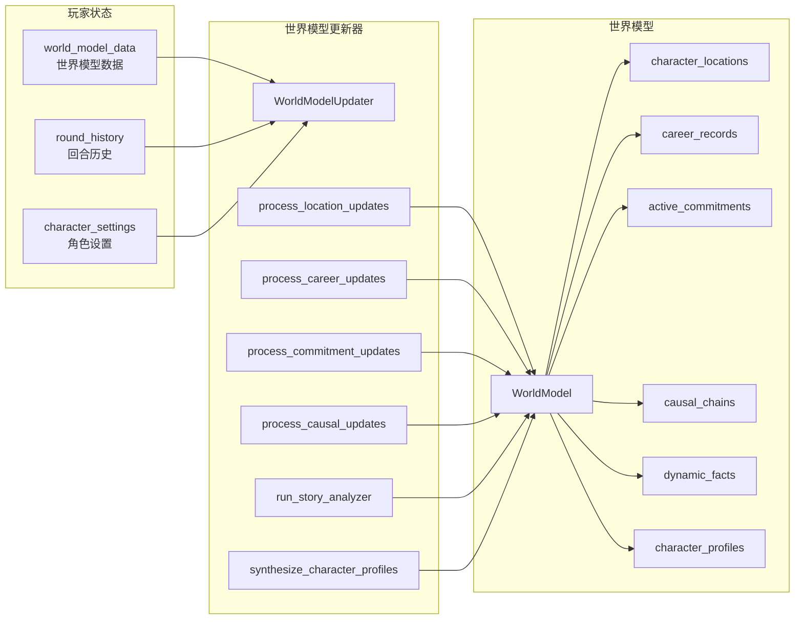

**图表来源**
- [player_state.py](file://src/game/state/player_state.py#L105-L122)
- [world_model_updater.py](file://src/game/world_model_updater.py#L15-L712)
- [world_model.py](file://src/game/world_model.py#L198-L300)

#### 查询和检索功能
世界模型提供了丰富的查询接口：

| 查询类型 | 方法 | 功能描述 | 返回值 |
|---------|------|----------|--------|
| 地理可行性检查 | `check_geographic_feasibility()` | 检查角色地理分布合理性 | `List[str]` 冲突描述列表 |
| 职业合理性检查 | `check_career_plausibility()` | 验证职业变动的合理性 | `List[str]` 冲突描述列表 |
| 未到期承诺查询 | `get_pending_commitments()` | 获取到期或逾期的承诺 | `List[Commitment]` 承诺列表 |
| 即将到期承诺查询 | `get_expiring_commitments()` | 获取即将到期的承诺 | `List[Commitment]` 承诺列表 |
| 活跃因果链查询 | `get_active_causal_chains()` | 获取未解决的因果链 | `List[CausalChain]` 因果链列表 |
| 建立的画像角色 | `get_established_profile_names()` | 获取有稳定画像的角色名 | `List[str]` 角色名列表 |

**章节来源**
- [world_model.py](file://src/game/world_model.py#L304-L391)

### 初始化和加载流程

#### 世界模型初始化
世界模型从玩家状态构建，支持新旧数据格式的兼容：

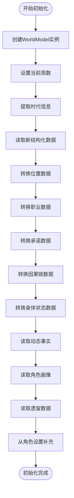

**图表来源**
- [world_model.py](file://src/game/world_model.py#L215-L300)

#### 加载流程
系统支持从保存状态恢复游戏进度：

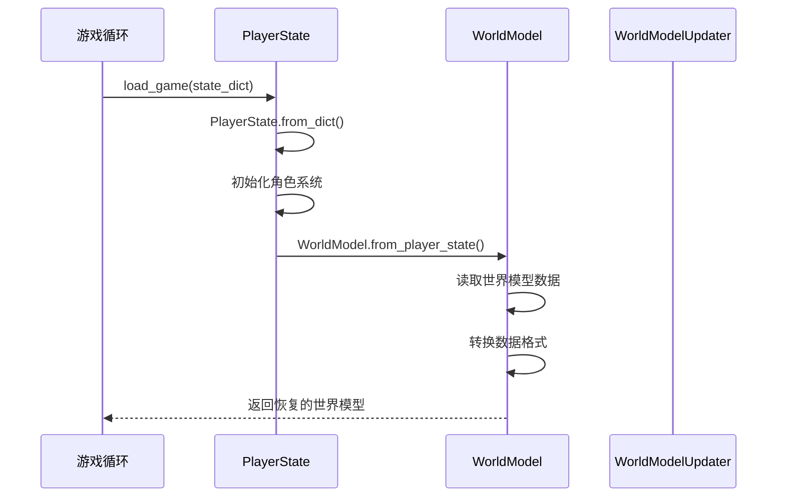

**图表来源**
- [player_state.py](file://src/game/state/player_state.py#L100-L116)
- [world_model.py](file://src/game/world_model.py#L215-L300)

**章节来源**
- [player_state.py](file://src/game/state/player_state.py#L100-L116)
- [world_model.py](file://src/game/world_model.py#L215-L300)

### 与AI生成器的协作关系

#### 协作流程
世界模型更新器与AI生成器建立了深度的协作关系：

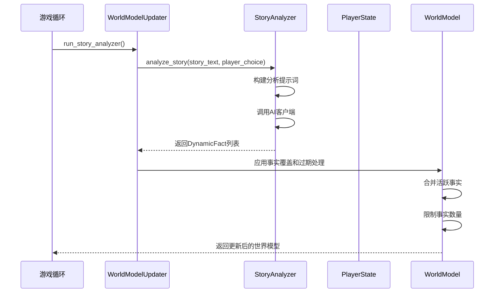

**图表来源**
- [world_model_updater.py](file://src/game/world_model_updater.py#L295-L386)
- [story_analyzer.py](file://src/ai/story_analyzer.py#L125-L183)

#### 角色画像合成
AI驱动的角色画像合成提供了个性化的角色发展：

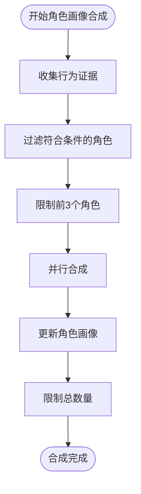

**图表来源**
- [world_model_updater.py](file://src/game/world_model_updater.py#L391-L560)

**章节来源**
- [world_model_updater.py](file://src/game/world_model_updater.py#L295-L560)
- [profile_synthesizer.py](file://src/ai/profile_synthesizer.py#L16-L85)

## 依赖关系分析

### 组件耦合度分析
世界模型更新器采用了良好的模块化设计，各组件之间保持适当的耦合度：

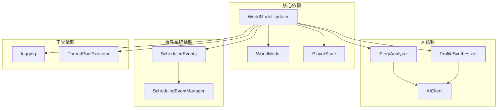

**图表来源**
- [world_model_updater.py](file://src/game/world_model_updater.py#L8-L12)
- [story_analyzer.py](file://src/ai/story_analyzer.py#L18-L26)

### 错误处理和边界情况
系统实现了完善的错误处理机制：

| 错误类型 | 处理策略 | 影响范围 |
|---------|----------|----------|
| 空输入参数 | 直接返回，不执行任何操作 | 局部 |
| AI调用失败 | 记录错误日志，不影响主流程 | 局部 |
| 数据格式不匹配 | 使用默认值或跳过无效数据 | 局部 |
| 资源限制 | 实施容量限制和清理策略 | 全局 |

**章节来源**
- [world_model_updater.py](file://src/game/world_model_updater.py#L384-L386)
- [world_model_updater.py](file://src/game/world_model_updater.py#L558-L560)

## 性能考虑

### 优化策略
世界模型更新器采用了多项性能优化措施：

#### 1. 并行处理
- 使用线程池执行多个角色的画像合成
- 支持并发的AI分析调用

#### 2. 数据结构优化
- 使用高效的数据结构减少内存占用
- 实施数据压缩和缓存策略

#### 3. 算法优化
- 实现了高效的匹配算法（模糊匹配）
- 采用贪心算法处理事实合并

#### 4. 内存管理
- 实施定期清理机制（承诺过期清理）
- 限制最大事实数量（500个）
- 控制角色画像数量（8个）

**章节来源**
- [world_model_updater.py](file://src/game/world_model_updater.py#L524-L543)
- [world_model_updater.py](file://src/game/world_model_updater.py#L364-L374)

## 故障排除指南

### 常见问题诊断

#### 1. 位置更新失败
**症状**: 位置信息没有正确更新
**可能原因**:
- 缺少必要的字段（action、character、to等）
- 输入数据格式不正确
- 玩家状态为空

**解决方案**:
- 检查输入数据的完整性
- 验证字段命名和数据类型
- 确保玩家状态正确初始化

#### 2. 职业更新异常
**症状**: 职业级别设置为默认值
**可能原因**:
- 无效的级别字符串
- 缺少必要的字段

**解决方案**:
- 确保级别值在允许范围内
- 检查字段完整性

#### 3. 承诺匹配失败
**症状**: 承诺状态没有正确更新
**可能原因**:
- 描述不匹配
- 人物列表不一致
- 关键词匹配逻辑问题

**解决方案**:
- 检查承诺描述的准确性
- 验证人物列表的一致性
- 调整匹配算法参数

#### 4. AI分析失败
**症状**: 动态事实没有正确提取
**可能原因**:
- AI客户端调用失败
- 提示词格式不正确
- 输出解析错误

**解决方案**:
- 检查AI服务连接
- 验证提示词构造
- 实施重试机制

**章节来源**
- [test_world_model_updater.py](file://tests/test_world_model_updater.py#L1-L389)
- [test_world_model.py](file://tests/test_world_model.py#L1-L518)

## 结论
世界模型更新器是一个设计精良、功能完整的系统组件，它通过模块化的设计和AI驱动的智能分析，为故事驱动游戏提供了强大的世界状态管理能力。该组件具有以下优势：

1. **模块化设计**: 清晰的功能分离，便于维护和扩展
2. **AI集成**: 深度集成AI分析能力，提供智能化的世界状态维护
3. **数据一致性**: 强类型的数据结构确保数据的完整性和一致性
4. **性能优化**: 多项性能优化措施确保系统的高效运行
5. **错误处理**: 完善的错误处理机制保证系统的稳定性

通过持续的优化和改进，世界模型更新器将继续为游戏体验提供强有力的支持。

## 附录

### 扩展和定制指南

#### 1. 添加新的世界状态类型
要添加新的世界状态类型，需要：
- 在WorldModel中添加相应的数据字段
- 实现相应的更新处理方法
- 添加数据转换逻辑
- 更新约束文本生成

#### 2. 自定义AI分析器
要自定义AI分析器：
- 扩展StoryAnalyzer类
- 实现自定义的分析逻辑
- 更新提示词模板
- 配置AI客户端参数

#### 3. 性能调优
性能调优的关键点：
- 调整线程池大小
- 优化数据结构
- 实施缓存策略
- 监控内存使用

**章节来源**
- [world_model.py](file://src/game/world_model.py#L198-L697)
- [story_analyzer.py](file://src/ai/story_analyzer.py#L108-L472)