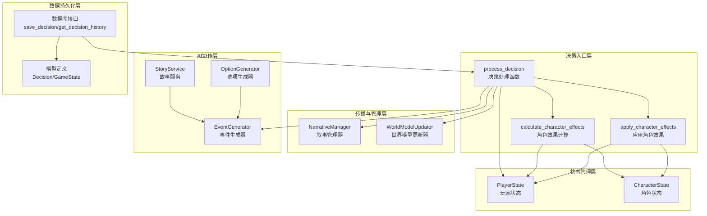
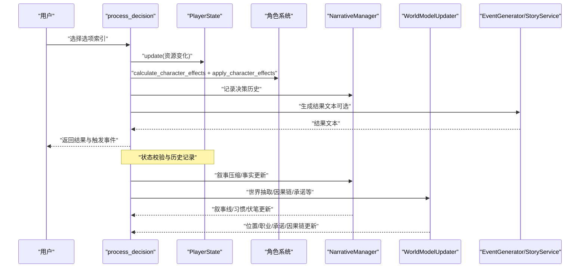
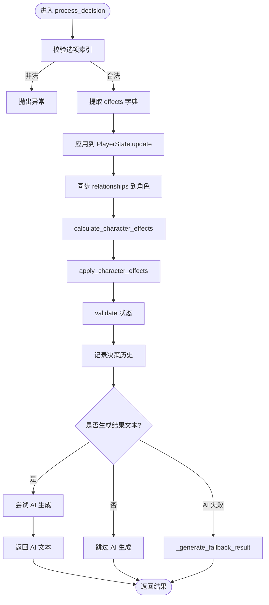
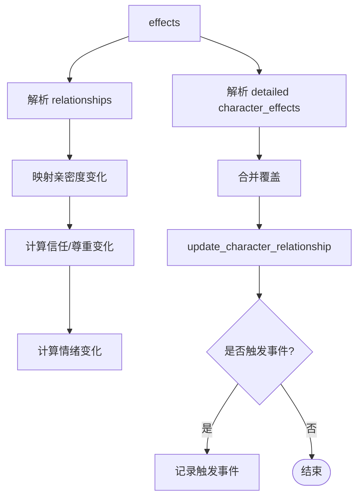
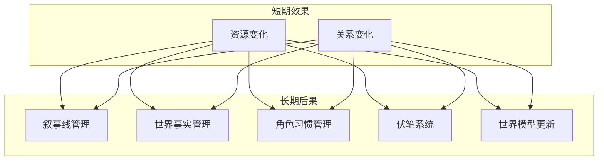
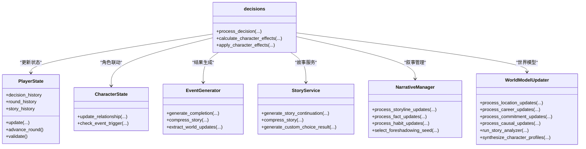

# 决策处理系统

<cite>
**本文档引用的文件**
- [src/game/decisions.py](file://src/game/decisions.py)
- [src/game/round/choice_processor.py](file://src/game/round/choice_processor.py)
- [src/game/state/player_state.py](file://src/game/state/player_state.py)
- [src/game/state/character_state.py](file://src/game/state/character_state.py)
- [src/game/narrative_manager.py](file://src/game/narrative_manager.py)
- [src/game/world_model_updater.py](file://src/game/world_model_updater.py)
- [src/game/story_service.py](file://src/game/story_service.py)
- [src/ai/generator.py](file://src/ai/generator.py)
- [src/ai/option_generator.py](file://src/ai/option_generator.py)
- [src/database/db.py](file://src/database/db.py)
- [src/database/models.py](file://src/database/models.py)
- [tests/test_game_core.py](file://tests/test_game_core.py)
</cite>

## 目录
1. [引言](#引言)
2. [项目结构](#项目结构)
3. [核心组件](#核心组件)
4. [架构总览](#架构总览)
5. [详细组件分析](#详细组件分析)
6. [依赖关系分析](#依赖关系分析)
7. [性能考虑](#性能考虑)
8. [故障排除指南](#故障排除指南)
9. [结论](#结论)
10. [附录](#附录)

## 引言
本技术文档围绕决策处理系统展开，系统目标是从事件选项生成到最终结果评估与反馈的完整闭环。文档重点阐释以下内容：
- process_decision 函数的实现逻辑：选项效果计算、资源变化处理、角色属性联动、故事结果生成与回退机制
- 决策影响的传播机制：短期效果与长期后果（世界模型、叙事线、习惯、伏笔等）
- 随机性与概率事件的处理方式：基于概率的伏笔激活、承诺事件触发等
- 决策历史的记录与查询机制：内存与数据库双轨记录
- 与AI生成器和叙事管理器的协作关系：并行压缩、世界抽取、故事分析与画像合成
- 决策示例与效果演示：通过测试用例与流程图展示不同选择对游戏进程的影响
- 决策优化建议与策略分析方法：如何设计有取舍的选项、控制资源变化范围、平衡短期与长期收益

## 项目结构
决策处理系统位于游戏核心模块中，主要由以下层次构成：
- 决策入口与处理层：process_decision、calculate_character_effects、apply_character_effects
- 状态管理层：PlayerState、CharacterState
- 后处理与传播层：NarrativeManager、WorldModelUpdater
- AI协作层：EventGenerator、StoryService、OptionGenerator
- 数据持久化层：数据库模型与访问接口

图表来源
- [src/game/decisions.py](file://src/game/decisions.py#L135-L240)
- [src/game/state/player_state.py](file://src/game/state/player_state.py#L15-L590)
- [src/game/state/character_state.py](file://src/game/state/character_state.py#L13-L243)
- [src/game/narrative_manager.py](file://src/game/narrative_manager.py#L15-L584)
- [src/game/world_model_updater.py](file://src/game/world_model_updater.py#L15-L712)
- [src/game/story_service.py](file://src/game/story_service.py#L11-L312)
- [src/ai/generator.py](file://src/ai/generator.py#L30-L497)
- [src/ai/option_generator.py](file://src/ai/option_generator.py#L223-L263)
- [src/database/db.py](file://src/database/db.py#L64-L268)
- [src/database/models.py](file://src/database/models.py#L94-L126)

章节来源
- [src/game/decisions.py](file://src/game/decisions.py#L1-L271)
- [src/game/state/player_state.py](file://src/game/state/player_state.py#L15-L590)
- [src/game/state/character_state.py](file://src/game/state/character_state.py#L13-L243)
- [src/game/narrative_manager.py](file://src/game/narrative_manager.py#L15-L584)
- [src/game/world_model_updater.py](file://src/game/world_model_updater.py#L15-L712)
- [src/game/story_service.py](file://src/game/story_service.py#L11-L312)
- [src/ai/generator.py](file://src/ai/generator.py#L30-L497)
- [src/ai/option_generator.py](file://src/ai/option_generator.py#L223-L263)
- [src/database/db.py](file://src/database/db.py#L64-L268)
- [src/database/models.py](file://src/database/models.py#L94-L126)

## 核心组件
- process_decision：决策入口，负责参数校验、效果应用、角色联动、状态校验、历史记录与结果生成
- calculate_character_effects / apply_character_effects：将选项效果映射为角色属性变化，并触发角色特殊事件
- PlayerState / CharacterState：玩家与NPC状态模型，提供资源更新、关系同步、角色事件触发等能力
- NarrativeManager / WorldModelUpdater：叙事与世界模型的增量维护，包括故事线、事实、习惯、伏笔、承诺、因果链等
- EventGenerator / StoryService：AI生成器与故事服务，负责结果文本生成、压缩与世界抽取
- OptionGenerator：事件选项生成与质量校验，确保选项具备合理取舍
- 数据库接口：保存决策记录、查询历史，支撑一致性校验与回溯

章节来源
- [src/game/decisions.py](file://src/game/decisions.py#L135-L240)
- [src/game/state/player_state.py](file://src/game/state/player_state.py#L159-L490)
- [src/game/state/character_state.py](file://src/game/state/character_state.py#L134-L172)
- [src/game/narrative_manager.py](file://src/game/narrative_manager.py#L22-L95)
- [src/game/world_model_updater.py](file://src/game/world_model_updater.py#L22-L290)
- [src/game/story_service.py](file://src/game/story_service.py#L18-L142)
- [src/ai/option_generator.py](file://src/ai/option_generator.py#L223-L263)
- [src/database/db.py](file://src/database/db.py#L73-L268)

## 架构总览
决策处理系统采用“决策入口—状态更新—角色联动—传播管理—AI协作—持久化”的流水线架构。决策完成后，系统通过并行任务完成故事压缩、世界抽取与分析，随后更新叙事线、事实、习惯、伏笔与承诺等世界模型数据。

图表来源
- [src/game/decisions.py](file://src/game/decisions.py#L135-L240)
- [src/game/state/player_state.py](file://src/game/state/player_state.py#L159-L338)
- [src/game/narrative_manager.py](file://src/game/narrative_manager.py#L22-L95)
- [src/game/world_model_updater.py](file://src/game/world_model_updater.py#L22-L290)
- [src/game/story_service.py](file://src/game/story_service.py#L18-L142)
- [src/ai/generator.py](file://src/ai/generator.py#L333-L382)

## 详细组件分析

### process_decision 函数详解
- 输入参数与校验：对选项索引进行边界检查；从选项字典提取 effects
- 资源变化应用：对能量、情绪、知识、财富、关系进行更新；调用 PlayerState.update
- 关系同步：将 relationships 同步到角色系统，确保一致性
- 角色效果计算与应用：将 effects 映射为角色属性变化（亲密度、信任、尊重、情绪），并触发角色特殊事件
- 状态校验：决策后执行 validate，确保状态在合法范围内
- 历史记录：将决策记录写入 decision_history，包含周数、事件描述、选择文本、效果与角色效果
- 结果生成：可选地调用 AI 生成结果文本，失败时回退到本地生成

图表来源
- [src/game/decisions.py](file://src/game/decisions.py#L135-L240)

章节来源
- [src/game/decisions.py](file://src/game/decisions.py#L135-L240)
- [tests/test_game_core.py](file://tests/test_game_core.py#L119-L164)

### 角色效果计算与应用
- calculate_character_effects：将 relationships 与 character_effects 映射为角色属性变化；正向互动提升信任、尊重与情绪，负向互动则相反
- apply_character_effects：逐个角色更新属性，若达到事件阈值则触发相应角色事件（如深度友谊、冲突、求助、秘密分享、背叛风险等）

图表来源
- [src/game/decisions.py](file://src/game/decisions.py#L14-L107)
- [src/game/state/player_state.py](file://src/game/state/player_state.py#L450-L464)
- [src/game/state/character_state.py](file://src/game/state/character_state.py#L169-L172)

章节来源
- [src/game/decisions.py](file://src/game/decisions.py#L14-L107)
- [src/game/state/player_state.py](file://src/game/state/player_state.py#L450-L464)
- [src/game/state/character_state.py](file://src/game/state/character_state.py#L169-L172)

### 决策影响的传播机制
- 短期效果：即时资源变化（能量、情绪、知识、财富）与关系变化
- 长期后果：
  - 叙事层面：故事线的新增、延续与消解；世界事实的新增、更新与移除；角色习惯的强化、弱化与改变
  - 世界模型：位置移动、职业变迁、承诺履行/破裂/过期、因果链构建与解决
  - 伏笔系统：基于概率的成熟度与上下文匹配，激活伏笔种子并记录回收距离

图表来源
- [src/game/narrative_manager.py](file://src/game/narrative_manager.py#L22-L95)
- [src/game/narrative_manager.py](file://src/game/narrative_manager.py#L101-L182)
- [src/game/narrative_manager.py](file://src/game/narrative_manager.py#L420-L583)
- [src/game/world_model_updater.py](file://src/game/world_model_updater.py#L22-L290)
- [src/game/world_model_updater.py](file://src/game/world_model_updater.py#L295-L386)

章节来源
- [src/game/narrative_manager.py](file://src/game/narrative_manager.py#L22-L95)
- [src/game/narrative_manager.py](file://src/game/narrative_manager.py#L101-L182)
- [src/game/narrative_manager.py](file://src/game/narrative_manager.py#L420-L583)
- [src/game/world_model_updater.py](file://src/game/world_model_updater.py#L22-L290)
- [src/game/world_model_updater.py](file://src/game/world_model_updater.py#L295-L386)

### 随机因素与概率事件
- 伏笔激活：根据成熟度、隐蔽度、叙事权重与上下文匹配度计算激活概率，结合随机数决定是否激活
- 承诺匹配：模糊匹配策略，基于人物与关键词相似度提高匹配概率
- 世界模型清理：对过期或已解决的条目按时间窗口清理，维持数据规模可控

章节来源
- [src/game/world_model_updater.py](file://src/game/world_model_updater.py#L187-L285)
- [src/game/world_model_updater.py](file://src/game/world_model_updater.py#L180-L228)

### 决策历史的记录与查询机制
- 内存记录：PlayerState.decision_history、round_history、story_history
- 数据库持久化：save_decision 保存决策记录；get_decision_history 查询历史
- 一致性校验：数据库接口提供搜索关键词功能，便于验证事实是否被忽略

章节来源
- [src/game/state/player_state.py](file://src/game/state/player_state.py#L38-L63)
- [src/database/db.py](file://src/database/db.py#L73-L111)
- [src/database/db.py](file://src/database/db.py#L203-L268)
- [src/database/models.py](file://src/database/models.py#L113-L126)

### 与AI生成器和叙事管理器的协作
- AI生成器：EventGenerator 统一调度 StoryGenerator、OptionGenerator、SummaryGenerator、StoryRewriter
- 故事服务：StoryService 提供故事续写、压缩、世界抽取与自定义选择的效果/结果生成
- 并行处理：决策后通过并行任务完成叙事压缩、世界抽取与故事分析，提升吞吐量
- 世界模型合成：定期合成角色画像，限制数量与证据数，控制成本

章节来源
- [src/ai/generator.py](file://src/ai/generator.py#L30-L497)
- [src/game/story_service.py](file://src/game/story_service.py#L18-L142)
- [src/game/world_model_updater.py](file://src/game/world_model_updater.py#L391-L559)

### 决策示例与效果演示
- 示例1：选择增加情绪，同时对关系产生正向影响，触发角色事件
- 示例2：选择导致财富变化，系统记录并生成结果文本
- 示例3：无效选项索引抛出异常，保护系统一致性

章节来源
- [tests/test_game_core.py](file://tests/test_game_core.py#L119-L164)
- [tests/test_game_core.py](file://tests/test_game_core.py#L135-L147)

### 决策优化建议与策略分析
- 设计有取舍的选项：确保至少两个选项在不同维度上有权衡，避免“无差异”选项
- 控制资源变化范围：遵循合理区间，避免极端波动，保持长期可玩性
- 平衡短期与长期收益：短期高收益可能带来长期代价，需在选项描述中体现
- 事件触发阈值设计：针对角色事件设置合适的阈值，避免过于频繁或稀少
- 世界模型扩展：通过承诺、因果链与伏笔系统，增强决策的长期意义与回响

章节来源
- [src/ai/option_generator.py](file://src/ai/option_generator.py#L223-L263)
- [src/game/state/character_state.py](file://src/game/state/character_state.py#L84-L114)

## 依赖关系分析
决策处理系统的耦合与协作关系如下：

图表来源
- [src/game/decisions.py](file://src/game/decisions.py#L135-L240)
- [src/game/state/player_state.py](file://src/game/state/player_state.py#L159-L490)
- [src/game/state/character_state.py](file://src/game/state/character_state.py#L134-L172)
- [src/game/narrative_manager.py](file://src/game/narrative_manager.py#L22-L95)
- [src/game/world_model_updater.py](file://src/game/world_model_updater.py#L22-L290)
- [src/game/story_service.py](file://src/game/story_service.py#L18-L142)
- [src/ai/generator.py](file://src/ai/generator.py#L333-L382)

章节来源
- [src/game/decisions.py](file://src/game/decisions.py#L135-L240)
- [src/game/state/player_state.py](file://src/game/state/player_state.py#L159-L490)
- [src/game/state/character_state.py](file://src/game/state/character_state.py#L134-L172)
- [src/game/narrative_manager.py](file://src/game/narrative_manager.py#L22-L95)
- [src/game/world_model_updater.py](file://src/game/world_model_updater.py#L22-L290)
- [src/game/story_service.py](file://src/game/story_service.py#L18-L142)
- [src/ai/generator.py](file://src/ai/generator.py#L333-L382)

## 性能考虑
- 并行处理：决策后通过线程池并行执行叙事压缩、世界抽取与故事分析，减少延迟
- 缓存与重试：AI调用支持缓存与重试，降低失败率与重复开销
- 数据规模控制：对世界事实、角色习惯、伏笔种子与动态事实设置上限，避免膨胀
- 事件质量校验：选项生成阶段进行合理性检查，减少无效事件带来的后续处理成本

## 故障排除指南
- 无效选项索引：抛出异常，检查选项列表长度与索引范围
- AI生成失败：回退到本地生成，确保流程可用
- 状态越界：validate 在更新后执行，发现异常及时记录日志
- 历史查询：通过数据库接口查询历史，结合关键词搜索定位问题

章节来源
- [src/game/decisions.py](file://src/game/decisions.py#L163-L196)
- [src/game/story_service.py](file://src/game/story_service.py#L67-L73)
- [src/database/db.py](file://src/database/db.py#L203-L268)

## 结论
决策处理系统通过清晰的职责划分与并行化处理，实现了从选项到结果的高效闭环。系统不仅关注短期资源变化，更通过叙事线、世界模型与伏笔系统构建长期影响，辅以AI生成与世界抽取，使决策具有持续回响与可探索性。配合完善的记录与查询机制，系统在可玩性、一致性与可维护性方面均表现良好。

## 附录
- 决策流程图与类图已在前述章节中给出，读者可根据需要对照源码文件定位实现细节
- 测试用例覆盖了典型场景与边界条件，可作为集成测试与回归测试的基础