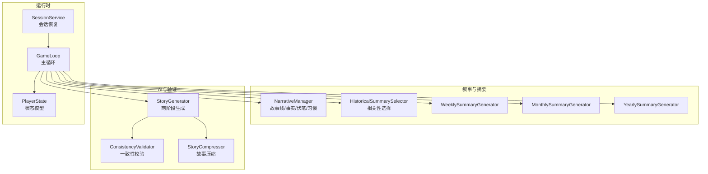
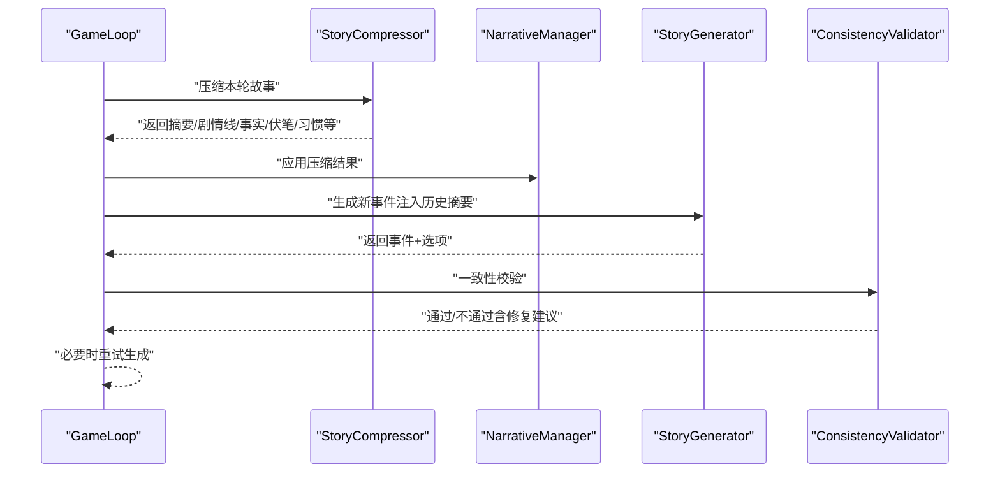
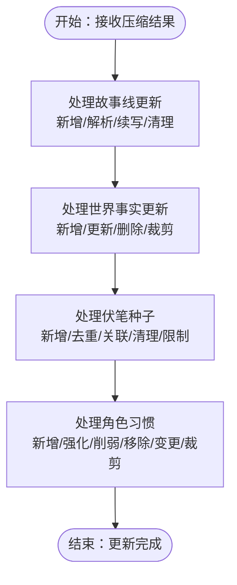
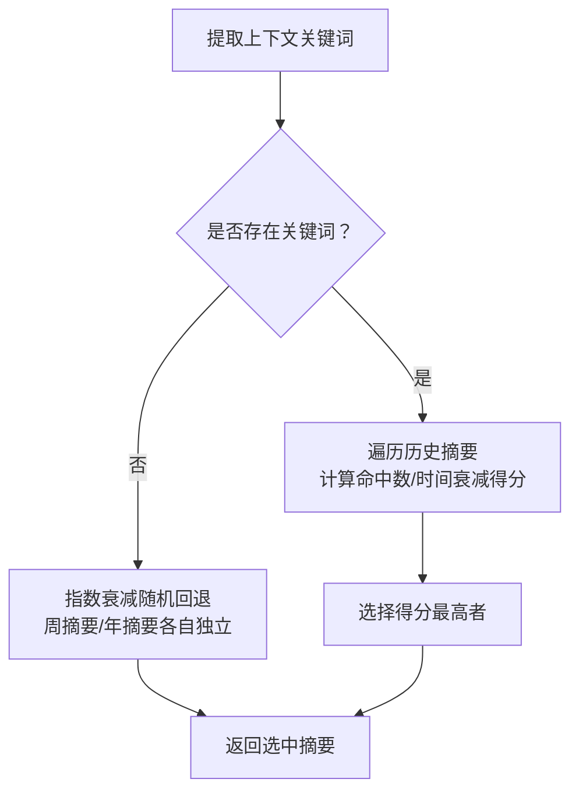
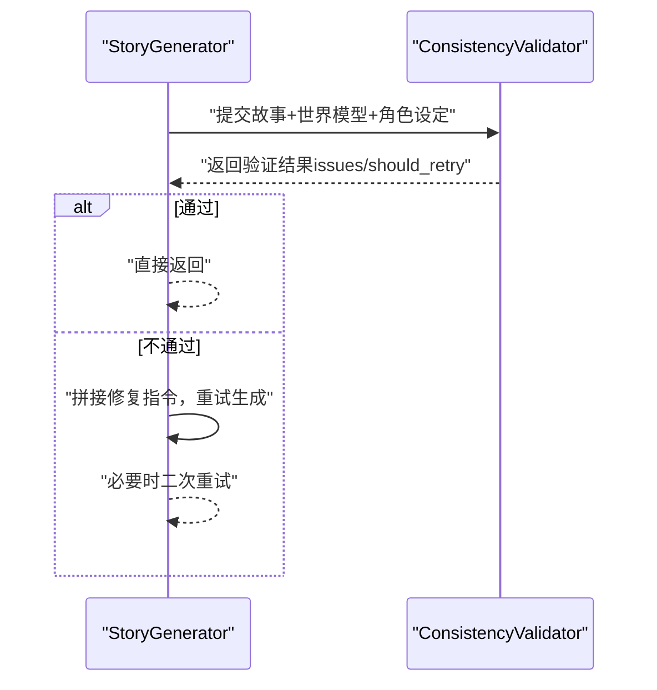
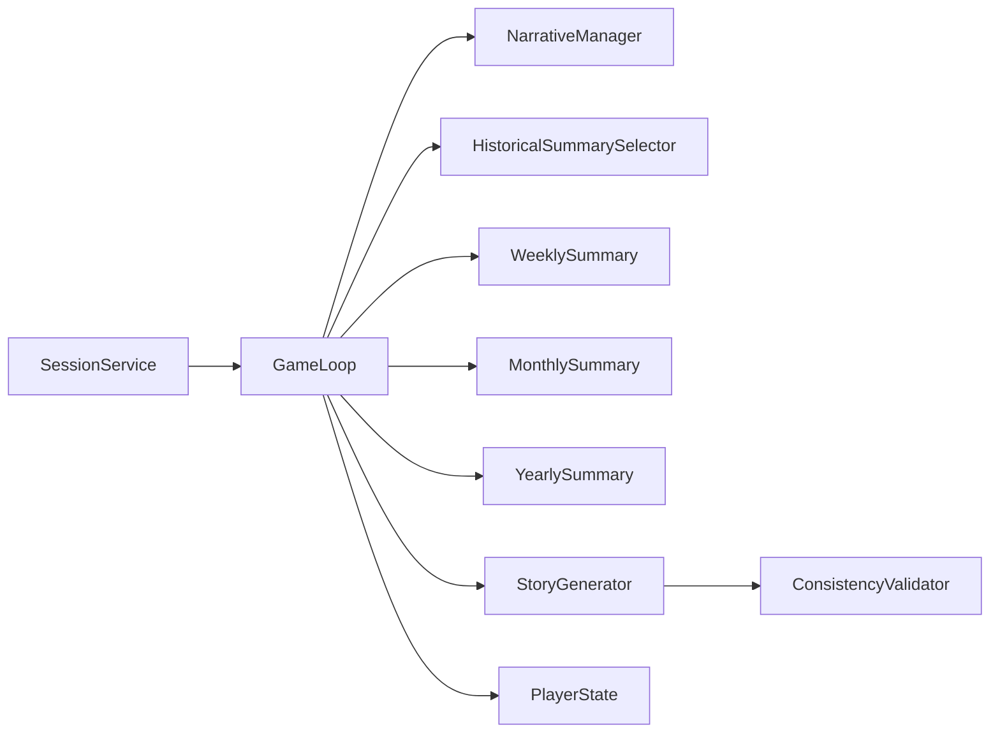

# 叙事管理系统

<cite>
**本文引用的文件**
- [narrative_manager.py](file://src/game/narrative_manager.py)
- [historical_summary_selector.py](file://src/game/historical_summary_selector.py)
- [weekly_summary.py](file://src/game/weekly_summary.py)
- [monthly_summary.py](file://src/game/monthly_summary.py)
- [yearly_summary.py](file://src/game/yearly_summary.py)
- [game_loop.py](file://src/game/game_loop.py)
- [player_state.py](file://src/game/state/player_state.py)
- [session_service.py](file://src/api/services/session_service.py)
- [story_generator.py](file://src/ai/story_generator.py)
- [consistency_validator.py](file://src/ai/consistency_validator.py)
- [summary_generator.py](file://src/ai/summary_generator.py)
- [_helpers.py](file://config/prompts/_helpers.py)
- [world_model.py](file://src/game/world_model.py)
</cite>

## 目录
1. [简介](#简介)
2. [项目结构](#项目结构)
3. [核心组件](#核心组件)
4. [架构总览](#架构总览)
5. [详细组件分析](#详细组件分析)
6. [依赖分析](#依赖分析)
7. [性能考量](#性能考量)
8. [故障排查指南](#故障排查指南)
9. [结论](#结论)
10. [附录](#附录)

## 简介
本技术文档围绕叙事管理系统展开，重点解析 NarrativeManager 类的设计理念与实现架构，涵盖故事线维护、事实更新、伏笔种子激活与回收、角色习惯追踪、历史摘要选择算法与生成策略、叙事一致性检查与冲突解决、状态持久化与恢复、叙事质量评估与优化，以及与 AI 生成器的协作关系。文档旨在帮助开发者与产品人员快速理解系统如何通过“压缩-更新-生成-验证”的闭环，保障故事连贯性与一致性。

## 项目结构
叙事管理相关代码主要分布在以下模块：
- 叙事管理核心：src/game/narrative_manager.py
- 历史摘要选择：src/game/historical_summary_selector.py
- 周/月/年摘要生成：src/game/weekly_summary.py、monthly_summary.py、yearly_summary.py
- 游戏主循环与集成：src/game/game_loop.py
- 状态模型：src/game/state/player_state.py
- 会话恢复服务：src/api/services/session_service.py
- AI 生成与一致性校验：src/ai/story_generator.py、src/ai/consistency_validator.py、src/ai/summary_generator.py
- 提示词辅助：config/prompts/_helpers.py
- 世界模型约束：src/game/world_model.py

图表来源
- [narrative_manager.py](file://src/game/narrative_manager.py#L15-L584)
- [historical_summary_selector.py](file://src/game/historical_summary_selector.py#L14-L206)
- [weekly_summary.py](file://src/game/weekly_summary.py#L11-L120)
- [monthly_summary.py](file://src/game/monthly_summary.py#L11-L139)
- [yearly_summary.py](file://src/game/yearly_summary.py#L11-L171)
- [game_loop.py](file://src/game/game_loop.py#L25-L200)
- [player_state.py](file://src/game/state/player_state.py#L15-L590)
- [session_service.py](file://src/api/services/session_service.py#L24-L158)
- [story_generator.py](file://src/ai/story_generator.py#L24-L200)
- [consistency_validator.py](file://src/ai/consistency_validator.py#L42-L404)
- [summary_generator.py](file://src/ai/summary_generator.py#L126-L252)

章节来源
- [game_loop.py](file://src/game/game_loop.py#L25-L200)
- [player_state.py](file://src/game/state/player_state.py#L15-L590)

## 核心组件
- NarrativeManager：负责故事线、世界事实、伏笔种子、角色习惯的增删改查与清理，提供概率化激活与权重控制，确保叙事连贯与新鲜感。
- HistoricalSummarySelector：基于上下文关键词的相关性打分，优先选择与当前周/年摘要最相关的上下文；无关键词时采用指数衰减随机回退。
- 摘要生成器：按周/月/年维度生成结构化摘要，包含状态变化、决策数量、最终状态快照等，作为历史上下文注入生成。
- GameLoop：主循环编排事件生成、压缩、更新、摘要与验证，协调各子系统。
- PlayerState：统一的状态载体，保存故事线、事实、伏笔、习惯、世界模型数据、回合历史、周/月/年摘要等。
- SessionService：统一的会话获取与自动恢复，保障后端重启后的无缝体验。
- StoryGenerator/ConsistencyValidator/StoryCompressor：两阶段生成与一致性校验，确保产出质量与一致性。

章节来源
- [narrative_manager.py](file://src/game/narrative_manager.py#L15-L584)
- [historical_summary_selector.py](file://src/game/historical_summary_selector.py#L14-L206)
- [weekly_summary.py](file://src/game/weekly_summary.py#L11-L120)
- [monthly_summary.py](file://src/game/monthly_summary.py#L11-L139)
- [yearly_summary.py](file://src/game/yearly_summary.py#L11-L171)
- [game_loop.py](file://src/game/game_loop.py#L25-L200)
- [player_state.py](file://src/game/state/player_state.py#L15-L590)
- [session_service.py](file://src/api/services/session_service.py#L24-L158)
- [story_generator.py](file://src/ai/story_generator.py#L24-L200)
- [consistency_validator.py](file://src/ai/consistency_validator.py#L42-L404)
- [summary_generator.py](file://src/ai/summary_generator.py#L126-L252)

## 架构总览
系统采用“压缩-更新-生成-验证”闭环：
- 故事压缩：由 StoryCompressor 提取摘要、剧情线更新、世界事实、伏笔种子、角色习惯等。
- 叙事更新：NarrativeManager 接收压缩结果，更新 PlayerState 的故事线、事实、伏笔与习惯。
- 生成与注入：StoryGenerator 基于 PlayerState 与历史摘要生成新事件，HistoricalSummarySelector 选择相关上下文。
- 一致性校验：ConsistencyValidator 对生成内容进行跨维度一致性检查，必要时触发重试与修正提示。

图表来源
- [game_loop.py](file://src/game/game_loop.py#L25-L200)
- [narrative_manager.py](file://src/game/narrative_manager.py#L15-L584)
- [story_generator.py](file://src/ai/story_generator.py#L24-L200)
- [consistency_validator.py](file://src/ai/consistency_validator.py#L42-L404)
- [summary_generator.py](file://src/ai/summary_generator.py#L126-L252)

## 详细组件分析

### NarrativeManager 设计与实现
- 故事线维护
  - 新增：记录创建周、重要性、状态、关联人物、最后提及周。
  - 解析：模糊匹配描述，移除已解决故事线。
  - 续写：更新最后提及周，保持活跃。
  - 清理：按重要性与闲置周数分级淘汰，高/中/低重要性分别设置不同宽限期。
- 世界事实更新
  - 支持新增、更新（可变更分类）、删除；去重基于主题+分类。
  - 总量上限 50，超限按“最近建立周”降序裁剪。
- 伏笔种子选择与激活
  - 成熟度：考虑播种周、成熟度基线与隐蔽度，形成有效成熟周。
  - 概率：基础概率随“超成熟周数”线性上升至峰值，之后指数衰减；权重乘数（major/supporting/minor）与上下文匹配（人物/剧情关键词）进一步放大。
  - 激活后记录恢复距离（从播种到激活的周数）与平均恢复距离。
  - 处理：去重、类型/权重/回收方式规范化、与现有故事线建立关联、清理过期/已激活种子、限制活跃种子数量。
- 角色习惯更新
  - 支持新增、强化、削弱、移除、变更；去重基于描述相似度。
  - 每角色上限 10 条，按强度与最近出现周排序裁剪。

图表来源
- [narrative_manager.py](file://src/game/narrative_manager.py#L22-L584)

章节来源
- [narrative_manager.py](file://src/game/narrative_manager.py#L15-L584)

### 历史摘要选择算法与生成策略
- 相关性选择
  - 关键词来源：未完结故事线、承诺事项、上一轮故事中的人名、激活的伏笔种子。
  - 评分：命中关键词数除以时间衰减因子（周距越大衰减越强），取最高分。
  - 无关键词时：按指数衰减随机回退，周距越大概率越低。
- 生成策略
  - 周摘要：基于状态变化与决策数量生成 50-100 字摘要。
  - 月摘要：包含月内关键决策与状态变化，80-150 字。
  - 年摘要：汇总年度变化、关键决策、月度摘要片段，150-250 字。

图表来源
- [historical_summary_selector.py](file://src/game/historical_summary_selector.py#L17-L206)

章节来源
- [historical_summary_selector.py](file://src/game/historical_summary_selector.py#L14-L206)
- [weekly_summary.py](file://src/game/weekly_summary.py#L11-L120)
- [monthly_summary.py](file://src/game/monthly_summary.py#L11-L139)
- [yearly_summary.py](file://src/game/yearly_summary.py#L11-L171)

### 预设故事线的激活机制与悬念种子选择逻辑
- 激活机制
  - 成熟度与隐蔽度共同决定有效成熟周；超成熟后概率先升后降。
  - 人物/剧情关键词匹配提供额外概率加成；权重（major/supporting/minor）乘数放大。
  - 激活后记录恢复距离与平均恢复距离，用于评估系统健康度。
- 悬念种子回收
  - 支持多种回收方式：揭示、证实、讽刺转折、升级、回响；与故事线建立关联，便于后续自然回收。

章节来源
- [narrative_manager.py](file://src/game/narrative_manager.py#L187-L415)

### 叙事一致性检查与冲突解决机制
- 维度覆盖：地理、职业、个性、时间、承诺、因果、虚构（捐造）等七维。
- 两阶段验证
  - 世界模型约束：基于当前世界模型构建约束文本，指导 AI 判断。
  - 历史交叉验证：结合数据库历史故事与已提取事实，检测“过去事件是否可溯源”“重要事实是否遗漏”“因果链是否断裂”。
- 结果处理
  - AI 直接给出 should_retry 与 retry_reason；若缺失则回退为“存在 CRITICAL 即不通过”。
  - 生成修复指令串，注入重试提示，严格区分“必须修正”与“建议改进”。

图表来源
- [story_generator.py](file://src/ai/story_generator.py#L32-L191)
- [consistency_validator.py](file://src/ai/consistency_validator.py#L60-L239)
- [consistency_validator.py](file://src/ai/consistency_validator.py#L240-L404)

章节来源
- [consistency_validator.py](file://src/ai/consistency_validator.py#L42-L404)
- [story_generator.py](file://src/ai/story_generator.py#L24-L200)

### 叙事状态的持久化与恢复策略
- 会话恢复
  - SessionService 提供统一的 get_or_restore：内存中不存在时自动从数据库加载，重建 GameLoop 并写回内存。
  - 支持语言检测与 current_event 恢复，确保用户无感知继续。
- 状态模型
  - PlayerState 保存故事线、事实、伏笔、习惯、世界模型、回合历史、周/月/年摘要、预定事件等，支持 to_dict/from_dict 序列化。
- 主循环加载
  - GameLoop.load_game 支持从保存状态恢复，初始化年边界、事件生成跟踪与 current_event。

章节来源
- [session_service.py](file://src/api/services/session_service.py#L24-L158)
- [player_state.py](file://src/game/state/player_state.py#L15-L590)
- [game_loop.py](file://src/game/game_loop.py#L100-L159)

### 叙事质量评估与优化方法
- 评估维度
  - 一致性：通过 ConsistencyValidator 的七维检查与历史交叉验证。
  - 连贯性：通过 HistoricalSummarySelector 的相关性评分与伏笔回收路径。
  - 丰富度：通过角色习惯、世界事实、承诺与因果链的持续扩展。
- 优化建议
  - 适度提高“高重要性故事线”的强制要求权重，确保主线不被忽视。
  - 控制伏笔种子总数与权重分布，避免“过饱和”导致读者困惑。
  - 定期审查“恢复距离”指标，调整成熟度与隐蔽度参数，提升回收效率。
  - 在提示词中强调“因果链”“承诺履行”等关键约束，减少 CRITICAL 问题。

章节来源
- [narrative_manager.py](file://src/game/narrative_manager.py#L187-L415)
- [historical_summary_selector.py](file://src/game/historical_summary_selector.py#L17-L206)
- [consistency_validator.py](file://src/ai/consistency_validator.py#L42-L404)

### 与 AI 生成器的协作关系
- 两阶段管线
  - Step 1：StoryGenerator 仅生成故事文本，注入历史摘要、角色习惯、未完结故事线、承诺与因果链等上下文。
  - Step 2：OptionGenerator 基于故事生成选项，随后进行关系名校验与质量评估。
- 温度策略
  - 逐步降低温度，首次 0.85，重试依次降至 0.75/0.7，提升准确性。
- 缓存与流式回调
  - 支持缓存事件与流式回调，改善用户体验与性能。

章节来源
- [story_generator.py](file://src/ai/story_generator.py#L32-L191)

### 多线叙事管理与冲突处理
- 多线叙事
  - 未完结故事线按“高/中/低”重要性分级，高重要性需在故事中自然回应或推进。
  - 通过提示词助手与世界模型约束，确保多条主线在时间轴与因果上保持一致。
- 冲突处理
  - 一致性校验发现 CRITICAL 冲突时，强制重试并注入修复指令。
  - 世界模型的因果链与承诺清单提供“不可遗忘”的约束，避免遗忘关键事件。

章节来源
- [_helpers.py](file://config/prompts/_helpers.py#L202-L223)
- [world_model.py](file://src/game/world_model.py#L528-L556)
- [consistency_validator.py](file://src/ai/consistency_validator.py#L42-L404)

## 依赖分析
- 组件耦合
  - GameLoop 依赖 NarrativeManager、HistoricalSummarySelector、各摘要生成器与 AI 生成/验证模块。
  - PlayerState 作为数据中枢，被所有模块读写。
  - SessionService 与数据库交互，解耦持久化细节。
- 外部依赖
  - AI 客户端与系统提示词库；数据库用于会话与历史故事存储。

图表来源
- [game_loop.py](file://src/game/game_loop.py#L25-L200)
- [player_state.py](file://src/game/state/player_state.py#L15-L590)
- [session_service.py](file://src/api/services/session_service.py#L24-L158)

章节来源
- [game_loop.py](file://src/game/game_loop.py#L25-L200)
- [player_state.py](file://src/game/state/player_state.py#L15-L590)
- [session_service.py](file://src/api/services/session_service.py#L24-L158)

## 性能考量
- 并行压缩与抽取：StoryCompressor 的 narrative 与 world 抽取并行，缩短生成延迟。
- 摘要生成温度策略：逐步降低温度，减少无效重试。
- 历史摘要选择：相关性评分与指数衰减回退均摊计算成本。
- 状态裁剪：故事线/事实/伏笔/习惯均设有上限与降序裁剪，控制内存占用。

[本节为通用指导，无需列出章节来源]

## 故障排查指南
- 生成失败
  - 检查 ConsistencyValidator 的 should_retry 与 retry_reason，按修复指令重试。
  - 若无 JSON 输出，回退为“通过”，但可能掩盖潜在问题，应关注日志。
- 会话丢失
  - 使用 SessionService 自动从数据库恢复；确认数据库连接与游戏 ID。
- 伏笔未激活
  - 检查成熟度、隐蔽度、权重与上下文匹配；核对“恢复距离”指标。
- 摘要不相关
  - 确认上下文关键词提取是否正确；适当增加“相关性阈值”。

章节来源
- [consistency_validator.py](file://src/ai/consistency_validator.py#L60-L239)
- [session_service.py](file://src/api/services/session_service.py#L74-L122)
- [narrative_manager.py](file://src/game/narrative_manager.py#L187-L415)
- [historical_summary_selector.py](file://src/game/historical_summary_selector.py#L17-L206)

## 结论
NarrativeManager 通过“概率化成熟—激活—回收”的伏笔系统与“相关性评分—指数回退”的摘要选择，实现了高连贯性与高可读性的叙事闭环。配合两阶段生成与一致性校验，系统在创意自由与逻辑严谨之间取得平衡。建议持续监控“恢复距离”“CRITICAL 问题比例”等指标，动态调优成熟度与权重参数，以获得更佳的叙事体验。

[本节为总结，无需列出章节来源]

## 附录
- 关键字段说明（摘自 PlayerState）
  - 未完结故事线：描述、创建周、重要性、状态、关联人物、最后提及周。
  - 已建立事实：事实文本、主题、分类、建立周。
  - 伏笔种子：描述、原始上下文、播种周、关联人物、类型、成熟周、激活状态、回收方式、关联故事线。
  - 角色习惯：角色名、习惯描述、类别、建立周、最后出现周、强度、来源。
  - 世界模型数据：地点、职业、承诺、因果链、身体状态、动态事实、角色画像。
  - 摘要集合：周/月/年摘要列表。

章节来源
- [player_state.py](file://src/game/state/player_state.py#L15-L590)