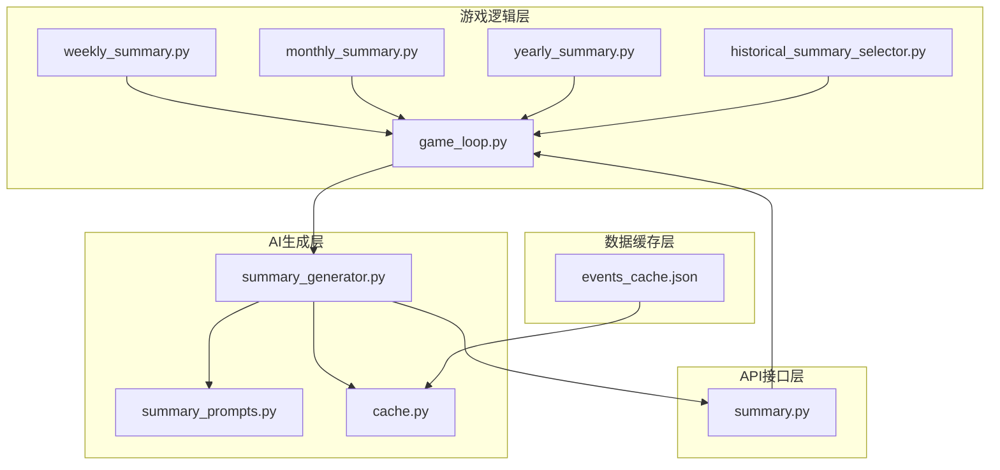
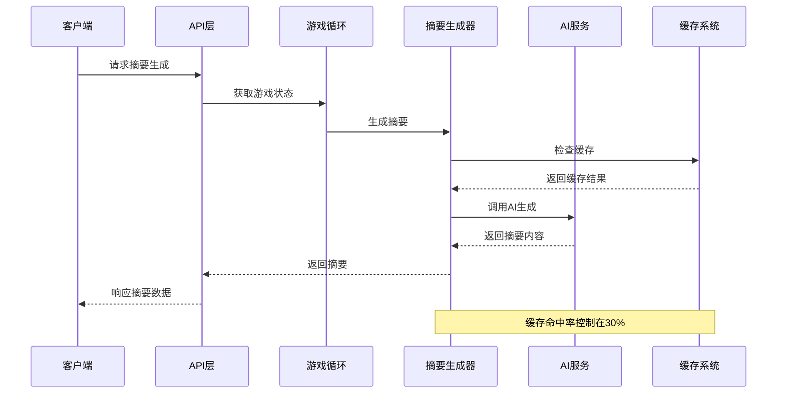
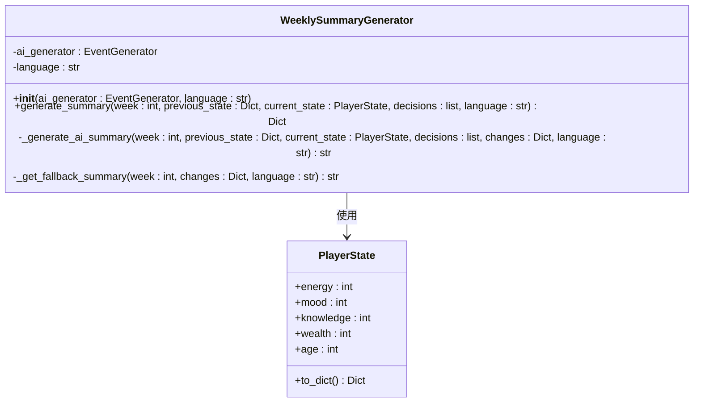
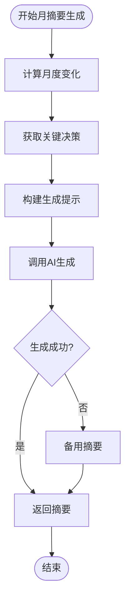
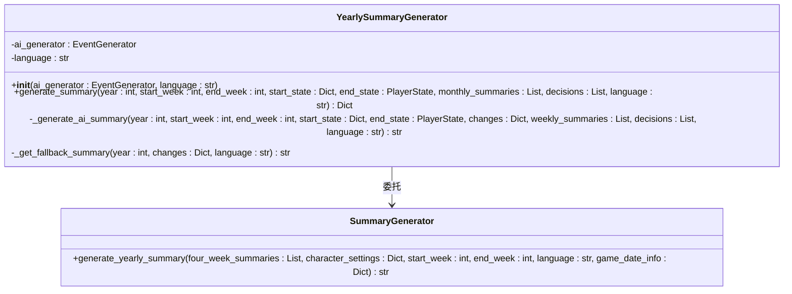
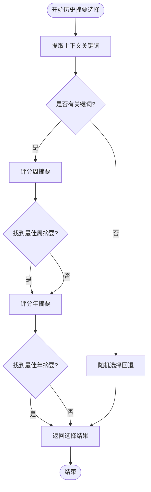
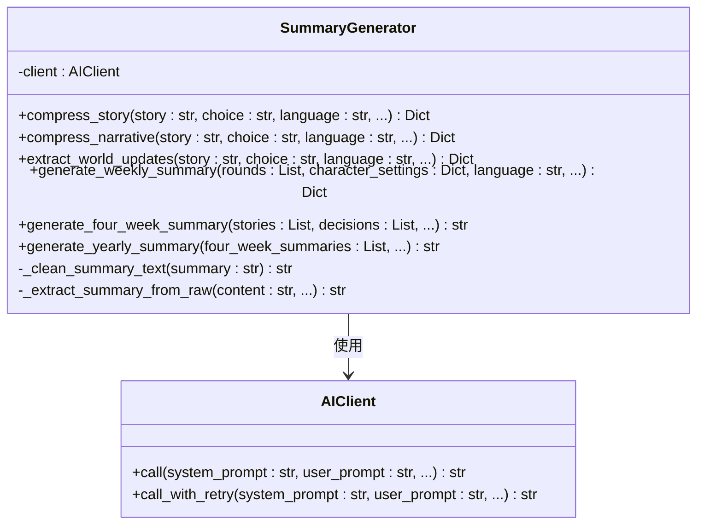
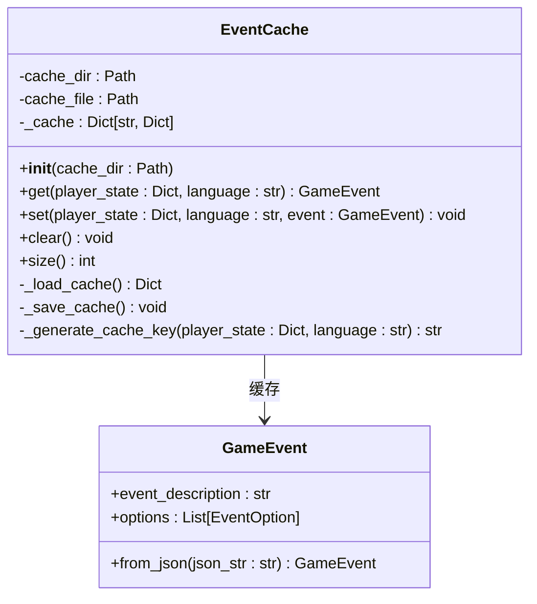
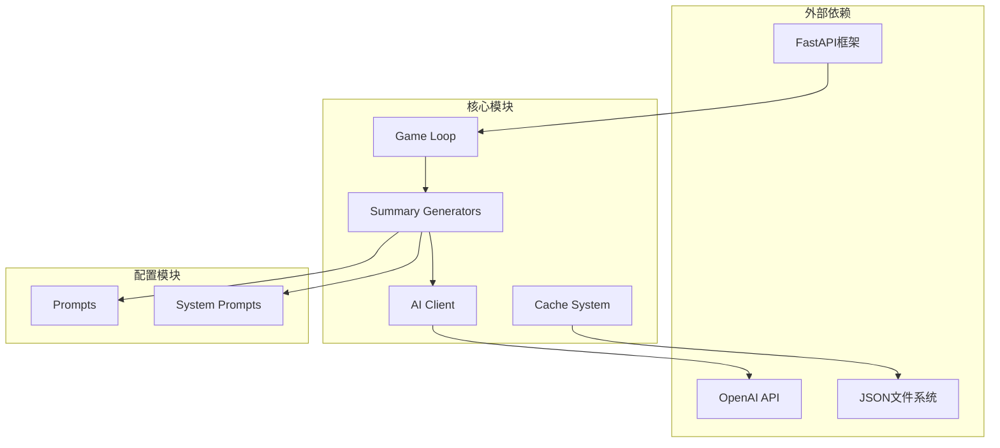

# 摘要生成系统

<cite>
**本文档引用的文件**
- [weekly_summary.py](file://src/game/weekly_summary.py)
- [monthly_summary.py](file://src/game/monthly_summary.py)
- [yearly_summary.py](file://src/game/yearly_summary.py)
- [historical_summary_selector.py](file://src/game/historical_summary_selector.py)
- [summary_generator.py](file://src/ai/summary_generator.py)
- [summary_prompts.py](file://config/prompts/summary_prompts.py)
- [game_loop.py](file://src/game/game_loop.py)
- [summary.py](file://src/api/routers/gameplay/summary.py)
- [cache.py](file://src/ai/cache.py)
- [events_cache.json](file://data/cache/events_cache.json)
</cite>

## 目录
1. [简介](#简介)
2. [项目结构](#项目结构)
3. [核心组件](#核心组件)
4. [架构概览](#架构概览)
5. [详细组件分析](#详细组件分析)
6. [依赖关系分析](#依赖关系分析)
7. [性能考虑](#性能考虑)
8. [故障排除指南](#故障排除指南)
9. [结论](#结论)
10. [附录](#附录)

## 简介

摘要生成系统是故事驱动游戏中用于生成和管理各类时间维度摘要的核心功能模块。该系统支持周摘要、月摘要、年摘要和自定义时间段摘要的生成，为玩家提供游戏进度回顾、角色成长追踪和故事线管理功能。

系统采用多层摘要生成架构，结合AI生成器、提示词模板和缓存机制，实现了高效、可扩展的摘要生成功能。通过智能的时间节点控制和条件判断逻辑，系统能够在合适的游戏时刻生成相应的摘要内容，为玩家的游戏体验提供重要支撑。

## 项目结构

摘要生成系统主要分布在以下目录和文件中：

**图表来源**
- [weekly_summary.py](file://src/game/weekly_summary.py#L1-L120)
- [monthly_summary.py](file://src/game/monthly_summary.py#L1-L139)
- [yearly_summary.py](file://src/game/yearly_summary.py#L1-L171)
- [game_loop.py](file://src/game/game_loop.py#L395-L592)

**章节来源**
- [weekly_summary.py](file://src/game/weekly_summary.py#L1-L120)
- [monthly_summary.py](file://src/game/monthly_summary.py#L1-L139)
- [yearly_summary.py](file://src/game/yearly_summary.py#L1-L171)
- [game_loop.py](file://src/game/game_loop.py#L395-L592)

## 核心组件

摘要生成系统由多个核心组件构成，每个组件负责特定类型的摘要生成和管理：

### 1. 摘要生成器类族

系统采用统一的摘要生成器类族，包括：

- **WeeklySummaryGenerator**: 周摘要生成器
- **MonthlySummaryGenerator**: 月摘要生成器  
- **YearlySummaryGenerator**: 年摘要生成器
- **SummaryGenerator**: 综合摘要生成器

### 2. 历史摘要选择器

**HistoricalSummarySelector**: 基于相关性的历史摘要选择器，能够智能选择最相关的周摘要和年摘要用于故事生成。

### 3. AI生成服务

**SummaryGenerator**: 提供多种摘要生成能力，包括故事压缩、周摘要、四周期摘要和年摘要生成。

### 4. 缓存系统

**EventCache**: 事件缓存系统，减少重复的AI调用，提高系统性能。

**章节来源**
- [weekly_summary.py](file://src/game/weekly_summary.py#L11-L120)
- [monthly_summary.py](file://src/game/monthly_summary.py#L11-L139)
- [yearly_summary.py](file://src/game/yearly_summary.py#L11-L171)
- [historical_summary_selector.py](file://src/game/historical_summary_selector.py#L14-L206)
- [summary_generator.py](file://src/ai/summary_generator.py#L17-L589)
- [cache.py](file://src/ai/cache.py#L13-L139)

## 架构概览

摘要生成系统采用分层架构设计，实现了清晰的职责分离和模块化组织：

**图表来源**
- [summary.py](file://src/api/routers/gameplay/summary.py#L85-L173)
- [game_loop.py](file://src/game/game_loop.py#L458-L504)
- [cache.py](file://src/ai/cache.py#L78-L101)

系统架构特点：

1. **分层设计**: 游戏逻辑层、AI生成层、API接口层职责清晰分离
2. **缓存策略**: 智能缓存机制减少重复计算
3. **错误处理**: 多层重试和降级机制确保系统稳定性
4. **扩展性**: 插件化的提示词系统支持多语言和定制化

## 详细组件分析

### 周摘要生成器

周摘要生成器负责生成每周的游戏摘要，重点关注玩家一周内的变化和决策：

**图表来源**
- [weekly_summary.py](file://src/game/weekly_summary.py#L11-L120)

周摘要生成特点：

- **变化计算**: 自动计算精力、情绪、学识、财富的周变化量
- **智能提示**: 基于变化量和决策数量生成个性化摘要
- **多语言支持**: 支持中文和英文两种语言输出
- **降级机制**: AI生成失败时提供备用摘要模板

**章节来源**
- [weekly_summary.py](file://src/game/weekly_summary.py#L25-L120)

### 月摘要生成器

月摘要生成器负责生成每月的综合摘要，整合整个月的游戏体验：

**图表来源**
- [monthly_summary.py](file://src/game/monthly_summary.py#L25-L139)

月摘要生成逻辑：

- **时间范围**: 明确的月度时间范围标识
- **决策筛选**: 提取关键决策用于摘要重点
- **状态对比**: 展示月度开始和结束的状态差异
- **智能权重**: 关键决策按重要性排序

**章节来源**
- [monthly_summary.py](file://src/game/monthly_summary.py#L25-L139)

### 年摘要生成器

年摘要生成器负责生成年度回顾，整合一年中的所有摘要内容：

**图表来源**
- [yearly_summary.py](file://src/game/yearly_summary.py#L11-L171)
- [summary_generator.py](file://src/ai/summary_generator.py#L440-L487)

年摘要生成特色：

- **多层摘要融合**: 结合月摘要和关键决策生成年度回顾
- **时间跨度**: 支持48周（一年）的完整时间范围
- **成长轨迹**: 强调角色一年来的成长和变化
- **转折点识别**: 突出一年中的重要事件和决策

**章节来源**
- [yearly_summary.py](file://src/game/yearly_summary.py#L25-L171)
- [summary_generator.py](file://src/ai/summary_generator.py#L440-L487)

### 历史摘要选择器

历史摘要选择器实现了智能的历史摘要选择机制：

**图表来源**
- [historical_summary_selector.py](file://src/game/historical_summary_selector.py#L17-L206)

选择器算法特点：

- **相关性评分**: 基于关键词匹配和时间衰减计算相关性
- **智能回退**: 无关键词时采用随机选择策略
- **时间权重**: 距离越近的摘要权重越高
- **阈值过滤**: 设置最低相关性阈值确保摘要质量

**章节来源**
- [historical_summary_selector.py](file://src/game/historical_summary_selector.py#L17-L206)

### AI摘要生成服务

AI摘要生成服务提供了强大的文本生成能力：

**图表来源**
- [summary_generator.py](file://src/ai/summary_generator.py#L17-L589)

AI生成服务特性：

- **多模态生成**: 支持故事压缩、摘要生成、世界状态提取
- **JSON解析**: 自动解析AI响应中的JSON结构
- **错误恢复**: 多层重试和降级机制
- **文本清理**: 自动清理代码块标记和格式问题

**章节来源**
- [summary_generator.py](file://src/ai/summary_generator.py#L17-L589)

### 缓存系统

缓存系统通过事件缓存减少重复的AI调用：

**图表来源**
- [cache.py](file://src/ai/cache.py#L13-L139)

缓存策略：

- **智能键生成**: 基于玩家状态生成缓存键
- **30%命中率**: 控制缓存命中率确保内容多样性
- **文件持久化**: 使用JSON文件存储缓存数据
- **自动清理**: 支持缓存清空和大小查询

**章节来源**
- [cache.py](file://src/ai/cache.py#L13-L139)
- [events_cache.json](file://data/cache/events_cache.json#L1-L800)

## 依赖关系分析

摘要生成系统的依赖关系体现了清晰的分层架构：

**图表来源**
- [game_loop.py](file://src/game/game_loop.py#L395-L592)
- [summary_generator.py](file://src/ai/summary_generator.py#L17-L589)
- [summary_prompts.py](file://config/prompts/summary_prompts.py#L1-L972)

依赖关系特点：

- **单向依赖**: 从底层到上层的清晰依赖链
- **接口抽象**: 通过接口定义模块间的契约
- **配置注入**: 通过配置模块提供可定制化支持
- **错误隔离**: 各层独立处理错误，避免级联故障

**章节来源**
- [summary_prompts.py](file://config/prompts/summary_prompts.py#L1-L972)
- [summary.py](file://src/api/routers/gameplay/summary.py#L1-L234)

## 性能考虑

摘要生成系统在性能方面采用了多项优化策略：

### 1. 缓存优化

- **命中率控制**: 30%的缓存命中率平衡性能和多样性
- **智能键生成**: 基于状态特征生成稳定缓存键
- **文件持久化**: 使用JSON文件实现快速读写

### 2. AI调用优化

- **重试机制**: 多层重试确保AI调用成功率
- **温度控制**: 合理的温度参数平衡创造性和一致性
- **令牌限制**: 4096令牌上限防止过度消耗

### 3. 内存管理

- **增量生成**: 按需生成摘要，避免内存峰值
- **对象复用**: 生成器对象复用减少GC压力
- **数据清理**: 及时清理临时数据和缓存

### 4. 网络优化

- **连接池**: AI客户端连接池复用网络连接
- **超时控制**: 合理的超时设置避免长时间阻塞
- **错误恢复**: 网络异常时的快速失败和重试

## 故障排除指南

### 常见问题及解决方案

#### 1. AI生成失败

**症状**: 摘要生成异常或返回默认文本

**诊断步骤**:
1. 检查AI服务可用性
2. 验证API密钥配置
3. 查看网络连接状态
4. 检查令牌配额

**解决方案**:
- 实施重试机制
- 使用降级摘要模板
- 记录详细的错误日志

#### 2. 缓存失效

**症状**: 缓存数据损坏或过期

**诊断步骤**:
1. 检查缓存文件完整性
2. 验证JSON格式正确性
3. 确认文件权限正常

**解决方案**:
- 实现缓存校验机制
- 提供缓存重建功能
- 设置缓存自动清理

#### 3. 性能问题

**症状**: 摘要生成响应缓慢

**诊断步骤**:
1. 监控AI调用延迟
2. 检查缓存命中率
3. 分析内存使用情况

**解决方案**:
- 优化提示词长度
- 调整缓存策略
- 实施异步处理

**章节来源**
- [summary_generator.py](file://src/ai/summary_generator.py#L488-L589)
- [cache.py](file://src/ai/cache.py#L28-L46)

## 结论

摘要生成系统通过精心设计的架构和多项优化策略，为游戏提供了强大而高效的摘要生成功能。系统支持多时间维度的摘要生成，具备智能的历史摘要选择能力和完善的缓存机制。

系统的主要优势包括：

1. **多层架构**: 清晰的职责分离和模块化设计
2. **智能缓存**: 平衡性能和多样性的缓存策略
3. **错误处理**: 完善的重试和降级机制
4. **扩展性**: 插件化的提示词系统支持定制化
5. **性能优化**: 多项性能优化策略确保系统稳定运行

该系统不仅满足了游戏摘要生成的核心需求，还为未来的功能扩展和性能优化奠定了坚实基础。

## 附录

### API接口定义

系统提供RESTful API接口用于摘要生成：

| 接口 | 方法 | 描述 |
|------|------|------|
| `/{game_id}/state` | GET | 获取游戏状态和进度信息 |
| `/{game_id}/summary` | POST | 生成完整游戏摘要 |
| `/{game_id}/ending` | GET | 获取游戏结局评估 |

### 配置选项

系统支持多种配置选项：

- **语言设置**: 中文/英文双语支持
- **缓存策略**: 可调整的缓存命中率
- **AI参数**: 温度、最大令牌数等参数调节
- **提示词模板**: 可定制的提示词内容

### 监控指标

系统监控关键性能指标：

- **生成时间**: 摘要生成的平均响应时间
- **缓存命中率**: 缓存使用的有效性
- **AI调用成功率**: AI服务的可靠性
- **错误率**: 系统错误发生的频率