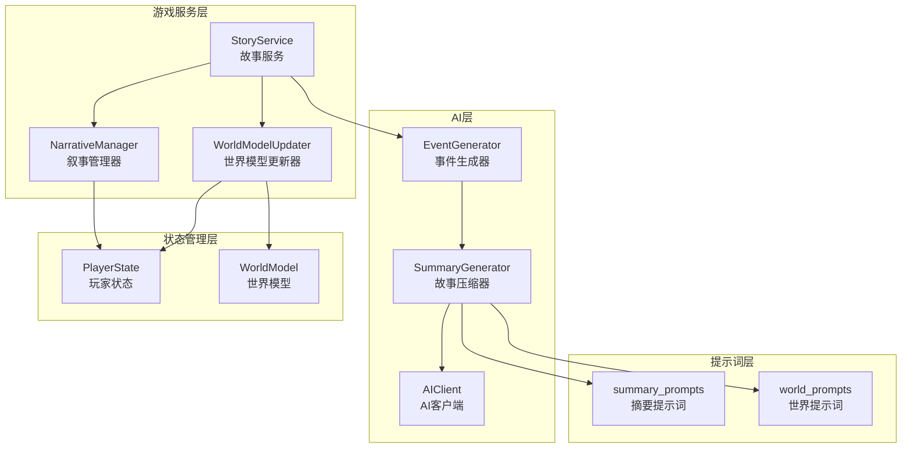
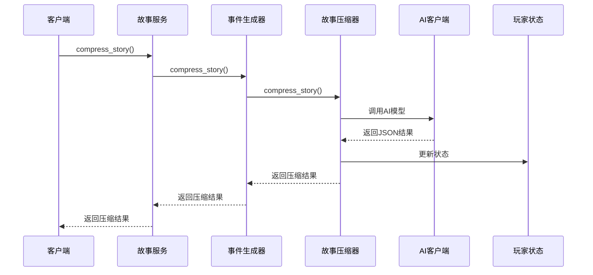
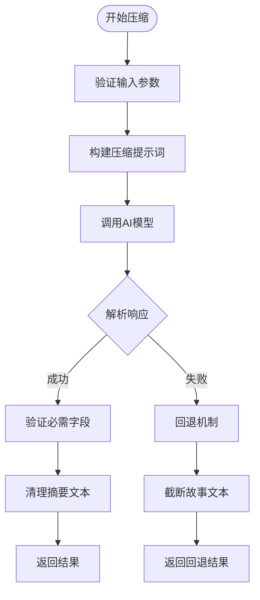
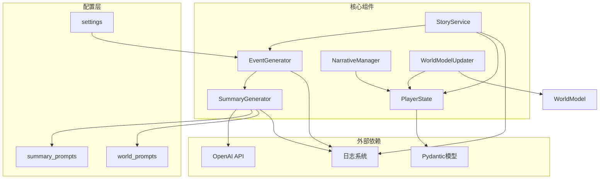
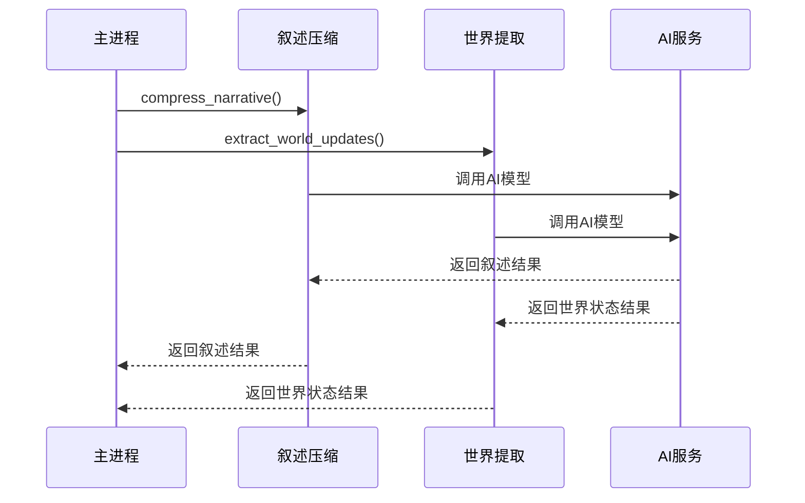

# 故事压缩系统

<cite>
**本文档引用的文件**
- [src/ai/summary_generator.py](file://src/ai/summary_generator.py)
- [src/ai/generator.py](file://src/ai/generator.py)
- [src/game/story_service.py](file://src/game/story_service.py)
- [src/game/narrative_manager.py](file://src/game/narrative_manager.py)
- [src/game/world_model_updater.py](file://src/game/world_model_updater.py)
- [src/game/state/player_state.py](file://src/game/state/player_state.py)
- [config/prompts/summary_prompts.py](file://config/prompts/summary_prompts.py)
- [config/prompts/world_prompts.py](file://config/prompts/world_prompts.py)
- [src/game/world_model.py](file://src/game/world_model.py)
</cite>

## 目录
1. [简介](#简介)
2. [项目结构](#项目结构)
3. [核心组件](#核心组件)
4. [架构概览](#架构概览)
5. [详细组件分析](#详细组件分析)
6. [依赖关系分析](#依赖关系分析)
7. [性能考虑](#性能考虑)
8. [故障排除指南](#故障排除指南)
9. [结论](#结论)
10. [附录](#附录)

## 简介

故事压缩系统是人生模拟游戏的核心组件，负责将玩家的游戏体验转化为结构化的叙述信息。该系统通过AI驱动的方法，将复杂的故事情节压缩为可管理的摘要，同时提取世界状态的关键更新信息。

系统主要包含三个核心方法：
- `compress_story`: 完整压缩方法，生成100字符摘要并提取所有世界状态更新
- `compress_narrative`: 并行友好压缩方法，专注于叙述层面的摘要和情节状态评估
- `extract_world_updates`: 专门的压缩方法，提取世界事实、人物习惯和其他世界状态更新

## 项目结构

故事压缩系统采用模块化设计，主要分布在以下几个核心模块中：

**图表来源**
- [src/ai/summary_generator.py](file://src/ai/summary_generator.py#L17-L140)
- [src/ai/generator.py](file://src/ai/generator.py#L30-L66)
- [src/game/story_service.py](file://src/game/story_service.py#L11-L17)

**章节来源**
- [src/ai/summary_generator.py](file://src/ai/summary_generator.py#L1-L589)
- [src/ai/generator.py](file://src/ai/generator.py#L1-L497)
- [src/game/story_service.py](file://src/game/story_service.py#L1-L312)

## 核心组件

### SummaryGenerator - 故事压缩器

SummaryGenerator是系统的核心组件，负责执行具体的压缩任务。它提供了三种不同的压缩方法：

1. **完整压缩方法** (`compress_story`)
   - 生成500字符以内的摘要
   - 评估情节状态（新建、解决、继续）
   - 判断事件是否完结
   - 提取世界事实更新
   - 识别伏笔种子
   - 跟踪人物习惯变化

2. **并行友好压缩方法** (`compress_narrative`)
   - 专注于叙述层面的摘要
   - 评估情节状态
   - 判断事件完结状态
   - 设计用于与世界状态提取并行执行

3. **世界状态提取方法** (`extract_world_updates`)
   - 提取世界事实更新
   - 识别伏笔种子
   - 跟踪人物习惯变化
   - 处理位置、职业、承诺、因果链更新

### StoryService - 故事服务

StoryService作为对外接口，封装了所有压缩相关的功能，提供统一的API给上层调用。

### NarrativeManager - 叙事管理器

负责处理从压缩结果中提取的各种叙事状态更新，包括：
- 未完结剧情线的管理
- 世界事实的维护
- 伏笔种子的激活机制
- 人物习惯的追踪和更新

### WorldModelUpdater - 世界模型更新器

将压缩结果转换为结构化的世界模型数据，支持：
- 位置信息的更新和查询
- 职业发展的记录
- 承诺和因果链的管理
- 动态事实的分析和存储

**章节来源**
- [src/ai/summary_generator.py](file://src/ai/summary_generator.py#L25-L300)
- [src/game/story_service.py](file://src/game/story_service.py#L118-L141)
- [src/game/narrative_manager.py](file://src/game/narrative_manager.py#L15-L584)
- [src/game/world_model_updater.py](file://src/game/world_model_updater.py#L15-L712)

## 架构概览

故事压缩系统采用分层架构设计，确保了高内聚低耦合的特性：

**图表来源**
- [src/game/story_service.py](file://src/game/story_service.py#L118-L133)
- [src/ai/generator.py](file://src/ai/generator.py#L333-L350)
- [src/ai/summary_generator.py](file://src/ai/summary_generator.py#L25-L140)

系统的核心设计理念：

1. **模块化分离**: 每个组件都有明确的职责边界
2. **并行处理**: 支持压缩和世界状态提取的并行执行
3. **状态管理**: 通过PlayerState统一管理所有游戏状态
4. **AI集成**: 通过AIClient抽象AI服务调用
5. **可扩展性**: 支持新的压缩方法和状态类型的添加

**章节来源**
- [src/ai/generator.py](file://src/ai/generator.py#L30-L66)
- [src/game/state/player_state.py](file://src/game/state/player_state.py#L15-L135)

## 详细组件分析

### compress_story 方法详解

compress_story是系统中最完整的压缩方法，负责执行所有类型的压缩任务：

#### 输入参数
- `story`: 完整的故事文本（1500-2000字符）
- `choice`: 玩家的选择文本
- `language`: 语言代码（'zh'或'en'）
- `pending_storylines`: 当前未完结的剧情线列表
- `established_facts`: 当前已建立的世界事实
- `character_habits`: 当前记录的人物习惯

#### 输出结构
压缩结果包含以下关键字段：
- `summary`: 500字符以内的摘要
- `event_concluded`: 事件是否完结的布尔值
- `storyline_updates`: 情节状态更新列表
- `fact_updates`: 世界事实更新列表
- `foreshadowing_seeds`: 伏笔种子列表
- `habit_updates`: 人物习惯更新列表

#### 算法流程

**图表来源**
- [src/ai/summary_generator.py](file://src/ai/summary_generator.py#L25-L140)

#### 错误处理机制
系统实现了多层错误处理：
1. **AI调用失败**: 自动重试一次，使用错误反馈信息
2. **JSON解析失败**: 尝试从原始响应中提取摘要
3. **回退机制**: 最终使用故事文本的截断版本

**章节来源**
- [src/ai/summary_generator.py](file://src/ai/summary_generator.py#L25-L140)

### compress_narrative 方法详解

compress_narrative是专为并行处理设计的压缩方法：

#### 设计目标
- 专注于叙述层面的压缩
- 支持与世界状态提取的并行执行
- 减少整体处理时间

#### 参数简化
相比完整压缩方法，compress_narrative省略了世界状态相关的参数：
- 移除了`established_facts`和`character_habits`参数
- 专注于`pending_storylines`的处理

#### 输出精简
返回的JSON结构更加简洁：
- `summary`: 叙述摘要
- `event_concluded`: 事件完结状态
- `storyline_updates`: 情节状态更新

**章节来源**
- [src/ai/summary_generator.py](file://src/ai/summary_generator.py#L144-L226)
- [config/prompts/summary_prompts.py](file://config/prompts/summary_prompts.py#L721-L795)

### extract_world_updates 方法详解

extract_world_updates专门负责从故事中提取世界状态信息：

#### 提取范围
系统能够识别和提取以下类型的更新：
1. **世界事实更新** (`fact_updates`)
   - 新增事实
   - 更新现有事实
   - 移除无效事实

2. **伏笔种子** (`foreshadowing_seeds`)
   - 神秘元素
   - 关系暗线
   - 警告预兆
   - 潜在机会
   - 行为种子
   - 人物线索

3. **人物习惯更新** (`habit_updates`)
   - 新习惯的建立
   - 现有习惯的强化或弱化
   - 习惯的移除或改变

4. **位置变动** (`location_updates`)
   - 人物的地理移动
   - 位置的确认

5. **职业变动** (`career_updates`)
   - 新的工作机会
   - 升职或调动
   - 辞职或被解雇

6. **承诺约定** (`commitment_updates`)
   - 新的承诺或约定
   - 承诺的履行、违背或过期

7. **因果链** (`causal_updates`)
   - 新的因果关系
   - 因果链的解决

#### 提示词设计
extract_world_updates使用专门的提示词模板，重点关注世界状态的提取，避免不必要的叙述内容。

**章节来源**
- [src/ai/summary_generator.py](file://src/ai/summary_generator.py#L228-L300)
- [config/prompts/world_prompts.py](file://config/prompts/world_prompts.py#L35-L263)

### 参数作用与更新机制

#### pending_storylines 参数
- **作用**: 维护游戏中未完结的重要剧情线
- **更新机制**: 
  - 新增：当故事中出现重要但未解决的事件时
  - 解决：当相关事件得到明确结局时
  - 继续：当事件持续发展时
- **管理策略**: 自动清理过期的剧情线，根据重要性设置不同的过期时间

#### established_facts 参数
- **作用**: 存储游戏中已建立的世界事实，确保叙述一致性
- **分类体系**: 
  - `location`: 地理位置
  - `role`: 人物角色/身份
  - `situation`: 正在进行的事务
- **更新策略**: 
  - 限制总数不超过50个
  - 自动清理最旧的事实
  - 支持事实的新增、更新和删除

#### character_habits 参数
- **作用**: 跟踪人物的行为习惯、言语模式、情感模式等
- **分类体系**:
  - `behavioral`: 行为习惯
  - `speech`: 言语习惯
  - `emotional`: 情绪模式
  - `social`: 社交习惯
  - `lifestyle`: 生活方式
- **强度等级**:
  - `strong`: 根深蒂固
  - `moderate`: 明显习惯
  - `emerging`: 初现习惯
- **管理策略**: 
  - 每个角色最多10个习惯
  - 自动清理最弱或最久未出现的习惯

**章节来源**
- [src/game/narrative_manager.py](file://src/game/narrative_manager.py#L22-L583)
- [src/game/world_model_updater.py](file://src/game/world_model_updater.py#L22-L290)

## 依赖关系分析

故事压缩系统各组件之间的依赖关系如下：

**图表来源**
- [src/ai/summary_generator.py](file://src/ai/summary_generator.py#L1-L22)
- [src/ai/generator.py](file://src/ai/generator.py#L17-L25)
- [src/game/story_service.py](file://src/game/story_service.py#L4-L6)

### 组件耦合度分析

系统采用了松耦合的设计原则：

1. **AI客户端抽象**: 通过AIClient抽象AI服务调用，便于替换不同的AI提供商
2. **提示词独立**: 提示词模块独立于核心逻辑，便于修改和优化
3. **状态管理分离**: PlayerState集中管理所有游戏状态，避免状态分散
4. **接口层封装**: StoryService提供统一的对外接口，隐藏内部实现细节

**章节来源**
- [src/ai/generator.py](file://src/ai/generator.py#L30-L66)
- [src/game/state/player_state.py](file://src/game/state/player_state.py#L15-L135)

## 性能考虑

### 并行处理优化

系统支持压缩和世界状态提取的并行执行，显著提升处理效率：

**图表来源**
- [src/ai/summary_generator.py](file://src/ai/summary_generator.py#L144-L226)
- [src/ai/summary_generator.py](file://src/ai/summary_generator.py#L228-L300)

### 缓存机制

系统实现了多层次的缓存策略：

1. **事件缓存**: 避免重复生成相同的事件
2. **提示词缓存**: 缓存常用的提示词模板
3. **AI响应缓存**: 缓存AI的响应结果

### 内存管理

- **状态限制**: 对各种状态列表设置最大长度限制
- **自动清理**: 定期清理过期的状态数据
- **增量更新**: 只更新发生变化的数据

### 处理时间优化

- **并行执行**: 叙述压缩和世界提取并行进行
- **智能重试**: 失败时自动重试并提供错误反馈
- **回退机制**: 在AI服务不可用时使用回退方案

**章节来源**
- [src/ai/generator.py](file://src/ai/generator.py#L54-L56)
- [src/ai/summary_generator.py](file://src/ai/summary_generator.py#L60-L130)

## 故障排除指南

### 常见问题及解决方案

#### AI服务调用失败
**症状**: 压缩过程抛出异常或返回空结果
**解决方案**:
1. 检查网络连接和API密钥配置
2. 查看日志中的错误信息
3. 使用回退机制生成简化结果

#### JSON解析失败
**症状**: AI返回的不是有效的JSON格式
**解决方案**:
1. 检查提示词模板的完整性
2. 验证AI模型的配置
3. 使用文本提取功能从原始响应中提取摘要

#### 状态数据异常
**症状**: 游戏状态显示不正确或出现逻辑错误
**解决方案**:
1. 检查状态更新逻辑
2. 验证数据验证规则
3. 重置到安全的状态

### 调试工具

系统提供了丰富的调试功能：

1. **详细日志**: 记录每个步骤的执行情况
2. **状态检查**: 提供状态查询和验证功能
3. **性能监控**: 监控处理时间和资源使用

**章节来源**
- [src/ai/summary_generator.py](file://src/ai/summary_generator.py#L126-L140)
- [src/ai/summary_generator.py](file://src/ai/summary_generator.py#L216-L226)

## 结论

故事压缩系统通过精心设计的架构和算法，成功实现了复杂故事情节的高效压缩和世界状态的准确提取。系统的主要优势包括：

1. **模块化设计**: 清晰的职责分离和接口定义
2. **并行处理**: 显著提升处理效率
3. **状态管理**: 统一的状态管理和一致性保证
4. **可扩展性**: 易于添加新的压缩方法和状态类型
5. **容错能力**: 完善的错误处理和回退机制

该系统为人生模拟游戏提供了强大的叙述生成能力，能够帮助玩家回顾游戏历程，管理复杂的故事情节，并维持世界状态的一致性。

## 附录

### 使用场景示例

#### 游戏历史管理
系统可以用于：
- 生成每周、每月、每年的游戏总结
- 创建可搜索的游戏历史记录
- 提供进度回顾和成就统计

#### 进度回顾
- 自动生成游戏里程碑事件
- 维护玩家的游戏成就记录
- 提供个性化的游戏体验报告

### 最佳实践建议

1. **合理使用并行处理**: 在需要快速响应的场景下优先使用并行压缩
2. **监控状态增长**: 定期检查各种状态列表的长度，避免过度增长
3. **优化提示词**: 根据具体需求调整提示词模板，提高压缩质量
4. **错误处理**: 建立完善的错误处理和监控机制